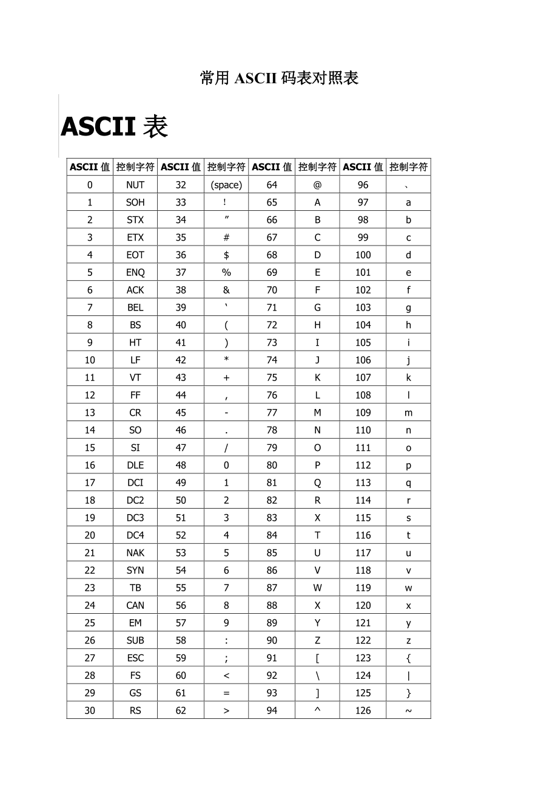
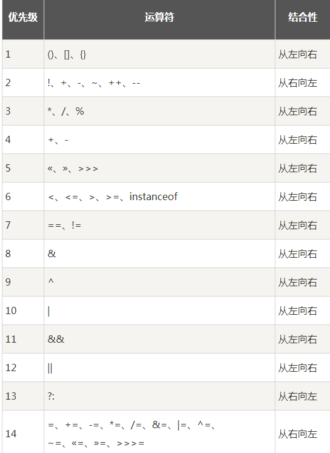
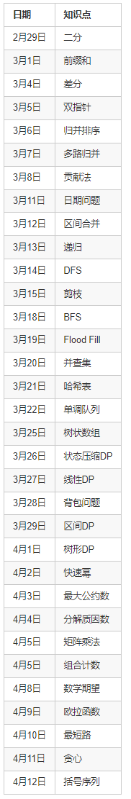
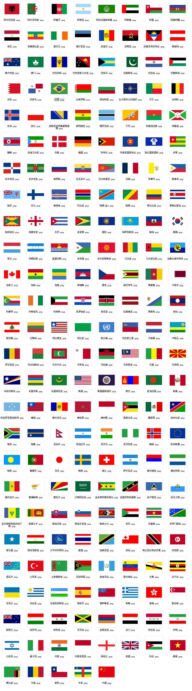

> 算法并不是最难的，因为这事逻辑。 真正困难的地方，是贪婪思维下的隐性决策，那是无法细节预测和探索的。 

- 数组不变，区间查询：前缀和、树状数组、线段树；
- 数组单点修改，区间查询：树状数组、线段树；
- 数组区间修改，单点查询：差分、线段树；
- 数组区间修改，区间查询：线段树。
- 看到「最大化最小值」或者「最小化最大值」就要想到二分答案，这是一个固定的套路。
- 为什么？一般来说，二分的值越大，越能/不能满足要求；二分的值越小，越不能/能满足要求，有单调性，可以二分。
- ”漫步人生路“好听！！！
- 48～57为0到9十个阿拉伯数字；65～90为26个大写英文字母，97～122号为26个小写英文字母
- 字符串大小写互换：c^=32
- 判断一个字符是数字：Character.isDigit(c)
- 二进制一个数是0b开头
- **int**:
  - 范围为 -2^31 到 2^31 - 1，可以表示为 -2 * 10^9 到 2 * 10^9。
- **long**:
  - 范围为 -2^63 到 2^63 - 1，可以表示为 -9 * 10^18 到 9 * 10^18。
- 
- 
- 
- 
- 