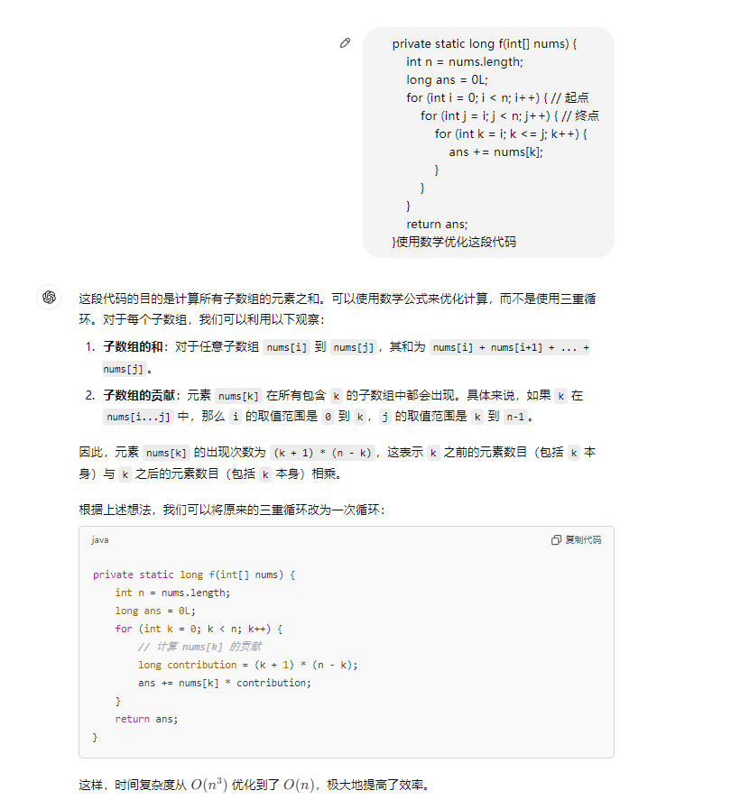

## 2024/11/18

[E - Sum of All Substrings ](https://atcoder.jp/contests/abc379/tasks/abc379_e)

## 2024/11/11

[1547. 切棍子的最小成本](https://leetcode.cn/problems/minimum-cost-to-cut-a-stick/) 

[3347. 执行操作后元素的最高频率 II](https://leetcode.cn/problems/maximum-frequency-of-an-element-after-performing-operations-ii/) 

[3351. 好子序列的元素之和](https://leetcode.cn/problems/sum-of-good-subsequences/) 

## 2024/11/8

[D - Pedometer ](https://atcoder.jp/contests/abc367/tasks/abc367_d)

[E - Manhattan Multifocal Ellipse ](https://atcoder.jp/contests/abc366/tasks/abc366_e)

## 2024/11/7

## 2024/11/6

[中奖编号【算法赛】 ](https://www.lanqiao.cn/problems/19979/learning/?contest_id=216)

[小苯的字符提前 ](https://ac.nowcoder.com/acm/contest/93847/F)

[2156. 查找给定哈希值的子串](https://leetcode.cn/problems/find-substring-with-given-hash-value/) 

## 2024/11/5

[3343. 统计平衡排列的数目](https://leetcode.cn/problems/count-number-of-balanced-permutations/) 

[小苯的蓄水池（hard)](https://ac.nowcoder.com/acm/contest/93847/E)【两个方法】

## 2024/11/4

## 2024/11/3

[ 蓝桥派对【算法赛】 ](https://www.lanqiao.cn/problems/19978/learning/?contest_id=216)(太板了)

## 2024/11/2

[D - Buildings ](https://atcoder.jp/contests/abc372/tasks/abc372_d)

[小H学数学 ](https://ac.nowcoder.com/acm/contest/94114/B)

## 2024/11/1

[D - Hidden Weights ](https://atcoder.jp/contests/abc373/tasks/abc373_d)

## 2024/10/31

[3165. 不包含相邻元素的子序列的最大和](https://leetcode.cn/problems/maximum-sum-of-subsequence-with-non-adjacent-elements/) 

[D - Laser Marking ](https://atcoder.jp/contests/abc374/tasks/abc374_d)

[E - Sensor Optimization Dilemma 2 ](https://atcoder.jp/contests/abc374/tasks/abc374_e)

[E - 3 Team Division 【超级模板题】](https://atcoder.jp/contests/abc375/tasks/abc375_e)

## 2024/10/30

[3337. 字符串转换后的长度 II](https://leetcode.cn/problems/total-characters-in-string-after-transformations-ii/) 

## 2024/10/29

[3331. 修改后子树的大小](https://leetcode.cn/problems/find-subtree-sizes-after-changes/) 

[D - Many Segments 2 ](https://atcoder.jp/contests/abc377/tasks/abc377_d)

[E - Permute K times 2 ](https://atcoder.jp/contests/abc377/tasks/abc377_e)

## 2024/10/28

[685. 冗余连接 II](https://leetcode.cn/problems/redundant-connection-ii/) 

[乌鸦-构造套路题](https://ac.nowcoder.com/acm/contest/92972/G)

## 2024/10/27

[状压dp练习题](https://ac.nowcoder.com/acm/contest/92972/D) 

## 2024/10/25

[3181. 执行操作可获得的最大总奖励 II](https://leetcode.cn/problems/maximum-total-reward-using-operations-ii/) 

> java流操作：Arrays.stream(nums).distinct().sorted.toArray();

## 2024/10/24

[214. 最短回文串](https://leetcode.cn/problems/shortest-palindrome/) 

[1960. 两个回文子字符串长度的最大乘积](https://leetcode.cn/problems/maximum-product-of-the-length-of-two-palindromic-substrings/) 

[整数对](https://www.lanqiao.cn/problems/19952/learning/?contest_id=214)

> 贡献法：nums[k]出现在nums[i...j]，那么i的取值是[0, k], j 的取值是[k, n - 1]
>
> 

## 2024/10/23

[小红的字符串重排 ](https://ac.nowcoder.com/acm/contest/92662/E)

[2412. 完成所有交易的初始最少钱数](https://leetcode.cn/problems/minimum-money-required-before-transactions/) 

## 2024/10/22

[502. IPO](https://leetcode.cn/problems/ipo/) 

[373. 查找和最小的 K 对数字](https://leetcode.cn/problems/find-k-pairs-with-smallest-sums/) 

## 2024/10/15

[480. 滑动窗口中位数](https://leetcode.cn/problems/sliding-window-median/) 

## 2024/10/14

[1871. 跳跃游戏 VII](https://leetcode.cn/problems/jump-game-vii/) （前缀和优化dp）

[887. 鸡蛋掉落](https://leetcode.cn/problems/super-egg-drop/) 

## 2024/10/13

[1884. 鸡蛋掉落-两枚鸡蛋](https://leetcode.cn/problems/egg-drop-with-2-eggs-and-n-floors/) 

## 2024/10/12

[【图上dp + dijkastra转移】](https://ac.nowcoder.com/acm/contest/91355/D)

```java
private static void solve() throws IOException {
        ss = sc.nextLine().split(" ");
        int n = Integer.parseInt(ss[0]), m = Integer.parseInt(ss[1]), k = Integer.parseInt(ss[2]);
        ss = sc.nextLine().split(" ");
        int[] nums = new int[n];
        for (int i = 0; i < n; i++) {
            nums[i] = Integer.parseInt(ss[i]);
        }
        g = new List[n];
        Arrays.setAll(g, e -> new ArrayList<>());
        for (int i = 0; i < m; i++) {
            int x = sc.nextInt() - 1, y = sc.nextInt() - 1;
            g[x].add(y);
            g[y].add(x);
        }
        long[][] dp = new long[n][k + 1]; // 到达第i个节点，连续赶路j次的最低成本
        boolean[][] vis = new boolean[n][k + 1];
        for (int i = 0; i < n; i++) {
            Arrays.fill(dp[i], Long.MAX_VALUE / 2);
        }
        PriorityQueue<long[]> pq = new PriorityQueue<>((a, b) -> Long.compare(a[0], b[0]));
        if (k != 0) { // 在起点休息一次
            dp[0][1] = 1;
            pq.offer(new long[]{1, 0, 1}); // 到达当前节点的消耗， 当前节点的编号， 当前连续赶路次数
        }
        dp[0][0] = nums[0];
        pq.offer(new long[]{nums[0], 0, 0});
        while (!pq.isEmpty()) {
            long[] poll = pq.poll();
            long cost = poll[0];
            int i = (int) poll[1], j = (int) poll[2];
            if (vis[i][j]) {
                continue;
            }
            vis[i][j] = true;
            for (int y : g[i]) {
                if (dp[y][0] > nums[y] + cost) {
                    dp[y][0] = nums[y] + cost;
                    pq.offer(new long[]{dp[y][0], y, 0});
                }
                if (j + 1 <= k && dp[y][j + 1] > cost + 1) {
                    dp[y][j + 1] = cost + 1;
                    pq.offer(new long[]{dp[y][j + 1], y, j + 1});
                }
            }
        }
        long ans = Long.MAX_VALUE;
        for (int i = 0; i <= k; i++) {
            ans = Math.min(ans, dp[n - 1][i]);
        }
        sc.println(ans);
    }
```


## 2024/10/11

[3164. 优质数对的总数 II](https://leetcode.cn/problems/find-the-number-of-good-pairs-ii/) (分解因子)

[1871. 跳跃游戏 VII](https://leetcode.cn/problems/jump-game-vii/) （前缀和优化dp）

[1443. 收集树上所有苹果的最少时间](https://leetcode.cn/problems/minimum-time-to-collect-all-apples-in-a-tree/)

## 2024/9/20

[B. Longtail Hedgehog ](https://codeforces.com/problemset/problem/615/B)[树形dp]

```java
public class Main{
    private static void solve() throws IOException {
        n = sc.nextInt();
        m = sc.nextInt();
        g = new List[n+1];
        Arrays.setAll(g, e -> new ArrayList<>());
        int[] degree = new int[n + 1];
        for (int i = 0; i < m; i++) {
            int x = sc.nextInt(), y = sc.nextInt();
            if (x > y) {
                int tmp = x;
                x = y;
                y = tmp;
            }
            g[x].add(y);
            degree[x]++;
            degree[y]++;
        }
        int[] dp = new int[n + 1];
        Arrays.fill(dp, 1);
        for (int i = 1; i < n + 1; i++) {
            for (int j : g[i]) {
                dp[j] = Math.max(dp[j], dp[i] + 1);
            }
        }
        long ans = 0L;
        for (int i = 1; i < n + 1; i++) {
            ans = Math.max((long) dp[i] * degree[i], ans);
        }
        sc.println(ans);
    }
}
```


## 2024/9/19

[B. Nearest Fraction ](https://codeforces.com/problemset/problem/281/B)

```java
public class Main{
    private static void solve() throws IOException {
        long x = sc.nextInt(), y = sc.nextInt(), n = sc.nextInt();
        long g = gcd(x, y);
        x /= g;
        y /= g;
        if (n >= y) {
            sc.println(x + "/" + y);
            return;
        }
        double target = (double) x / y, ans = target;
        long a0 = 0, b0 = 0;
        for (int b = (int) n; b >= 0; b--) {
            int c = (int) (target * b);
            for (int a = c + 1; a >= Math.max(0, c - 1); a--) {
                if (Math.abs((double) a / b - target) - ans < 0.000000000000001) {
                    ans = Math.abs((double) a / b - target);
                    a0 = a;
                    b0 = b;
                }
            }
        }
        sc.println(a0 + "/" + b0);
    }

	private static long gcd(long a, long b) {
        return b == 0 ? a : gcd(b, a % b);
    }
}
```


## 2024/9/18

[D. Santa's Bot ](D. Santa's Bot )

```java
import java.util.*;

public class Main {
    static final int Mod = 998244353;
    static final int M = 1000000;
    static long[] f = new long[M + 1];
    static long[] g = new long[M + 1];
    static int[] cnt = new int[M + 1];
    static Scanner sc = new Scanner(System.in);

    public static void main(String[] args) {
        int n = sc.nextInt();
        f[0] = 1;
        for (int i = 1; i <= M; i++) {
            f[i] = f[i - 1] * i % Mod;
        }

        g[M] = quickPow(f[M], Mod - 2, Mod);
        for (int i = M; i >= 1; i--) {
            g[i - 1] = g[i] * i % Mod;
        }

        List<List<Integer>> pools = new ArrayList<>();
        for (int i = 0; i < n; i++) {
            int k = sc.nextInt();
            List<Integer> pool = new ArrayList<>();
            for (int j = 0; j < k; j++) {
                int x = sc.nextInt();
                pool.add(x);
                cnt[x]++;
            }
            pools.add(pool);
        }

        long ans = 0;
        for (List<Integer> pool : pools) {
            int k = pool.size();
            for (int v : pool) {
                ans = (ans + cnt[v] * inv(k) % Mod) % Mod;
            }
        }

        System.out.println(ans * inv(n) % Mod * inv(n) % Mod);
    }

    static long quickPow(long base, long power, long mod) {
        if (power == 0) return 1 % mod;
        long cur = quickPow(base, power / 2, mod);
        return (power % 2 == 1) ? base * cur % mod * cur % mod : cur * cur % mod;
    }

    static long inv(int x) {
        return f[x - 1] * g[x] % Mod;
    }
}
```


## 2024/9/17

[C. Ryouko's Memory Note ](https://codeforces.com/problemset/problem/433/C)

```java
public class Main{
    private static void solve() throws IOException {
        int n = sc.nextInt(), m = sc.nextInt();
        ss = sc.nextLine().split(" ");
        int[] nums = new int[m];
        for (int i = 0; i < m; i++) {
            nums[i] = Integer.parseInt(ss[i]);
        }
        long sum = 0, res = 0;
        List<Integer>[] g = new List[n + 1];
        long[] cur = new long[n + 1];
        Arrays.setAll(g, e -> new ArrayList<>());
        for (int i = 1; i < m; i++) {
            int v = Math.abs(nums[i] - nums[i - 1]);
            sum += v;
            if (nums[i] != nums[i - 1]) {
                cur[nums[i]] += v;
                cur[nums[i - 1]] += v;
                g[nums[i]].add(nums[i - 1]);
                g[nums[i - 1]].add(nums[i]);
            }
        }
        for (int i = 1; i <= n; i++) {
            if (!g[i].isEmpty()) {
                Collections.sort(g[i]);
                int mid = g[i].get(g[i].size() / 2); // 将i全部变成mid
                long cur_sum = 0;
                for (int x : g[i]) {
                    cur_sum += Math.abs(x - mid);
                }
                res = Math.max(res, cur[i] - cur_sum);
            }
        }
        sc.println(sum - res);
    }
}
```


## 2024/9/16

[C. Little Artem and Dance ](https://codeforces.com/problemset/problem/641/C)

```java
public class Main{
    private static void solve() throws IOException {
        int n = sc.nextInt(), q = sc.nextInt();
        int oddMove = 0, evenMove = 0, swap = 0;
        while (q-- > 0) {
            int t = sc.nextInt();
            if (t == 1) {
                int x = sc.nextInt() % n;
                oddMove += x;
                evenMove += x;
                swap ^= (x & 1); // 如果移动距离是奇数，则swap变化
            }else{
                if (swap == 1) {
                    evenMove++;
                    oddMove--;
                } else {
                    evenMove--;
                    oddMove++;
                }
                swap ^= 1;
            }
            oddMove %= n;
            evenMove %= n;
        }
        int[] ans = new int[n];
        for (int i = 0; i < n; i++) {
            if ((i & 1) == 1) {
                ans[(i + evenMove + n) % n] = i + 1;
            }else{
                ans[(i + oddMove + n) % n] = i + 1;
            }
        }
        for (int x : ans) {
            sc.print(x + " ");
        }
    }
}
```

## 2024/9/14

[C. Alyona and the Tree ](https://codeforces.com/problemset/problem/682/C)

```java
public class Main{
    private static void solve() throws IOException {
        n = sc.nextInt();
        nodes = new int[n + 1];
        ss = sc.nextLine().split(" ");
        for (int i = 1; i <= n; i++) {
            nodes[i] = Integer.parseInt(ss[i - 1]);
        }
        g = new List[n + 1];
        Arrays.setAll(g, e -> new ArrayList<int[]>());
        for (int x = 2; x <= n; x++) {
            int y = sc.nextInt();
            int z = sc.nextInt();
            g[x].add(new int[]{y, z});
            g[y].add(new int[]{x, z});
        }
        dfs(1, 0, 0);
        sc.println(n - ans);
    }

    private static void dfs(int x, int fa, long dis) {
        ans++;
        for (int[] y : g[x]) {
            if (y[0] != fa) {
                long dis0 = dis;
                dis += y[1];
                if (dis < 0) {
                    dis = 0; // 维护距离最大值
                }
                if (dis <= nodes[y[0]]) {
                    dfs(y[0], x, dis);
                }
                dis = dis0;
            }
        }
    }
}
```


## 2024/9/13

[C. Alyona and the Tree ](https://codeforces.com/problemset/problem/682/C)

**提示 1：** 题目中表面上是对 $v$ 加了限制，实际上是对 $u$ 进行了限制。具体是什么限制？

**提示 2：** 在一个节点 $u$ 不满足要求的情况下，整个子树都应该被删掉。

题目中给的条件是，任何一个点 $v$ 到其子树内节点 $u$ 的距离都不超过 $a_u$ 。但是子树是在动的，所以这个定义并不容易直接考虑。

反过来考虑，一旦有一个节点 $u$ 到任何一个祖先节点 $v$ 的距离超过了 $a_u$ ，那这个节点就不能要了。

因为祖先节点是固定的，所以这个刻画是更好处理的。

而一旦这个节点不要了，这个节点对应的子树也就都不能要了。

接下来唯一一件事就是，求出 $u$ 到其祖先的最远距离。

而这件事跟最大子段和的求法极其类似。考虑其父节点到祖先的对应的最远距离，则该节点如果到达父节点的祖先，则距离最大值为 “父节点的计算结果” 加上该点到父节点的距离；否则，答案就是到父节点的距离。使用这个 DP 关系即可。

而这个 DP 关系可以在从 $1$ 开始进行 DFS 的时候直接使用，而一旦遇到不合法的位置不往下 DFS 即可，我们直接考虑所有 DFS 过程中不经过的点的个数，即为答案。

时间复杂度为 $\mathcal{O}(n)$ 。

```java
public class Main{
    private static void solve() throws IOException {
        n = sc.nextInt();
        nodes = new int[n + 1];
        ss = sc.nextLine().split(" ");
        for (int i = 1; i <= n; i++) {
            nodes[i] = Integer.parseInt(ss[i - 1]);
        }
        g = new List[n + 1];
        Arrays.setAll(g, e -> new ArrayList<int[]>());
        for (int x = 2; x <= n; x++) {
            int y = sc.nextInt();
            int z = sc.nextInt();
            g[x].add(new int[]{y, z});
            g[y].add(new int[]{x, z});
        }
        dfs(1, 0, 0);
        sc.println(n - ans);
    }

    private static void dfs(int x, int fa, long dis) {
        ans++;
        for (int[] y : g[x]) {
            if (y[0] != fa) {
                long dis0 = dis;
                dis += y[1];
                if (dis < 0) {
                    dis = 0; // 维护距离最大值
                }
                if (dis <= nodes[y[0]]) {
                    dfs(y[0], x, dis);
                }
                dis = dis0;
            }
        }
    }
}
```


## 2024/9/12

[E. Elections ](https://codeforces.com/problemset/problem/1267/E)

**提示 1：** 我们只需要满足一个人的拿票比最后一个人多，于是只需要枚举这个人。

**提示 2：** 考虑两个人，我们要让一个人的选票比另一个人多，我们应该如何开启最多的投票站。

本题只需要让一个人的拿票比别人多，我们可以枚举这个人是谁，再看选哪个人最好。

考虑某个人 $i$ 的时候，其他人都不重要了，因此只需考虑两个人的情况下如何使得你选的这个人得票更多。

设你选的人的得票情况是 $a$ ，最后一个人的得票情况是 $b$ ，则要求 $\sum a_i\geq\sum b_i$ 。

移项后，有 $\sum (a_i-b_i)\geq 0$ ，因此只需关于 $a_i-b_i$ 逆序排序，取最大的若干个投票站且保证总和非负即可。

时间复杂度为 $\mathcal{O}(nm\log m)$ 。

```java
public class Main{
    private static void solve() throws IOException {
        int n = sc.nextInt(), m = sc.nextInt();
        int[][] grid = new int[m][n];
        for (int i = 0; i < m; i++) {
            ss = sc.nextLine().split(" ");
            for (int j = 0; j < n; j++) {
                grid[i][j] = Integer.parseInt(ss[j]);
            }
        }
        int ans = Integer.MAX_VALUE;
        ArrayList<Integer> list = new ArrayList<>();
        for (int i = 0; i < n - 1; i++) { // 枚举前n个人
            int[][] diff = new int[m][2];
            int sum = 0;
            for (int j = 0; j < m; j++) {
                diff[j][0] = grid[j][i] - grid[j][n - 1];
                diff[j][1] = j;
                sum += diff[j][0];
            }
            Arrays.sort(diff, (a, b) -> a[0] - b[0]);
            for (int j = 0; j < m; j++) {
                if (sum >= 0) {
                    if (j < ans) {
                        ans = j;
                        list.clear();
                        for (int k = 0; k < j; k++) {
                            list.add(diff[k][1]);
                        }
                    }
                }
                sum -= diff[j][0];
            }
        }
        if (ans == Integer.MAX_VALUE) {
            sc.println(m);
            for (int i = 1; i <= m; i++) {
                sc.print(i + " ");
            }
        }else{
            sc.println(ans);
            for (int x : list) {
                sc.print((x + 1) + " ");
            }
        }
    }
}
```

[D. TV Shows ](https://codeforces.com/problemset/problem/1061/D)

**提示 1：** 假设有一台电视，前后有两个阶段 $[l_1,r_1],[l_2,l_2]$ 都被使用了，那么重新租和直接保留两者的差别是什么？

**提示 2：** 可以把保留电视视为一种省钱的机会，即一种优惠券。

首先，考虑只有两个不交的时间段的情况。假设有先后两个区间 $[l_1,r_1],[l_2,l_2]$ 。

首先有基础成本 $(r_1-l_1+r_2-l_2)\times y$ 以及最开始租电视的成本 $x$ ，而如果我们选择保留电视，则中间需要支付的额外成本为 $(l_2-r_1-1)\times y$ ，否则，需要支付的额外成本为 $x$ ，我们可以选择其中较小者。

因此，保留电视相当于给了我们一种选择，让我们以可能比 $x$ 更低的价格租到电视。而其初始闲置时间越靠后，其带来的成本越低，省钱越多。相当于一个优惠券，每个优惠券记录其 $r_1+1$ 的数值，到 $l_2$ 时刻可以以 $(l_2-r_1-1)\times y$ 租到电视。

考虑原题的情况。每当一台电视用完，我们都可以把它转换为一张优惠券。此时如果新来了一个时段——

- 如果此时没有优惠券，则只能直接租电视。

- 如果此时有优惠券，则我们应当选择其中租金最便宜的，即 $r$ 最大、最晚结束使用的电视，看其和 $x$ 哪个更优。

    - 因为考虑此时的所有优惠券，如果其中有被使用的，一定是其中 $r$ 最大的若干个被使用。

    - 而使用顺序与最终的结果无关。其中优惠力度最低的优惠券可以与最后一次使用匹配，如果不比 $x$ 省钱，则这个优惠券不会被使用。

    - 为了达成力度最低优惠券和最后一次使用的贪心判断，我们应当从力度最高的优惠券开始使用。

从实现的角度来看，首先，我们需要对所有的电视时段进行排序；同时，我们需要维护当前可以使用的 “优惠券”，而 “优惠券” 的生效来源于电视的停止使用。

因此我们可以维护两个堆，一个小顶堆，维护目前尚未结束使用的电视，这样在顺序遍历 $l$ 时，可以快速取出所有当前已经结束使用的电视。一个大顶堆，方便找出最晚结束使用的电视，即优惠力度最大的一个优惠券。

时间复杂度为 $\mathcal{O}(n\log n)$ 。

```java
public class Main{
    private static void solve() throws IOException {
        int n = sc.nextInt();
        long x = sc.nextLong(), y = sc.nextLong();
        int[][] nums = new int[n][2];
        for (int i = 0; i < n; i++) {
            nums[i][0] = sc.nextInt();
            nums[i][1] = sc.nextInt();
        }
        Arrays.sort(nums, (a, b) -> a[0] == b[0] ? a[1] - b[1] : a[0] - b[0]);
        PriorityQueue<Integer> pq1 = new PriorityQueue<>((a, b) -> a - b); // 小根堆
        PriorityQueue<Integer> pq2 = new PriorityQueue<>((a, b) -> b - a);
        long ans = 0L;
        for (int i = 0; i < n; i++) {
            while (!pq1.isEmpty() && pq1.peek() < nums[i][0]) {
                pq2.offer(pq1.poll());
            }
            long add = x + (long) (nums[i][1] - nums[i][0]) * y;
            if (!pq2.isEmpty()) {
                Integer poll = pq2.poll();
                add = Math.min(add, (nums[i][1] - poll) * y);
            }
            pq1.offer(nums[i][1]);
            ans += add;
            ans %= Mod;
        }
        sc.print(ans);
    }
}
```


## 2024/9/11

[B. Processing Queries ](https://codeforces.com/problemset/problem/644/B)

**提示 1：** 每项工作是否被执行只跟对应工作的开始时间有关，一旦执行就是顺序排队。

**提示 2：** 要判断的是每项工作开始时，排队的有几项工作。可以模拟这个队伍。

首先，一旦工作加入了执行列表，其真实结束时间可以立即确定：如果加入时，前面完全没有任何工作，则其结束时间为 $t_i+d_i$ ；否则，结束时间为上一份工作结束的时间加上 $d_i$ 。

因此，本题的关键仅在于如何判断这项工作是否是执行的。

考虑维护目前的工作队列，此时新来了一项工作，对应信息为 $t,d$ ，则当前工作队列中，结束时间在 $t$ 之前的都可以退出队列。

而剩余的工作中，第一项是正在执行的，后续的项时正在排队的，因此，只要此时的队列长度不超过 $b$ ，我们就可以加入新的工作。

发现我们判断队列和计算用时的时候只需要用到工作的实际结束时间，因此队列中只需存储这件事即可。

时间复杂度为 $\mathcal{O}(n)$ 。

```java
public class Main{    
	private static void solve() throws IOException {
        int n = sc.nextInt(), b = sc.nextInt();
        Deque<Long> deque = new LinkedList<>();
        while (n-- > 0) {
            long start = sc.nextLong(), x = sc.nextLong();
            while (!deque.isEmpty() && deque.peekFirst() <= start) {
                deque.pollFirst();
            }
            if (deque.size() > b) {
                sc.print(-1 + " ");
            }else{
                if (!deque.isEmpty()) {
                    start = Math.max(start, deque.peekLast());
                }
                sc.print((start + x) + " ");
                deque.offerLast(start + x);
            }
        }
    }
}
```

[B. Sereja and Periods ](https://codeforces.com/problemset/problem/314/B)

**提示 1：** 先简化问题：这个 $d$ 是最没用的变量，我们直接统计出现 $c$ 字符串多少次，再除以 $d$ 就是答案了。

**提示 2：** 假设我们目前到了 $w$ 字符串的某个位置，而匹配到了 $c$ 的第 $i$ 个位置，如何找下一个匹配。

**提示 3：** 既然字符串的循环节是 $a$ ，我们一步走一个 $a$ 。

这题貌似看起来比较麻烦（至少不那么好写），但经过分析后，可以得出比较容易的实现。

首先，这里的 $d$ 几乎没有意义。我只需要计算 $[a,b]$ 中出现几次 $c$ ，再用次数除以 $d$ 就是答案了。所以接下来我们只看 $[a,b]$ 中出现了几次 $c$ 。

假设我们在 $i$ 位置已经匹配到了 $c$ 的第 $j$ 位，那么如果 $c$ 的下一位是 $x$ ，我们怎么找下一个匹配呢？我们显然贪心地找 $a$ 中最靠前的下一个匹配，因为这会给我们后续更多的选择权。

于是，按照这样的策略， $c$ 中的每个字符都有贪心的最靠前的选法。

而我们总共是 $b$ 个 $a$ 拼在一起，总长度达到了 $10^9$ ，而答案也可能达到这个数量级，因此不能一个字符一个字符找，那怎么办呢？

我们一个 $a$ 一个 $a$ 走。

考虑当前 $c$ 需要匹配的第一个位置是 $i$ ，看接下来 $a$ 字符串能进一步匹配到哪个位置，其中又增加了几次字符串的计数。这件事只需要我们遍历 $a$ 字符串，一旦对应就直接贪心匹配，一旦到结尾就计数结果加一。

这样我们对于每一个 $c$ 需要匹配的位置 $i$ ，都可以找到对应新增的次数以及新的需要匹配的位置。这样，预处理结束后，可以直接模拟 $b$ 轮匹配以得到答案。（当然，这 $b$ 轮一定存在长度不超过 $c$ 的循环节，但我们这里就可以不处理了；也可以通过倍增进行加速）

时间复杂度为 $\mathcal{O}(b+|a||c|)$ 。

```java
public class Main{       
	private static void solve() throws IOException {
        int sn = sc.nextInt(), tn = sc.nextInt();
        String s = sc.next(), t = sc.next();
        int m = t.length();
        int[] toIdx = new int[m];
        int[] cnt = new int[m];
        Arrays.setAll(toIdx, i -> i);
        for (int i = 0; i < m; i++) {
            for (char ch : s.toCharArray()) {
                if (ch == t.charAt(toIdx[i])) {
                    toIdx[i]++;
                    if (toIdx[i] == m) {
                        cnt[i]++;
                        toIdx[i] = 0;
                    }
                }
            }
        }
        int idx = 0, cur = 0;
        while (sn-- > 0) {
            cur += cnt[idx];
            idx = toIdx[idx];
        }
        sc.println(cur / tn);
    }
}
```


## 2024/9/10

[D. Too Easy Problems ](https://codeforces.com/problemset/problem/913/D)

**提示 1：** 如果我们选择做 $k$ 个题，那么其中那些 $a_i\lt k$ 的题都应该不做。

**提示 2：** 如果我们枚举做的题数，我们应该如何选取我们要做的题。

**提示 3：** 请用尽可能简单的数据结构完成上述过程。

首先，如果做了 $k$ 个题，那么做 $a_i\lt k$ 的题是吃力不讨好的：一方面浪费了时间，一方面又没有带来分数，我们可以直接不做这题，不影响最后最优化结果。

因此，如果我们确定选取 $k$ 个题，我们一定选取 $a_i\geq k$ 的那部分。而为了总用时能在限制内，我们挑选其中用时最少的 $k$ 个题，看时间限制是否超过即可。

上面我们已经完成了思路的解释，同时我们已经知道对于一个可行的 $k$ 如何找到 “最优” 方案。

接下来只需找到最大的 $k$ ，考虑如何实现比较容易。

我们考虑枚举 $k$ ，由于可选集随着 $k$ 的减小而增大，维护一个有序结构（因为这里要取最小的若干个数字）是增的操作更方便，因此考虑按照 $k$ 从高到低逆序遍历。

接下来，我们本来应该考虑的问题是最小的 $k$ 个元素是否和超过了 $t$ ，但这个求和需要更多数据结构，我们反向考虑：元素和不超过 $t$ 的元素最多有多少个？

这样我们就只需要用一个大顶堆维护最小的若干个元素，使得其和不超过 $t$ ，一旦超过，退出最大元素即可。

假设堆中有 $m$ 个元素，则此时的 $k$ 对应的最多元素个数是 $\min(m, k)$ 。综上，只需要使用堆即可。

时间复杂度为 $\mathcal{O}(n\log n)$ 。

```java
private static void solve() throws IOException {
        int n = sc.nextInt(), t = sc.nextInt();
        int[] nums = new int[n];
        int[] ts = new int[n];
        for (int i = 0; i < n; i++) {
            nums[i] = sc.nextInt();
            ts[i] = sc.nextInt();
        }
        int ans = 0, tot = 0;
        PriorityQueue<Integer> pq = new PriorityQueue<>(Collections.reverseOrder());
        Integer[] order = new Integer[n];
        for (int i = 0; i < n; i++) {
            order[i] = i;
        }
        Arrays.sort(order, (a, b) -> nums[b] - nums[a]);
        for (int i : order) {
            pq.add(ts[i]);
            tot += ts[i];
            if (tot > t) {
                tot -= pq.poll();
            }
            ans = Math.max(ans, Math.min(pq.size(), nums[i]));
        }
        sc.println(ans);
        sc.println(ans);
        int cnt = 0;
        Arrays.sort(order, (a, b) -> ts[a] - ts[b]);
        for (int i : order) {
            if (nums[i] >= ans && cnt < ans) {
                cnt++;
                sc.println((i + 1) + " ");
            }
        }
    }
```


## 2024/9/9

[B. ZgukistringZ ](https://codeforces.com/problemset/problem/551/B)

```java
	private static void solve() throws IOException {
        String a = sc.next(), b = sc.next(), c = sc.next();
        int[] cntA = new int[26], cntB = new int[26], cntC = new int[26];
        for (int i = 0; i < a.length(); i++) {
            cntA[a.charAt(i) - 'a']++;
        }
        for (int i = 0; i < b.length(); i++) {
            cntB[b.charAt(i) - 'a']++;
        }
        for (int i = 0; i < c.length(); i++) {
            cntC[c.charAt(i) - 'a']++;
        }
        int x = 0, y = 0;
        boolean fl = true;
        for (int i = 0; i * b.length() < a.length(); i++) {
            int cnt = a.length();
            for (int j = 0; j < 26; j++) {
                if (cntA[j] < cntB[j] * i) {
                    fl = false;
                    break;
                }
                if (cntC[j] > 0) {
                    cnt = Math.min(cnt, (cntA[j] - cntB[j] * i) / cntC[j]);
                }
            }
            if (!fl) { // 剪枝
                break;
            }
            if (i + cnt > x + y) {
                x = i;
                y = cnt;
            }
        }
        StringBuilder ans = new StringBuilder();
        for (int i = 0; i < x; i++) {
            ans.append(b);
        }
        for (int i = 0; i < y; i++) {
            ans.append(c);
        }
        for (int i = 0; i < 26; i++) {
            for (int j = 0; j < cntA[i] - cntB[i] * x - cntC[i] * y; j++) {
                ans.append((char) ('a' + i));
            }
        }
        sc.println(String.valueOf(ans));
    }
```

[D. The Wu ](https://codeforces.com/problemset/problem/1017/D)

**提示 1：** 题中可能的字符串数量也不多，需要考虑的权值也不多。

**提示 2：** 考虑预处理后直接查询。任意两个字符串之间计算的权值如何？计算完这件事后可以怎么统计权值小于等于 $x$ 的总字符串数量？

首先，本题可能的字符串数量最多仅为 $2^{12}=4096$ 个，考虑的权值也只有 $101$ 种，所以适合进行预处理。我们先统计题目种给的不同种类的字符串的出现频率。

接下来，为了预处理，我们应当计算任意两个字符串之间的权值。由于这样的字符串对有 $2^n\times 2^n=2^{2n}$ 对，因此我们要以足够低的时间复杂度查到答案。

首先，可以枚举每一位看是否相同，进而确定总权值，这样做的时间复杂度为 $\mathcal{O}(n)$ 。

实际上也没必要这么做，我们可以考虑相同的位置集合为 $i_1,i_2,\dots,i_k$ ，则这些字符可以用一个 $2^n$ 以内的数 $msk$ 表示。

考虑 $msk$ 对应的权值，我们考虑其最低位， $msk$ 去掉最低位是 $nmsk$ ，则 $msk$ 的权值等于 $nmsk$ 的权值加上最低位的权值，可以 $\mathcal{O}(1)$ 转移得到。

因此我们可以用 $\mathcal{O}(2^n)$ 的复杂度快速计算每种相同位置集对应的总权值，接下来 $\mathcal{O}(1)$ 查询。

接下来，我们在得到了任意两个字符串形成对的权值后，怎么查询与 $s$ 形成对权值不超过 $k$ 的字符串个数呢？

在我们的预处理下，我们可以得到 $s$ 与所有可能字符串形成的权值，也可以得到它们出现的频率。于是将这些字符串用权值替代，我们相当于求权值不超过 $k$ 的元素出现的频率和。

这件事可以通过二分解决，也可以直接预处理一个前缀和，记 $ans[s][k]$ 表示字符串为 $s$ 时，权值不超过 $k$ 的元素的频率和，则 $ans[s][k+1]=ans[s][k]+权值恰为 k+1 的字符串数量$ 。

时间复杂度为 $\mathcal{O}(2^{2n}+2^nM+q)$ 。

```java
	private static void solve() throws IOException {
        int n = sc.nextInt(), m = sc.nextInt(), q = sc.nextInt();
        int[] nums = new int[n];
        ss = sc.nextLine().split(" ");
        for (int i = 0; i < n; i++) {
            nums[i] = Integer.parseInt(ss[i]);
        }
        int[] cnt = new int[1 << n];
        for (int i = 0; i < m; i++) {
            int mask = Integer.parseInt(sc.next(), 2); // 读入的数字转为10进制数字
            cnt[mask]++;
        }
        int[] dp = new int[1 << n];
        for (int i = 1; i < (1 << n); i++) {
            int x = i & (-i);
            dp[i] = dp[i - x] + nums[n - (32 - Integer.numberOfLeadingZeros(x))];
        }
        int[][] ans = new int[101][1 << n];
        int u = (1 << n) - 1;
        for (int x = 0; x < (1 << n); x++) {
            for (int y = 0; y < (1 << n); y++) {
                if (dp[u - (x ^ y)] <= 100) {
                    ans[dp[u - (x ^ y)]][x] += cnt[y];
                }
            }
            for (int y = 0; y < 100; y++) {
                ans[y + 1][x] += ans[y][x];
            }
        }
        while (q-- > 0) {
            int mask = Integer.parseInt(sc.next(), 2);
            int k = sc.nextInt();
            sc.println(ans[k][mask]);
        }
    }
```

## 2024/9/7

[D. Polycarp's phone book ](https://codeforces.com/problemset/problem/858/D)

```java
public class Main{ // 策略1：统计整个列表中每个字符串的所有子字符串的出现频率，接下来对于每个字符串，只需查看是否所有出现频率都来自于当前字符串。
	private static void solve() throws IOException { // 实现了一坨狗屎，见代码块二
        n = sc.nextInt();
        HashMap<String, Integer> map = new HashMap<>();
        HashMap<String, Integer>[] maps = new HashMap[n];
        ss = new String[n];
        for (int i = 0; i < n; i++) {
            HashMap<String, Integer> tmp = new HashMap<>();
            s = sc.next();
            ss[i] = s;
            for (int j = 0; j < 9; j++) {
                for (int k = j; k < 9; k++) {
                    String s1 = s.substring(j, k + 1);
                    map.put(s1, map.getOrDefault(s1, 0) + 1);
                    tmp.put(s1, tmp.getOrDefault(s1, 0) + 1);
                }
            }
            maps[i] = tmp;
        }
        next:
        for (int i = 0; i < n; i++) {
            s = ss[i];
            for (Map.Entry<String, Integer> entry : maps[i].entrySet()) {
                map.merge(entry.getKey(), -entry.getValue(), Integer::sum);
            }
            for (int j = 1; j < 10; j++) {
                for (int k = 0; k + j < 10; k++) {
                    String s1 = s.substring(k, j + k);
                    Integer v = map.get(s1);
                    if (v == 0) {
                        sc.println(s1);
                        for (Map.Entry<String, Integer> entry : maps[i].entrySet()) {
                            map.merge(entry.getKey(), entry.getValue(), Integer::sum);
                        }
                        continue next;
                    }
                }
            }
        }
    }
}
```

```java
public class Main {
    static class Pair<T, U> { // 重写hashCode与equals方法
        T fir;
        U sec;
        public Pair(T fir, U sec) {
            this.fir = fir;
            this.sec = sec;
        }

        @Override
        public boolean equals(Object o) {
            if (this == o) return true;
            if (!(o instanceof Pair)) return false;
            Pair<?, ?> pair = (Pair<?, ?>) o;
            return Objects.equals(fir, pair.fir) && Objects.equals(sec, pair.sec);
        }

        @Override
        public int hashCode() {
            return Objects.hash(fir, sec);
        }
    }

    private static void solve() throws IOException {
        n = sc.nextInt();
        HashMap<Pair<Integer, Integer>, Integer> map = new HashMap<>(); // p<子字符串， 长度>，id
        ss = new String[n];
        for (int i = 0; i < n; i++) {
            ss[i] = sc.next();
            for (int j = 0; j < 9; j++) {
                int cur = 0;
                for (int k = j; k < 9; k++) {
                    cur = cur * 10 + ss[i].charAt(k) - '0';
                    Pair<Integer, Integer> pair = new Pair<>(cur, k - j);
                    if (!map.containsKey(pair)) {
                        map.put(pair, i);
                    } else if (map.get(pair) != i) {
                        map.put(pair, -1);
                    }
                }
            }
        }
        for (int i = 0; i < n; i++) {
            int str_len = 10, start = 0;
            for (int j = 0; j < 9; j++) {
                int cur = 0;
                for (int k = j; k < 9; k++) {
                    cur = cur * 10 + ss[i].charAt(k) - '0';
                    if (map.getOrDefault(new Pair<>(cur, k - j), -1) == i) {
                        if (k - j < str_len) {
                            str_len = k - j;
                            start = j;
                        }
                    }
                }
            }
            sc.println(ss[i].substring(start, start + str_len + 1));
        }
    }
}
```

## 2024/9/6

[B. Anton and Lines ](https://codeforces.com/problemset/problem/593/B)

**提示 1：** 我们只需考虑两条直线在 $(x_1,x_2)$ 区间内长成啥样就行。

**提示 2：** 在区间内两条直线要相交需要满足什么条件？

首先，我们把我们的注意力聚焦到区间 $(x_1,x_2)$ ，我们只看直线被截取的这一个线段。

这样，这边的两条线段如果要相交，即两条线段必须交叉穿过，则 **两条线段在 $x_1$ 和 $x_2$ 两端的大小关系会发生反转** ，即其中一条直线在 $x_1$ 处更大，另一条直线在 $x_2$ 处更大。

于是，为了判断是否有交点，只需判断两侧的大小排序关系是否一致即可。

为此，我们可以用二元组 $(f(x_1),f(x_2))$ 表示直线，并将其排序，如果第二个维度仍然满足非降序，则无交点，否则有交点。

时间复杂度为 $\mathcal{O}(n\log n)$ 。

```java
public class Main{
    private static void solve() throws IOException {
        n = sc.nextInt();
        long x1 = sc.nextLong(), x2 = sc.nextLong();
        long[][] pairs = new long[n][2];
        for (int i = 0; i < n; i++) {
            int k = sc.nextInt(), b = sc.nextInt();
            pairs[i][0] = k * x1 + b;
            pairs[i][1] = k * x2 + b;
        }
        Arrays.sort(pairs, (a, b) -> a[0] == b[0] ? Long.compare(a[1], b[1]) : Long.compare(a[0], b[0]));
        for (int i = 1; i < n; i++) {
            if (pairs[i][1] < pairs[i - 1][1]) {
                sc.println("YES");
                return;
            }
        }
        sc.println("NO");
    }
}
```

## 2024/9/5

[D. k-Interesting Pairs Of Integers ](https://codeforces.com/problemset/problem/769/D)

> 给你一个数组，问有多少对数二进制位数不同个数恰好为k
>
> 提示：二进制个数不同为k：nums[i] ^ nums[j] == k

```java
public class Main{ // 解法一
    private static void solve() throws IOException {
        int n = sc.nextInt(), k = sc.nextInt();
        int[] nums = new int[n];
        int[] cnt = new int[10001];
        ss = sc.nextLine().split(" ");
        for (int i = 0; i < n; i++) {
            nums[i] = Integer.parseInt(ss[i]);
            cnt[nums[i]]++;
        }
        long ans = 0L;
        if (k == 0) {
            for (int i = 0; i < 10001; i++) {
                ans += (long) cnt[i] * (cnt[i] - 1) / 2;
            }
        }else{
            for (int i = 0; i < 10001; i++) {
                for (int j = i + 1; j < 10001; j++) {
                    // 看其异或二进制是否满足有k个1
                    if (Integer.bitCount(i ^ j) == k) {
                        ans += (long) cnt[i] * cnt[j];
                    }
                }
            }
        }
        sc.println(ans);
    }
}
```

**提示 1：** 注意值域很小，而数字我们只在乎出现的频率，因此 $n$ 对我们来说就没啥用了。

**提示 2：** 统计完每个数字的频率后，应该怎么找异或呢？

首先，本题 $n$ 比值域还大不少，而我们统计的对不在乎数字的顺序，只在乎其数值，因此应当选择直接统计数字出现的频率。

接下来，我们相当于只有 $10^4$ 个项。如果此时有可能可以直接使用 $\mathcal{O}(M^2)$ 直接枚举两项，看其异或二进制是否满足有 $k$ 个 $1$ ，再进行对应的统计。

但本题还有更快的做法。 $10^4$ 以内的数二进制表示不超过 $14$ 位，因此异或后的结果也不超过 $14$ 位。而 $14$ 位中，选取 $k$ 个变成 $1$ 总共有 $C_{14}^k$ 种选法，最大值为 $C_{14}^7=3432$ 数量相当少。

因此我们先得到可能的目标数值，再枚举我们选择的一个数和目标数值，进而用两者的异或得到另一个数，这样，时间复杂度就变成了 $\mathcal{O}(n+MC_{\lceil\log M\rceil}^{k})$ 。

注意，部分做法可能需要考虑 $k=0$ 的特殊情况。

```java
public class Main{ // 解法二 枚举值域y, 因为 y<<n
    private static void solve() throws IOException {
        int n = sc.nextInt(), k = sc.nextInt();
        int[] nums = new int[n];
        int[] cnt = new int[1 << 14];
        ss = sc.nextLine().split(" ");
        for (int i = 0; i < n; i++) {
            nums[i] = Integer.parseInt(ss[i]);
            cnt[nums[i]]++;
        }
        long ans = 0L;
        if (k == 0) {
            for (int i = 0; i < (1 << 14); i++) {
                ans += (long) cnt[i] * (cnt[i] - 1) / 2;
            }
        }else{
            ArrayList<Integer> vals = new ArrayList<>();
            for (int i = 0; i < (1 << 14); i++) {
                if (Integer.bitCount(i) == k) {
                    vals.add(i);
                }
            }
            for (int i = 0; i < (1 << 14); i++) {
                for (int x : vals) {
                    ans += (long) cnt[i] * cnt[x ^ i];
                }
            }
            ans /= 2;
        }
        sc.println(ans);
    }
}
```

[D. Queue ](https://codeforces.com/problemset/problem/353/D)

**提示 1：** 我们只需要考虑 M / F 怎么移动，不需要同时考虑，因为一个走完了，另一个也到位了。

**提示 2：** 不妨考虑 F，其每次执行交换操作实际上发生了什么？

**提示 3：** 如何处理 “堵车” 的情况。

再次印证了分数和难度不完全正相关这件事。

首先，我们只需考虑 F 什么时候到最前面，因为 F 如果都到了最前面，那 M 也都在最后面了，就已经满足了要求。（只考虑 M 什么时候到最后面逻辑也是一样的）

接下来考虑交换操作做了什么。你会发现，交换操作相当于 F 前面少了个 M 。因此每个 F 要经过几次交换只跟前面有几个 M 有关。

答案是否也是只跟 F 前面有几个 M 有关呢？这件事是否定的。因为可能发生 “堵车” 。看到第二个样例，即使一个 F 前面还有 M ，仍然可能因为两个 F 连续，导致不得不多等一轮。

而如果不堵，两个 F 会同时到达目标，因此在堵的情况下，后面的 F 会需要比前面更多的时间到达目标位置，因此后面的 F 答案应至少为当前的答案 $+1$ 。

于是，只需结合我们上述两个分析即可。考虑前面 M 的数量是 $cnt$ ，当前答案是 $ans$ ，则新的一个 F 对应的结果为 $\max(ans+1,cnt)$ 。

注意，如果当前考虑 F 是在开头连续的一段，则无需移动，即无需进行上述答案的更新。

时间复杂度为 $\mathcal{O}(n)$ 。 

就是MF 与MFMF 是一样的

```java
public class Main{
	private static void solve() throws IOException {
        cs = sc.next().toCharArray();
        int n = cs.length, cntM = 0;
        long ans = 0L;
        for (int i = 0; i < n; i++) {
            if (cs[i] == 'M') {
                cntM++;
            } else if (cntM > 0) { // cs[i] == 'F', 如果前面是F拥堵，就是ans+1; 如果前面是M，就是cntM
                ans = Math.max(ans + 1, cntM);
            }
        }
        sc.println(ans);
    }
}
```

## 2024/9/4

[A. Jzzhu and Chocolate ](https://codeforces.com/problemset/problem/449/A)

[B. Obsessive String ](https://codeforces.com/problemset/problem/494/B)

## 2024/9/3

[D. Merge Sort ](https://codeforces.com/problemset/problem/873/D)

> 题意：给你两个整数n，k；构造一个n的排列，要求调用归并函数里的*mergesort* 的次数恰好为k次

知识点：分治、构造、1800

```java
public class Main{
    private static int n, k;
    
    private static void permute(List<Integer> list, int l, int r) {
        if (k == 0 || l + 1 == r) {
            return;
        }
        int mid = l + (r - l) / 2;
        k--;
        Collections.swap(list, mid, mid - 1); // 核心
        permute(list, l, mid);
        permute(list, mid, r);
    }

    private static void solve() throws IOException {
        n = sc.nextInt();
        k = sc.nextInt();
        if ((k & 1) == 0) {
            sc.println(-1);
            return;
        }
        ArrayList<Integer> list = new ArrayList<>();
        for (int i = 0; i < n; i++) {
            list.add(i + 1);
        }
        k /= 2;
        permute(list, 0, n);
        if (k != 0) {
            sc.println(-1);
        }else{
            for (int x : list) {
                sc.print(x + " ");
            }
        }
    }
}
```

[D. Minimum path ](https://codeforces.com/contest/1031/problem/D)

> 题意：从左上角(0，0)走到右下角(n - 1, n - 1)，只能往右和往下走，路径长度为(2 * n - 1),  最多修改k个字母，构造最小字典序的路径

知识点：构造、1900、动态规划

```java
public class Main {
    public static void main(String[] args) throws IOException {
        // int T = sc.nextInt();
        while (T-- > 0) {
            solve();
            // sc.bw.flush();
        }
        sc.bw.flush();
        sc.bw.close();
    }

    private static String[] ss;
    private static String s;
    static char[][] cs;
    static int n, k;
    static ArrayList<int[]> tmp;
    static ArrayList<int[]> list;

    private static void solve() throws IOException {
        n = sc.nextInt();
        k = sc.nextInt();
        cs = new char[n][n];
        for (int i = 0; i < n; i++) {
            cs[i] = sc.next().toCharArray();
        }
        int[][] dp = new int[n][n]; // 表示到达(i,j)的最小修改次数
        for (int i = 0; i < n; i++) {
            Arrays.fill(dp[i], n * 2);
        }
        dp[0][0] = 0;
        for (int i = 0; i < n; i++) {
            for (int j = 0; j < n; j++) {
                if (i > 0 && dp[i - 1][j] < dp[i][j]) {
                    dp[i][j] = dp[i - 1][j];
                }
                if (j > 0 && dp[i][j - 1] < dp[i][j]) {
                    dp[i][j] = dp[i][j - 1];
                }
                dp[i][j] += cs[i][j] == 'a' ? 0 : 1;
            }
        }
        int cur = 0;
        list = new ArrayList<>(); // 存储使用k次能到达的最远下标
        list.add(new int[]{0, 0});
        for (int i = 0; i < n; i++) {
            for (int j = 0; j < n; j++) {
                if (dp[i][j] <= k) {
                    if (i + j > cur) {
                        cur = i + j;
                        list.clear();
                        list.add(new int[]{i, j});
                    } else if (i + j == cur) {
                        list.add(new int[]{i, j});
                    }
                }
            }
        }
        for (int i = 0; i < cur; i++) {
            System.out.print('a');
        }
        int[] pos = list.get(0);
        sc.print(dp[pos[0]][pos[1]] <= k ? 'a' : cs[pos[0]][pos[1]]);
        int[][] dir = new int[][]{{0, 1}, {1, 0}};
        for (int i = cur + 1; i < 2 * n - 1; i++) {
            tmp = new ArrayList<>();
            char mc = 'z' + 1;
            for (int[] p : list) {
                for (int[] d : dir) {
                    int x = p[0] + d[0], y = p[1] + d[1];
                    if (x < n && y < n) {
                        char c = cs[x][y];
                        if (c < mc) {
                            mc = c;
                            tmp.clear();
                            tmp.add(new int[]{x, y});
                        } else if (c == mc && tmp.size() > 0 && tmp.get(tmp.size() - 1)[0] != x) { // 避免加入重复单元格
                            tmp.add(new int[]{x, y});
                        }
                    }
                }
            }
            sc.print(mc);
            list = tmp;
        }
    }
}
```

## [2024/9/2](https://codeforces.com/problemset/problem/117/B)

[B. Very Interesting Game ](https://codeforces.com/problemset/problem/117/B)

```java
public class Main{
    private static void solve() throws IOException {
        int a = sc.nextInt(), b = sc.nextInt(), k = sc.nextInt();
        int p = (int) 1e9 % k;
        // a*p
        long x = 0;
        for (int i = 0; i <= Math.min(k, a); i++) {
            x = (long) i * p % k;
            if ((k - x) % k > b) {
                s = Integer.toString(i);
                StringBuilder ans = new StringBuilder();
                for (int j = 0; j < 9 - s.length(); j++) {
                    ans.append('0');
                }
                ans.append(s);
                sc.println("1 " + ans);
                return;
            }
        }
        sc.println(2);
    }
}
```

[C. Lucky Days ](https://codeforces.com/problemset/problem/1055/C)

```java
public class Main{ // 斐蜀定理
    private static void solve() throws IOException {
        ss = sc.nextLine().split(" ");
        int la = Integer.parseInt(ss[0]), ra = Integer.parseInt(ss[1]), ta = Integer.parseInt(ss[2]);
        ss = sc.nextLine().split(" ");
        int lb = Integer.parseInt(ss[0]), rb = Integer.parseInt(ss[1]), tb = Integer.parseInt(ss[2]);
        int lenA = ra - la + 1, lenB = rb - lb + 1, d = gcd(ta, tb);
        int x = la - lb; // 相对起点距离
        x = (x % d + d) % d;
        int ans = Math.max(0, Math.max(Math.min(x + lenA, lenB) - x, Math.min(x - d + lenA, lenB)));
        sc.println(ans);
    }

    private static int gcd(int a, int b) {
        return b == 0 ? a : gcd(b, a % b);
    }

}
```


