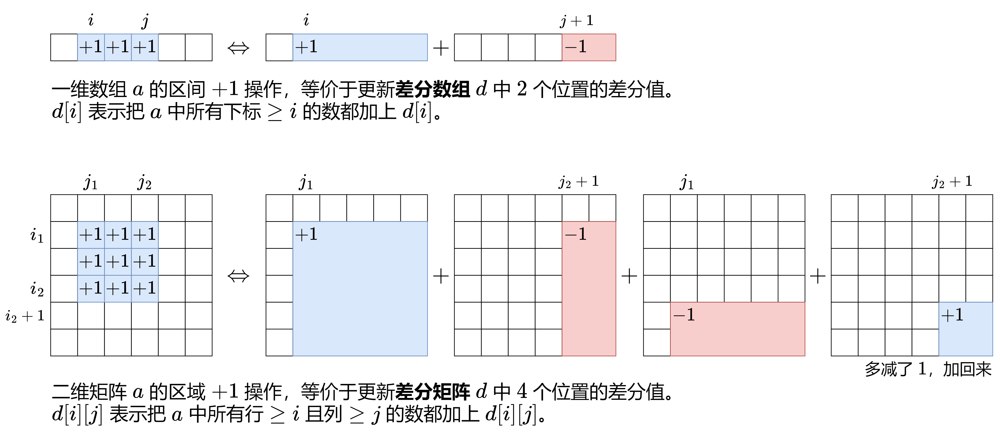

2536\. 子矩阵元素加 1(模板)
---------------

给你一个正整数 `n` ，表示最初有一个 `n x n` 、下标从 **0** 开始的整数矩阵 `mat` ，矩阵中填满了 0 。

另给你一个二维整数数组 `query` 。针对每个查询 `query[i] = [row1i, col1i, row2i, col2i]` ，请你执行下述操作：

*   找出 **左上角** 为 `(row1i, col1i)` 且 **右下角** 为 `(row2i, col2i)` 的子矩阵，将子矩阵中的 **每个元素** 加 `1` 。也就是给所有满足 `row1i <= x <= row2i` 和 `col1i <= y <= col2i` 的 `mat[x][y]` 加 `1` 。

返回执行完所有操作后得到的矩阵 `mat` 。

**示例 1：**


**输入：**n = 3, queries = \[\[1,1,2,2\],\[0,0,1,1\]\]
**输出：**\[\[1,1,0\],\[1,2,1\],\[0,1,1\]\]
**解释：**上图所展示的分别是：初始矩阵、执行完第一个操作后的矩阵、执行完第二个操作后的矩阵。
- 第一个操作：将左上角为 (1, 1) 且右下角为 (2, 2) 的子矩阵中的每个元素加 1 。
- 第二个操作：将左上角为 (0, 0) 且右下角为 (1, 1) 的子矩阵中的每个元素加 1 。

**示例 2：**


**输入：**n = 2, queries = \[\[0,0,1,1\]\]
**输出：**\[\[1,1\],\[1,1\]\]
**解释：**上图所展示的分别是：初始矩阵、执行完第一个操作后的矩阵。
- 第一个操作：将矩阵中的每个元素加 1 。

**提示：**

*   `1 <= n <= 500`
*   `1 <= queries.length <= 104`
*   `0 <= row1i <= row2i < n`
*   `0 <= col1i <= col2i < n`

[https://leetcode.cn/problems/increment-submatrices-by-one/description/](https://leetcode.cn/problems/increment-submatrices-by-one/description/)

```java
class Solution {
    public int[][] rangeAddQueries(int n, int[][] queries) { // 推荐模板，我们给原数组添加一行 + 一列
        // 二维差分模板
        int[][] diff = new int[n + 2][n + 2], ans = new int[n][n];
        for (int[] q : queries) {
            int x1 = q[0],y1 = q[1],x2 = q[2],y2 = q[3];
            diff[x1 + 1][y1 + 1]++;
            diff[x2 + 2][y1 + 1]--;
            diff[x1 + 1][y2 + 2]--;
            diff[x2 + 2][y2 + 2]++;
        }
        for (int i = 1; i <= n; i++) {
            for (int j = 1; j <= n; j++) {
                diff[i][j] += diff[i - 1][j] + diff[i][j - 1] - diff[i - 1][j - 1];
                ans[i - 1][j - 1] = diff[i][j];
            }
        }
        return ans;
    }
}
```

```java
class Solution {
    public int[][] rangeAddQueries(int n, int[][] queries) { // 二维差分模板
        int[][] diff = new int[n + 1][n + 1]; // diff是差分前缀和，表示（0，0）到（n,n）的和，这里是[0，n]闭区间
        int[][] ans = new int[n][n];
        for (int[] q : queries) {
            int x1 = q[0], y1 = q[1], x2 = q[2], y2 = q[3];
            diff[x1][y1]++;
            diff[x1][y2 + 1]--;
            diff[x2 + 1][y1]--;
            diff[x2 + 1][y2 + 1]++;
        }
        for (int i = 0; i < n; i++) {
            for (int j = 0; j < n; j++) {
                ans[i][j] = diff[i][j];  // 这里主要是初始为0，不然就是ans[i][j]+=diff[i][j]
                if (i != 0) {
                    ans[i][j] += ans[i - 1][j];
                }
                if (j != 0) {
                    ans[i][j] += ans[i][j - 1];
                }
                if (i != 0 && j != 0) {
                    ans[i][j] -= ans[i - 1][j - 1];
                }
            }
        }
        return ans;
    }
}
```

850\. 矩形面积 II(扫描线模板，双线区间扫描)
-------------

给你一个轴对齐的二维数组 `rectangles` 。 对于 `rectangle[i] = [x1, y1, x2, y2]`，其中（x1，y1）是矩形 `i` 左下角的坐标， `(xi1, yi1)` 是该矩形 **左下角** 的坐标， `(xi2, yi2)` 是该矩形 **右上角** 的坐标。

计算平面中所有 `rectangles` 所覆盖的 **总面积** 。任何被两个或多个矩形覆盖的区域应只计算 **一次** 。

返回 _**总面积**_ 。因为答案可能太大，返回 `109 + 7` 的 **模** 。

**示例 1：**


**输入：**rectangles = \[\[0,0,2,2\],\[1,0,2,3\],\[1,0,3,1\]\]
**输出：**6
**解释：**如图所示，三个矩形覆盖了总面积为 6 的区域。
从(1,1)到(2,2)，绿色矩形和红色矩形重叠。
从(1,0)到(2,3)，三个矩形都重叠。

**示例 2：**

**输入：**rectangles = \[\[0,0,1000000000,1000000000\]\]
**输出：**49
**解释：**答案是 1018 对 (109 + 7) 取模的结果， 即 49 。

**提示：**

*   `1 <= rectangles.length <= 200`
*   `rectanges[i].length = 4`
*   `0 <= xi1, yi1, xi2, yi2 <= 109`

[https://leetcode.cn/problems/rectangle-area-ii/description/](https://leetcode.cn/problems/rectangle-area-ii/description/)

```java
import java.util.ArrayList;
import java.util.Collections;

class Solution {
    private static int Mod = (int) 1e9 + 7;
    public int rectangleArea(int[][] rectangles) { // 扫描线
        // 先把所有的线按x排序
        ArrayList<Integer> list = new ArrayList<>();
        for (int[] rec : rectangles) {
            list.add(rec[0]);
            list.add(rec[2]);
        }
        Collections.sort(list);
        long ans = 0;
        for (int i = 1; i < list.size(); i++) {
            int a = list.get(i - 1), b = list.get(i), len = b - a;
            if (len == 0) {
                continue;
            }
            ArrayList<int[]> lines = new ArrayList<>();
            for (int[] rec : rectangles) {
                if (rec[0] <= a && rec[2] >= b) {
                    lines.add(new int[]{rec[1], rec[3]});
                }
            }
            Collections.sort(lines, (o1, o2) -> o1[0] != o2[0] ? o1[0] - o2[0] : o1[1] - o2[1]);
            long sum = 0, left = -1, right = -1;
            for (int[] line : lines) {
                if (line[0] >= right) {
                    sum += right - left;
                    left = line[0];
                    right = line[1];
                } else if (line[1] > right) {
                    right = line[1];
                }
            }
            sum += right - left;
            ans = (ans + sum * len) % Mod;
        }
        return (int) ans;
    }
}
```

2132\. 用邮票贴满网格图（二维差分与二维前缀和）
---------------

给你一个 `m x n` 的二进制矩阵 `grid` ，每个格子要么为 `0` （空）要么为 `1` （被占据）。

给你邮票的尺寸为 `stampHeight x stampWidth` 。我们想将邮票贴进二进制矩阵中，且满足以下 **限制** 和 **要求** ：

1.  覆盖所有 **空** 格子。
2.  不覆盖任何 **被占据** 的格子。
3.  我们可以放入任意数目的邮票。
4.  邮票可以相互有 **重叠** 部分。
5.  邮票不允许 **旋转** 。
6.  邮票必须完全在矩阵 **内** 。

如果在满足上述要求的前提下，可以放入邮票，请返回 `true` ，否则返回 `false` 。

**示例 1：**


**输入：**grid = \[\[1,0,0,0\],\[1,0,0,0\],\[1,0,0,0\],\[1,0,0,0\],\[1,0,0,0\]\], stampHeight = 4, stampWidth = 3
**输出：**true
**解释：**我们放入两个有重叠部分的邮票（图中标号为 1 和 2），它们能覆盖所有与空格子。

**示例 2：**


**输入：**grid = \[\[1,0,0,0\],\[0,1,0,0\],\[0,0,1,0\],\[0,0,0,1\]\], stampHeight = 2, stampWidth = 2 
**输出：**false 
**解释：**没办法放入邮票覆盖所有的空格子，且邮票不超出网格图以外。

**提示：**

*   `m == grid.length`
*   `n == grid[r].length`
*   `1 <= m, n <= 105`
*   `1 <= m * n <= 2 * 105`
*   `grid[r][c]` 要么是 `0` ，要么是 `1` 。
*   `1 <= stampHeight, stampWidth <= 105`

[https://leetcode.cn/problems/stamping-the-grid/solutions/1199642/wu-nao-zuo-fa-er-wei-qian-zhui-he-er-wei-zwiu/](https://leetcode.cn/problems/stamping-the-grid/solutions/1199642/wu-nao-zuo-fa-er-wei-qian-zhui-he-er-wei-zwiu/)

```java
// 1.由于邮票可以互相重叠，贪心地想，能放邮票就放邮票。
// 2.遍历所有能放邮票的位置去放邮票。注意邮票不能覆盖被占据的格子，也不能出界。
// 3.放邮票的同时，记录每个空格子被多少张邮票覆盖。如果存在一个空格子没被邮票覆盖，则返回 false，否则返回 true
import java.util.Arrays;

class Solution {
    public boolean possibleToStamp(int[][] grid, int stampHeight, int stampWidth) { // 推荐模板
        int m = grid.length, n = grid[0].length;
        int[][] prefixSum = new int[m + 1][n + 1]; // 二维前缀和数组
        for (int i = 0; i < m; i++) {
            for (int j = 0; j < n; j++) {
                prefixSum[i + 1][j + 1] = prefixSum[i + 1][j] + prefixSum[i][j + 1] - prefixSum[i][j] + grid[i][j];
            }
        }
        int[][] diff = new int[m + 2][n + 2]; // 二维差分数组
        for (int i = stampHeight; i <= m; i++) {
            for (int j = stampWidth; j <= n; j++) {
                int i0 = i - stampHeight + 1;
                int j0 = j - stampWidth + 1;
                if (prefixSum[i][j] - prefixSum[i0 - 1][j] - prefixSum[i][j0 - 1] + prefixSum[i0 - 1][j0 - 1] == 0) { // 表示可以贴上邮票
                    diff[i0][j0]++;
                    diff[i + 1][j0]--;
                    diff[i0][j + 1]--;
                    diff[i + 1][j + 1]++;
                }
            }
        }
        // 还原数组
        for (int i = 0; i < m; i++) {
            for (int j = 0; j < n; j++) {
                diff[i + 1][j + 1] += diff[i + 1][j] + diff[i][j + 1] - diff[i][j];
                if (diff[i + 1][j + 1] == 0 && grid[i][j] == 0) {
                    return false;
                }
            }
        }
        return true;
    }
}
```


```java
// 1.由于邮票可以互相重叠，贪心地想，能放邮票就放邮票。
// 2.遍历所有能放邮票的位置去放邮票。注意邮票不能覆盖被占据的格子，也不能出界。
// 3.放邮票的同时，记录每个空格子被多少张邮票覆盖。如果存在一个空格子没被邮票覆盖，则返回 false，否则返回 true
import java.util.Arrays;

class Solution {
    public boolean possibleToStamp(int[][] grid, int stampHeight, int stampWidth) {
        int m = grid.length, n = grid[0].length;
        int[][] prefixSum = new int[m + 1][n + 1];
        // 二维前缀和
        for (int i = 0; i < m; i++) {
            for (int j = 0; j < n; j++) {
                prefixSum[i + 1][j + 1] = prefixSum[i + 1][j] + prefixSum[i][j + 1] - prefixSum[i][j] + grid[i][j];
            }
        }
        // 二维差分数组
        int[][] diff = new int[m + 1][n + 1];
        for (int i = stampHeight - 1; i < m; i++) {
            for (int j = stampWidth - 1; j < n; j++) {
                int x0 = i - stampHeight + 1, y0 = j - stampWidth + 1; // 因为下标从0开始
                // 前缀区间和为0
                if (prefixSum[i + 1][j + 1] - prefixSum[i + 1][y0] - prefixSum[x0][j + 1] + prefixSum[x0][y0] == 0) {
                    diff[x0][y0]++;
                    diff[i + 1][y0]--;
                    diff[x0][j + 1]--;
                    diff[i + 1][j + 1]++;
                }
            }
        }
        // 3. 还原二维差分矩阵对应的计数矩阵（原地计算）
        for (int i = 0; i < m; i++) {
            for (int j = 0; j < n; j++) {
                if (i != 0) {
                    diff[i][j] += diff[i - 1][j];
                }
                if (j != 0) {
                    diff[i][j] += diff[i][j - 1];
                }
                if (i != 0 && j != 0) {
                    diff[i][j] -= diff[i - 1][j - 1]; // 这里一定要先还原
                }
                if (diff[i][j] == 0 && grid[i][j] == 0) {
                    return false;
                }
            }
        }
        return true;
    }
}
```

## LCP 74. 最强祝福力场(离散化二维差分or扫描线【单线扫描】)


```java
import java.util.Arrays;

class Solution {
    //就是构建前置和数组、差分数组
    //构建差分数组 标记每处的力场强度
    // 因为有小数，所以将坐标放大两倍
    //利用离散化技巧，将扩大后的坐标x、y都转为离散的某个点，对应为数组内的编号。缩小空间
    //因为数据范围巨大，而给出的实际数据却可能很少，不得不用离散化。
    //要注意使用long类型！！！
    public int fieldOfGreatestBlessing(int[][] forceField) {
        int n = forceField.length;
        //构建离散化对应数组，获取x、y坐标
        long[] xrr = new long[2 * n];
        long[] yrr = new long[2 * n];
        int k = 0, p = 0;
        for (int i = 0; i < n; i++) {
            long x = forceField[i][0], y = forceField[i][1], r = forceField[i][2];
            xrr[k++] = (x << 1) - r; // 左上角
            yrr[p++] = (y << 1) - r;
            xrr[k++] = (x << 1) + r; // 右上角
            yrr[p++] = (y << 1) + r;
        }
        //将获取到的坐标 去重、排序,返回有效长度
        //所有坐标对应的离散范围
        int sizeX = uniqSort(xrr);
        int sizeY = uniqSort(yrr);

        // 设置差分数组
        int[][] diff = new int[sizeX + 2][sizeY + 2];
        for (int i = 0; i < n; i++) {
            long x = forceField[i][0];
            long y = forceField[i][1];
            long r = forceField[i][2];
            int x1 = binarySearch(xrr, (x << 1) - r, sizeX);
            int y1 = binarySearch(yrr, (y << 1) - r, sizeY);
            int x2 = binarySearch(xrr, (x << 1) + r, sizeX);
            int y2 = binarySearch(yrr, (y << 1) + r, sizeY);
            diff[x1 + 1][y1 + 1]++;
            diff[x2 + 2][y1 + 1]--;
            diff[x1 + 1][y2 + 2]--;
            diff[x2 + 2][y2 + 2]++;
        }
        int ans = 0;
        for (int i = 1; i <= sizeX; i++) {
            for (int j = 1; j <= sizeY; j++) {
                diff[i][j] += diff[i - 1][j] + diff[i][j - 1] - diff[i - 1][j - 1]; // 一个一个点查找
                ans = Math.max(ans, diff[i][j]);
            }
        }
        return ans;
    }


    private int binarySearch(long[] nums, long target, int n) { // 二分查找，这里绝对能找到，这里要传入有效长度
        int left = 0, right = n - 1;
        while (left <= right) {
            int mid = left + (right - left) / 2;
            if (nums[mid] == target) {
                return mid;
            } else if (nums[mid] > target) {
                right = mid - 1;
            } else {
                left = mid + 1;
            }
        }
        return -1;
    }

    private int uniqSort(long[] nums) { // 去重+排序，返回去重后的有效长度
        Arrays.sort(nums);
        int size = 1;
        for (int i = 1; i < nums.length; i++) {
            if (nums[i] != nums[i - 1]) {
                nums[size++] = nums[i];
            }
        }
        return size;
    }
}
```

```java
import java.util.ArrayList;
import java.util.List;
import java.util.Map;
import java.util.TreeMap;

class Solution {
    public int fieldOfGreatestBlessing(int[][] forceField) {
        List<Double> list = new ArrayList<>();
        for (int[] info : forceField) {
            list.add(info[0] - info[2] / 2.);
            list.add(info[0] + info[2] / 2.);
        }
        int res = 0;
        for (int i = 0; i < list.size(); i++) {
            if (i > 0 && list.get(i).equals(list.get(i - 1))) continue;
            Double t = list.get(i);
            TreeMap<Double, Integer> map = new TreeMap<>();
            for (int[] info : forceField) {
                if (info[0] - info[2] / 2. <= t && t <= info[0] + info[2] / 2.) {
                    map.put(info[1] - info[2] / 2., map.getOrDefault(info[1] - info[2] / 2., 0) + 1);
                    // 区间右边界加0.5表示该位置不可达，也可以加0.1，因为该位置，如果同时存在区间的左边界和右边界，那么左边界是要先被统计进去的
                    map.put(info[1] + info[2] / 2. + 0.5, map.getOrDefault(info[1] + info[2] / 2., 0) - 1);
                }
            }
            int tmp = 0, cur = 0;
            for (Map.Entry<Double, Integer> entry : map.entrySet()) {
                cur += entry.getValue();
                tmp = Math.max(tmp, cur);
            }
            res = Math.max(res, tmp);
        }
        return res;
    }
}
```

面试题 17.24. 最大子矩阵(压缩矩阵)
----------------

给定一个正整数、负整数和 0 组成的 N × M 矩阵，编写代码找出元素总和最大的子矩阵。

返回一个数组 `[r1, c1, r2, c2]`，其中 `r1`, `c1` 分别代表子矩阵左上角的行号和列号，`r2`, `c2` 分别代表右下角的行号和列号。若有多个满足条件的子矩阵，返回任意一个均可。

**注意：**本题相对书上原题稍作改动

**示例：**

**输入：**
`[    [-1,0],    [0,-1] ]`
**输出：**\[0,1,0,1\]
**解释：**输入中标粗的元素即为输出所表示的矩阵

**说明：**

*   `1 <= matrix.length, matrix[0].length <= 200`

[https://leetcode.cn/problems/max-submatrix-lcci/description/](https://leetcode.cn/problems/max-submatrix-lcci/description/)

```java
class Solution {
    public int[] getMaxMatrix(int[][] matrix){
        int m = matrix.length, n = matrix[0].length;
        int[] ans = new int[4];
        int mx = matrix[0][0]; // 细节初始化，默认ans = {0,0,0,0};
        for (int i = 0; i < m; i++) { // 上界
            int[] sums = new int[n]; // 压缩维度
            for (int j = i; j < m; j++) { // 下界
                for (int k = 0; k < n; k++) {
                    sums[k] += matrix[j][k];
                }
                // 这里就是求一维数组sums的最大子数组和
                int temp = 0, left = 0; // 左边界
                for (int right = 0; right < n; right++) { // 右边界
                    if (temp < 0) {
                        temp = 0;
                        left = right;
                    }
                    temp += sums[right]; // 思考为什么放在这个位置，而不是放在上一个if前面
                    if (temp > mx) {
                        mx = temp;
                        ans[0] = i;
                        ans[1] = left;
                        ans[2] = j;
                        ans[3] = right;
                    }
                }
            }
        }
        return ans;
    }
}
```

