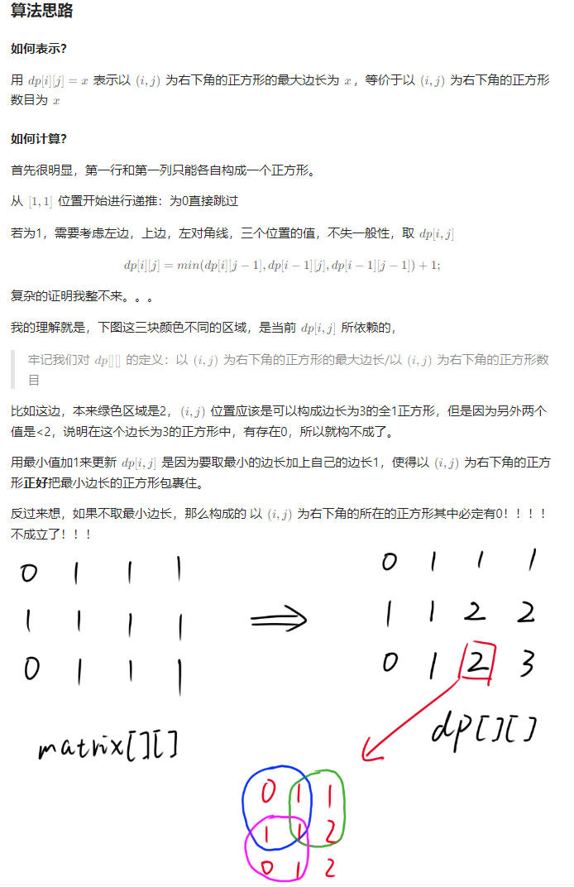

1277\. 统计全为 1 的正方形子矩阵
---------------------

给你一个 `m * n` 的矩阵，矩阵中的元素不是 `0` 就是 `1`，请你统计并返回其中完全由 `1` 组成的 **正方形** 子矩阵的个数。

**示例 1：**

**输入：**matrix =
\[
  \[0,1,1,1\],
  \[1,1,1,1\],
  \[0,1,1,1\]
\]
**输出：**15
**解释：** 
边长为 1 的正方形有 **10** 个。
边长为 2 的正方形有 **4** 个。
边长为 3 的正方形有 **1** 个。
正方形的总数 = 10 + 4 + 1 = **15**.

**示例 2：**

**输入：**matrix = 
\[
  \[1,0,1\],
  \[1,1,0\],
  \[1,1,0\]
\]
**输出：**7
**解释：**
边长为 1 的正方形有 **6** 个。 
边长为 2 的正方形有 **1** 个。
正方形的总数 = 6 + 1 = **7**.

**提示：**

*   `1 <= arr.length <= 300`
*   `1 <= arr[0].length <= 300`
*   `0 <= arr[i][j] <= 1`

[https://leetcode.cn/problems/count-square-submatrices-with-all-ones/solutions/923797/xiang-jie-yong-dong-tai-gui-hua-ko1277-b-dr6m/](https://leetcode.cn/problems/count-square-submatrices-with-all-ones/solutions/923797/xiang-jie-yong-dong-tai-gui-hua-ko1277-b-dr6m/)



```java
class Solution {
	public int countSquares(int[][] matrix) {
		// 牢记dp的含义：dp[i][j]表示以i,j为右下角的正方形个数。
		int m = matrix.length, n = matrix[0].length;
		int[][] dp = new int[m][n];
		int ans = 0;
		for (int i = 0; i < m; i++) {
			for (int j = 0; j < n; j++) {
				if (matrix[i][j] == 1) {
					if (i == 0 || j == 0) {
						dp[i][j] = matrix[i][j];
						ans++;
					} else {
						dp[i][j] = Math.min(dp[i - 1][j], Math.min(dp[i - 1][j - 1], dp[i][j - 1])) + 1; // 公式
						ans += dp[i][j];
					}
				}
			}
		}
		return ans;
	}
}
```

221\. 最大正方形
-----------

在一个由 `'0'` 和 `'1'` 组成的二维矩阵内，找到只包含 `'1'` 的最大正方形，并返回其面积。

**示例 1：**


**输入：**matrix = \[\["1","0","1","0","0"\],\["1","0","1","1","1"\],\["1","1","1","1","1"\],\["1","0","0","1","0"\]\]
**输出：**4

**示例 2：**


**输入：**matrix = \[\["0","1"\],\["1","0"\]\]
**输出：**1

**示例 3：**

**输入：**matrix = \[\["0"\]\]
**输出：**0

**提示：**

*   `m == matrix.length`
*   `n == matrix[i].length`
*   `1 <= m, n <= 300`
*   `matrix[i][j]` 为 `'0'` 或 `'1'`

[https://leetcode.cn/problems/maximal-square/description/](https://leetcode.cn/problems/maximal-square/description/)

```java
class Solution {
    // 221. 最大正方形
    public int maximalSquare(char[][] matrix) {
        int m = matrix.length, n = matrix[0].length;
        int ans = 0;
        int[][] dp = new int[m + 1][n + 1]; // 其实这个以(i,j)为右下角的正方形个数==正方形最长边长
        for (int i = 0; i < m; i++) {
            for (int j = 0; j < n; j++) {
                if (matrix[i][j] == '1') {
                    dp[i + 1][j + 1] = Math.min(Math.min(dp[i][j], dp[i + 1][j]), dp[i][j + 1]) + 1;
                    ans = Math.max(dp[i + 1][j + 1], ans);
                }
            }
        }
        return ans * ans;
    }
}
```

1504\. 统计全 1 子矩形
----------------

给你一个 `m x n` 的二进制矩阵 `mat` ，请你返回有多少个 **子矩形** 的元素全部都是 1 。

**示例 1：**


**输入：**mat = \[\[1,0,1\],\[1,1,0\],\[1,1,0\]\]
**输出：**13
**解释：**
有 **6** 个 1x1 的矩形。
有 **2** 个 1x2 的矩形。
有 **3** 个 2x1 的矩形。
有 **1** 个 2x2 的矩形。
有 **1** 个 3x1 的矩形。
矩形数目总共 = 6 + 2 + 3 + 1 + 1 = **13** 。

**示例 2：**


**输入：**mat = \[\[0,1,1,0\],\[0,1,1,1\],\[1,1,1,0\]\]
**输出：**24
**解释：**
有 **8** 个 1x1 的子矩形。
有 **5** 个 1x2 的子矩形。
有 **2** 个 1x3 的子矩形。
有 **4** 个 2x1 的子矩形。
有 **2** 个 2x2 的子矩形。
有 **2** 个 3x1 的子矩形。
有 **1** 个 3x2 的子矩形。
矩形数目总共 = 8 + 5 + 2 + 4 + 2 + 2 + 1 = **24** **。**

**提示：**

*   `1 <= m, n <= 150`
*   `mat[i][j]` 仅包含 `0` 或 `1`

[https://leetcode.cn/problems/count-submatrices-with-all-ones/description/](https://leetcode.cn/problems/count-submatrices-with-all-ones/description/)

```java
class Solution {
	public int numSubmat(int[][] mat) {
		int m = mat.length, n = mat[0].length;
		int ans = 0;
		for (int i = 0; i < m; i++) { // 按行压缩，起始行，不断增大矩阵的高，也就是行数
			for (int j = i; j < m; j++) { // 统计
				int now = 0;
				for (int k = 0; k < n; k++) {
					if (mat[j][k] == 0) {
						now = 0;
					} else {
						now += 1;
						ans += now;
					}
				}
			}

			// 压缩
			for (int j = m - 1; j > i; j--) {
				for (int k = 0; k < n; k++) {
					mat[j][k] = mat[j][k] & mat[j - 1][k];
				}
			}
		}
		return ans;
	}
}
```

84\. 柱状图中最大的矩形
--------------

给定 _n_ 个非负整数，用来表示柱状图中各个柱子的高度。每个柱子彼此相邻，且宽度为 1 。

求在该柱状图中，能够勾勒出来的矩形的最大面积。

**示例 1:**


**输入：**heights = \[2,1,5,6,2,3\]
**输出：**10
**解释：**最大的矩形为图中红色区域，面积为 10

**示例 2：**


**输入：** heights = \[2,4\]
**输出：** 4

**提示：**

*   `1 <= heights.length <=105`
*   `0 <= heights[i] <= 104`

[https://leetcode.cn/problems/largest-rectangle-in-histogram/submissions/514192903/](https://leetcode.cn/problems/largest-rectangle-in-histogram/submissions/514192903/)

```java
import java.util.*;

class Solution {
	public int largestRectangleArea(int[] heights) {
		// 就是找当前柱子的左右边界
		ArrayDeque<Integer> stack = new ArrayDeque<Integer>();
		int n = heights.length;
		int[] left = new int[n];
		int[] right = new int[n];
		Arrays.fill(right, n); // 右边界初始为n
		for (int i = 0; i < n; i++) {
			while (!stack.isEmpty() && heights[stack.peekFirst()] >= heights[i]) { // 维护单调增的单调队列
				stack.pollFirst();
			}
			left[i] = stack.isEmpty() ? -1 : stack.peekFirst();
			stack.push(i);
		}
		stack.clear();
		for (int i = n - 1; i >= 0; i--) {
			while (!stack.isEmpty() && heights[stack.peekFirst()] >= heights[i]) {
				stack.pollFirst();
			}
			right[i] = stack.isEmpty() ? n : stack.peekFirst();
			stack.push(i);
		}
		int ans = 0;
		for (int i = 0; i < n; i++) {
			ans = Math.max(ans, heights[i] * (right[i] - left[i] - 1)); 
		}
		return ans;
	}
}
```

85\. 最大矩形
---------

给定一个仅包含 `0` 和 `1` 、大小为 `rows x cols` 的二维二进制矩阵，找出只包含 `1` 的最大矩形，并返回其面积。

**示例 1：**


**输入：**matrix = \[\["1","0","1","0","0"\],\["1","0","1","1","1"\],\["1","1","1","1","1"\],\["1","0","0","1","0"\]\]
**输出：**6
**解释：**最大矩形如上图所示。

**示例 2：**

**输入：**matrix = \[\["0"\]\]
**输出：**0

**示例 3：**

**输入：**matrix = \[\["1"\]\]
**输出：**1

**提示：**

*   `rows == matrix.length`
*   `cols == matrix[0].length`
*   `1 <= row, cols <= 200`
*   `matrix[i][j]` 为 `'0'` 或 `'1'`

[https://leetcode.cn/problems/maximal-rectangle/](https://leetcode.cn/problems/maximal-rectangle/)

```java
class Solution {
    public int maximalRectangle(char[][] matrix) {
        int m = matrix.length;
        if (m == 0) {
            return 0;
        }
        int n = matrix[0].length;
        int[][] left = new int[m][n]; // left[i][j]就是第i行中，第j列的柱状高度

        for (int i = 0; i < m; i++) {
            for (int j = 0; j < n; j++) {
                if (matrix[i][j] == '1') {
                    left[i][j] = (j == 0 ? 0 : left[i][j - 1]) + 1; // 按列累加，每一行横着累加
                }
            }
        }

        int ret = 0;
        for (int j = 0; j < n; j++) { // 对于每一列，使用基于柱状图的方法https://leetcode.cn/problems/largest-rectangle-in-histogram/solutions/266844/zhu-zhuang-tu-zhong-zui-da-de-ju-xing-by-leetcode-/
            int[] up = new int[m];
            int[] down = new int[m];

            Deque<Integer> stack = new LinkedList<Integer>(); // 单调栈
            for (int i = 0; i < m; i++) {
                while (!stack.isEmpty() && left[stack.peek()][j] >= left[i][j]) {
                    stack.pop();
                }
                up[i] = stack.isEmpty() ? -1 : stack.peek();
                stack.push(i);
            }
            stack.clear();
            for (int i = m - 1; i >= 0; i--) {
                while (!stack.isEmpty() && left[stack.peek()][j] >= left[i][j]) {
                    stack.pop();
                }
                down[i] = stack.isEmpty() ? m : stack.peek();
                stack.push(i);
            }

            for (int i = 0; i < m; i++) {
                int height = down[i] - up[i] - 1;
                int area = height * left[i][j];
                ret = Math.max(ret, area);
            }
        }
        return ret;
    }
}

```

