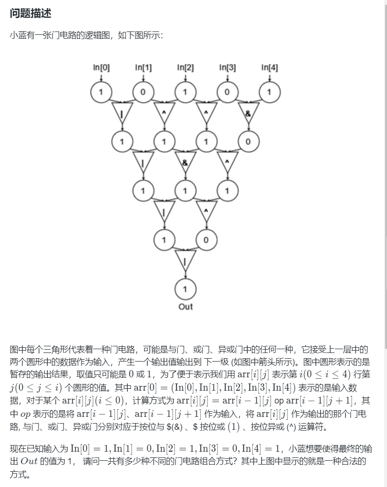

17\. 电话号码的字母组合
--------------

给定一个仅包含数字 `2-9` 的字符串，返回所有它能表示的字母组合。答案可以按 **任意顺序** 返回。

给出数字到字母的映射如下（与电话按键相同）。注意 1 不对应任何字母。


**示例 1：**

**输入：**digits = "23"
**输出：**\["ad","ae","af","bd","be","bf","cd","ce","cf"\]

**示例 2：**

**输入：**digits = ""
**输出：**\[\]

**示例 3：**

**输入：**digits = "2"
**输出：**\["a","b","c"\]

**提示：**

*   `0 <= digits.length <= 4`
*   `digits[i]` 是范围 `['2', '9']` 的一个数字。

[https://leetcode.cn/problems/letter-combinations-of-a-phone-number/description/](https://leetcode.cn/problems/letter-combinations-of-a-phone-number/description/)

```java
import java.util.ArrayList;
import java.util.List;

class Solution {
    private String[] map = {"", "", "abc", "def", "ghi", "jkl", "mno", "pqrs", "tuv", "wxyz"};
    ArrayList<String> ans = new ArrayList<>();
    char[] path, digits;
    public List<String> letterCombinations(String digits) {
        int n = digits.length();
        if (n == 0) {
            return ans;
        }
        this.digits = digits.toCharArray();
        path = new char[n];
        dfs(0);
        return ans;
    }

    private void dfs(int i) {
        if (i == digits.length) {
            ans.add(new String(path));
            return;
        }
        for (char c : map[digits[i] - '0'].toCharArray()) {
            path[i] = c;
            dfs(i + 1);
        }
    }
}
```

78\. 子集
-------

给你一个整数数组 `nums` ，数组中的元素 **互不相同** 。返回该数组所有可能的

子集

（幂集）。

解集 **不能** 包含重复的子集。你可以按 **任意顺序** 返回解集。

**示例 1：**

**输入：**nums = \[1,2,3\]
**输出：**\[\[\],\[1\],\[2\],\[1,2\],\[3\],\[1,3\],\[2,3\],\[1,2,3\]\]

**示例 2：**

**输入：**nums = \[0\]
**输出：**\[\[\],\[0\]\]

**提示：**

*   `1 <= nums.length <= 10`
*   `-10 <= nums[i] <= 10`
*   `nums` 中的所有元素 **互不相同**

[https://leetcode.cn/problems/subsets/description/](https://leetcode.cn/problems/subsets/description/)

```java
import java.util.ArrayList;
import java.util.List;

class Solution {
	int[] nums;
	List<List<Integer>> ans;
	List<Integer> path;

	public List<List<Integer>> subsets(int[] nums) {
		this.nums = nums;
		ans = new ArrayList<>();
		path = new ArrayList<>();
		dfs(0);
		return ans;
	}

	private void dfs(int i) {
		ans.add(new ArrayList<Integer>(path));
		if (i == nums.length) {
			return;
		}
		for (; i < nums.length; i++) {
			path.add(nums[i]);
			dfs(i + 1);
			path.remove(path.size() - 1); // 这里别写成 path.remove(nums[i]);因为remove是删除的下标；
		}

	}
}
```

131\. 分割回文串
-----------

给你一个字符串 `s`，请你将 `s` 分割成一些子串，使每个子串都是

**回文串**

。返回 `s` 所有可能的分割方案。

**示例 1：**

**输入：**s = "aab"
**输出：**\[\["a","a","b"\],\["aa","b"\]\]

**示例 2：**

**输入：**s = "a"
**输出：**\[\["a"\]\]

**提示：**

*   `1 <= s.length <= 16`
*   `s` 仅由小写英文字母组成

[https://leetcode.cn/problems/palindrome-partitioning/description/](https://leetcode.cn/problems/palindrome-partitioning/description/)

```java
import java.util.ArrayList;
import java.util.List;

class Solution {
    ArrayList<List<String>> ans = new ArrayList<>();
    ArrayList<String> path = new ArrayList<>();
    String s;
    int n;
    public List<List<String>> partition(String s) {
        n = s.length();
        if (n == 0) {
            return ans;
        }
        this.s = s;
        dfs(0);
        return ans;
    }

    private void dfs(int i) {
        if (i == n) {
            ans.add(new ArrayList<>(path));
            return;
        }
        for (int j = i; j < n; j++) {
            if (judge(i, j)) {
                path.add(s.substring(i, j + 1));
                dfs(j + 1);
                path.remove(path.size() - 1);
            }
        }

    }

    private boolean judge(int left, int right) {
        while (left < right) {
            if (s.charAt(left++) != s.charAt(right--)) {
                return false;
            }
        }
        return true;
    }
}
```

784\. 字母大小写全排列
--------------

给定一个字符串 `s` ，通过将字符串 `s` 中的每个字母转变大小写，我们可以获得一个新的字符串。

返回 _所有可能得到的字符串集合_ 。以 **任意顺序** 返回输出。

**示例 1：**

**输入：**s = "a1b2"
**输出：**\["a1b2", "a1B2", "A1b2", "A1B2"\]

**示例 2:**

**输入:** s = "3z4"
**输出:** \["3z4","3Z4"\]

**提示:**

*   `1 <= s.length <= 12`
*   `s` 由小写英文字母、大写英文字母和数字组成

[https://leetcode.cn/problems/letter-case-permutation/description/](https://leetcode.cn/problems/letter-case-permutation/description/)

```java
import java.util.ArrayList;
import java.util.List;

class Solution {
    ArrayList<String> ans = new ArrayList<>();
    char[] path;
    int n;
    public List<String> letterCasePermutation(String s) {
        n = s.length();
        if (n == 0) {
            return ans;
        }
        path = s.toCharArray();
        dfs(0);
        return ans;
    }

    private void dfs(int i) {
        ans.add(new String(path));
        for (int j = i; j < n; j++) {
            if (!Character.isDigit(path[j])) {
                path[j] ^= 32; // 大小写ASCII码转换
                dfs(j + 1);
                path[j] ^= 32;
            }
        }
    }
}
```

79\. 单词搜索
---------

给定一个 `m x n` 二维字符网格 `board` 和一个字符串单词 `word` 。如果 `word` 存在于网格中，返回 `true` ；否则，返回 `false` 。

单词必须按照字母顺序，通过相邻的单元格内的字母构成，其中“相邻”单元格是那些水平相邻或垂直相邻的单元格。同一个单元格内的字母不允许被重复使用。

**示例 1：**


**输入：**board = \[\["A","B","C","E"\],\["S","F","C","S"\],\["A","D","E","E"\]\], word = "ABCCED"
**输出：**true

**示例 2：**


**输入：**board = \[\["A","B","C","E"\],\["S","F","C","S"\],\["A","D","E","E"\]\], word = "SEE"
**输出：**true

**示例 3：**


**输入：**board = \[\["A","B","C","E"\],\["S","F","C","S"\],\["A","D","E","E"\]\], word = "ABCB"
**输出：**false

**提示：**

*   `m == board.length`
*   `n = board[i].length`
*   `1 <= m, n <= 6`
*   `1 <= word.length <= 15`
*   `board` 和 `word` 仅由大小写英文字母组成

**进阶：**你可以使用搜索剪枝的技术来优化解决方案，使其在 `board` 更大的情况下可以更快解决问题？

[https://leetcode.cn/problems/word-search/description/](https://leetcode.cn/problems/word-search/description/)

```java
class Solution {
    private boolean[][] visited;
    private final int[][] directions = new int[][]{{0, 1}, {1, 0}, {0, -1}, {-1, 0}};
    private char[][] board;
    private String word;
    public boolean exist(char[][] board, String word) {
        this.board = board;
        this.word = word;
        int m = board.length, n = board[0].length;
        visited = new boolean[m][n];
        for (int i = 0; i < m; i++) {
            for (int j = 0; j < n; j++) {
                if (dfs(i, j, 0)) {
                    return true;
                }
            }
        }
        return false;
    }
    private boolean dfs(int i, int j, int index) {
        if (word.charAt(index) != board[i][j]) {
            return false;
        }
        if (index == word.length() - 1) {
            return true;
        }
        visited[i][j] = true;
        for (int[] d : directions) {
            int newi = i + d[0], newj = j + d[1];
            if (newi >= 0 && newi < board.length && newj >= 0 && newj < board[0].length && !visited[newi][newj]) {
                if (dfs(newi, newj, index + 1)) {
                    return true;
                }
            }
        }
        // 不选这个点进  回溯  核心
        visited[i][j] = false;
        return false;
    }
}
```

212\. 单词搜索 II
-------------

给定一个 `m x n` 二维字符网格 `board` 和一个单词（字符串）列表 `words`， _返回所有二维网格上的单词_ 。

单词必须按照字母顺序，通过 **相邻的单元格** 内的字母构成，其中“相邻”单元格是那些水平相邻或垂直相邻的单元格。同一个单元格内的字母在一个单词中不允许被重复使用。

**示例 1：**


**输入：**board = \[\["o","a","a","n"\],\["e","t","a","e"\],\["i","h","k","r"\],\["i","f","l","v"\]\], words = \["oath","pea","eat","rain"\]
**输出：**\["eat","oath"\]

**示例 2：**


**输入：**board = \[\["a","b"\],\["c","d"\]\], words = \["abcb"\]
**输出：**\[\]

**提示：**

*   `m == board.length`
*   `n == board[i].length`
*   `1 <= m, n <= 12`
*   `board[i][j]` 是一个小写英文字母
*   `1 <= words.length <= 3 * 104`
*   `1 <= words[i].length <= 10`
*   `words[i]` 由小写英文字母组成
*   `words` 中的所有字符串互不相同

[https://leetcode.cn/problems/word-search-II/description/](https://leetcode.cn/problems/word-search-II/description/)

```java
import java.util.ArrayList;
import java.util.HashSet;
import java.util.List;
import java.util.Set;

class Solution {
    // 212. 单词搜索 II
    private int[][] directions = new int[][]{{0, 1}, {1, 0}, {0, -1}, {-1, 0}};
    private Set<String> ans;
    public List<String> findWords(char[][] board, String[] words) {
        Trie root = new Trie();
        for (String word : words) {
            root.insert(word);
        }
        ans = new HashSet<>();
        int m = board.length, n = board[0].length;
        for (int i = 0; i < m; i++) {
            for (int j = 0; j < n; j++) {
                dfs(board, root, i, j);
            }
        }
        return new ArrayList<>(ans);
    }

    private void dfs(char[][] board, Trie root, int i, int j) {
        char ch = board[i][j];
        if (!root.children.containsKey(ch)) {
            return;
        }
        root = root.children.get(ch);
        if (!"".equals(root.word)) {
            ans.add(root.word);
        }
        board[i][j] = '#'; // 因为一个字母只能用一次
        for (int[] d : directions) {
            int newi = i + d[0], newj = j + d[1];
            if (newi >= 0 && newi < board.length && newj >= 0 && newj < board[0].length) {
                dfs(board, root, newi, newj);
            }
        }
        board[i][j] = ch; // 回溯
    }
    class Trie{
        private String word; // 将isEnd换成word
        private Map<Character, Trie> children;

        public Trie(){
            this.word = "";
            this.children = new HashMap<Character, Trie>();
        }
        public void insert(String word) {
            Trie root = this;
            for (char c : word.toCharArray()) {
                root.children.computeIfAbsent(c, k -> new Trie()); // 等价于 if(!root.children.contains(c)) {root.children.put(c,new Trie());}
                root = root.children.get(c);
            }
            root.word = word;
        }
    }
}
```

494\. 目标和
---------

给你一个非负整数数组 `nums` 和一个整数 `target` 。

向数组中的每个整数前添加 `'+'` 或 `'-'` ，然后串联起所有整数，可以构造一个 **表达式** ：

*   例如，`nums = [2, 1]` ，可以在 `2` 之前添加 `'+'` ，在 `1` 之前添加 `'-'` ，然后串联起来得到表达式 `"+2-1"` 。

返回可以通过上述方法构造的、运算结果等于 `target` 的不同 **表达式** 的数目。

**示例 1：**

**输入：**nums = \[1,1,1,1,1\], target = 3
**输出：**5
**解释：**一共有 5 种方法让最终目标和为 3 。
-1 + 1 + 1 + 1 + 1 = 3
+1 - 1 + 1 + 1 + 1 = 3
+1 + 1 - 1 + 1 + 1 = 3
+1 + 1 + 1 - 1 + 1 = 3
+1 + 1 + 1 + 1 - 1 = 3

**示例 2：**

**输入：**nums = \[1\], target = 1
**输出：**1

**提示：**

*   `1 <= nums.length <= 20`
*   `0 <= nums[i] <= 1000`
*   `0 <= sum(nums[i]) <= 1000`
*   `-1000 <= target <= 1000`

[https://leetcode.cn/problems/target-sum/description/](https://leetcode.cn/problems/target-sum/description/)

```java
import java.util.Arrays;

class Solution { // 背包问题
    public int findTargetSumWays(int[] nums, int target) {
        int sum = Arrays.stream(nums).sum();
        if (sum - target < 0 || (sum - target) % 2 == 1) {
            return 0;
        }
        target = (sum - target) / 2;
        int[] dp = new int[target + 1]; // dp[i]表示运算结果等于 i 的不同表达式的数目
        dp[0] = 1;
        for (int i = 1; i <= nums.length; i++) {
            int num = nums[i - 1];
            for (int j = target; j >= num; j--) {
                dp[j] += dp[j - num];
            }
        }
        return dp[target];
    }
}
```

894\. 所有可能的真二叉树
---------------

给你一个整数 `n` ，请你找出所有可能含 `n` 个节点的 **真二叉树** ，并以列表形式返回。答案中每棵树的每个节点都必须符合 `Node.val == 0` 。

答案的每个元素都是一棵真二叉树的根节点。你可以按 **任意顺序** 返回最终的真二叉树列表**。**

**真二叉树** 是一类二叉树，树中每个节点恰好有 `0` 或 `2` 个子节点。

**示例 1：**


**输入：**n = 7
**输出：**\[\[0,0,0,null,null,0,0,null,null,0,0\],\[0,0,0,null,null,0,0,0,0\],\[0,0,0,0,0,0,0\],\[0,0,0,0,0,null,null,null,null,0,0\],\[0,0,0,0,0,null,null,0,0\]\]

**示例 2：**

**输入：**n = 3
**输出：**\[\[0,0,0\]\]

**提示：**

*   `1 <= n <= 20`

[https://leetcode.cn/problems/all-possible-full-binary-trees/?envType=daily-question&envId=2024-04-02](https://leetcode.cn/problems/all-possible-full-binary-trees/?envType=daily-question&envId=2024-04-02)

```java
import java.util.ArrayList;
import java.util.List;

class TreeNode {
    int val;
    TreeNode left;
    TreeNode right;
    TreeNode() {}
    TreeNode(int val) { this.val = val; }
    TreeNode(int val, TreeNode left, TreeNode right) {
        this.val = val;
        this.left = left;
        this.right = right;
    }
}
class Solution {
    public List<TreeNode> allPossibleFBT(int n) {
        ArrayList<TreeNode> ans = new ArrayList<>();
        if (n % 2 == 0) { // 直接返回空数组，真二叉树节点数量一定是奇数
            return ans;
        }
        if (n == 1) {
            ans.add(new TreeNode(0));
            return ans;
        }
        for (int i = 1; i < n; i += 2) {
            List<TreeNode> left = allPossibleFBT(i);
            List<TreeNode> right = allPossibleFBT(n - i - 1);
            for (TreeNode l : left) {
                for (TreeNode r : right) {
                    TreeNode node = new TreeNode(0, l, r);
                    ans.add(node);
                }
            }
        }
        return ans;
    }
}
```



```java
import java.io.BufferedReader;
import java.io.InputStreamReader;
import java.util.Scanner;

public class Main {
    static Scanner sc = new Scanner(new BufferedReader(new InputStreamReader(System.in)));
    private static int[][] nums = new int[5][5];
    private static int ans = 0;
    public static void main(String[] args) {
        nums[0][0] = 1;
        nums[0][1] = 0;
        nums[0][2] = 1;
        nums[0][3] = 0;
        nums[0][4] = 1;
        dfs(1, 0);
        System.out.println(ans);
        sc.close();
    }

    private static void dfs(int i, int j) { // 行列
        if (i == 5) {
            if (nums[4][0] == 1) {
                ans++;
            }
            return;
        }

        for (int k = 0; k < 3; k++) {
            if (k == 0) {
                nums[i][j] = nums[i - 1][j] & nums[i - 1][j + 1];
            }
            if (k == 1) {
                nums[i][j] = nums[i - 1][j] | nums[i - 1][j + 1];
            }
            if (k == 2) {
                nums[i][j] = nums[i - 1][j] ^ nums[i - 1][j + 1];
            }
            if (j == 4 - i) {
                dfs(i + 1, 0);
            }else{
                dfs(i, j + 1);
            }
        }

    }
}
```

> 状压做全排列简直是降维打击

## 2850\. 将石头分散到网格图的最少移动次数

给你一个大小为 `3 * 3` ，下标从 **0** 开始的二维整数矩阵 `grid` ，分别表示每一个格子里石头的数目。网格图中总共恰好有 `9` 个石头，一个格子里可能会有 **多个** 石头。

每一次操作中，你可以将一个石头从它当前所在格子移动到一个至少有一条公共边的相邻格子。

请你返回每个格子恰好有一个石头的 **最少移动次数** 。

**示例 1：**


**输入：**grid = \[\[1,1,0\],\[1,1,1\],\[1,2,1\]\]
**输出：**3
**解释：**让每个格子都有一个石头的一个操作序列为：
1 - 将一个石头从格子 (2,1) 移动到 (2,2) 。
2 - 将一个石头从格子 (2,2) 移动到 (1,2) 。
3 - 将一个石头从格子 (1,2) 移动到 (0,2) 。
总共需要 3 次操作让每个格子都有一个石头。
让每个格子都有一个石头的最少操作次数为 3 。

**示例 2：**


**输入：**grid = \[\[1,3,0\],\[1,0,0\],\[1,0,3\]\]
**输出：**4
**解释：**让每个格子都有一个石头的一个操作序列为：
1 - 将一个石头从格子 (0,1) 移动到 (0,2) 。
2 - 将一个石头从格子 (0,1) 移动到 (1,1) 。
3 - 将一个石头从格子 (2,2) 移动到 (1,2) 。
4 - 将一个石头从格子 (2,2) 移动到 (2,1) 。
总共需要 4 次操作让每个格子都有一个石头。
让每个格子都有一个石头的最少操作次数为 4 。

**提示：**

- `grid.length == grid[i].length == 3`
- `0 <= grid[i][j] <= 9`
- `grid` 中元素之和为 `9` 。

[https://leetcode.cn/problems/minimum-moves-to-spread-stones-over-grid/description/?envType=daily-question&envId=2024-07-20](https://leetcode.cn/problems/minimum-moves-to-spread-stones-over-grid/description/?envType=daily-question&envId=2024-07-20)

```java
import java.util.ArrayList;
import java.util.Arrays;

class Solution { // 封神的解法
    public int minimumMoves(int[][] grid) {
        ArrayList<int[]> left = new ArrayList<>();
        ArrayList<int[]> right = new ArrayList<>();
        for (int i = 0; i < 3; i++) {
            for (int j = 0; j < 3; j++) {
                if (grid[i][j] == 0) {
                    left.add(new int[]{i, j});
                }else{
                    for (int k = 1; k < grid[i][j]; k++) {
                        right.add(new int[]{i, j});
                    }
                }
            }
        }
        int n = left.size();
        int[] dp = new int[1 << n]; // 使用 n 位二进制数来表示 left 中的每个坐标是否被 right 中的坐标填充，其中 1 表示被填充，而 0 表示未被填充。初始时 f[i]=∞，其余 f[0]=0。例如：1111111表示所有点位都被填充
        Arrays.fill(dp, Integer.MAX_VALUE / 2);
        dp[0] = 0;
        for (int i = 1; i < (1 << n); i++) {
            int k = Integer.bitCount(i);  // 表示已经被填充的点位数量
            for (int j = 0; j < n; j++) { 
                if ((i >> j & 1) == 1) { // 第j个点位需要填充
                    dp[i] = Math.min(dp[i], dp[i ^ (1 << j)] + cal(left.get(k - 1), right.get(j)));
                }
            }
        }
        return dp[(1 << n) - 1];
    }

    private int cal(int[] a, int[] b) {
        return Math.abs(a[0] - b[0]) + Math.abs(a[1] - b[1]);
    }

}
```

```java
import java.util.ArrayList;
import java.util.Arrays;
import java.util.Collections;
import java.util.List;

class Solution {
    public int minimumMoves(int[][] grid) { // 枚举匹配问题的全排列问题
        ArrayList<int[]> left = new ArrayList<>();
        ArrayList<int[]> right = new ArrayList<>();
        for (int i = 0; i < 3; i++) {
            for (int j = 0; j < 3; j++) {
                if (grid[i][j] == 0) {
                    left.add(new int[]{i, j});
                }else{
                    for (int k = 1; k < grid[i][j]; k++) {
                        right.add(new int[]{i, j});
                    }
                }
            }
        }
        int ans = Integer.MAX_VALUE;
        for (List<int[]> left1 : permutations(left)) { // 枚举left的全排列
            int total = 0;
            for (int i = 0; i < left1.size(); i++) {
                total += cal(left1.get(i), right.get(i));
            }
            ans = Math.min(ans, total);
        }
        return ans;
    }

    private List<List<int[]>> permutations(List<int[]> list) {
        ArrayList<List<int[]>> result = new ArrayList<>();
        dfs(list, 0, result);
        return result;
    }

    private void dfs(List<int[]> list, int start, List<List<int[]>> result) {
        if (start == list.size()) {
            result.add(new ArrayList<>(list));
            return;
        }
        for (int i = start; i < list.size(); i++) {
            Collections.swap(list, start, i);
            dfs(list, start + 1, result); // 注意这里不是dfs(list, i + 1, result);
            Collections.swap(list, start, i);
        }
    }

    private int cal(int[] a, int[] b) {
        return Math.abs(a[0] - b[0]) + Math.abs(a[1] - b[1]);
    }

}
```

1947\. 最大兼容性评分和
---------------

有一份由 `n` 个问题组成的调查问卷，每个问题的答案要么是 `0`（no，否），要么是 `1`（yes，是）。

这份调查问卷被分发给 `m` 名学生和 `m` 名导师，学生和导师的编号都是从 `0` 到 `m - 1` 。学生的答案用一个二维整数数组 `students` 表示，其中 `students[i]` 是一个整数数组，包含第 `i` 名学生对调查问卷给出的答案（**下标从 0 开始**）。导师的答案用一个二维整数数组 `mentors` 表示，其中 `mentors[j]` 是一个整数数组，包含第 `j` 名导师对调查问卷给出的答案（**下标从 0 开始**）。

每个学生都会被分配给 **一名** 导师，而每位导师也会分配到 **一名** 学生。配对的学生与导师之间的兼容性评分等于学生和导师答案相同的次数。

*   例如，学生答案为`[1, **_0_**, **_1_**]` 而导师答案为 `[0, **_0_**, **_1_**]` ，那么他们的兼容性评分为 2 ，因为只有第二个和第三个答案相同。

请你找出最优的学生与导师的配对方案，以 **最大程度上** 提高 **兼容性评分和** 。

给你 `students` 和 `mentors` ，返回可以得到的 **最大兼容性评分和** 。

**示例 1：**

**输入：**students = \[\[1,1,0\],\[1,0,1\],\[0,0,1\]\], mentors = \[\[1,0,0\],\[0,0,1\],\[1,1,0\]\]
**输出：**8
**解释：**按下述方式分配学生和导师：
- 学生 0 分配给导师 2 ，兼容性评分为 3 。
- 学生 1 分配给导师 0 ，兼容性评分为 2 。
- 学生 2 分配给导师 1 ，兼容性评分为 3 。
  最大兼容性评分和为 3 + 2 + 3 = 8 。

**示例 2：**

**输入：**students = \[\[0,0\],\[0,0\],\[0,0\]\], mentors = \[\[1,1\],\[1,1\],\[1,1\]\]
**输出：**0
**解释：**任意学生与导师配对的兼容性评分都是 0 。

**提示：**

*   `m == students.length == mentors.length`
*   `n == students[i].length == mentors[j].length`
*   `1 <= m, n <= 8`
*   `students[i][k]` 为 `0` 或 `1`
*   `mentors[j][k]` 为 `0` 或 `1`

[https://leetcode.cn/problems/maximum-compatibility-score-sum/description/](https://leetcode.cn/problems/maximum-compatibility-score-sum/description/)

```java
import java.util.Arrays;

class Solution {
    public int maxCompatibilitySum(int[][] students, int[][] mentors) {
        int m = students.length;
        int[] dp = new int[1 << m]; // 表示被填充的最小值 总共有 1 << m 种状态
        for (int i = 0; i < 1 << m; i++) {
            int k = Integer.bitCount(i);
            for (int j = 0; j < m; j++) {
                if ((i >> j & 1) == 1) {
                    dp[i] = Math.max(dp[i], dp[i ^ (1 << j)] + cal(students[k - 1], mentors[j]));
                }
            }
        }
        return dp[(1 << m) - 1];
    }

    private int cal(int[] s, int[] t) {
        int ans = 0;
        for (int i = 0; i < s.length; i++) {
            if (s[i] == t[i]) {
                ans++;
            }
        }
        return ans;
    }
}
```

```java
import java.util.ArrayList;
import java.util.List;

class Solution {
    public int maxCompatibilitySum(int[][] students, int[][] mentors) { // 枚举全排列 枚举出所有学生和老师之间匹配的方案。
        int ans = 0;
        for (int[][] s : mutations(students)) {
            int total = 0;
            for (int i = 0; i < s.length; i++) {
                total += cal(s[i], mentors[i]);
            }
            ans = Math.max(ans, total);
        }
        return ans;
    }

    private List<int[][]> mutations(int[][] students) {
        ArrayList<int[][]> result = new ArrayList<>();
        dfs(students, 0, result);
        return result;
    }

    private void dfs(int[][] students, int start,List<int[][]> result) {
        if (start == students.length) {
            result.add(students.clone());
            return;
        }
        for (int i = start; i < students.length; i++) {
            swap(students, start, i);
            dfs(students, start + 1, result);
            swap(students, start, i);
        }
    }

    private void swap(int[][] students, int i, int j) {
        int[] temp = students[i];
        students[i] = students[j];
        students[j] = temp;
    }

    private int cal(int[] s, int[] t) {
        int ans = 0;
        for (int i = 0; i < s.length; i++) {
            if (s[i] == t[i]) {
                ans++;
            }
        }
        return ans;
    }
}
```

