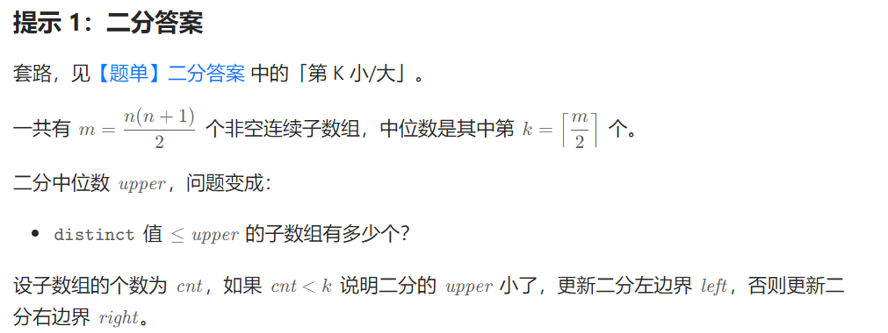
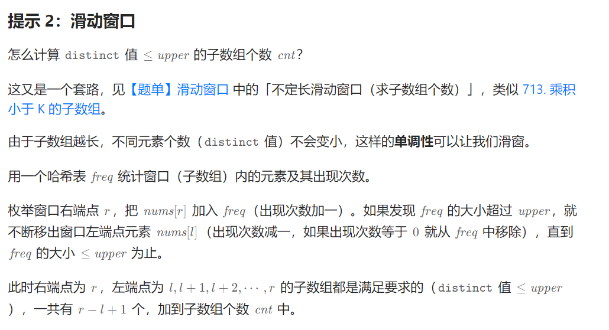

100257\. 找出唯一性数组的中位数
--------------------

给你一个整数数组 `nums` 。数组 `nums` 的 **唯一性数组** 是一个按元素从小到大排序的数组，包含了 `nums` 的所有

非空子数组中不同元素的个数。

换句话说，这是由所有 `0 <= i <= j < nums.length` 的 `distinct(nums[i..j])` 组成的递增数组。

其中，`distinct(nums[i..j])` 表示从下标 `i` 到下标 `j` 的子数组中不同元素的数量。

返回 `nums` **唯一性数组** 的 **中位数** 。

**注意**，数组的 **中位数** 定义为有序数组的中间元素。如果有两个中间元素，则取值较小的那个。

**示例 1：**

**输入：**nums = \[1,2,3\]

**输出：**1

**解释：**

`nums` 的唯一性数组为 `[distinct(nums[0..0]), distinct(nums[1..1]), distinct(nums[2..2]), distinct(nums[0..1]), distinct(nums[1..2]), distinct(nums[0..2])]`，即 `[1, 1, 1, 2, 2, 3]` 。唯一性数组的中位数为 1 ，因此答案是 1 。

**示例 2：**

**输入：**nums = \[3,4,3,4,5\]

**输出：**2

**解释：**

`nums` 的唯一性数组为 `[1, 1, 1, 1, 1, 2, 2, 2, 2, 2, 2, 2, 3, 3, 3]` 。唯一性数组的中位数为 2 ，因此答案是 2 。

**示例 3：**

**输入：**nums = \[4,3,5,4\]

**输出：**2

**解释：**

`nums` 的唯一性数组为 `[1, 1, 1, 1, 2, 2, 2, 3, 3, 3]` 。唯一性数组的中位数为 2 ，因此答案是 2 。

**提示：**

*   `1 <= nums.length <= 105`
*   `1 <= nums[i] <= 105`

[https://leetcode.cn/problems/find-the-median-of-the-uniqueness-array/description/](https://leetcode.cn/problems/find-the-median-of-the-uniqueness-array/description/)





```java
import java.util.HashMap;

class Solution {
    public int medianOfUniquenessArray(int[] nums) {
        int n = nums.length;
        long k = ((long) (n + 1) * n / 2 + 1) / 2; 
        int left = 0, right = n - 1;
        while (left <= right) { // 二分子数组中不同元素的个数，子数组不同元素个数与子数组个数成正比。
            int mid = left + (right - left) / 2;
            if (check(nums, mid, k)) {
                right = mid - 1;
            }else{
                left = mid + 1;
            }
        }
        return right + 1;
    }

    private boolean check(int[] nums, int upper, long target) { // 子数组的不同个数最多为upper的数组个数cnt，与中位数比较
        // 因为子数组的长度与数组内不同元素个数成正比，可以二分
        long cnt = 0;
        HashMap<Integer, Integer> map = new HashMap<>();
        int left = 0;
        for (int right = 0; right < nums.length; right++) {
            map.merge(nums[right], 1, Integer::sum);
            while (map.size() > upper) {
                int out = nums[left++];
                if (map.merge(out, -1, Integer::sum) == 0) {
                    map.remove(out);
                }
            }
            cnt += right - left + 1; // 子数组个数累加式，公式要记住！
            if (cnt >= target) {
                return true;
            }
        }
        return false;
    }
}
```
3139\. 使数组中所有元素相等的最小开销
----------------------

给你一个整数数组 `nums` 和两个整数 `cost1` 和 `cost2` 。你可以执行以下 **任一** 操作 **任意** 次：

*   从 `nums` 中选择下标 `i` 并且将 `nums[i]` **增加** `1` ，开销为 `cost1`。
*   选择 `nums` 中两个 **不同** 下标 `i` 和 `j` ，并且将 `nums[i]` 和 `nums[j]` 都 **增加** `1` ，开销为 `cost2` 。

你的目标是使数组中所有元素都 **相等** ，请你返回需要的 **最小开销** 之和。

由于答案可能会很大，请你将它对 `109 + 7` **取余** 后返回。

**示例 1：**

**输入：**nums = \[4,1\], cost1 = 5, cost2 = 2

**输出：**15

**解释：**

执行以下操作可以使数组中所有元素相等：

*   将 `nums[1]` 增加 1 ，开销为 5 ，`nums` 变为 `[4,2]` 。
*   将 `nums[1]` 增加 1 ，开销为 5 ，`nums` 变为 `[4,3]` 。
*   将 `nums[1]` 增加 1 ，开销为 5 ，`nums` 变为 `[4,4]` 。

总开销为 15 。

**示例 2：**

**输入：**nums = \[2,3,3,3,5\], cost1 = 2, cost2 = 1

**输出：**6

**解释：**

执行以下操作可以使数组中所有元素相等：

*   将 `nums[0]` 和 `nums[1]` 同时增加 1 ，开销为 1 ，`nums` 变为 `[3,4,3,3,5]` 。
*   将 `nums[0]` 和 `nums[2]` 同时增加 1 ，开销为 1 ，`nums` 变为 `[4,4,4,3,5]` 。
*   将 `nums[0]` 和 `nums[3]` 同时增加 1 ，开销为 1 ，`nums` 变为 `[5,4,4,4,5]` 。
*   将 `nums[1]` 和 `nums[2]` 同时增加 1 ，开销为 1 ，`nums` 变为 `[5,5,5,4,5]` 。
*   将 `nums[3]` 增加 1 ，开销为 2 ，`nums` 变为 `[5,5,5,5,5]` 。

总开销为 6 。

**示例 3：**

**输入：**nums = \[3,5,3\], cost1 = 1, cost2 = 3

**输出：**4

**解释：**

执行以下操作可以使数组中所有元素相等：

*   将 `nums[0]` 增加 1 ，开销为 1 ，`nums` 变为 `[4,5,3]` 。
*   将 `nums[0]` 增加 1 ，开销为 1 ，`nums` 变为 `[5,5,3]` 。
*   将 `nums[2]` 增加 1 ，开销为 1 ，`nums` 变为 `[5,5,4]` 。
*   将 `nums[2]` 增加 1 ，开销为 1 ，`nums` 变为 `[5,5,5]` 。

总开销为 4 。

**提示：**

*   `1 <= nums.length <= 105`
*   `1 <= nums[i] <= 106`
*   `1 <= cost1 <= 106`
*   `1 <= cost2 <= 106`

[https://leetcode.cn/problems/minimum-cost-to-equalize-array/description/](https://leetcode.cn/problems/minimum-cost-to-equalize-array/description/)

```java
class Solution { // 两种方法：一、枚举值域。学会方法一就行了。
	public int minCostToEqualizeArray(int[] nums, int cost1, int cost2) {
		long mod = (long) (1e9 + 7);
		int n = nums.length, maxv = nums[0], minv = nums[0];
		long sum = 0;
		for (int x : nums) {
			minv = Math.min(minv, x);
			maxv = Math.max(maxv, x);
			sum += x;
		}

		long s = 1L * maxv * n - sum;
		if (2 * cost1 <= cost2)
			return (int) (s * cost1 % mod);

		long res = Long.MAX_VALUE;
		for (int x = maxv; x <= maxv * 2; x++) { // 鸽巢原理
			int d = x - minv;
			long t = 0;
			if (d < s - d) // 也可以取等
				t = s / 2 * cost2 + s % 2 * cost1;
			else
				t = (s - d) * cost2 + (d - (s - d)) * cost1;
			res = Math.min(res, t);
			s += n;
		}
		return (int) (res % mod);
	}
}
```

```java
class Solution { // 二分斜率
    long MOD = (long) 1e9 + 7;
    public int minCostToEqualizeArray(int[] nums, int cost1, int cost2) {
        int n = nums.length;
        long s = 0;
        long mx = Long.MIN_VALUE, mn = Long.MAX_VALUE;
        for (int x : nums) {
            s += x;
            mx = Math.max(mx, x);
            mn = Math.min(mn, x);
        }
        long ans = (mx * n - s) * cost1; // 全部变成mx
        if (2 * cost1 <= cost2) {
            return (int) (ans % MOD);
        }

        long left = mx - mn;
        long right = mx * (n - 1) - (s - mn);
        long t;
        while (true) {
            if (left <= right) {
                long k = left + right;
                t = k / 2 * cost2 + (k % 2) * cost1;
            } else {
                long k = right;
                t = k * cost2 + (left - right) * cost1;
            }
            if (t <= ans) {
                ans = t;
            } else {
                return (int) (ans % MOD);
            }
            right += n - 1;
            left++;
        }
    }
}
```
1802\. 有界数组中指定下标处的最大值
---------------------

给你三个正整数 `n`、`index` 和 `maxSum` 。你需要构造一个同时满足下述所有条件的数组 `nums`（下标 **从 0 开始** 计数）：

*   `nums.length == n`
*   `nums[i]` 是 **正整数** ，其中 `0 <= i < n`
*   `abs(nums[i] - nums[i+1]) <= 1` ，其中 `0 <= i < n-1`
*   `nums` 中所有元素之和不超过 `maxSum`
*   `nums[index]` 的值被 **最大化**

返回你所构造的数组中的 `nums[index]` 。

注意：`abs(x)` 等于 `x` 的前提是 `x >= 0` ；否则，`abs(x)` 等于 `-x` 。

**示例 1：**

**输入：**n = 4, index = 2,  maxSum = 6
**输出：**2
**解释：**数组 \[1,1,**2**,1\] 和 \[1,2,**2**,1\] 满足所有条件。不存在其他在指定下标处具有更大值的有效数组。

**示例 2：**

**输入：**n = 6, index = 1,  maxSum = 10
**输出：**3

**提示：**

*   `1 <= n <= maxSum <= 109`
*   `0 <= index < n`

[https://leetcode.cn/problems/maximum-value-at-a-given-index-in-a-bounded-array/](https://leetcode.cn/problems/maximum-value-at-a-given-index-in-a-bounded-array/)

```java
class Solution {
    public int maxValue(int n, int index, int maxSum) {
        //确定nums[index]的边界,左侧边界最小正整数1,右侧边界是maxSum;
        int left = 1, right = maxSum;
        //二分查找
        while(left <= right){
            int mid = left + (right - left) / 2;
            if(check(mid,n,index,maxSum)){
                left = mid + 1;
            }else{
                right = mid - 1 ;
            }

        }
        return left - 1;
    }
    //通过左侧求和+mid+右侧求和<=maxSum作为判断条件
    public boolean check(int mid,int n,int index,int maxSum){
        int leftNums = index;
        int rightNums = n-1-index;
        return cal(mid,leftNums)+cal(mid,rightNums)+mid<=maxSum;
    }

    public long cal(int mid,int length){
        //仅分析左侧情况
        //mid左侧的最大值为mid-1,如果length刚好等于mid-1,则1....mid-1求和为(mid-1)*mid/2;
        //如果length<mid-1,那么根据贪心,左侧应该是(mid-length)....mid-1求和为(small+mid-1)*length/2;
        //如果length>mid-1,那么根据贪心,在左侧补全1即可,左侧应该是1,1,....,1,2,3,...mid-1求和为(mid-1)*mid/2+(length-(mid-1))
        if(length < mid-1){
            int small = mid-length;
            return (long)(small+mid-1)*length/2;
        }else{
            int ones = length-(mid-1);
            return (long)(mid-1)*mid/2+ones;
        }
    }
}
```

81\. 搜索旋转排序数组 II
----------------

已知存在一个按非降序排列的整数数组 `nums` ，数组中的值不必互不相同。

在传递给函数之前，`nums` 在预先未知的某个下标 `k`（`0 <= k < nums.length`）上进行了 **旋转** ，使数组变为 `[nums[k], nums[k+1], ..., nums[n-1], nums[0], nums[1], ..., nums[k-1]]`（下标 **从 0 开始** 计数）。例如， `[0,1,2,4,4,4,5,6,6,7]` 在下标 `5` 处经旋转后可能变为 `[4,5,6,6,7,0,1,2,4,4]` 。

给你 **旋转后** 的数组 `nums` 和一个整数 `target` ，请你编写一个函数来判断给定的目标值是否存在于数组中。如果 `nums` 中存在这个目标值 `target` ，则返回 `true` ，否则返回 `false` 。

你必须尽可能减少整个操作步骤。

**示例 1：**

**输入：**nums = \[2`,5,6,0,0,1,2]`, target = 0
**输出：**true

**示例 2：**

**输入：**nums = \[2`,5,6,0,0,1,2]`, target = 3
**输出：**false

**提示：**

*   `1 <= nums.length <= 5000`
*   `-104 <= nums[i] <= 104`
*   题目数据保证 `nums` 在预先未知的某个下标上进行了旋转
*   `-104 <= target <= 104`

**进阶：**

*   这是 [搜索旋转排序数组](https://leetcode-cn.com/problems/search-in-rotated-sorted-array/description/) 的延伸题目，本题中的 `nums`  可能包含重复元素。
*   这会影响到程序的时间复杂度吗？会有怎样的影响，为什么？

[https://leetcode.cn/problems/search-in-rotated-sorted-array-ii/](https://leetcode.cn/problems/search-in-rotated-sorted-array-ii/)

```java
class Solution {
    public boolean search(int[] nums, int target) {
        int left = 0, right = nums.length - 1;
        while (left <= right) {
            int mid = (left + right) / 2;
            if (nums[mid] == target) {
                return true;
            }
            if (nums[mid] == nums[left]) {
                left++;
                continue;
            } else if (nums[left] < nums[mid]) { // 前半部分有序
                if (nums[left] == target) {
                    return true;
                } else if (nums[mid] > target && nums[left] < target) {
                    right = mid - 1;
                } else {
                    left = mid + 1;
                }
            } else { // 后半部分有序 nums[left] > nums[mid]
                if (target == nums[right]) {
                    return true;
                }
                if (target < nums[right] && nums[mid] < target) {
                    left = mid + 1;
                } else {
                    right = mid - 1;
                }
            }
        }
        return false;
    }
}
```

162\. 寻找峰值
----------

峰值元素是指其值严格大于左右相邻值的元素。

给你一个整数数组 `nums`，找到峰值元素并返回其索引。数组可能包含多个峰值，在这种情况下，返回 **任何一个峰值** 所在位置即可。

你可以假设 `nums[-1] = nums[n] = -∞` 。

你必须实现时间复杂度为 `O(log n)` 的算法来解决此问题。

**示例 1：**

**输入：**nums = `[1,2,3,1]`
**输出：**2
**解释：**3 是峰值元素，你的函数应该返回其索引 2。

**示例 2：**

**输入：**nums = `[`1,2,1,3,5,6,4\]
**输出：**1 或 5 
**解释：**你的函数可以返回索引 1，其峰值元素为 2；
     或者返回索引 5， 其峰值元素为 6。

**提示：**

*   `1 <= nums.length <= 1000`
*   `-231 <= nums[i] <= 231 - 1`
*   对于所有有效的 `i` 都有 `nums[i] != nums[i + 1]`

[https://leetcode.cn/problems/find-peak-element/description/](https://leetcode.cn/problems/find-peak-element/description/)

```java
class Solution {
    public int findPeakElement(int[] nums) {
        int n = nums.length;
        int left = 0, right = n - 2;
        while (left <= right) {
            int mid = left + (right - left) / 2;
            if (nums[mid] <= nums[mid + 1]) {
                left = mid + 1;
            }else{
                right = mid - 1;
            }
        }
        return left;
    }
}
```

1901\. 寻找峰值 II
--------------

一个 2D 网格中的 **峰值** 是指那些 **严格大于** 其相邻格子(上、下、左、右)的元素。

给你一个 **从 0 开始编号** 的 `m x n` 矩阵 `mat` ，其中任意两个相邻格子的值都 **不相同** 。找出 **任意一个 峰值** `mat[i][j]` 并 **返回其位置** `[i,j]` 。

你可以假设整个矩阵周边环绕着一圈值为 `-1` 的格子。

要求必须写出时间复杂度为 `O(m log(n))` 或 `O(n log(m))` 的算法

**示例 1:**


**输入:** mat = \[\[1,4\],\[3,2\]\]
**输出:** \[0,1\]
**解释:** 3 和 4 都是峰值，所以\[1,0\]和\[0,1\]都是可接受的答案。

**示例 2:**

****

**输入:** mat = \[\[10,20,15\],\[21,30,14\],\[7,16,32\]\]
**输出:** \[1,1\]
**解释:** 30 和 32 都是峰值，所以\[1,1\]和\[2,2\]都是可接受的答案。

**提示：**

*   `m == mat.length`
*   `n == mat[i].length`
*   `1 <= m, n <= 500`
*   `1 <= mat[i][j] <= 105`
*   任意两个相邻元素均不相等.

[https://leetcode.cn/problems/find-a-peak-element-ii/description/](https://leetcode.cn/problems/find-a-peak-element-ii/description/)

```java
class Solution {
    public int[] findPeakGrid(int[][] mat) {
        int n = mat.length, m = mat[0].length;
        int left = 0, right = n - 1;
        while (left <= right) {
            int mid = left + (right - left) / 2;
            int j = -1, maxElement = -1;
            for (int i = 0; i < m; i++) { // 找到行的最大值
                if (mat[mid][i] > maxElement) {
                    maxElement = mat[mid][i];
                    j = i;
                }
            }
            // 找列的最大值
            if (mid + 1 < n && mat[mid][j] < mat[mid + 1][j]) {
                left = mid + 1;
                continue;
            }
            if (mid - 1 >= 0 && mat[mid][j] < mat[mid - 1][j]) {
                right = mid - 1;
                continue;
            }
            return new int[]{mid, j};
        }
        return new int[]{0, 0};
    }
}
```

2426\. 满足不等式的数对数目
-----------------

给你两个下标从 **0** 开始的整数数组 `nums1` 和 `nums2` ，两个数组的大小都为 `n` ，同时给你一个整数 `diff` ，统计满足以下条件的 **数对** `(i, j)` ：

*   `0 <= i < j <= n - 1` **且**
*   `nums1[i] - nums1[j] <= nums2[i] - nums2[j] + diff`.

请你返回满足条件的 **数对数目** 。

**示例 1：**

**输入：**nums1 = \[3,2,5\], nums2 = \[2,2,1\], diff = 1
**输出：**3
**解释：**
总共有 3 个满足条件的数对：
1. i = 0, j = 1：3 - 2 <= 2 - 2 + 1 。因为 i < j 且 1 <= 1 ，这个数对满足条件。
2. i = 0, j = 2：3 - 5 <= 2 - 1 + 1 。因为 i < j 且 -2 <= 2 ，这个数对满足条件。
3. i = 1, j = 2：2 - 5 <= 2 - 1 + 1 。因为 i < j 且 -3 <= 2 ，这个数对满足条件。
  所以，我们返回 3 。

**示例 2：**

**输入：**nums1 = \[3,-1\], nums2 = \[-2,2\], diff = -1
**输出：**0
**解释：**
没有满足条件的任何数对，所以我们返回 0 。

**提示：**

*   `n == nums1.length == nums2.length`
*   `2 <= n <= 105`
*   `-104 <= nums1[i], nums2[i] <= 104`
*   `-104 <= diff <= 104`

[https://leetcode.cn/problems/number-of-pairs-satisfying-inequality/](https://leetcode.cn/problems/number-of-pairs-satisfying-inequality/)

```java
class Solution {
    int N = 40005;
    public long numberOfPairs(int[] nums1, int[] nums2, int diff) {
        int n = nums1.length;
        int[] nums = new int[n];
        for (int i = 0; i < n; i++) {
            nums[i] = nums1[i] - nums2[i];
        }
        long ans = 0L;
        BitTree tree = new BitTree(N);
        for (int i = 0; i < n; i++) {
            int num = 20001 + nums[i];
            if (num + diff < N) {
                ans += tree.query(num + diff);
            }else{
                ans += tree.query(N);
            }
            tree.update(num);
        }
        return ans;
    }

    // 树状数组模板
    class BitTree {
        // 最大数组长度
        private int maxN;
        // 树状数组存储结构
        private int[] treeArray;

        // 构造函数，初始化树状数组
        public BitTree(int maxN) {
            this.maxN = maxN;
            treeArray = new int[maxN + 1];
        }

        // 获取x的二进制表示中最低位的1所对应的值
        public int lowBit(int x) {
            return x & (-x);
        }

        // 更新操作，将数组中位置x的元素加1
        public void update(int x) {
            while (x <= maxN) {
                treeArray[x]++;
                x += lowBit(x);
            }
        }

        // 查询操作，获取数组前缀和，即位置1到位置x的所有元素的和
        public int query(int x) {
            int res = 0;
            while (x >= 1) {
                res += treeArray[x];
                x -= lowBit(x);
            }
            return res;
        }
    }
}
```

2141\. 同时运行 N 台电脑的最长时间
----------------------

你有 `n` 台电脑。给你整数 `n` 和一个下标从 **0** 开始的整数数组 `batteries` ，其中第 `i` 个电池可以让一台电脑 **运行** `batteries[i]` 分钟。你想使用这些电池让 **全部** `n` 台电脑 **同时** 运行。

一开始，你可以给每台电脑连接 **至多一个电池** 。然后在任意整数时刻，你都可以将一台电脑与它的电池断开连接，并连接另一个电池，你可以进行这个操作 **任意次** 。新连接的电池可以是一个全新的电池，也可以是别的电脑用过的电池。断开连接和连接新的电池不会花费任何时间。

注意，你不能给电池充电。

请你返回你可以让 `n` 台电脑同时运行的 **最长** 分钟数。

**示例 1：**


**输入：**n = 2, batteries = \[3,3,3\]
**输出：**4
**解释：**
一开始，将第一台电脑与电池 0 连接，第二台电脑与电池 1 连接。
2 分钟后，将第二台电脑与电池 1 断开连接，并连接电池 2 。注意，电池 0 还可以供电 1 分钟。
在第 3 分钟结尾，你需要将第一台电脑与电池 0 断开连接，然后连接电池 1 。
在第 4 分钟结尾，电池 1 也被耗尽，第一台电脑无法继续运行。
我们最多能同时让两台电脑同时运行 4 分钟，所以我们返回 4 。

**示例 2：**


**输入：**n = 2, batteries = \[1,1,1,1\]
**输出：**2
**解释：**
一开始，将第一台电脑与电池 0 连接，第二台电脑与电池 2 连接。
一分钟后，电池 0 和电池 2 同时耗尽，所以你需要将它们断开连接，并将电池 1 和第一台电脑连接，电池 3 和第二台电脑连接。
1 分钟后，电池 1 和电池 3 也耗尽了，所以两台电脑都无法继续运行。
我们最多能让两台电脑同时运行 2 分钟，所以我们返回 2 。

**提示：**

*   `1 <= n <= batteries.length <= 105`
*   `1 <= batteries[i] <= 109`

[https://leetcode.cn/problems/maximum-running-time-of-n-computers/solutions/1214440/liang-chong-jie-fa-er-fen-da-an-pai-xu-t-grd8/](https://leetcode.cn/problems/maximum-running-time-of-n-computers/solutions/1214440/liang-chong-jie-fa-er-fen-da-an-pai-xu-t-grd8/)

```java
class Solution {
    public long maxRunTime(int n, int[] batteries) {
        long tot = 0L;
        for (int b : batteries) {
            tot += b;
        }
        long l = 0L, r = tot / n;
        while (l < r) {
            long x = (l + r + 1) / 2;
            long sum = 0L;
            for (var b : batteries) {
                sum += Math.min(b, x);
            }
            if (n * x <= sum) {
                l = x;
            } else {
                r = x - 1;
            }
        }
        return l;
    }
}

```

2616\. 最小化数对的最大差值
-----------------

给你一个下标从 **0** 开始的整数数组 `nums` 和一个整数 `p` 。请你从 `nums` 中找到 `p` 个下标对，每个下标对对应数值取差值，你需要使得这 `p` 个差值的 **最大值** **最小**。同时，你需要确保每个下标在这 `p` 个下标对中最多出现一次。

对于一个下标对 `i` 和 `j` ，这一对的差值为 `|nums[i] - nums[j]|` ，其中 `|x|` 表示 `x` 的 **绝对值** 。

请你返回 `p` 个下标对对应数值 **最大差值** 的 **最小值** 。

**示例 1：**

**输入：**nums = \[10,1,2,7,1,3\], p = 2
**输出：**1
**解释：**第一个下标对选择 1 和 4 ，第二个下标对选择 2 和 5 。
最大差值为 max(|nums\[1\] - nums\[4\]|, |nums\[2\] - nums\[5\]|) = max(0, 1) = 1 。所以我们返回 1 。

**示例 2：**

**输入：**nums = \[4,2,1,2\], p = 1
**输出：**0
**解释：**选择下标 1 和 3 构成下标对。差值为 |2 - 2| = 0 ，这是最大差值的最小值。

**提示：**

*   `1 <= nums.length <= 105`
*   `0 <= nums[i] <= 109`
*   `0 <= p <= (nums.length)/2`

[https://leetcode.cn/problems/minimize-the-maximum-difference-of-pairs/description/](https://leetcode.cn/problems/minimize-the-maximum-difference-of-pairs/description/)

```java
import java.util.Arrays;

class Solution {
    public int minimizeMax(int[] nums, int p) {
        Arrays.sort(nums);
        int n = nums.length;
        int left = 0, right = nums[n - 1];
        while (left <= right) {
            int mid = left + (right - left) / 2;
            if (check(nums, p, mid)) {
                right = mid - 1;
            }else{
                left = mid + 1;
            }
        }
        return right + 1;
    }

    private boolean check(int[] nums, int p, int lowMx) {
        int cnt = 0, pre = nums[0];
        for (int i = 1; i < nums.length; i++) {
            if (nums[i] - pre <= lowMx) {
                cnt++;
                if (i + 1 >= nums.length) {
                    break;
                }
                pre = nums[i + 1];
                i++;
            }else{
                pre = nums[i];
            }
        }
        return cnt >= p;
    }
}
```

3116\. 单面值组合的第 K 小金额
--------------------

给你一个整数数组 `coins` 表示不同面额的硬币，另给你一个整数 `k` 。

你有无限量的每种面额的硬币。但是，你 **不能** 组合使用不同面额的硬币。

返回使用这些硬币能制造的 **第** `kth` **小** 金额。

**示例 1：**

**输入：** coins = \[3,6,9\], k = 3

**输出：** 9

**解释：**给定的硬币可以制造以下金额：  
3元硬币产生3的倍数：3, 6, 9, 12, 15等。  
6元硬币产生6的倍数：6, 12, 18, 24等。  
9元硬币产生9的倍数：9, 18, 27, 36等。  
所有硬币合起来可以产生：3, 6, **9**, 12, 15等。

**示例 2：**

**输入：**coins = \[5,2\], k = 7

**输出：**12

**解释：**给定的硬币可以制造以下金额：  
5元硬币产生5的倍数：5, 10, 15, 20等。  
2元硬币产生2的倍数：2, 4, 6, 8, 10, 12等。  
所有硬币合起来可以产生：2, 4, 5, 6, 8, 10, **12**, 14, 15等。

**提示：**

*   `1 <= coins.length <= 15`
*   `1 <= coins[i] <= 25`
*   `1 <= k <= 2 * 109`
*   `coins` 包含两两不同的整数。

[https://leetcode.cn/problems/kth-smallest-amount-with-single-denomination-combination/description/](https://leetcode.cn/problems/kth-smallest-amount-with-single-denomination-combination/description/)

```java
import java.util.Arrays;

class Solution {
    public long findKthSmallest(int[] coins, int k) {
        long left = k, right = (long) Arrays.stream(coins).max().getAsInt() * k;
        while (left <= right) {
            long mid = left + (right - left) / 2;
            if (check(mid, k, coins)) {
                right = mid - 1;
            }else{
                left = mid + 1;
            }
        }
        return right + 1;
    }

    private boolean check(long m, int k, int[] coins) {
        long cnt = 0;
        next:
        for (int i = 1; i < (1 << coins.length); i++) { // 1<<coins.length这么多组合
            long lcmRes = 1;
            for (int j = 0; j < coins.length; j++) {
                if ((i >> j & 1) == 1) { // 如果选择银币j
                    lcmRes = lcm(lcmRes, coins[j]);
                    if (lcmRes > m) {
                        continue next; // 当代码执行到 continue next; 时，它会跳到标签 next 所指定的位置，也就是外层 for 循环的下一个迭代。
                    }
                }
            }
            cnt += Integer.bitCount(i) % 2 == 1 ? m / lcmRes : -m / lcmRes; // 容斥原理
        }
        return cnt >= k;
    }

    private long gcd(long a, long b) {
        return b == 0 ? a : gcd(b, a % b);
    }

    private long lcm(long a, long b) {
        return a * b / gcd(a, b);
    }
}
```

2386\. 找出数组的第 K 大和
------------------

给你一个整数数组 `nums` 和一个 **正** 整数 `k` 。你可以选择数组的任一 **子序列** 并且对其全部元素求和。

数组的 **第 k 大和** 定义为：可以获得的第 `k` 个 **最大** 子序列和（子序列和允许出现重复）

返回数组的 **第 k 大和** 。

子序列是一个可以由其他数组删除某些或不删除元素派生而来的数组，且派生过程不改变剩余元素的顺序。

**注意：**空子序列的和视作 `0` 。

**示例 1：**

**输入：**nums = \[2,4,-2\], k = 5
**输出：**2
**解释：**所有可能获得的子序列和列出如下，按递减顺序排列：
6、4、4、2、**_2_**、0、0、-2
数组的第 5 大和是 2 。

**示例 2：**

**输入：**nums = \[1,-2,3,4,-10,12\], k = 16
**输出：**10
**解释：**数组的第 16 大和是 10 。

**提示：**

*   `n == nums.length`
*   `1 <= n <= 105`
*   `-109 <= nums[i] <= 109`
*   `1 <= k <= min(2000, 2n)`

[https://leetcode.cn/problems/find-the-k-sum-of-an-array/description/?envType=daily-question&envId=2024-03-09](https://leetcode.cn/problems/find-the-k-sum-of-an-array/description/?envType=daily-question&envId=2024-03-09)

```java
class Solution {
    public long kSum(int[] nums, int k) {
        long sum = 0, right = 0;
        for (int i = 0; i < nums.length; i++) {
            if (nums[i] >= 0) {
                sum += nums[i];
            } else {
                nums[i] = -nums[i];
            }
            right += nums[i];
        }
        Arrays.sort(nums);

        long left = -1;
        while (left + 1 < right) { // 开区间二分，原理见【前置知识】
            long mid = (left + right) / 2;
            cnt = k - 1; // 空子序列算一个
            dfs(0, mid, nums);
            if (cnt == 0) { // 找到 k 个元素和不超过 mid 的子序列
                right = mid;
            } else {
                left = mid;
            }
        }
        return sum - right;
    }

    private int cnt;

    // 反向递归，增加改成减少，这样可以少传一些参数
    private void dfs(int i, long s, int[] nums) {
        if (cnt == 0 || i == nums.length || s < nums[i]) {
            return;
        }
        cnt--;
        dfs(i + 1, s - nums[i], nums); // 选
        dfs(i + 1, s, nums); // 不选
    }
}
```

```java
class Solution {
    public long kSum(int[] nums, int k) {
        long sum = 0;
        for (int i = 0; i < nums.length; i++) {
            if (nums[i] >= 0) {
                sum += nums[i];
            } else {
                nums[i] = -nums[i];
            }
        }
        Arrays.sort(nums);

        PriorityQueue<Pair<Long, Integer>> pq = new PriorityQueue<>((a, b) -> Long.compare(a.getKey(), b.getKey()));
        pq.offer(new Pair<>(0L, 0)); // 空子序列
        while (--k > 0) {
            Pair<Long, Integer> p = pq.poll();
            long s = p.getKey();
            int i = p.getValue();
            if (i < nums.length) {
                // 在子序列的末尾添加 nums[i]
                pq.offer(new Pair<>(s + nums[i], i + 1)); // 下一个添加/替换的元素下标为 i+1
                if (i > 0) { // 替换子序列的末尾元素为 nums[i]
                    pq.offer(new Pair<>(s + nums[i] - nums[i - 1], i + 1));
                }
            }
        }
        return sum - pq.peek().getKey();
    }
}
```

