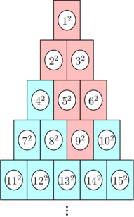
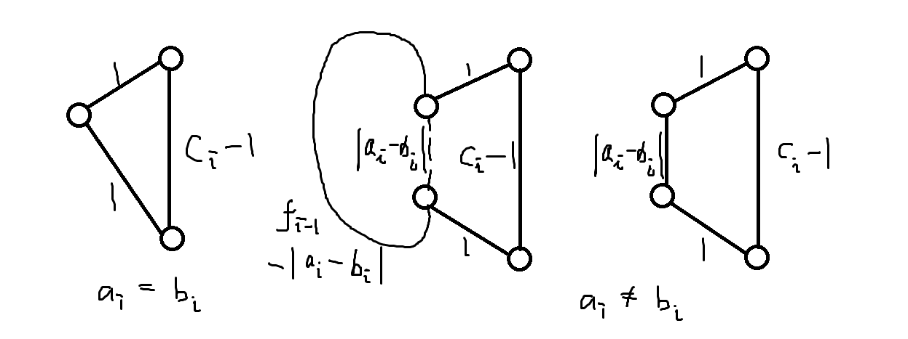
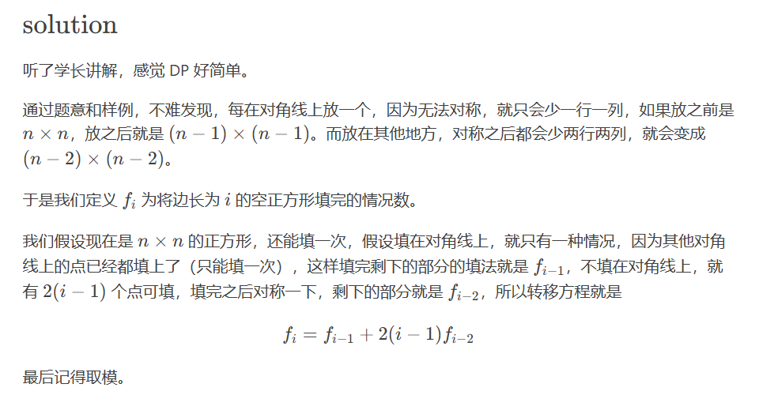
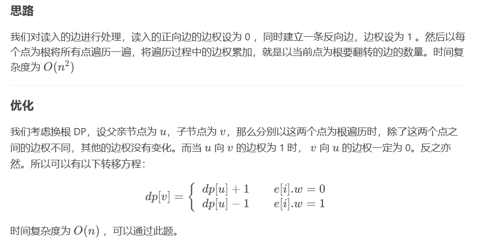

# 【思维dp】

## CF1695C Zero Path【1700】

>  题意：给你一个 n×m (1≤n,m≤1000) 的格点图，每个格子的值要么是 −1，要么是 1，现在问你，是否有一条从 (1,1) 到 (n,m) 的路径，使得路径上经过的格点的值的和为 0。在路径中，只能从 ai,j 移动到 ai+1,j 或是 ai,j+1（向右或是向下走）。 
>
> https://www.luogu.com.cn/problem/CF1695C

```java
import java.io.BufferedReader;
import java.io.BufferedWriter;
import java.io.IOException;
import java.io.InputStreamReader;
import java.io.OutputStreamWriter;
import java.util.*;

public class Main {
	public static void solve() throws IOException {
		n = sc.nextInt();
		m = sc.nextInt();
		grid = new int[n][m];
		for(int i = 0;i<n;i++) {
			ss = sc.nextLine().split(" ");
			for(int j = 0;j<m;j++) {
				grid[i][j] = Integer.parseInt(ss[j]);
			}
		}
		if((n + m - 1)%2==1) {
			sc.print("NO\n");
			return;
		}
		int[][] dp1 = new int[n][m]; // 表示到点(i, j)的最小和
		int[][] dp2 = new int[n][m]; // 表示到点(i, j)的最大和
		for(int i = 0;i<n;i++) {
			Arrays.fill(dp1[i], Integer.MAX_VALUE/2);
			Arrays.fill(dp2[i], Integer.MIN_VALUE/2);
		}
		dp1[0][0] = dp2[0][0] = grid[0][0];
		for(int i = 0;i<n;i++) {
			for(int j = 0;j<m;j++) {
				if(i>0) {
					dp1[i][j] = dp1[i - 1][j] + grid[i][j];
					dp2[i][j] = dp2[i - 1][j] + grid[i][j];
				}
				if(j>0) {
					dp1[i][j] = Math.min(dp1[i][j], dp1[i][j - 1] + grid[i][j]);
					dp2[i][j] = Math.max(dp2[i][j], dp2[i][j - 1] + grid[i][j]);
				}
			}
		}
		if(dp1[n - 1][m - 1]<=0 && dp2[n - 1][m - 1]>=0) {
			sc.print("YES\n");
		}else {
			sc.print("NO\n");
		}
	}
}

```

## CF1151B Dima and a Bad XOR【1600】

> 题意：给你一个grid，每一行选择一个数，如果异或和大于0，则输出这些数的列；
>
> https://www.luogu.com.cn/problem/CF1151B

```java
public class Main{ // 随机化
    public static void solve() throws IOException {
		// 因为只有10位，枚举这10位，然后只要一位不等于0就行
		int n = sc.nextInt(), m = sc.nextInt();
		int[][] grid = new int[n][m];
		for(int i = 0;i<n;i++) {
			ss = sc.nextLine().split(" ");
			for(int j = 0;j<m;j++) {
				grid[i][j] = Integer.parseInt(ss[j]);
			}
		}
		int[] f = new int[n];
		Random rd = new Random();
		for(int t = 0;t<10000;t++) {
			int res = 0;
			for(int i = 0;i<n;i++) {
				f[i] = rd.nextInt(m);
				res^=grid[i][f[i]];
			}
			if(res>0) {
				sc.print("TAK\n");
				for(int i = 0;i<n;i++) {
					sc.print((f[i]+1)+" "); // 下标+1
				}
				return;
			}
		}
		sc.print("NIE");
	}
}
```

```java
public class Main{ // 构造做法，先将第一列异或出来，如果大于0就全部是1；反之枚举每一行，如果有grid[i][j]!=grid[i][0]，那么异或上这个数一定大于0，输出答案。}
```

## CF1829G Hits Different【1600】

> 题意：如上图的纸杯，若一个纸杯倒下，可以得到对应的权值，同时会使得其上方相邻的两个纸杯倒下。求让纸杯 n（对应权值为 n^2）倒下可以得到的总权值。 
>
>  

```java
public class Main{
	static long[][] a = new long[2001][2001];
	static long[] b = new long[4000001];
	
	static { // 错误代码，这里是cnt是int，那么cnt*cnt就是1e12，这里应该处理为long
        int cnt = 1;
        for (int i = 1; i < 2001; i++) {
            for (int j = 1; j <= i; j++) {
                a[i][j] = (i == 1 ? 1 : (long)cnt * cnt + a[i - 1][j - 1] + a[i - 1][j] - a[i - 2][j - 1]); // 递推式
                b[cnt] = a[i][j];
                cnt++;
            }
        }
    }
}
```

## CF1476C Longest Simple Cycle【1600】

> 现在给你N条链
>
> `T`组输入，每组数据输入一行`N`
>
> 接下来3行输入`N`个数据
>
> 第一行为第`i`条链的长度
>
> 第二行为当前链与上一条链连接的起点
>
> 第二行为当前链与上一条链连接的终点
>
> 现在需要你求出这个图上的一个最长环，输出这个最大值
>
> 保证除了第一条链以外的所有链都与上一条链连接
>
> 
>
> 题解：三种状态转移
>
>  

```java
public class Main{
    public static void solve() throws IOException {
		int n = sc.nextInt();
		int[] c = new int[n];
		ss = sc.nextLine().split(" ");
		for(int i = 0;i<n;i++) {
			c[i] = Integer.parseInt(ss[i]);
		}
		int[] a = new int[n];
		ss = sc.nextLine().split(" ");
		for(int i = 0;i<n;i++) {
			a[i] = Integer.parseInt(ss[i]);
		}
		int[] b = new int[n];
		ss = sc.nextLine().split(" ");
		for(int i = 0;i<n;i++) {
			b[i] = Integer.parseInt(ss[i]);
		}
		long[] dp = new long[n]; // dp[i]表示在[0, i]中，必选第i条线的最长环
		long res =0;
		for(int i = 1;i<n;i++) {
			if(a[i]==b[i]) {
				dp[i] = c[i] + 1;
			}else {
				dp[i] = Math.max(c[i] + 1 + Math.abs(a[i] - b[i])
				, dp[i - 1] - Math.abs(a[i] - b[i]) + c[i] + 1);
			}
			res = Math.max(res, dp[i]);
		}
		sc.print(res+"\n");
	}
}
```

## CF1826D Running Miles【1700】

> 题意：给定一个长度为 n 的数列 a，请找出其中的一个区间$ [l,r]$，最大化区间内的前三大值之和与$ r−l $的差，并求出这个值。 
>
> 推理：就是求$b_{i1}+b_{i2}+b_{i3} - (r - l)$的最大值，显然$i1 = l，i3 = r$时最大，变形有$(b_l+l)+b_{l2}+(b_r - r)$，然后就是枚举中间值，预处理左右最大值。

```java
public class Main{
    public static void solve() throws IOException {
		int n = sc.nextInt();
		int[] b = new int[n];
		ss  = sc.nextLine().split(" ");
		for(int i = 0;i<n;i++) {
			b[i] = Integer.parseInt(ss[i]);
		}
		long[] prefixSum = new long[n+1];
		long[] suffixSum = new long[n+1];
		suffixSum[n] = Long.MIN_VALUE; // 这里记得初始化！
		for(int i = 0;i<n;i++) {
			prefixSum[i+1] = Math.max(prefixSum[i], b[i]+i+1);
		}
		for(int i = n - 1;i>=0;i--) {
			suffixSum[i] = Math.max(suffixSum[i+1], b[i] - i - 1); 
		}
		long res = 0;
		for(int i = 1;i<n - 1;i++) {
			res = Math.max(res, prefixSum[i] + b[i] + suffixSum[i+1]);
		}
		sc.print(res+"\n");
	}
}
```

## CF1626C Monsters And Spells【1700】

> 题意：有 n 个敌人，你需要在第 ki 秒用至少 hi 的攻击力打败这个敌人。
>
> 攻击力的计算方式如下：
>
> 1. 第一秒时，你有 1 攻击力
> 2. 对于后面的任意一秒，若前一秒你的攻击力为 x，则这一秒你的攻击力可以为 x+1 或 1
>
> 一秒内，如果你的攻击力为 x ，则你就需要消耗 x 的能量。
>
> 请问，在你打败所有敌人的情况下，最少需要消耗多少能量。
>
> 思路：这题有坑，如果只是分析当前点和上一个点的关系，然后贪心的变化攻击力，就会出问题。
>
> `1000000 1000001 1000002 `
>
>  `1000000 1 1000001 ` 
>
> 这个数据就不行，因为这样到达不了最后一个敌人。所以从后往前，$f[i]$表示当前敌人的最少攻击力。

```java
pulic class Main{
    public static void solve() throws IOException {
		n = sc.nextInt();
		k = new int[n];
		h = new int[n];
		ss = sc.nextLine().split(" ");
		for(int i = 0;i<n;i++) {
			k[i] = Integer.parseInt(ss[i]);
		}
		ss = sc.nextLine().split(" ");
		for(int i = 0;i<n;i++) {
			h[i] = Integer.parseInt(ss[i]);
		}
		long[] f = new long[n]; // 表示到达第i个点的最小攻击力；
		f[n - 1] = h[n - 1];
		for(int i = n - 2;i>=0;i--) {
			long delta = k[i+1] - k[i];
			f[i] = Math.max(f[i+1] - delta, h[i]);
		}
		long res = calc(1, f[0], f[0]);
		long pre = f[0];
		for(int i = 0;i<n - 1;i++) {
			long delta = k[i+1] - k[i];
			if(f[i+1]<=delta) {
				res+=calc(1, f[i+1], f[i+1]);
				pre = f[i+1];
			}else {
				res+=calc(pre+1, pre+delta, delta);
				pre = pre + delta;
			}
		}
		sc.print(res+"\n");
	}
	
	static long calc(long st, long end, long num) { // 等差数列求和
		return (st+end)*num/2;
	}
}
```

## CF1957C How Does the Rook Move?【1600】

> 头脑风暴：
>
> # CF1957C How Does the Rook Move?
>
> ## 题目描述
>
> 你在一个 $n\times n$ 的棋盘上玩一个游戏。
>
> 你每次可以选择在 $(r,c)$ 的位置放置一个**白色的车**，使得放置后所有车无法通过水平或垂直的方向攻击到其它车（无论颜色）。如果 $r\not=c$ 则电脑在 $(c,r)$ 处放一个**黑色的车**，可以证明，如果你的操作合法，电脑操作必定合法。
>
> 现在你已经放置了 $k$ 个白色的车（显然电脑也已经进行了对应操作），如果你继续放车直到没有合法的位置放车，则游戏结束。
>
> 你希望知道游戏结束时形成的局面的可能性。
>
> 答案对 $10^9+7$ 取模。
>
> 两个局面不同当且仅当某个位置上的车颜色不同或其中一个局面放了车而另一个没有。
>
> ## 输入格式
>
> 第一行一个整数 $t$，表示数据组数。
>
> 接下来对于每组数据，第一行两个整数 $n,k$。
>
> 接下来 $k$ 行，每行两个整数 $r_i,c_i$，表示已经放置的白车的位置。
>
> ## 输出格式
>
> 共 $t$ 行，每行一个整数，表示答案。
>
> ## 输入输出样例 #1
>
> ### 输入 #1
>
> ```
> 3
> 4 1
> 1 2
> 8 1
> 7 6
> 1000 4
> 4 4
> 952 343
> 222 333
> 90 91
> ```
>
> ### 输出 #1
>
> ```
> 3
> 331
> 671968183
> ```
>
> ## 说明/提示
>
> 对于全部数据，满足 $ 1 \leq t \leq 10^4 $，$ 1 \leq n \leq 3 \times 10^5 $ , $ 0 \leq k \leq n $，$\sum n\le3\times10^5$。



解释一下：当填第`i`个值，第一种情况填对角线，前`i - 1`个已经固定，所以填对角线只有一个位置可以填；第二种情况，不填对角线，就是在`i*i`的矩阵随便找个位置，但是不能填对角线，所以有`i - 1`种

```java
public class Main{
    public static void solve() throws IOException {
		int n = sc.nextInt(), k = sc.nextInt();
		for(int i = 0;i<k;i++) {
			int r = sc.nextInt(), c = sc.nextInt();
			if(r==c) {
				n--;
			}else {
				n-=2;
			}
		}
		sc.print(f[n]+"\n");
	}
	
	static int MX = (int)3e5+1;
	static long[] f = new long[MX];
	static long Mod = (long) 1e9+7;
	static {
		f[0] = f[1] = 1;
		for(int i = 2;i<MX;i++) {
			f[i] = (f[i - 1] + 2*(i - 1)*f[i - 2]%Mod)%Mod;
		}
	}
}
```

## CF1941E Rudolf and k Bridges【1600】

核心题意：有`n`个桥墩，第`1`个和第`n`个必须选择，然后没相邻两个桥墩的距离不超过` d`。其中 $(i,j1)$ 和$ (i,j2) $之间的距离为 $∣j1−j2∣−1$。 

```java
// 超时写法O(n^2)
public class Main{
    static int d;
    public static long fun(int[] arr){
        int n = arr.length;
		int[] dp = new int[n];
		Arrays.fill(dp, Integer.MAX_VALUE);
		dp[0] = 1;
		for(int i = 1;i<n;i++) {
			for(int j = i - 1;j >= 0;j--) {
				if(i - j - 1 > d) {
					break;
				}
				dp[i] = Math.min(dp[i], dp[j] + arr[i] + 1);
			}
		}
		return dp[n - 1];	
	}
}
```

```java
// 单调队列优化O(n)
public class Main{
    static int d;
    public static long fun(int[] arr){
        int n = arr.length;
		long[] dp = new long[n];
		Arrays.fill(dp, Long.MAX_VALUE);
		dp[0] = 1;
		Deque<Integer> q = new LinkedList<>();
		q.offer(0);
		for(int i = 1;i<n;i++) {
			while(!q.isEmpty() && i - q.peek() - 1>d) {
				q.poll(); // pollFirst();
			}
			dp[i] = Math.min(dp[i], dp[q.peek()]+arr[i]+1);
			while(!q.isEmpty() && dp[q.peekLast()] >= dp[i]) {
				q.pollLast();
			}
			q.offerLast(i);
		}
		return dp[n - 1];	
	}
}
```

## CF1282B2 K for the Price of One (Hard Version)【1600】

你有 `p` 元钱，店里有 `n` 个商品，每个商品价值 `ai` 元。当你购买一个商品时，你可以免费得到 `k−1` 个价值小于等于它的商品 `(k≤n)`，但如果商品数量不足 `k−1` 个时则无法免费得到它们。

请求出你能得到商品数量的最大值。

```java
public static void solve() throws IOException {
		int n = sc.nextInt(), p = sc.nextInt(), k = sc.nextInt();
		int[] arr = new int[n+1];
		ss = sc.nextLine().split(" ");
		for(int i = 0;i<n;i++) {
			arr[i+1] = Integer.parseInt(ss[i]);
		}
		Arrays.sort(arr);
		long[] dp = new long[n+1]; // dp[i]表示买前i个物品的钱，这里难想，我定义的是到第i个位置买的最多物品数，哎 >_<
		Arrays.fill(dp, Long.MAX_VALUE/2);
		dp[0] = 0;
		for(int i = 1;i<=n;i++) {
			if(i>=k) {
				dp[i] = Math.min(dp[i], dp[i - k] + arr[i]);
			}else {
				dp[i] = Math.min(dp[i], dp[i - 1] + arr[i]);
			}
		}
		int res = 0;
		for(int i = n;i>=0;i--) {
			if(dp[i]<=p) {
				res = i;
				break;
			}
		}
		sc.print(res+"\n");
	}
}
```

## CF1498C Planar Reflections【1600】

> 有 n 个平面，从它们的最左端向右发射一个能量级别为 k 的粒子，问你最后有多少个粒子，答案对 $10^9+7$ 取模。
>
> 若一个能级为 k 的粒子穿过一个平面，则它自己会继续原来的方向飞行，能级不改变，平面会生成一个能级为 k−1 的粒子，飞向这个粒子的反方向。

```java
public class Main{
    public static void solve() throws IOException {
		int n = sc.nextInt(), k = sc.nextInt();
		long[][] dp = new long[k+1][n+1]; // 表示能量为i的粒子，还需要经过j个屏障
		long Mod = (long) 1e9+7;
		for(int i = 1;i<=k;i++) {
			dp[i][0] = 1;
		}
		for(int i = 1;i<=n;i++) {
			dp[1][i] = 1;
		}
		for(int i = 1;i<=k;i++) {
			for(int j = 1;j<=n;j++) {
				dp[i][j] = (dp[i][j - 1] + dp[i - 1][n - j])%Mod;
			}
		}
		sc.print(dp[k][n]+"\n");
	}
}
```

## CF219D Choosing Capital for Treeland【1700】

> Treeland 国有 $n$ 个城市，有些城市间存在 **单向** 道路。这个国家一共有 $n - 1$ 条路。我们知道，如果把边视作双向的，那么从任意城市出发能到达任意城市。
>
> 城市的委员会最近决定为 Treeland 国选择一个首都，显然首都会是国中的一个城市。委员会将在首都开会，并经常去其他城市（这里不考虑从其他城市回到首都）。因此，如果城市 $a$ 被选为首都，那么所有的道路应该被定向，以使得我们能从城市 $a$ 到达其他城市。所以，有些路可能需要反转方向。
>
> 帮助委员会选择首都使得他们需要反转道路的次数最小。



```java
public class Main{
    public static void solve() throws IOException {
		int n = sc.nextInt();
		g = new List[n+1];
		Arrays.setAll(g, e->new ArrayList<>());
		for(int i = 0;i<n - 1;i++) {
			int x = sc.nextInt(), y = sc.nextInt();
			g[x].add(new int[]{y, 0});
			g[y].add(new int[] {x, 1});
		}
		dp = new int[n+1];
		dp[1] = dfs1(1,  0);
		dfs2(1, 0);
		int mn = Integer.MAX_VALUE;
		for(int i = 1;i<=n;i++) {
			mn = Math.min(mn, dp[i]);
		}
		sc.print(mn+"\n");
		for(int i = 1;i<=n;i++) {
			if(dp[i]==mn) {
				sc.print(i+" ");
			}
		}
	}
	static int[] dp;
	
	static int dfs1(int x, int fa) {
		int res = 0;
		for(int[] y:g[x]) {
			if(y[0]!=fa) {
				res+=dfs1(y[0], x)+y[1];
			}
		}
		return res;
	}
	
	static void dfs2(int x, int fa) {
		for(int[] y:g[x]) {
			if(y[0]!=fa) {
				dp[y[0]] += dp[x] + (y[1]==1?-1:1); // 先序遍历
				dfs2(y[0], x);
			}
		}
	}
}
```

## CF1875D Jellyfish and Mex【1600】

> 给出一个长度为 n 的序列 a，每次从中删除一个数直到删完，求每次**删数之后**的序列的 `mex` 的和的最小值（$∑n≤5000,a_i≤10^9$）。 
>

```java
public class Main{
    public static void solve() throws IOException {
		int n = sc.nextInt();
		ss = sc.nextLine().split(" ");
		HashMap<Integer, Integer> map = new HashMap<>();
		int[] a = new int[n];
		for(int i = 0;i<n;i++) {
			a[i] = Integer.parseInt(ss[i]);
			map.merge(a[i], 1, Integer::sum);
		}
		Arrays.sort(a);
		int p = 0; // 当前数组的mex
		for(int x:a) {
			if(x<p) {
				continue;
			}
			if(x==p) {
				p++;
			}
			if(x>p) {
				break;
			}
		}
		// dp[i]表示使mex = i的代价， dp[i] = Math.min(dp[i], dp[j] + (c[i] - 1) * j + i)  i<j
		long[] dp = new long[p+1];
		Arrays.fill(dp, Long.MAX_VALUE);
		dp[p] = 0;
		for(int i = p - 1;i>=0;i--) {
			for(int j = i+1;j<=p;j++) {
				dp[i] = Math.min(dp[i], dp[j] + (map.get(i) - 1)*j + i);
			}
		}
		sc.print(dp[0]+"\n");
	}
}
```

## CF1969C Minimizing the Sum【1700】

> 给你一个长度为 n 的整数数组 a。
>
> 你可以执行以下操作：选择数组中的一个元素，并用其邻近元素的值替换它。
>
> 你的任务是计算在执行上述操作最多 k 次的情况下，数组的总和可能达到的最小值。=

```java
import java.io.*;
import java.util.*;

/**
 * 题目描述：
 * 给定一个长度为 n 的数组 a，允许最多进行 K 次操作，每次操作选择一个
 * 元素并将它替换成其相邻元素的值。
 * 本题目要求求出经过最多 K 次操作后，数组元素和的最小值。
 *
 * 思路：  区间dp
 * 1. 使用动态规划 dp[i][j] 表示处理到位置 i（1-indexed），用掉 j 次操作时可达到的最小总代价。
 * 2. 对于每个位置 i，我们尝试将从位置 i 开始连续更新 k 个元素，其中 k 的范围是 0 到 min(K - j, n - i)。
 *    更新的过程中维护最小值 mn，代表区间 [i, i+k] 内如果全部变成 mn，所需付出的成本为 (k+1) * mn。
 * 3. 状态转移：dp[i + k][j + k] = min(dp[i + k][j + k], dp[i - 1][j] + (k + 1) * mn)
 * 4. 最终答案为 dp[n][x] x 从 0 到 K 的最小值。
 *
 * 注意：
 * 1. 本实现使用 1-indexed 数组 a，为防止访问越界，对数组长度开 n+2 的空间。
 * 2. INF 取值为 9e18，以适应题中数值范围。
 */
public class Main {
    // 定义一个足够大的数，表示无穷大（注意 9e18 作为 long 型的常量）
    static final long INF = (long) 9e18;
    
    public static void main(String[] args) throws IOException {
        // 使用 BufferedReader 和 PrintWriter 进行快速输入输出
        BufferedReader br = new BufferedReader(new InputStreamReader(System.in));
        PrintWriter out = new PrintWriter(System.out);
        
        int t = Integer.parseInt(br.readLine().trim());
        while(t-- > 0){
            StringTokenizer st = new StringTokenizer(br.readLine());
            int n = Integer.parseInt(st.nextToken());
            int K = Integer.parseInt(st.nextToken());
            // 数组 a 使用 1-indexed，下标范围为 1 ... n
            long[] a = new long[n + 2];  // 多开一个位置，防止后续访问 a[i+k] 越界
            st = new StringTokenizer(br.readLine());
            for (int i = 1; i <= n; i++){
                a[i] = Long.parseLong(st.nextToken());
            }
            
            // 初始化 dp 数组，dp[i][j] 表示处理到位置 i，花费 j 次操作的最小总代价
            long[][] dp = new long[n + 1][K + 1];
            for (int i = 0; i <= n; i++){
                Arrays.fill(dp[i], INF);
            }
            // 初始状态：处理 0 个元素且花费 0 次操作，总代价为 0
            dp[0][0] = 0;
            
            // 状态转移，i 表示当前位置 (1-indexed)
            for (int i = 1; i <= n; i++){
                // j 表示在当前位置之前花费的操作次数
                for (int j = 0; j <= K; j++){
                    if(dp[i - 1][j] == INF) continue;
                    // k 表示从位置 i 开始连续操作的个数
                    // k 的取值范围为0到min(K - j, n - i)
                    int limit = Math.min(K - j, n - i);
                    long mn = a[i]; // 初始时，区间 [i, i] 的最小值
                    for (int k = 0; k <= limit; k++){
                        // 更新区间 [i, i+k] 的最小值
                        if(k > 0){
                            mn = Math.min(mn, a[i + k]);
                        }
                        // 进行状态转移:
                        // 将区间 [i, i+k] 全部更新为 mn, 该区间操作次数为 k+1, 总代价 dp[i-1][j] + (k+1)*mn.
                        dp[i + k][j + k] = Math.min(dp[i + k][j + k], dp[i - 1][j] + (k + 1) * mn);
                    }
                }
            }
            // 答案为 dp[n][x] 中最小值，x 从 0 到 K
            long ans = INF;
            for (int x = 0; x <= K; x++){
                ans = Math.min(ans, dp[n][x]);
            }
            out.println(ans);
        }
        out.flush();
        out.close();
    }
}
```

## CF2096C Wonderful City【1700】

> ## 题目描述
>
> 你是古伯兰王国一座城市的骄傲领导者。这座城市有 $n^2$ 栋建筑，排列成 $n$ 行 $n$ 列的网格。位于第 $i$ 行第 $j$ 列的建筑高度为 $h_{i,j}$。
>
> 当城市中任意两个相邻建筑的高度都不相同时，这座城市才是美丽的。换句话说，必须满足以下条件：
> - 不存在位置 $(i,j)$（$1 \leq i \leq n$，$1 \leq j \leq n-1$）使得 $h_{i,j} = h_{i,j+1}$；
> - 不存在位置 $(i,j)$（$1 \leq i \leq n-1$，$1 \leq j \leq n$）使得 $h_{i,j} = h_{i+1,j}$。
>
> A 公司有 $n$ 名工人，B 公司也有 $n$ 名工人。每名工人最多只能被雇佣一次。
>
> 雇佣 A 公司的第 $i$ 名工人需要花费 $a_i$ 枚金币。雇佣后，该工人会：
> - 将第 $i$ 行所有建筑的高度增加 $1$。即，将 $h_{i,1}, h_{i,2}, \ldots, h_{i,n}$ 都增加 $1$。
>
> 雇佣 B 公司的第 $j$ 名工人需要花费 $b_j$ 枚金币。雇佣后，该工人会：
> - 将第 $j$ 列所有建筑的高度增加 $1$。即，将 $h_{1,j}, h_{2,j}, \ldots, h_{n,j}$ 都增加 $1$。
>
> 请计算使城市变得美丽所需的最少金币数，如果不可能实现则返回 $-1$。
>
> ## 输入格式
>
> 每个测试包含多个测试用例。第一行包含测试用例的数量 $t$（$1 \le t \le 100$）。接下来是各个测试用例的描述。
>
> 每个测试用例的第一行包含一个整数 $n$（$2 \le n \le 1000$）——网格的大小。
>
> 接下来每个测试用例的 $n$ 行中，第 $i$ 行包含 $n$ 个整数 $h_{i,1}, h_{i,2}, \ldots, h_{i,n}$（$1 \le h_{i,j} \le 10^9$）——第 $i$ 行建筑的高度。
>
> 每个测试用例的下一行包含 $n$ 个整数 $a_1, a_2, \ldots, a_n$（$1 \le a_i \le 10^9$）——雇佣 A 公司工人的费用。
>
> 每个测试用例的下一行包含 $n$ 个整数 $b_1, b_2, \ldots, b_n$（$1 \le b_j \le 10^9$）——雇佣 B 公司工人的费用。
>
> 保证所有测试用例的 $n$ 之和不超过 $1000$。
>
> ## 输出格式
>
> 对于每个测试用例，输出一个整数——所需的最少金币数，如果不可能则输出 $-1$。
>
> ## 输入输出样例 #1
>
> ### 输入 #1
>
> ```
> 4
> 2
> 1 2
> 2 1
> 100 100
> 100 100
> 4
> 1 2 1 2
> 3 2 1 2
> 1 2 1 1
> 1 3 1 2
> 1 2 3 4
> 5 6 7 8
> 3
> 1 2 2
> 2 2 1
> 2 1 1
> 100 100 100
> 100 100 100
> 6
> 8 7 2 8 4 8
> 7 7 9 7 1 1
> 8 3 1 1 8 5
> 6 8 3 1 1 4
> 1 4 5 1 9 6
> 7 1 1 6 8 2
> 11 23 20 79 30 15
> 15 83 73 57 34 63
> ```
>
> ### 输出 #1
>
> ```
> 0
> 14
> -1
> 183
> ```
>
> ## 说明/提示
>
> 对于第一个测试用例，可以看到城市已经是美丽的，因此答案为 $0$。
>
> 对于第二个测试用例，我们可以雇佣 A 公司的第 $2$ 名工人、A 公司的第 $4$ 名工人和 B 公司的第 $4$ 名工人：
> - 初始状态：
> ```
> 1 2 1 2
> 3 2 1 2
> 1 2 1 1
> 1 3 1 2
> ```
> - 雇佣 A 公司第 $2$ 名工人后：
> ```
> 1 2 1 2
> 4 3 2 3
> 1 2 1 1
> 1 3 1 2
> ```
> - 雇佣 A 公司第 $4$ 名工人后：
> ```
> 1 2 1 2
> 4 3 2 3
> 1 2 1 1
> 2 4 2 3
> ```
> - 雇佣 B 公司第 $4$ 名工人后：
> ```
> 1 2 1 3
> 4 3 2 4
> 1 2 1 2
> 2 4 2 4
> ```
>
> 此时城市变得美丽，雇佣工人的总费用为 $2 + 4 + 8 = 14$，这是可能的最小费用。
>
> 对于第三个测试用例，无论如何操作都无法使城市变得美丽，因此答案为 $-1$。
>
> 翻译由 DeepSeek V3 完成

```java
import java.util.*;
import java.io.*;
// 行列不互相影响
public class Main {
    static final long INF = Long.MAX_VALUE / 2;
    
    public static void main(String[] args) throws IOException {
        // 使用 BufferedReader 读取输入
        BufferedReader br = new BufferedReader(new InputStreamReader(System.in));
        int t = Integer.parseInt(br.readLine().trim());
        StringBuilder sb = new StringBuilder();
        for(int tc = 0; tc < t; tc++){
            int n = Integer.parseInt(br.readLine().trim());
            int[][] grid = new int[n][n];
            for (int i = 0; i < n; i++){
                String[] parts = br.readLine().split("\\s+");
                for (int j = 0; j < n; j++){
                    grid[i][j] = Integer.parseInt(parts[j]);
                }
            }
            
            long[] a = new long[n];
            long[] b = new long[n];
            {
                String[] parts = br.readLine().split("\\s+");
                for (int i = 0; i < n; i++){
                    a[i] = Long.parseLong(parts[i]);
                }
            }
            {
                String[] parts = br.readLine().split("\\s+");
                for (int j = 0; j < n; j++){
                    b[j] = Long.parseLong(parts[j]);
                }
            }
            
            long verticalCost = solveVertical(n, grid, a);
            long horizontalCost = solveHorizontal(n, grid, b);
            
            if(verticalCost == INF || horizontalCost == INF) {
                sb.append("-1\n");
            } else {
                sb.append(verticalCost + horizontalCost).append("\n");
            }
        }
        System.out.print(sb);
    }
    
    // 针对行的 DP
    static long solveVertical(int n, int[][] grid, long[] a) {
        // dp[i][r] 表示处理前 i 行，且第 i 行状态为 r 时的最小总费用
        long[][] dp = new long[n][2];
        for (int i = 0; i < n; i++){
            Arrays.fill(dp[i], INF);
        }
        // 对于第一行，0 表示不雇佣工人（不增加高度），1 表示雇佣工人（增加高度）
        dp[0][0] = 0;
        dp[0][1] = a[0];
        
        // 对每对相邻行 i 和 i+1，根据不同的转移状态来判断是否合法
        for (int i = 0; i < n - 1; i++){
            for (int cur = 0; cur < 2; cur++){
                if(dp[i][cur] == INF) continue;
                for (int nxt = 0; nxt < 2; nxt++){
                    if(isValidVerticalPair(grid, i, cur, nxt)) {
                        dp[i+1][nxt] = Math.min(dp[i+1][nxt], dp[i][cur] + (nxt == 1 ? a[i+1] : 0));
                    }
                }
            }
        }
        return Math.min(dp[n-1][0], dp[n-1][1]);
    }
    
    // 检测相邻两行的状态是否合法
    static boolean isValidVerticalPair(int[][] grid, int i, int cur, int nxt){
        int n = grid[0].length;
        if(cur == nxt){
            // 两行同状态时要求 h[i][j] != h[i+1][j] 对所有 j 成立
            for (int j = 0; j < n; j++){
                if(grid[i][j] == grid[i+1][j]) return false;
            }
        } else if(cur == 0 && nxt == 1){
            // 从未增加转为增加时要求 h[i][j] != h[i+1][j] + 1
            for (int j = 0; j < n; j++){
                if(grid[i][j] == grid[i+1][j] + 1) return false;
            }
        } else if(cur == 1 && nxt == 0){
            // 从增加转为未增加时要求 h[i][j] != h[i+1][j] - 1
            for (int j = 0; j < n; j++){
                if(grid[i][j] == grid[i+1][j] - 1) return false;
            }
        }
        return true;
    }
    
    // 针对列的 DP
    static long solveHorizontal(int n, int[][] grid, long[] b) {
        // dp[j][c] 表示处理前 j 列，且第 j 列状态为 c 时的最小费用
        long[][] dp = new long[n][2];
        for (int j = 0; j < n; j++){
            Arrays.fill(dp[j], INF);
        }
        dp[0][0] = 0;
        dp[0][1] = b[0];
        
        // 对每对相邻列 j 和 j+1，根据状态转移判断是否合法
        for (int j = 0; j < n - 1; j++){
            for (int cur = 0; cur < 2; cur++){
                if(dp[j][cur] == INF) continue;
                for (int nxt = 0; nxt < 2; nxt++){
                    if(isValidHorizontalPair(grid, j, cur, nxt)) {
                        dp[j+1][nxt] = Math.min(dp[j+1][nxt], dp[j][cur] + (nxt == 1 ? b[j+1] : 0));
                    }
                }
            }
        }
        return Math.min(dp[n-1][0], dp[n-1][1]);
    }
    
    // 检查相邻两列是否合法
    static boolean isValidHorizontalPair(int[][] grid, int j, int cur, int nxt) {
        int n = grid.length;
        if(cur == nxt) {
            // 同状态时要求：对于每一行 i，有 grid[i][j] != grid[i][j+1]
            for (int i = 0; i < n; i++){
                if(grid[i][j] == grid[i][j+1]) return false;
            }
        } else if(cur == 0 && nxt == 1){
            // (0, 1) 状态时要求：grid[i][j] != grid[i][j+1] + 1
            for (int i = 0; i < n; i++){
                if(grid[i][j] == grid[i][j+1] + 1) return false;
            }
        } else if(cur == 1 && nxt == 0){
            // (1, 0) 状态时要求：grid[i][j] != grid[i][j+1] - 1
            for (int i = 0; i < n; i++){
                if(grid[i][j] == grid[i][j+1] - 1) return false;
            }
        }
        return true;
    }
}
```

# 【区间dp】

## CF1509C The Sports Festival【1800】

> # 题解说明
>
> 题目要求我们为 n 个学生安排接力赛跑的顺序，使得每一步（即前 i 名跑者）的速度差（最大速度与最小速度之差）的累积和最小。
>
> ## 问题描述
>
> - 给定 n 个学生，每个学生的跑步速度为 $s_i$。
> - 定义第 i 阶段的差值 d_i 为：前 i 个跑过的人中，最大速度与最小速度的差，即  
>   $d_i = max(a₁, a₂, ..., aᵢ) - min(a₁, a₂, ..., aᵢ)$，其中 aⱼ 表示第 j 个参赛的学生的速度。
> - 要求我们改变学生的跑步顺序，使得总体的差值和 d₁ + d₂ + ... + dₙ 最小。
>
> ## 解题思路
>
> ### 1. 对速度排序
> - 首先将所有学生的速度排序。排序后的目的在于让速度相近的学生尽可能地连在一起，从而使每一阶段的差值尽可能小。
>
> ### 2. 动态规划（DP）求解
> - 定义状态 dp[l][r] 表示在有序数组中选取下标区间 [l, r] 内的学生作为已经安排跑步的成员时，所能达到的最小累积差值和。  
>   (注意：此时“区间”代表的是在排序后的数组中连续的一段。)
>
> - **初始状态**：当区间中只有一个学生时，即 dp[i][i] = 0，因为只有一个人时最大值和最小值相等，所以差值为 0。
>
> - **状态转移**：  
>   假设当前选取的区间为 [l, r]，那么下一步可以从左边或者右边扩展：
>   - 如果将左侧未选中的学生 speeds[l-1] 加入队列，那么新加入时的额外差值为：speeds[r] - speeds[l-1]  
>     因此更新：$dp[l-1][r] = min(dp[l-1][r], dp[l][r] + speeds[r] - speeds[l-1])$。
>   - 如果将右侧未选中的学生 speeds[r+1] 加入队列，那么新加入的额外差值为：speeds[r+1] - speeds[l]  
>     因此更新：$dp[l][r+1] = min(dp[l][r+1], dp[l][r] + speeds[r+1] - speeds[l])$。
>
> - 这里额外增加的差值实际上是由于新加入的学生使得已选的最小值或最大值发生改变所导致的。
>
> ### 3. 最终答案
> - 当所有学生都被安排好之后，意味着选取的区间为整个数组，即 [0, n-1]。此时 dp[0][n-1] 就是最优解，即所有阶段累积差值和的最小值。
>
> ## 时间复杂度与空间复杂度
>
> - 时间复杂度：由于状态 dp[l][r] 的数量为 O(n²)，在每个状态下只进行常数时间的转移，故总时间复杂度为 O(n²)。
> - 空间复杂度：DP 数组 dp 占用 O(n²) 的空间。
>
> 这一思路保证了在题目给出的 n ≤ 2000 的约束下，程序能够在合理时间内求解。
>
> 整体思路的核心在于将问题转化为在排序数组上连续区间的扩展问题，这样可以利用动态规划高效地求出最优结果。

```java
import java.util.*;
import java.io.*;

public class Main {
    public static void main(String[] args) throws IOException {
        // 使用 BufferedReader 加快输入速度
        BufferedReader br = new BufferedReader(new InputStreamReader(System.in));
        // 读取成员个数 n
        int n = Integer.parseInt(br.readLine().trim());
        // 读取所有成员的跑步速度
        String[] parts = br.readLine().trim().split("\\s+");
        long[] speeds = new long[n];
        for (int i = 0; i < n; i++) {
            speeds[i] = Long.parseLong(parts[i]);
        }
        
        // 对跑步速度进行排序
        Arrays.sort(speeds);
        
        // 定义 dp 数组
        // dp[l][r] 表示当前已经选取有序区间 [l, r] 内的这些元素作为已经安排跑步的成员
        // 并且已经累计的差值和的最小值
        // 选择下一个成员时，新增加的差值为 speeds[r] - speeds[l]
        long[][] dp = new long[n][n];
        // INF 表示一个极大的数，用于初始化不可达的状态
        long INF = Long.MAX_VALUE / 2;

        // 初始化 dp 数组
        for (int i = 0; i < n; i++) {
            Arrays.fill(dp[i], INF);
            dp[i][i] = 0; // 只有一个人跑，差值为0
        }
        for(int i = n - 1;i>=0;i--) {
        	for(int j = i+1;j<n;j++) {
        		if(i+1<n) {
            		dp[i][j] = Math.min(dp[i][j], dp[i+1][j] + speeds[j] - speeds[i]);
        		}
        		if(j - 1>=0) {
        			dp[i][j] = Math.min(dp[i][j], dp[i][j - 1] + speeds[j] - speeds[i]);
        		}
        	}
        }
        // 最终答案为 dp[0][n-1]，即区间覆盖所有成员时的最小差值和
        System.out.println(dp[0][n - 1]);
    }
}
```

## P1880 [NOI1995] 石子合并【 普及+/提高 】

> ## 题目描述
>
> 在一个圆形操场的四周摆放 $N$ 堆石子，现要将石子有次序地合并成一堆，规定每次只能选相邻的 $2$ 堆合并成新的一堆，并将新的一堆的石子数，记为该次合并的得分。
>
> 试设计出一个算法,计算出将 $N$ 堆石子合并成 $1$ 堆的最小得分和最大得分。
>
> ## 输入格式
>
> 数据的第 $1$ 行是正整数 $N$，表示有 $N$ 堆石子。
>
> 第 $2$ 行有 $N$ 个整数，第 $i$ 个整数 $a_i$ 表示第 $i$ 堆石子的个数。
>
> ## 输出格式
>
> 输出共 $2$ 行，第 $1$ 行为最小得分，第 $2$ 行为最大得分。
>
> ## 输入输出样例 #1
>
> ### 输入 #1
>
> ```
> 4
> 4 5 9 4
> ```
>
> ### 输出 #1
>
> ```
> 43
> 54
> ```
>
> ## 说明/提示
>
> $1\leq N\leq 100$，$0\leq a_i\leq 20$。

```java
// 错误写法：状态转移为 dp1[i][j] = Math.max(dp1[i][j], dp1[i + 1][j] + sum[i][j]);
// 但是合并的位置可以由其他位置合并，不是每次只能合并一个小石头。
// 没有考虑是个环
public class Main {
	public static void solve() throws IOException {
		int n = sc.nextInt();
		ss = sc.nextLine().split(" ");
		int[] a = new int[n];
		for(int i = 0;i<n;i++) {
			a[i]  =Integer.parseInt(ss[i]);
		}
		int[][] sum = new int[n][n];
        // Precompute the sum for each interval [i, j]
        for (int i = n - 1; i >= 0; i--) {
            for (int j = i; j < n; j++) {
                if (i == j) {
                    sum[i][j] = a[i];
                } else {
                    sum[i][j] = sum[i][j - 1] + a[j];
                }
            }
        }
        
        // dp1: maximum score for merging stones in the range [i, j]
        int[][] dp1 = new int[n][n];
        // Initialize base case: when there's only one pile, no merging cost is needed.
        for (int i = 0; i < n; i++) {
            dp1[i][i] = 0;
        }
        for (int i = n - 1; i >= 0; i--) {
            for (int j = i; j < n; j++) {
                if (i == j) {
                    // Base case is already set; no need to change.
                } else {
                    if (i + 1 < n) {
                        dp1[i][j] = Math.max(dp1[i][j], dp1[i + 1][j] + sum[i][j]);
                    }
                    if (j - 1 >= 0) {
                        dp1[i][j] = Math.max(dp1[i][j], dp1[i][j - 1] + sum[i][j]);
                    }
                }
            }
        }
        
        // dp2: minimum score for merging stones in the range [i, j]
        int[][] dp2 = new int[n][n];
        for (int i = 0; i < n; i++) {
            Arrays.fill(dp2[i], Integer.MAX_VALUE / 2);
        }
        for (int i = n - 1; i >= 0; i--) {
            for (int j = i; j < n; j++) {
                if (i == j) {
                    dp2[i][i] = 0;
                } else {
                    if (i + 1 < n) {
                        dp2[i][j] = Math.min(dp2[i][j], dp2[i + 1][j] + sum[i][j]);
                    }
                    if (j - 1 >= 0) {
                        dp2[i][j] = Math.min(dp2[i][j], dp2[i][j - 1] + sum[i][j]);
                    }
                }
            }
        }
        
        sc.print(dp2[0][n - 1] + "\n");
        sc.print(dp1[0][n - 1] + "\n");
	}
}

```

```java
public class Main { // 正确解法：学会环的处理，区间dp先定义长度
	public static void solve() throws IOException {
		ss = sc.nextLine().split(" ");
		int n = Integer.parseInt(ss[0]);
		ss = sc.nextLine().split(" ");
		int[] a = new int[n*2];
		int[] prefixSum = new int[n*2 +1];
		for(int i = 0;i<n;i++) {
			a[i] = Integer.parseInt(ss[i]);
			prefixSum[i+1] = prefixSum[i] + a[i];
		}
		for(int i = n;i<n*2;i++) {
			a[i] = a[i%n];
			prefixSum[i+1] = prefixSum[i] + a[i];
		}
		int[][] dp1 = new int[n*2][n*2];
		int[][] dp2 = new int[n*2][n*2];
		// 区间dp一定是先定义长度的！！！！！
		for(int len = 2;len<=n;len++) {
			for(int i = 0;i + len - 1 < n*2;i++) { // 比如长度len = 2, 就是下标[1, 2], 有j = i + len - 1
				int j = i + len - 1;
				dp1[i][j] = Integer.MAX_VALUE/2;
				dp2[i][j] = 0;
				for(int k = i;k<j;k++) { // 这里之所以k<j，因为后面有k+1
					int cost = prefixSum[j+1] - prefixSum[i];
					dp1[i][j] = Math.min(dp1[i][j], dp1[i][k] + dp1[k+1][j] + cost);
					dp2[i][j] = Math.max(dp2[i][j], dp2[i][k] + dp2[k+1][j] + cost);
				}
			}
		}
		int resMin = Integer.MAX_VALUE;
		int resMax = 0;
		for(int i = 0;i <= n - 1;i++) {
			int j = i + n - 1;
			resMin = Math.min(resMin, dp1[i][j]);
			resMax = Math.max(resMax, dp2[i][j]);
		}
		sc.print(resMin+"\n");
		sc.print(resMax+"\n");
	}
}

```

## P3146 [USACO16OPEN] 248 G【 普及+/提高 】

> ## 题目描述
>
> 贝西喜欢在手机上下载游戏来玩，尽管她确实觉得对于自己巨大的蹄子来说，小小的触摸屏用起来相当笨拙。
>
> 她对当前正在玩的这个游戏特别感兴趣。游戏开始时给定一个包含 $N$ 个正整数的序列（$2 \leq N \leq 248$），每个数的范围在 $1 \ldots 40$ 之间。在一次操作中，贝西可以选择两个相邻且相等的数，将它们替换为一个比原数大 1 的数（例如，她可以将两个相邻的 7 替换为一个 8）。游戏的目标是最大化最终序列中的最大数值。请帮助贝西获得尽可能高的分数！
>
> ## 输入格式
>
> 第一行输入包含 $N$，接下来的 $N$ 行给出游戏开始时序列的 $N$ 个数字。
>
> ## 输出格式
>
> 请输出贝西能生成的最大整数。
>
> ## 输入输出样例 #1
>
> ### 输入 #1
>
> ```
> 4
> 1
> 1
> 1
> 2
> ```
>
> ### 输出 #1
>
> ```
> 3
> ```
>
> ## 说明/提示
>
> 在示例中，贝西首先合并第二个和第三个 1，得到序列 1 2 2，然后将两个 2 合并为 3。注意，合并前两个 1 并不是最优策略。

```java
	public static void solve() throws IOException {
		int n = sc.nextInt();
		int[] a = new int[n];
		int res = 0;
		for(int i = 0;i<n;i++) {
			a[i] = sc.nextInt();
			res = Math.max(res, a[i]);
		}
		int[][] dp = new int[n][n]; // dp[i][j]表示区间[i, j]可以合并成一个整数，初始化为-1；
		for(int i = 0;i<n;i++) {
			Arrays.fill(dp[i], -1);
			dp[i][i] = a[i];
		}
		for(int len = 2;len<=n;len++) { // 长度是[2, n]，不要写成[2, n - 1]
			for(int i = 0;i+len - 1<n;i++) {
				int j = i+len - 1;
				for(int k = i;k+1<=j;k++) {
					if(dp[i][k]!=-1 &&dp[i][k]==dp[k+1][j]) {
						dp[i][j] = Math.max(dp[i][j], dp[i][k] + 1);
					}
				}
				res = Math.max(res, dp[i][j]);
			}
		}
		sc.print(res +"\n");	
	}
```

## P1063 [NOIP 2006 提高组] 能量项链

```java
import java.util.Scanner;

/**
 * P1063 能量项链 - O(n^3) 优化版本（修正数组边界问题）
 *
 * 题目描述：
 * 在 Mars 星球上，每个 Mars 人都随身佩带着一串能量项链，
 * 项链上有 N 颗能量珠。每颗珠子有一个头标记和尾标记，并满足相邻珠子前一颗珠子的尾标记等于后一颗珠子的头标记。
 * 当用吸盘夹住相邻两颗珠子进行聚合时：
 * 设前一珠子的头标记为 m、尾标记为 r，后一珠子的头标记为 r、尾标记为 n，
 * 聚合后释放的能量为 (m * r * n)，新得到的珠子为 (m, n)。
 * 聚合操作需不断进行，直至项链上只剩下一颗珠子。
 *
 * 解题思路：
 * 采用扩展数组法构造一个长度为 2*n 的数组 v，其中 v[i] = a[i % n]，
 * 这样所有连续 n+1 个元素都构成一个有效的线性化方案。
 * 用 dp[i][j] 表示将区间 [i, j]（对应珠子 i 到 j-1）完全聚合成一个珠子所获得的最大能量，
 * 状态转移方程为：
 *    dp[i][j] = max_{i < k < j} ( dp[i][k] + dp[k][j] + v[i]*v[k]*v[j] )
 *
 * 注意：这里修正了数组下标越界的问题。内层循环中迭代的范围改为：
 *      for (int i = 0; i < size - len; i++)
 * 以确保 j = i + len 不会超过 size - 1。
 *
 * 时间复杂度：O(n^3)
 */
public class Main {
    public static void main(String[] args){
        Scanner in = new Scanner(System.in);
        int n = in.nextInt();
        int[] a = new int[n];
        for (int i = 0; i < n; i++){
            a[i] = in.nextInt();
        }
        
        // 构造长度为 2*n 的扩展数组 v
        int size = 2 * n;
        int[] v = new int[size];
        for (int i = 0; i < size; i++){
            v[i] = a[i % n];
        }
        
        // dp[i][j] 表示区间 [i, j] 完全聚合为一个珠子时获得的最大能量，
        // 对应珠子两端标记分别为 v[i] 和 v[j]
        // 只计算长度不超过 n 的区间
        int[][] dp = new int[size][size];
        
        // 区间长度至少为 2才有聚合操作
        for (int len = 2; len <= n; len++){
            // 修改循环条件，确保 j = i+len 小于 size
            for (int i = 0; i + len < size ; i++){ // 这里其实至少要长度为3，才能组成两颗珠子，【1，2，3】就是【1，2】【2，3】
                int j = i + len;
                // 枚举中间合并点 k
                for (int k = i + 1; k < j; k++){
                    // 这里不能写成dp[i][k] + dp[k+1][j],因为第一个珠子和第二个珠子公用一个k
                    dp[i][j] = Math.max(dp[i][j], dp[i][k] + dp[k][j] + v[i] * v[k] * v[j]);
                }
            }
        }
        
        // 从所有可能的断开位置中选出最大能量
        int ans = 0;
        for (int i = 0; i < n; i++){
            ans = Math.max(ans, dp[i][i + n]);
        }
        
        System.out.println(ans);
    }
}
```

## P1005 [NOIP 2007 提高组] 矩阵取数游戏

> # P1005 [NOIP 2007 提高组] 矩阵取数游戏
>
> ## 题目描述
>
> 帅帅经常跟同学玩一个矩阵取数游戏：对于一个给定的 $n \times m$ 的矩阵，矩阵中的每个元素 $a_{i,j}$ 均为非负整数。游戏规则如下：
>
> 1. 每次取数时须从每行各取走一个元素，共 $n$ 个。经过 $m$ 次后取完矩阵内所有元素；
> 2. 每次取走的各个元素只能是该元素所在行的行首或行尾；
> 3. 每次取数都有一个得分值，为每行取数的得分之和，每行取数的得分 = 被取走的元素值 $\times 2^i$，其中 $i$ 表示第 $i$ 次取数（从 $1$ 开始编号）；
> 4. 游戏结束总得分为 $m$ 次取数得分之和。
>
> 帅帅想请你帮忙写一个程序，对于任意矩阵，可以求出取数后的最大得分。
>
> ## 输入格式
>
> 输入文件包括 $n+1$ 行：
>
> 第一行为两个用空格隔开的整数 $n$ 和 $m$。
>
> 第 $2\sim n+1$ 行为 $n \times m$ 矩阵，其中每行有 $m$ 个用单个空格隔开的非负整数。
>
> ## 输出格式
>
> 输出文件仅包含 $1$ 行，为一个整数，即输入矩阵取数后的最大得分。
>
> ## 输入输出样例 #1
>
> ### 输入 #1
>
> ```
> 2 3
> 1 2 3
> 3 4 2
> ```
>
> ### 输出 #1
>
> ```
> 82
> ```
>
> ## 说明/提示
>
> **【数据范围】**
>
> 对于 $60\%$ 的数据，满足 $1\le n,m\le 30$，答案不超过 $10^{16}$。  
> 对于 $100\%$ 的数据，满足 $1\le n,m\le 80$，$0\le a_{i,j}\le1000$。
>
> **【题目来源】**
>
> NOIP 2007 提高第三题。

```java
	public static void solve() throws IOException {
		int n = sc.nextInt(), m = sc.nextInt();
		int[][] a = new int[n][m];
		for(int i = 0;i<n;i++) {
			ss = sc.nextLine().split(" ");
			for(int j = 0;j<m;j++) {
				a[i][j] = Integer.parseInt(ss[j]);
			}
		}
		BigInteger res = BigInteger.ZERO;
		memo = new BigInteger[m][m];
		for(int i = 0;i<n;i++) {
			// res.add(f(a[i])); 错误写法，以及后面的qpow中，a.multiply(a)  =>  a=a.multiply(a)
			res = res.add(f(a[i]));
		}
		sc.print(res+"\n");
		
	}
	
	private static BigInteger f(int[] a) {
		int n = a.length;
		for(int i = 0;i<n;i++) {
			Arrays.fill(memo[i], fuyi);
		}
		return dfs(0, n - 1, a);
	}
	
	static BigInteger[][] memo;
	static BigInteger fuyi = new BigInteger("-1");
	
	private static BigInteger dfs(int l, int r, int[] a) {
		if(l>r) {
			return BigInteger.ZERO;
		}
		if(!memo[l][r].equals(fuyi)) {
			return memo[l][r];
		}
		int n = a.length;
		int c = n - (r - l);
		// long res = Math.max(dfs(l+1, r, a) + a[l] * qpow(2, c), dfs(l, r - 1, a) + a[r] * qpow(2, c));
		BigInteger res1 = dfs(l+1, r, a).add(BigInteger.valueOf(a[l]).multiply(qpow(2, c)));
		BigInteger res2 = dfs(l, r - 1, a).add(BigInteger.valueOf(a[r]).multiply(qpow(2, c)));
		if(res1.compareTo(res2) < 0) {
			return memo[l][r] = res2;
		}else {
			return memo[l][r] = res1;
		}
	}

	private static BigInteger qpow(int aa, int b) {
		BigInteger a = BigInteger.valueOf(aa);
		BigInteger res = BigInteger.ONE;
		while(b>0) {
			if((b&1)==1) {
				res = res.multiply(a);
			}
			b>>=1;
			a = a.multiply(a);
		}
		return res;
	}
```

## P4170 [CQOI2007] 涂色【 提高+/省选− 】【★★★★★】

> 题目要求给出一个目标颜色序列（例如 "RGBGR"），表示木板上每个单位长度最终需要涂的颜色。初始木板没有任何颜色，每次操作允许你选择一段连续的区域将其全部涂成某一种颜色，后面的操作会覆盖前面的颜色。目标是用最少的涂色次数，把木板涂成目标颜色序列。题目考察的是如何选择合适的涂色区间，以最少的步骤实现颜色覆盖。

```java
import java.util.Scanner;
// 神中神！！！
// 也可以理解为将一个涂满颜色的木板颜色消除
public class Main {
    public static void main(String[] args) {
        Scanner sc = new Scanner(System.in);
        // 从输入读取目标颜色序列
        String s = sc.nextLine();
        int n = s.length();
        // dp[i][j] 表示将区间 s[i...j] 涂成目标颜色所需的最少操作次数
        int[][] dp = new int[n][n];

        // 对于单个字符，只需要一次涂色操作
        for (int i = 0; i < n; i++) {
            dp[i][i] = 1;
        }

        // 枚举区间长度，从2到n
        for (int len = 2; len <= n; len++) {
            // 枚举区间的起始位置
            for (int i = 0; i + len - 1 < n; i++) {
                int j = i + len - 1;  // 区间结束位置
                // 基本方案：先将区间 [i, j-1] 涂好，然后单独涂最后一个位置，即 dp[i][j-1] + 1
                dp[i][j] = dp[i][j - 1] + 1;
                // 尝试将操作合并：寻找区间内与 s[j] 颜色相同的字符位置 k（i <= k < j）
                for (int k = i; k < j; k++) {
                    if (s.charAt(k) == s.charAt(j)) {
                        // 如果 s[k] 和 s[j] 颜色相同，可以在涂完 [i, k] 后，将区间 [k+1, j-1] 与 s[j] 一并处理
                        int cost = dp[i][k];
                        // 注意：如果 k+1 <= j-1，需加上区间 [k+1, j-1] 的涂色次数
                        if (k + 1 <= j - 1) {
                            cost += dp[k + 1][j - 1];
                        }
                        // 选择最优方案
                        dp[i][j] = Math.min(dp[i][j], cost);
                    }
                }
            }
        }
        // 输出将整个区间 [0, n-1] 涂成目标颜色的最少操作次数
        System.out.println(dp[0][n - 1]);
        sc.close();
    }
}
```

## P4302 [SCOI2003] 字符串折叠【★★★★】

> ## 题目描述
>
> 折叠的定义如下：
>
> 1. 一个字符串可以看成它自身的折叠。记作 ```S = S```
>
> 2. ```X(S)``` 是 $X$ 个 ```S``` 连接在一起的串的折叠。记作 ```X(S) = SSSS…S```。
>
> 3. 如果 ```A = A’```, ```B = B’```，则 ```AB = A’B’ ```。例如：因为 ```3(A) = AAA```, ```2(B) = BB```，所以 ```3(A)C2(B) = AAACBB```，而 ```2(3(A)C)2(B) = AAACAAACBB```
>
> 给一个字符串，求它的最短折叠。
>
> 例如 ```AAAAAAAAAABABABCCD``` 的最短折叠为：```9(A)3(AB)CCD```。
>
> ## 输入格式
>
> 仅一行，即字符串 `S`，长度保证不超过 $100$。
>
> ## 输出格式
>
> 仅一行，即最短的折叠长度。
>
> ## 输入输出样例 #1
>
> ### 输入 #1
>
> ```
> NEERCYESYESYESNEERCYESYESYES
> ```
>
> ### 输出 #1
>
> ```
> 14
> ```
>
> ## 说明/提示
>
> 一个最短的折叠为：`2(NEERC3(YES))`

```java
import java.util.Scanner;

public class Solution {
    public static void main(String[] args) {
        Scanner sc = new Scanner(System.in);
        String s = sc.nextLine();
        System.out.println(foldedLength(s));
        sc.close();
    }
    
    // 求字符串 s 的最短折叠表达式的长度
    public static int foldedLength(String s) {
        int n = s.length();
        // dp[i][j] 表示子串 s[i..j] 的最短折叠表达式的长度
        int[][] dp = new int[n][n];
        
        // 初始化：单个字符的折叠表达式长度为 1
        for (int i = 0; i < n; i++) {
            dp[i][i] = 1;
        }
        
        // 枚举子串长度从 2 到 n
        for (int len = 2; len <= n; len++) {
            for (int i = 0; i + len - 1 < n; i++) {
                int j = i + len - 1;
                // 默认直接写出子串，长度为 len
                dp[i][j] = len;
                // 尝试拆分子串：A 和 B, dp[i][j] = dp[i][k] + dp[k+1][j]
                for (int k = i; k < j; k++) {
                    dp[i][j] = Math.min(dp[i][j], dp[i][k] + dp[k+1][j]);
                }
                // 尝试把子串看成重复模式构成的
                String sub = s.substring(i, j + 1);
                int subLen = sub.length();
                // 枚举可能的重复单元长度
                for (int k = 1; k <= subLen / 2; k++) {
                    if (subLen % k != 0) {
                        continue;
                    }
                    if (check(s, i, j, k)) {
                        int times = subLen / k;
                        // 表达式形式为: times(模式)
                        // 其长度 = 数字位数 + 2（括号） + 模式的最短折叠表达式长度
                        int candidate = String.valueOf(times).length() + 2 + dp[i][i + k - 1];
                        dp[i][j] = Math.min(dp[i][j], candidate);
                    }
                }
            }
        }
        return dp[0][n - 1];
    }
    
    // 检查 s[i..j] 是否由重复长度为 p 的子串构成
    private static boolean check(String s, int i, int j, int p) {
        String pattern = s.substring(i, i + p);
        for (int k = i; k <= j; k += p) {
            if (!s.substring(k, k + p).equals(pattern)) {
                return false;
            }
        }
        return true;
    }
}
```

# 【树形dp】

- `tips：一般额外创建dp数组，dfs返回值为void，这样好写很多；`

## P1352 没有上司的舞会

> ## 题目描述
>
> 某大学有 $n$ 个职员，编号为 $1\ldots n$。
>
> 他们之间有从属关系，也就是说他们的关系就像一棵以校长为根的树，父结点就是子结点的直接上司。
>
> 现在有个周年庆宴会，宴会每邀请来一个职员都会增加一定的快乐指数 $r_i$，但是呢，如果某个职员的直接上司来参加舞会了，那么这个职员就无论如何也不肯来参加舞会了。
>
> 所以，请你编程计算，邀请哪些职员可以使快乐指数最大，求最大的快乐指数。
>
> ## 输入格式
>
> 输入的第一行是一个整数 $n$。
>
> 第 $2$ 到第 $(n + 1)$ 行，每行一个整数，第 $(i+1)$ 行的整数表示 $i$ 号职员的快乐指数 $r_i$。
>
> 第 $(n + 2)$ 到第 $2n$ 行，每行输入一对整数 $l, k$，代表 $k$ 是 $l$ 的直接上司。
>
> ## 输出格式
>
> 输出一行一个整数代表最大的快乐指数。
>
> ## 输入输出样例 #1
>
> ### 输入 #1
>
> ```
> 7
> 1
> 1
> 1
> 1
> 1
> 1
> 1
> 1 3
> 2 3
> 6 4
> 7 4
> 4 5
> 3 5
> ```
>
> ### 输出 #1
>
> ```
> 5
> ```
>
> ## 说明/提示
>
> #### 数据规模与约定
>
> 对于 $100\%$ 的数据，保证 $1\leq n \leq 6 \times 10^3$，$-128 \leq r_i\leq 127$，$1 \leq l, k \leq n$，且给出的关系一定是一棵树。

```java
	public static void solve() throws IOException {
		int n = sc.nextInt();
		int[] a = new int[n];
		for(int i = 0;i<n;i++) {
			a[i] = sc.nextInt();
		}
		List<Integer>[] g = new List[n];
		Arrays.setAll(g, e->new ArrayList<>());
		int[] indegree = new int[n];
		for(int i = 0;i<n - 1;i++) {
			int x = sc.nextInt() - 1, y = sc.nextInt() - 1;
			indegree[y]++;
			g[x].add(y);
			g[y].add(x);
		}
		dp = new int[n][2];
		for(int i = 0;i<n;i++) {
			if(indegree[i]==0) { // 找根节点，入度为0
				dfs(i, -1, g, a);
				sc.print(Math.max(dp[i][0], dp[i][1])+"\n");
				return;
			}
		}	
	}
	
	static int[][] dp; // dp[i][0]不选i节点，dp[i][1]选i节点
	
	private static void dfs(int x, int fa, List<Integer>[] g, int[] a) { // 有点像打家劫舍
		dp[x][1] = a[x];
		dp[x][0] = 0;
		for(int y:g[x]) {
			if(y!=fa) {
				dfs(y, x, g, a);
				dp[x][1]+=dp[y][0]; // 选了当前节点，不能选子节点
				dp[x][0]+=Math.max(dp[y][0], dp[y][1]); // 当前节点x不选，那么子节点y可选可不选
			}
		}
	}
```

## P1273 有线电视网

```java
import java.io.BufferedReader;
import java.io.BufferedWriter;
import java.io.IOException;
import java.io.InputStreamReader;
import java.io.OutputStreamWriter;
import java.util.*;

/**
 * P1273 有线电视网
 *
 * 题目描述：
 * 有线电视网的网络结构构成一棵树，内部节点为转播站，叶子节点为用户。
 * 每条边有一个传输费用，每个用户愿意支付一定费用观看比赛。
 * 在不亏本（净收入大于等于0）的情况下，让尽可能多的用户观看比赛。
 *
 * 解题思路（树形动态规划）：
 * dp[u][j] 表示以 u 为根的子树中，选取 j 个用户所能获得的最大净值（用户支付总额减去传输费用）。
 *
 * 对于叶子节点（用户端），有：
 *   dp[u][0] = 0, dp[u][1] = 用户支付的金额。
 *
 * 对于转播站节点（内部节点），初始状态为：
 *   dp[u][0] = 0，其它状态初始化为负无穷。
 *
 * 合并子节点时：
 *   枚举先前在 u 的子树中选取的用户个数 i，以及当前子节点选取的用户个数 j，
 *   当 j = 0 时，表示不选子节点的用户，不需要支付传输费用；
 *   当 j >= 1 时，需支付一次从 u 到子节点的传输费用。
 *
 * dfs函数采用返回 void，并通过全局 dp 数组保存每个节点的状态。
 */

    /**
     * 主解决函数
     */
    public static void solve() throws IOException {
        int n = sc.nextInt(), m = sc.nextInt();
        // 构造图的邻接表，节点编号 1 到 n
        List<int[]>[] g = new List[n+1];
        Arrays.setAll(g, e -> new ArrayList<>());
        // 注意：前 (n - m) 个节点为转播站，因此读取 (n - m) 行数据
        for (int i = 0; i < n - m; i++) {
            int w = sc.nextInt(); // 当前转播站连接的节点数量
            for (int j = 0; j < w; j++) {
                int a = sc.nextInt(), c = sc.nextInt();
                // 构造无向图：双向添加边，后续DFS时防止回溯父节点
                g[a].add(new int[] { i + 1, c });
                g[i + 1].add(new int[] { a, c });
            }
        }
        // cost数组存储各个节点的用户支付金额
        // 对于转播站节点设为 Integer.MIN_VALUE，表示其不是用户
        int[] cost = new int[n+1];
        Arrays.fill(cost, Integer.MIN_VALUE);
        // 用户节点编号为 n-m+1 到 n
        for (int i = n - m + 1; i <= n; i++) {
            cost[i] = sc.nextInt();
        }
        // dp[i][j] 表示以节点 i 为根的子树中，选取 j 个用户的最大净值
        dp = new int[n+1][m+1];
        for (int i = 1; i <= n; i++) {
            Arrays.fill(dp[i], Integer.MIN_VALUE);
            dp[i][0] = 0; // 选 0 个用户时净值为 0
        }
        // 从根节点 1 开始dfs，父节点设为 0（不存在的节点）
        dfs(1, 0, g, cost, m);
        int ans = 0;
        // 遍历 dp[1][j] 寻找最大 j 满足净值不亏本（>= 0）
        for (int i = 0; i <= m; i++) {
            if (dp[1][i] >= 0) {
                ans = i;
            }
        }
        System.out.println(ans);
    }
    
    /**
     * DFS函数：更新dp[x]，其中 x 为当前处理的节点；函数返回void，通过全局dp数组传递状态。
     *
     * @param x 当前节点
     * @param fa 父节点，防止回溯
     * @param g 邻接表表示的图
     * @param cost 用户支付金额数组：转播站节点为 Integer.MIN_VALUE，用户节点为支付金额
     * @param m 最多用户个数
     */
    private static void dfs(int x, int fa, List<int[]>[] g, int[] cost, int m) {
        // 如果cost[x]有值（>=0），表示x是用户终端（叶子节点），则可以“选”这个用户
        if (cost[x] >= 0) {
            dp[x][1] = cost[x];
        }
        // 遍历当前节点x的所有邻接节点
        for (int[] y : g[x]) {
            // 如果 y[0] 是父节点，跳过以防回溯
            if (y[0] != fa) {
                // 递归处理子节点
                dfs(y[0], x, g, cost, m);
                // 合并子节点的状态到当前节点x的dp中
                int[] temp = new int[m+1];
                Arrays.fill(temp, Integer.MIN_VALUE);
                // 双重循环：i 表示原来在dp[x]中选取的用户数，j 表示在dp[y]中选取的用户数
                for (int i = 0; i <= m; i++) {
                    if (dp[x][i] == Integer.MIN_VALUE) {
                        continue;
                    }
                    // 情况1：不选子节点y中的用户（j = 0），不需要支付传输费用
                    temp[i] = Math.max(temp[i], dp[x][i] + dp[y[0]][0]);
                    // 情况2：选取子节点y中的j个用户，需支付一次传输费用 y[1]
                    for (int j = 1; j <= m - i; j++) {
                        if (dp[y[0]][j] == Integer.MIN_VALUE) { 
                            continue;
                        }
                        temp[i+j] = Math.max(temp[i+j], dp[x][i] + dp[y[0]][j] - y[1]);
                    }
                }
                // 更新dp[x]为合并后的结果
                for (int i = 0; i <= m; i++) {
                    dp[x][i] = temp[i];
                }
            }
        }
    }

```

