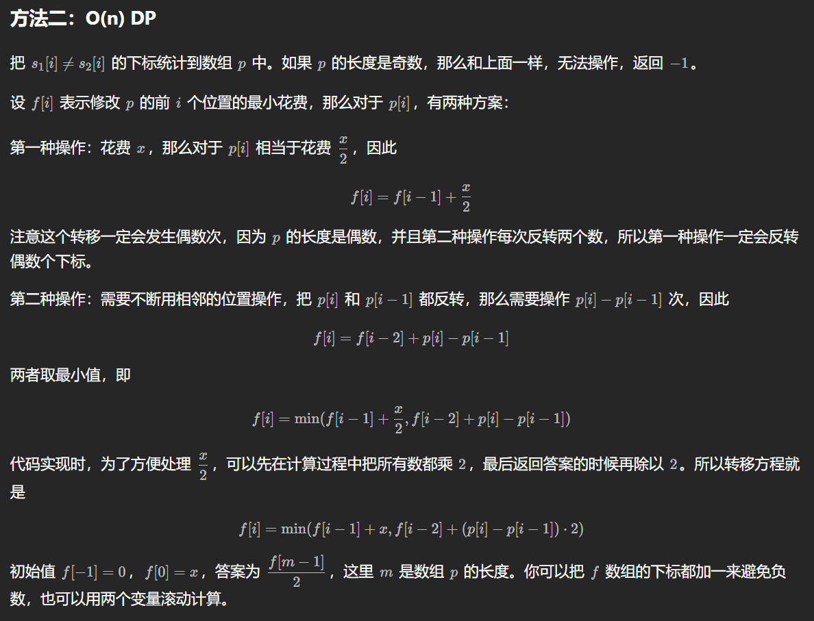
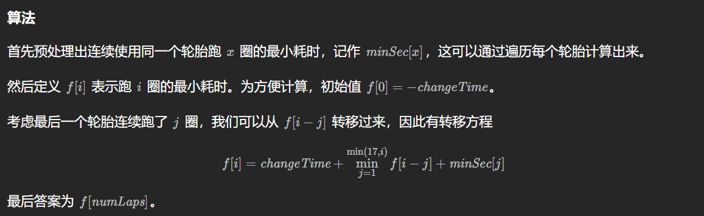

# 七、其他线性 DP

100358\. 找出有效子序列的最大长度 II
------------------------

给你一个整数数组 `nums` 和一个 **正** 整数 `k` 。

`nums` 的一个 子序列

`sub` 的长度为 `x` ，如果其满足以下条件，则称其为 **有效子序列** ：

*   `(sub[0] + sub[1]) % k == (sub[1] + sub[2]) % k == ... == (sub[x - 2] + sub[x - 1]) % k`

返回 `nums` 的 **最长****有效子序列** 的长度。

**示例 1：**

**输入：**nums = \[1,2,3,4,5\], k = 2

**输出：**5

**解释：**

最长有效子序列是 `[1, 2, 3, 4, 5]` 。

**示例 2：**

**输入：**nums = \[1,4,2,3,1,4\], k = 3

**输出：**4

**解释：**

最长有效子序列是 `[1, 4, 1, 4]` 。

**提示：**

*   `2 <= nums.length <= 103`
*   `1 <= nums[i] <= 107`
*   `1 <= k <= 103`

[https://leetcode.cn/problems/find-the-maximum-length-of-valid-subsequence-ii/description/](https://leetcode.cn/problems/find-the-maximum-length-of-valid-subsequence-ii/description/)

```java
import java.util.Arrays;
import java.util.HashMap;

class Solution { // 记忆化直接超时，用数组Memo直接爆内存，需要滚动数组压缩维度
    int n,k;
    HashMap<Long,Integer> memo;
    public int maximumLength(int[] nums, int k) {
        n = nums.length;
        this.k = k;
        memo = new HashMap<>();
        for (int i = 0; i < n; i++) {
            nums[i] %= k;
        }
        // System.out.println(Arrays.toString(nums));
        return dfs(0, k, k, nums);
    }

    private int dfs(int i,int pre,int ppre, int[] nums) {
        if (i == n) {
            return 0;
        }
        long key = getKey(i, pre, ppre);
        if (memo.containsKey(key)) {
            return memo.get(key);
        }
        int res = dfs(i + 1, pre, ppre, nums);
        if (nums[i] == ppre || ppre == k) {
            res = Math.max(res, dfs(i + 1, nums[i], pre, nums) + 1);
        }
        memo.put(key, res);
        return res;
    }

    private Long getKey(int x,int pre, int ppre) {
        return (((long) x << 32) + ((long) pre << 15) + ppre);
    }
}
```

```java
class Solution {
    public int maximumLength(int[] nums, int k) {
        int ans = 0;
        int[][] dp = new int[k][k]; // dp[i][j]表示前一个数是i，前前个数是j的最大长度
        for (int x : nums) {
            x %= k;
            for (int y = 0; y < k; y++) { // 枚举前前个数
                dp[x][y] = dp[y][x] + 1;
                ans = Math.max(ans, dp[x][y]);
            }
        }
        return ans;
    }
}
```

# §7.1 一维(从后往前的dp)

> ## **发生在前缀/后缀之间的转移，例如从 f[i-1]转移到 f[i]，或者从 f[j] 转移到 f[i]。**

2140\. 解决智力问题
-------------

给你一个下标从 **0** 开始的二维整数数组 `questions` ，其中 `questions[i] = [pointsi, brainpoweri]` 。

这个数组表示一场考试里的一系列题目，你需要 **按顺序** （也就是从问题 `0` 开始依次解决），针对每个问题选择 **解决** 或者 **跳过** 操作。解决问题 `i` 将让你 **获得**  `pointsi` 的分数，但是你将 **无法** 解决接下来的 `brainpoweri` 个问题（即只能跳过接下来的 `brainpoweri` 个问题）。如果你跳过问题 `i` ，你可以对下一个问题决定使用哪种操作。

*   比方说，给你 `questions = [[3, 2], [4, 3], [4, 4], [2, 5]]` ：
    *   如果问题 `0` 被解决了， 那么你可以获得 `3` 分，但你不能解决问题 `1` 和 `2` 。
    *   如果你跳过问题 `0` ，且解决问题 `1` ，你将获得 `4` 分但是不能解决问题 `2` 和 `3` 。

请你返回这场考试里你能获得的 **最高** 分数。

**示例 1：**

**输入：**questions = \[\[3,2\],\[4,3\],\[4,4\],\[2,5\]\]
**输出：**5
**解释：**解决问题 0 和 3 得到最高分。
- 解决问题 0 ：获得 3 分，但接下来 2 个问题都不能解决。
- 不能解决问题 1 和 2
- 解决问题 3 ：获得 2 分
  总得分为：3 + 2 = 5 。没有别的办法获得 5 分或者多于 5 分。

**示例 2：**

**输入：**questions = \[\[1,1\],\[2,2\],\[3,3\],\[4,4\],\[5,5\]\]
**输出：**7
**解释：**解决问题 1 和 4 得到最高分。
- 跳过问题 0
- 解决问题 1 ：获得 2 分，但接下来 2 个问题都不能解决。
- 不能解决问题 2 和 3
- 解决问题 4 ：获得 5 分
  总得分为：2 + 5 = 7 。没有别的办法获得 7 分或者多于 7 分。

**提示：**

*   `1 <= questions.length <= 105`
*   `questions[i].length == 2`
*   `1 <= pointsi, brainpoweri <= 105`

[https://leetcode.cn/problems/solving-questions-with-brainpower/description/](https://leetcode.cn/problems/solving-questions-with-brainpower/description/)

```java
class Solution { // 正序遍历
    public long mostPoints(int[][] questions) { // 刷表法
        int n = questions.length;
        long[] dp = new long[n + 1];
        for (int i = 1; i <= n; i++) {
           dp[i] = Math.max(dp[i], dp[i - 1]); // 不选当前的nums[i - 1]
           int[] q = questions[i - 1];
           int j = Math.min(i + q[1], n);
           dp[j] = Math.max(dp[j], dp[i - 1] + q[0]); // 选择当前的nums[i - 1],影响后面的dp[j];
        }
        return dp[n];
    }
}
// f[j] = f[i] + point[i]
```

```java
class Solution { // 推荐，实现简单，不过两种算法务必学会
    public long mostPoints(int[][] questions) { // 刷表法
        int n = questions.length;
        long[] dp = new long[n + 1];
        for(int i = n - 1; i >= 0; i--){
            int[] q = questions[i];
            int j = i + q[1] + 1;
            dp[i] = Math.max(dp[i + 1], q[0] + (j < n ? dp[j] : 0));
        }
        return dp[0];
    }
}
```

983\. 最低票价
----------

在一个火车旅行很受欢迎的国度，你提前一年计划了一些火车旅行。在接下来的一年里，你要旅行的日子将以一个名为 `days` 的数组给出。每一项是一个从 `1` 到 `365` 的整数。

火车票有 **三种不同的销售方式** ：

*   一张 **为期一天** 的通行证售价为 `costs[0]` 美元；
*   一张 **为期七天** 的通行证售价为 `costs[1]` 美元；
*   一张 **为期三十天** 的通行证售价为 `costs[2]` 美元。

通行证允许数天无限制的旅行。 例如，如果我们在第 `2` 天获得一张 **为期 7 天** 的通行证，那么我们可以连着旅行 7 天：第 `2` 天、第 `3` 天、第 `4` 天、第 `5` 天、第 `6` 天、第 `7` 天和第 `8` 天。

返回 _你想要完成在给定的列表 `days` 中列出的每一天的旅行所需要的最低消费_ 。

**示例 1：**

**输入：**days = \[1,4,6,7,8,20\], costs = \[2,7,15\]
**输出：**11
**解释：** 
例如，这里有一种购买通行证的方法，可以让你完成你的旅行计划：
在第 1 天，你花了 costs\[0\] = $2 买了一张为期 1 天的通行证，它将在第 1 天生效。
在第 3 天，你花了 costs\[1\] = $7 买了一张为期 7 天的通行证，它将在第 3, 4, ..., 9 天生效。
在第 20 天，你花了 costs\[0\] = $2 买了一张为期 1 天的通行证，它将在第 20 天生效。
你总共花了 $11，并完成了你计划的每一天旅行。

**示例 2：**

**输入：**days = \[1,2,3,4,5,6,7,8,9,10,30,31\], costs = \[2,7,15\]
**输出：**17
**解释：**
例如，这里有一种购买通行证的方法，可以让你完成你的旅行计划： 
在第 1 天，你花了 costs\[2\] = $15 买了一张为期 30 天的通行证，它将在第 1, 2, ..., 30 天生效。
在第 31 天，你花了 costs\[0\] = $2 买了一张为期 1 天的通行证，它将在第 31 天生效。 
你总共花了 $17，并完成了你计划的每一天旅行。

**提示：**

*   `1 <= days.length <= 365`
*   `1 <= days[i] <= 365`
*   `days` 按顺序严格递增
*   `costs.length == 3`
*   `1 <= costs[i] <= 1000`

[https://leetcode.cn/problems/minimum-cost-for-tickets/description/](https://leetcode.cn/problems/minimum-cost-for-tickets/description/)

```java
class Solution { // 后面影响前面
    public int mincostTickets(int[] days, int[] costs) {
        int n = days.length;
        int mxDay = days[n - 1], mnDay = days[0];
        int[] dp = new int[mxDay + 31];
        for(int d = mxDay, i = n - 1; d >= mnDay && i >= 0; d--){
            if(d == days[i]){
                // 说明今天必须出行
                // 也可提前将所有 days 放入 Set，再通过 set.contains() 判断
                dp[d] = Math.min(dp[d + 1] + costs[0], Math.min(dp[d + 7] + costs[1], dp[d + 30] + costs[2]));
                i--;
            }else{ // 今天不用出行
                dp[d] = dp[d + 1]; 
            }
        }
        return dp[mnDay];
    }
}

```

2901\. 最长相邻不相等子序列 II (好难好难)
--------------------

给你一个整数 `n` 和一个下标从 **0** 开始的字符串数组 `words` ，和一个下标从 **0** 开始的数组 `groups` ，两个数组长度都是 `n` 。

两个长度相等字符串的 **汉明距离** 定义为对应位置字符 **不同** 的数目。

你需要从下标 `[0, 1, ..., n - 1]` 中选出一个 **最长**

**子序列**

 ，将这个子序列记作长度为 `k` 的 `[i0, i1, ..., ik - 1]` ，它需要满足以下条件：

*   **相邻** 下标对应的 `groups` 值 **不同**。即，对于所有满足 `0 < j + 1 < k` 的 `j` 都有 `groups[ij] != groups[ij + 1]` 。
*   对于所有 `0 < j + 1 < k` 的下标 `j` ，都满足 `words[ij]` 和 `words[ij + 1]` 的长度 **相等** ，且两个字符串之间的 **汉明距离** 为 `1` 。

请你返回一个字符串数组，它是下标子序列 **依次** 对应 `words` 数组中的字符串连接形成的字符串数组。如果有多个答案，返回任意一个。

**子序列** 指的是从原数组中删掉一些（也可能一个也不删掉）元素，剩余元素不改变相对位置得到的新的数组。

**注意：**`words` 中的字符串长度可能 **不相等** 。

**示例 1：**

**输入：**n = 3, words = \["bab","dab","cab"\], groups = \[1,2,2\]
**输出：**\["bab","cab"\]
**解释：**一个可行的子序列是 \[0,2\] 。
- groups\[0\] != groups\[2\]
- words\[0\].length == words\[2\].length 且它们之间的汉明距离为 1 。
  所以一个可行的答案是 \[words\[0\],words\[2\]\] = \["bab","cab"\] 。
  另一个可行的子序列是 \[0,1\] 。
- groups\[0\] != groups\[1\]
- words\[0\].length = words\[1\].length 且它们之间的汉明距离为 1 。
  所以另一个可行的答案是 \[words\[0\],words\[1\]\] = \["bab","dab"\] 。
  符合题意的最长子序列的长度为 2 。

**示例 2：**

**输入：**n = 4, words = \["a","b","c","d"\], groups = \[1,2,3,4\]
**输出：**\["a","b","c","d"\]
**解释：**我们选择子序列 \[0,1,2,3\] 。
它同时满足两个条件。
所以答案为 \[words\[0\],words\[1\],words\[2\],words\[3\]\] = \["a","b","c","d"\] 。
它是所有下标子序列里最长且满足所有条件的。
所以它是唯一的答案。

**提示：**

*   `1 <= n == words.length == groups.length <= 1000`
*   `1 <= words[i].length <= 10`
*   `1 <= groups[i] <= n`
*   `words` 中的字符串 **互不相同** 。
*   `words[i]` 只包含小写英文字母。

[https://leetcode.cn/problems/longest-unequal-adjacent-groups-subsequence-ii/description/](https://leetcode.cn/problems/longest-unequal-adjacent-groups-subsequence-ii/description/)

```java
import java.util.ArrayList;
import java.util.List;
 
class Solution { // 太牛了，又学到新东西了
    public List<String> getWordsInLongestSubsequence(String[] words, int[] groups) {
        int n = words.length;
        int[] dp = new int[n];
        int[] from = new int[n];
        int mx = n - 1;
        for (int i = n - 1; i >= 0; i--) {
            for (int j = i + 1; j < n; j++) {
                if (dp[j] > dp[i] && groups[j] != groups[i] && judge(words[i], words[j])) {
                    dp[i] = dp[j];
                    from[i] = j;
                }
            }
            dp[i]++;
            if (dp[i] > dp[mx]) {
                mx = i;
            }
        }
        int m = dp[mx];
        ArrayList<String> ans = new ArrayList<>();
        for (int i = 0; i < m; i++) {
            ans.add(words[mx]);
            mx = from[mx];
        }
        return ans;
    }

    private boolean judge(String s1,String s2){
        if(s1.length() != s2.length()){
            return false;
        }
        int cnt = 0;
        for(int i = 0; i < s1.length(); i++){
            if (s1.charAt(i) == s2.charAt(i)) {
                continue;
            }
            cnt++;
            if (cnt > 1) {
                return false;
            }
        }
        return true;
    }
}
```

3144\. 分割字符频率相等的最少子字符串
----------------------

给你一个字符串 `s` ，你需要将它分割成一个或者更多的 **平衡** 子字符串。比方说，`s == "ababcc"` 那么 `("abab", "c", "c")` ，`("ab", "abc", "c")` 和 `("ababcc")` 都是合法分割，但是 `("a", **"bab"**, "cc")` ，`(**"aba"**, "bc", "c")` 和 `("ab", **"abcc"**)` 不是，不平衡的子字符串用粗体表示。

请你返回 `s` **最少** 能分割成多少个平衡子字符串。

**注意：**一个 **平衡** 字符串指的是字符串中所有字符出现的次数都相同。

**示例 1：**

**输入：**s = "fabccddg"

**输出：**3

**解释：**

我们可以将 `s` 分割成 3 个子字符串：`("fab, "ccdd", "g")` 或者 `("fabc", "cd", "dg")` 。

**示例 2：**

**输入：**s = "abababaccddb"

**输出：**2

**解释：**

我们可以将 `s` 分割成 2 个子字符串：`("abab", "abaccddb")` 。

**提示：**

*   `1 <= s.length <= 1000`
*   `s` 只包含小写英文字母。

[https://leetcode.cn/problems/minimum-substring-partition-of-equal-character-frequency/description/](https://leetcode.cn/problems/minimum-substring-partition-of-equal-character-frequency/description/)

```java
import java.util.Arrays;

class Solution {
    public int minimumSubstringsInPartition(String s) {
        int n = s.length();
        int[] dp = new int[n + 1];
        Arrays.setAll(dp, i -> i);
        for (int i = 1; i <= n; i++) {
            int freq = 0;
            int mx = 0;
            int[] cnt = new int[26];
            for (int j = i - 1; j >= 0; j--) {
                int k = s.charAt(j) - 'a';
                cnt[k]++;
                if (cnt[k] == 1) {
                    freq++;
                }
                mx = Math.max(mx, cnt[k]);
                if (mx * freq == i - j) {
                    dp[i] = Math.min(dp[i], dp[j] + 1);
                }
            }
        }
        return dp[n];
    }
}
```

871\. 最低加油次数
------------

汽车从起点出发驶向目的地，该目的地位于出发位置东面 `target` 英里处。

沿途有加油站，用数组 `stations` 表示。其中 `stations[i] = [positioni, fueli]` 表示第 `i` 个加油站位于出发位置东面 `positioni` 英里处，并且有 `fueli` 升汽油。

假设汽车油箱的容量是无限的，其中最初有 `startFuel` 升燃料。它每行驶 1 英里就会用掉 1 升汽油。当汽车到达加油站时，它可能停下来加油，将所有汽油从加油站转移到汽车中。

为了到达目的地，汽车所必要的最低加油次数是多少？如果无法到达目的地，则返回 `-1` 。

注意：如果汽车到达加油站时剩余燃料为 `0`，它仍然可以在那里加油。如果汽车到达目的地时剩余燃料为 `0`，仍然认为它已经到达目的地。

**示例 1：**

**输入：**target = 1, startFuel = 1, stations = \[\]
**输出：**0
**解释：**可以在不加油的情况下到达目的地。

**示例 2：**

**输入：**target = 100, startFuel = 1, stations = \[\[10,100\]\]
**输出：**\-1
**解释：**无法抵达目的地，甚至无法到达第一个加油站。

**示例 3：**

**输入：**target = 100, startFuel = 10, stations = \[\[10,60\],\[20,30\],\[30,30\],\[60,40\]\]
**输出：**2
**解释：**
出发时有 10 升燃料。
开车来到距起点 10 英里处的加油站，消耗 10 升燃料。将汽油从 0 升加到 60 升。
然后，从 10 英里处的加油站开到 60 英里处的加油站（消耗 50 升燃料），
并将汽油从 10 升加到 50 升。然后开车抵达目的地。
沿途在两个加油站停靠，所以返回 2 。

**提示：**

*   `1 <= target, startFuel <= 109`
*   `0 <= stations.length <= 500`
*   `1 <= positioni < positioni+1 < target`
*   `1 <= fueli < 109`

[https://leetcode.cn/problems/minimum-number-of-refueling-stops/solutions/1636921/zui-di-jia-you-ci-shu-by-leetcode-soluti-nmga/](https://leetcode.cn/problems/minimum-number-of-refueling-stops/solutions/1636921/zui-di-jia-you-ci-shu-by-leetcode-soluti-nmga/)

```java
class Solution {
    public int minRefuelStops(int target, int startFuel, int[][] stations) {
        int n = stations.length;
        int[] dp = new int[n + 1]; // dp[i] 表示加油 i 次的最大行驶英里数
        dp[0] = startFuel;
        for (int i = 0; i < n; i++) {
            for (int j = i; j >= 0; j--) {
                if (dp[j] >= stations[i][0]) {
                    dp[j + 1] = Math.max(dp[j + 1], dp[j] + stations[i][1]);
                }
            }
        }
        for (int i = 0; i <= n; i++) {
            if (dp[i] >= target) {
                return i;
            }
        }
        return -1;
    }
}
```

```java
class Solution { // 贪心 + 优先队列
    public int minRefuelStops(int target, int startFuel, int[][] stations) {
        PriorityQueue<Integer> pq = new PriorityQueue<Integer>((a, b) -> b - a);
        int ans = 0, prev = 0, fuel = startFuel;
        int n = stations.length;
        for (int i = 0; i <= n; i++) {
            int curr = i < n ? stations[i][0] : target;
            fuel -= curr - prev;
            while (fuel < 0 && !pq.isEmpty()) {
                fuel += pq.poll();
                ans++;
            }
            if (fuel < 0) {
                return -1;
            }
            if (i < n) {
                pq.offer(stations[i][1]);
                prev = curr;
            }
        }
        return ans;
    }
}
```

2896\. 执行操作使两个字符串相等
-------------------

给你两个下标从 **0** 开始的二进制字符串 `s1` 和 `s2` ，两个字符串的长度都是 `n` ，再给你一个正整数 `x` 。

你可以对字符串 `s1` 执行以下操作 **任意次** ：

*   选择两个下标 `i` 和 `j` ，将 `s1[i]` 和 `s1[j]` 都反转，操作的代价为 `x` 。
*   选择满足 `i < n - 1` 的下标 `i` ，反转 `s1[i]` 和 `s1[i + 1]` ，操作的代价为 `1` 。

请你返回使字符串 `s1` 和 `s2` 相等的 **最小** 操作代价之和，如果无法让二者相等，返回 `-1` 。

**注意** ，反转字符的意思是将 `0` 变成 `1` ，或者 `1` 变成 `0` 。

**示例 1：**

**输入：**s1 = "1100011000", s2 = "0101001010", x = 2
**输出：**4
**解释：**我们可以执行以下操作：
- 选择 i = 3 执行第二个操作。结果字符串是 s1 = "110_**11**_11000" 。
- 选择 i = 4 执行第二个操作。结果字符串是 s1 = "1101_**00**_1000" 。
- 选择 i = 0 和 j = 8 ，执行第一个操作。结果字符串是 s1 = "_**0**_1010010_**1**_0" = s2 。
  总代价是 1 + 1 + 2 = 4 。这是最小代价和。

**示例 2：**

**输入：**s1 = "10110", s2 = "00011", x = 4
**输出：**\-1
**解释：**无法使两个字符串相等。

**提示：**

*   `n == s1.length == s2.length`
*   `1 <= n, x <= 500`
*   `s1` 和 `s2` 只包含字符 `'0'` 和 `'1'` 。

[https://leetcode.cn/problems/apply-operations-to-make-two-strings-equal/description/](https://leetcode.cn/problems/apply-operations-to-make-two-strings-equal/description/)

```java
import java.util.Arrays;

class Solution { // 记忆化搜索 O(n ^ 2)
    public int minOperations(String s1, String s2, int x) {
        char[] s = s1.toCharArray(), t = s2.toCharArray();
        int n = s.length;
        int diff = 0;
        // 如果s与t之间1的个数不同，直接返回-1
        for (int i = 0; i < n; i++) {
            diff ^= s[i] ^ t[i];
        }
        if (diff != 0) {
            return -1;
        }
        int[][][] memo = new int[n][n + 1][2]; // 下标 i，还需要知道免费反转次数 j，以及上一个字符是否选择了第二种操作 preRev。
        for (int i = 0; i < n; i++) {
            for (int j = 0; j <= n; j++) {
                Arrays.fill(memo[i][j], -1);
            }
        }
        return dfs(n - 1, 0, 0, memo, s, t, x);
    }

    private int dfs(int i, int j, int preRev, int[][][] memo, char[] s, char[] t, int x) {
        if (i < 0) {
            return j > 0 || preRev > 0 ? Integer.MAX_VALUE / 2 : 0;
        }
        if (memo[i][j][preRev] != -1) {
            return memo[i][j][preRev];
        }
        if ((s[i] == t[i]) == (preRev == 0)) { // 无需反转
            return dfs(i - 1, j, 0, memo, s, t, x);
        }
        int res = Math.min(dfs(i - 1, j + 1, 0, memo, s, t, x) + x, dfs(i - 1, j, 1, memo, s, t, x) + 1);
        if (j > 0) {
            // 可以免费反转
            res = Math.min(res, dfs(i - 1, j - 1, 0, memo, s, t, x));
        }
        return memo[i][j][preRev] = res;
    }
}
```



```java
import java.util.ArrayList;
import java.util.Arrays;

class Solution {
    public int minOperations(String s1, String s2, int x) {
        char[] s = s1.toCharArray();
        char[] t = s2.toCharArray();
        int n = s.length;
        ArrayList<Integer> ps = new ArrayList<>();
        for (int i = 0; i < n; i++) {
            if ((s[i] ^ t[i]) == 1) {
                ps.add(i);
            }
        }
        int len = ps.size();
        if (len % 2 == 1) {
            return -1;
        }
        if(len == 0){
            return 0;
        }
//        int[] dp = new int[len + 1]; // dp[i] = max(dp[i - 1] + x, dp[i - 2] + (p[i] - p[i - 1]) * 2)
//        dp[1] = x;
//        for (int i = 1; i < len; i++) {
//            dp[i + 1] = Math.min(dp[i] + x, dp[i - 1] + (ps.get(i) - ps.get(i - 1)) * 2);
//        }
//        return dp[len] / 2;
        int f0 = 0, f1 = x;
        for (int i = 1; i < len; i++) {
            int newF = Math.min(f1 + x, f0 + (ps.get(i) - ps.get(i - 1)) * 2);
            f0 = f1;
            f1 = newF;
        }
        return f1 / 2;
    }
}
```

2167. 移除所有载有违禁货物车厢所需的最少时间（套路：这种左右删除的题目，直接枚举分割线 ）
--------------------------

给你一个下标从 **0** 开始的二进制字符串 `s` ，表示一个列车车厢序列。`s[i] = '0'` 表示第 `i` 节车厢 **不** 含违禁货物，而 `s[i] = '1'` 表示第 `i` 节车厢含违禁货物。

作为列车长，你需要清理掉所有载有违禁货物的车厢。你可以不限次数执行下述三种操作中的任意一个：

1.  从列车 **左** 端移除一节车厢（即移除 `s[0]`），用去 1 单位时间。
2.  从列车 **右** 端移除一节车厢（即移除 `s[s.length - 1]`），用去 1 单位时间。
3.  从列车车厢序列的 **任意位置** 移除一节车厢，用去 2 单位时间。

返回移除所有载有违禁货物车厢所需要的 **最少** 单位时间数。

注意，空的列车车厢序列视为没有车厢含违禁货物。

**示例 1：**

**输入：**s = "_**11**_00_**1**_0_**1**_"
**输出：**5
**解释：**
一种从序列中移除所有载有违禁货物的车厢的方法是：
- 从左端移除一节车厢 2 次。所用时间是 2 \* 1 = 2 。
- 从右端移除一节车厢 1 次。所用时间是 1 。
- 移除序列中间位置载有违禁货物的车厢。所用时间是 2 。
  总时间是 2 + 1 + 2 = 5 。

一种替代方法是：
- 从左端移除一节车厢 2 次。所用时间是 2 \* 1 = 2 。
- 从右端移除一节车厢 3 次。所用时间是 3 \* 1 = 3 。
  总时间也是 2 + 3 = 5 。

5 是移除所有载有违禁货物的车厢所需要的最少单位时间数。
没有其他方法能够用更少的时间移除这些车厢。

**示例 2：**

**输入：**s = "00_**1**_0"
**输出：**2
**解释：**
一种从序列中移除所有载有违禁货物的车厢的方法是：
- 从左端移除一节车厢 3 次。所用时间是 3 \* 1 = 3 。
  总时间是 3.

另一种从序列中移除所有载有违禁货物的车厢的方法是：
- 移除序列中间位置载有违禁货物的车厢。所用时间是 2 。
  总时间是 2.

另一种从序列中移除所有载有违禁货物的车厢的方法是：
- 从右端移除一节车厢 2 次。所用时间是 2 \* 1 = 2 。
  总时间是 2.

2 是移除所有载有违禁货物的车厢所需要的最少单位时间数。
没有其他方法能够用更少的时间移除这些车厢。

**提示：**

*   `1 <= s.length <= 2 * 105`
*   `s[i]` 为 `'0'` 或 `'1'`

[https://leetcode.cn/problems/minimum-time-to-remove-all-cars-containing-illegal-goods/description/](https://leetcode.cn/problems/minimum-time-to-remove-all-cars-containing-illegal-goods/description/)

```java
class Solution {
    public int minimumTime(String s) { // s.length = 1e5，记忆化的空间会超，考虑动规。 套路：这种左右删除的题目，直接枚举分割线
        int n = s.length();
        int[] suf = new int[n + 1];
        for (int i = n - 1; i >= 0; i--) {
            suf[i] = s.charAt(i) == '0' ? suf[i + 1] : Math.min(suf[i + 1] + 2, n - i);
        }
        int ans = suf[0];
        int pre = 0;
        for (int i = 0; i < n; i++) {
            if (s.charAt(i) == '1') {
                pre = Math.min(pre + 2, i + 1);
                ans = Math.min(ans, pre + suf[i + 1]);
            }
        }
        return ans;
    }
}
```

2188\. 完成比赛的最少时间
----------------

给你一个下标从 **0** 开始的二维整数数组 `tires` ，其中 `tires[i] = [fi, ri]` 表示第 `i` 种轮胎如果连续使用，第 `x` 圈需要耗时 `fi * ri(x-1)` 秒。

*   比方说，如果 `fi = 3` 且 `ri = 2` ，且一直使用这种类型的同一条轮胎，那么该轮胎完成第 `1` 圈赛道耗时 `3` 秒，完成第 `2` 圈耗时 `3 * 2 = 6` 秒，完成第 `3` 圈耗时 `3 * 22 = 12` 秒，依次类推。

同时给你一个整数 `changeTime` 和一个整数 `numLaps` 。

比赛总共包含 `numLaps` 圈，你可以选择 **任意** 一种轮胎开始比赛。每一种轮胎都有 **无数条** 。每一圈后，你可以选择耗费 `changeTime` 秒 **换成** 任意一种轮胎（也可以换成当前种类的新轮胎）。

请你返回完成比赛需要耗费的 **最少** 时间。

**示例 1：**

**输入：**tires = \[\[2,3\],\[3,4\]\], changeTime = 5, numLaps = 4
**输出：**21
**解释：**
第 1 圈：使用轮胎 0 ，耗时 2 秒。
第 2 圈：继续使用轮胎 0 ，耗时 2 \* 3 = 6 秒。
第 3 圈：耗费 5 秒换一条新的轮胎 0 ，然后耗时 2 秒完成这一圈。
第 4 圈：继续使用轮胎 0 ，耗时 2 \* 3 = 6 秒。
总耗时 = 2 + 6 + 5 + 2 + 6 = 21 秒。
完成比赛的最少时间为 21 秒。

**示例 2：**

**输入：**tires = \[\[1,10\],\[2,2\],\[3,4\]\], changeTime = 6, numLaps = 5
**输出：**25
**解释：**
第 1 圈：使用轮胎 1 ，耗时 2 秒。
第 2 圈：继续使用轮胎 1 ，耗时 2 \* 2 = 4 秒。
第 3 圈：耗时 6 秒换一条新的轮胎 1 ，然后耗时 2 秒完成这一圈。
第 4 圈：继续使用轮胎 1 ，耗时 2 \* 2 = 4 秒。
第 5 圈：耗时 6 秒换成轮胎 0 ，然后耗时 1 秒完成这一圈。
总耗时 = 2 + 4 + 6 + 2 + 4 + 6 + 1 = 25 秒。
完成比赛的最少时间为 25 秒。

**提示：**

*   `1 <= tires.length <= 105`
*   `tires[i].length == 2`
*   `1 <= fi, changeTime <= 105`
*   `2 <= ri <= 105`
*   `1 <= numLaps <= 1000`

[https://leetcode.cn/problems/minimum-time-to-finish-the-race/description/](https://leetcode.cn/problems/minimum-time-to-finish-the-race/description/)



> 怎么想到的呢？
>
> 一眼dp，然后就是换轮胎，换哪种类型的轮胎。我们可以计算出一个轮胎最多使用17次就可以换了，不然就太费时间了。  然后预处理使用一种轮胎跑[1, 17]圈的最少时间，我们就使用这种类型的轮胎跑，然后就是线性dp。

```java
import java.util.Arrays;

class Solution {
    public int minimumFinishTime(int[][] tires, int changeTime, int numLaps) {
        int[] minSec = new int[18]; // 代表用一个轮胎，跑i圈，所用的最少时间（不换轮胎）
        Arrays.fill(minSec, Integer.MAX_VALUE / 2);
        for (int[] t : tires) {
            long time = t[0];
            for (int x = 1, sum = 0; time <= changeTime + t[0]; x++) { // x是圈数
                sum += time;
                minSec[x] = Math.min(minSec[x], sum);
                time *= t[1];
            }
        }
        int[] dp = new int[numLaps + 1]; // 表示换轮胎的情况下，跑i圈的最小时间
        Arrays.fill(dp, Integer.MAX_VALUE / 2);
        dp[0] = 0;
        for (int i = 1; i <= numLaps; i++) {
            // 先跑i-j圈，剩下的j圈，用一个轮胎跑完，所用的最少时间
            // 一个轮胎，最多跑17圈
            for (int j = 1; j <= Math.min(i, 17); j++) {
                dp[i] = Math.min(dp[i], dp[i - j] + minSec[j]);
            }
            //最后的i-j圈，由一个新的轮胎跑，所以中间有一个换胎过程
            dp[i] += changeTime; // 这里跑一圈也加了换胎过程，所以最后需要减去
        }
        return dp[numLaps] - changeTime; // 减去刚开始的一次换胎过程
    }
}
```

# §7.2 特殊子序列

> 比较特殊的一类题型，递推比记忆化搜索好写。 

2501\. 数组中最长的方波
---------------

给你一个整数数组 `nums` 。如果 `nums` 的子序列满足下述条件，则认为该子序列是一个 **方波** ：

*   子序列的长度至少为 `2` ，并且
*   将子序列从小到大排序 **之后** ，除第一个元素外，每个元素都是前一个元素的 **平方** 。

返回 `nums` 中 **最长方波** 的长度，如果不存在 **方波** 则返回 `-1` 。

**子序列** 也是一个数组，可以由另一个数组删除一些或不删除元素且不改变剩余元素的顺序得到。

**示例 1 ：**

**输入：**nums = \[4,3,6,16,8,2\]
**输出：**3
**解释：**选出子序列 \[4,16,2\] 。排序后，得到 \[2,4,16\] 。
- 4 = 2 \* 2.
- 16 = 4 \* 4.
  因此，\[4,16,2\] 是一个方波.
  可以证明长度为 4 的子序列都不是方波。

**示例 2 ：**

**输入：**nums = \[2,3,5,6,7\]
**输出：**\-1
**解释：**nums 不存在方波，所以返回 -1 。

**提示：**

*   `2 <= nums.length <= 105`
*   `2 <= nums[i] <= 105`

[https://leetcode.cn/problems/longest-square-streak-in-an-array/description/](https://leetcode.cn/problems/longest-square-streak-in-an-array/description/)

```java
import java.util.*;

class Solution {
    public int longestSquareStreak(int[] nums) {
        int n = nums.length;
        Arrays.sort(nums);
        HashMap<Long, Integer> dp = new HashMap<>();
        for (int i = n - 1; i >=0; i--) {
            long p = (long) nums[i] * nums[i];
            if (dp.containsKey(p)) {
                dp.put((long) nums[i], dp.get(p) + 1);
            }else{
                dp.put((long) nums[i], 1);
            }
        }
        int ans = 0;
        for (int x : dp.values()) {
            ans = Math.max(ans, x);
        }
        return ans < 2 ? -1 : ans;
    }

}
```

```java
import java.util.*;

class Solution { // 优化成 o(n)
        public int longestSquareStreak(int[] nums) {
        Set<Long> set = new HashSet<>();
        for (int x : nums) set.add((long) x);
        int ans = 0;
        for (long x : nums) {
            int cnt = 1;
            while (set.contains(x *= x)) cnt++;
            ans = Math.max(ans, cnt);
        }
        return ans > 1 ? ans : -1;
    }
}
```

1218\. 最长定差子序列
--------------

给你一个整数数组 `arr` 和一个整数 `difference`，请你找出并返回 `arr` 中最长等差子序列的长度，该子序列中相邻元素之间的差等于 `difference` 。

**子序列** 是指在不改变其余元素顺序的情况下，通过删除一些元素或不删除任何元素而从 `arr` 派生出来的序列。

**示例 1：**

**输入：**arr = \[1,2,3,4\], difference = 1
**输出：**4
**解释：**最长的等差子序列是 \[1,2,3,4\]。

**示例 2：**

**输入：**arr = \[1,3,5,7\], difference = 1
**输出：**1
**解释：**最长的等差子序列是任意单个元素。

**示例 3：**

**输入：**arr = \[1,5,7,8,5,3,4,2,1\], difference = -2
**输出：**4
**解释：**最长的等差子序列是 \[7,5,3,1\]。

**提示：**

*   `1 <= arr.length <= 105`
*   `-104 <= arr[i], difference <= 104`

[https://leetcode.cn/problems/longest-arithmetic-subsequence-of-given-difference/description/](https://leetcode.cn/problems/longest-arithmetic-subsequence-of-given-difference/description/)

```java
import java.util.HashMap;

class Solution {
    public int longestSubsequence(int[] arr, int difference) {
        int ans = 0;
        HashMap<Integer, Integer> dp = new HashMap<>();
        for (int v : arr) {
            dp.put(v, dp.getOrDefault(v - difference, 0) + 1);
            ans = Math.max(ans, dp.get(v));
        }
        return ans;
    }
}
```

1027\. 最长等差数列
-------------

给你一个整数数组 `nums`，返回 `nums` 中最长等差子序列的**长度**。

回想一下，`nums` 的子序列是一个列表 `nums[i1], nums[i2], ..., nums[ik]` ，且 `0 <= i1 < i2 < ... < ik <= nums.length - 1`。并且如果 `seq[i+1] - seq[i]`( `0 <= i < seq.length - 1`) 的值都相同，那么序列 `seq` 是等差的。

**示例 1：**

**输入：**nums = \[3,6,9,12\]
**输出：**4
**解释：** 
整个数组是公差为 3 的等差数列。

**示例 2：**

**输入：**nums = \[9,4,7,2,10\]
**输出：**3
**解释：**
最长的等差子序列是 \[4,7,10\]。

**示例 3：**

**输入：**nums = \[20,1,15,3,10,5,8\]
**输出：**4
**解释：**
最长的等差子序列是 \[20,15,10,5\]。

**提示：**

*   `2 <= nums.length <= 1000`
*   `0 <= nums[i] <= 500`

[https://leetcode.cn/problems/longest-arithmetic-subsequence/description/](https://leetcode.cn/problems/longest-arithmetic-subsequence/description/)

```java
import java.util.Arrays;
import java.util.HashMap;

class Solution { // 暴力枚举 727ms
    public int longestArithSeqLength(int[] nums) {
        int mx = Arrays.stream(nums).max().getAsInt();
        int ans = 0;
        for (int i = -mx; i <= mx; i++) {
            ans = Math.max(ans, cal(nums, i));
        }
        return ans;
    }

    private int cal(int[] nums, int k) {
        int ans = 0;
        HashMap<Integer, Integer> dp = new HashMap<>();
        for (int x : nums) {
            dp.put(x, dp.getOrDefault(x - k, 0) + 1);
            ans = Math.max(ans, dp.get(x));
        }
        return ans;
    }

}
```

```java
import java.util.Arrays;
import java.util.HashMap;

class Solution { // 手算mx，608ms，居然快了100ms
    public int longestArithSeqLength(int[] nums) {
        int mx = 0;
        for (int x : nums) {
            mx = Math.max(mx, x);
        }
        int ans = 0;
        for (int i = -mx; i <= mx; i++) {
            ans = Math.max(ans, cal(nums, i));
        }
        return ans;
    }

    private int cal(int[] nums, int k) {
        int ans = 0;
        HashMap<Integer, Integer> dp = new HashMap<>();
        for (int x : nums) {
            dp.put(x, dp.getOrDefault(x - k, 0) + 1);
            ans = Math.max(ans, dp.get(x));
        }
        return ans;
    }

}
```

```java
class Solution {
    public int longestArithSeqLength(int[] nums) { // 数组代替hash表 29ms
        int ans = 0;
        int m = 0;
        for (int x : nums) {
            m = Math.max(m, x);
        }
        for (int d = -m; d <= m; d++) {
            int[] dp = new int[m + 1];
            for (int x : nums) {
                dp[x] = 0 <= x - d && x - d <= m ? dp[x - d] + 1 : 1; // 确定x - d的范围
                ans = Math.max(ans, dp[x]);
            }
        }
        return ans;
    }
}

```

3202\. 找出有效子序列的最大长度 II
----------------------

给你一个整数数组 `nums` 和一个 **正** 整数 `k` 。

`nums` 的一个 

子序列

`sub` 的长度为 `x` ，如果其满足以下条件，则称其为 **有效子序列** ：

*   `(sub[0] + sub[1]) % k == (sub[1] + sub[2]) % k == ... == (sub[x - 2] + sub[x - 1]) % k`

返回 `nums` 的 **最长****有效子序列** 的长度。

**示例 1：**

**输入：**nums = \[1,2,3,4,5\], k = 2

**输出：**5

**解释：**

最长有效子序列是 `[1, 2, 3, 4, 5]` 。

**示例 2：**

**输入：**nums = \[1,4,2,3,1,4\], k = 3

**输出：**4

**解释：**

最长有效子序列是 `[1, 4, 1, 4]` 。

**提示：**

*   `2 <= nums.length <= 103`
*   `1 <= nums[i] <= 107`
*   `1 <= k <= 103`

[https://leetcode.cn/problems/find-the-maximum-length-of-valid-subsequence-ii/description/](https://leetcode.cn/problems/find-the-maximum-length-of-valid-subsequence-ii/description/)

```java
class Solution {
    public int maximumLength(int[] nums, int k) { // 太牛了
        int[][] dp = new int[k][k]; // 表示前一个数是i,前前个数是j的最大长度
        int ans = 0;
        for (int x : nums) {
            x %= k;
            for (int y = 0; y < k; y++) { // 枚举前前个数
                dp[x][y] = dp[y][x] + 1;
                ans = Math.max(ans, dp[x][y]);
            }
        }
        return ans;
    }
}
```

873\. 最长的斐波那契子序列的长度
-------------------

如果序列 `X_1, X_2, ..., X_n` 满足下列条件，就说它是 _斐波那契式_ 的：

*   `n >= 3`
*   对于所有 `i + 2 <= n`，都有 `X_i + X_{i+1} = X_{i+2}`

给定一个**严格递增**的正整数数组形成序列 arr ，找到 arr 中最长的斐波那契式的子序列的长度。如果一个不存在，返回  0 。

_（回想一下，子序列是从原序列 arr 中派生出来的，它从 arr 中删掉任意数量的元素（也可以不删），而不改变其余元素的顺序。例如， `[3, 5, 8]` 是 `[3, 4, 5, 6, 7, 8]` 的一个子序列）_

**示例 1：**

**输入:** arr = \[1,2,3,4,5,6,7,8\]
**输出:** 5
**解释:** 最长的斐波那契式子序列为 \[1,2,3,5,8\] 。

**示例 2：**

**输入:** arr = \[1,3,7,11,12,14,18\]
**输出:** 3
**解释**: 最长的斐波那契式子序列有 \[1,11,12\]、\[3,11,14\] 以及 \[7,11,18\] 。

**提示：**

*   `3 <= arr.length <= 1000`
*   `1 <= arr[i] < arr[i + 1] <= 10^9`


[https://leetcode.cn/problems/length-of-longest-fibonacci-subsequence/description/](https://leetcode.cn/problems/length-of-longest-fibonacci-subsequence/description/)

```java
import java.util.Arrays;
import java.util.HashSet;

class Solution { // 暴力枚举起点
    public int lenLongestFibSubseq(int[] arr) {
        HashSet<Integer> set = new HashSet<>();
        for (int x : arr) {
            set.add(x);
        }
        int ans = 0;
        int n = arr.length;
        for (int i = 0; i < n; i++) {
            for (int j = i + 1; j < n; j++) {
                ans = Math.max(ans, f(set, arr[j], arr[i]));
            }
        }
        return ans > 2 ? ans : 0;
    }

    private int f(HashSet<Integer> set, int x, int y) {
        int ans = 2;
        while (set.contains(x + y)) {
            ans++;
            int t = x + y;
            y = x;
            x = t;
        }
        return ans;
    }
}
```

446\. 等差数列划分 II - 子序列
---------------------

给你一个整数数组 `nums` ，返回 `nums` 中所有 **等差子序列** 的数目。

如果一个序列中 **至少有三个元素** ，并且任意两个相邻元素之差相同，则称该序列为等差序列。

*   例如，`[1, 3, 5, 7, 9]`、`[7, 7, 7, 7]` 和 `[3, -1, -5, -9]` 都是等差序列。
*   再例如，`[1, 1, 2, 5, 7]` 不是等差序列。

数组中的子序列是从数组中删除一些元素（也可能不删除）得到的一个序列。

*   例如，`[2,5,10]` 是 `[1,2,1,_**2**_,4,1,**_5_**,_**10**_]` 的一个子序列。

题目数据保证答案是一个 **32-bit** 整数。

**示例 1：**

**输入：**nums = \[2,4,6,8,10\]
**输出：**7
**解释：**所有的等差子序列为：
\[2,4,6\]
\[4,6,8\]
\[6,8,10\]
\[2,4,6,8\]
\[4,6,8,10\]
\[2,4,6,8,10\]
\[2,6,10\]

**示例 2：**

**输入：**nums = \[7,7,7,7,7\]
**输出：**16
**解释：**数组中的任意子序列都是等差子序列。

**提示：**

*   `1  <= nums.length <= 1000`
*   `-231 <= nums[i] <= 231 - 1`

[https://leetcode.cn/problems/arithmetic-slices-ii-subsequence/description/](https://leetcode.cn/problems/arithmetic-slices-ii-subsequence/description/)

```java
import java.util.Arrays;
import java.util.HashMap;

class Solution { // 过不了用例 [0,2000000000,-294967296]
    public int numberOfArithmeticSlices(int[] nums) {
        int n = nums.length;
        if (n < 3) {
            return 0;
        }
        HashMap<Integer, Integer>[] dp = new HashMap[n]; // 表示前i个数以key为公差的最长子序列
        Arrays.setAll(dp, e -> new HashMap<Integer, Integer>());
        int ans = 0;
        for (int i = 0; i < n; i++) { // 枚举公差
            for (int j = 0; j < i; j++) {
                // dp[i][diff] += dp[j][diff] + 1
                int diff = nums[i] - nums[j];
                dp[i].put(diff, dp[i].getOrDefault(diff, 0) + dp[j].getOrDefault(diff, 0) + 1);
                if (dp[j].containsKey(diff)) {
                    ans += dp[j].get(diff);
                }
            }
        }
        return ans;
    }
}
```

```java
import java.util.HashMap;
import java.util.Map;

public class Solution {

    public int numberOfArithmeticSlices(int[] nums) {
        int len = nums.length;
        if (len < 3) {
            return 0;
        }

        Map<Long, Integer>[] dp = new HashMap[len];
        for (int i = 0; i < len; i++) {
            dp[i] = new HashMap<>();
        }

        int res = 0;
        for (int i = 1; i < len; i++) {
            for (int j = 0; j < i; j++) {
                long diff = (long) nums[i] - nums[j]; // 这里做修改，[0,2000000000,-294967296]
                if (diff > Integer.MAX_VALUE || diff < Integer.MIN_VALUE) {
                    continue;
                }
                dp[i].put(diff, dp[i].getOrDefault(diff, 0) + dp[j].getOrDefault(diff, 0) + 1);
                if (dp[j].containsKey(diff)) {
                    res += dp[j].get(diff);
                }
            }
        }
        return res;
    }
}

```

1048\. 最长字符串链
-------------

给出一个单词数组 `words` ，其中每个单词都由小写英文字母组成。

如果我们可以 **不改变其他字符的顺序** ，在 `wordA` 的任何地方添加 **恰好一个** 字母使其变成 `wordB` ，那么我们认为 `wordA` 是 `wordB` 的 **前身** 。

*   例如，`"abc"` 是 `"abac"` 的 **前身** ，而 `"cba"` 不是 `"bcad"` 的 **前身**

**词链**是单词 `[word_1, word_2, ..., word_k]` 组成的序列，`k >= 1`，其中 `word1` 是 `word2` 的前身，`word2` 是 `word3` 的前身，依此类推。一个单词通常是 `k == 1` 的 **单词链** 。

从给定单词列表 `words` 中选择单词组成词链，返回 词链的 **最长可能长度** 。  


**示例 1：**

**输入：**words = \["a","b","ba","bca","bda","bdca"\]
**输出：**4
**解释：**最长单词链之一为 \["a","ba","bda","bdca"\]

**示例 2:**

**输入：**words = \["xbc","pcxbcf","xb","cxbc","pcxbc"\]
**输出：**5
**解释：**所有的单词都可以放入单词链 \["xb", "xbc", "cxbc", "pcxbc", "pcxbcf"\].

**示例 3:**

**输入：**words = \["abcd","dbqca"\]
**输出：**1
**解释：**字链\["abcd"\]是最长的字链之一。
\["abcd"，"dbqca"\]不是一个有效的单词链，因为字母的顺序被改变了。

**提示：**

*   `1 <= words.length <= 1000`
*   `1 <= words[i].length <= 16`
*   `words[i]` 仅由小写英文字母组成。

[https://leetcode.cn/problems/longest-string-chain/description/](https://leetcode.cn/problems/longest-string-chain/description/)

```java
import java.util.HashMap;
import java.util.Map;

class Solution { // 37ms
    private Map<String, Integer> memo = new HashMap<>();
    public int longestStrChain(String[] words) {
        // 这里的难点就是如何判断两个字符串是否是可以连接的
        for (String s : words) {
            memo.put(s, 0);
        }
        int ans = 0;
        for (String s : memo.keySet()) {
            ans = Math.max(ans, dfs(s));
        }
        return ans;
    }

    private int dfs(String s) {
        int res = memo.get(s);
        if (res > 0) {
            return res; // 之前计算过
        }
        for (int i = 0; i < s.length(); i++) { // 枚举去掉 s[i]
            String t = s.substring(0, i) + s.substring(i + 1, s.length());
            if (memo.containsKey(t)) {
                res = Math.max(res, dfs(t));
            }
        }
        memo.put(s, res + 1);
        return res + 1;
    }
}
```

```java
import java.util.Arrays;
import java.util.HashMap;

class Solution {
    public int longestStrChain(String[] words) { // 43ms
        Arrays.sort(words, (a, b) -> a.length() - b.length());
        int ans = 0;
        HashMap<String, Integer> dp = new HashMap<String, Integer>();
        for (String s : words) {
            int res = 0;
            for (int i = 0; i < s.length(); i++) { // 枚举去掉 s[i]
                String t = s.substring(0, i) + s.substring(i + 1);
                res = Math.max(res, dp.getOrDefault(t, 0));
            }
            dp.put(s, res + 1);
            ans = Math.max(ans, res + 1);
        }
        return ans;
    }
}
```

3098\. 求出所有子序列的能量和
------------------

给你一个长度为 `n` 的整数数组 `nums` 和一个 **正** 整数 `k` 。

一个

子序列

的 **能量** 定义为子序列中 **任意** 两个元素的差值绝对值的 **最小值** 。

请你返回 `nums` 中长度 **等于** `k` 的 **所有** 子序列的 **能量和** 。

由于答案可能会很大，将答案对 `109 + 7` **取余** 后返回。

**示例 1：**

**输入：**nums = \[1,2,3,4\], k = 3

**输出：**4

**解释：**

`nums` 中总共有 4 个长度为 3 的子序列：`[1,2,3]` ，`[1,3,4]` ，`[1,2,4]` 和 `[2,3,4]` 。能量和为 `|2 - 3| + |3 - 4| + |2 - 1| + |3 - 4| = 4` 。

**示例 2：**

**输入：**nums = \[2,2\], k = 2

**输出：**0

**解释：**

`nums` 中唯一一个长度为 2 的子序列是 `[2,2]` 。能量和为 `|2 - 2| = 0` 。

**示例 3：**

**输入：**nums = \[4,3,-1\], k = 2

**输出：**10

**解释：**

`nums` 总共有 3 个长度为 2 的子序列：`[4,3]` ，`[4,-1]` 和 `[3,-1]` 。能量和为 `|4 - 3| + |4 - (-1)| + |3 - (-1)| = 10` 。

**提示：**

*   `2 <= n == nums.length <= 50`
*   `-108 <= nums[i] <= 108`
*   `2 <= k <= n`

[https://leetcode.cn/problems/find-the-sum-of-subsequence-powers/description/](https://leetcode.cn/problems/find-the-sum-of-subsequence-powers/description/)

```java
import java.util.Arrays;
import java.util.HashMap;

class Solution {
    private static long Mod = (int) 1e9 + 7;
    HashMap<String, Long> memo = new HashMap<>();
    public int sumOfPowers(int[] nums, int k) {
        Arrays.sort(nums);
        return (int) dfs(nums.length - 1 , k , Integer.MAX_VALUE / 2 , Integer.MAX_VALUE / 2 , nums);
    }

    private long dfs(int i, int rest, int pre, int min, int[] nums) {
        if (i + 1 < rest) {
            return 0;
        }
        if (rest == 0) {
            return min;
        }
        String key = i + "_" + rest + "_" + pre + "_" + min;
        if (memo.containsKey(key)) {
            return memo.get(key);
        }
        long res1 = dfs(i - 1, rest, pre, min, nums) % Mod;
        long res2 = dfs(i - 1, rest - 1, nums[i], Math.min(min, pre - nums[i]), nums) % Mod;
        memo.put(key, (res1 + res2) % Mod);
        return (res1 + res2) % Mod;
    }
}
```

# §7.3 矩阵快速幂优化

> 部分题目由于数据范围小，也可以用线性 DP。

70\. 爬楼梯
--------

假设你正在爬楼梯。需要 `n` 阶你才能到达楼顶。

每次你可以爬 `1` 或 `2` 个台阶。你有多少种不同的方法可以爬到楼顶呢？

**示例 1：**

**输入：**n = 2
**输出：**2
**解释：**有两种方法可以爬到楼顶。
1. 1 阶 + 1 阶
2. 2 阶

**示例 2：**

**输入：**n = 3
**输出：**3
**解释：**有三种方法可以爬到楼顶。
1. 1 阶 + 1 阶 + 1 阶
2. 1 阶 + 2 阶
3. 2 阶 + 1 阶

**提示：**

*   `1 <= n <= 45`

[https://leetcode.cn/problems/climbing-stairs/description/](https://leetcode.cn/problems/climbing-stairs/description/)

```java
class Solution {
    public int climbStairs(int n) {
        int f1 = 1, f2 = 2;
        if (n == 1) {
            return 1;
        }
        for (int i = 3; i <= n; i++) {
            int newF = f2;
            f2 = f1 + f2;
            f1 = newF;
        }
        return f2;
    }
}
```

509\. 斐波那契数
-----------

**斐波那契数** （通常用 `F(n)` 表示）形成的序列称为 **斐波那契数列** 。该数列由 `0` 和 `1` 开始，后面的每一项数字都是前面两项数字的和。也就是：

F(0) = 0，F(1) = 1
F(n) = F(n - 1) + F(n - 2)，其中 n > 1

给定 `n` ，请计算 `F(n)` 。

**示例 1：**

**输入：**n = 2
**输出：**1
**解释：**F(2) = F(1) + F(0) = 1 + 0 = 1

**示例 2：**

**输入：**n = 3
**输出：**2
**解释：**F(3) = F(2) + F(1) = 1 + 1 = 2

**示例 3：**

**输入：**n = 4
**输出：**3
**解释：**F(4) = F(3) + F(2) = 2 + 1 = 3

**提示：**

*   `0 <= n <= 30`

[https://leetcode.cn/problems/fibonacci-number/solutions/](https://leetcode.cn/problems/fibonacci-number/solutions/)

```java
class Solution {
    public int fib(int n) {
        if (n < 2) {
            return n;
        }
        int[][] start = {{1, 0}};
        int[][] base = {{1, 1}, {1, 0}};
        int[][] ans = multiply(start, power(base, n - 1));
        return ans[0][0];
    }

    // 矩阵相乘
    // a的列数一定要等于b的行数
    public static int[][] multiply(int[][] a, int[][] b) {
        int n = a.length;
        int m = b[0].length;
        int k = a[0].length;
        int[][] ans = new int[n][m];
        for (int i = 0; i < n; i++) {
            for (int j = 0; j < m; j++) {
                for (int c = 0; c < k; c++) {
                    ans[i][j] += a[i][c] * b[c][j];
                }
            }
        }
        return ans;
    }

    // 矩阵快速幂
    // 要求矩阵m是正方形矩阵
    public static int[][] power(int[][] matrix, int p) {
        int n = matrix.length;
        int[][] ans = new int[n][n];
        // 对角线全是1、剩下数字都是0的正方形矩阵，称为单位矩阵
        // 相当于正方形矩阵中的1，矩阵a * 单位矩阵 = 矩阵a
        for (int i = 0; i < n; i++) {
            ans[i][i] = 1;
        }
        while (p != 0) {
            if ((p & 1) == 1) {
                ans = multiply(ans, matrix);
            }
            matrix = multiply(matrix, matrix);
            p >>= 1;
        }
        return ans;
    }
}
```

1137\. 第 N 个泰波那契数
-----------------

泰波那契序列 Tn 定义如下： 

T0 = 0, T1 = 1, T2 = 1, 且在 n >= 0 的条件下 Tn+3 = Tn + Tn+1 + Tn+2

给你整数 `n`，请返回第 n 个泰波那契数 Tn 的值。

**示例 1：**

**输入：**n = 4
**输出：**4
**解释：**
T\_3 = 0 + 1 + 1 = 2
T\_4 = 1 + 1 + 2 = 4

**示例 2：**

**输入：**n = 25
**输出：**1389537

**提示：**

*   `0 <= n <= 37`
*   答案保证是一个 32 位整数，即 `answer <= 2^31 - 1`。

[https://leetcode.cn/problems/n-th-tribonacci-number/description/](https://leetcode.cn/problems/n-th-tribonacci-number/description/)

```java
class Solution {
    public int tribonacci(int n) {
        if (n == 0) {
            return 0;
        }
        if (n == 1 || n == 2) {
            return 1;
        }
        int[][] start = {{1, 1, 0}};
        int[][] base = {{1, 1, 0}, {1, 0, 1}, {1, 0, 0}};
        int[][] ans = multiply(start, power(base, n - 2));
        return ans[0][0];
    }

    // 矩阵相乘
    // a的列数一定要等于b的行数
    public static int[][] multiply(int[][] a, int[][] b) {
        int n = a.length;
        int m = b[0].length;
        int k = a[0].length;
        int[][] ans = new int[n][m];
        for (int i = 0; i < n; i++) {
            for (int j = 0; j < m; j++) {
                for (int c = 0; c < k; c++) {
                    ans[i][j] += a[i][c] * b[c][j];
                }
            }
        }
        return ans;
    }

    // 矩阵快速幂
    // 要求矩阵m是正方形矩阵
    public static int[][] power(int[][] matrix, int p) {
        int n = matrix.length;
        int[][] ans = new int[n][n];
        // 对角线全是1、剩下数字都是0的正方形矩阵，称为单位矩阵
        // 相当于正方形矩阵中的1，矩阵a * 单位矩阵 = 矩阵a
        for (int i = 0; i < n; i++) {
            ans[i][i] = 1;
        }
        while (p != 0) {
            if ((p & 1) == 1) {
                ans = multiply(ans, matrix);
            }
            matrix = multiply(matrix, matrix);
            p >>= 1;
        }
        return ans;
    }
}
```

790\. 多米诺和托米诺平铺
---------------

有两种形状的瓷砖：一种是 `2 x 1` 的多米诺形，另一种是形如 "L" 的托米诺形。两种形状都可以旋转。


给定整数 n ，返回可以平铺 `2 x n` 的面板的方法的数量。**返回对** `109 + 7` **取模** 的值。

平铺指的是每个正方形都必须有瓷砖覆盖。两个平铺不同，当且仅当面板上有四个方向上的相邻单元中的两个，使得恰好有一个平铺有一个瓷砖占据两个正方形。

**示例 1:**


**输入:** n = 3
**输出:** 5
**解释:** 五种不同的方法如上所示。

**示例 2:**

**输入:** n = 1
**输出:** 1

**提示：**

*   `1 <= n <= 1000`

[https://leetcode.cn/problems/domino-and-tromino-tiling/description/](https://leetcode.cn/problems/domino-and-tromino-tiling/description/)

 

```java
class Solution {
    private static int Mod = (int) 1e9 + 7;
    public int numTilings(int n) {
        if (n == 1) {
            return 1;
        }
        long a = 1, b = 1, c = 2;
        for (int i = 3; i <= n; i++) {
            long f = (c * 2 + a) % Mod;
            a = b;
            b = c;
            c = f;
        }
        return (int) c;
    }
}
```

```java
// f[n] = 2 * f[n - 1] + f[n - 3]
class Solution {
    private static int Mod = (int) 1e9 + 7;
    public int numTilings(int n) {
        if (n <= 2) {
            return n;
        }
        long[][] start = {{2, 1, 1}};
        long[][] base = {{2, 1, 0}, {0, 0, 1}, {1, 0, 0}};
        long[][] ans = multiply(start, power(base, n - 2));
        return (int) (ans[0][0] % Mod);
    }

    // 矩阵相乘
    // a的列数一定要等于b的行数
    public static long[][] multiply(long[][] a, long[][] b) {
        int n = a.length;
        int m = b[0].length;
        int k = a[0].length;
        long[][] ans = new long[n][m];
        for (int i = 0; i < n; i++) {
            for (int j = 0; j < m; j++) {
                for (int c = 0; c < k; c++) {
                    ans[i][j] += (long) a[i][c] * b[c][j] % Mod;
                }
            }
        }
        return ans;
    }

    // 矩阵快速幂
    // 要求矩阵m是正方形矩阵
    public static long[][] power(long[][] matrix, int p) {
        int n = matrix.length;
        long[][] ans = new long[n][n];
        // 对角线全是1、剩下数字都是0的正方形矩阵，称为单位矩阵
        // 相当于正方形矩阵中的1，矩阵a * 单位矩阵 = 矩阵a
        for (int i = 0; i < n; i++) {
            ans[i][i] = 1;
        }
        while (p != 0) {
            if ((p & 1) == 1) {
                ans = multiply(ans, matrix);
            }
            matrix = multiply(matrix, matrix);
            p >>= 1;
        }
        return ans;
    }
}
```

