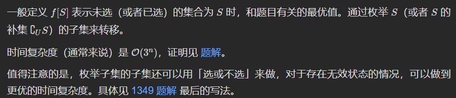
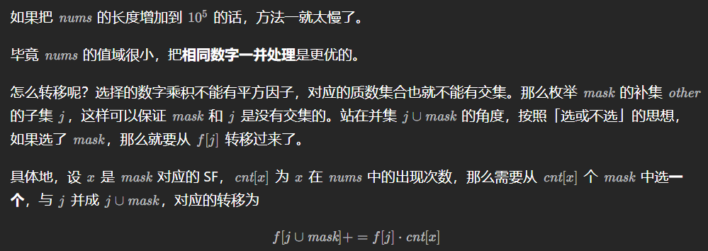

# 九、状态压缩 DP（状压 DP）

# §9.1 排列型 ① 相邻无关


# 全排列模板(下面四个题目全是这个板子)

> # 动态规划的模板很好写。
>
> ```java
> 		int m = left.size();
>         int mask = (1 << m);
>         int[] dp = new int[mask];
>         Arrays.fill(dp, Integer.MAX_VALUE / 2);
>         dp[0] = 0;
>         for (int s = 1; s < mask; s++) {
>             int c = Integer.bitCount(s);
>             for (int i = 0; i < m; i++) {
>                 int pre = (1 << i) ^ s;
>                 if (pre < s) {
>                     dp[s] = Math.min(dp[s], dp[pre] + cal(left.get(c - 1), right.get(i)));
>                 }
>             }
>         }
>         return dp[mask - 1];
> ```

526\. 优美的排列
-----------

假设有从 1 到 n 的 n 个整数。用这些整数构造一个数组 `perm`（**下标从 1 开始**），只要满足下述条件 **之一** ，该数组就是一个 **优美的排列** ：

*   `perm[i]` 能够被 `i` 整除
*   `i` 能够被 `perm[i]` 整除

给你一个整数 `n` ，返回可以构造的 **优美排列** 的 **数量** 。

**示例 1：**

**输入：**n = 2
**输出：**2
**解释：**
第 1 个优美的排列是 \[1,2\]：
    - perm\[1\] = 1 能被 i = 1 整除
    - perm\[2\] = 2 能被 i = 2 整除
第 2 个优美的排列是 \[2,1\]:
    - perm\[1\] = 2 能被 i = 1 整除
    - i = 2 能被 perm\[2\] = 1 整除

**示例 2：**

**输入：**n = 1
**输出：**1

**提示：**

*   `1 <= n <= 15`

[https://leetcode.cn/problems/beautiful-arrangement/description/](https://leetcode.cn/problems/beautiful-arrangement/description/)

```java
import java.util.Arrays;

class Solution { // 6ms
    int[][] memo;
    int n;
    public int countArrangement(int n) {
        this.n = n;
        int x = 0;
        memo = new int[n][(1 << n) + 1];
        for (int i = 0; i < n; i++) {
            Arrays.fill(memo[i], -1);
        }
        return dfs(0, x);
    }

    private int dfs(int i, int x) {
        if (i == n) {
            return x == (1 << n) - 1 ? 1 : 0;
        }
        if (memo[i][x] != -1) {
            return memo[i][x];
        }
        int res = 0;
        for (int j = 0; j < n; j++) {
            if (((x >> j) & 1) == 0 && ((j + 1) % (i + 1) == 0 || (i + 1) % (j + 1) == 0)) {
                res += dfs(i + 1, (1 << j) | x);
            }
        }
        return memo[i][x] = res;
    }
}
```

> 优化：i就是填充的数位个数，其实 i == Integer.bitCount(x)，所以我们可以压缩一个维度

```java
import java.util.Arrays;

class Solution { // 4ms
    int[] memo;
    int n;
    public int countArrangement(int n) {
        this.n = n;
        memo = new int[(1 << n) + 1];
        Arrays.fill(memo, -1);
        return dfs(0);
    }

    private int dfs(int x) {
        if (x == (1 << n) - 1) {
            return 1;
        }
        if (memo[x] != -1) {
            return memo[x];
        }
        int res = 0;
        int i = Integer.bitCount(x);
        for (int j = 0; j < n; j++) {
            if (((x >> j) & 1) == 0 && ((j + 1) % (i + 1) == 0 || (i + 1) % (j + 1) == 0)) {
                res += dfs((1 << j) | x);
            }
        }
        return memo[x] = res;
    }
}
```

```java
// 错误的写法
import java.util.Arrays;

class Solution {
    public int countArrangement(int n) {
        int mask = (1 << n);
        int[] dp = new int[mask];
        for (int s = 1; s < mask; s++) {
            int c = Integer.bitCount(s);
            for (int i = 0; i < n; i++) {
                int pre = s ^ (1 << i);
                if (pre < s && (c % (i + 1) == 0 || (i + 1) % c == 0)) {
                    dp[s] = Math.max(dp[s], dp[pre] + 1);
                }
            }
        }
        return dp[mask - 1];
    }
}
```

```java
class Solution { // 正解
    public int countArrangement(int n) {
        int mask = (1 << n);
        int[] dp = new int[mask];
        dp[0] = 1;
        for (int s = 1; s < mask; s++) {
            int c = Integer.bitCount(s);
            for (int i = 0; i < n; i++) {
                int pre = s ^ (1 << i);
                if (pre < s && (c % (i + 1) == 0 || (i + 1) % c == 0)) {
                    dp[s] += dp[pre];
                }
            }
        }
        return dp[mask - 1];
    }
}
```


1879\. 两个数组最小的异或值之和(状压模板题，模拟退火)
-------------------

给你两个整数数组 `nums1` 和 `nums2` ，它们长度都为 `n` 。

两个数组的 **异或值之和** 为 `(nums1[0] XOR nums2[0]) + (nums1[1] XOR nums2[1]) + ... + (nums1[n - 1] XOR nums2[n - 1])` （**下标从 0 开始**）。

*   比方说，`[1,2,3]` 和 `[3,2,1]` 的 **异或值之和** 等于 `(1 XOR 3) + (2 XOR 2) + (3 XOR 1) = 2 + 0 + 2 = 4` 。

请你将 `nums2` 中的元素重新排列，使得 **异或值之和** **最小** 。

请你返回重新排列之后的 **异或值之和** 。

**示例 1：**

**输入：**nums1 = \[1,2\], nums2 = \[2,3\]
**输出：**2
**解释：**将 `nums2` 重新排列得到 `[3,2] 。`
异或值之和为 (1 XOR 3) + (2 XOR 2) = 2 + 0 = 2 。

**示例 2：**

**输入：**nums1 = \[1,0,3\], nums2 = \[5,3,4\]
**输出：**8
**解释：**将 `nums2 重新排列得到` `[5,4,3] 。`
异或值之和为 (1 XOR 5) + (0 XOR 4) + (3 XOR 3) = 4 + 4 + 0 = 8 。

**提示：**

*   `n == nums1.length`
*   `n == nums2.length`
*   `1 <= n <= 14`
*   `0 <= nums1[i], nums2[i] <= 107`

[https://leetcode.cn/problems/minimum-xor-sum-of-two-arrays/description/](https://leetcode.cn/problems/minimum-xor-sum-of-two-arrays/description/)

```java
import java.util.Arrays;

class Solution {
    public int minimumXORSum(int[] nums1, int[] nums2) {
        // 状态压缩模板题
        int n = nums1.length;
        int[][] dp = new int[n + 1][(1 << n)];
        for (int i = 0; i <= n; i++) {
            Arrays.fill(dp[i], Integer.MAX_VALUE);
        }
        dp[0][0] = 0;
        for (int i = 1; i <= n; i++) {
            for (int s = 0; s < (1 << n); s++) {
                int c = Integer.bitCount(s);
                if (c != i) {
                    continue;
                }
                for (int j = 1; j <= n; j++) {
                    if (((s >> (j - 1)) & 1) == 0) {
                        continue;
                    }
                    dp[i][s] = Math.min(dp[i][s], dp[i - 1][s ^ (1 << (j - 1))] + (nums1[i - 1] ^ nums2[j - 1]));
                }
            }
        }
        return dp[n][(1 << n) - 1];
    }
}
```

> 二维压缩一维

```java
import java.util.Arrays;

class Solution {
    public int minimumXORSum(int[] nums1, int[] nums2) {
        int n = nums1.length;
        int mask = (1 << n);
        int[] dp = new int[mask];
        Arrays.fill(dp, Integer.MAX_VALUE / 2);
        // 表示没有元素异或，nums2里面没有元素
        dp[0] = 0;
        // 表示nums2的选择情况
        for (int s = 1; s < mask; s++) {
            // nums1的下标走到第c - 1位
            int c = Integer.bitCount(s);
            // 枚举nums2
            for (int i = 0; i < n; i++) {
                int pre = (1 << i) ^ s;
                if (pre < s) {
                    dp[s] = Math.min(dp[s], dp[pre] + (nums1[c - 1] ^ nums2[i]));
                }
            }
        }
        return dp[mask - 1];
    }
}
```

> 模拟退火
>
> 即「模拟退火」的单次迭代基本流程：
>
> - 随机选择两个下标，计算「交换下标元素前对应序列的得分」&「交换下标元素后对应序列的得分」
> - 如果温度下降（交换后的序列更优），进入下一次迭代
> - 如果温度上升（交换前的序列更优），以「一定的概率」恢复现场（再交换回来）
>
> 对于一个能够运用模拟退火求解的问题，最核心的是如何实现 calc 方法（即如何定义一个具体方案的得分），其余均为模板内容。

```java
class Solution {
    int N = 400;
    double hi = 1e5, lo = 1e-5, fa = 0.90;
    Random random = new Random(20230823);
    void swap(int[] n, int a, int b) {
        int c = n[a];
        n[a] = n[b];
        n[b] = c;
    }
    int calc() {
        int res = 0;
        for (int i = 0; i < n; i++) res += n1[i] ^ n2[i];
        ans = Math.min(ans, res);
        return res;
    }
    void shuffle(int[] nums) {
        for (int i = n; i > 0; i--) swap(nums, random.nextInt(i), i - 1);
    }
    void sa() {
        shuffle(n2);
        for (double t = hi; t > lo; t *= fa) {
            int a = random.nextInt(n), b = random.nextInt(n);
            int prev = calc();
            swap(n2, a, b);
            int cur = calc(); 
            int diff = cur - prev; 
            if (Math.log(diff / t) >= random.nextDouble()) swap(n2, a, b);
        }
    }
    int[] n1, n2;
    int n;
    int ans = Integer.MAX_VALUE;
    public int minimumXORSum(int[] nums1, int[] nums2) {
        n1 = nums1; n2 = nums2;
        n = n1.length;
        while (N-- > 0) sa();
        return ans;
    }
}
```


> 状压做全排列简直是降维打击

2850\. 将石头分散到网格图的最少移动次数
-----------------------

给你一个大小为 `3 * 3` ，下标从 **0** 开始的二维整数矩阵 `grid` ，分别表示每一个格子里石头的数目。网格图中总共恰好有 `9` 个石头，一个格子里可能会有 **多个** 石头。

每一次操作中，你可以将一个石头从它当前所在格子移动到一个至少有一条公共边的相邻格子。

请你返回每个格子恰好有一个石头的 **最少移动次数** 。

**示例 1：**	


**输入：**grid = \[\[1,1,0\],\[1,1,1\],\[1,2,1\]\]
**输出：**3
**解释：**让每个格子都有一个石头的一个操作序列为：
1 - 将一个石头从格子 (2,1) 移动到 (2,2) 。
2 - 将一个石头从格子 (2,2) 移动到 (1,2) 。
3 - 将一个石头从格子 (1,2) 移动到 (0,2) 。
总共需要 3 次操作让每个格子都有一个石头。
让每个格子都有一个石头的最少操作次数为 3 。

**示例 2：**


**输入：**grid = \[\[1,3,0\],\[1,0,0\],\[1,0,3\]\]
**输出：**4
**解释：**让每个格子都有一个石头的一个操作序列为：
1 - 将一个石头从格子 (0,1) 移动到 (0,2) 。
2 - 将一个石头从格子 (0,1) 移动到 (1,1) 。
3 - 将一个石头从格子 (2,2) 移动到 (1,2) 。
4 - 将一个石头从格子 (2,2) 移动到 (2,1) 。
总共需要 4 次操作让每个格子都有一个石头。
让每个格子都有一个石头的最少操作次数为 4 。

**提示：**

*   `grid.length == grid[i].length == 3`
*   `0 <= grid[i][j] <= 9`
*   `grid` 中元素之和为 `9` 。

[https://leetcode.cn/problems/minimum-moves-to-spread-stones-over-grid/description/?envType=daily-question&envId=2024-07-20](https://leetcode.cn/problems/minimum-moves-to-spread-stones-over-grid/description/?envType=daily-question&envId=2024-07-20)

```java
import java.util.ArrayList;
import java.util.Arrays;

class Solution {
    public int minimumMoves(int[][] grid) {
        int n = grid.length;
        ArrayList<int[]> left = new ArrayList<>();
        ArrayList<int[]> right = new ArrayList<>();
        for (int i = 0; i < n; i++) {
            for (int j = 0; j < n; j++) {
                if (grid[i][j] == 0) {
                    left.add(new int[]{i, j});
                }else{
                    for (int k = 1; k < grid[i][j]; k++) {
                        right.add(new int[]{i, j});
                    }
                }
            }
        }
        // 直接枚举left与right的全排列
        int m = left.size();
        int mask = (1 << m);
        int[] dp = new int[mask];
        Arrays.fill(dp, Integer.MAX_VALUE / 2);
        dp[0] = 0;
        for (int s = 1; s < mask; s++) {
            int c = Integer.bitCount(s);
            for (int i = 0; i < m; i++) {
                int pre = (1 << i) ^ s;
                if (pre < s) {
                    dp[s] = Math.min(dp[s], dp[pre] + cal(left.get(c - 1), right.get(i)));
                }
            }
        }
        return dp[mask - 1];
    }

    private int cal(int[] a, int[] b) {
        return Math.abs(a[0] - b[0]) + Math.abs(a[1] - b[1]);
    }
}
```

```java
import java.util.ArrayList;
import java.util.Arrays;
import java.util.Collections;
import java.util.List;

class Solution {
    public int minimumMoves(int[][] grid) { // 枚举匹配问题的全排列问题
        ArrayList<int[]> left = new ArrayList<>();
        ArrayList<int[]> right = new ArrayList<>();
        for (int i = 0; i < 3; i++) {
            for (int j = 0; j < 3; j++) {
                if (grid[i][j] == 0) {
                    left.add(new int[]{i, j});
                }else{
                    for (int k = 1; k < grid[i][j]; k++) {
                        right.add(new int[]{i, j});
                    }
                }
            }
        }
        int ans = Integer.MAX_VALUE;
        for (List<int[]> left1 : permutations(left)) { // 枚举left的全排列
            int total = 0;
            for (int i = 0; i < left1.size(); i++) {
                total += cal(left1.get(i), right.get(i));
            }
            ans = Math.min(ans, total);
        }
        return ans;
    }

    private List<List<int[]>> permutations(List<int[]> list) {
        ArrayList<List<int[]>> result = new ArrayList<>();
        dfs(list, 0, result);
        return result;
    }

    private void dfs(List<int[]> list, int start, List<List<int[]>> result) {
        if (start == list.size()) {
            result.add(new ArrayList<>(list));
            return;
        }
        for (int i = start; i < list.size(); i++) {
            Collections.swap(list, start, i);
            dfs(list, start + 1, result); // 注意这里不是dfs(list, i + 1, result);
            Collections.swap(list, start, i);
        }
    }

    private int cal(int[] a, int[] b) {
        return Math.abs(a[0] - b[0]) + Math.abs(a[1] - b[1]);
    }

}
```

1947\. 最大兼容性评分和
---------------

有一份由 `n` 个问题组成的调查问卷，每个问题的答案要么是 `0`（no，否），要么是 `1`（yes，是）。

这份调查问卷被分发给 `m` 名学生和 `m` 名导师，学生和导师的编号都是从 `0` 到 `m - 1` 。学生的答案用一个二维整数数组 `students` 表示，其中 `students[i]` 是一个整数数组，包含第 `i` 名学生对调查问卷给出的答案（**下标从 0 开始**）。导师的答案用一个二维整数数组 `mentors` 表示，其中 `mentors[j]` 是一个整数数组，包含第 `j` 名导师对调查问卷给出的答案（**下标从 0 开始**）。

每个学生都会被分配给 **一名** 导师，而每位导师也会分配到 **一名** 学生。配对的学生与导师之间的兼容性评分等于学生和导师答案相同的次数。

*   例如，学生答案为`[1, **_0_**, **_1_**]` 而导师答案为 `[0, **_0_**, **_1_**]` ，那么他们的兼容性评分为 2 ，因为只有第二个和第三个答案相同。

请你找出最优的学生与导师的配对方案，以 **最大程度上** 提高 **兼容性评分和** 。

给你 `students` 和 `mentors` ，返回可以得到的 **最大兼容性评分和** 。

**示例 1：**

**输入：**students = \[\[1,1,0\],\[1,0,1\],\[0,0,1\]\], mentors = \[\[1,0,0\],\[0,0,1\],\[1,1,0\]\]
**输出：**8
**解释：**按下述方式分配学生和导师：
- 学生 0 分配给导师 2 ，兼容性评分为 3 。
- 学生 1 分配给导师 0 ，兼容性评分为 2 。
- 学生 2 分配给导师 1 ，兼容性评分为 3 。
  最大兼容性评分和为 3 + 2 + 3 = 8 。

**示例 2：**

**输入：**students = \[\[0,0\],\[0,0\],\[0,0\]\], mentors = \[\[1,1\],\[1,1\],\[1,1\]\]
**输出：**0
**解释：**任意学生与导师配对的兼容性评分都是 0 。

**提示：**

*   `m == students.length == mentors.length`
*   `n == students[i].length == mentors[j].length`
*   `1 <= m, n <= 8`
*   `students[i][k]` 为 `0` 或 `1`
*   `mentors[j][k]` 为 `0` 或 `1`

[https://leetcode.cn/problems/maximum-compatibility-score-sum/description/](https://leetcode.cn/problems/maximum-compatibility-score-sum/description/)

```java
class Solution {
    public int maxCompatibilitySum(int[][] students, int[][] mentors) {
        int n = students.length;
        int mask = (1 << n);
        int[] dp = new int[mask];
        for (int s = 1; s < mask; s++) {
            int c = Integer.bitCount(s);
            for (int i = 0; i < n; i++) {
                int pre = s ^ (1 << i);
                if (pre < s) {
                    dp[s] = Math.max(dp[s], dp[pre] + cal(students[c - 1], mentors[i]));
                }
            }
        }
        return dp[mask - 1];
    }

    private int cal(int[] a, int[] b) {
        int res = 0;
        for (int i = 0; i < a.length; i++) {
            if (a[i] == b[i]) {
                res++;
            }
        }
        return res;
    }
}
```

1799\. N 次操作后的最大分数和
-------------------

给你 `nums` ，它是一个大小为 `2 * n` 的正整数数组。你必须对这个数组执行 `n` 次操作。

在第 `i` 次操作时（操作编号从 **1** 开始），你需要：

*   选择两个元素 `x` 和 `y` 。
*   获得分数 `i * gcd(x, y)` 。
*   将 `x` 和 `y` 从 `nums` 中删除。

请你返回 `n` 次操作后你能获得的分数和最大为多少。

函数 `gcd(x, y)` 是 `x` 和 `y` 的最大公约数。

**示例 1：**

**输入：**nums = \[1,2\]
**输出：**1
**解释：**最优操作是：
(1 \* gcd(1, 2)) = 1

**示例 2：**

**输入：**nums = \[3,4,6,8\]
**输出：**11
**解释：**最优操作是：
(1 \* gcd(3, 6)) + (2 \* gcd(4, 8)) = 3 + 8 = 11

**示例 3：**

**输入：**nums = \[1,2,3,4,5,6\]
**输出：**14
**解释：**最优操作是：
(1 \* gcd(1, 5)) + (2 \* gcd(2, 4)) + (3 \* gcd(3, 6)) = 1 + 4 + 9 = 14

**提示：**

*   `1 <= n <= 7`
*   `nums.length == 2 * n`
*   `1 <= nums[i] <= 106`

[https://leetcode.cn/problems/maximize-score-after-n-operations/description/](https://leetcode.cn/problems/maximize-score-after-n-operations/description/)

```java
class Solution { // 如果不预处理gcd, 166ms
    public int maxScore(int[] nums) {
        int n = nums.length;
        int mask = (1 << n);
        int[] dp = new int[mask];
        // 为了加快计算, 这里预处理出所有可能用到的gcd, gcd[i][j] = gcd(nums[i], nums[j]);
        int[][] gcd = new int[n][n];
        for(int i = 0;i < n;i++){
            for(int j = 0;j < n;j++){
                gcd[i][j] = gcd(nums[i], nums[j]);
            }
        }
        for (int s = 1; s < mask; s++) {
            int c = Integer.bitCount(s) / 2;
            for (int i = 0; i < n; i++) {
                if (((s >> i) & 1) == 0) {
                    continue;
                }
                for (int j = i + 1; j < n; j++) {
                    if (((s >> j) & 1) == 0) {
                        continue;
                    }
                    int pre = s ^ (1 << i) ^ (1 << j);
                    if (pre < s) {
                        dp[s] = Math.max(dp[s], dp[pre] + gcd[i][j] * c);
                    }
                }
            }
        }
        return dp[mask - 1];
    }

    private int gcd(int a, int b) {
        return b == 0 ? a : gcd(b, a % b);
    }
}
```

2172\. 数组的最大与和
--------------

给你一个长度为 `n` 的整数数组 `nums` 和一个整数 `numSlots` ，满足`2 * numSlots >= n` 。总共有 `numSlots` 个篮子，编号为 `1` 到 `numSlots` 。

你需要把所有 `n` 个整数分到这些篮子中，且每个篮子 **至多** 有 2 个整数。一种分配方案的 **与和** 定义为每个数与它所在篮子编号的 **按位与运算** 结果之和。

*   比方说，将数字 `[1, 3]` 放入篮子 **_`1`_** 中，`[4, 6]` 放入篮子 **_`2`_** 中，这个方案的与和为 `(1 AND **_1_**) + (3 AND **_1_**) + (4 AND _**2**_) + (6 AND _**2**_) = 1 + 1 + 0 + 2 = 4` 。

请你返回将 `nums` 中所有数放入 `numSlots` 个篮子中的最大与和。

**示例 1：**

**输入：**nums = \[1,2,3,4,5,6\], numSlots = 3
**输出：**9
**解释：**一个可行的方案是 \[1, 4\] 放入篮子 _**1**_ 中，\[2, 6\] 放入篮子 **_2_** 中，\[3, 5\] 放入篮子 **_3_** 中。
最大与和为 (1 AND **_1_**) + (4 AND **_1_**) + (2 AND **_2_**) + (6 AND **_2_**) + (3 AND **_3_**) + (5 AND _**3**_) = 1 + 0 + 2 + 2 + 3 + 1 = 9 。

**示例 2：**

**输入：**nums = \[1,3,10,4,7,1\], numSlots = 9
**输出：**24
**解释：**一个可行的方案是 \[1, 1\] 放入篮子 _**1**_ 中，\[3\] 放入篮子 _**3**_ 中，\[4\] 放入篮子 **_4_** 中，\[7\] 放入篮子 **_7_** 中，\[10\] 放入篮子 **_9_** 中。
最大与和为 (1 AND **_1_**) + (1 AND **_1_**) + (3 AND **_3_**) + (4 AND **_4_**) + (7 AND **_7_**) + (10 AND **_9_**) = 1 + 1 + 3 + 4 + 7 + 8 = 24 。
注意，篮子 2 ，5 ，6 和 8 是空的，这是允许的。

**提示：**

*   `n == nums.length`
*   `1 <= numSlots <= 9`
*   `1 <= n <= 2 * numSlots`
*   `1 <= nums[i] <= 15`

[https://leetcode.cn/problems/maximum-and-sum-of-array/description/](https://leetcode.cn/problems/maximum-and-sum-of-array/description/)

```java
class Solution {
    public int maximumANDSum(int[] nums, int m) {
        int n = nums.length;
        int mask = (1 << (m * 2));
        int[] dp = new int[mask];
        int ans = 0;
        for (int s = 1; s < mask; s++) {
            int c = Integer.bitCount(s);
            if (c > n) {
                continue;
            }
            for (int i = 0; i < m * 2; i++) {
                int pre = s ^ (1 << i);
                if (pre < s) {
                    dp[s] = Math.max(dp[s], dp[pre] + (((i % m) + 1) & nums[c - 1]));
                }
            }
            ans = Math.max(ans, dp[s]);
        }
        return ans;
    }
}
```

# §9.2 排列型 ② 相邻相关


2741\. 特别的排列
------------

给你一个下标从 **0** 开始的整数数组 `nums` ，它包含 `n` 个 **互不相同** 的正整数。如果 `nums` 的一个排列满足以下条件，我们称它是一个特别的排列：

*   对于 `0 <= i < n - 1` 的下标 `i` ，要么 `nums[i] % nums[i+1] == 0` ，要么 `nums[i+1] % nums[i] == 0` 。

请你返回特别排列的总数目，由于答案可能很大，请将它对 `109 + 7` **取余** 后返回。

**示例 1：**

**输入：**nums = \[2,3,6\]
**输出：**2
**解释：**\[3,6,2\] 和 \[2,6,3\] 是 nums 两个特别的排列。

**示例 2：**

**输入：**nums = \[1,4,3\]
**输出：**2
**解释：**\[3,1,4\] 和 \[4,1,3\] 是 nums 两个特别的排列。

**提示：**

*   `2 <= nums.length <= 14`
*   `1 <= nums[i] <= 109`

[https://leetcode.cn/problems/special-permutations/description/](https://leetcode.cn/problems/special-permutations/description/)

```java
import java.util.ArrayList;

class Solution { // 经典回溯写法，超时
    int n, ans;
    int[] nums;
    boolean[] visited;
    ArrayList<Integer> tmp = new ArrayList<>();
    private static final int Mod = (int) 1e9 + 7;
    public int specialPerm(int[] nums) {
        n = nums.length;
        this.nums = nums;
        visited = new boolean[n];
        dfs(0);
        return ans;
    }

    private void dfs(int index) {
        if (index == n) {
            ans++;
            ans %= Mod;
            return;
        }
        for (int i = 0; i < n; i++) {
            if (!visited[i] && (index == 0 || nums[i] % tmp.get(index - 1) == 0 || tmp.get(index - 1) % nums[i] == 0)) {
                visited[i] = true;
                tmp.add(nums[i]);
                dfs(index + 1);
                visited[i] = false;
                tmp.remove(index);
            }
        }
    }
}
```

```java
import java.util.Arrays;

class Solution { // 状态压缩成三维dp 344ms
    private static long Mod = (long) 1e9 + 7;
    long[][][] memo;
    public int specialPerm(int[] nums) {
        int n = nums.length;
        memo = new long[n][n][1 << n];
        for (int i = 0; i < n; i++) {
            for (int j = 0; j < n; j++) {
                Arrays.fill(memo[i][j], -1);
            }
        }
        int ans = 0;
        for (int i = 0; i < n; i++) {
            ans += dfs(1, i, (1 << i), nums);
            ans %= Mod;
        }
        return ans;
    }

    private long dfs(int i,int pre,int set,int[] nums) {
        if (i == nums.length) {
            return 1;
        }
        if (memo[i][pre][set] != -1) {
            return memo[i][pre][set];
        }
        long res = 0L;
        for (int j = 0; j < nums.length; j++) {
            if ((set >> j & 1) == 1) {
                continue;
            }
            if (nums[j] % nums[pre] == 0 || nums[pre] % nums[j] == 0) {
                res += dfs(i + 1, j, (1 << j) | set, nums);
                res %= Mod;
            }
        }
        return memo[i][pre][set] = res;
    }

}
```

```java
import java.util.Arrays;

class Solution { // 152ms 压缩成二维
    private static long Mod = (long) 1e9 + 7;
    long[][] memo;
    public int specialPerm(int[] nums) {
        int n = nums.length;
        memo = new long[n][1 << n];
        for (int i = 0; i < n; i++) {
            Arrays.fill(memo[i], -1);
        }
        int ans = 0;
        for (int i = 0; i < n; i++) {
            ans += dfs(i, (1 << i), nums);
            ans %= Mod;
        }
        return ans;
    }

    private long dfs(int pre,int set,int[] nums) {
        if (set == (1 << nums.length) - 1) {
            return 1;
        }
        if (memo[pre][set] != -1) {
            return memo[pre][set];
        }
        long res = 0L;
        for (int j = 0; j < nums.length; j++) {
            if ((set >> j & 1) == 1) {
                continue;
            }
            if (nums[j] % nums[pre] == 0 || nums[pre] % nums[j] == 0) {
                res += dfs(j, (1 << j) | set, nums);
                res %= Mod;
            }
        }
        return memo[pre][set] = res;
    }

}
```

```java
import java.util.Arrays;

class Solution {
    private static final int Mod = (int) 1e9 + 7;
    public int specialPerm(int[] nums) {
        int n = nums.length;
        int mask = (1 << n);
        long[][] dp = new long[mask][n];
        // Arrays.fill(dp[0], 1); 错误的根源，初始化不对
        for (int s = 1; s < mask; ++s) {
            for (int i = 0; i < n; ++i) {
                int pre = s ^ (1 << i);
                if (pre == 0) { // 这里初始化
                    dp[s][i] = 1;
                    continue;
                }
                if (pre < s) {
                    for (int j = 0; j < n; ++j) {
                        if (nums[i] % nums[j] == 0 || nums[j] % nums[i] == 0) {
                            dp[s][i] = (dp[s][i] + dp[pre][j]) % Mod;
                        }
                    }
                }
            }
        }
        return (int) (Arrays.stream(dp[mask - 1]).sum() % Mod);
    }
}

```

1681\. 最小不兼容性
-------------

给你一个整数数组 `nums`​​​ 和一个整数 `k` 。你需要将这个数组划分到 `k` 个相同大小的子集中，使得同一个子集里面没有两个相同的元素。

一个子集的 **不兼容性** 是该子集里面最大值和最小值的差。

请你返回将数组分成 `k` 个子集后，各子集 **不兼容性** 的 **和** 的 **最小值** ，如果无法分成分成 `k` 个子集，返回 `-1` 。

子集的定义是数组中一些数字的集合，对数字顺序没有要求。

**示例 1：**

**输入：**nums = \[1,2,1,4\], k = 2
**输出：**4
**解释：**最优的分配是 \[1,2\] 和 \[1,4\] 。
不兼容性和为 (2-1) + (4-1) = 4 。
注意到 \[1,1\] 和 \[2,4\] 可以得到更小的和，但是第一个集合有 2 个相同的元素，所以不可行。

**示例 2：**

**输入：**nums = \[6,3,8,1,3,1,2,2\], k = 4
**输出：**6
**解释：**最优的子集分配为 \[1,2\]，\[2,3\]，\[6,8\] 和 \[1,3\] 。
不兼容性和为 (2-1) + (3-2) + (8-6) + (3-1) = 6 。

**示例 3：**

**输入：**nums = \[5,3,3,6,3,3\], k = 3
**输出：**\-1
**解释：**没办法将这些数字分配到 3 个子集且满足每个子集里没有相同数字。

**提示：**

*   `1 <= k <= nums.length <= 16`
*   `nums.length` 能被 `k` 整除。
*   `1 <= nums[i] <= nums.length`

[https://leetcode.cn/problems/minimum-incompatibility/description/](https://leetcode.cn/problems/minimum-incompatibility/description/)

```java
import java.lang.reflect.Array;
import java.util.Arrays;

class Solution { // 回溯 + 贪心 1ms
    int result = Integer.MAX_VALUE;
    int[] nums;
    int k;
    public int minimumIncompatibility(int[] nums, int k) {
        Arrays.sort(nums);
        this.nums = nums;
        this.k = k;
        Pair[] pairs = new Pair[k];
        Arrays.setAll(pairs, e -> new Pair());
        dfs(0, 0, pairs);
        return result == Integer.MAX_VALUE ? -1 : result;
    }

    private void dfs(int index, int sum, Pair[] pairs) {
        if (index == nums.length) {
            result = sum;
            return;
        }
        int curSize = nums.length / k; // 初始化当前为最大的容量，后面变化
        for (Pair pair : pairs) {
            // 剪枝 curSize == pair.size作用是保证前面的桶被装满 同时保证桶满了跳过
            if (pair.size == curSize || pair.mx == nums[index]) { // 如果当前pair添加的数字等于之前添加的数字，就直接跳过？贪心？好难理解啊，太难想到了吧，但是不加这个就会超时，还是学状态压缩吧
                continue;
            }
            curSize = pair.size;
            int delta = pair.size == 0 ? 0 : nums[index] - pair.mx;
            if (sum + delta >= result) {
                return;
            }
            int prevMax = pair.mx;
            pair.mx = nums[index];
            pair.size++;
            dfs(index + 1, sum + delta, pairs);
            pair.mx = prevMax;
            pair.size--;
        }
    }

    static class Pair {
        int size = 0;
        int mx = 0;
        Pair(){}
    }
}
```

```java
import java.util.Arrays;
import java.util.HashSet;

class Solution { // 状压dp 70ms,纯暴力，没有贪心思想
    public int minimumIncompatibility(int[] nums, int k) {
        int n = nums.length;
        int mask = 1 << n;
        int m = n / k;
        int[] g = new int[mask]; // 预处理所有组合的不兼容值
        Arrays.fill(g, -1);
        for (int s = 1; s < mask; s++) {
            if (Integer.bitCount(s) != m) {
                continue;
            }
            HashSet<Integer> set = new HashSet<>();
            int mn = Integer.MAX_VALUE, mx = Integer.MIN_VALUE;
            for (int i = 0; i < n; i++) {
                if (((s >> i) & 1) == 1) {
                    if (!set.add(nums[i])) {
                        break;
                    }
                    mn = Math.min(mn, nums[i]);
                    mx = Math.max(mx, nums[i]);
                }
            }
            if (set.size() == m) {
                g[s] = mx - mn;
            }
        }

        int[] dp = new int[mask]; // 表示组合为s时的最小不兼容性
        Arrays.fill(dp, Integer.MAX_VALUE / 2);
        dp[0] = 0;
        for (int s = 0; s < mask; s++) {
            if (dp[s] == Integer.MAX_VALUE / 2) { // 提速250ms
                continue;
            }
            HashSet<Integer> set = new HashSet<>();
            int pre = 0;
            for (int i = 0; i < n; i++) {
                if (((s >> i) & 1) == 0 && !set.contains(nums[i])) {
                    set.add(nums[i]);
                    pre |= (1 << i);
                }
            }
            if (set.size() < m) {
                continue;
            }
            // set.size() >= m，枚举set中长度为 m 的子集
            for (int i = pre; i > 0; i = (i - 1) & pre) { // 下面有对这段代码的详细解释
                if (g[i] != -1) { // 保证i中有m个1组成
                    dp[s | i] = Math.min(dp[s | i], dp[s] + g[i]);
                }
            }
        }
        return dp[mask - 1] == Integer.MAX_VALUE / 2 ? -1 : dp[mask - 1];
    }
}
```

> 
>
> 当然，我很乐意为您解释这个表达式。这是一个非常有趣的位操作，通常用于一些特定的算法中。让我们逐步分析这个表达式：
>
> ```java
> i = (i - 1) & pre
> ```
>
> 这个表达式包含了减法和按位与（&）操作。它的作用是找到小于 i 的最大的数，该数的二进制表示是 pre 的子集。
>
> 让我们通过一些例子来理解这个操作：
>
> =====
>    - 📖 概念：位操作和子集枚举
>    - 📝 解释：这个操作常用于子集枚举，特别是在处理二进制表示的集合时。
>    - 💻 示例代码：
> ```java
> int pre = 0b1101000;  // 二进制表示
> int i = 0b1101000;    // 初始值等于 pre
> 
> while (i > 0) {
>     System.out.println(Integer.toBinaryString(i));
>     i = (i - 1) & pre;
> }
> ```
>    - 🏋️ 练习：尝试手动计算上述代码的输出。
>     =====
>
> 让我们一步步看这个过程：
>
> 1. 初始状态：
>    i = 1101000 (二进制)
>    pre = 1101000 (二进制)
>
> 2. 第一次迭代：
>    i - 1 = 1100111
>    (i - 1) & pre = 1100000
>
> 3. 第二次迭代：
>    i - 1 = 1011111
>    (i - 1) & pre = 1001000
>
> 4. 第三次迭代：
>    i - 1 = 1000111
>    (i - 1) & pre = 1000000
>
> 5. 第四次迭代：
>    i - 1 = 0111111
>    (i - 1) & pre = 0101000
>
> 6. 第五次迭代：
>    i - 1 = 0100111
>    (i - 1) & pre = 0100000
>
> 7. 第六次迭代：
>    i - 1 = 0011111
>    (i - 1) & pre = 0001000
>
> 8. 第七次迭代：
>    i - 1 = 0000111
>    (i - 1) & pre = 0000000 (循环结束)
>
> 这个操作的巧妙之处在于：
> 1. `i - 1` 会把最右边的 1 变成 0，并把它右边的所有 0 变成 1。
> 2. 然后与 `pre` 进行按位与操作，会保留所有在 `pre` 中为 1 的位，抹去其他位。
>
> 这样，每次迭代都会得到一个比当前数小的、且是 `pre` 的子集的数。
>
> 这种技巧常用于需要枚举一个集合所有子集的场景，特别是在动态规划、状态压缩等算法中非常有用。
>

# §9.3 旅行商问题（TSP）

# 本质上就是排列型 ②

943\. 最短超级串(封神难题，模板)
-----------

给定一个字符串数组 `words`，找到以 `words` 中每个字符串作为子字符串的最短字符串。如果有多个有效最短字符串满足题目条件，返回其中 **任意一个** 即可。

我们可以假设 `words` 中没有字符串是 `words` 中另一个字符串的子字符串。

**示例 1：**

**输入：**words = \["alex","loves","leetcode"\]
**输出：**"alexlovesleetcode"
**解释：**"alex"，"loves"，"leetcode" 的所有排列都会被接受。

**示例 2：**

**输入：**words = \["catg","ctaagt","gcta","ttca","atgcatc"\]
**输出：**"gctaagttcatgcatc"

**提示：**

*   `1 <= words.length <= 12`
*   `1 <= words[i].length <= 20`
*   `words[i]` 由小写英文字母组成
*   `words` 中的所有字符串 **互不相同**

[https://leetcode.cn/problems/find-the-shortest-superstring/description/](https://leetcode.cn/problems/find-the-shortest-superstring/description/)

```java
class Solution {
    public String shortestSuperstring(String[] words) {
        int n = words.length;
        int mask = 1 << n;
        int[][] g = new int[n][n]; // 表示字符串i的后缀与j的前缀相同的长度
        for (int i = 0; i < n; i++) {
            for (int j = 0; j < n; j++) {
                String a = words[i], b = words[j];
                int l1 = a.length(), l2 = b.length(), len = Math.min(l1, l2);
                for (int k = len; k >= 1; k--) {
                    if (a.substring(l1 - k).equals(b.substring(0, k))) {
                        g[i][j] = k;
                        break;
                    }
                }
            }
        }

        int[][] dp = new int[mask][n], p = new int[mask][n];
        for (int s = 0; s < mask; s++) {
            for (int i = 0; i < n; i++) {
                if (((s >> i) & 1) == 0) {
                    continue;
                }
                for (int j = 0; j < n; j++) {
                    if (((s >> j) & 1) == 1) { // 表示当前字符已经被选择了
                        continue;
                    }
                    if (dp[s | (1 << j)][j] <= dp[s][i] + g[i][j]) {
                        dp[s | (1 << j)][j] = dp[s][i] + g[i][j];
                        p[s | (1 << j)][j] = i; // 记录每个状态是由哪个前驱转移而来
                    }
                }
            }
        }

        int mx = dp[mask - 1][0], idx = 0, last = -1, status = mask - 1;
        for (int i = 1; i < n; i++) {
            if (mx < dp[mask - 1][i]) {
                mx = dp[mask - 1][i];
                idx = i;
            }
        }
        String ans = "";
        while (status != 0) {
            if (last == -1) {
                ans = words[idx];
            }else{
                ans = words[idx].substring(0, words[idx].length() - g[idx][last]) + ans;
            }
            last = idx;
            idx = p[status][idx];
            status ^= (1 << last);
        }
        return ans;
    }
}
```

847\. 访问所有节点的最短路径（模板）
-----------------

存在一个由 `n` 个节点组成的无向连通图，图中的节点按从 `0` 到 `n - 1` 编号。

给你一个数组 `graph` 表示这个图。其中，`graph[i]` 是一个列表，由所有与节点 `i` 直接相连的节点组成。

返回能够访问所有节点的最短路径的长度。你可以在任一节点开始和停止，也可以多次重访节点，并且可以重用边。

**示例 1：**


**输入：**graph = \[\[1,2,3\],\[0\],\[0\],\[0\]\]
**输出：**4
**解释：**一种可能的路径为 \[1,0,2,0,3\]

**示例 2：**


**输入：**graph = \[\[1\],\[0,2,4\],\[1,3,4\],\[2\],\[1,2\]\]
**输出：**4
**解释：**一种可能的路径为 \[0,1,4,2,3\]

**提示：**

*   `n == graph.length`
*   `1 <= n <= 12`
*   `0 <= graph[i].length < n`
*   `graph[i]` 不包含 `i`
*   如果 `graph[a]` 包含 `b` ，那么 `graph[b]` 也包含 `a`
*   输入的图总是连通图

[https://leetcode.cn/problems/shortest-path-visiting-all-nodes/description/](https://leetcode.cn/problems/shortest-path-visiting-all-nodes/description/)

> bfs + 状压dp 只适用于不带边权的图

```java
import java.util.ArrayDeque;
import java.util.Arrays;

class Solution {
    public int shortestPathLength(int[][] graph) {
        int n = graph.length;
        int mask = 1 << n;
        int[][] dp = new int[mask][n];
        for (int i = 0; i < mask; i++) {
            Arrays.fill(dp[i], Integer.MAX_VALUE/2);
        }
        ArrayDeque<int[]> deque = new ArrayDeque<>();
        for (int i = 0; i < n; i++) {
            dp[1 << i][i] = 0;
            deque.addLast(new int[]{1 << i, i});
        }
        while (!deque.isEmpty()) {
            int[] poll = deque.pollFirst();
            int state = poll[0], u = poll[1], step = dp[state][u];
            if (state == mask - 1) {
                return step;
            }
            for (int v : graph[u]) {
                if (dp[state | (1 << v)][v] == Integer.MAX_VALUE/2) {
                    dp[state | (1 << v)][v] = step + 1;
                    deque.addLast(new int[]{state | (1 << v), v});
                }
            }
        }
        return -1;
    }
}
```

> floy + 状压dp 既适用于不带边权的图，也适用于带权的图

```java
import java.util.Arrays;

class Solution {
    public int shortestPathLength(int[][] graph) {
        int n = graph.length;
        int mask = 1 << n;
        int[][] dist = new int[n][n];
        for (int i = 0; i < n; i++) {
            Arrays.fill(dist[i], Integer.MAX_VALUE / 2);
            dist[i][i] = 0;
        }
        for (int i = 0; i < n; i++) {
            for (int j : graph[i]) {
                dist[i][j] = dist[j][i] = 1;
            }
        }
        for (int k = 0; k < n; k++) { // floyd模板
            for (int i = 0; i < n; i++) {
                for (int j = 0; j < n; j++) {
                    dist[i][j] = Math.min(dist[i][j], dist[i][k] + dist[k][j]);
                }
            }
        }

        int[][] dp = new int[mask][n];
        for (int i = 0; i < mask; i++) {
            Arrays.fill(dp[i], Integer.MAX_VALUE / 2);
        }
        for (int i = 0; i < n; i++) {
            dp[1 << i][i] = 0;
        }
        for (int s = 0; s < mask; s++) {
            // 枚举 state 中已经被访问过的点
            for (int i = 0; i < n; i++) {
                if (((s >> i) & 1) == 0) {
                    continue;
                }
                // 枚举 state 中尚未被访问过的点
                for (int j = 0; j < n; j++) {
                    if (((s >> j) & 1) == 1) {
                        continue;
                    }
                    dp[s | (1 << j)][j] = Math.min(dp[s | (1 << j)][j], dp[s][i] + dist[i][j]);
                }
            }
        }
        int ans = Integer.MAX_VALUE / 2;
        for (int i = 0; i < n; i++) {
            ans = Math.min(ans, dp[mask - 1][i]);
        }
        return ans;
    }
}
```

LCP 13. 寻宝
----------

我们得到了一副藏宝图，藏宝图显示，在一个迷宫中存在着未被世人发现的宝藏。

迷宫是一个二维矩阵，用一个字符串数组表示。它标识了唯一的入口（用 'S' 表示），和唯一的宝藏地点（用 'T' 表示）。但是，宝藏被一些隐蔽的机关保护了起来。在地图上有若干个机关点（用 'M' 表示），**只有所有机关均被触发，才可以拿到宝藏。**

要保持机关的触发，需要把一个重石放在上面。迷宫中有若干个石堆（用 'O' 表示），每个石堆都有**无限**个足够触发机关的重石。但是由于石头太重，我们一次只能搬**一个**石头到指定地点。

迷宫中同样有一些墙壁（用 '#' 表示），我们不能走入墙壁。剩余的都是可随意通行的点（用 '.' 表示）。石堆、机关、起点和终点（无论是否能拿到宝藏）也是可以通行的。

我们每步可以选择向上/向下/向左/向右移动一格，并且不能移出迷宫。搬起石头和放下石头不算步数。那么，从起点开始，我们最少需要多少步才能最后拿到宝藏呢？如果无法拿到宝藏，返回 -1 。

**示例 1：**

> 输入： \["S#O", "M..", "M.T"\]
>
> 输出：16
>
> 解释：最优路线为： S->O, cost = 4, 去搬石头 O->第二行的M, cost = 3, M机关触发 第二行的M->O, cost = 3, 我们需要继续回去 O 搬石头。 O->第三行的M, cost = 4, 此时所有机关均触发 第三行的M->T, cost = 2，去T点拿宝藏。 总步数为16。 

**示例 2：**

> 输入： \["S#O", "M.#", "M.T"\]
>
> 输出：-1
>
> 解释：我们无法搬到石头触发机关

**示例 3：**

> 输入： \["S#O", "M.T", "M.."\]
>
> 输出：17
>
> 解释：注意终点也是可以通行的。

**限制：**

*   `1 <= maze.length <= 100`
*   `1 <= maze[i].length <= 100`
*   `maze[i].length == maze[j].length`
*   S 和 T 有且只有一个
*   0 <= M的数量 <= 16
*   0 <= O的数量 <= 40，题目保证当迷宫中存在 M 时，一定存在至少一个 O 。

[https://leetcode.cn/problems/xun-bao/description/](https://leetcode.cn/problems/xun-bao/description/)


> ​    把点分为两种，一个列表放石头的，一个列表放机关的 然后求出每个机关到每个石头的距离 然后在求得每个机关到每个机关的距离 然后就是逆天的游戏理解 把一个数的二进制表示当前机关触发的状态 这个数的二进制第i位如果为0就表示第i个机关还没有被触发，反之为1就表示被触发了 然后再找出机关触发状态下，最短的距离 

```java
class Solution {
  
     public int minimalSteps(String[] maze) {
        int n = maze.length;
        char[][] mat = new char[n][];
        for (int i = 0; i < n; i++) {
            mat[i] = maze[i].toCharArray();
        }

        int m = mat[0].length;
        List<int[]> triggers = new ArrayList<>();
        List<int[]> stones = new ArrayList<>();
        int[] start = null;
        int[] end = null;
        //把各个类型的点分开
        for (int i = 0; i < n; i++) {
            for (int j = 0; j < m; j++) {
                if (mat[i][j] == 'M') {
                    triggers.add(new int[]{i, j});
                }
                if (mat[i][j] == 'O') {
                    stones.add(new int[]{i, j});
                }
                if (mat[i][j] == 'S') {
                    start = new int[]{i, j};
                }
                if (mat[i][j] == 'T') {
                    end = new int[]{i, j};
                }
            }
        }
        //把初始点加入机关队列，把终点加入石头队列
        triggers.add(start);
        stones.add(end);
        int T = triggers.size();
        int S = stones.size();

        int[][] dist = new int[T][S];
        //方向
        int[][] dirs = new int[][]{
                {1, 0},
                {-1, 0},
                {0, 1},
                {0, -1}
        };
        //BFS（如果这里不懂得话，不建议先看这道题，先看一下BFS类型得题）
        int inf = (int) 1e8;
        Deque<int[]> dq = new ArrayDeque<>(n * m);
        int[][] access = new int[n][m];
        for (int i = 0; i < T; i++) {
            dq.clear();
            for (int[] a : access) {
                Arrays.fill(a, -1);
            }
            int[] t = triggers.get(i);
            access[t[0]][t[1]] = 0;
            dq.addLast(t);
            while (!dq.isEmpty()) {
                int[] head = dq.removeFirst();
                for (int[] dir : dirs) {
                    int x = head[0] + dir[0];
                    int y = head[1] + dir[1];
                    if (x < 0 || x >= n || y < 0 || y >= m || mat[x][y] == '#' ||
                            access[x][y] != -1) {
                        continue;
                    }
                    access[x][y] = access[head[0]][head[1]] + 1;
                    dq.addLast(new int[]{x, y});
                }
            }
            //dist[i][j]这里就是 第i个机关到第j个石头的最短距离
            for (int j = 0; j < S; j++) {
                int[] s = stones.get(j);
                if (access[s[0]][s[1]] == -1) {
                    dist[i][j] = inf;
                } else {
                    dist[i][j] = access[s[0]][s[1]];
                }
            }
        }
        //循环所有的点，找到最小的移动点
        int[][] move = new int[T][T];
        for (int i = 0; i < T; i++) {
            for (int j = 0; j < T; j++) {
                if (i == j) {
                    continue;
                }
                move[i][j] = inf;
                //石堆的最后一个是终点，所以要-1
                for (int k = 0; k < S - 1; k++) {
                    //i到j的最短距离为：i到k石堆+j到k石堆
                    move[i][j] = Math.min(move[i][j], dist[i][k] + dist[j][k]);
                }
            }
        }
        //初始化
        //mask的二进制中，第j位如果为0，证明第j个机关没有触发
        int mask = (1 << (T - 1)) - 1;
        int[][] dp = new int[T][mask + 1];
        for (int i = 0; i < T; i++) {
            dp[i][0] = inf;
        }
        //这里运用二进制，i的第j位如果是0的话，证明第j个机关还没触发，反之，就是第j个机关触发了
        dp[T - 1][0] = 0;
        for (int i = 1; i <= mask; i++) {
            for (int j = 0; j < T; j++) {
                dp[j][i] = inf;
                //这里相当于剪枝操作吧，如果都是i>>j的最后一位不能触发，就直接过吧
                //既然有不能触发的机关，求出就没有意义
                if (bit(i, j) == 0) {
                    continue;
                }
                //这里异运算，就是找没触发的
                //也就是需要改变的状态
                int remove = i ^ (1 << j);
                for (int k = 0; k < T; k++) {
                    //当前的j个机关最小值，就是k个机关的remove状态，然后加上k到j的路径
                    dp[j][i] = Math.min(dp[j][i], dp[k][remove] + move[k][j]);
                }
            }
        }

        int ans = inf;
        if (T > 1) {
            for (int i = 0; i < T - 1; i++) {
                //找mask就是全都为1，证明全部机关触发
                //dist是上面求得最短距离，第i个机关到s-1的最短路径（到终点的最短路径）
                //因为开始的时候，把初始点加入到了机关队列，把终点加入到了石头队列
                ans = Math.min(ans, dp[i][mask] + dist[i][S - 1]);
            }
        } else {
            ans = dist[0][S - 1];
        }

        if (ans >= inf) {
            return -1;
        }
        return ans;
    }
    
    int bit(int x, int i) {
        return (x >> i) & 1;
    }
}
```

# §9.4 枚举子集的子集



2305\. 公平分发饼干
-------------

给你一个整数数组 `cookies` ，其中 `cookies[i]` 表示在第 `i` 个零食包中的饼干数量。另给你一个整数 `k` 表示等待分发零食包的孩子数量，**所有** 零食包都需要分发。在同一个零食包中的所有饼干都必须分发给同一个孩子，不能分开。

分发的 **不公平程度** 定义为单个孩子在分发过程中能够获得饼干的最大总数。

返回所有分发的最小不公平程度。

**示例 1：**

**输入：**cookies = \[8,15,10,20,8\], k = 2
**输出：**31
**解释：**一种最优方案是 \[8,15,8\] 和 \[10,20\] 。
- 第 1 个孩子分到 \[8,15,8\] ，总计 8 + 15 + 8 = 31 块饼干。
- 第 2 个孩子分到 \[10,20\] ，总计 10 + 20 = 30 块饼干。
  分发的不公平程度为 max(31,30) = 31 。
  可以证明不存在不公平程度小于 31 的分发方案。

**示例 2：**

**输入：**cookies = \[6,1,3,2,2,4,1,2\], k = 3
**输出：**7
**解释：**一种最优方案是 \[6,1\]、\[3,2,2\] 和 \[4,1,2\] 。
- 第 1 个孩子分到 \[6,1\] ，总计 6 + 1 = 7 块饼干。 
- 第 2 个孩子分到 \[3,2,2\] ，总计 3 + 2 + 2 = 7 块饼干。
- 第 3 个孩子分到 \[4,1,2\] ，总计 4 + 1 + 2 = 7 块饼干。
  分发的不公平程度为 max(7,7,7) = 7 。
  可以证明不存在不公平程度小于 7 的分发方案。

**提示：**

*   `2 <= cookies.length <= 8`
*   `1 <= cookies[i] <= 105`
*   `2 <= k <= cookies.length`

[https://leetcode.cn/problems/fair-distribution-of-cookies/description/](https://leetcode.cn/problems/fair-distribution-of-cookies/description/)

```java
class Solution { // 回溯写法  184ms
    int ans = INF;
    private final static int INF = Integer.MAX_VALUE / 2;
    public int distributeCookies(int[] cookies, int k) {
        int[] tmp = new int[k]; // k个小孩
        dfs(cookies, tmp, 0, 0);
        return ans;
    }

    private void dfs(int[] cookies, int[] tmp, int index,int mx) {
        if (index == cookies.length) {
            ans = Math.min(ans, mx);
        }
        for (int i = 0; i < tmp.length; i++) {
            tmp[i] += cookies[index];
            dfs(cookies, tmp, index + 1, Math.max(mx, tmp[i]));
            tmp[i] -= cookies[index];
        }
    }
}
```

```java
import java.util.Arrays;

class Solution {
    private final static int INF = Integer.MAX_VALUE / 2;
    public int distributeCookies(int[] cookies, int k) {
        int n = cookies.length;
        int mask = 1 << n;
        int[] g = new int[mask];
        for (int s = 0; s < mask; s++) {
            int t = 0;
            for (int i = 0; i < n; i++) {
                t += ((s >> i) & 1) == 1 ? cookies[i] : 0;
            }
            g[s] = t;
        }
        int[][] dp = new int[k + 1][mask];
        for (int i = 0; i <= k; i++) {
            Arrays.fill(dp[i], INF);
        }
        dp[0][0] = 0;
        for (int i = 1; i <= k; i++) { // 前i个人
            for (int s = 0; s < mask; s++) {
                for (int p = s; p != 0; p = (p - 1) & s) { // 枚举子集
                    dp[i][s] = Math.min(dp[i][s], Math.max(dp[i - 1][s - p], g[p]));
                }
            }
        }
        return dp[k][mask - 1];
    }
}
```

1986\. 完成任务的最少工作时间段
-------------------

你被安排了 `n` 个任务。任务需要花费的时间用长度为 `n` 的整数数组 `tasks` 表示，第 `i` 个任务需要花费 `tasks[i]` 小时完成。一个 **工作时间段** 中，你可以 **至多** 连续工作 `sessionTime` 个小时，然后休息一会儿。

你需要按照如下条件完成给定任务：

*   如果你在某一个时间段开始一个任务，你需要在 **同一个** 时间段完成它。
*   完成一个任务后，你可以 **立马** 开始一个新的任务。
*   你可以按 **任意顺序** 完成任务。

给你 `tasks` 和 `sessionTime` ，请你按照上述要求，返回完成所有任务所需要的 **最少** 数目的 **工作时间段** 。

测试数据保证 `sessionTime` **大于等于** `tasks[i]` 中的 **最大值** 。

**示例 1：**

**输入：**tasks = \[1,2,3\], sessionTime = 3
**输出：**2
**解释：**你可以在两个工作时间段内完成所有任务。
- 第一个工作时间段：完成第一和第二个任务，花费 1 + 2 = 3 小时。
- 第二个工作时间段：完成第三个任务，花费 3 小时。

**示例 2：**

**输入：**tasks = \[3,1,3,1,1\], sessionTime = 8
**输出：**2
**解释：**你可以在两个工作时间段内完成所有任务。
- 第一个工作时间段：完成除了最后一个任务以外的所有任务，花费 3 + 1 + 3 + 1 = 8 小时。
- 第二个工作时间段，完成最后一个任务，花费 1 小时。

**示例 3：**

**输入：**tasks = \[1,2,3,4,5\], sessionTime = 15
**输出：**1
**解释：**你可以在一个工作时间段以内完成所有任务。

**提示：**

*   `n == tasks.length`
*   `1 <= n <= 14`
*   `1 <= tasks[i] <= 10`
*   `max(tasks[i]) <= sessionTime <= 15`

[https://leetcode.cn/problems/minimum-number-of-work-sessions-to-finish-the-tasks/description/](https://leetcode.cn/problems/minimum-number-of-work-sessions-to-finish-the-tasks/description/)

```java
import java.util.Arrays;

class Solution {
    public int minSessions(int[] tasks, int sessionTime) {
        // 凑出时间段
        int n = tasks.length;
        int mask = 1 << n;
        int[] g = new int[mask];
        Arrays.fill(g, Integer.MAX_VALUE / 2);
        next:
        for (int s = 0; s < mask; s++) { // 需要保证子序列没问题
            int tmp = 0;
            for (int i = 0; i < n; i++) {
                if (((s >> i) & 1) == 1) {
                    tmp += tasks[i];
                }
                if (tmp > sessionTime) {
                    continue next; 
                }
            }
            g[s] = (tmp + sessionTime - 1) / sessionTime;
        }
        int[] dp = new int[mask]; // dp[s] = Math.min(dp[s], dp[s - p] + g[p]);
        Arrays.fill(dp, Integer.MAX_VALUE / 2);
        dp[0] = 0;
        for (int s = 0; s < mask; s++) {
            for (int p = s; p > 0; p = (p - 1) & s) {
                dp[s] = Math.min(dp[s], dp[s - p] + g[p]);
            }
        }
        return dp[mask - 1];
    }
}
```

1494\. 并行课程 II
--------------

给你一个整数 `n` 表示某所大学里课程的数目，编号为 `1` 到 `n` ，数组 `relations` 中， `relations[i] = [xi, yi]`  表示一个先修课的关系，也就是课程 `xi` 必须在课程 `yi` 之前上。同时你还有一个整数 `k` 。

在一个学期中，你 **最多** 可以同时上 `k` 门课，前提是这些课的先修课在之前的学期里已经上过了。

请你返回上完所有课最少需要多少个学期。题目保证一定存在一种上完所有课的方式。

**示例 1：**

****

**输入：**n = 4, relations = \[\[2,1\],\[3,1\],\[1,4\]\], k = 2
**输出：**3 
**解释：**上图展示了题目输入的图。在第一个学期中，我们可以上课程 2 和课程 3 。然后第二个学期上课程 1 ，第三个学期上课程 4 。

**示例 2：**

****

**输入：**n = 5, relations = \[\[2,1\],\[3,1\],\[4,1\],\[1,5\]\], k = 2
**输出：**4 
**解释：**上图展示了题目输入的图。一个最优方案是：第一学期上课程 2 和 3，第二学期上课程 4 ，第三学期上课程 1 ，第四学期上课程 5 。

**示例 3：**

**输入：**n = 11, relations = \[\], k = 2
**输出：**6

**提示：**

*   `1 <= n <= 15`
*   `1 <= k <= n`
*   `0 <= relations.length <= n * (n-1) / 2`
*   `relations[i].length == 2`
*   `1 <= xi, yi <= n`
*   `xi != yi`
*   所有先修关系都是不同的，也就是说 `relations[i] != relations[j]` 。
*   题目输入的图是个有向无环图。

[https://leetcode.cn/problems/parallel-courses-ii/description/](https://leetcode.cn/problems/parallel-courses-ii/description/)

```java
import java.util.Arrays;
// waitStudy &= (~s); // 取waitStudy与s的补集
// waitStudy -= s; 用上面的是265ms，换成这一行直接401ms 但是只有这个题会这样，难道是赋值的问题？
class Solution {
    public int minNumberOfSemesters(int n, int[][] relations, int k) {
        int[] pre = new int[n];
        for (int[] relation : relations) {
            pre[relation[1] - 1] |= (1 << (relation[0] - 1));
        }
        int mask = 1 << n;
        int[] dp = new int[mask];
        Arrays.fill(dp, n);
        dp[0] = 0;
        for (int s = 0; s < mask; s++) { // s是已经学过的课程状态
            int waitStudy = 0;
            for (int i = 0; i < n; i++) {
                if ((pre[i] & s) == pre[i]) { // 如果要学习课程i，需要满足的前提条件pre[i]
                    waitStudy |= (1 << i);
                }
            }
            // 排除已经学过的课程
            waitStudy &= (~s); // 取waitStudy与s的补集
            // waitStudy -= s; 用上面的是265ms，换成这一行直接401ms
            for (int p = waitStudy; p > 0; p = (p - 1) & waitStudy) {
                if (Integer.bitCount(p) > k) {
                    continue;
                }
                dp[s | p] = Math.min(dp[s | p], dp[s] + 1);
            }
        }
        return dp[mask - 1];
    }
}
```

1723\. 完成所有工作的最短时间
------------------

给你一个整数数组 `jobs` ，其中 `jobs[i]` 是完成第 `i` 项工作要花费的时间。

请你将这些工作分配给 `k` 位工人。所有工作都应该分配给工人，且每项工作只能分配给一位工人。工人的 **工作时间** 是完成分配给他们的所有工作花费时间的总和。请你设计一套最佳的工作分配方案，使工人的 **最大工作时间** 得以 **最小化** 。

返回分配方案中尽可能 **最小** 的 **最大工作时间** 。

**示例 1：**

**输入：**jobs = \[3,2,3\], k = 3
**输出：**3
**解释：**给每位工人分配一项工作，最大工作时间是 3 。

**示例 2：**

**输入：**jobs = \[1,2,4,7,8\], k = 2
**输出：**11
**解释：**按下述方式分配工作：
1 号工人：1、2、8（工作时间 = 1 + 2 + 8 = 11）
2 号工人：4、7（工作时间 = 4 + 7 = 11）
最大工作时间是 11 。

**提示：**

*   `1 <= k <= jobs.length <= 12`
*   `1 <= jobs[i] <= 107`

[https://leetcode.cn/problems/find-minimum-time-to-finish-all-jobs/description/](https://leetcode.cn/problems/find-minimum-time-to-finish-all-jobs/description/)

```java
import java.util.Arrays;

class Solution {
    public int minimumTimeRequired(int[] jobs, int k) {
        int n = jobs.length;
        int mask = 1 << n;
        int[] g = new int[mask];
        for (int i = 0; i < mask; i++) {
            int tmp = 0;
            for (int j = 0; j < n; j++) {
                if (((i >> j) & 1) == 1) {
                    tmp += jobs[j];
                }
            }
            g[i] = tmp;
        }
        int[][] dp = new int[k + 1][mask];
        for (int i = 0; i <= k; i++) {
            Arrays.fill(dp[i], Integer.MAX_VALUE / 2);
        }
        dp[0][0] = 0;
        for (int i = 1; i <= k; i++) {
            for (int s = 0; s < mask; s++) {
                for (int p = s; p != 0; p = (p - 1) & s) {
                    dp[i][s] = Math.min(dp[i][s], Math.max(dp[i - 1][s - p], g[p]));
                }
            }
        }
        return dp[k][mask - 1];
    }
}
```

1655\. 分配重复整数(0-1背包模型)
-------------

给你一个长度为 `n` 的整数数组 `nums` ，这个数组中至多有 `50` 个不同的值。同时你有 `m` 个顾客的订单 `quantity` ，其中，整数 `quantity[i]` 是第 `i` 位顾客订单的数目。请你判断是否能将 `nums` 中的整数分配给这些顾客，且满足：

*   第 `i` 位顾客 **恰好** 有 `quantity[i]` 个整数。
*   第 `i` 位顾客拿到的整数都是 **相同的** 。
*   每位顾客都满足上述两个要求。

如果你可以分配 `nums` 中的整数满足上面的要求，那么请返回 `true` ，否则返回 `false` 。

**示例 1：**

**输入：**nums = \[1,2,3,4\], quantity = \[2\]
**输出：**false
**解释：**第 0 位顾客没办法得到两个相同的整数。

**示例 2：**

**输入：**nums = \[1,2,3,3\], quantity = \[2\]
**输出：**true
**解释：**第 0 位顾客得到 \[3,3\] 。整数 \[1,2\] 都没有被使用。

**示例 3：**

**输入：**nums = \[1,1,2,2\], quantity = \[2,2\]
**输出：**true
**解释：**第 0 位顾客得到 \[1,1\] ，第 1 位顾客得到 \[2,2\] 。

**提示：**

*   `n == nums.length`
*   `1 <= n <= 105`
*   `1 <= nums[i] <= 1000`
*   `m == quantity.length`
*   `1 <= m <= 10`
*   `1 <= quantity[i] <= 105`
*   `nums` 中至多有 `50` 个不同的数字。

[https://leetcode.cn/problems/distribute-repeating-integers/description/](https://leetcode.cn/problems/distribute-repeating-integers/description/)

```java
import java.util.HashMap;
import java.util.Map;
import java.util.TreeMap;

class Solution { // 用例[1,1,1,1,2,2,2,2,2,2,2,2,2] [3,3,3,4]干碎我的贪心解法
    public boolean canDistribute(int[] nums, int[] quantity) {
        HashMap<Integer, Integer> cnt1 = new HashMap<>();
        TreeMap<Integer, Integer> freq1 = new TreeMap<>();
        for (int x : nums) {
            cnt1.merge(x, 1, Integer::sum);
        }
        for (int x : cnt1.keySet()) {
            freq1.merge(cnt1.get(x), 1, Integer::sum);
        }
        for (int x : quantity) {
            Map.Entry<Integer, Integer> entry = freq1.ceilingEntry(x);
            if (entry == null || entry.getValue() == 0) {
                return false;
            } else if (entry.getValue() == 1) {
                freq1.remove(entry.getKey());
                if (entry.getKey() != x) {
                    freq1.put(entry.getKey() - x, 1);
                }
            } else if (entry.getValue() > 1) {
                freq1.put(entry.getKey(), entry.getValue() - 1);
                if (entry.getKey() != x) {
                    freq1.put(entry.getKey() - x, 1);
                }
            }
        }
        return true;
    }
}
```

```java
// 状压dp
import java.util.Arrays;
import java.util.HashMap;

class Solution { // 329ms
    // 未来避免重复的选择，可以利用0-1背包的选择
    public boolean canDistribute(int[] nums, int[] quantity) {
        int m = quantity.length;
        int mask = 1<<m;
        int[] sum = new int[mask];
        for(int s = 1;s < mask;s++){
            for (int i = 0; i < m; i++) {
                if (((s >> i) & 1) == 0) {
                    continue;
                }
                sum[s] += quantity[i];
            }
        }
        HashMap<Integer, Integer> cnt = new HashMap<>();
        for (int x : nums) {
            cnt.merge(x, 1, Integer::sum);
        }
        int n = cnt.size();
        boolean[][] dp = new boolean[n + 1][mask]; // 表示考虑前i个数构成情况为s的boolean
        for (int i = 0; i <= n; i++) {
            dp[i][0] = true;
        }
        int i = 0;
        for (int x : cnt.keySet()) { // 这里转成数组会快不少
            for (int s = 1; s < mask; s++) {
                if (dp[i][s]) {
                    dp[i + 1][s] = true;
                    continue;
                }
                for (int p = s; p != 0; p = (p - 1) & s) {
                    if (sum[p] <= cnt.get(x) && dp[i][s ^ p]) { // 时间瓶颈：cnt.get(x)
                        dp[i + 1][s] = true;
                    }
                }
            }
            i++;
        }
        return dp[n][mask - 1];
    }
}
```

```java
import java.util.Arrays;
import java.util.HashMap;

class Solution { // 55ms 
    public static void main(String[] args) {
        Solution solution = new Solution();
        solution.canDistribute(new int[]{1, 1, 2, 2}, new int[]{2, 2});
    }
    // 未来避免重复的选择，可以利用0-1背包的选择
    public boolean canDistribute(int[] nums, int[] quantity) {
        int m = quantity.length;
        int mask = 1<<m;
        int[] sum = new int[mask];
        for(int s = 1;s < mask;s++){
            for (int i = 0; i < m; i++) {
                if (((s >> i) & 1) == 0) {
                    continue;
                }
                sum[s] += quantity[i];
            }
        }
        HashMap<Integer, Integer> cnt = new HashMap<>();
        for (int x : nums) {
            cnt.merge(x, 1, Integer::sum);
        }
        int n = cnt.size();
        boolean[][] dp = new boolean[n + 1][mask]; // 表示考虑前i个数构成情况为s的boolean
        for (int i = 0; i <= n; i++) {
            dp[i][0] = true;
        }
        int i = 0;
        int[] cc = new int[n];
        for (int x : cnt.values()) {
            cc[i++] = x;
        }
        for (i = 0; i < n; i++) {
            for (int s = 1; s < mask; s++) {
                if (dp[i][s]) {
                    dp[i + 1][s] = true;
                    continue;
                }
                for (int p = s; p != 0; p = (p - 1) & s) {
                    if (sum[p] <= cc[i] && dp[i][s ^ p]) {
                        dp[i + 1][s] = true;
                    }
                }
            }
        }
        return dp[n][mask - 1];
    }
}
```

1349\. 参加考试的最大学生数
-----------------

给你一个 `m * n` 的矩阵 `seats` 表示教室中的座位分布。如果座位是坏的（不可用），就用 `'#'` 表示；否则，用 `'.'` 表示。

学生可以看到左侧、右侧、左上、右上这四个方向上紧邻他的学生的答卷，但是看不到直接坐在他前面或者后面的学生的答卷。请你计算并返回该考场可以容纳的同时参加考试且无法作弊的 **最大** 学生人数。

学生必须坐在状况良好的座位上。

**示例 1：**


**输入：**seats = \[\["#",".","#","#",".","#"\],
              \[".","#","#","#","#","."\],
              \["#",".","#","#",".","#"\]\]
**输出：**4
**解释：**教师可以让 4 个学生坐在可用的座位上，这样他们就无法在考试中作弊。 

**示例 2：**

**输入：**seats = \[\[".","#"\],
              \["#","#"\],
              \["#","."\],
              \["#","#"\],
              \[".","#"\]\]
**输出：**3
**解释：**让所有学生坐在可用的座位上。

**示例 3：**

**输入：**seats = \[\["#",".","**.**",".","#"\],
              \["**.**","#","**.**","#","**.**"\],
              \["**.**",".","#",".","**.**"\],
              \["**.**","#","**.**","#","**.**"\],
              \["#",".","**.**",".","#"\]\]
**输出：**10
**解释：**让学生坐在第 1、3 和 5 列的可用座位上。

**提示：**

*   `seats` 只包含字符 `'.' 和``'#'`
*   `m == seats.length`
*   `n == seats[i].length`
*   `1 <= m <= 8`
*   `1 <= n <= 8`

[https://leetcode.cn/problems/maximum-students-taking-exam/](https://leetcode.cn/problems/maximum-students-taking-exam/)

```java
class Solution {
    public int maxStudents(char[][] seats) {
        int ans = 0;
        int m = seats.length, n = seats[0].length;
        int[][] dp = new int[m][1 << n];
        for (int i = 0; i < m; i++) {
            next:
            for (int s = 0; s < 1 << n; s++) {
                for (int j = 0; j < n; j++) {
                    if (((s >> j) & 1) == 0) {
                        continue;
                    }
                    // 判断第j个位置能否坐人
                    if (seats[i][j] == '#' || (j > 0 && ((s >> (j - 1)) & 1) == 1)) {
                        continue next;
                    }
                }
                if (i == 0) { // 特判第0行
                    dp[i][s] = Integer.bitCount(s);
                    ans = Math.max(ans, dp[i][s]);
                    continue;
                }
                // 寻找上一行符合要求的pres
                int pres = (1 << n) - 1;
                for (int j = 0; j < n; j++) {
                    if (((s >> j) & 1) == 1) {
                        if ((seats[i][j] == '#') && ((pres >> (j)) & 1) == 1) {
                            pres ^= (1 << j);
                        }
                        if ((j > 0 && (((pres >> (j - 1)) & 1) == 1))) {
                            pres ^= (1 << (j - 1));
                        }
                        if (j + 1 < n && (((pres >> (j + 1) & 1) == 1))) {
                            pres ^= (1 << (j + 1));
                        }
                    }
                }
                // 枚举pres的子集
                dp[i][s] = dp[i - 1][0] + Integer.bitCount(s);
                for (int p = pres; p != 0; p = (p - 1) & pres) { // 这个题的特列就是p = 0,需要我们特判
                    dp[i][s] = Math.max(dp[i][s], Math.max(dp[i - 1][s], dp[i - 1][p] + Integer.bitCount(s)));
                    ans = Math.max(ans, dp[i][s]);
                }
            }
        }
        return ans;
    }
}
```

```java
class Solution { // 灵神写法
    public int maxStudents(char[][] seats) {
        int m = seats.length;
        int n = seats[0].length;
        int[] a = new int[m]; // a[i] 是第 i 排可用椅子的下标集合
        for (int i = 0; i < m; i++) {
            for (int j = 0; j < n; j++) {
                if (seats[i][j] == '.') {
                    a[i] |= 1 << j;
                }
            }
        }

        int[][] f = new int[m][1 << n];
        for (int j = 1; j < (1 << n); j++) {
            int lb = j & -j;
            f[0][j] = f[0][j & ~(lb * 3)] + 1;
        }
        for (int i = 1; i < m; i++) {
            for (int j = a[i]; j > 0; j = (j - 1) & a[i]) { // 枚举 a[i] 的子集 j
                f[i][j] = f[i - 1][a[i - 1]]; // 第 i 排空着
                for (int s = j; s > 0; s = (s - 1) & j) { // 枚举 j 的子集 s
                    if ((s & (s >> 1)) == 0) { // s 没有连续的 1
                        int t = a[i - 1] & ~(s << 1 | s >> 1); // 去掉不能坐人的位置
                        f[i][j] = Math.max(f[i][j], f[i - 1][t] + f[0][s]);
                    }
                }
            }
            f[i][0] = f[i - 1][a[i - 1]];
        }
        return f[m - 1][a[m - 1]];
    }
}

作者：灵茶山艾府
链接：https://leetcode.cn/problems/maximum-students-taking-exam/solutions/2580043/jiao-ni-yi-bu-bu-si-kao-dong-tai-gui-hua-9y5k/
来源：力扣（LeetCode）
著作权归作者所有。商业转载请联系作者获得授权，非商业转载请注明出处。
```

2572\. 无平方子集计数
--------------

给你一个正整数数组 `nums` 。

如果数组 `nums` 的子集中的元素乘积是一个 **无平方因子数** ，则认为该子集是一个 **无平方** 子集。

**无平方因子数** 是无法被除 `1` 之外任何平方数整除的数字。

返回数组 `nums` 中 **无平方** 且 **非空** 的子集数目。因为答案可能很大，返回对 `109 + 7` 取余的结果。

`nums` 的 **非空子集** 是可以由删除 `nums` 中一些元素（可以不删除，但不能全部删除）得到的一个数组。如果构成两个子集时选择删除的下标不同，则认为这两个子集不同。

**示例 1：**

**输入：**nums = \[3,4,4,5\]
**输出：**3
**解释：**示例中有 3 个无平方子集：
- 由第 0 个元素 \[3\] 组成的子集。其元素的乘积是 3 ，这是一个无平方因子数。
- 由第 3 个元素 \[5\] 组成的子集。其元素的乘积是 5 ，这是一个无平方因子数。
- 由第 0 个和第 3 个元素 \[3,5\] 组成的子集。其元素的乘积是 15 ，这是一个无平方因子数。
  可以证明给定数组中不存在超过 3 个无平方子集。

**示例 2：**

**输入：**nums = \[1\]
**输出：**1
**解释：**示例中有 1 个无平方子集：
- 由第 0 个元素 \[1\] 组成的子集。其元素的乘积是 1 ，这是一个无平方因子数。
  可以证明给定数组中不存在超过 1 个无平方子集。

**提示：**

*   `1 <= nums.length <= 1000`
*   `1 <= nums[i] <= 30`

[https://leetcode.cn/problems/count-the-number-of-square-free-subsets/description/](https://leetcode.cn/problems/count-the-number-of-square-free-subsets/description/)

```java
class Solution { // 暴力回溯，WA,因为sum的值后面会特别大，直接超出long类型
    private static int Mod = (int) 1e9 + 7;
    int ans;
    public int squareFreeSubsets(int[] nums) {
        ans = 0;
        backTrack(-1, nums, 1);
        return ans;
    }

    private void backTrack(int index, int[] nums, long sum) {
        // 枚举子集
        if (index !=-1 && sum != 0 && check(sum)) {
            ans++;
            ans %= Mod;
        }
        for (int i = index + 1; i < nums.length; i++) {
            backTrack(i, nums, sum * nums[i]);
        }
    }

    private boolean check(long x) {
        for (int i = 2; (long) i * i <= x; i++) {
            if (x % ((long) i * i) == 0) {
                return false;
            }
        }
        return true;
    }
}
```

> 使用因子优化，用hash表存储因子的出现次数

```java
import java.util.*;

class Solution { // 这个回溯代码超时，看来只能用状压dp了
//    private List<List<Integer>> allList = new ArrayList<>();
//    private List<Integer> tmp = new ArrayList<>();
    private static int Mod = (int) 1e9 + 7;
    int ans;
    HashSet<Integer> cnt = new HashSet<>();
    public int squareFreeSubsets(int[] nums) {
        ans = -1;
        backTrack(nums, -1);
        // System.out.println(allList);
        return ans;
    }

    private void backTrack(int[] nums, int index) {
//        if (index != -1) {
//            allList.add(new ArrayList<>(tmp));
//        }
        ans++;
        ans %= Mod;
        next:
        for (int i = index + 1; i < nums.length; i++) {
            if (check(nums[i])) {
                // 分解因子
                Set<Integer> parseNum = parseNum(nums[i]);
                HashSet<Integer> t = new HashSet<>();
                for (int x : parseNum) {
                    if (cnt.contains(x)) {
                        continue next;
                    }else{
                        t.add(x);
                    }
                }
                cnt.addAll(t);
                // tmp.add(nums[i]);
                backTrack(nums, i);
                // tmp.remove(tmp.size() - 1);
                for (int x : parseNum) {
                    cnt.remove(x);
                }
            }
        }
    }

    private boolean check(int x) {
        for (int i = 2; i * i <= x; i++) {
            if (x % (i * i) == 0) {
                return false;
            }
        }
        return true;
    }

    private Set<Integer> parseNum(int num) {
        Set<Integer> set = new HashSet<>();
        for (int i = 2; i <= num; i++) {
            if (num % i == 0) {
                set.add(i);
            }
        }
        return set;
    }
}
```

```java
// 状压dp
class Solution { // 方法一：转换成 0-1 背包方案数
    private static long Mod = (long) 1e9 + 7;
    private static int[] prime = new int[]{2, 3, 5, 7, 11, 13, 17, 19, 23, 29};
    private static int MX = 31;
    private static int[] g = new int[MX];
    static {
        for (int i = 2; i < MX; i++) {
            for (int j = 0; j < 10; j++) {
                int p = prime[j];
                if (i % p == 0) {
                    if (i % (p * p) == 0) { // 有平方因子
                        g[i] = -1;
                        break;
                    }
                    g[i] |= (1 << j); // 把j加入集合
                }
            }
        }
    }
    public int squareFreeSubsets(int[] nums) { // 枚举10个质数组成的方案数
        int m = 1 << 10; // 10个质数
        long[] dp = new long[m];
        dp[0] = 1;
        for (int x : nums) {
            int mask = g[x];
            if (mask >= 0) {
                for (int j = m - 1; j >= mask; j--) {
                    if ((j | mask) == j) { // mask是j的子集
                        dp[j] = (dp[j] + dp[j ^ mask]) % Mod;
                    }
                }
            }
        }
        long ans = 0;
        for (long x : dp) {
            ans += x;
            ans %= Mod;
        }
        return (int) ((ans - 1 + Mod) % Mod);
    }
}
```



```java
class Solution {
    private static final int[] PRIMES = new int[]{2, 3, 5, 7, 11, 13, 17, 19, 23, 29};
    private static final int MOD = (int) 1e9 + 7, MX = 30, N_PRIMES = PRIMES.length, M = 1 << N_PRIMES;
    private static final int[] SF_TO_MASK = new int[MX + 1]; // SF_TO_MASK[i] 为 i 的质因子集合（用二进制表示）

    static {
        for (int i = 2; i <= MX; ++i)
            for (int j = 0; j < N_PRIMES; ++j) {
                int p = PRIMES[j];
                if (i % p == 0) {
                    if (i % (p * p) == 0) { // 有平方因子
                        SF_TO_MASK[i] = -1;
                        break;
                    }
                    SF_TO_MASK[i] |= 1 << j; // 把 j 加到集合中
                }
            }
    }

    public int squareFreeSubsets(int[] nums) {
        var cnt = new int[MX + 1];
        int pow2 = 1;
        for (int x : nums)
            if (x == 1) pow2 = pow2 * 2 % MOD;
            else ++cnt[x];

        var f = new long[M]; // f[j] 表示恰好组成质数集合 j 的方案数
        f[0] = pow2; // 用 1 组成空质数集合的方案数
        for (int x = 2; x <= MX; ++x) {
            int mask = SF_TO_MASK[x], c = cnt[x];
            if (mask > 0 && c > 0) {
                int other = (M - 1) ^ mask, j = other; // mask 的补集 other
                do { // 枚举 other 的子集 j
                    f[j | mask] = (f[j | mask] + f[j] * cnt[x]) % MOD; // 不选 mask + 选 mask
                    j = (j - 1) & other;
                } while (j != other);
            }
        }
        var ans = -1L; // 去掉空集（nums 的空子集）
        for (var v : f) ans += v;
        return (int) (ans % MOD);
    }
}

作者：灵茶山艾府
链接：https://leetcode.cn/problems/count-the-number-of-square-free-subsets/solutions/2121032/liang-chong-xie-fa-01bei-bao-zi-ji-zhuan-3ooi/
来源：力扣（LeetCode）
著作权归作者所有。商业转载请联系作者获得授权，非商业转载请注明出处。
```

