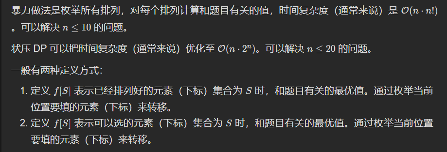
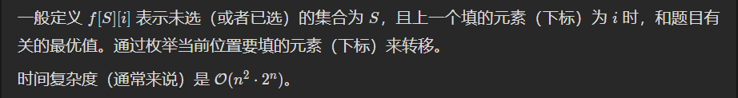

# 九、状态压缩 DP（状压 DP）

# §9.1 排列型 ① 相邻无关



# 全排列模板(下面四个题目全是这个板子)

> # 动态规划的模板很好写。
>
> ```java
> 		int m = left.size();
>         int mask = (1 << m);
>         int[] dp = new int[mask];
>         Arrays.fill(dp, Integer.MAX_VALUE / 2);
>         dp[0] = 0;
>         for (int s = 1; s < mask; s++) {
>             int c = Integer.bitCount(s);
>             for (int i = 0; i < m; i++) {
>                 int pre = (1 << i) ^ s;
>                 if (pre < s) {
>                     dp[s] = Math.min(dp[s], dp[pre] + cal(left.get(c - 1), right.get(i)));
>                 }
>             }
>         }
>         return dp[mask - 1];
> ```

526\. 优美的排列
-----------

假设有从 1 到 n 的 n 个整数。用这些整数构造一个数组 `perm`（**下标从 1 开始**），只要满足下述条件 **之一** ，该数组就是一个 **优美的排列** ：

*   `perm[i]` 能够被 `i` 整除
*   `i` 能够被 `perm[i]` 整除

给你一个整数 `n` ，返回可以构造的 **优美排列** 的 **数量** 。

**示例 1：**

**输入：**n = 2
**输出：**2
**解释：**
第 1 个优美的排列是 \[1,2\]：
    - perm\[1\] = 1 能被 i = 1 整除
    - perm\[2\] = 2 能被 i = 2 整除
第 2 个优美的排列是 \[2,1\]:
    - perm\[1\] = 2 能被 i = 1 整除
    - i = 2 能被 perm\[2\] = 1 整除

**示例 2：**

**输入：**n = 1
**输出：**1

**提示：**

*   `1 <= n <= 15`

[https://leetcode.cn/problems/beautiful-arrangement/description/](https://leetcode.cn/problems/beautiful-arrangement/description/)

```java
import java.util.Arrays;

class Solution { // 6ms
    int[][] memo;
    int n;
    public int countArrangement(int n) {
        this.n = n;
        int x = 0;
        memo = new int[n][(1 << n) + 1];
        for (int i = 0; i < n; i++) {
            Arrays.fill(memo[i], -1);
        }
        return dfs(0, x);
    }

    private int dfs(int i, int x) {
        if (i == n) {
            return x == (1 << n) - 1 ? 1 : 0;
        }
        if (memo[i][x] != -1) {
            return memo[i][x];
        }
        int res = 0;
        for (int j = 0; j < n; j++) {
            if (((x >> j) & 1) == 0 && ((j + 1) % (i + 1) == 0 || (i + 1) % (j + 1) == 0)) {
                res += dfs(i + 1, (1 << j) | x);
            }
        }
        return memo[i][x] = res;
    }
}
```

> 优化：i就是填充的数位个数，其实 i == Integer.bitCount(x)，所以我们可以压缩一个维度

```java
import java.util.Arrays;

class Solution { // 4ms
    int[] memo;
    int n;
    public int countArrangement(int n) {
        this.n = n;
        memo = new int[(1 << n) + 1];
        Arrays.fill(memo, -1);
        return dfs(0);
    }

    private int dfs(int x) {
        if (x == (1 << n) - 1) {
            return 1;
        }
        if (memo[x] != -1) {
            return memo[x];
        }
        int res = 0;
        int i = Integer.bitCount(x);
        for (int j = 0; j < n; j++) {
            if (((x >> j) & 1) == 0 && ((j + 1) % (i + 1) == 0 || (i + 1) % (j + 1) == 0)) {
                res += dfs((1 << j) | x);
            }
        }
        return memo[x] = res;
    }
}
```

```java
// 错误的写法
import java.util.Arrays;

class Solution {
    public int countArrangement(int n) {
        int mask = (1 << n);
        int[] dp = new int[mask];
        for (int s = 1; s < mask; s++) {
            int c = Integer.bitCount(s);
            for (int i = 0; i < n; i++) {
                int pre = s ^ (1 << i);
                if (pre < s && (c % (i + 1) == 0 || (i + 1) % c == 0)) {
                    dp[s] = Math.max(dp[s], dp[pre] + 1);
                }
            }
        }
        return dp[mask - 1];
    }
}
```

```java
class Solution { // 正解
    public int countArrangement(int n) {
        int mask = (1 << n);
        int[] dp = new int[mask];
        dp[0] = 1;
        for (int s = 1; s < mask; s++) {
            int c = Integer.bitCount(s);
            for (int i = 0; i < n; i++) {
                int pre = s ^ (1 << i);
                if (pre < s && (c % (i + 1) == 0 || (i + 1) % c == 0)) {
                    dp[s] += dp[pre];
                }
            }
        }
        return dp[mask - 1];
    }
}
```


1879\. 两个数组最小的异或值之和(状压模板题，模拟退火)
-------------------

给你两个整数数组 `nums1` 和 `nums2` ，它们长度都为 `n` 。

两个数组的 **异或值之和** 为 `(nums1[0] XOR nums2[0]) + (nums1[1] XOR nums2[1]) + ... + (nums1[n - 1] XOR nums2[n - 1])` （**下标从 0 开始**）。

*   比方说，`[1,2,3]` 和 `[3,2,1]` 的 **异或值之和** 等于 `(1 XOR 3) + (2 XOR 2) + (3 XOR 1) = 2 + 0 + 2 = 4` 。

请你将 `nums2` 中的元素重新排列，使得 **异或值之和** **最小** 。

请你返回重新排列之后的 **异或值之和** 。

**示例 1：**

**输入：**nums1 = \[1,2\], nums2 = \[2,3\]
**输出：**2
**解释：**将 `nums2` 重新排列得到 `[3,2] 。`
异或值之和为 (1 XOR 3) + (2 XOR 2) = 2 + 0 = 2 。

**示例 2：**

**输入：**nums1 = \[1,0,3\], nums2 = \[5,3,4\]
**输出：**8
**解释：**将 `nums2 重新排列得到` `[5,4,3] 。`
异或值之和为 (1 XOR 5) + (0 XOR 4) + (3 XOR 3) = 4 + 4 + 0 = 8 。

**提示：**

*   `n == nums1.length`
*   `n == nums2.length`
*   `1 <= n <= 14`
*   `0 <= nums1[i], nums2[i] <= 107`

[https://leetcode.cn/problems/minimum-xor-sum-of-two-arrays/description/](https://leetcode.cn/problems/minimum-xor-sum-of-two-arrays/description/)

```java
import java.util.Arrays;

class Solution {
    public int minimumXORSum(int[] nums1, int[] nums2) {
        // 状态压缩模板题
        int n = nums1.length;
        int[][] dp = new int[n + 1][(1 << n)];
        for (int i = 0; i <= n; i++) {
            Arrays.fill(dp[i], Integer.MAX_VALUE);
        }
        dp[0][0] = 0;
        for (int i = 1; i <= n; i++) {
            for (int s = 0; s < (1 << n); s++) {
                int c = Integer.bitCount(s);
                if (c != i) {
                    continue;
                }
                for (int j = 1; j <= n; j++) {
                    if (((s >> (j - 1)) & 1) == 0) {
                        continue;
                    }
                    dp[i][s] = Math.min(dp[i][s], dp[i - 1][s ^ (1 << (j - 1))] + (nums1[i - 1] ^ nums2[j - 1]));
                }
            }
        }
        return dp[n][(1 << n) - 1];
    }
}
```

> 二维压缩一维

```java
import java.util.Arrays;

class Solution {
    public int minimumXORSum(int[] nums1, int[] nums2) {
        int n = nums1.length;
        int mask = (1 << n);
        int[] dp = new int[mask];
        Arrays.fill(dp, Integer.MAX_VALUE / 2);
        // 表示没有元素异或，nums2里面没有元素
        dp[0] = 0;
        // 表示nums2的选择情况
        for (int s = 1; s < mask; s++) {
            // nums1的下标走到第c - 1位
            int c = Integer.bitCount(s);
            // 枚举nums2
            for (int i = 0; i < n; i++) {
                int pre = (1 << i) ^ s;
                if (pre < s) {
                    dp[s] = Math.min(dp[s], dp[pre] + (nums1[c - 1] ^ nums2[i]));
                }
            }
        }
        return dp[mask - 1];
    }
}
```

> 模拟退火
>
> 即「模拟退火」的单次迭代基本流程：
>
> - 随机选择两个下标，计算「交换下标元素前对应序列的得分」&「交换下标元素后对应序列的得分」
> - 如果温度下降（交换后的序列更优），进入下一次迭代
> - 如果温度上升（交换前的序列更优），以「一定的概率」恢复现场（再交换回来）
>
> 对于一个能够运用模拟退火求解的问题，最核心的是如何实现 calc 方法（即如何定义一个具体方案的得分），其余均为模板内容。

```java
class Solution {
    int N = 400;
    double hi = 1e5, lo = 1e-5, fa = 0.90;
    Random random = new Random(20230823);
    void swap(int[] n, int a, int b) {
        int c = n[a];
        n[a] = n[b];
        n[b] = c;
    }
    int calc() {
        int res = 0;
        for (int i = 0; i < n; i++) res += n1[i] ^ n2[i];
        ans = Math.min(ans, res);
        return res;
    }
    void shuffle(int[] nums) {
        for (int i = n; i > 0; i--) swap(nums, random.nextInt(i), i - 1);
    }
    void sa() {
        shuffle(n2);
        for (double t = hi; t > lo; t *= fa) {
            int a = random.nextInt(n), b = random.nextInt(n);
            int prev = calc();
            swap(n2, a, b);
            int cur = calc(); 
            int diff = cur - prev; 
            if (Math.log(diff / t) >= random.nextDouble()) swap(n2, a, b);
        }
    }
    int[] n1, n2;
    int n;
    int ans = Integer.MAX_VALUE;
    public int minimumXORSum(int[] nums1, int[] nums2) {
        n1 = nums1; n2 = nums2;
        n = n1.length;
        while (N-- > 0) sa();
        return ans;
    }
}
```


> 状压做全排列简直是降维打击

2850\. 将石头分散到网格图的最少移动次数
-----------------------

给你一个大小为 `3 * 3` ，下标从 **0** 开始的二维整数矩阵 `grid` ，分别表示每一个格子里石头的数目。网格图中总共恰好有 `9` 个石头，一个格子里可能会有 **多个** 石头。

每一次操作中，你可以将一个石头从它当前所在格子移动到一个至少有一条公共边的相邻格子。

请你返回每个格子恰好有一个石头的 **最少移动次数** 。

**示例 1：**	


**输入：**grid = \[\[1,1,0\],\[1,1,1\],\[1,2,1\]\]
**输出：**3
**解释：**让每个格子都有一个石头的一个操作序列为：
1 - 将一个石头从格子 (2,1) 移动到 (2,2) 。
2 - 将一个石头从格子 (2,2) 移动到 (1,2) 。
3 - 将一个石头从格子 (1,2) 移动到 (0,2) 。
总共需要 3 次操作让每个格子都有一个石头。
让每个格子都有一个石头的最少操作次数为 3 。

**示例 2：**


**输入：**grid = \[\[1,3,0\],\[1,0,0\],\[1,0,3\]\]
**输出：**4
**解释：**让每个格子都有一个石头的一个操作序列为：
1 - 将一个石头从格子 (0,1) 移动到 (0,2) 。
2 - 将一个石头从格子 (0,1) 移动到 (1,1) 。
3 - 将一个石头从格子 (2,2) 移动到 (1,2) 。
4 - 将一个石头从格子 (2,2) 移动到 (2,1) 。
总共需要 4 次操作让每个格子都有一个石头。
让每个格子都有一个石头的最少操作次数为 4 。

**提示：**

*   `grid.length == grid[i].length == 3`
*   `0 <= grid[i][j] <= 9`
*   `grid` 中元素之和为 `9` 。

[https://leetcode.cn/problems/minimum-moves-to-spread-stones-over-grid/description/?envType=daily-question&envId=2024-07-20](https://leetcode.cn/problems/minimum-moves-to-spread-stones-over-grid/description/?envType=daily-question&envId=2024-07-20)

```java
import java.util.ArrayList;
import java.util.Arrays;

class Solution {
    public int minimumMoves(int[][] grid) {
        int n = grid.length;
        ArrayList<int[]> left = new ArrayList<>();
        ArrayList<int[]> right = new ArrayList<>();
        for (int i = 0; i < n; i++) {
            for (int j = 0; j < n; j++) {
                if (grid[i][j] == 0) {
                    left.add(new int[]{i, j});
                }else{
                    for (int k = 1; k < grid[i][j]; k++) {
                        right.add(new int[]{i, j});
                    }
                }
            }
        }
        // 直接枚举left与right的全排列
        int m = left.size();
        int mask = (1 << m);
        int[] dp = new int[mask];
        Arrays.fill(dp, Integer.MAX_VALUE / 2);
        dp[0] = 0;
        for (int s = 1; s < mask; s++) {
            int c = Integer.bitCount(s);
            for (int i = 0; i < m; i++) {
                int pre = (1 << i) ^ s;
                if (pre < s) {
                    dp[s] = Math.min(dp[s], dp[pre] + cal(left.get(c - 1), right.get(i)));
                }
            }
        }
        return dp[mask - 1];
    }

    private int cal(int[] a, int[] b) {
        return Math.abs(a[0] - b[0]) + Math.abs(a[1] - b[1]);
    }
}
```

```java
import java.util.ArrayList;
import java.util.Arrays;
import java.util.Collections;
import java.util.List;

class Solution {
    public int minimumMoves(int[][] grid) { // 枚举匹配问题的全排列问题
        ArrayList<int[]> left = new ArrayList<>();
        ArrayList<int[]> right = new ArrayList<>();
        for (int i = 0; i < 3; i++) {
            for (int j = 0; j < 3; j++) {
                if (grid[i][j] == 0) {
                    left.add(new int[]{i, j});
                }else{
                    for (int k = 1; k < grid[i][j]; k++) {
                        right.add(new int[]{i, j});
                    }
                }
            }
        }
        int ans = Integer.MAX_VALUE;
        for (List<int[]> left1 : permutations(left)) { // 枚举left的全排列
            int total = 0;
            for (int i = 0; i < left1.size(); i++) {
                total += cal(left1.get(i), right.get(i));
            }
            ans = Math.min(ans, total);
        }
        return ans;
    }

    private List<List<int[]>> permutations(List<int[]> list) {
        ArrayList<List<int[]>> result = new ArrayList<>();
        dfs(list, 0, result);
        return result;
    }

    private void dfs(List<int[]> list, int start, List<List<int[]>> result) {
        if (start == list.size()) {
            result.add(new ArrayList<>(list));
            return;
        }
        for (int i = start; i < list.size(); i++) {
            Collections.swap(list, start, i);
            dfs(list, start + 1, result); // 注意这里不是dfs(list, i + 1, result);
            Collections.swap(list, start, i);
        }
    }

    private int cal(int[] a, int[] b) {
        return Math.abs(a[0] - b[0]) + Math.abs(a[1] - b[1]);
    }

}
```

1947\. 最大兼容性评分和
---------------

有一份由 `n` 个问题组成的调查问卷，每个问题的答案要么是 `0`（no，否），要么是 `1`（yes，是）。

这份调查问卷被分发给 `m` 名学生和 `m` 名导师，学生和导师的编号都是从 `0` 到 `m - 1` 。学生的答案用一个二维整数数组 `students` 表示，其中 `students[i]` 是一个整数数组，包含第 `i` 名学生对调查问卷给出的答案（**下标从 0 开始**）。导师的答案用一个二维整数数组 `mentors` 表示，其中 `mentors[j]` 是一个整数数组，包含第 `j` 名导师对调查问卷给出的答案（**下标从 0 开始**）。

每个学生都会被分配给 **一名** 导师，而每位导师也会分配到 **一名** 学生。配对的学生与导师之间的兼容性评分等于学生和导师答案相同的次数。

*   例如，学生答案为`[1, **_0_**, **_1_**]` 而导师答案为 `[0, **_0_**, **_1_**]` ，那么他们的兼容性评分为 2 ，因为只有第二个和第三个答案相同。

请你找出最优的学生与导师的配对方案，以 **最大程度上** 提高 **兼容性评分和** 。

给你 `students` 和 `mentors` ，返回可以得到的 **最大兼容性评分和** 。

**示例 1：**

**输入：**students = \[\[1,1,0\],\[1,0,1\],\[0,0,1\]\], mentors = \[\[1,0,0\],\[0,0,1\],\[1,1,0\]\]
**输出：**8
**解释：**按下述方式分配学生和导师：
- 学生 0 分配给导师 2 ，兼容性评分为 3 。
- 学生 1 分配给导师 0 ，兼容性评分为 2 。
- 学生 2 分配给导师 1 ，兼容性评分为 3 。
  最大兼容性评分和为 3 + 2 + 3 = 8 。

**示例 2：**

**输入：**students = \[\[0,0\],\[0,0\],\[0,0\]\], mentors = \[\[1,1\],\[1,1\],\[1,1\]\]
**输出：**0
**解释：**任意学生与导师配对的兼容性评分都是 0 。

**提示：**

*   `m == students.length == mentors.length`
*   `n == students[i].length == mentors[j].length`
*   `1 <= m, n <= 8`
*   `students[i][k]` 为 `0` 或 `1`
*   `mentors[j][k]` 为 `0` 或 `1`

[https://leetcode.cn/problems/maximum-compatibility-score-sum/description/](https://leetcode.cn/problems/maximum-compatibility-score-sum/description/)

```java
class Solution {
    public int maxCompatibilitySum(int[][] students, int[][] mentors) {
        int n = students.length;
        int mask = (1 << n);
        int[] dp = new int[mask];
        for (int s = 1; s < mask; s++) {
            int c = Integer.bitCount(s);
            for (int i = 0; i < n; i++) {
                int pre = s ^ (1 << i);
                if (pre < s) {
                    dp[s] = Math.max(dp[s], dp[pre] + cal(students[c - 1], mentors[i]));
                }
            }
        }
        return dp[mask - 1];
    }

    private int cal(int[] a, int[] b) {
        int res = 0;
        for (int i = 0; i < a.length; i++) {
            if (a[i] == b[i]) {
                res++;
            }
        }
        return res;
    }
}
```

1799\. N 次操作后的最大分数和
-------------------

给你 `nums` ，它是一个大小为 `2 * n` 的正整数数组。你必须对这个数组执行 `n` 次操作。

在第 `i` 次操作时（操作编号从 **1** 开始），你需要：

*   选择两个元素 `x` 和 `y` 。
*   获得分数 `i * gcd(x, y)` 。
*   将 `x` 和 `y` 从 `nums` 中删除。

请你返回 `n` 次操作后你能获得的分数和最大为多少。

函数 `gcd(x, y)` 是 `x` 和 `y` 的最大公约数。

**示例 1：**

**输入：**nums = \[1,2\]
**输出：**1
**解释：**最优操作是：
(1 \* gcd(1, 2)) = 1

**示例 2：**

**输入：**nums = \[3,4,6,8\]
**输出：**11
**解释：**最优操作是：
(1 \* gcd(3, 6)) + (2 \* gcd(4, 8)) = 3 + 8 = 11

**示例 3：**

**输入：**nums = \[1,2,3,4,5,6\]
**输出：**14
**解释：**最优操作是：
(1 \* gcd(1, 5)) + (2 \* gcd(2, 4)) + (3 \* gcd(3, 6)) = 1 + 4 + 9 = 14

**提示：**

*   `1 <= n <= 7`
*   `nums.length == 2 * n`
*   `1 <= nums[i] <= 106`

[https://leetcode.cn/problems/maximize-score-after-n-operations/description/](https://leetcode.cn/problems/maximize-score-after-n-operations/description/)

```java
class Solution { // 如果不预处理gcd, 166ms
    public int maxScore(int[] nums) {
        int n = nums.length;
        int mask = (1 << n);
        int[] dp = new int[mask];
        // 为了加快计算, 这里预处理出所有可能用到的gcd, gcd[i][j] = gcd(nums[i], nums[j]);
        int[][] gcd = new int[n][n];
        for(int i = 0;i < n;i++){
            for(int j = 0;j < n;j++){
                gcd[i][j] = gcd(nums[i], nums[j]);
            }
        }
        for (int s = 1; s < mask; s++) {
            int c = Integer.bitCount(s) / 2;
            for (int i = 0; i < n; i++) {
                if (((s >> i) & 1) == 0) {
                    continue;
                }
                for (int j = i + 1; j < n; j++) {
                    if (((s >> j) & 1) == 0) {
                        continue;
                    }
                    int pre = s ^ (1 << i) ^ (1 << j);
                    if (pre < s) {
                        dp[s] = Math.max(dp[s], dp[pre] + gcd[i][j] * c);
                    }
                }
            }
        }
        return dp[mask - 1];
    }

    private int gcd(int a, int b) {
        return b == 0 ? a : gcd(b, a % b);
    }
}
```

2172\. 数组的最大与和
--------------

给你一个长度为 `n` 的整数数组 `nums` 和一个整数 `numSlots` ，满足`2 * numSlots >= n` 。总共有 `numSlots` 个篮子，编号为 `1` 到 `numSlots` 。

你需要把所有 `n` 个整数分到这些篮子中，且每个篮子 **至多** 有 2 个整数。一种分配方案的 **与和** 定义为每个数与它所在篮子编号的 **按位与运算** 结果之和。

*   比方说，将数字 `[1, 3]` 放入篮子 **_`1`_** 中，`[4, 6]` 放入篮子 **_`2`_** 中，这个方案的与和为 `(1 AND **_1_**) + (3 AND **_1_**) + (4 AND _**2**_) + (6 AND _**2**_) = 1 + 1 + 0 + 2 = 4` 。

请你返回将 `nums` 中所有数放入 `numSlots` 个篮子中的最大与和。

**示例 1：**

**输入：**nums = \[1,2,3,4,5,6\], numSlots = 3
**输出：**9
**解释：**一个可行的方案是 \[1, 4\] 放入篮子 _**1**_ 中，\[2, 6\] 放入篮子 **_2_** 中，\[3, 5\] 放入篮子 **_3_** 中。
最大与和为 (1 AND **_1_**) + (4 AND **_1_**) + (2 AND **_2_**) + (6 AND **_2_**) + (3 AND **_3_**) + (5 AND _**3**_) = 1 + 0 + 2 + 2 + 3 + 1 = 9 。

**示例 2：**

**输入：**nums = \[1,3,10,4,7,1\], numSlots = 9
**输出：**24
**解释：**一个可行的方案是 \[1, 1\] 放入篮子 _**1**_ 中，\[3\] 放入篮子 _**3**_ 中，\[4\] 放入篮子 **_4_** 中，\[7\] 放入篮子 **_7_** 中，\[10\] 放入篮子 **_9_** 中。
最大与和为 (1 AND **_1_**) + (1 AND **_1_**) + (3 AND **_3_**) + (4 AND **_4_**) + (7 AND **_7_**) + (10 AND **_9_**) = 1 + 1 + 3 + 4 + 7 + 8 = 24 。
注意，篮子 2 ，5 ，6 和 8 是空的，这是允许的。

**提示：**

*   `n == nums.length`
*   `1 <= numSlots <= 9`
*   `1 <= n <= 2 * numSlots`
*   `1 <= nums[i] <= 15`

[https://leetcode.cn/problems/maximum-and-sum-of-array/description/](https://leetcode.cn/problems/maximum-and-sum-of-array/description/)

```java
class Solution {
    public int maximumANDSum(int[] nums, int m) {
        int n = nums.length;
        int mask = (1 << (m * 2));
        int[] dp = new int[mask];
        int ans = 0;
        for (int s = 1; s < mask; s++) {
            int c = Integer.bitCount(s);
            if (c > n) {
                continue;
            }
            for (int i = 0; i < m * 2; i++) {
                int pre = s ^ (1 << i);
                if (pre < s) {
                    dp[s] = Math.max(dp[s], dp[pre] + (((i % m) + 1) & nums[c - 1]));
                }
            }
            ans = Math.max(ans, dp[s]);
        }
        return ans;
    }
}
```

# §9.2 排列型 ② 相邻相关



2741\. 特别的排列
------------

给你一个下标从 **0** 开始的整数数组 `nums` ，它包含 `n` 个 **互不相同** 的正整数。如果 `nums` 的一个排列满足以下条件，我们称它是一个特别的排列：

*   对于 `0 <= i < n - 1` 的下标 `i` ，要么 `nums[i] % nums[i+1] == 0` ，要么 `nums[i+1] % nums[i] == 0` 。

请你返回特别排列的总数目，由于答案可能很大，请将它对 `109 + 7` **取余** 后返回。

**示例 1：**

**输入：**nums = \[2,3,6\]
**输出：**2
**解释：**\[3,6,2\] 和 \[2,6,3\] 是 nums 两个特别的排列。

**示例 2：**

**输入：**nums = \[1,4,3\]
**输出：**2
**解释：**\[3,1,4\] 和 \[4,1,3\] 是 nums 两个特别的排列。

**提示：**

*   `2 <= nums.length <= 14`
*   `1 <= nums[i] <= 109`

[https://leetcode.cn/problems/special-permutations/description/](https://leetcode.cn/problems/special-permutations/description/)

```java
import java.util.ArrayList;

class Solution { // 经典回溯写法，超时
    int n, ans;
    int[] nums;
    boolean[] visited;
    ArrayList<Integer> tmp = new ArrayList<>();
    private static final int Mod = (int) 1e9 + 7;
    public int specialPerm(int[] nums) {
        n = nums.length;
        this.nums = nums;
        visited = new boolean[n];
        dfs(0);
        return ans;
    }

    private void dfs(int index) {
        if (index == n) {
            ans++;
            ans %= Mod;
            return;
        }
        for (int i = 0; i < n; i++) {
            if (!visited[i] && (index == 0 || nums[i] % tmp.get(index - 1) == 0 || tmp.get(index - 1) % nums[i] == 0)) {
                visited[i] = true;
                tmp.add(nums[i]);
                dfs(index + 1);
                visited[i] = false;
                tmp.remove(index);
            }
        }
    }
}
```

```java
import java.util.Arrays;

class Solution { // 状态压缩成三维dp 344ms
    private static long Mod = (long) 1e9 + 7;
    long[][][] memo;
    public int specialPerm(int[] nums) {
        int n = nums.length;
        memo = new long[n][n][1 << n];
        for (int i = 0; i < n; i++) {
            for (int j = 0; j < n; j++) {
                Arrays.fill(memo[i][j], -1);
            }
        }
        int ans = 0;
        for (int i = 0; i < n; i++) {
            ans += dfs(1, i, (1 << i), nums);
            ans %= Mod;
        }
        return ans;
    }

    private long dfs(int i,int pre,int set,int[] nums) {
        if (i == nums.length) {
            return 1;
        }
        if (memo[i][pre][set] != -1) {
            return memo[i][pre][set];
        }
        long res = 0L;
        for (int j = 0; j < nums.length; j++) {
            if ((set >> j & 1) == 1) {
                continue;
            }
            if (nums[j] % nums[pre] == 0 || nums[pre] % nums[j] == 0) {
                res += dfs(i + 1, j, (1 << j) | set, nums);
                res %= Mod;
            }
        }
        return memo[i][pre][set] = res;
    }

}
```

```java
import java.util.Arrays;

class Solution { // 152ms 压缩成二维
    private static long Mod = (long) 1e9 + 7;
    long[][] memo;
    public int specialPerm(int[] nums) {
        int n = nums.length;
        memo = new long[n][1 << n];
        for (int i = 0; i < n; i++) {
            Arrays.fill(memo[i], -1);
        }
        int ans = 0;
        for (int i = 0; i < n; i++) {
            ans += dfs(i, (1 << i), nums);
            ans %= Mod;
        }
        return ans;
    }

    private long dfs(int pre,int set,int[] nums) {
        if (set == (1 << nums.length) - 1) {
            return 1;
        }
        if (memo[pre][set] != -1) {
            return memo[pre][set];
        }
        long res = 0L;
        for (int j = 0; j < nums.length; j++) {
            if ((set >> j & 1) == 1) {
                continue;
            }
            if (nums[j] % nums[pre] == 0 || nums[pre] % nums[j] == 0) {
                res += dfs(j, (1 << j) | set, nums);
                res %= Mod;
            }
        }
        return memo[pre][set] = res;
    }

}
```

```java
import java.util.Arrays;

class Solution {
    private static final int Mod = (int) 1e9 + 7;
    public int specialPerm(int[] nums) {
        int n = nums.length;
        int mask = (1 << n);
        long[][] dp = new long[mask][n];
        // Arrays.fill(dp[0], 1); 错误的根源，初始化不对
        for (int s = 1; s < mask; ++s) {
            for (int i = 0; i < n; ++i) {
                int pre = s ^ (1 << i);
                if (pre == 0) { // 这里初始化
                    dp[s][i] = 1;
                    continue;
                }
                if (pre < s) {
                    for (int j = 0; j < n; ++j) {
                        if (nums[i] % nums[j] == 0 || nums[j] % nums[i] == 0) {
                            dp[s][i] = (dp[s][i] + dp[pre][j]) % Mod;
                        }
                    }
                }
            }
        }
        return (int) (Arrays.stream(dp[mask - 1]).sum() % Mod);
    }
}

```

1681\. 最小不兼容性
-------------

给你一个整数数组 `nums`​​​ 和一个整数 `k` 。你需要将这个数组划分到 `k` 个相同大小的子集中，使得同一个子集里面没有两个相同的元素。

一个子集的 **不兼容性** 是该子集里面最大值和最小值的差。

请你返回将数组分成 `k` 个子集后，各子集 **不兼容性** 的 **和** 的 **最小值** ，如果无法分成分成 `k` 个子集，返回 `-1` 。

子集的定义是数组中一些数字的集合，对数字顺序没有要求。

**示例 1：**

**输入：**nums = \[1,2,1,4\], k = 2
**输出：**4
**解释：**最优的分配是 \[1,2\] 和 \[1,4\] 。
不兼容性和为 (2-1) + (4-1) = 4 。
注意到 \[1,1\] 和 \[2,4\] 可以得到更小的和，但是第一个集合有 2 个相同的元素，所以不可行。

**示例 2：**

**输入：**nums = \[6,3,8,1,3,1,2,2\], k = 4
**输出：**6
**解释：**最优的子集分配为 \[1,2\]，\[2,3\]，\[6,8\] 和 \[1,3\] 。
不兼容性和为 (2-1) + (3-2) + (8-6) + (3-1) = 6 。

**示例 3：**

**输入：**nums = \[5,3,3,6,3,3\], k = 3
**输出：**\-1
**解释：**没办法将这些数字分配到 3 个子集且满足每个子集里没有相同数字。

**提示：**

*   `1 <= k <= nums.length <= 16`
*   `nums.length` 能被 `k` 整除。
*   `1 <= nums[i] <= nums.length`

[https://leetcode.cn/problems/minimum-incompatibility/description/](https://leetcode.cn/problems/minimum-incompatibility/description/)

```java
import java.lang.reflect.Array;
import java.util.Arrays;

class Solution { // 回溯 + 贪心
    int result = Integer.MAX_VALUE;
    int[] nums;
    int k;
    public int minimumIncompatibility(int[] nums, int k) {
        Arrays.sort(nums);
        this.nums = nums;
        this.k = k;
        Pair[] pairs = new Pair[k];
        Arrays.setAll(pairs, e -> new Pair());
        dfs(0, 0, pairs);
        return result == Integer.MAX_VALUE ? -1 : result;
    }

    private void dfs(int index, int sum, Pair[] pairs) {
        if (index == nums.length) {
            result = sum;
            return;
        }
        int curSize = nums.length / k; // 初始化当前为最大的容量，后面变化
        for (Pair pair : pairs) {
            // 剪枝 curSize == pair.size作用是保证前面的桶被装满 同时保证桶满了跳过
            if (pair.size == curSize || pair.mx == nums[index]) { // 如果当前pair添加的数字等于之前添加的数字，就直接跳过？贪心？好难理解啊，太难想到了吧，但是不加这个就会超时，还是学状态压缩吧
                continue;
            }
            curSize = pair.size;
            int delta = pair.size == 0 ? 0 : nums[index] - pair.mx;
            if (sum + delta >= result) {
                return;
            }
            int prevMax = pair.mx;
            pair.mx = nums[index];
            pair.size++;
            dfs(index + 1, sum + delta, pairs);
            pair.mx = prevMax;
            pair.size--;
        }
    }

    static class Pair {
        int size = 0;
        int mx = 0;
        Pair(){}
    }
}
```

