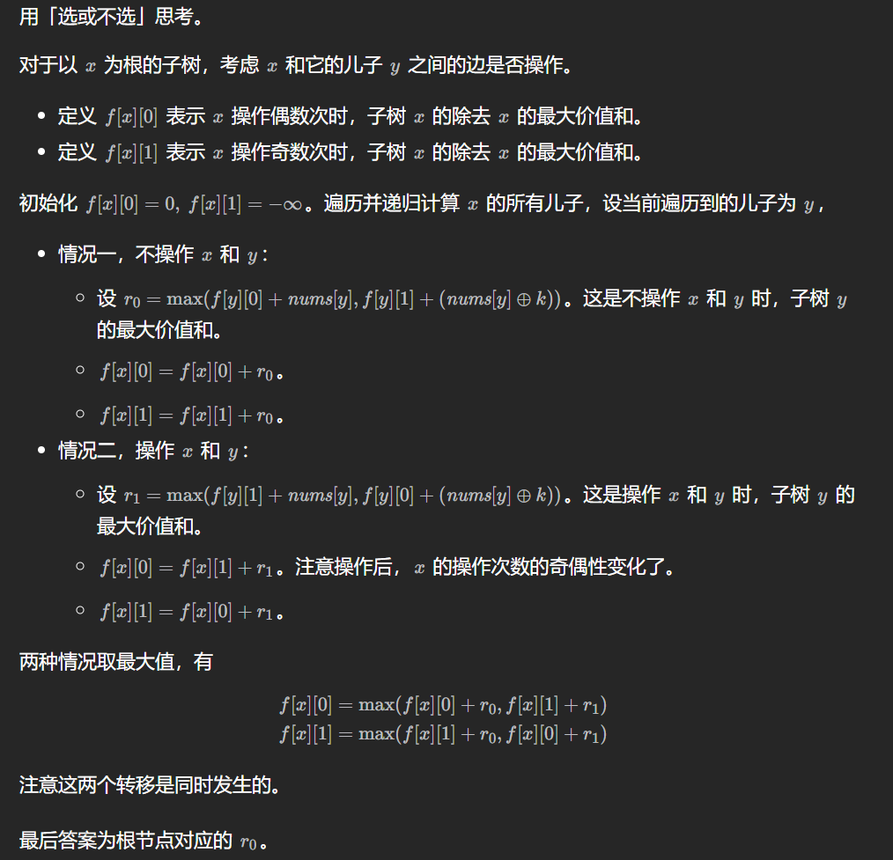

121\. 买卖股票的最佳时机
---------------

给定一个数组 `prices` ，它的第 `i` 个元素 `prices[i]` 表示一支给定股票第 `i` 天的价格。

你只能选择 **某一天** 买入这只股票，并选择在 **未来的某一个不同的日子** 卖出该股票。设计一个算法来计算你所能获取的最大利润。

返回你可以从这笔交易中获取的最大利润。如果你不能获取任何利润，返回 `0` 。

**示例 1：**

**输入：**\[7,1,5,3,6,4\]
**输出：**5
**解释：**在第 2 天（股票价格 = 1）的时候买入，在第 5 天（股票价格 = 6）的时候卖出，最大利润 = 6-1 = 5 。
注意利润不能是 7-1 = 6, 因为卖出价格需要大于买入价格；同时，你不能在买入前卖出股票。

**示例 2：**

**输入：**prices = \[7,6,4,3,1\]
**输出：**0
**解释：**在这种情况下, 没有交易完成, 所以最大利润为 0。

**提示：**

*   `1 <= prices.length <= 105`
*   `0 <= prices[i] <= 104`

[https://leetcode.cn/problems/best-time-to-buy-and-sell-stock/description/](https://leetcode.cn/problems/best-time-to-buy-and-sell-stock/description/)

```java
class Solution {
    // 五、状态机 DP
    //一般定义 f[i][j] 表示前缀 a[:i] 在状态 j 下的最优值。一般 j 都很小。代表题目是「买卖股票」系列。
    public int maxProfit(int[] prices) {
        int minPrice = Integer.MAX_VALUE;
        int ans = 0;
        for (int price : prices) {
            minPrice = Math.min(minPrice, price); // 维护状态，买入股票最小值
            ans = Math.max(ans, price - minPrice);
        }
        return ans;
    }
}   
```

122\. 买卖股票的最佳时机 II
------------------

给你一个整数数组 `prices` ，其中 `prices[i]` 表示某支股票第 `i` 天的价格。

在每一天，你可以决定是否购买和/或出售股票。你在任何时候 **最多** 只能持有 **一股** 股票。你也可以先购买，然后在 **同一天** 出售。

返回 _你能获得的 **最大** 利润_ 。

**示例 1：**

**输入：**prices = \[7,1,5,3,6,4\]
**输出：**7
**解释：**在第 2 天（股票价格 = 1）的时候买入，在第 3 天（股票价格 = 5）的时候卖出, 这笔交易所能获得利润 = 5 - 1 = 4 。
     随后，在第 4 天（股票价格 = 3）的时候买入，在第 5 天（股票价格 = 6）的时候卖出, 这笔交易所能获得利润 = 6 - 3 = 3 。
     总利润为 4 + 3 = 7 。

**示例 2：**

**输入：**prices = \[1,2,3,4,5\]
**输出：**4
**解释：**在第 1 天（股票价格 = 1）的时候买入，在第 5 天 （股票价格 = 5）的时候卖出, 这笔交易所能获得利润 = 5 - 1 = 4 。
     总利润为 4 。

**示例 3：**

**输入：**prices = \[7,6,4,3,1\]
**输出：**0
**解释：**在这种情况下, 交易无法获得正利润，所以不参与交易可以获得最大利润，最大利润为 0 。

**提示：**

*   `1 <= prices.length <= 3 * 104`
*   `0 <= prices[i] <= 104`

[https://leetcode.cn/problems/best-time-to-buy-and-sell-stock-ii/description/](https://leetcode.cn/problems/best-time-to-buy-and-sell-stock-ii/description/)

```java
import java.util.Arrays;

class Solution {
    // 五、状态机 DP
    //一般定义 f[i][j] 表示前缀 a[:i] 在状态 j 下的最优值。一般 j 都很小。代表题目是「买卖股票」系列。
    private int[][] memo;
    private int[] prices;
    private int n;
    public int maxProfit(int[] prices) {
        this.prices = prices;
        n = prices.length;
        memo = new int[n][2];
        for (int i = 0; i < n; i++) {
            Arrays.fill(memo[i], -1); // 表示没有计算
        }
        return dfs(0, 0); // 表示从第0天开始，没有持有股票
    }

    private int dfs(int i, int hold) { // 第i天，hold==1?持有：不持有
        if (i == n) {
            return hold == 1 ? Integer.MIN_VALUE / 2 : 0;
        }
        if (memo[i][hold] != -1) {
            return memo[i][hold];
        }
        if (hold == 1) { // 需要卖股票
            return memo[i][hold] = Math.max(dfs(i + 1, 0) + prices[i], dfs(i + 1, 1));
        }
        return memo[i][hold] = Math.max(dfs(i + 1, 0), dfs(i + 1, 1) - prices[i]);
    }
}
```

```java
class Solution {
    // 五、状态机 DP
    //一般定义 f[i][j] 表示前缀 a[:i] 在状态 j 下的最优值。一般 j 都很小。代表题目是「买卖股票」系列。
    public int maxProfit(int[] prices) {
        int n = prices.length;
        int[][] dp = new int[n + 1][2];
        dp[0][1] = Integer.MIN_VALUE / 2; // 关键
        for (int i = 0; i < n; i++) {
            dp[i + 1][0] = Math.max(dp[i][0], dp[i][1] + prices[i]);
            dp[i + 1][1] = Math.max(dp[i][0] - prices[i], dp[i][1]);
        }
        return dp[n][0]; // 最后不能持有
    }
}
```

```java
class Solution { // 想要一步写出这个还是不太可能，dfs的还是很不错的
    public int maxProfit(int[] prices) {
        int f0 = 0, f1 = Integer.MIN_VALUE;
        for (int p : prices) {
            int newF0 = Math.max(f0, f1 + p);
            f1 = Math.max(f1, f0 - p);
            f0 = newF0;
        }
        return f0;
    }
}
```

123\. 买卖股票的最佳时机 III
-------------------

给定一个数组，它的第 `i` 个元素是一支给定的股票在第 `i` 天的价格。

设计一个算法来计算你所能获取的最大利润。你最多可以完成 **两笔** 交易。

**注意：**你不能同时参与多笔交易（你必须在再次购买前出售掉之前的股票）。

**示例 1:**

**输入：**prices = \[3,3,5,0,0,3,1,4\]
**输出：**6
**解释：**在第 4 天（股票价格 = 0）的时候买入，在第 6 天（股票价格 = 3）的时候卖出，这笔交易所能获得利润 = 3-0 = 3 。
     随后，在第 7 天（股票价格 = 1）的时候买入，在第 8 天 （股票价格 = 4）的时候卖出，这笔交易所能获得利润 = 4-1 = 3 。

**示例 2：**

**输入：**prices = \[1,2,3,4,5\]
**输出：**4
**解释：**在第 1 天（股票价格 = 1）的时候买入，在第 5 天 （股票价格 = 5）的时候卖出, 这笔交易所能获得利润 = 5-1 = 4 。   
     注意你不能在第 1 天和第 2 天接连购买股票，之后再将它们卖出。   
     因为这样属于同时参与了多笔交易，你必须在再次购买前出售掉之前的股票。

**示例 3：**

**输入：**prices = \[7,6,4,3,1\] 
**输出：**0 
**解释：**在这个情况下, 没有交易完成, 所以最大利润为 0。

**示例 4：**

**输入：**prices = \[1\]
**输出：**0

**提示：**

*   `1 <= prices.length <= 105`
*   `0 <= prices[i] <= 105`

[https://leetcode.cn/problems/best-time-to-buy-and-sell-stock-iii/description/](https://leetcode.cn/problems/best-time-to-buy-and-sell-stock-iii/description/)

```java
import java.util.Arrays;

class Solution {
    // 五、状态机 DP
    //一般定义 f[i][j] 表示前缀 a[:i] 在状态 j 下的最优值。一般 j 都很小。代表题目是「买卖股票」系列。
    private int[][][] memo;
    private int[] prices;
    private int n;
    public int maxProfit(int[] prices) {
        this.prices = prices;
        n = prices.length;
        memo = new int[n][2][3];
        for (int i = 0; i < n; i++) {
            for (int j = 0; j < 2; j++) {
                Arrays.fill(memo[i][j], -1);
            }
        }
        return dfs(0, 0, 0); // 表示从第0天开始，没有持有股票
    }

    private int dfs(int i, int hold,int sellCnt) { // 第i天，hold==1?持有：不持有 ，sellCnt卖出次数
        if (i == n || sellCnt == 2) {
            return hold == 1 ? Integer.MIN_VALUE / 2 : 0;
        }
        if (memo[i][hold][sellCnt] != -1) {
            return memo[i][hold][sellCnt];
        }
        if (hold == 1) { // 需要卖股票
            return memo[i][hold][sellCnt] = Math.max(dfs(i + 1, 0, sellCnt + 1) + prices[i], dfs(i + 1, 1, sellCnt));
        }
        return memo[i][hold][sellCnt] = Math.max(dfs(i + 1, 0, sellCnt), dfs(i + 1, 1, sellCnt) - prices[i]);
    }
}
```

```java
class Solution {
    public int maxProfit(int[] prices) {
        int n = prices.length;
        int[][][] dp = new int[n + 1][2][3];
        for (int i = 0; i < 3; i++) {
            dp[0][1][i] = Integer.MIN_VALUE / 2;
        }
        for (int i = 0; i < n; i++) {
            for (int j = 1; j < 3; j++) { // j表示还可以买入的次数 1/2
                dp[i + 1][0][j] = Math.max(dp[i][0][j], dp[i][1][j] + prices[i]);
                dp[i + 1][1][j] = Math.max(dp[i][1][j], dp[i][0][j - 1] - prices[i]);
            }
        }
        int ans = 0;
        for (int i = 0; i < 3; i++) {
            ans = Math.max(dp[n][0][i], ans);
        }
        return ans;
    }
}
```

```java
class Solution {
    // 空间复杂度优化版本
    int maxProfit(int[] prices) { // 这种版本不做要求，务必掌握方法一二
        // base case
        int dp_i10 = 0, dp_i11 = Integer.MIN_VALUE;
        int dp_i20 = 0, dp_i21 = Integer.MIN_VALUE;
        for (int price : prices) {
            dp_i20 = Math.max(dp_i20, dp_i21 + price);
            dp_i21 = Math.max(dp_i21, dp_i10 - price);
            dp_i10 = Math.max(dp_i10, dp_i11 + price);
            dp_i11 = Math.max(dp_i11, -price);
        }
        return dp_i20;
    }
}
```

188\. 买卖股票的最佳时机 IV
------------------

给你一个整数数组 `prices` 和一个整数 `k` ，其中 `prices[i]` 是某支给定的股票在第 `i` 天的价格。

设计一个算法来计算你所能获取的最大利润。你最多可以完成 `k` 笔交易。也就是说，你最多可以买 `k` 次，卖 `k` 次。

**注意：**你不能同时参与多笔交易（你必须在再次购买前出售掉之前的股票）。

**示例 1：**

**输入：**k = 2, prices = \[2,4,1\]
**输出：**2
**解释：**在第 1 天 (股票价格 = 2) 的时候买入，在第 2 天 (股票价格 = 4) 的时候卖出，这笔交易所能获得利润 = 4-2 = 2 。

**示例 2：**

**输入：**k = 2, prices = \[3,2,6,5,0,3\]
**输出：**7
**解释：**在第 2 天 (股票价格 = 2) 的时候买入，在第 3 天 (股票价格 = 6) 的时候卖出, 这笔交易所能获得利润 = 6-2 = 4 。
     随后，在第 5 天 (股票价格 = 0) 的时候买入，在第 6 天 (股票价格 = 3) 的时候卖出, 这笔交易所能获得利润 = 3-0 = 3 。

**提示：**

*   `1 <= k <= 100`
*   `1 <= prices.length <= 1000`
*   `0 <= prices[i] <= 1000`

[https://leetcode.cn/problems/best-time-to-buy-and-sell-stock-iv/description/](https://leetcode.cn/problems/best-time-to-buy-and-sell-stock-iv/description/)

```java
import java.util.Arrays;

class Solution {
    // 五、状态机 DP
    //一般定义 f[i][j] 表示前缀 a[:i] 在状态 j 下的最优值。一般 j 都很小。代表题目是「买卖股票」系列。
    private int[][][] memo;
    private int[] prices;
    private int n, k;
    public int maxProfit(int k, int[] prices) {
        this.prices = prices;
        this.k = k;
        n = prices.length;
        memo = new int[n][2][k + 1];
        for (int i = 0; i < n; i++) {
            for (int j = 0; j < 2; j++) {
                Arrays.fill(memo[i][j], -1);
            }
        }
        return dfs(0, 0, 0); // 表示从第0天开始，没有持有股票
    }

    private int dfs(int i, int hold,int sellCnt) { // 第i天，hold==1?持有：不持有 ，sellCnt卖出次数
        if (i == n || sellCnt == k) {
            return hold == 1 ? Integer.MIN_VALUE / 2 : 0;
        }
        if (memo[i][hold][sellCnt] != -1) {
            return memo[i][hold][sellCnt];
        }
        if (hold == 1) { // 需要卖股票
            return memo[i][hold][sellCnt] = Math.max(dfs(i + 1, 0, sellCnt + 1) + prices[i], dfs(i + 1, 1, sellCnt));
        }
        return memo[i][hold][sellCnt] = Math.max(dfs(i + 1, 0, sellCnt), dfs(i + 1, 1, sellCnt) - prices[i]);
    }
}
```

```java
class Solution {
    public int maxProfit(int k, int[] prices) {
        int n = prices.length;
        int[][][] dp = new int[n + 1][2][k + 1];
        for (int i = 0; i < k + 1; i++) {
            dp[0][1][i] = Integer.MIN_VALUE / 2;
        }
        for (int i = 0; i < n; i++) {
            for (int j = 1; j < k + 1; j++) { // j表示还可以买入的次数
                dp[i + 1][0][j] = Math.max(dp[i][0][j], dp[i][1][j] + prices[i]);
                dp[i + 1][1][j] = Math.max(dp[i][1][j], dp[i][0][j - 1] - prices[i]);
            }
        }
        int ans = 0;
        for (int i = 0; i < k + 1; i++) {
            ans = Math.max(dp[n][0][i], ans);
        }
        return ans;
    }
}
```

309\. 买卖股票的最佳时机含冷冻期
-------------------

给定一个整数数组`prices`，其中第  `prices[i]` 表示第 `_i_` 天的股票价格 。​

设计一个算法计算出最大利润。在满足以下约束条件下，你可以尽可能地完成更多的交易（多次买卖一支股票）:

*   卖出股票后，你无法在第二天买入股票 (即冷冻期为 1 天)。

**注意：**你不能同时参与多笔交易（你必须在再次购买前出售掉之前的股票）。

**示例 1:**

**输入:** prices = \[1,2,3,0,2\]
**输出:** 3 
**解释:** 对应的交易状态为: \[买入, 卖出, 冷冻期, 买入, 卖出\]

**示例 2:**

**输入:** prices = \[1\]
**输出:** 0

**提示：**

*   `1 <= prices.length <= 5000`
*   `0 <= prices[i] <= 1000`

[https://leetcode.cn/problems/best-time-to-buy-and-sell-stock-with-cooldown/description/](https://leetcode.cn/problems/best-time-to-buy-and-sell-stock-with-cooldown/description/)

```java
import java.util.Arrays;

class Solution {
    // 五、状态机 DP
    //一般定义 f[i][j] 表示前缀 a[:i] 在状态 j 下的最优值。一般 j 都很小。代表题目是「买卖股票」系列。
    private int[][][] memo;
    private int[] prices;
    private int n;
    public int maxProfit(int[] prices) {
        this.prices = prices;
        n = prices.length;
        memo = new int[n][2][2];
        for (int i = 0; i < n; i++) {
            for (int j = 0; j < 2; j++) {
                Arrays.fill(memo[i][j], -1); // 表示没有计算
            }
        }
        return dfs(0, 0, 0); // 表示从第0天开始，没有持有股票
    }

    private int dfs(int i, int hold,int isFreeze) { // 第i天，hold==1?持有：不持有
        if (i == n) {
            return hold == 1 ? Integer.MIN_VALUE / 2 : 0;
        }
        if (memo[i][hold][isFreeze] != -1) {
            return memo[i][hold][isFreeze];
        }
        if (hold == 1) { // 需要卖股票
            return memo[i][hold][isFreeze] = Math.max(dfs(i + 1, 0, 1) + prices[i], dfs(i + 1, 1, 0));
        }
        // hold==0
        int res = dfs(i + 1, 0, 0); // 不买
        if (isFreeze == 0) {
            // 买
            res = Math.max(res, dfs(i + 1, 1, 0) - prices[i]);
        }
        return memo[i][hold][isFreeze] = res;
    }
}
```

714\. 买卖股票的最佳时机含手续费
-------------------

给定一个整数数组 `prices`，其中 `prices[i]`表示第 `i` 天的股票价格 ；整数 `fee` 代表了交易股票的手续费用。

你可以无限次地完成交易，但是你每笔交易都需要付手续费。如果你已经购买了一个股票，在卖出它之前你就不能再继续购买股票了。

返回获得利润的最大值。

**注意：**这里的一笔交易指买入持有并卖出股票的整个过程，每笔交易你只需要为支付一次手续费。

**示例 1：**

**输入：**prices = \[1, 3, 2, 8, 4, 9\], fee = 2
**输出：**8
**解释：**能够达到的最大利润:  
在此处买入 prices\[0\] = 1
在此处卖出 prices\[3\] = 8
在此处买入 prices\[4\] = 4
在此处卖出 prices\[5\] = 9
总利润: ((8 - 1) - 2) + ((9 - 4) - 2) = 8

**示例 2：**

**输入：**prices = \[1,3,7,5,10,3\], fee = 3
**输出：**6

**提示：**

*   `1 <= prices.length <= 5 * 104`
*   `1 <= prices[i] < 5 * 104`
*   `0 <= fee < 5 * 104`

[https://leetcode.cn/problems/best-time-to-buy-and-sell-stock-with-transaction-fee/description/](https://leetcode.cn/problems/best-time-to-buy-and-sell-stock-with-transaction-fee/description/)

```java
import java.util.Arrays;

class Solution {
    // 五、状态机 DP
    //一般定义 f[i][j] 表示前缀 a[:i] 在状态 j 下的最优值。一般 j 都很小。代表题目是「买卖股票」系列。
    private int[][] memo;
    private int[] prices;
    private int n,fee;
    public int maxProfit(int[] prices,int fee) {
        this.prices = prices;
        this.fee = fee;
        n = prices.length;
        memo = new int[n][2];
        for (int i = 0; i < n; i++) {
            Arrays.fill(memo[i], -1); // 表示没有计算
        }
        return dfs(0, 0); // 表示从第0天开始，没有持有股票
    }

    private int dfs(int i, int hold) { // 第i天，hold==1?持有：不持有
        if (i == n) {
            return hold == 1 ? Integer.MIN_VALUE / 2 : 0;
        }
        if (memo[i][hold] != -1) {
            return memo[i][hold];
        }
        if (hold == 1) { // 需要卖股票
            return memo[i][hold] = Math.max(dfs(i + 1, 0) + prices[i] - fee, dfs(i + 1, 1));
        }
        return memo[i][hold] = Math.max(dfs(i + 1, 0), dfs(i + 1, 1) - prices[i]);
    }
}
```

```java
class Solution {
    // 五、状态机 DP
    //一般定义 f[i][j] 表示前缀 a[:i] 在状态 j 下的最优值。一般 j 都很小。代表题目是「买卖股票」系列。
    public int maxProfit(int[] prices, int fee) {
        int n = prices.length;
        int[][] dp = new int[n + 1][2];
        dp[0][1] = Integer.MIN_VALUE / 2; // 关键
        for (int i = 0; i < n; i++) {
            dp[i + 1][0] = Math.max(dp[i][0], dp[i][1] + prices[i] - fee);
            dp[i + 1][1] = Math.max(dp[i][0] - prices[i], dp[i][1]);
        }
        return dp[n][0]; // 最后不能持有
    }
}
```

1493\. 删掉一个元素以后全为 1 的最长子数组
--------------------------

给你一个二进制数组 `nums` ，你需要从中删掉一个元素。

请你在删掉元素的结果数组中，返回最长的且只包含 1 的非空子数组的长度。

如果不存在这样的子数组，请返回 0 。

**提示 1：**

**输入：**nums = \[1,1,0,1\]
**输出：**3
**解释：**删掉位置 2 的数后，\[1,1,1\] 包含 3 个 1 。

**示例 2：**

**输入：**nums = \[0,1,1,1,0,1,1,0,1\]
**输出：**5
**解释：**删掉位置 4 的数字后，\[0,1,1,1,1,1,0,1\] 的最长全 1 子数组为 \[1,1,1,1,1\] 。

**示例 3：**

**输入：**nums = \[1,1,1\]
**输出：**2
**解释：**你必须要删除一个元素。

**提示：**

*   `1 <= nums.length <= 105`
*   `nums[i]` 要么是 `0` 要么是 `1` 。

[https://leetcode.cn/problems/longest-subarray-of-1s-after-deleting-one-element/description/](https://leetcode.cn/problems/longest-subarray-of-1s-after-deleting-one-element/description/)

```java
class Solution {
    public int longestSubarray(int[] nums) {
        int ans = 0;
        int a = 0, b = 0;
        for (int num : nums) {
            if (num == 1) {
                a++;
                b++;
            }else{
                b = a;
                a = 0;
            }
            ans = Math.max(b, ans);
        }
        // 特判全为1
        if (a == nums.length) {
            return a - 1;
        }
        return ans;
    }
}
```

1395\. 统计作战单位数(树状数组优化)
--------------

 `n` 名士兵站成一排。每个士兵都有一个 **独一无二** 的评分 `rating` 。

每 **3** 个士兵可以组成一个作战单位，分组规则如下：

*   从队伍中选出下标分别为 `i`、`j`、`k` 的 3 名士兵，他们的评分分别为 `rating[i]`、`rating[j]`、`rating[k]`
*   作战单位需满足： `rating[i] < rating[j] < rating[k]` 或者 `rating[i] > rating[j] > rating[k]` ，其中  `0 <= i < j < k < n`

请你返回按上述条件可以组建的作战单位数量。每个士兵都可以是多个作战单位的一部分。

**示例 1：**

**输入：**rating = \[2,5,3,4,1\]
**输出：**3
**解释：**我们可以组建三个作战单位 (2,3,4)、(5,4,1)、(5,3,1) 。

**示例 2：**

**输入：**rating = \[2,1,3\]
**输出：**0
**解释：**根据题目条件，我们无法组建作战单位。

**示例 3：**

**输入：**rating = \[1,2,3,4\]
**输出：**4

**提示：**

*   `n == rating.length`
*   `3 <= n <= 1000`
*   `1 <= rating[i] <= 10^5`
*   `rating` 中的元素都是唯一的

[https://leetcode.cn/problems/count-number-of-teams/description/](https://leetcode.cn/problems/count-number-of-teams/description/)

```java
class Solution {
    public int numTeams(int[] rating) { // 暴力解法O(n^3)
        int n = rating.length;
        int ans = 0;
        for (int i = 0; i < n; i++) {
            for (int j = i + 1; j < n; j++) {
                for (int k = j + 1; k < n; k++) {
                    if (rating[i] > rating[j] && rating[j] > rating[k] || rating[i] < rating[j] && rating[j] < rating[k]) {
                        ans++;
                    }
                }
            }
        }
        return ans;
    }
}
```

```java
class Solution {
    public int numTeams(int[] rating) { // 这种三个节点的，一般都可以枚举中间节点来解决问题
        int n = rating.length;
        int ans = 0;
        for (int i = 1; i < n - 1; i++) { // 枚举中间节点
            int iLess = 0, iMore = 0;
            int kLess = 0, kMore = 0;
            for (int j = 0; j < i; j++) {
                if (rating[j] < rating[i]) {
                    iLess++;
                }else{
                    iMore++;
                }
            }
            for (int k = i + 1; k < n; k++) {
                if (rating[k] < rating[i]) {
                    kLess++;
                }else{
                    kMore++;
                }
            }
            ans += iLess * kMore + kLess * iMore;
        }
        return ans;
    }
}
```

```java
import java.util.Arrays;
import java.util.Comparator;

class Solution {
    public int numTeams(int[] rating) { // 树状数组优化,因为你求前缀比当前数小的个数，比如{0，2，1}，这并不是一个有序的数组
        int n = rating.length;
        int[][] nums = new int[n][2];
        for (int i = 0; i < n; i++) {
            nums[i][0] = rating[i];
            nums[i][1] = i + 1; // 记得加一！！！
        }
        // Arrays.sort(nums, (i, j) -> Integer.compare(i[0], j[0])); // 相减操作可能会超出 int 范围
        Arrays.sort(nums, new Comparator<int[]>() {
            @Override
            public int compare(int[] o1, int[] o2) {
                //相减操作可能会超出 int 范围
                if (o1[0] != o2[0]) {
                    return Integer.compare(o1[0], o2[0]);
                } else {
                    return Integer.compare(o1[1], o2[1]);
                }
            }
        });
        BIT bit = new BIT(n);
        int[] iLess = new int[n];
        int[] iMore = new int[n];
        int[] kLess = new int[n];
        int[] kMore = new int[n];
        for (int i = 0; i < n; i++) { // 更新前缀,比当前数小的元素个数
            iLess[i] = bit.query(nums[i][1]);
            iMore[i] = bit.query(n) - iLess[i]; // 这里厉害
            bit.update(nums[i][1], 1);
        }
        bit = new BIT(n);
        for (int i = n - 1; i >= 0; i--) {
            kLess[i] = bit.query(nums[i][1]);
            kMore[i] = bit.query(n) - kLess[i];
            bit.update(nums[i][1], 1);
        }
        int ans = 0;
        for (int i = 0; i < n; i++) {
            ans += iLess[i] * kMore[i] + iMore[i] * kLess[i];
        }
        return ans;
    }

    class BIT {
        // 最大数组长度
        private int maxN;
        // 树状数组存储结构
        private int[] treeArray;

        // 构造函数，初始化树状数组
        public BIT(int maxN) {
            this.maxN = maxN;
            treeArray = new int[maxN + 1];
        }

        // 获取x的二进制表示中最低位的1所对应的值
        public int lowBit(int x) {
            return x & (-x);
        }

        // 更新操作，将数组中位置x的元素加dt
        public void update(int x,int dt) {
            while (x <= maxN) {
                treeArray[x]+=dt;
                x += lowBit(x);
            }
        }

        // 查询操作，获取数组前缀和，即位置1到位置x的所有元素的和
        public int query(int x) {
            int res = 0;
            while (x > 0) {
                res += treeArray[x];
                x -= lowBit(x);
            }
            return res;
        }
    }
}
```

2745\. 构造最长的新字符串
----------------

给你三个整数 `x` ，`y` 和 `z` 。

这三个整数表示你有 `x` 个 `"AA"` 字符串，`y` 个 `"BB"` 字符串，和 `z` 个 `"AB"` 字符串。你需要选择这些字符串中的部分字符串（可以全部选择也可以一个都不选择），将它们按顺序连接得到一个新的字符串。新字符串不能包含子字符串 `"AAA"` 或者 `"BBB"` 。

请你返回 _新字符串的最大可能长度。_

**子字符串** 是一个字符串中一段连续 **非空** 的字符序列。

**示例 1：**

**输入：**x = 2, y = 5, z = 1
**输出：**12
**解释：** 我们可以按顺序连接 "BB" ，"AA" ，"BB" ，"AA" ，"BB" 和 "AB" ，得到新字符串 "BBAABBAABBAB" 。
字符串长度为 12 ，无法得到一个更长的符合题目要求的字符串。

**示例 2：**

**输入：**x = 3, y = 2, z = 2
**输出：**14
**解释：**我们可以按顺序连接 "AB" ，"AB" ，"AA" ，"BB" ，"AA" ，"BB" 和 "AA" ，得到新字符串 "ABABAABBAABBAA" 。
字符串长度为 14 ，无法得到一个更长的符合题目要求的字符串。

**提示：**

*   `1 <= x, y, z <= 50`

[https://leetcode.cn/problems/construct-the-longest-new-string/description/](https://leetcode.cn/problems/construct-the-longest-new-string/description/)

```java
class Solution {
    public int longestString(int x, int y, int z) { // 数学方法
        return (Math.min(x, y)*2 + (x == y ? 0 : 1) + z) * 2;
    }
}
```

```java
class Solution {
    public int longestString(int x, int y, int z) {
        /* 创建 (x+1)×(y+1)×(z+1)×3(x + 1) 的四维数组 dp，其中 dp[i][j][k][t] 表示最多使用 i 个 “AA"、j 个 “BB" 和 kkk 个 “AB"，且最后一个子串是类型 t 的子串时的新字符串的最大长度，t=0 对应 “AA"，t=1 对应 “BB"，t=2 对应 “AB"。*/
        int[][][][] dp = new int[x + 1][y + 1][z + 1][3];
        for (int i = 0; i <= x; i++) {
            for (int j = 0; j <= y; j++) {
                for (int k = 0; k <= z; k++) {
                    if (i > 0) { // 选择第一个
                        dp[i][j][k][0] = Math.max(dp[i - 1][j][k][1], dp[i - 1][j][k][2]) + 2;
                    }
                    if (j > 0) {
                        dp[i][j][k][1] = dp[i][j - 1][k][0] + 2;
                    }
                    if (k > 0) {
                        dp[i][j][k][2] = Math.max(dp[i][j][k - 1][1], dp[i][j][k - 1][2]) + 2;
                    }
                }
            }
        }
        return Math.max(Math.max(dp[x][y][z][0], dp[x][y][z][1]), dp[x][y][z][2]);
    }
}
```

2222\. 选择建筑的方案数
---------------

给你一个下标从 **0** 开始的二进制字符串 `s` ，它表示一条街沿途的建筑类型，其中：

*   `s[i] = '0'` 表示第 `i` 栋建筑是一栋办公楼，
*   `s[i] = '1'` 表示第 `i` 栋建筑是一间餐厅。

作为市政厅的官员，你需要随机 **选择** 3 栋建筑。然而，为了确保多样性，选出来的 3 栋建筑 **相邻** 的两栋不能是同一类型。

*   比方说，给你 `s = "0_**0**_1_**1**_0_**1**_"` ，我们不能选择第 `1` ，`3` 和 `5` 栋建筑，因为得到的子序列是 `"0_**11**_"` ，有相邻两栋建筑是同一类型，所以 **不合** 题意。

请你返回可以选择 3 栋建筑的 **有效方案数** 。

**示例 1：**

**输入：**s = "001101"
**输出：**6
**解释：**
以下下标集合是合法的：
- \[0,2,4\] ，从 "_**0**_0_**1**_1_**0**_1" 得到 "010"
- \[0,3,4\] ，从 "_**0**_01_**10**_1" 得到 "010"
- \[1,2,4\] ，从 "0_**01**_1_**0**_1" 得到 "010"
- \[1,3,4\] ，从 "0_**0**_1_**10**_1" 得到 "010"
- \[2,4,5\] ，从 "00_**1**_1_**01**_" 得到 "101"
- \[3,4,5\] ，从 "001_**101**_" 得到 "101"
  没有别的合法选择，所以总共有 6 种方法。

**示例 2：**

**输入：**s = "11100"
**输出：**0
**解释：**没有任何符合题意的选择。

**提示：**

*   `3 <= s.length <= 105`
*   `s[i]` 要么是 `'0'` ，要么是 `'1'` 。

[https://leetcode.cn/problems/number-of-ways-to-select-buildings/description/](https://leetcode.cn/problems/number-of-ways-to-select-buildings/description/)

```java
class Solution {
    public long numberOfWays(String s) { // 数学方法
        // 根据题意，只有两种情况：
        //010：对每个 1，统计左边 0 的个数和右边 0 的个数；
        //101：对每个 0，统计左边 1 的个数和右边 1 的个数。
        long ans = 0;
        int n = s.length(), cnt0 = 0, cnt1 = 0;
        for (int i = 0; i < n; i++) {
            if (s.charAt(i) == '0') {
                cnt0++;
            }else{
                cnt1++;
            }
        }
        int curCnt0 = 0, curCnt1 = 0;
        for (int i = 0; i < n; i++) {
            if (s.charAt(i) == '0') {
                curCnt0++;
                ans += (long) curCnt1 * (cnt1 - curCnt1);
            }else{
                curCnt1++;
                ans += (long) curCnt0 * (cnt0 - curCnt0);
            }
        }
        return ans;
    }
}
```

376\. 摆动序列
----------

如果连续数字之间的差严格地在正数和负数之间交替，则数字序列称为 **摆动序列 。**第一个差（如果存在的话）可能是正数或负数。仅有一个元素或者含两个不等元素的序列也视作摆动序列。

*   例如， `[1, 7, 4, 9, 2, 5]` 是一个 **摆动序列** ，因为差值 `(6, -3, 5, -7, 3)` 是正负交替出现的。

*   相反，`[1, 4, 7, 2, 5]` 和 `[1, 7, 4, 5, 5]` 不是摆动序列，第一个序列是因为它的前两个差值都是正数，第二个序列是因为它的最后一个差值为零。

**子序列** 可以通过从原始序列中删除一些（也可以不删除）元素来获得，剩下的元素保持其原始顺序。

给你一个整数数组 `nums` ，返回 `nums` 中作为 **摆动序列** 的 **最长子序列的长度** 。

**示例 1：**

**输入：**nums = \[1,7,4,9,2,5\]
**输出：**6
**解释：**整个序列均为摆动序列，各元素之间的差值为 (6, -3, 5, -7, 3) 。

**示例 2：**

**输入：**nums = \[1,17,5,10,13,15,10,5,16,8\]
**输出：**7
**解释：**这个序列包含几个长度为 7 摆动序列。
其中一个是 \[1, 17, 10, 13, 10, 16, 8\] ，各元素之间的差值为 (16, -7, 3, -3, 6, -8) 。

**示例 3：**

**输入：**nums = \[1,2,3,4,5,6,7,8,9\]
**输出：**2

**提示：**

*   `1 <= nums.length <= 1000`
*   `0 <= nums[i] <= 1000`

**进阶：**你能否用 `O(n)` 时间复杂度完成此题?

[https://leetcode.cn/problems/wiggle-subsequence/description/](https://leetcode.cn/problems/wiggle-subsequence/description/)

```java
class Solution {
    public int wiggleMaxLength(int[] nums) {
        int n = nums.length;
        if (n < 2) {
            return n;
        }
        int[] up = new int[n];
        int[] down = new int[n];
        up[0] = down[0] = 1;
        for (int i = 1; i < n; i++) {
            if (nums[i] > nums[i - 1]) {
                up[i] = Math.max(up[i - 1], down[i - 1] + 1);
                down[i] = down[i - 1];
            } else if (nums[i] < nums[i - 1]) {
                down[i] = Math.max(up[i - 1] + 1, down[i]);
                up[i] = up[i - 1];
            }else{  // nums[i] == nums[i - 1]
                up[i] = up[i - 1];
                down[i] = down[i - 1];
            }
        }
        return Math.max(up[n - 1], down[n - 1]);
    }
}
```

1567\. 乘积为正数的最长子数组长度
--------------------

给你一个整数数组 `nums` ，请你求出乘积为正数的最长子数组的长度。

一个数组的子数组是由原数组中零个或者更多个连续数字组成的数组。

请你返回乘积为正数的最长子数组长度。

**示例  1：**

**输入：**nums = \[1,-2,-3,4\]
**输出：**4
**解释：**数组本身乘积就是正数，值为 24 。

**示例 2：**

**输入：**nums = \[0,1,-2,-3,-4\]
**输出：**3
**解释：**最长乘积为正数的子数组为 \[1,-2,-3\] ，乘积为 6 。
注意，我们不能把 0 也包括到子数组中，因为这样乘积为 0 ，不是正数。

**示例 3：**

**输入：**nums = \[-1,-2,-3,0,1\]
**输出：**2
**解释：**乘积为正数的最长子数组是 \[-1,-2\] 或者 \[-2,-3\] 。

**提示：**

*   `1 <= nums.length <= 10^5`
*   `-10^9 <= nums[i] <= 10^9`

[https://leetcode.cn/problems/maximum-length-of-subarray-with-positive-product/description/](https://leetcode.cn/problems/maximum-length-of-subarray-with-positive-product/description/)

```java
import java.util.Arrays;

class Solution {
    public int getMaxLen(int[] nums) {
        int n = nums.length;
        int[] positive = new int[n];
        int[] negative = new int[n];
        if (nums[0] > 0) {
            positive[0] = 1;
        } else if (nums[0] < 0) {
            negative[0] = 1;
        }
        int ans = positive[0];
        for (int i = 1; i < n; i++) {
            if (nums[i] > 0) {
                positive[i] = positive[i - 1] + 1;
                if (negative[i - 1] > 0) {
                    negative[i] = negative[i - 1] + 1;
                }
            } else if (nums[i] < 0) {
                if (negative[i - 1] > 0) {
                    positive[i] = negative[i - 1] + 1;
                }
                negative[i] = positive[i - 1] + 1;
            }else{
                positive[i] = 0;
                negative[i] = 0;
            }
            ans = Math.max(positive[i], ans);
        }
        return ans;
    }
}
```

1594\. 矩阵的最大非负积
---------------

给你一个大小为 `m x n` 的矩阵 `grid` 。最初，你位于左上角 `(0, 0)` ，每一步，你可以在矩阵中 **向右** 或 **向下** 移动。

在从左上角 `(0, 0)` 开始到右下角 `(m - 1, n - 1)` 结束的所有路径中，找出具有 **最大非负积** 的路径。路径的积是沿路径访问的单元格中所有整数的乘积。

返回 **最大非负积** 对 **`109 + 7`** **取余** 的结果。如果最大积为 **负数** ，则返回 `-1` 。

**注意，**取余是在得到最大积之后执行的。

**示例 1：**


**输入：**grid = \[\[-1,-2,-3\],\[-2,-3,-3\],\[-3,-3,-2\]\]
**输出：**\-1
**解释：**从 (0, 0) 到 (2, 2) 的路径中无法得到非负积，所以返回 -1 。

**示例 2：**


**输入：**grid = \[\[1,-2,1\],\[1,-2,1\],\[3,-4,1\]\]
**输出：**8
**解释：**最大非负积对应的路径如图所示 (1 \* 1 \* -2 \* -4 \* 1 = 8)

**示例 3：**


**输入：**grid = \[\[1,3\],\[0,-4\]\]
**输出：**0
**解释：**最大非负积对应的路径如图所示 (1 \* 0 \* -4 = 0)

**提示：**

*   `m == grid.length`
*   `n == grid[i].length`
*   `1 <= m, n <= 15`
*   `-4 <= grid[i][j] <= 4`

[https://leetcode.cn/problems/maximum-non-negative-product-in-a-matrix/description/](https://leetcode.cn/problems/maximum-non-negative-product-in-a-matrix/description/)

```java
class Solution {
    private static int Mod = (int) 1e9 + 7;
    public int maxProductPath(int[][] grid) {
        int m = grid.length, n = grid[0].length;
        long[][] dpMax = new long[m][n];
        long[][] dpMin = new long[m][n];
        dpMax[0][0] = grid[0][0];
        dpMin[0][0] = grid[0][0];
        for (int i = 1; i < m; i++) {
            dpMax[i][0] = dpMax[i - 1][0] * grid[i][0];
            dpMin[i][0] = dpMin[i - 1][0] * grid[i][0];
        }
        for (int i = 1; i < n; i++) {
            dpMax[0][i] = dpMax[0][i - 1] * grid[0][i];
            dpMin[0][i] = dpMin[0][i - 1] * grid[0][i];
        }
        for (int i = 1; i < m; i++) {
            for (int j = 1; j < n; j++) {
                if (grid[i][j] > 0) {
                    dpMax[i][j] = Math.max(dpMax[i - 1][j], dpMax[i][j - 1]) * grid[i][j];
                    dpMin[i][j] = Math.min(dpMin[i - 1][j], dpMin[i][j - 1]) * grid[i][j];
                } else if (grid[i][j] < 0) {
                    dpMin[i][j] = Math.max(dpMax[i - 1][j], dpMax[i][j - 1]) * grid[i][j];
                    dpMax[i][j] = Math.min(dpMin[i - 1][j], dpMin[i][j - 1]) * grid[i][j];
                }else{
                    dpMin[i][j] = 0;
                    dpMax[i][j] = 0;
                }
            }
        }
        return dpMax[m - 1][n - 1] >= 0 ? (int) (dpMax[m - 1][n - 1] % Mod) : -1; // 记得加括号
    }
}
```

2826\. 将三个组排序
-------------

给你一个整数数组 `nums` 。`nums` 的每个元素是 1，2 或 3。在每次操作中，你可以删除 `nums` 中的一个元素。返回使 nums 成为 **非递减** 顺序所需操作数的 **最小值**。

**示例 1：**

**输入：**nums = \[2,1,3,2,1\]
**输出：**3
**解释：**
其中一个最优方案是删除 nums\[0\]，nums\[2\] 和 nums\[3\]。

**示例 2：**

**输入：**nums = \[1,3,2,1,3,3\]
**输出：**2
**解释：**
其中一个最优方案是删除 nums\[1\] 和 nums\[2\]。

**示例 3：**

**输入：**nums = \[2,2,2,2,3,3\]
**输出：**0
**解释：**
nums 已是非递减顺序的。

**提示：**

*   `1 <= nums.length <= 100`
*   `1 <= nums[i] <= 3`

**进阶：**你可以使用 `O(n)` 时间复杂度以内的算法解决吗？

[https://leetcode.cn/problems/sorting-three-groups/description/](https://leetcode.cn/problems/sorting-three-groups/description/)

```java
import java.util.ArrayList;
import java.util.List;

class Solution {
    public int minimumOperations(List<Integer> nums) { // 可以取等，只需要非递减
        ArrayList<Integer> g = new ArrayList<>();
        for (int x : nums) {
            int j = upperBound(g, x);
            if (j == g.size()) {
                g.add(x);
            }else{
                g.set(j, x);
            }
        }
        return nums.size() - g.size();
    }

    private int upperBound(List<Integer> g, int target) {
        int left = 0, right = g.size() - 1;
        while (left <= right) {
            int mid = left + (right - left) / 2;
            if (g.get(mid) <= target) {
                left = mid + 1;
            }else{
                right = mid - 1;
            }
        }
        return left;
    }

}
```

2786\. 访问数组中的位置使分数最大
--------------------

给你一个下标从 **0** 开始的整数数组 `nums` 和一个正整数 `x` 。

你 **一开始** 在数组的位置 `0` 处，你可以按照下述规则访问数组中的其他位置：

*   如果你当前在位置 `i` ，那么你可以移动到满足 `i < j` 的 **任意** 位置 `j` 。
*   对于你访问的位置 `i` ，你可以获得分数 `nums[i]` 。
*   如果你从位置 `i` 移动到位置 `j` 且 `nums[i]` 和 `nums[j]` 的 **奇偶性** 不同，那么你将失去分数 `x` 。

请你返回你能得到的 **最大** 得分之和。

**注意** ，你一开始的分数为 `nums[0]` 。

**示例 1：**

**输入：**nums = \[2,3,6,1,9,2\], x = 5
**输出：**13
**解释：**我们可以按顺序访问数组中的位置：0 -> 2 -> 3 -> 4 。
对应位置的值为 2 ，6 ，1 和 9 。因为 6 和 1 的奇偶性不同，所以下标从 2 -> 3 让你失去 x = 5 分。
总得分为：2 + 6 + 1 + 9 - 5 = 13 。

**示例 2：**

**输入：**nums = \[2,4,6,8\], x = 3
**输出：**20
**解释：**数组中的所有元素奇偶性都一样，所以我们可以将每个元素都访问一次，而且不会失去任何分数。
总得分为：2 + 4 + 6 + 8 = 20 。

**提示：**

*   `2 <= nums.length <= 105`
*   `1 <= nums[i], x <= 106`

[https://leetcode.cn/problems/visit-array-positions-to-maximize-score/submissions/528480423/](https://leetcode.cn/problems/visit-array-positions-to-maximize-score/submissions/528480423/)

```java
class Solution {
    public long maxScore(int[] nums, int x) {
        int n = nums.length;
        long[] odd = new long[n];
        long[] even = new long[n];
        if (nums[0] % 2 == 1) {
            odd[0] = nums[0];
            even[0] = Integer.MIN_VALUE / 2; // 这个初始化细节
        }else{
            even[0] = nums[0];
            odd[0] = Integer.MIN_VALUE / 2;
        }
        for (int i = 1; i < n; i++) {
            if (nums[i] % 2 == 1) { // 奇数结尾
                odd[i] = Math.max(odd[i - 1] + nums[i], even[i - 1]+ nums[i] - x);
                even[i] = even[i - 1];
            }else{
                even[i] = Math.max(even[i - 1] + nums[i], odd[i - 1]+ nums[i] - x);
                odd[i] = odd[i - 1];
            }
        }
        return Math.max(even[n - 1], odd[n - 1]);
    }
}
```

1262\. 可被三整除的最大和
----------------

给你一个整数数组 `nums`，请你找出并返回能被三整除的元素最大和。

**示例 1：**

**输入：**nums = \[3,6,5,1,8\]
**输出：**18
**解释：**选出数字 3, 6, 1 和 8，它们的和是 18（可被 3 整除的最大和）。

**示例 2：**

**输入：**nums = \[4\]
**输出：**0
**解释：**4 不能被 3 整除，所以无法选出数字，返回 0。

**示例 3：**

**输入：**nums = \[1,2,3,4,4\]
**输出：**12
**解释：**选出数字 1, 3, 4 以及 4，它们的和是 12（可被 3 整除的最大和）。

**提示：**

*   `1 <= nums.length <= 4 * 10^4`
*   `1 <= nums[i] <= 10^4`

[https://leetcode.cn/problems/greatest-sum-divisible-by-three/description/](https://leetcode.cn/problems/greatest-sum-divisible-by-three/description/)

```java
import java.util.Arrays;
import java.util.PriorityQueue;

class Solution {
    public int maxSumDivThree(int[] nums) { // 优先队列解法
        PriorityQueue<Integer>[] pq = new PriorityQueue[3];
        Arrays.setAll(pq, e -> new PriorityQueue<Integer>());
        int sum = 0;
        for (int num : nums) {
            pq[num % 3].add(num);
            sum += num;
        }
        if (sum % 3 == 0) {
            return sum;
        } else if (sum % 3 == 1) {
            int min = Integer.MAX_VALUE / 2;
            if (!pq[1].isEmpty()) {
                min = Math.min(min, pq[1].poll());
            }
            if (pq[2].size() >= 2) {
                min = Math.min(min, pq[2].poll() + pq[2].poll());
            }
            return sum - min;
        }else{
            int min = Integer.MAX_VALUE / 2;
            if (!pq[2].isEmpty()) {
                min = Math.min(min, pq[2].poll());
            }
            if (pq[1].size() >= 2) {
                min = Math.min(min, pq[1].poll() + pq[1].poll());
            }
            return sum - min;
        }
    }
}
```

```java
class Solution {
    public int maxSumDivThree(int[] nums) { // 递推
        int n = nums.length;
        int[][] dp = new int[n + 1][3];
        dp[0][1] = dp[0][2] = Integer.MIN_VALUE / 2; // 从0开始
        for (int i = 0; i < n; i++) {
            for (int j = 0; j < 3; j++) {
                dp[i + 1][j] = Math.max(dp[i][j], dp[i][(j + nums[i]) % 3] + nums[i]);
            }
        }
        return dp[n][0];
    }
}
```

```java
import java.util.Arrays;

class Solution {
    public int maxSumDivThree(int[] nums) { // 记忆化搜索
        int n = nums.length;
        int[][] memo = new int[n][3];
        for (int i = 0; i < n; i++) {
            Arrays.fill(memo[i], -1);
        }
        return dfs(n - 1, 0, nums, memo);
    }

    private int dfs(int i, int j, int[] nums, int[][] memo) {
        if (i < 0) {
            return j == 0 ? 0 : Integer.MIN_VALUE;
        }
        if (memo[i][j] != -1) {
            return memo[i][j];
        }
        return memo[i][j] = Math.max(dfs(i - 1, j, nums, memo), dfs(i - 1, (j + nums[i]) % 3, nums, memo) + nums[i]);
    }
}
```
1363\. 形成三的最大倍数
---------------

给你一个整数数组 `digits`，你可以通过按 **任意顺序** 连接其中某些数字来形成 **3** 的倍数，请你返回所能得到的最大的 3 的倍数。

由于答案可能不在整数数据类型范围内，请以字符串形式返回答案。如果无法得到答案，请返回一个空字符串。返回的结果不应包含不必要的前导零。

**示例 1：**

**输入：**digits = \[8,1,9\]
**输出：**"981"

**示例 2：**

**输入：**digits = \[8,6,7,1,0\]
**输出：**"8760"

**示例 3：**

**输入：**digits = \[1\]
**输出：**""

**示例 4：**

**输入：**digits = \[0,0,0,0,0,0\]
**输出：**"0"

**提示：**

*   `1 <= digits.length <= 10^4`
*   `0 <= digits[i] <= 9`

[https://leetcode.cn/problems/largest-multiple-of-three/description/](https://leetcode.cn/problems/largest-multiple-of-three/description/)
```java
import java.util.ArrayList;
import java.util.Arrays;
import java.util.Collections;
import java.util.List;

class Solution {
    public String largestMultipleOfThree(int[] digits) {
        Arrays.sort(digits);
        List<Integer>[] g = new List[3];
        Arrays.setAll(g, e -> new ArrayList<Integer>());
        long sum = 0;
        for (int x : digits) {
            g[x % 3].add(x);
            sum += x;
        }
        StringBuilder sb = new StringBuilder();
        String ans;
        if (sum % 3 == 0) {
            for (int x : digits) {
                sb.append(x);
            }
            ans =  sb.reverse().toString();
        } else if (sum % 3 == 1) {
            if (g[1].size() > 0) {
                g[1].remove(0);
            }else{
                g[2].remove(0);
                g[2].remove(0);
            }
            ArrayList<Integer> temp = new ArrayList<>();
            for (int j = 0; j < 3; j++) {
                for (int x : g[j]) {
                    temp.add(x);
                }
            }
            Collections.sort(temp);
            for (int x : temp) {
                sb.append(x);
            }
            ans = sb.reverse().toString();
        } else  {
            if (g[2].size() > 0) {
                g[2].remove(0);
            }else{
                g[1].remove(0);
                g[1].remove(0);
            }
            ArrayList<Integer> temp = new ArrayList<>();
            for (int j = 0; j < 3; j++) {
                for (int x : g[j]) {
                    temp.add(x);
                }
            }
            Collections.sort(temp);
            for (int x : temp) {
                sb.append(x);
            }
            ans = sb.reverse().toString();
        }
        return ans.length() > 0 && ans.charAt(0) == '0' ? "0" : ans;
    }
}
```
1911\. 最大子序列交替和
---------------

一个下标从 **0** 开始的数组的 **交替和** 定义为 **偶数** 下标处元素之 **和** 减去 **奇数** 下标处元素之 **和** 。

*   比方说，数组 `[4,2,5,3]` 的交替和为 `(4 + 5) - (2 + 3) = 4` 。

给你一个数组 `nums` ，请你返回 `nums` 中任意子序列的 **最大交替和** （子序列的下标 **重新** 从 0 开始编号）。

一个数组的 **子序列** 是从原数组中删除一些元素后（也可能一个也不删除）剩余元素不改变顺序组成的数组。比方说，`[2,7,4]` 是 `[4,**2**,3,**7**,2,1,**4**]` 的一个子序列（加粗元素），但是 `[2,4,2]` 不是。

**示例 1：**

**输入：**nums = \[**4**,**2**,**5**,3\]
**输出：**7
**解释：**最优子序列为 \[4,2,5\] ，交替和为 (4 + 5) - 2 = 7 。

**示例 2：**

**输入：**nums = \[5,6,7,**8**\]
**输出：**8
**解释：**最优子序列为 \[8\] ，交替和为 8 。

**示例 3：**

**输入：**nums = \[**6**,2,**1**,2,4,**5**\]
**输出：**10
**解释：**最优子序列为 \[6,1,5\] ，交替和为 (6 + 5) - 1 = 10 。

**提示：**

*   `1 <= nums.length <= 105`
*   `1 <= nums[i] <= 105`

[https://leetcode.cn/problems/maximum-alternating-subsequence-sum/description/](https://leetcode.cn/problems/maximum-alternating-subsequence-sum/description/)

```java
import java.util.Arrays;

class Solution {
    public long maxAlternatingSum(int[] nums) {
        int n = nums.length;
        long[][] memo = new long[n][2];
        for (int i = 0; i < n; i++) {
            Arrays.fill(memo[i], -1);
        }
        return Math.max(dfs(n - 1, 1, nums, memo), dfs(n - 1, 0, nums, memo));
    }

    private long dfs(int i, int j, int[] nums, long[][] memo) { // j==0偶数下标，j==1奇数下标
        if (i < 0) {
            return 0;
        }
        if (memo[i][j] != -1) {
            return memo[i][j];
        }
        long ans = 0;
        if (j == 0) {
            ans = Math.max(dfs(i - 1, 0, nums, memo), dfs(i - 1, 1, nums, memo) + nums[i]);
        } else if (j == 1) {
            ans = Math.max(dfs(i - 1, 1, nums, memo), dfs(i - 1, 0, nums, memo) - nums[i]);
        }
        return memo[i][j] = ans;
    }
}
```

```java
class Solution {
    public long maxAlternatingSum(int[] nums) { // 递推
        int n = nums.length;
        long[][] dp = new long[n + 1][2]; // dp[i][j]表示在[:i]结尾为奇数/偶数的最大值
        for (int i = 0; i < n; i++) {
            dp[i + 1][0] = Math.max(dp[i][0], dp[i][1] + nums[i]);
            dp[i + 1][1] = Math.max(dp[i][1], dp[i][0] - nums[i]);
        }
        return Math.max(dp[n][0], dp[n][1]);
    }
}
```

2771\. 构造最长非递减子数组
-----------------

给你两个下标从 **0** 开始的整数数组 `nums1` 和 `nums2` ，长度均为 `n` 。

让我们定义另一个下标从 **0** 开始、长度为 `n` 的整数数组，`nums3` 。对于范围 `[0, n - 1]` 的每个下标 `i` ，你可以将 `nums1[i]` 或 `nums2[i]` 的值赋给 `nums3[i]` 。

你的任务是使用最优策略为 `nums3` 赋值，以最大化 `nums3` 中 **最长非递减子数组** 的长度。

以整数形式表示并返回 `nums3` 中 **最长非递减** 子数组的长度。

**注意：子数组** 是数组中的一个连续非空元素序列。

**示例 1：**

**输入：**nums1 = \[2,3,1\], nums2 = \[1,2,1\]
**输出：**2
**解释：**构造 nums3 的方法之一是： 
nums3 = \[nums1\[0\], nums2\[1\], nums2\[2\]\] => \[2,2,1\]
从下标 0 开始到下标 1 结束，形成了一个长度为 2 的非递减子数组 \[2,2\] 。 
可以证明 2 是可达到的最大长度。

**示例 2：**

**输入：**nums1 = \[1,3,2,1\], nums2 = \[2,2,3,4\]
**输出：**4
**解释：**构造 nums3 的方法之一是： 
nums3 = \[nums1\[0\], nums2\[1\], nums2\[2\], nums2\[3\]\] => \[1,2,3,4\]
整个数组形成了一个长度为 4 的非递减子数组，并且是可达到的最大长度。

**示例 3：**

**输入：**nums1 = \[1,1\], nums2 = \[2,2\]
**输出：**2
**解释：**构造 nums3 的方法之一是： 
nums3 = \[nums1\[0\], nums1\[1\]\] => \[1,1\] 
整个数组形成了一个长度为 2 的非递减子数组，并且是可达到的最大长度。

**提示：**

*   `1 <= nums1.length == nums2.length == n <= 105`
*   `1 <= nums1[i], nums2[i] <= 109`

[https://leetcode.cn/problems/longest-non-decreasing-subarray-from-two-arrays/description/](https://leetcode.cn/problems/longest-non-decreasing-subarray-from-two-arrays/description/)

```java
class Solution {
    public int maxNonDecreasingLength(int[] nums1, int[] nums2) {
        int n = nums1.length;
        int[][] dp = new int[n][2];
        dp[0][0] =dp[0][1] =  1;
        int ans = 1;
        for (int i = 1; i < n; i++) {
            dp[i][0] = dp[i][1] = 1;
            if (nums1[i] >= nums1[i - 1]) {
                dp[i][0] = Math.max(dp[i][0], dp[i - 1][0] + 1);
            }
            if (nums1[i] >= nums2[i - 1]) {
                dp[i][0] = Math.max(dp[i][0], dp[i - 1][1] + 1);
            }
            if (nums2[i] >= nums2[i - 1]) {
                dp[i][1] = Math.max(dp[i][1], dp[i - 1][1] + 1);
            }
            if (nums2[i] >= nums1[i - 1]) {
                dp[i][1] = Math.max(dp[i][1], dp[i - 1][0] + 1);
            }
            ans = Math.max(ans, Math.max(dp[i][0], dp[i][1]));
        }
        return ans;

    }
}
```

1186\. 删除一次得到子数组最大和
-------------------

给你一个整数数组，返回它的某个 **非空** 子数组（连续元素）在执行一次可选的删除操作后，所能得到的最大元素总和。换句话说，你可以从原数组中选出一个子数组，并可以决定要不要从中删除一个元素（只能删一次哦），（删除后）子数组中至少应当有一个元素，然后该子数组（剩下）的元素总和是所有子数组之中最大的。

注意，删除一个元素后，子数组 **不能为空**。

**示例 1：**

**输入：**arr = \[1,-2,0,3\]
**输出：**4
**解释：**我们可以选出 \[1, -2, 0, 3\]，然后删掉 -2，这样得到 \[1, 0, 3\]，和最大。

**示例 2：**

**输入：**arr = \[1,-2,-2,3\]
**输出：**3
**解释：**我们直接选出 \[3\]，这就是最大和。

**示例 3：**

**输入：**arr = \[-1,-1,-1,-1\]
**输出：**\-1
**解释：**最后得到的子数组不能为空，所以我们不能选择 \[-1\] 并从中删去 -1 来得到 0。
     我们应该直接选择 \[-1\]，或者选择 \[-1, -1\] 再从中删去一个 -1。

**提示：**

*   `1 <= arr.length <= 105`
*   `-104 <= arr[i] <= 104`

[https://leetcode.cn/problems/maximum-subarray-sum-with-one-deletion/description/](https://leetcode.cn/problems/maximum-subarray-sum-with-one-deletion/description/)

```java
class Solution {
    public int maximumSum(int[] arr) {
        int n = arr.length;
        int[][] dp = new int[n][2];
        dp[0][0] = arr[0];
        dp[0][1] = 0;
        int maxX = arr[0], ans = arr[0];
        for (int i = 1; i < n; i++) {
            maxX = Math.max(maxX, arr[i]);
            if (arr[i] >= 0) {
                dp[i][0] = Math.max(0, dp[i - 1][0]) + arr[i];
                dp[i][1] = Math.max(0, dp[i - 1][1]) + arr[i];
            }else{
                dp[i][0] = Math.max(dp[i - 1][0] + arr[i], 0);
                dp[i][1] = Math.max(Math.max(dp[i - 1][1] + arr[i], dp[i - 1][0]), 0);
            }
            ans = Math.max(ans,Math.max(dp[i][0], dp[i][1]));
        }
        return maxX < 0 ? maxX : ans;
    }
}
```

935\. 骑士拨号器
-----------

象棋骑士有一个**独特的移动方式**，它可以垂直移动两个方格，水平移动一个方格，或者水平移动两个方格，垂直移动一个方格(两者都形成一个 **L** 的形状)。

象棋骑士可能的移动方式如下图所示:


我们有一个象棋骑士和一个电话垫，如下所示，骑士**只能站在一个数字单元格上**(即蓝色单元格)。


给定一个整数 n，返回我们可以拨多少个长度为 n 的不同电话号码。

你可以将骑士放置在**任何数字单元格**上，然后你应该执行 n - 1 次移动来获得长度为 n 的号码。所有的跳跃应该是**有效**的骑士跳跃。

因为答案可能很大，**所以输出答案模** `109 + 7`.

**示例 1：**

**输入：**n = 1
**输出：**10
**解释：**我们需要拨一个长度为1的数字，所以把骑士放在10个单元格中的任何一个数字单元格上都能满足条件。

**示例 2：**

**输入：**n = 2
**输出：**20
**解释：**我们可以拨打的所有有效号码为\[04, 06, 16, 18, 27, 29, 34, 38, 40, 43, 49, 60, 61, 67, 72, 76, 81, 83, 92, 94\]

**示例 3：**

**输入：**n = 3131
**输出：**136006598
**解释：**注意取模

**提示：**

*   `1 <= n <= 5000`

[https://leetcode.cn/problems/knight-dialer/description/](https://leetcode.cn/problems/knight-dialer/description/)

```java
import java.util.Arrays;
import java.util.HashMap;

class Solution {
    private int Mod = (int) 1e9 + 7;
    HashMap<Integer, int[]> map = new HashMap<>();
    int[][] memo;
    public int knightDialer(int n) {
        map.put(0, new int[]{4, 6});
        map.put(1, new int[]{6, 8});
        map.put(2, new int[]{7, 9});
        map.put(3, new int[]{4, 8});
        map.put(4, new int[]{0, 3, 9});
        map.put(6, new int[]{0, 1, 7});
        map.put(7, new int[]{2, 6});
        map.put(8, new int[]{1, 3});
        map.put(9, new int[]{2, 4});
        memo = new int[10][n + 1];
        for (int i = 0; i < 10; i++) {
            Arrays.fill(memo[i], -1);
        }
        int ans = 0;
        for (int i = 0; i < 10; i++) {
            ans = (ans + dfs(i, n - 1)) % Mod;
        }
        return ans;
    }

    private int dfs(int i, int n) {
        if (n == 0) {
            return 1;
        }
        if (memo[i][n] != -1) {
            return memo[i][n];
        }
        int ans = 0;
        if (map.containsKey(i)) {
            for (int x : map.get(i)) {
                ans = (ans + dfs(x, n - 1)) % Mod;
            }
        }
        return memo[i][n] = ans % Mod;
    }
}
```

2919\. 使数组变美的最小增量运算数
--------------------

给你一个下标从 **0** 开始、长度为 `n` 的整数数组 `nums` ，和一个整数 `k` 。

你可以执行下述 **递增** 运算 **任意** 次（可以是 **0** 次）：

*   从范围 `[0, n - 1]` 中选择一个下标 `i` ，并将 `nums[i]` 的值加 `1` 。

如果数组中任何长度 **大于或等于 3** 的子数组，其 **最大** 元素都大于或等于 `k` ，则认为数组是一个 **美丽数组** 。

以整数形式返回使数组变为 **美丽数组** 需要执行的 **最小** 递增运算数。

子数组是数组中的一个连续 **非空** 元素序列。

**示例 1：**

**输入：**nums = \[2,3,0,0,2\], k = 4
**输出：**3
**解释：**可以执行下述递增运算，使 nums 变为美丽数组：
选择下标 i = 1 ，并且将 nums\[1\] 的值加 1 -> \[2,4,0,0,2\] 。
选择下标 i = 4 ，并且将 nums\[4\] 的值加 1 -> \[2,4,0,0,3\] 。
选择下标 i = 4 ，并且将 nums\[4\] 的值加 1 -> \[2,4,0,0,4\] 。
长度大于或等于 3 的子数组为 \[2,4,0\], \[4,0,0\], \[0,0,4\], \[2,4,0,0\], \[4,0,0,4\], \[2,4,0,0,4\] 。
在所有子数组中，最大元素都等于 k = 4 ，所以 nums 现在是美丽数组。
可以证明无法用少于 3 次递增运算使 nums 变为美丽数组。
因此，答案为 3 。

**示例 2：**

**输入：**nums = \[0,1,3,3\], k = 5
**输出：**2
**解释：**可以执行下述递增运算，使 nums 变为美丽数组：
选择下标 i = 2 ，并且将 nums\[2\] 的值加 1 -> \[0,1,4,3\] 。
选择下标 i = 2 ，并且将 nums\[2\] 的值加 1 -> \[0,1,5,3\] 。
长度大于或等于 3 的子数组为 \[0,1,5\]、\[1,5,3\]、\[0,1,5,3\] 。
在所有子数组中，最大元素都等于 k = 5 ，所以 nums 现在是美丽数组。
可以证明无法用少于 2 次递增运算使 nums 变为美丽数组。 
因此，答案为 2 。

**示例 3：**

**输入：**nums = \[1,1,2\], k = 1
**输出：**0
**解释：**在这个示例中，只有一个长度大于或等于 3 的子数组 \[1,1,2\] 。
其最大元素 2 已经大于 k = 1 ，所以无需执行任何增量运算。
因此，答案为 0 。

**提示：**

*   `3 <= n == nums.length <= 105`
*   `0 <= nums[i] <= 109`
*   `0 <= k <= 109`

[https://leetcode.cn/problems/minimum-increment-operations-to-make-array-beautiful/description/](https://leetcode.cn/problems/minimum-increment-operations-to-make-array-beautiful/description/)

```java
import java.util.Arrays;

class Solution {
    public long minIncrementOperations(int[] nums, int k) {
        int n = nums.length;
        long[][] memo = new long[n][3]; // 三个数，必须有一个数增大 ,dp[i][0]表示当前数增大
        for (int i = 0; i < n; i++) {
            Arrays.fill(memo[i], -1);
        }
        return dfs(n - 1, 0, memo, nums, k);
    }

    private long dfs(int i, int j, long[][] memo, int[] nums, int k) {
        if (i < 0) {
            return 0;
        }
        if (memo[i][j] != -1) {
            return memo[i][j];
        }
        // nums[i]增大
        long ans = dfs(i - 1, 0, memo, nums, k) + Math.max(0, k - nums[i]);
        // nums[i]不增大
        if (j < 2) {
            ans = Math.min(ans, dfs(i - 1, j + 1, memo, nums, k));
        }
        return memo[i][j] = ans;
    }
}
```

```java
class Solution {
    public long minIncrementOperations(int[] nums, int k) {
        int n = nums.length;
        long[][] dp = new long[n + 1][3];
        for (int i = 0; i < n; i++) {
            for (int j = 0; j < 3; j++) {
                dp[i + 1][j] = dp[i][0] + Math.max(0, k - nums[i]);
                if (j < 2) {
                    dp[i + 1][j] = Math.min(dp[i + 1][j], dp[i][j + 1]);
                }
            }
        }
        return dp[n][0];
    }
}
```

801\. 使序列递增的最小交换次数
------------------

我们有两个长度相等且不为空的整型数组 `nums1` 和 `nums2` 。在一次操作中，我们可以交换 `nums1[i]` 和 `nums2[i]`的元素。

*   例如，如果 `nums1 = [1,2,3,8]` ， `nums2 =[5,6,7,4]` ，你可以交换 `i = 3` 处的元素，得到 `nums1 =[1,2,3,4]` 和 `nums2 =[5,6,7,8]` 。

返回 _使 `nums1` 和 `nums2` **严格递增** 所需操作的最小次数_ 。

数组 `arr` **严格递增** 且  `arr[0] < arr[1] < arr[2] < ... < arr[arr.length - 1]` 。

**注意：**

*   用例保证可以实现操作。

**示例 1:**

**输入:** nums1 = \[1,3,5,4\], nums2 = \[1,2,3,7\]
**输出:** 1
**解释:** 
交换 A\[3\] 和 B\[3\] 后，两个数组如下:
A = \[1, 3, 5, 7\] ， B = \[1, 2, 3, 4\]
两个数组均为严格递增的。

**示例 2:**

**输入:** nums1 = \[0,3,5,8,9\], nums2 = \[2,1,4,6,9\]
**输出:** 1

**提示:**

*   `2 <= nums1.length <= 105`
*   `nums2.length == nums1.length`
*   `0 <= nums1[i], nums2[i] <= 2 * 105`

[https://leetcode.cn/problems/minimum-swaps-to-make-sequences-increasing/description/](https://leetcode.cn/problems/minimum-swaps-to-make-sequences-increasing/description/)

```java
class Solution {
    public int minSwap(int[] nums1, int[] nums2) { // 这题不要写记忆化
        int n = nums1.length;
        int[][] dp = new int[n][2];
        dp[0][1] = 1;
        for (int i = 1; i < n; i++) {
            dp[i][0] = dp[i][1] = n; // 赋值最大值
            if (nums1[i] > nums1[i - 1] && nums2[i] > nums2[i - 1]) {
                // 必须交换
                dp[i][1] = dp[i - 1][1] + 1;
                dp[i][0] = dp[i - 1][0];
            }
            if (nums2[i - 1] < nums1[i] && nums1[i - 1] < nums2[i]) {
                dp[i][1] = Math.min(dp[i][1], dp[i - 1][0] + 1);
                dp[i][0] = Math.min(dp[i][0], dp[i - 1][1]);
            }
        }
        return Math.min(dp[n - 1][0], dp[n - 1][1]);
    }

}
```

1955\. 统计特殊子序列的数目
-----------------

**特殊序列** 是由 **正整数** 个 `0` ，紧接着 **正整数** 个 `1` ，最后 **正整数** 个 `2` 组成的序列。

*   比方说，`[0,1,2]` 和 `[0,0,1,1,1,2]` 是特殊序列。
*   相反，`[2,1,0]` ，`[1]` 和 `[0,1,2,0]` 就不是特殊序列。

给你一个数组 `nums` （**仅** 包含整数 `0`，`1` 和 `2`），请你返回 **不同特殊子序列的数目** 。由于答案可能很大，请你将它对 `109 + 7` **取余** 后返回。

**示例 1：**

**输入：**nums = \[0,1,2,2\]
**输出：**3
**解释：**特殊子序列为 \[**0**,**1**,**2**,2\]，\[**0**,**1**,2,**2**\] 和 \[**0**,**1**,**2**,**2**\] 。

**示例 2：**

**输入：**nums = \[2,2,0,0\]
**输出：**0
**解释：**数组 \[2,2,0,0\] 中没有特殊子序列。

**示例 3：**

**输入：**nums = \[0,1,2,0,1,2\]
**输出：**7
**解释：**特殊子序列包括：
- \[**0**,**1**,**2**,0,1,2\]
- \[**0**,**1**,2,0,1,**2**\]
- \[**0**,**1**,**2**,0,1,**2**\]
- \[**0**,**1**,2,0,**1**,**2**\]
- \[**0**,1,2,**0**,**1**,**2**\]
- \[**0**,1,2,0,**1**,**2**\]
- \[0,1,2,**0**,**1**,**2**\]

**提示：**

*   `1 <= nums.length <= 105`
*   `0 <= nums[i] <= 2`

[https://leetcode.cn/problems/count-number-of-special-subsequences/description/](https://leetcode.cn/problems/count-number-of-special-subsequences/description/)

```java
class Solution {
    private int Mod = (int) 1e9 + 7;
    public int countSpecialSubsequences(int[] nums) {
        int n = nums.length;
        long[][] dp = new long[n][3];
        if (nums[0] == 0) {
            dp[0][0] = 1;
        }
        for (int i = 1; i < n; i++) {
            if (nums[i] == 0) {
                dp[i][0] = (2 * dp[i - 1][0] + 1) % Mod;
                dp[i][1] = dp[i - 1][1];
                dp[i][2] = dp[i - 1][2];
            } else if (nums[i] == 1) {
                dp[i][0] = dp[i - 1][0];
                dp[i][1] = (dp[i - 1][0] + 2 * dp[i - 1][1]) % Mod;
                dp[i][2] = dp[i - 1][2];
            }else{
                dp[i][0] = dp[i - 1][0];
                dp[i][1] = dp[i - 1][1];
                dp[i][2] = (dp[i - 1][1] + 2 * dp[i - 1][2]) % Mod;
            }
        }
        return (int) (dp[n - 1][2] % Mod);
    }
}
```

3068\. 最大节点价值之和
---------------

给你一棵 `n` 个节点的 **无向** 树，节点从 `0` 到 `n - 1` 编号。树以长度为 `n - 1` 下标从 **0** 开始的二维整数数组 `edges` 的形式给你，其中 `edges[i] = [ui, vi]` 表示树中节点 `ui` 和 `vi` 之间有一条边。同时给你一个 **正** 整数 `k` 和一个长度为 `n` 下标从 **0** 开始的 **非负** 整数数组 `nums` ，其中 `nums[i]` 表示节点 `i` 的 **价值** 。

Alice 想 **最大化** 树中所有节点价值之和。为了实现这一目标，Alice 可以执行以下操作 **任意** 次（**包括** **0 次**）：

*   选择连接节点 `u` 和 `v` 的边 `[u, v]` ，并将它们的值更新为：
    *   `nums[u] = nums[u] XOR k`
    *   `nums[v] = nums[v] XOR k`

请你返回 Alice 通过执行以上操作 **任意次** 后，可以得到所有节点 **价值之和** 的 **最大值** 。

**示例 1：**


**输入：**nums = \[1,2,1\], k = 3, edges = \[\[0,1\],\[0,2\]\]
**输出：**6
**解释：**Alice 可以通过一次操作得到最大价值和 6 ：
- 选择边 \[0,2\] 。nums\[0\] 和 nums\[2\] 都变为：1 XOR 3 = 2 ，数组 nums 变为：\[1,2,1\] -> \[2,2,2\] 。
  所有节点价值之和为 2 + 2 + 2 = 6 。
  6 是可以得到最大的价值之和。

**示例 2：**


**输入：**nums = \[2,3\], k = 7, edges = \[\[0,1\]\]
**输出：**9
**解释：**Alice 可以通过一次操作得到最大和 9 ：
- 选择边 \[0,1\] 。nums\[0\] 变为：2 XOR 7 = 5 ，nums\[1\] 变为：3 XOR 7 = 4 ，数组 nums 变为：\[2,3\] -> \[5,4\] 。
  所有节点价值之和为 5 + 4 = 9 。
  9 是可以得到最大的价值之和。

**示例 3：**


**输入：**nums = \[7,7,7,7,7,7\], k = 3, edges = \[\[0,1\],\[0,2\],\[0,3\],\[0,4\],\[0,5\]\]
**输出：**42
**解释：**Alice 不需要执行任何操作，就可以得到最大价值之和 42 。

**提示：**

*   `2 <= n == nums.length <= 2 * 104`
*   `1 <= k <= 109`
*   `0 <= nums[i] <= 109`
*   `edges.length == n - 1`
*   `edges[i].length == 2`
*   `0 <= edges[i][0], edges[i][1] <= n - 1`
*   输入保证 `edges` 构成一棵合法的树。

[https://leetcode.cn/problems/find-the-maximum-sum-of-node-values/description/](https://leetcode.cn/problems/find-the-maximum-sum-of-node-values/description/)

```java
class Solution {
    public long maximumValueSum(int[] nums, int k, int[][] edges) { // 状态机dp，这个题和edge无关
        int n = nums.length;
        long[][] dp = new long[n + 1][2];
        dp[0][0] = 0;
        dp[0][1] = Long.MIN_VALUE;
        for (int i = 0; i < n; i++) {
            dp[i + 1][0] = Math.max(dp[i][0] + nums[i], dp[i][1] + (nums[i] ^ k));
            dp[i + 1][1] = Math.max(dp[i][1] + nums[i], dp[i][0] + (nums[i] ^ k));
        }
        return dp[n][0];
    }
}
```



```java
import java.util.ArrayList;
import java.util.Arrays;
import java.util.List;

class Solution {
    public long maximumValueSum(int[] nums, int k, int[][] edges) {
        int n = nums.length;
        List<Integer>[] g = new List[n];
        Arrays.setAll(g, e -> new ArrayList<>());
        for (int[] e : edges) {
            int x = e[0], y = e[1];
            g[x].add(y);
            g[y].add(x);
        }
        return dfs(0, -1, g, nums, k)[0];
    }

    private long[] dfs(int x, int fa, List<Integer>[] g, int[] nums, int k) {
        long f0 = 0, f1 = Long.MIN_VALUE;
        for (int y : g[x]) {
            if (y != fa) { // 从子树中挑选最大的 f0 与 f1
                long[] r = dfs(y, x, g, nums, k);
                long t = Math.max(f1 + r[0], f0 + r[1]);
                f0 = Math.max(f0 + r[0], f1 + r[1]);
                f1 = t;
            }
        }
        return new long[]{Math.max(f0 + nums[x], f1 + (nums[x] ^ k)),
                Math.max(f1 + nums[x], f0 + (nums[x] ^ k))};
    }
}
```

