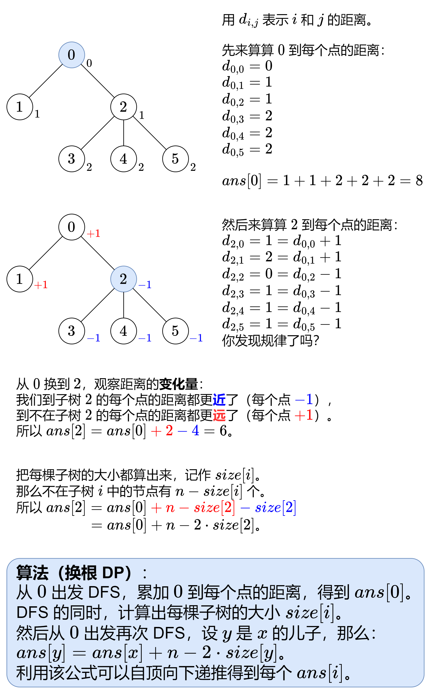

100318\. 合并两棵树后的最小直径(求树的直径+经典结论)
--------------------

给你两棵 **无向** 树，分别有 `n` 和 `m` 个节点，节点编号分别为 `0` 到 `n - 1` 和 `0` 到 `m - 1` 。给你两个二维整数数组 `edges1` 和 `edges2` ，长度分别为 `n - 1` 和 `m - 1` ，其中 `edges1[i] = [ai, bi]` 表示在第一棵树中节点 `ai` 和 `bi` 之间有一条边，`edges2[i] = [ui, vi]` 表示在第二棵树中节点 `ui` 和 `vi` 之间有一条边。

你必须在第一棵树和第二棵树中分别选一个节点，并用一条边连接它们。

请你返回添加边后得到的树中，**最小直径** 为多少。

一棵树的 **直径** 指的是树中任意两个节点之间的最长路径长度。

**示例 1：**

**输入：**edges1 = \[\[0,1\],\[0,2\],\[0,3\]\], edges2 = \[\[0,1\]\]

**输出：**3

**解释：**

将第一棵树中的节点 0 与第二棵树中的任意节点连接，得到一棵直径为 3 得树。

**示例 2：**

**输入：**edges1 = \[\[0,1\],\[0,2\],\[0,3\],\[2,4\],\[2,5\],\[3,6\],\[2,7\]\], edges2 = \[\[0,1\],\[0,2\],\[0,3\],\[2,4\],\[2,5\],\[3,6\],\[2,7\]\]

**输出：**5

**解释：**

将第一棵树中的节点 0 和第二棵树中的节点 0 连接，可以得到一棵直径为 5 的树。

**提示：**

*   `1 <= n, m <= 105`
*   `edges1.length == n - 1`
*   `edges2.length == m - 1`
*   `edges1[i].length == edges2[i].length == 2`
*   `edges1[i] = [ai, bi]`
*   `0 <= ai, bi < n`
*   `edges2[i] = [ui, vi]`
*   `0 <= ui, vi < m`
*   输入保证 `edges1` 和 `edges2` 分别表示一棵合法的树。

[https://leetcode.cn/problems/find-minimum-diameter-after-merging-two-trees/description/](https://leetcode.cn/problems/find-minimum-diameter-after-merging-two-trees/description/)

```java
import java.util.ArrayList;
import java.util.Arrays;
import java.util.List;

class Solution {
    public int minimumDiameterAfterMerge(int[][] edges1, int[][] edges2) {
        int d1 = diameter(edges1);
        int d2 = diameter(edges2);
        return Math.max(Math.max(d1, d2), (d1 + 1) / 2 + (d2 + 1) / 2 + 1);
    }

    int res;
    private int diameter(int[][] edges) { // 求一棵树的直径
        int n = edges.length + 1;
        List<Integer>[] g = new List[n];
        Arrays.setAll(g, e -> new ArrayList<>());
        for (int[] edge : edges) {
            int x = edge[0], y = edge[1];
            g[x].add(y);
            g[y].add(x);
        }
        res = 0;
        dfs(g, 0, -1);
        return res;
    }

    private int dfs(List<Integer>[] g, int x, int fa) {
        int maxLen = 0; // 从点x出发的最长子链
        for (int y : g[x]) {
            if (y != fa) {
                int subLen = dfs(g, y, x) + 1;
                res = Math.max(res, subLen + maxLen);
                maxLen = Math.max(maxLen, subLen);
            }
        }
        return maxLen;
    }
}
```

