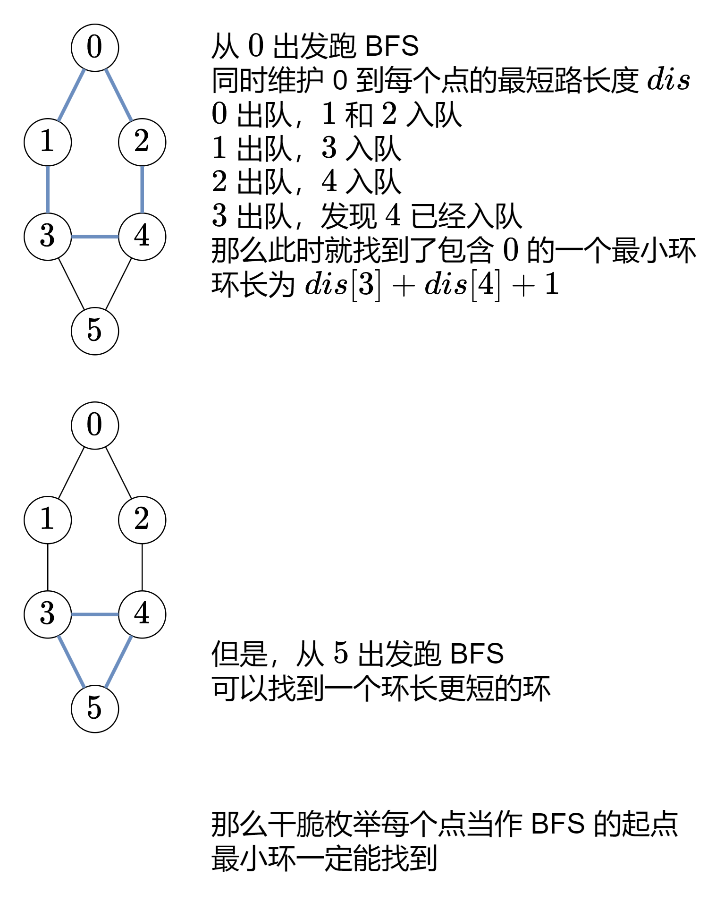

> 思考：如何获取dijkstra的路径？

815\. 公交路线
----------

给你一个数组 `routes` ，表示一系列公交线路，其中每个 `routes[i]` 表示一条公交线路，第 `i` 辆公交车将会在上面循环行驶。

*   例如，路线 `routes[0] = [1, 5, 7]` 表示第 `0` 辆公交车会一直按序列 `1 -> 5 -> 7 -> 1 -> 5 -> 7 -> 1 -> ...` 这样的车站路线行驶。

现在从 `source` 车站出发（初始时不在公交车上），要前往 `target` 车站。 期间仅可乘坐公交车。

求出 **最少乘坐的公交车数量** 。如果不可能到达终点车站，返回 `-1` 。

**示例 1：**

**输入：**routes = \[\[1,2,7\],\[3,6,7\]\], source = 1, target = 6
**输出：**2
**解释：**最优策略是先乘坐第一辆公交车到达车站 7 , 然后换乘第二辆公交车到车站 6 。 

**示例 2：**

**输入：**routes = \[\[7,12\],\[4,5,15\],\[6\],\[15,19\],\[9,12,13\]\], source = 15, target = 12
**输出：**\-1

**提示：**

*   `1 <= routes.length <= 500`.
*   `1 <= routes[i].length <= 105`
*   `routes[i]` 中的所有值 **互不相同**
*   `sum(routes[i].length) <= 105`
*   `0 <= routes[i][j] < 106`
*   `0 <= source, target < 106`

[https://leetcode.cn/problems/bus-routes/solutions/2916806/tu-jie-bfspythonjavacgojsrust-by-endless-t7oc/?envType=daily-question&envId=2024-09-17](https://leetcode.cn/problems/bus-routes/solutions/2916806/tu-jie-bfspythonjavacgojsrust-by-endless-t7oc/?envType=daily-question&envId=2024-09-17)

```java
import java.util.*;

class Solution {
    public int numBusesToDestination(int[][] routes, int source, int target) {
        HashMap<Integer, List<Integer>> map = new HashMap<>();
        for (int i = 0; i < routes.length; i++) { // 预处理每个站的所在的线路
            for (int x : routes[i]) {
                map.computeIfAbsent(x, e -> new ArrayList<>()).add(i);
            }
        }
        if (!map.containsKey(source) || !map.containsKey(target)) {
            return source == target ? 0 : -1;
        }
        HashMap<Integer, Integer> dist = new HashMap<>();
        dist.put(source, 0);
        Queue<Integer> q = new LinkedList<Integer>();
        q.offer(source);
        while (!q.isEmpty()) {
            int x = q.poll();
            int d = dist.get(x);
            for (int i : map.get(x)) {
                for (int y : routes[i]) {
                    if (!dist.containsKey(y)) {
                        dist.put(y, d + 1);
                        q.offer(y);
                    }
                }
            }
        }
        return dist.getOrDefault(target, -1);
    }
}
```

2092\. 找出知晓秘密的所有专家
------------------

给你一个整数 `n` ，表示有 `n` 个专家从 `0` 到 `n - 1` 编号。另外给你一个下标从 0 开始的二维整数数组 `meetings` ，其中 `meetings[i] = [xi, yi, timei]` 表示专家 `xi` 和专家 `yi` 在时间 `timei` 要开一场会。一个专家可以同时参加 **多场会议** 。最后，给你一个整数 `firstPerson` 。

专家 `0` 有一个 **秘密** ，最初，他在时间 `0` 将这个秘密分享给了专家 `firstPerson` 。接着，这个秘密会在每次有知晓这个秘密的专家参加会议时进行传播。更正式的表达是，每次会议，如果专家 `xi` 在时间 `timei` 时知晓这个秘密，那么他将会与专家 `yi` 分享这个秘密，反之亦然。

秘密共享是 **瞬时发生** 的。也就是说，在同一时间，一个专家不光可以接收到秘密，还能在其他会议上与其他专家分享。

在所有会议都结束之后，返回所有知晓这个秘密的专家列表。你可以按 **任何顺序** 返回答案。

**示例 1：**

**输入：**n = 6, meetings = \[\[1,2,5\],\[2,3,8\],\[1,5,10\]\], firstPerson = 1
**输出：**\[0,1,2,3,5\]
**解释：**
时间 0 ，专家 0 将秘密与专家 1 共享。
时间 5 ，专家 1 将秘密与专家 2 共享。
时间 8 ，专家 2 将秘密与专家 3 共享。
时间 10 ，专家 1 将秘密与专家 5 共享。
因此，在所有会议结束后，专家 0、1、2、3 和 5 都将知晓这个秘密。

**示例 2：**

**输入：**n = 4, meetings = \[\[3,1,3\],\[1,2,2\],\[0,3,3\]\], firstPerson = 3
**输出：**\[0,1,3\]
**解释：**
时间 0 ，专家 0 将秘密与专家 3 共享。
时间 2 ，专家 1 与专家 2 都不知晓这个秘密。
时间 3 ，专家 3 将秘密与专家 0 和专家 1 共享。
因此，在所有会议结束后，专家 0、1 和 3 都将知晓这个秘密。

**示例 3：**

**输入：**n = 5, meetings = \[\[3,4,2\],\[1,2,1\],\[2,3,1\]\], firstPerson = 1
**输出：**\[0,1,2,3,4\]
**解释：**
时间 0 ，专家 0 将秘密与专家 1 共享。
时间 1 ，专家 1 将秘密与专家 2 共享，专家 2 将秘密与专家 3 共享。
注意，专家 2 可以在收到秘密的同一时间分享此秘密。
时间 2 ，专家 3 将秘密与专家 4 共享。
因此，在所有会议结束后，专家 0、1、2、3 和 4 都将知晓这个秘密。

**提示：**

*   `2 <= n <= 105`
*   `1 <= meetings.length <= 105`
*   `meetings[i].length == 3`
*   `0 <= xi, yi <= n - 1`
*   `xi != yi`
*   `1 <= timei <= 105`
*   `1 <= firstPerson <= n - 1`

[https://leetcode.cn/problems/find-all-people-with-secret/description/](https://leetcode.cn/problems/find-all-people-with-secret/description/)

```java
import java.util.*;

class Solution {
    public List<Integer> findAllPeople(int n, int[][] meetings, int firstPerson) {
        int m = meetings.length;
        boolean[] secret = new boolean[n];
        secret[0] = secret[firstPerson] = true;
        Arrays.sort(meetings, (a, b) -> a[2] - b[2]);
        // 如果使用List[] g，我们不知道给多大的空间，所以这里用map
        Queue<Integer> queue = new LinkedList<>();
        int i = 0;
        while (i < m) {
            int j = i;
            while (j + 1 < m && meetings[j][2] == meetings[j + 1][2]) {
                j++;
            }
            HashMap<Integer, List<Integer>> g = new HashMap<>();
            HashSet<Integer> set = new HashSet<>();
            for (int k = i; k <= j; k++) {
                int x = meetings[k][0], y = meetings[k][1];
                g.computeIfAbsent(x, e -> new ArrayList<>()).add(y);
                g.computeIfAbsent(y, e -> new ArrayList<>()).add(x);
                set.add(x);
                set.add(y);
            }
            for (int x : set) {
                if (secret[x]) {
                    queue.offer(x);
                }
            }
            while (!queue.isEmpty()) {
                int poll = queue.poll();
                for (int x : g.get(poll)) {
                    if (!secret[x]) {
                        secret[x] = true;
                        queue.offer(x);
                    }
                }
            }
            i = j + 1;
        }
        ArrayList<Integer> ans = new ArrayList<>();
        for (int j = 0; j < n; j++) {
            if (secret[j]) {
                ans.add(j);
            }
        }
        return ans;
    }
}
```

1311\. 获取你好友已观看的视频
------------------

有 `n` 个人，每个人都有一个  `0` 到 `n-1` 的唯一 _id_ 。

给你数组 `watchedVideos`  和 `friends` ，其中 `watchedVideos[i]`  和 `friends[i]` 分别表示 `id = i` 的人观看过的视频列表和他的好友列表。

Level **1** 的视频包含所有你好友观看过的视频，level **2** 的视频包含所有你好友的好友观看过的视频，以此类推。一般的，Level 为 **k** 的视频包含所有从你出发，最短距离为 **k** 的好友观看过的视频。

给定你的 `id`  和一个 `level` 值，请你找出所有指定 `level` 的视频，并将它们按观看频率升序返回。如果有频率相同的视频，请将它们按字母顺序从小到大排列。

**示例 1：**

****

**输入：**watchedVideos = \[\["A","B"\],\["C"\],\["B","C"\],\["D"\]\], friends = \[\[1,2\],\[0,3\],\[0,3\],\[1,2\]\], id = 0, level = 1
**输出：**\["B","C"\] 
**解释：**
你的 id 为 0（绿色），你的朋友包括（黄色）：
id 为 1 -> watchedVideos = \["C"\] 
id 为 2 -> watchedVideos = \["B","C"\] 
你朋友观看过视频的频率为：
B -> 1 
C -> 2

**示例 2：**

****

**输入：**watchedVideos = \[\["A","B"\],\["C"\],\["B","C"\],\["D"\]\], friends = \[\[1,2\],\[0,3\],\[0,3\],\[1,2\]\], id = 0, level = 2
**输出：**\["D"\]
**解释：**
你的 id 为 0（绿色），你朋友的朋友只有一个人，他的 id 为 3（黄色）。

**提示：**

*   `n == watchedVideos.length == friends.length`
*   `2 <= n <= 100`
*   `1 <= watchedVideos[i].length <= 100`
*   `1 <= watchedVideos[i][j].length <= 8`
*   `0 <= friends[i].length < n`
*   `0 <= friends[i][j] < n`
*   `0 <= id < n`
*   `1 <= level < n`
*   如果 `friends[i]` 包含 `j` ，那么 `friends[j]` 包含 `i`

[https://leetcode.cn/problems/get-watched-videos-by-your-friends/description/](https://leetcode.cn/problems/get-watched-videos-by-your-friends/description/)

```java
import java.util.*;

class Solution {
    public List<String> watchedVideosByFriends(List<List<String>> watchedVideos, int[][] friends, int id, int level) {
        int n = friends.length;
        boolean[] visited = new boolean[n];
        visited[id] = true;
        Queue<Integer> queue = new LinkedList<>();
        queue.offer(id);
        while (!queue.isEmpty() && level > 0) {
            level--;
            int size = queue.size();
            for (int i = 0; i < size; i++) {
                int cur = queue.poll();
                for (int f : friends[cur]) {
                    if (!visited[f]) {
                        visited[f] = true;
                        queue.offer(f);
                    }
                }
            }
        }

        HashMap<String, Integer> cnt = new HashMap<>();
        while (!queue.isEmpty()) {
            int cur = queue.poll();
            List<String> list = watchedVideos.get(cur);
            for (String x : list) {
                cnt.put(x, cnt.getOrDefault(x, 0) + 1);
            }
        }

        ArrayList<String> ans = new ArrayList<>(cnt.keySet());
        Collections.sort(ans, (a,b)->{
            int cnt1 = cnt.get(a), cnt2 = cnt.get(b);
            if (cnt1 != cnt2) {
                return cnt1 - cnt2;
            }else{
                return a.compareTo(b); // 字符串顺序排序
            }
        });
        return ans;
    }
}
```

1129\. 颜色交替的最短路径
----------------

给定一个整数 `n`，即有向图中的节点数，其中节点标记为 `0` 到 `n - 1`。图中的每条边为红色或者蓝色，并且可能存在自环或平行边。

给定两个数组 `redEdges` 和 `blueEdges`，其中：

*   `redEdges[i] = [ai, bi]` 表示图中存在一条从节点 `ai` 到节点 `bi` 的红色有向边，
*   `blueEdges[j] = [uj, vj]` 表示图中存在一条从节点 `uj` 到节点 `vj` 的蓝色有向边。

返回长度为 `n` 的数组 `answer`，其中 `answer[X]` 是从节点 `0` 到节点 `X` 的红色边和蓝色边交替出现的最短路径的长度。如果不存在这样的路径，那么 `answer[x] = -1`。

**示例 1：**

**输入：**n = 3, red\_edges = \[\[0,1\],\[1,2\]\], blue\_edges = \[\]
**输出：**\[0,1,-1\]

**示例 2：**

**输入：**n = 3, red\_edges = \[\[0,1\]\], blue\_edges = \[\[2,1\]\]
**输出：**\[0,1,-1\]

**提示：**

*   `1 <= n <= 100`
*   `0 <= redEdges.length, blueEdges.length <= 400`
*   `redEdges[i].length == blueEdges[j].length == 2`
*   `0 <= ai, bi, uj, vj < n`

[https://leetcode.cn/problems/shortest-path-with-alternating-colors/description/](https://leetcode.cn/problems/shortest-path-with-alternating-colors/description/)

```java
import java.util.*;

class Solution {
    public int[] shortestAlternatingPaths(int n, int[][] redEdges, int[][] blueEdges) {
        final int RED = 0, BLUE = 1;
        List<Integer>[][] g = new List[n][2];
        for (int i = 0; i < n; i++) {
            g[i][RED] = new ArrayList<Integer>();
            g[i][BLUE] = new ArrayList<Integer>();
        }
        for (int[] edge : redEdges) {
            int x = edge[0], y = edge[1];
            g[x][RED].add(y);
        }
        for (int[] edge : blueEdges){
            int x = edge[0], y = edge[1];
            g[x][BLUE].add(y);
        }
        int[][] dist = new int[n][2];
        for (int i = 1; i < n; i++) { // 从1开始
            Arrays.fill(dist[i], Integer.MAX_VALUE);
        }
        Queue<int[]> queue = new LinkedList<>();
        queue.offer(new int[]{0, RED});
        queue.offer(new int[]{0, BLUE});
        while (!queue.isEmpty()) {
            int[] poll = queue.poll();
            int node = poll[0], color = poll[1];
            int d = dist[node][color];
            int nextColor = color ^ 1;
            int nextDist = d + 1;
            for (int next : g[node][nextColor]) {
                if (nextDist < dist[next][nextColor]) {
                    dist[next][nextColor] = nextDist;
                    queue.offer(new int[]{next, nextColor});
                }
            }
        }
        int[] ans = new int[n];
        for (int i = 0; i < n; i++) {
            int d = Math.min(dist[i][RED], dist[i][BLUE]);
            ans[i] = d == Integer.MAX_VALUE ? -1 : d;
        }
        return ans;
    }
}
```
1298\. 你能从盒子里获得的最大糖果数
---------------------

给你 `n` 个盒子，每个盒子的格式为 `[status, candies, keys, containedBoxes]` ，其中：

*   状态字 `status[i]`：整数，如果 `box[i]` 是开的，那么是 **1** ，否则是 **0** 。
*   糖果数 `candies[i]`: 整数，表示 `box[i]` 中糖果的数目。
*   钥匙 `keys[i]`：数组，表示你打开 `box[i]` 后，可以得到一些盒子的钥匙，每个元素分别为该钥匙对应盒子的下标。
*   内含的盒子 `containedBoxes[i]`：整数，表示放在 `box[i]` 里的盒子所对应的下标。

给你一个 `initialBoxes` 数组，表示你现在得到的盒子，你可以获得里面的糖果，也可以用盒子里的钥匙打开新的盒子，还可以继续探索从这个盒子里找到的其他盒子。

请你按照上述规则，返回可以获得糖果的 **最大数目** 。

**示例 1：**

**输入：**status = \[1,0,1,0\], candies = \[7,5,4,100\], keys = \[\[\],\[\],\[1\],\[\]\], containedBoxes = \[\[1,2\],\[3\],\[\],\[\]\], initialBoxes = \[0\]
**输出：**16
**解释：**
一开始你有盒子 0 。你将获得它里面的 7 个糖果和盒子 1 和 2。
盒子 1 目前状态是关闭的，而且你还没有对应它的钥匙。所以你将会打开盒子 2 ，并得到里面的 4 个糖果和盒子 1 的钥匙。
在盒子 1 中，你会获得 5 个糖果和盒子 3 ，但是你没法获得盒子 3 的钥匙所以盒子 3 会保持关闭状态。
你总共可以获得的糖果数目 = 7 + 4 + 5 = 16 个。

**示例 2：**

**输入：**status = \[1,0,0,0,0,0\], candies = \[1,1,1,1,1,1\], keys = \[\[1,2,3,4,5\],\[\],\[\],\[\],\[\],\[\]\], containedBoxes = \[\[1,2,3,4,5\],\[\],\[\],\[\],\[\],\[\]\], initialBoxes = \[0\]
**输出：**6
**解释：**
你一开始拥有盒子 0 。打开它你可以找到盒子 1,2,3,4,5 和它们对应的钥匙。
打开这些盒子，你将获得所有盒子的糖果，所以总糖果数为 6 个。

**示例 3：**

**输入：**status = \[1,1,1\], candies = \[100,1,100\], keys = \[\[\],\[0,2\],\[\]\], containedBoxes = \[\[\],\[\],\[\]\], initialBoxes = \[1\]
**输出：**1

**示例 4：**

**输入：**status = \[1\], candies = \[100\], keys = \[\[\]\], containedBoxes = \[\[\]\], initialBoxes = \[\]
**输出：**0

**示例 5：**

**输入：**status = \[1,1,1\], candies = \[2,3,2\], keys = \[\[\],\[\],\[\]\], containedBoxes = \[\[\],\[\],\[\]\], initialBoxes = \[2,1,0\]
**输出：**7

**提示：**

*   `1 <= status.length <= 1000`
*   `status.length == candies.length == keys.length == containedBoxes.length == n`
*   `status[i]` 要么是 `0` 要么是 `1` 。
*   `1 <= candies[i] <= 1000`
*   `0 <= keys[i].length <= status.length`
*   `0 <= keys[i][j] < status.length`
*   `keys[i]` 中的值都是互不相同的。
*   `0 <= containedBoxes[i].length <= status.length`
*   `0 <= containedBoxes[i][j] < status.length`
*   `containedBoxes[i]` 中的值都是互不相同的。
*   每个盒子最多被一个盒子包含。
*   `0 <= initialBoxes.length <= status.length`
*   `0 <= initialBoxes[i] < status.length`

[https://leetcode.cn/problems/maximum-candies-you-can-get-from-boxes/description/](https://leetcode.cn/problems/maximum-candies-you-can-get-from-boxes/description/)
```java
import java.util.HashSet;
import java.util.Iterator;
import java.util.LinkedList;
import java.util.Queue;

class Solution {
    public int maxCandies(int[] status, int[] candies, int[][] keys, int[][] containedBoxes, int[] initialBoxes) {
        int n = status.length;
        Queue<Integer> queue = new LinkedList<>();
        HashSet<Integer> keySet = new HashSet<>(); // 钥匙集合
        HashSet<Integer> notKeyBox = new HashSet<>(); // 没有钥匙的盒子的集合
        boolean[] visited = new boolean[n]; // 能打开的盒子集合
        for (int x : initialBoxes) {
            queue.offer(x);
            for (int y : keys[x]) {
                keySet.add(y);
            }
            if (status[x] == 1 || keySet.contains(x)) {
                visited[x] = true;
            }else{
                notKeyBox.add(x);
            }
        }
        while (!queue.isEmpty()) {
            Integer poll = queue.poll();
            for (int p : containedBoxes[poll]) {
                if(!visited[p]){
                    if (status[p] == 1 || keySet.contains(p)) {
                        visited[p] = true;
                        for (int k : keys[p]) {
                            keySet.add(k);
                        }
                        queue.offer(p);
                    }else{
                        notKeyBox.add(p);
                    }
                }
            }
//            for (int x : notKeyBox) {
//                if (keySet.contains(x)) {
//                    notKeyBox.remove(x);
//                    queue.offer(x);
//                    visited[x] = true;
//                }
//            }
            Iterator<Integer> iterator = notKeyBox.iterator(); // 使用迭代器避免遍历时删除导致的报错
            while (iterator.hasNext()) {
                int x = iterator.next();
                if (keySet.contains(x)) {
                    iterator.remove();
                    queue.offer(x);
                    visited[x] = true;
                }
            }
        }
        int ans = 0;
        for (int i = 0; i < n; i++) {
            if (visited[i]) {
                ans += candies[i];
            }
        }
        return ans;


    }
}
```
2608\. 图中的最短环(找最短环模板)
-------------

现有一个含 `n` 个顶点的 **双向** 图，每个顶点按从 `0` 到 `n - 1` 标记。图中的边由二维整数数组 `edges` 表示，其中 `edges[i] = [ui, vi]` 表示顶点 `ui` 和 `vi` 之间存在一条边。每对顶点最多通过一条边连接，并且不存在与自身相连的顶点。

返回图中 **最短** 环的长度。如果不存在环，则返回 `-1` 。

**环** 是指以同一节点开始和结束，并且路径中的每条边仅使用一次。

**示例 1：**


**输入：**n = 7, edges = \[\[0,1\],\[1,2\],\[2,0\],\[3,4\],\[4,5\],\[5,6\],\[6,3\]\]
**输出：**3
**解释：**长度最小的循环是：0 -> 1 -> 2 -> 0

**示例 2：**


**输入：**n = 4, edges = \[\[0,1\],\[0,2\]\]
**输出：**\-1
**解释：**图中不存在循环

**提示：**

*   `2 <= n <= 1000`
*   `1 <= edges.length <= 1000`
*   `edges[i].length == 2`
*   `0 <= ui, vi < n`
*   `ui != vi`
*   不存在重复的边

[https://leetcode.cn/problems/shortest-cycle-in-a-graph/description/](https://leetcode.cn/problems/shortest-cycle-in-a-graph/description/)

 

```java
import java.util.*;

class Solution {
    List<Integer>[] g;
    int[] dist;
    public int findShortestCycle(int n, int[][] edges) {
        g = new List[n];
        Arrays.setAll(g, e -> new ArrayList<Integer>());
        for (int[] edge : edges) {
            int x = edge[0], y = edge[1];
            g[x].add(y);
            g[y].add(x);
        }
        dist = new int[n];
        int ans = Integer.MAX_VALUE;
        for (int i = 0; i < n; i++) {
            ans = Math.min(ans, bfs(i));
        }
        return ans == Integer.MAX_VALUE ? -1 : ans;
    }

    private int bfs(int start) {
        int ans = Integer.MAX_VALUE;
        Arrays.fill(dist, -1);
        dist[start] = 0;
        Queue<int[]> queue = new LinkedList<>();
        queue.offer(new int[]{start, -1});
        while (!queue.isEmpty()) {
            int[] poll = queue.poll();
            int x = poll[0], fa = poll[1];
            for (int y : g[x]) {
                if (dist[y] < 0) { // 第一次遇到
                    dist[y] = dist[x] + 1;
                    queue.offer(new int[]{y, x});
                } else if (y != fa) { // 第二次遇到
                    ans = Math.min(ans, dist[x] + dist[y] + 1);
                }
            }
        }
        return ans;
    }

}
```

1284\. 转化为全零矩阵的最少反转次数(位运算+bfs)
---------------------

给你一个 `m x n` 的二进制矩阵 `mat`。每一步，你可以选择一个单元格并将它反转（反转表示 `0` 变 `1` ，`1` 变 `0` ）。如果存在和它相邻的单元格，那么这些相邻的单元格也会被反转。相邻的两个单元格共享同一条边。

请你返回将矩阵 `mat` 转化为全零矩阵的_最少反转次数_，如果无法转化为全零矩阵，请返回 `-1` 。

**二进制矩阵** 的每一个格子要么是 `0` 要么是 `1` 。

**全零矩阵** 是所有格子都为 `0` 的矩阵。

**示例 1：**


**输入：**mat = \[\[0,0\],\[0,1\]\]
**输出：**3
**解释：**一个可能的解是反转 (1, 0)，然后 (0, 1) ，最后是 (1, 1) 。

**示例 2：**

**输入：**mat = \[\[0\]\]
**输出：**0
**解释：**给出的矩阵是全零矩阵，所以你不需要改变它。

**示例 3：**

**输入：**mat = \[\[1,0,0\],\[1,0,0\]\]
**输出：**\-1
**解释：**该矩阵无法转变成全零矩阵

**提示：**

*   `m == mat.length`
*   `n == mat[0].length`
*   `1 <= m <= 3`
*   `1 <= n <= 3`
*   `mat[i][j]` 是 0 或 1 。

[https://leetcode.cn/problems/minimum-number-of-flips-to-convert-binary-matrix-to-zero-matrix/description/](https://leetcode.cn/problems/minimum-number-of-flips-to-convert-binary-matrix-to-zero-matrix/description/)

```java
import java.util.HashSet;
import java.util.LinkedList;
import java.util.Queue;

class Solution {
    static final int TARGET = 0;
    static int[][] dirs = {{-1, 0}, {1, 0}, {0, -1}, {0, 1}};
    int m, n;
    public int minFlips(int[][] mat) {
        m = mat.length;
        n = mat[0].length;
        int startState = 0;
        for (int i = 0; i < m; i++) {
            for (int j = 0; j < n; j++) {
                startState += mat[i][j] << getIndex(i, j);
            }
        }
        HashSet<Integer> visited = new HashSet<>();
        visited.add(startState);
        Queue<Integer> queue = new LinkedList<>();
        queue.offer(startState);
        int flips = -1;
        while (!queue.isEmpty()) {
            flips++;
            int size = queue.size();
            for (int i = 0; i < size; i++) {
                int state = queue.poll();
                if (startState == TARGET) {
                    return flips;
                }
                for (int j = 0; j < m; j++) {
                    for (int k = 0; k < n; k++) {
                        int adjacentState = getAdjacentState(state, j, k);
                        if (visited.add(adjacentState)) {
                            queue.offer(adjacentState);
                        }
                    }
                }
            }
        }
        return -1;
    }

    public int getAdjacentState(int state, int row, int col) {
        state ^= 1 << getIndex(row, col);
        for (int[] dir : dirs) {
            int newRow = row + dir[0], newCol = col + dir[1];
            if (newRow >= 0 && newRow < m && newCol >= 0 && newCol < n) {
                state ^= 1 << getIndex(newRow, newCol);
            }
        }
        return state;
    }

    public int getIndex(int row, int col) {
        return row * n + col;
    }
}
```

