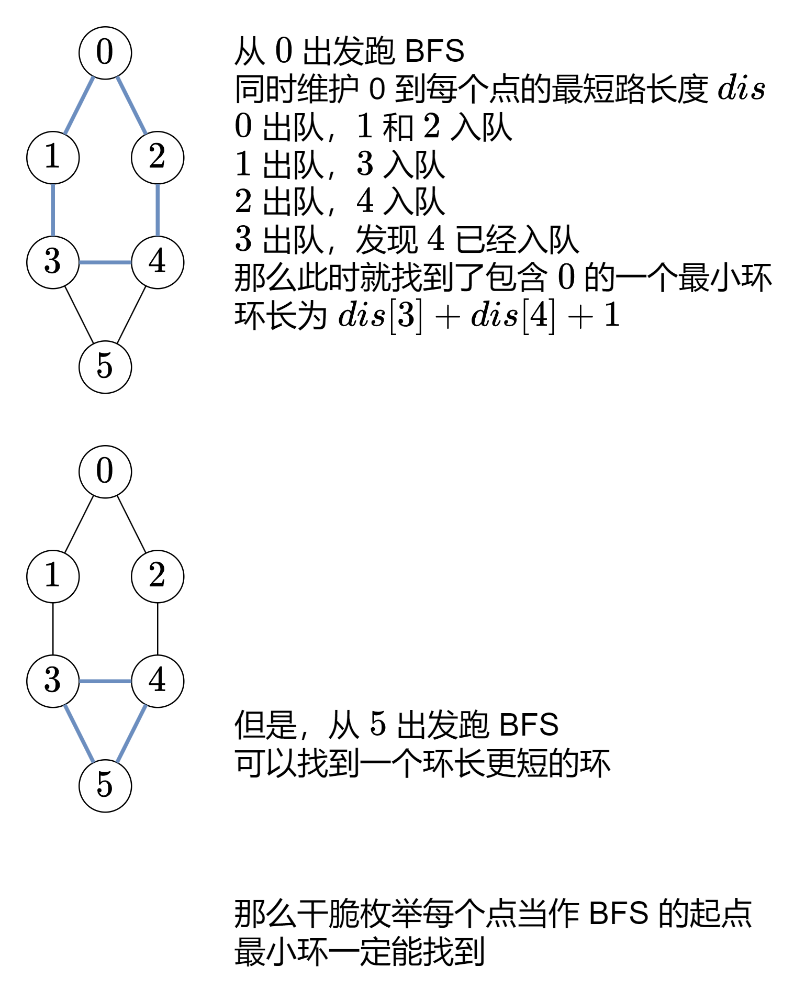

547\. 省份数量
----------

有 `n` 个城市，其中一些彼此相连，另一些没有相连。如果城市 `a` 与城市 `b` 直接相连，且城市 `b` 与城市 `c` 直接相连，那么城市 `a` 与城市 `c` 间接相连。

**省份** 是一组直接或间接相连的城市，组内不含其他没有相连的城市。

给你一个 `n x n` 的矩阵 `isConnected` ，其中 `isConnected[i][j] = 1` 表示第 `i` 个城市和第 `j` 个城市直接相连，而 `isConnected[i][j] = 0` 表示二者不直接相连。

返回矩阵中 **省份** 的数量。

**示例 1：**


**输入：**isConnected = \[\[1,1,0\],\[1,1,0\],\[0,0,1\]\]
**输出：**2

**示例 2：**


**输入：**isConnected = \[\[1,0,0\],\[0,1,0\],\[0,0,1\]\]
**输出：**3

**提示：**

*   `1 <= n <= 200`
*   `n == isConnected.length`
*   `n == isConnected[i].length`
*   `isConnected[i][j]` 为 `1` 或 `0`
*   `isConnected[i][i] == 1`
*   `isConnected[i][j] == isConnected[j][i]`

[https://leetcode.cn/problems/number-of-provinces/description/](https://leetcode.cn/problems/number-of-provinces/description/)

```java
class Solution {
    public int findCircleNum(int[][] isConnected) {
        int n = isConnected.length;
        boolean[] visited = new boolean[n];
        int ans = 0;
        for (int i = 0; i < n; i++) {
            if (!visited[i]) {
                dfs(i, visited, isConnected, n);
                ans++;
            }
        }
        return ans;
    }

    private void dfs(int i, boolean[] visited, int[][] isConnected,int n) {
        visited[i] = true;
        for (int j = 0; j < n; j++) {
            if (!visited[j] && isConnected[i][j] == 1) {
                dfs(j, visited, isConnected, n);
            }
        }

    }
}
```

1971\. 寻找图中是否存在路径
-----------------

有一个具有 `n` 个顶点的 **双向** 图，其中每个顶点标记从 `0` 到 `n - 1`（包含 `0` 和 `n - 1`）。图中的边用一个二维整数数组 `edges` 表示，其中 `edges[i] = [ui, vi]` 表示顶点 `ui` 和顶点 `vi` 之间的双向边。 每个顶点对由 **最多一条** 边连接，并且没有顶点存在与自身相连的边。

请你确定是否存在从顶点 `source` 开始，到顶点 `destination` 结束的 **有效路径** 。

给你数组 `edges` 和整数 `n`、`source` 和 `destination`，如果从 `source` 到 `destination` 存在 **有效路径** ，则返回 `true`，否则返回 `false` 。

**示例 1：**


**输入：**n = 3, edges = \[\[0,1\],\[1,2\],\[2,0\]\], source = 0, destination = 2
**输出：**true
**解释：**存在由顶点 0 到顶点 2 的路径:
- 0 → 1 → 2 
- 0 → 2

**示例 2：**


**输入：**n = 6, edges = \[\[0,1\],\[0,2\],\[3,5\],\[5,4\],\[4,3\]\], source = 0, destination = 5
**输出：**false
**解释：**不存在由顶点 0 到顶点 5 的路径.

**提示：**

*   `1 <= n <= 2 * 105`
*   `0 <= edges.length <= 2 * 105`
*   `edges[i].length == 2`
*   `0 <= ui, vi <= n - 1`
*   `ui != vi`
*   `0 <= source, destination <= n - 1`
*   不存在重复边
*   不存在指向顶点自身的边

[https://leetcode.cn/problems/find-if-path-exists-in-graph/description/](https://leetcode.cn/problems/find-if-path-exists-in-graph/description/)

```java
import java.util.ArrayList;
import java.util.Arrays;
import java.util.List;

class Solution {
    public boolean validPath(int n, int[][] edges, int source, int destination) {
        List<Integer>[] g = new List[n];
        Arrays.setAll(g, e -> new ArrayList<Integer>());
        for (int[] edge : edges) {
            int x = edge[0], y = edge[1];
            g[x].add(y);
            g[y].add(x);
        }
        boolean[] visited = new boolean[n];
        return dfs(g, visited, source, destination);
    }

    private boolean dfs(List<Integer>[] g,boolean[] visited, int source, int destination) {
        if (source == destination) {
            return true;
        }
        visited[source] = true;
        for (int x : g[source]) {
//            if (!visited[x]) {
//                return dfs(g, visited, x, destination);
//            }
            if (!visited[x]&&dfs(g, visited, x, destination)) {
                return true;  // 只有在任何递归调用返回true时才返回true
            }
        }
        return false;
    }
}
```

3067\. 在带权树网络中统计可连接服务器对数目(树上模板题)
-------------------------

给你一棵无根带权树，树中总共有 `n` 个节点，分别表示 `n` 个服务器，服务器从 `0` 到 `n - 1` 编号。同时给你一个数组 `edges` ，其中 `edges[i] = [ai, bi, weighti]` 表示节点 `ai` 和 `bi` 之间有一条双向边，边的权值为 `weighti` 。再给你一个整数 `signalSpeed` 。

如果两个服务器 `a` ，`b` 和 `c` 满足以下条件，那么我们称服务器 `a` 和 `b` 是通过服务器 `c` **可连接的** ：

*   `a < b` ，`a != c` 且 `b != c` 。
*   从 `c` 到 `a` 的距离是可以被 `signalSpeed` 整除的。
*   从 `c` 到 `b` 的距离是可以被 `signalSpeed` 整除的。
*   从 `c` 到 `b` 的路径与从 `c` 到 `a` 的路径没有任何公共边。

请你返回一个长度为 `n` 的整数数组 `count` ，其中 `count[i]` 表示通过服务器 `i` **可连接** 的服务器对的 **数目** 。

**示例 1：**


**输入：**edges = \[\[0,1,1\],\[1,2,5\],\[2,3,13\],\[3,4,9\],\[4,5,2\]\], signalSpeed = 1
**输出：**\[0,4,6,6,4,0\]
**解释：**由于 signalSpeed 等于 1 ，count\[c\] 等于所有从 c 开始且没有公共边的路径对数目。
在输入图中，count\[c\] 等于服务器 c 左边服务器数目乘以右边服务器数目。

**示例 2：**


**输入：**edges = \[\[0,6,3\],\[6,5,3\],\[0,3,1\],\[3,2,7\],\[3,1,6\],\[3,4,2\]\], signalSpeed = 3
**输出：**\[2,0,0,0,0,0,2\]
**解释：**通过服务器 0 ，有 2 个可连接服务器对(4, 5) 和 (4, 6) 。
通过服务器 6 ，有 2 个可连接服务器对 (4, 5) 和 (0, 5) 。
所有服务器对都必须通过服务器 0 或 6 才可连接，所以其他服务器对应的可连接服务器对数目都为 0 。

**提示：**

*   `2 <= n <= 1000`
*   `edges.length == n - 1`
*   `edges[i].length == 3`
*   `0 <= ai, bi < n`
*   `edges[i] = [ai, bi, weighti]`
*   `1 <= weighti <= 106`
*   `1 <= signalSpeed <= 106`
*   输入保证 `edges` 构成一棵合法的树。

[https://leetcode.cn/problems/count-pairs-of-connectable-servers-in-a-weighted-tree-network/description/?envType=daily-question&envId=2024-06-04](https://leetcode.cn/problems/count-pairs-of-connectable-servers-in-a-weighted-tree-network/description/?envType=daily-question&envId=2024-06-04)

```java
import java.util.ArrayList;
import java.util.Arrays;
import java.util.List;

class Solution {
    public int[] countPairsOfConnectableServers(int[][] edges, int signalSpeed) {
        int n = edges.length + 1;
        List<int[]>[] g = new List[n];
        Arrays.setAll(g, e -> new ArrayList<>());
        for (int[] edge : edges) {
            int x = edge[0], y = edge[1], z = edge[2];
            g[x].add(new int[]{y, z});
            g[y].add(new int[]{x, z});
        }
        int[] ans = new int[n]; // 这个图没有环，所以不用visited数组，这其实就是一棵树
        for (int i = 0; i < n; i++) {
            int sum = 0;
            for (int[] e : g[i]) {
                int cnt = dfs(e[0], i, g, e[1], signalSpeed);
                ans[i] += cnt * sum;
                sum += cnt;
            }
        }
        return ans;
    }

    private int dfs(int x, int fa, List<int[]>[] g, int sum, int signalSpeed) {
        int res = sum % signalSpeed == 0 ? 1 : 0;
        for (int[] y : g[x]) {
            if (y[0] != fa) {
                res += dfs(y[0], x, g, sum + y[1], signalSpeed);
            }
        }
        return res;
    }

}
```

## 802.找到最终的安全状态(三色标记法，找图中没有环的结点) 

---------------

有一个有 `n` 个节点的有向图，节点按 `0` 到 `n - 1` 编号。图由一个 **索引从 0 开始** 的 2D 整数数组 `graph`表示， `graph[i]`是与节点 `i` 相邻的节点的整数数组，这意味着从节点 `i` 到 `graph[i]`中的每个节点都有一条边。

如果一个节点没有连出的有向边，则该节点是 **终端节点** 。如果从该节点开始的所有可能路径都通向 **终端节点** ，则该节点为 **安全节点** 。

返回一个由图中所有 **安全节点** 组成的数组作为答案。答案数组中的元素应当按 **升序** 排列。

**示例 1：**


**输入：**graph = \[\[1,2\],\[2,3\],\[5\],\[0\],\[5\],\[\],\[\]\]
**输出：**\[2,4,5,6\]
**解释：**示意图如上。
节点 5 和节点 6 是终端节点，因为它们都没有出边。
从节点 2、4、5 和 6 开始的所有路径都指向节点 5 或 6 。

**示例 2：**

**输入：**graph = \[\[1,2,3,4\],\[1,2\],\[3,4\],\[0,4\],\[\]\]
**输出：**\[4\]
**解释:**
只有节点 4 是终端节点，从节点 4 开始的所有路径都通向节点 4 。

**提示：**

*   `n == graph.length`
*   `1 <= n <= 104`
*   `0 <= graph[i].length <= n`
*   `0 <= graph[i][j] <= n - 1`
*   `graph[i]` 按严格递增顺序排列。
*   图中可能包含自环。
*   图中边的数目在范围 `[1, 4 * 104]` 内。

[https://leetcode.cn/problems/find-eventual-safe-states/description/](https://leetcode.cn/problems/find-eventual-safe-states/description/)

```java
import java.util.ArrayList;
import java.util.List;

class Solution {
    public List<Integer> eventualSafeNodes(int[][] graph) { // 就是找没有环的点
        int n = graph.length;
        List<Integer> ans = new ArrayList<>();
        int[] color = new int[n];
        for (int i = 0; i < n; i++) {
            if (dfs(i, graph, color)) {
                ans.add(i);
            }
        }
        return ans;
    }

    private boolean dfs(int x, int[][] graph, int[] color) {
        if (color[x] > 0) {
            return color[x] == 2;
        }
        color[x] = 1;
        for (int y : graph[x]) {
            if (!dfs(y, graph, color)) {
                return false;
            }
        }
        color[x] = 2;
        return true;
    }
}
```

2608\. 图中的最短环(找最短环模板)
-------------

现有一个含 `n` 个顶点的 **双向** 图，每个顶点按从 `0` 到 `n - 1` 标记。图中的边由二维整数数组 `edges` 表示，其中 `edges[i] = [ui, vi]` 表示顶点 `ui` 和 `vi` 之间存在一条边。每对顶点最多通过一条边连接，并且不存在与自身相连的顶点。

返回图中 **最短** 环的长度。如果不存在环，则返回 `-1` 。

**环** 是指以同一节点开始和结束，并且路径中的每条边仅使用一次。

**示例 1：**


**输入：**n = 7, edges = \[\[0,1\],\[1,2\],\[2,0\],\[3,4\],\[4,5\],\[5,6\],\[6,3\]\]
**输出：**3
**解释：**长度最小的循环是：0 -> 1 -> 2 -> 0 

**示例 2：**


**输入：**n = 4, edges = \[\[0,1\],\[0,2\]\]
**输出：**\-1
**解释：**图中不存在循环

**提示：**

*   `2 <= n <= 1000`
*   `1 <= edges.length <= 1000`
*   `edges[i].length == 2`
*   `0 <= ui, vi < n`
*   `ui != vi`
*   不存在重复的边

[https://leetcode.cn/problems/shortest-cycle-in-a-graph/description/](https://leetcode.cn/problems/shortest-cycle-in-a-graph/description/)

 

```java
import java.util.*;

class Solution {
    List<Integer>[] g;
    int[] dist;
    public int findShortestCycle(int n, int[][] edges) {
        g = new List[n];
        Arrays.setAll(g, e -> new ArrayList<Integer>());
        for (int[] edge : edges) {
            int x = edge[0], y = edge[1];
            g[x].add(y);
            g[y].add(x);
        }
        dist = new int[n];
        int ans = Integer.MAX_VALUE;
        for (int i = 0; i < n; i++) {
            ans = Math.min(ans, bfs(i));
        }
        return ans == Integer.MAX_VALUE ? -1 : ans;
    }

    private int bfs(int start) {
        int ans = Integer.MAX_VALUE;
        Arrays.fill(dist, -1);
        dist[start] = 0;
        Queue<int[]> queue = new LinkedList<>();
        queue.offer(new int[]{start, -1});
        while (!queue.isEmpty()) {
            int[] poll = queue.poll();
            int x = poll[0], fa = poll[1];
            for (int y : g[x]) {
                if (dist[y] < 0) { // 第一次遇到
                    dist[y] = dist[x] + 1;
                    queue.offer(new int[]{y, x});
                } else if (y != fa) { // 第二次遇到
                    ans = Math.min(ans, dist[x] + dist[y] + 1);
                }
            }
        }
        return ans;
    }

}
```

2065\. 最大化一张图中的路径价值
-------------------

给你一张 **无向** 图，图中有 `n` 个节点，节点编号从 `0` 到 `n - 1` （**都包括**）。同时给你一个下标从 **0** 开始的整数数组 `values` ，其中 `values[i]` 是第 `i` 个节点的 **价值** 。同时给你一个下标从 **0** 开始的二维整数数组 `edges` ，其中 `edges[j] = [uj, vj, timej]` 表示节点 `uj` 和 `vj` 之间有一条需要 `timej` 秒才能通过的无向边。最后，给你一个整数 `maxTime` 。

**合法路径** 指的是图中任意一条从节点 `0` 开始，最终回到节点 `0` ，且花费的总时间 **不超过** `maxTime` 秒的一条路径。你可以访问一个节点任意次。一条合法路径的 **价值** 定义为路径中 **不同节点** 的价值 **之和** （每个节点的价值 **至多** 算入价值总和中一次）。

请你返回一条合法路径的 **最大** 价值。

**注意：**每个节点 **至多** 有 **四条** 边与之相连。

**示例 1：**


**输入：**values = \[0,32,10,43\], edges = \[\[0,1,10\],\[1,2,15\],\[0,3,10\]\], maxTime = 49
**输出：**75
**解释：**
一条可能的路径为：0 -> 1 -> 0 -> 3 -> 0 。总花费时间为 10 + 10 + 10 + 10 = 40 <= 49 。
访问过的节点为 0 ，1 和 3 ，最大路径价值为 0 + 32 + 43 = 75 。

**示例 2：**


**输入：**values = \[5,10,15,20\], edges = \[\[0,1,10\],\[1,2,10\],\[0,3,10\]\], maxTime = 30
**输出：**25
**解释：**
一条可能的路径为：0 -> 3 -> 0 。总花费时间为 10 + 10 = 20 <= 30 。
访问过的节点为 0 和 3 ，最大路径价值为 5 + 20 = 25 。

**示例 3：**


**输入：**values = \[1,2,3,4\], edges = \[\[0,1,10\],\[1,2,11\],\[2,3,12\],\[1,3,13\]\], maxTime = 50
**输出：**7
**解释：**
一条可能的路径为：0 -> 1 -> 3 -> 1 -> 0 。总花费时间为 10 + 13 + 13 + 10 = 46 <= 50 。
访问过的节点为 0 ，1 和 3 ，最大路径价值为 1 + 2 + 4 = 7 。

**示例 4：**

****

**输入：**values = \[0,1,2\], edges = \[\[1,2,10\]\], maxTime = 10
**输出：**0
**解释：**
唯一一条路径为 0 。总花费时间为 0 。
唯一访问过的节点为 0 ，最大路径价值为 0 。

**提示：**

*   `n == values.length`
*   `1 <= n <= 1000`
*   `0 <= values[i] <= 108`
*   `0 <= edges.length <= 2000`
*   `edges[j].length == 3`
*   `0 <= uj < vj <= n - 1`
*   `10 <= timej, maxTime <= 100`
*   `[uj, vj]` 所有节点对 **互不相同** 。
*   每个节点 **至多有四条** 边。
*   图可能不连通。

[https://leetcode.cn/problems/maximum-path-quality-of-a-graph/description/?envType=daily-question&envId=Invalid%20Date](https://leetcode.cn/problems/maximum-path-quality-of-a-graph/description/?envType=daily-question&envId=Invalid%20Date)

```java
import java.util.ArrayList;
import java.util.Arrays;
import java.util.List;

class Solution { // 暴力搜索
    List<int[]>[] g;
    int n, maxTime;
    boolean[] visited;
    int[] values;
    public int maximalPathQuality(int[] values, int[][] edges, int maxTime) {
        n = values.length;
        g = new List[n];
        this.values = values;
        this.maxTime = maxTime;
        Arrays.setAll(g, e -> new ArrayList<>());
        for (int[] edge : edges) {
            int x = edge[0], y = edge[1], z = edge[2];
            g[x].add(new int[]{y, z});
            g[y].add(new int[]{x, z});
        }
        visited = new boolean[n];
        visited[0] = true;
        return dfs(0, 0, values[0]);
    }

    private int dfs(int x, int sumTime,int sumValue) { // 表示从节点x出发的能获取的最大价值
        int res = x == 0 ? sumValue : 0;
        for (int[] edge : g[x]) {
            int y = edge[0], t = edge[1];
            if (sumTime + t > maxTime) {
                continue;
            }
            if (visited[y]) {
                res = Math.max(res, dfs(y, sumTime + t, sumValue)); // 走重复的路
            }else{
                // 走没有走过的路
                visited[y] = true;
                res = Math.max(res, dfs(y, sumTime + t, sumValue + values[y]));
                visited[y] = false;
            }
        }
        return res;
    }
}
```

> dijkstra剪枝，时间复杂度差不多

```java
import java.util.ArrayList;
import java.util.Arrays;
import java.util.List;
import java.util.PriorityQueue;

class Solution {
    List<int[]>[] g;
    int n, maxTime;
    boolean[] visited;
    int[] values, dist;
    public int maximalPathQuality(int[] values, int[][] edges, int maxTime) {
        n = values.length;
        g = new List[n];
        this.values = values;
        this.maxTime = maxTime;
        Arrays.setAll(g, e -> new ArrayList<>());
        for (int[] edge : edges) {
            int x = edge[0], y = edge[1], z = edge[2];
            g[x].add(new int[]{y, z});
            g[y].add(new int[]{x, z});
        }
        dist = new int[n];
        Arrays.fill(dist, Integer.MAX_VALUE / 2);
        dist[0] = 0;
        PriorityQueue<int[]> pq = new PriorityQueue<>((a, b) -> a[1] - b[1]);
        pq.offer(new int[]{0, 0});
        while (!pq.isEmpty()) {
            int[] poll = pq.poll();
            int x = poll[0], t = poll[1];
            if (dist[x] < t) {
                continue;
            }
            for (int[] p : g[x]) {
                int y = p[0], time = p[1];
                if (dist[y] > time + dist[x]) {
                    dist[y] = time + dist[x];
                    pq.offer(new int[]{y, dist[y]});
                }
            }
        }
        visited = new boolean[n];
        visited[0] = true;
        return dfs(0, 0, values[0]);
    }

    private int dfs(int x, int sumTime,int sumValue) { // 表示从节点x出发的能获取的最大价值
        int res = x == 0 ? sumValue : 0;
        for (int[] edge : g[x]) {
            int y = edge[0], t = edge[1];
            if (sumTime + t + dist[y] > maxTime) { // dijkstra剪枝
                continue;
            }
            if (visited[y]) {
                res = Math.max(res, dfs(y, sumTime + t, sumValue)); // 走重复的路
            }else{
                // 走没有走过的路
                visited[y] = true;
                res = Math.max(res, dfs(y, sumTime + t, sumValue + values[y]));
                visited[y] = false;
            }
        }
        return res;
    }
}
```

