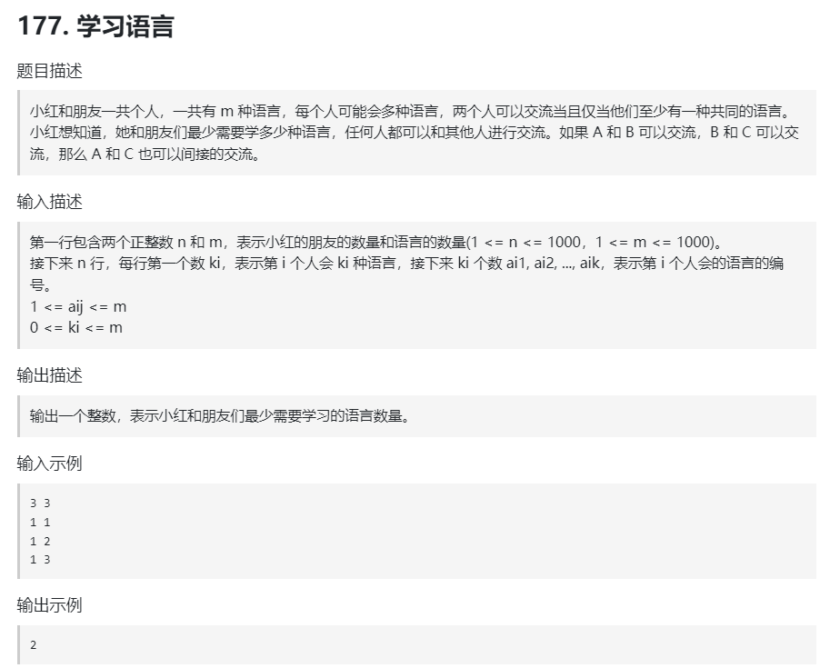

## 【并查集究极模板题】

## [小苯的蓄水池（hard） ](https://ac.nowcoder.com/acm/contest/93847/E)

- 方法一：并查集

```java
    private static int[] p;
    private static long[] s_cnt, s_water;


    /**
     * 使用并查集做合并操作，祖先节点就是当前节点的最右节点
     */
    private static void solve() throws IOException {
        ss = sc.nextLine().split(" ");
        int n = Integer.parseInt(ss[0]), m = Integer.parseInt(ss[1]);
        p = new int[n];
        s_cnt = new long[n];
        s_water = new long[n];
        ss = sc.nextLine().split(" ");
        for (int i = 0; i < n; i++) {
            p[i] = i;
            s_cnt[i] = 1;
            s_water[i] = Integer.parseInt(ss[i]);
        }
        while (m-- > 0) {
            ss = sc.nextLine().split(" ");
            int op = Integer.parseInt(ss[0]);
            if (op == 1) {
                int l = Integer.parseInt(ss[1]) - 1, r = Integer.parseInt(ss[2]) - 1;
                for (int i = l; i < r; i++) {
                    union(i, i + 1);
                    i = find(i) - 1; // 我来解释一下为什么这里要-1，因为用的for循环，后面会+1，这里减1正好抵消。
                }
            }else{
                int x = Integer.parseInt(ss[1]) - 1;
                int fx = find(x);
                sc.println((double) s_water[fx] / s_cnt[fx]);
            }
        }
    }

    private static int find(int x) {
        if (p[x] != x) {
            p[x] = find(p[x]);
        }
        return p[x];
    }

    private static void union(int x, int y) {
        int fx = find(x);
        int fy = find(y);
        if (fx == fy) {
            return;
        }
        if (fx < fy) {
            int tmp = fx;
            fx = fy;
            fy = tmp;
        }
        s_cnt[fx] += s_cnt[fy];
        s_water[fx] += s_water[fy];
        p[fy] = fx;
    }
```

- 方法二：红黑树

```java
private static void solve() throws IOException {
        int n = sc.nextInt();
        int m = sc.nextInt();
        TreeMap<Integer, Integer> right = new TreeMap<>(); // 每个点的右边界
        long[] nums = new long[n];
        long[] prefixSum = new long[n + 1];
        ss = sc.nextLine().split(" ");
        for (int i = 0; i < n; i++) {
            nums[i] = Long.parseLong(ss[i]);
            prefixSum[i + 1] = prefixSum[i] + nums[i];
            right.put(i, i);
        }
        while (m-- > 0) {
            ss = sc.nextLine().split(" ");
            int op = Integer.parseInt(ss[0]);
            if (op == 1) {
                int l = Integer.parseInt(ss[1]) - 1, r = Integer.parseInt(ss[2]) - 1;
                Integer ll = right.floorKey(l), rr = right.floorKey(r);
                rr = right.get(rr);
                right.put(ll, rr);
                while (right.higherKey(ll) != null && right.higherKey(ll) <= rr) {
                    right.remove(right.higherKey(ll));
                }
            }else{
                int x = Integer.parseInt(ss[1]) - 1;
                int l = right.floorKey(x), r = right.get(l);
                sc.println((double) (prefixSum[r + 1] - prefixSum[l]) / (r - l + 1));
            }
        }
    }
```


## [E - K-th Largest Connected Components ](https://atcoder.jp/contests/abc372/tasks/abc372_e)

```java
    private static void solve() throws IOException {
        n = sc.nextInt();
        int q = sc.nextInt();
        UnionFind unionFind = new UnionFind(n + 1);
        while (q-- > 0) {
            ss = sc.nextLine().split(" ");
            int ops = Integer.parseInt(ss[0]);
            int x = Integer.parseInt(ss[1]), y = Integer.parseInt(ss[2]);
            if (ops == 1) {
                unionFind.union(x, y);
            }else{
                int root = unionFind.find(x);
                if (unionFind.pqs[root].size() < y) {
                    sc.println(-1);
                }else{
                    ArrayList<Integer> list = new ArrayList<>();
                    while (!unionFind.pqs[root].isEmpty()) {
                        list.add(unionFind.pqs[root].poll());
                    }
                    sc.println(list.get(list.size() - y));
                    unionFind.pqs[root].addAll(list);
                }
            }
        }

    }

    static class UnionFind {
        private int[] parent;
        private PriorityQueue<Integer>[] pqs; // 小根堆
        int MX = 10;

        public UnionFind(int n) {
            parent = new int[n];
            pqs = new PriorityQueue[n];
            for (int i = 0; i < n; i++) {
                parent[i] = -1;
                pqs[i] = new PriorityQueue<>((a, b) -> a - b);
                pqs[i].add(i);
            }
        }

        public int find(int x) {
            if (parent[x] < 0) {
                return x;
            } else {
                parent[x] = find(parent[x]);
                return parent[x];
            }
        }

        public void union(int x, int y) {
            x = find(x);
            y = find(y);
            if (x == y) {
                return;
            }
            if (parent[x] > parent[y]) {
                int tmp = x;
                x = y;
                y = tmp;
            }
            parent[x] += parent[y];
            parent[y] = x;
            while (!pqs[y].isEmpty()) {
                pqs[x].offer(pqs[y].poll());
                if (pqs[x].size() > MX) {
                    pqs[x].poll();
                }
            }
        }
    }
```


## [177. 学习语言 ](https://kamacoder.com/problempage.php?pid=1255)



> 知识点一：将并查集的p数组初始化为-1，在find过程加入
>
> ```java
> if(p[x] < 0) return x;
> ```
>
> 知识点二：有n个人，每个人都有自己会的语言，按照语言合并，这里其实和人数无关。

```java
	private static String[] ss; // 超时代码，我淦！将List[] g换成动态数组不超时List<List<Integer>> g
    private static String s;
    private static char[] cs;
    private static List<Integer>[] g;
    private static int m, n;
 
    private static int[] p;
 
 
    private static void solve() throws IOException {
        n = sc.nextInt();
        m = sc.nextInt();
        g = new List[n]; // n个人
        int ans = 0;
        Arrays.setAll(g, e -> new ArrayList<>());
        for (int i = 0; i < n; i++) {
            ss = sc.nextLine().split(" ");
            int k = Integer.parseInt(ss[0]);
            if (k == 0) {
                ans++; // 这个人什么语言都不会，必须学一门语言
                continue;
            }
            for (int j = 1; j <= k; j++) {
                g[i].add(Integer.parseInt(ss[j])); // 表示第i个人会第ss[j]的语言
            }
        }
        p = new int[m + 1];
        Arrays.fill(p, -1);
        for (List<Integer> list : g) {
            if (list.isEmpty()) {
                continue;
            }
            int x = list.get(0);
            for (int i = 1; i < list.size(); i++) {
                union(x, list.get(i));
            }
        }
 
        HashSet<Integer> set = new HashSet<>();
        for (List<Integer> list : g) {
            if (!list.isEmpty()) {
                int root = find(list.get(0));
                set.add(root);
            }
        }
        sc.println(ans + (set.isEmpty() ? 0 : set.size() - 1));
    }
 
    private static int find(int x) {
        if (p[x] < 0) { // 如果有节点的父亲为-1， 返回x;
            return x;
        }
        if (p[x] != x) {
            p[x] = find(p[x]);
        }
        return p[x];
    }
 
    private static void union(int x, int y) {
        p[find(x)] = find(y);
    }
 
```

```java
private static void solve() throws IOException {
        n = sc.nextInt();
        m = sc.nextInt();
        g = new List[n]; // n个人
        ArrayList<List<Integer>> g = new ArrayList<>();
        int ans = 0;
        for (int i = 0; i < n; i++) {
            ss = sc.nextLine().split(" ");
            int k = Integer.parseInt(ss[0]);
            if (k == 0) {
                ans++; // 这个人什么语言都不会，必须学一门语言
                continue;
            }
            ArrayList<Integer> list = new ArrayList<>();
            for (int j = 1; j <= k; j++) {
                list.add(Integer.parseInt(ss[j])); // 表示第i个人会第ss[j]的语言
            }
            g.add(list);
        }
        p = new int[m + 1];
        Arrays.fill(p, -1);
        for (List<Integer> list : g) {
            if (list.isEmpty()) {
                continue;
            }
            int x = list.get(0);
            for (int i = 1; i < list.size(); i++) {
                union(x, list.get(i));
            }
        }
 
        HashSet<Integer> set = new HashSet<>();
        for (List<Integer> list : g) {
            if (!list.isEmpty()) {
                int root = find(list.get(0));
                set.add(root);
            }
        }
        sc.println(ans + (set.isEmpty() ? 0 : set.size() - 1));
    }
 
    private static int find(int x) {
        if (p[x] < 0) { // 如果有节点的父亲为-1， 返回x;
            return x;
        }
        if (p[x] != x) {
            p[x] = find(p[x]);
        }
        return p[x];
    }
 
    private static void union(int x, int y) {
        p[find(x)] = find(y);
    }
 
```


684\. 冗余连接
----------

树可以看成是一个连通且 **无环** 的 **无向** 图。

给定往一棵 `n` 个节点 (节点值 `1～n`) 的树中添加一条边后的图。添加的边的两个顶点包含在 `1` 到 `n` 中间，且这条附加的边不属于树中已存在的边。图的信息记录于长度为 `n` 的二维数组 `edges` ，`edges[i] = [ai, bi]` 表示图中在 `ai` 和 `bi` 之间存在一条边。

请找出一条可以删去的边，删除后可使得剩余部分是一个有着 `n` 个节点的树。如果有多个答案，则返回数组 `edges` 中最后出现的那个。

**示例 1：**


**输入:** edges = \[\[1,2\], \[1,3\], \[2,3\]\]
**输出:** \[2,3\]

**示例 2：**


**输入:** edges = \[\[1,2\], \[2,3\], \[3,4\], \[1,4\], \[1,5\]\]
**输出:** \[1,4\]

**提示:**

*   `n == edges.length`
*   `3 <= n <= 1000`
*   `edges[i].length == 2`
*   `1 <= ai < bi <= edges.length`
*   `ai != bi`
*   `edges` 中无重复元素
*   给定的图是连通的 

[https://leetcode.cn/problems/redundant-connection/description/](https://leetcode.cn/problems/redundant-connection/description/)

```java
class Solution {
    public int[] findRedundantConnection(int[][] edges) {
        int n = edges.length;
        int[] parent = new int[n + 1];
        Arrays.setAll(parent, a -> a);
        for (int i = 0; i < n; i++) {
            int[] edge = edges[i];
            int x = edge[0], y = edge[1];
            if (find(parent, x) != find(parent, y)) {
                union(parent, x, y);
            } else {
                return edge;
            }
        }
        return new int[0];
    }

    public void union(int[] parent, int index1, int index2) {
        parent[find(parent, index1)] = find(parent, index2);
    }

    public int find(int[] parent, int index) {
        if (parent[index] != index) {
            parent[index] = find(parent, parent[index]);
        }
        return parent[index];
    }
}
```

990\. 等式方程的可满足性
---------------

给定一个由表示变量之间关系的字符串方程组成的数组，每个字符串方程 `equations[i]` 的长度为 `4`，并采用两种不同的形式之一：`"a==b"` 或 `"a!=b"`。在这里，a 和 b 是小写字母（不一定不同），表示单字母变量名。

只有当可以将整数分配给变量名，以便满足所有给定的方程时才返回 `true`，否则返回 `false`。 

**示例 1：**

**输入：**\["a==b","b!=a"\]
**输出：**false
**解释：**如果我们指定，a = 1 且 b = 1，那么可以满足第一个方程，但无法满足第二个方程。没有办法分配变量同时满足这两个方程。

**示例 2：**

**输入：**\["b==a","a==b"\]
**输出：**true
**解释：**我们可以指定 a = 1 且 b = 1 以满足满足这两个方程。

**示例 3：**

**输入：**\["a==b","b==c","a==c"\]
**输出：**true

**示例 4：**

**输入：**\["a==b","b!=c","c==a"\]
**输出：**false

**示例 5：**

**输入：**\["c==c","b==d","x!=z"\]
**输出：**true

**提示：**

1.  `1 <= equations.length <= 500`
2.  `equations[i].length == 4`
3.  `equations[i][0]` 和 `equations[i][3]` 是小写字母
4.  `equations[i][1]` 要么是 `'='`，要么是 `'!'`
5.  `equations[i][2]` 是 `'='`

[https://leetcode.cn/problems/satisfiability-of-equality-equations/description/](https://leetcode.cn/problems/satisfiability-of-equality-equations/description/)

```java
class Solution {
    public boolean equationsPossible(String[] equations) {
        int[] parent = new int[26];
        for (int i = 0; i < 26; i++) {
            parent[i] = i;
        }
        for (String s : equations) {
            int a = s.charAt(0) - 'a';
            int b = s.charAt(3) - 'a';
            char c = s.charAt(1);
            if (c == '=') {
                union(parent, a, b);
            }
        }
        for (String s : equations) {
            int a = s.charAt(0) - 'a';
            int b = s.charAt(3) - 'a';
            char c = s.charAt(1);
            if (c == '!' && find(parent, a) == find(parent, b)) {
                return false;
            }
        }
        return true;
    }


    public void union(int[] parent, int index1, int index2) {
        parent[find(parent, index1)] = find(parent, index2);
    }

    public int find(int[] parent, int index) {
        if (parent[index] != index) {
            parent[index] = find(parent, parent[index]);
        }
        return parent[index];
    }
}
```

1722\. 执行交换操作后的最小汉明距离
---------------------

给你两个整数数组 `source` 和 `target` ，长度都是 `n` 。还有一个数组 `allowedSwaps` ，其中每个 `allowedSwaps[i] = [ai, bi]` 表示你可以交换数组 `source` 中下标为 `ai` 和 `bi`（**下标从 0 开始**）的两个元素。注意，你可以按 **任意** 顺序 **多次** 交换一对特定下标指向的元素。

相同长度的两个数组 `source` 和 `target` 间的 **汉明距离** 是元素不同的下标数量。形式上，其值等于满足 `source[i] != target[i]` （**下标从 0 开始**）的下标 `i`（`0 <= i <= n-1`）的数量。

在对数组 `source` 执行 **任意** 数量的交换操作后，返回 `source` 和 `target` 间的 **最小汉明距离** 。

**示例 1：**

**输入：**source = \[1,2,3,4\], target = \[2,1,4,5\], allowedSwaps = \[\[0,1\],\[2,3\]\]
**输出：**1
**解释：**source 可以按下述方式转换：
- 交换下标 0 和 1 指向的元素：source = \[**2**,**1**,3,4\]
- 交换下标 2 和 3 指向的元素：source = \[2,1,**4**,**3**\]
  source 和 target 间的汉明距离是 1 ，二者有 1 处元素不同，在下标 3 。

**示例 2：**

**输入：**source = \[1,2,3,4\], target = \[1,3,2,4\], allowedSwaps = \[\]
**输出：**2
**解释：**不能对 source 执行交换操作。
source 和 target 间的汉明距离是 2 ，二者有 2 处元素不同，在下标 1 和下标 2 。

**示例 3：**

**输入：**source = \[5,1,2,4,3\], target = \[1,5,4,2,3\], allowedSwaps = \[\[0,4\],\[4,2\],\[1,3\],\[1,4\]\]
**输出：**0

**提示：**

*   `n == source.length == target.length`
*   `1 <= n <= 105`
*   `1 <= source[i], target[i] <= 105`
*   `0 <= allowedSwaps.length <= 105`
*   `allowedSwaps[i].length == 2`
*   `0 <= ai, bi <= n - 1`
*   `ai != bi`

[https://leetcode.cn/problems/minimize-hamming-distance-after-swap-operations/description/](https://leetcode.cn/problems/minimize-hamming-distance-after-swap-operations/description/)

```java
import java.util.ArrayList;
import java.util.Arrays;
import java.util.HashMap;
import java.util.List;

class Solution {
    public int minimumHammingDistance(int[] source, int[] target, int[][] allowedSwaps) {
        int n = source.length, ans = 0;
        int[] parent = new int[n];
        Arrays.setAll(parent, i -> i);
        for (int[] allowed : allowedSwaps) {
            union(parent, allowed[0], allowed[1]);
        }
        HashMap<Integer, List<Integer>> map = new HashMap<>();
        for (int i = 0; i < n; i++) {
            if (source[i] == target[i]) {
                continue;
            }
            map.computeIfAbsent(target[i], e -> new ArrayList<Integer>()).add(i);
        }
        for (int i = 0; i < n; i++) {
            if(source[i]==target[i]) continue;
            if (!map.containsKey(source[i])) {
                ans++;
            }else{
                List<Integer> list = map.get(source[i]);
                ans++;
                for (int j = 0; j < list.size(); j++) {
                    if (find(parent, i) == find(parent, list.get(j))) {
                        ans--;
                        list.remove(j);
                        break;
                    }
                }
            }
        }
        return ans;

    }

    public void union(int[] parent, int index1, int index2) {
        parent[find(parent, index1)] = find(parent, index2);
    }

    public int find(int[] parent, int index) {
        if (parent[index] != index) {
            parent[index] = find(parent, parent[index]);
        }
        return parent[index];
    }
}
```

1202\. 交换字符串中的元素
----------------

给你一个字符串 `s`，以及该字符串中的一些「索引对」数组 `pairs`，其中 `pairs[i] = [a, b]` 表示字符串中的两个索引（编号从 0 开始）。

你可以 **任意多次交换** 在 `pairs` 中任意一对索引处的字符。

返回在经过若干次交换后，`s` 可以变成的按字典序最小的字符串。

**示例 1:**

**输入：**s = "dcab", pairs = \[\[0,3\],\[1,2\]\]
**输出：**"bacd"
**解释：** 
交换 s\[0\] 和 s\[3\], s = "bcad"
交换 s\[1\] 和 s\[2\], s = "bacd"

**示例 2：**

**输入：**s = "dcab", pairs = \[\[0,3\],\[1,2\],\[0,2\]\]
**输出：**"abcd"
**解释：**
交换 s\[0\] 和 s\[3\], s = "bcad"
交换 s\[0\] 和 s\[2\], s = "acbd"
交换 s\[1\] 和 s\[2\], s = "abcd"

**示例 3：**

**输入：**s = "cba", pairs = \[\[0,1\],\[1,2\]\]
**输出：**"abc"
**解释：**
交换 s\[0\] 和 s\[1\], s = "bca"
交换 s\[1\] 和 s\[2\], s = "bac"
交换 s\[0\] 和 s\[1\], s = "abc"

**提示：**

*   `1 <= s.length <= 10^5`
*   `0 <= pairs.length <= 10^5`
*   `0 <= pairs[i][0], pairs[i][1] < s.length`
*   `s` 中只含有小写英文字母

[https://leetcode.cn/problems/smallest-string-with-swaps/description/](https://leetcode.cn/problems/smallest-string-with-swaps/description/)

```java
import java.util.Arrays;
import java.util.HashMap;
import java.util.List;
import java.util.PriorityQueue;

class Solution {
    public String smallestStringWithSwaps(String s, List<List<Integer>> pairs) {
        int n = s.length();
        int[] parent = new int[n];
        Arrays.setAll(parent, a -> a);
        for (List<Integer> pair : pairs) {
            union(parent, pair.get(0), pair.get(1));
        }
        HashMap<Integer, PriorityQueue<Character>> map = new HashMap<>();
        for (int i = 0; i < n; i++) {
            map.computeIfAbsent(find(parent, i), e -> new PriorityQueue<Character>()).offer(s.charAt(i));
        }
        StringBuilder ans = new StringBuilder();
        for (int i = 0; i < n; i++) {
            ans.append(map.get(find(parent, i)).poll());
        }
        return ans.toString();
    }

    private void union(int[] parent, int index1, int index2) {
        parent[find(parent, index1)] = find(parent, index2);
    }

    private int find(int[] parent, int index) {
        if (parent[index] != index) {
            parent[index] = find(parent, parent[index]);
        }
        return parent[index];
    }
}
```

839\. 相似字符串组
------------

如果交换字符串 `X` 中的两个不同位置的字母，使得它和字符串 `Y` 相等，那么称 `X` 和 `Y` 两个字符串相似。如果这两个字符串本身是相等的，那它们也是相似的。

例如，`"tars"` 和 `"rats"` 是相似的 (交换 `0` 与 `2` 的位置)； `"rats"` 和 `"arts"` 也是相似的，但是 `"star"` 不与 `"tars"`，`"rats"`，或 `"arts"` 相似。

总之，它们通过相似性形成了两个关联组：`{"tars", "rats", "arts"}` 和 `{"star"}`。注意，`"tars"` 和 `"arts"` 是在同一组中，即使它们并不相似。形式上，对每个组而言，要确定一个单词在组中，只需要这个词和该组中至少一个单词相似。

给你一个字符串列表 `strs`。列表中的每个字符串都是 `strs` 中其它所有字符串的一个字母异位词。请问 `strs` 中有多少个相似字符串组？

**示例 1：**

**输入：**strs = \["tars","rats","arts","star"\]
**输出：**2

**示例 2：**

**输入：**strs = \["omv","ovm"\]
**输出：**1

**提示：**

*   `1 <= strs.length <= 300`
*   `1 <= strs[i].length <= 300`
*   `strs[i]` 只包含小写字母。
*   `strs` 中的所有单词都具有相同的长度，且是彼此的字母异位词。

[https://leetcode.cn/problems/similar-string-groups/description/](https://leetcode.cn/problems/similar-string-groups/description/)

```java
import java.util.Arrays;

class Solution {
    public int numSimilarGroups(String[] strs) {
        int n = strs.length;
        int[] parent = new int[n];
        Arrays.setAll(parent, a -> a);
        for (int i = 0; i < n; i++) {
            for (int j = i + 1; j < n; j++) {
                if (find(parent, i) == find(parent, j)) {
                    continue;
                }
                if (checkIsSimilar(strs[i], strs[j])) {
                    union(parent, i, j);
                }
            }
        }
//        HashSet<Integer> set = new HashSet<>();
//        for (int p : parent) {
//            set.add(p);
//        }
//        return set.size();
        int ans = 0;
        for (int i = 0; i < n; i++) {
            if (parent[i] == i) {
                ans++;
            }
        }
        return ans;
    }

    private boolean checkIsSimilar(String s1, String s2) {
        if (s1.equals(s2)) {
            return true;
        }
        int ans = 0;
        for (int i = 0; i < s1.length(); i++) {
            if (s1.charAt(i) != s2.charAt(i)) {
                ans++;
            }
            if (ans > 2) {
                return false;
            }
        }
        return true;
    }

    private void union(int[] parent, int index1, int index2) {
        parent[find(parent, index1)] = find(parent, index2);
    }

    private int find(int[] parent, int index) {
        if (parent[index] != index) {
            parent[index] = find(parent, parent[index]);
        }
        return parent[index];
    }
}
```

765\. 情侣牵手
----------

`n` 对情侣坐在连续排列的 `2n` 个座位上，想要牵到对方的手。

人和座位由一个整数数组 `row` 表示，其中 `row[i]` 是坐在第 `i` 个座位上的人的 **ID**。情侣们按顺序编号，第一对是 `(0, 1)`，第二对是 `(2, 3)`，以此类推，最后一对是 `(2n-2, 2n-1)`。

返回 _最少交换座位的次数，以便每对情侣可以并肩坐在一起_。 _每次_交换可选择任意两人，让他们站起来交换座位。

**示例 1:**

**输入:** row = \[0,2,1,3\]
**输出:** 1
**解释:** 只需要交换row\[1\]和row\[2\]的位置即可。

**示例 2:**

**输入:** row = \[3,2,0,1\]
**输出:** 0
**解释:** 无需交换座位，所有的情侣都已经可以手牵手了。

**提示:**

*   `2n == row.length`
*   `2 <= n <= 30`
*   `n` 是偶数
*   `0 <= row[i] < 2n`
*   `row` 中所有元素均**无重复**

[https://leetcode.cn/problems/couples-holding-hands/description/](https://leetcode.cn/problems/couples-holding-hands/description/)

```java
import java.util.Arrays;

class Solution {
    public int minSwapsCouples(int[] row) {
        int n = row.length;
        int[] parent = new int[n/2];
        Arrays.setAll(parent, a -> a);
        for (int i = 0; i < n; i += 2) {
            union(parent, row[i] / 2, row[i + 1] / 2);
        }
        int ans = 0;
        for (int i = 0; i < n / 2; i++) {
            if (parent[i] != i) {
                ans++;
            }
        }
        return ans;
    }

    private void union(int[] parent, int index1, int index2) {
        parent[find(parent, index1)] = find(parent, index2);
    }

    private int find(int[] parent, int index) {
        if (parent[index] != index) {
            parent[index] = find(parent, parent[index]);
        }
        return parent[index];
    }
}
```

721\. 账户合并
----------

给定一个列表 `accounts`，每个元素 `accounts[i]` 是一个字符串列表，其中第一个元素 `accounts[i][0]` 是 _名称 (name)_，其余元素是 _**emails**_ 表示该账户的邮箱地址。

现在，我们想合并这些账户。如果两个账户都有一些共同的邮箱地址，则两个账户必定属于同一个人。请注意，即使两个账户具有相同的名称，它们也可能属于不同的人，因为人们可能具有相同的名称。一个人最初可以拥有任意数量的账户，但其所有账户都具有相同的名称。

合并账户后，按以下格式返回账户：每个账户的第一个元素是名称，其余元素是 **按字符 ASCII 顺序排列** 的邮箱地址。账户本身可以以 **任意顺序** 返回。

**示例 1：**

**输入：**accounts = \[\["John", "johnsmith@mail.com", "john00@mail.com"\], \["John", "johnnybravo@mail.com"\], \["John", "johnsmith@mail.com", "john\_newyork@mail.com"\], \["Mary", "mary@mail.com"\]\]
**输出：**\[\["John", 'john00@mail.com', 'john\_newyork@mail.com', 'johnsmith@mail.com'\],  \["John", "johnnybravo@mail.com"\], \["Mary", "mary@mail.com"\]\]
**解释：**
第一个和第三个 John 是同一个人，因为他们有共同的邮箱地址 "johnsmith@mail.com"。 
第二个 John 和 Mary 是不同的人，因为他们的邮箱地址没有被其他帐户使用。
可以以任何顺序返回这些列表，例如答案 \[\['Mary'，'mary@mail.com'\]，\['John'，'johnnybravo@mail.com'\]，
\['John'，'john00@mail.com'，'john\_newyork@mail.com'，'johnsmith@mail.com'\]\] 也是正确的。

**示例 2：**

**输入：**accounts = \[\["Gabe","Gabe0@m.co","Gabe3@m.co","Gabe1@m.co"\],\["Kevin","Kevin3@m.co","Kevin5@m.co","Kevin0@m.co"\],\["Ethan","Ethan5@m.co","Ethan4@m.co","Ethan0@m.co"\],\["Hanzo","Hanzo3@m.co","Hanzo1@m.co","Hanzo0@m.co"\],\["Fern","Fern5@m.co","Fern1@m.co","Fern0@m.co"\]\]
**输出：**\[\["Ethan","Ethan0@m.co","Ethan4@m.co","Ethan5@m.co"\],\["Gabe","Gabe0@m.co","Gabe1@m.co","Gabe3@m.co"\],\["Hanzo","Hanzo0@m.co","Hanzo1@m.co","Hanzo3@m.co"\],\["Kevin","Kevin0@m.co","Kevin3@m.co","Kevin5@m.co"\],\["Fern","Fern0@m.co","Fern1@m.co","Fern5@m.co"\]\]

**提示：**

*   `1 <= accounts.length <= 1000`
*   `2 <= accounts[i].length <= 10`
*   `1 <= accounts[i][j].length <= 30`
*   `accounts[i][0]` 由英文字母组成
*   `accounts[i][j] (for j > 0)` 是有效的邮箱地址

[https://leetcode.cn/problems/accounts-merge/description/](https://leetcode.cn/problems/accounts-merge/description/)

```java
import java.util.*;

class Solution {
    public List<List<String>> accountsMerge(List<List<String>> accounts) {
        Map<String, Integer> emailToIndex = new HashMap<String, Integer>();
        Map<String, String> emailToName = new HashMap<String, String>();
        int emailsCount = 0;
        for (List<String> account : accounts) {
            String name = account.get(0);
            int size = account.size();
            for (int i = 1; i < size; i++) {
                String email = account.get(i);
                if (!emailToIndex.containsKey(email)) {
                    emailToIndex.put(email, emailsCount++);
                    emailToName.put(email, name);
                }
            }
        }
    
        UnionFind uf = new UnionFind(emailsCount);
        for (List<String> account : accounts) {
            String firstEmail = account.get(1);
            int firstIndex = emailToIndex.get(firstEmail);
            int size = account.size();
            for (int i = 2; i < size; i++) {
                String nextEmail = account.get(i);
                int nextIndex = emailToIndex.get(nextEmail);
                uf.union(firstIndex, nextIndex);
            }
        }
        Map<Integer, List<String>> indexToEmails = new HashMap<Integer, List<String>>();
        for (String email : emailToIndex.keySet()) {
            int index = uf.find(emailToIndex.get(email));
            List<String> account = indexToEmails.getOrDefault(index, new ArrayList<String>());
            account.add(email);
            indexToEmails.put(index, account);
        }
        List<List<String>> merged = new ArrayList<List<String>>();
        for (List<String> emails : indexToEmails.values()) {
            Collections.sort(emails);
            String name = emailToName.get(emails.get(0));
            List<String> account = new ArrayList<String>();
            account.add(name);
            account.addAll(emails);
            merged.add(account);
        }
        return merged;
    }
}

class UnionFind {
    int[] parent;

    public UnionFind(int n) {
        parent = new int[n];
        for (int i = 0; i < n; i++) {
            parent[i] = i;
        }
    }

    public void union(int index1, int index2) {
        parent[find(index2)] = find(index1);
    }

    public int find(int index) {
        if (parent[index] != index) {
            parent[index] = find(parent[index]);
        }
        return parent[index];
    }
}
```

100347\. 判断矩形的两个角落是否可达
----------------------

给你两个正整数 `X` 和 `Y` 和一个二维整数数组 `circles` ，其中 `circles[i] = [xi, yi, ri]` 表示一个圆心在 `(xi, yi)` 半径为 `ri` 的圆。

坐标平面内有一个左下角在原点，右上角在 `(X, Y)` 的矩形。你需要判断是否存在一条从左下角到右上角的路径满足：路径 **完全** 在矩形内部，**不会** 触碰或者经过 **任何** 圆的内部和边界，同时 **只** 在起点和终点接触到矩形。

如果存在这样的路径，请你返回 `true` ，否则返回 `false` 。

**示例 1：**

**输入：**X = 3, Y = 4, circles = \[\[2,1,1\]\]

**输出：**true

**解释：**


黑色曲线表示一条从 `(0, 0)` 到 `(3, 4)` 的路径。

**示例 2：**

**输入：**X = 3, Y = 3, circles = \[\[1,1,2\]\]

**输出：**false

**解释：**


不存在从 `(0, 0)` 到 `(3, 3)` 的路径。

**示例 3：**

**输入：**X = 3, Y = 3, circles = \[\[2,1,1\],\[1,2,1\]\]

**输出：**false

**解释：**


不存在从 `(0, 0)` 到 `(3, 3)` 的路径。

**提示：**

*   `3 <= X, Y <= 109`
*   `1 <= circles.length <= 1000`
*   `circles[i].length == 3`
*   `1 <= xi, yi, ri <= 109`

[https://leetcode.cn/problems/check-if-the-rectangle-corner-is-reachable/description/](https://leetcode.cn/problems/check-if-the-rectangle-corner-is-reachable/description/)

```java
import java.util.Arrays;

class Solution {
    public boolean canReachCorner(int x, int y, int[][] circles) {
        int n = circles.length;
        int[] parent = new int[n + 2];
        Arrays.setAll(parent, i -> i);
        for (int i = 0; i < n; i++) {
            int[] c = circles[i];
            int ox = c[0], oy = c[1], r = c[2];
            if (ox <= r || oy + r >= y) { // 圆 i 和左边界或上边界有交集
                union(parent, i, n);
            }
            if (oy <= r || ox + r >= x) { // 圆 i 和下边界或右边界有交集
                union(parent, i, n + 1);
            }
            for (int j = 0; j < i; j++) { // 圆i与圆j有交集
                int[] q = circles[j];
                if ((long) (ox - q[0]) * (ox - q[0]) + (long) (oy - q[1]) * (oy - q[1]) <= (long) (r + q[2]) * (r + q[2])) {
                    union(parent, i, j);
                }
            }
            if (find(parent, n) == find(parent, n + 1)) {
                return false;
            }
        }
        return true;
    }

    private int find(int[] parent, int index) {
        if (parent[index] != index) {
            parent[index] = find(parent, parent[index]);
        }
        return parent[index];
    }

    private void union(int[] parent, int index1, int index2) {
        parent[find(parent, index1)] = find(parent, index2);
    }


}
```

