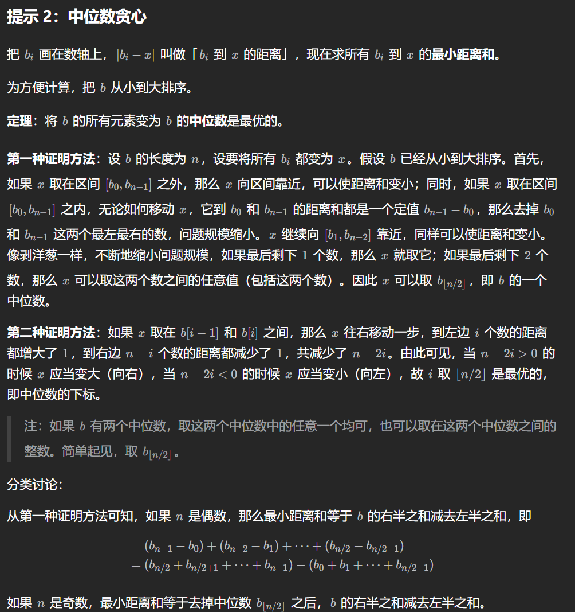

> 最后面的这个就是结论，分奇偶性讨论

295\. 数据流的中位数
-------------

**中位数**是有序整数列表中的中间值。如果列表的大小是偶数，则没有中间值，中位数是两个中间值的平均值。

*   例如 `arr = [2,3,4]` 的中位数是 `3` 。
*   例如 `arr = [2,3]` 的中位数是 `(2 + 3) / 2 = 2.5` 。

实现 MedianFinder 类:

*   `MedianFinder()` 初始化 `MedianFinder` 对象。

*   `void addNum(int num)` 将数据流中的整数 `num` 添加到数据结构中。

*   `double findMedian()` 返回到目前为止所有元素的中位数。与实际答案相差 `10-5` 以内的答案将被接受。


**示例 1：**

**输入**
\["MedianFinder", "addNum", "addNum", "findMedian", "addNum", "findMedian"\]
\[\[\], \[1\], \[2\], \[\], \[3\], \[\]\]
**输出**
\[null, null, null, 1.5, null, 2.0\]

**解释**
MedianFinder medianFinder = new MedianFinder();
medianFinder.addNum(1);    // arr = \[1\]
medianFinder.addNum(2);    // arr = \[1, 2\]
medianFinder.findMedian(); // 返回 1.5 ((1 + 2) / 2)
medianFinder.addNum(3);    // arr\[1, 2, 3\]
medianFinder.findMedian(); // return 2.0

**提示:**

*   `-105 <= num <= 105`
*   在调用 `findMedian` 之前，数据结构中至少有一个元素
*   最多 `5 * 104` 次调用 `addNum` 和 `findMedian`

[https://leetcode.cn/problems/find-median-from-data-stream/description/](https://leetcode.cn/problems/find-median-from-data-stream/description/)

```java
import java.util.PriorityQueue;

class MedianFinder {
    PriorityQueue<Integer> pq1 = new PriorityQueue<Integer>((a, b) -> b - a);
    PriorityQueue<Integer> pq2 = new PriorityQueue<Integer>(); // 小顶堆，保留较大的一半
    public MedianFinder() {

    }

    public void addNum(int num) { // 保证优先给pq2
        if (pq1.size() != pq2.size()) {
            // 需要给一个元素到pq2
            pq2.offer(num);
            pq1.offer(pq2.poll());
        }else{
            pq1.offer(num);
            pq2.offer(pq1.poll());
        }
    }

    public double findMedian() {
        return pq1.size() != pq2.size() ? pq2.peek() : (pq1.peek() + pq2.peek()) / 2.0;
    }
}

/**
 * Your MedianFinder object will be instantiated and called as such:
 * MedianFinder obj = new MedianFinder();
 * obj.addNum(num);
 * double param_2 = obj.findMedian();
 */
```

LCP 24. 数字游戏
------------

小扣在秋日市集入口处发现了一个数字游戏。主办方共有 `N` 个计数器，计数器编号为 `0 ~ N-1`。每个计数器上分别显示了一个数字，小扣按计数器编号升序将所显示的数字记于数组 `nums`。每个计数器上有两个按钮，分别可以实现将显示数字加一或减一。小扣每一次操作可以选择一个计数器，按下加一或减一按钮。

主办方请小扣回答出一个长度为 `N` 的数组，第 `i` 个元素(0 <= i < N)表示将 `0~i` 号计数器 **初始** 所示数字操作成满足所有条件 `nums[a]+1 == nums[a+1],(0 <= a < i)` 的最小操作数。回答正确方可进入秋日市集。

由于答案可能很大，请将每个最小操作数对 `1,000,000,007` 取余。

**示例 1：**

> 输入：`nums = [3,4,5,1,6,7]`
>
> 输出：`[0,0,0,5,6,7]`
>
> 解释： i = 0，\[3\] 无需操作 i = 1，\[3,4\] 无需操作； i = 2，\[3,4,5\] 无需操作； i = 3，将 \[3,4,5,1\] 操作成 \[3,4,5,6\], 最少 5 次操作； i = 4，将 \[3,4,5,1,6\] 操作成 \[3,4,5,6,7\], 最少 6 次操作； i = 5，将 \[3,4,5,1,6,7\] 操作成 \[3,4,5,6,7,8\]，最少 7 次操作； 返回 \[0,0,0,5,6,7\]。

**示例 2：**

> 输入：`nums = [1,2,3,4,5]`
>
> 输出：`[0,0,0,0,0]`
>
> 解释：对于任意计数器编号 i 都无需操作。

**示例 3：**

> 输入：`nums = [1,1,1,2,3,4]`
>
> 输出：`[0,1,2,3,3,3]`
>
> 解释： i = 0，无需操作； i = 1，将 \[1,1\] 操作成 \[1,2\] 或 \[0,1\] 最少 1 次操作； i = 2，将 \[1,1,1\] 操作成 \[1,2,3\] 或 \[0,1,2\]，最少 2 次操作； i = 3，将 \[1,1,1,2\] 操作成 \[1,2,3,4\] 或 \[0,1,2,3\]，最少 3 次操作； i = 4，将 \[1,1,1,2,3\] 操作成 \[-1,0,1,2,3\]，最少 3 次操作； i = 5，将 \[1,1,1,2,3,4\] 操作成 \[-1,0,1,2,3,4\]，最少 3 次操作； 返回 \[0,1,2,3,3,3\]。

**提示：**

*   `1 <= nums.length <= 10^5`
*   `1 <= nums[i] <= 10^3`

[https://leetcode.cn/problems/5TxKeK/description/](https://leetcode.cn/problems/5TxKeK/description/)

```java
import java.util.PriorityQueue;

class Solution {
    private static int Mod = (int) 1e9 + 7;
    public int[] numsGame(int[] nums) {
        int n = nums.length;
        int[] ans = new int[n];
        PriorityQueue<Integer> left = new PriorityQueue<>((a, b) -> b - a);
        PriorityQueue<Integer> right = new PriorityQueue<>();
        long leftSum = 0, rightSum = 0;
        for (int i = 0; i < n; i++) { // 这里的奇偶处理就是保证 (左边==右边 || 左边==右边+1)
            int target = nums[i] - i;
            if (i % 2 == 0) { // 前缀长度是奇数
                if (!left.isEmpty() && target < left.peek()) {
                    leftSum += target - left.peek();
                    left.offer(target);
                    target = left.poll(); // target在这里变了
                }
                rightSum += target;
                right.offer(target);
                ans[i] = (int) ((rightSum - leftSum - right.peek()) % Mod);
            }else{ // 前缀长度是偶数
                if (target > right.peek()) {
                    rightSum += target - right.peek();
                    right.offer(target);
                    target = right.poll();
                }
                leftSum += target;
                left.offer(target);
                ans[i] = (int) ((rightSum - leftSum) % Mod);
            }
        }
        return ans;
    }
}
```

3086\. 拾起 K 个 1 需要的最少行动次数
-------------------------

给你一个下标从 **0** 开始的二进制数组 `nums`，其长度为 `n` ；另给你一个 **正整数** `k` 以及一个 **非负整数** `maxChanges` 。

Alice 在玩一个游戏，游戏的目标是让 Alice 使用 **最少** 数量的 **行动** 次数从 `nums` 中拾起 `k` 个 1 。游戏开始时，Alice 可以选择数组 `[0, n - 1]` 范围内的任何索引 `aliceIndex` 站立。如果 `nums[aliceIndex] == 1` ，Alice 会拾起一个 1 ，并且 `nums[aliceIndex]` 变成`0`（这 **不算** 作一次行动）。之后，Alice 可以执行 **任意数量** 的 **行动**（**包括****零次**），在每次行动中 Alice 必须 **恰好** 执行以下动作之一：

*   选择任意一个下标 `j != aliceIndex` 且满足 `nums[j] == 0` ，然后将 `nums[j]` 设置为 `1` 。这个动作最多可以执行 `maxChanges` 次。
*   选择任意两个相邻的下标 `x` 和 `y`（`|x - y| == 1`）且满足 `nums[x] == 1`, `nums[y] == 0` ，然后交换它们的值（将 `nums[y] = 1` 和 `nums[x] = 0`）。如果 `y == aliceIndex`，在这次行动后 Alice 拾起一个 1 ，并且 `nums[y]` 变成 `0` 。

返回 Alice 拾起 **恰好** `k` 个 1 所需的 **最少** 行动次数。

**示例 1：**

**输入：**nums = \[1,1,0,0,0,1,1,0,0,1\], k = 3, maxChanges = 1

**输出：**3

**解释：**如果游戏开始时 Alice 在 `aliceIndex == 1` 的位置上，按照以下步骤执行每个动作，他可以利用 `3` 次行动拾取 `3` 个 1 ：

*   游戏开始时 Alice 拾取了一个 1 ，`nums[1]` 变成了 `0`。此时 `nums` 变为 `[1,**1**,1,0,0,1,1,0,0,1]` 。
*   选择 `j == 2` 并执行第一种类型的动作。`nums` 变为 `[1,**0**,1,0,0,1,1,0,0,1]`
*   选择 `x == 2` 和 `y == 1` ，并执行第二种类型的动作。`nums` 变为 `[1,**1**,0,0,0,1,1,0,0,1]` 。由于 `y == aliceIndex`，Alice 拾取了一个 1 ，`nums` 变为  `[1,**0**,0,0,0,1,1,0,0,1]` 。
*   选择 `x == 0` 和 `y == 1` ，并执行第二种类型的动作。`nums` 变为 `[0,**1**,0,0,0,1,1,0,0,1]` 。由于 `y == aliceIndex`，Alice 拾取了一个 1 ，`nums` 变为  `[0,**0**,0,0,0,1,1,0,0,1]` 。

请注意，Alice 也可能执行其他的 `3` 次行动序列达成拾取 `3` 个 1 。

**示例 2：**

**输入：**nums = \[0,0,0,0\], k = 2, maxChanges = 3

**输出：**4

**解释：**如果游戏开始时 Alice 在 `aliceIndex == 0` 的位置上，按照以下步骤执行每个动作，他可以利用 `4` 次行动拾取 `2` 个 1 ：

*   选择 `j == 1` 并执行第一种类型的动作。`nums` 变为 `[**0**,1,0,0]` 。
*   选择 `x == 1` 和 `y == 0` ，并执行第二种类型的动作。`nums` 变为 `[**1**,0,0,0]` 。由于 `y == aliceIndex`，Alice 拾起了一个 1 ，`nums` 变为 `[**0**,0,0,0]` 。
*   再次选择 `j == 1` 并执行第一种类型的动作。`nums` 变为 `[**0**,1,0,0]` 。
*   再次选择 `x == 1` 和 `y == 0` ，并执行第二种类型的动作。`nums` 变为 `[**1**,0,0,0]` 。由于`y == aliceIndex`，Alice 拾起了一个 1 ，`nums` 变为 `[**0**,0,0,0]` 。

**提示：**

*   `2 <= n <= 105`
*   `0 <= nums[i] <= 1`
*   `1 <= k <= 105`
*   `0 <= maxChanges <= 105`
*   `maxChanges + sum(nums) >= k`

[https://leetcode.cn/problems/minimum-moves-to-pick-k-ones/description/?envType=daily-question&envId=2024-07-04](https://leetcode.cn/problems/minimum-moves-to-pick-k-ones/description/?envType=daily-question&envId=2024-07-04)

```java
import java.util.ArrayList;
import java.util.List;

class Solution {
    public long minimumMoves(int[] nums, int k, int maxChanges) {
        List<Integer> pos = new ArrayList<>();
        int c = 0; // nums 中连续的 1 长度
        for (int i = 0; i < nums.length; i++) {
            if (nums[i] == 0) continue;
            pos.add(i); // 记录 1 的位置
            c = Math.max(c, 1);
            if (i > 0 && nums[i - 1] == 1) {
                if (i > 1 && nums[i - 2] == 1) {
                    c = 3; // 有 3 个连续的 1
                } else {
                    c = Math.max(c, 2); // 有 2 个连续的 1
                }
            }
        }

        c = Math.min(c, k);
        if (maxChanges >= k - c) {
            // 其余 k-c 个 1 可以全部用两次操作得到
            return Math.max(c - 1, 0) + (k - c) * 2;
        }

        int n = pos.size();
        long[] sum = new long[n + 1];
        for (int i = 0; i < n; i++) {
            sum[i + 1] = sum[i] + pos.get(i);
        }

        long ans = Long.MAX_VALUE;
        // 除了 maxChanges 个数可以用两次操作得到，其余的 1 只能一步步移动到 pos[i]
        int size = k - maxChanges;
        for (int right = size; right <= n; right++) {
            // s1+s2 是 j 在 [left, right) 中的所有 pos[j] 到 index=pos[(left+right)/2] 的距离之和
            int left = right - size;
            int i = left + size / 2;
            long index = pos.get(i);
            long s1 = index * (i - left) - (sum[i] - sum[left]);
            long s2 = sum[right] - sum[i] - index * (right - i);
            ans = Math.min(ans, s1 + s2);
        }
        return ans + maxChanges * 2L;
    }
}

```

2448\. 使数组相等的最小开销
-----------------

给你两个下标从 **0** 开始的数组 `nums` 和 `cost` ，分别包含 `n` 个 **正** 整数。

你可以执行下面操作 **任意** 次：

*   将 `nums` 中 **任意** 元素增加或者减小 `1` 。

对第 `i` 个元素执行一次操作的开销是 `cost[i]` 。

请你返回使 `nums` 中所有元素 **相等** 的 **最少** 总开销。

**示例 1：**

**输入：**nums = \[1,3,5,2\], cost = \[2,3,1,14\]
**输出：**8
**解释：**我们可以执行以下操作使所有元素变为 2 ：
- 增加第 0 个元素 1 次，开销为 2 。
- 减小第 1 个元素 1 次，开销为 3 。
- 减小第 2 个元素 3 次，开销为 1 + 1 + 1 = 3 。
  总开销为 2 + 3 + 3 = 8 。
  这是最小开销。

**示例 2：**

**输入：**nums = \[2,2,2,2,2\], cost = \[4,2,8,1,3\]
**输出：**0
**解释：**数组中所有元素已经全部相等，不需要执行额外的操作。

**提示：**

*   `n == nums.length == cost.length`
*   `1 <= n <= 105`
*   `1 <= nums[i], cost[i] <= 106`
*   测试用例确保输出不超过 253\-1。

[https://leetcode.cn/problems/minimum-cost-to-make-array-equal/description/](https://leetcode.cn/problems/minimum-cost-to-make-array-equal/description/)

```java
import java.util.Arrays;

class Solution {
    public long minCost(int[] nums, int[] cost) { // 把成本当作出现次数做法
        int n = nums.length;
        long total = 0;
        for (int c : cost) {
            total += c;
        }
        total = (total + 1) / 2;
        int[][] pairs = new int[n][2];
        for (int i = 0; i < n; i++) {
            pairs[i][0] = nums[i];
            pairs[i][1] = cost[i];
        }
        Arrays.sort(pairs, (a, b) -> a[0] - b[0]);
        long cnt = 0, ans = 0;
        int target = 0;
        for (int i = 0; i < n; i++) {
            if (cnt + pairs[i][1] < total) {
                cnt += pairs[i][1];
            }else{
                target = pairs[i][0];
                break;
            }
        }
        for (int i = 0; i < n; i++) {
            ans += ((long) Math.abs(target - nums[i]) * cost[i]);
        }
        return ans;

    }
}
```

```java
// 二分做法
    public long minCost(int[] nums, int[] cost) {
        int l = 0, r = 1000010;
        while (l < r) {
            int mid = (l + r) >> 1;
            //每次取mid和mid+1对应的总cost，如果前者总cost小于后者，说明最优解在左边，如果大于，则在右边
            long cost1 = getCost(nums, cost, mid);
            long cost2 = getCost(nums, cost, mid + 1);
            if (cost1 < cost2) {
                r = mid;
            } else {
                l = mid + 1;
            }
        }
        return getCost(nums, cost, l);
    }
    long getCost(int[] nums , int[] cost , int t){
        long ret = 0;
        for(int i = 0 ; i < nums.length ; i++){
            ret += 1L*Math.abs(nums[i] - t) * cost[i];
        }
        return ret;
    }
```

2607\. 使子数组元素和相等(裴蜀定理)
----------------

给你一个下标从 **0** 开始的整数数组 `arr` 和一个整数 `k` 。数组 `arr` 是一个循环数组。换句话说，数组中的最后一个元素的下一个元素是数组中的第一个元素，数组中第一个元素的前一个元素是数组中的最后一个元素。

你可以执行下述运算任意次：

*   选中 `arr` 中任意一个元素，并使其值加上 `1` 或减去 `1` 。

执行运算使**每个长度为 `k` 的 子数组** 的元素总和都相等，返回所需要的最少运算次数。

**子数组** 是数组的一个连续部分。

**示例 1：**

**输入：**arr = \[1,4,1,3\], k = 2
**输出：**1
**解释：**在下标为 1 的元素那里执行一次运算，使其等于 3 。
执行运算后，数组变为 \[1,3,1,3\] 。
- 0 处起始的子数组为 \[1, 3\] ，元素总和为 4 
- 1 处起始的子数组为 \[3, 1\] ，元素总和为 4 
- 2 处起始的子数组为 \[1, 3\] ，元素总和为 4 
- 3 处起始的子数组为 \[3, 1\] ，元素总和为 4 

**示例 2：**

**输入：**arr = \[2,5,5,7\], k = 3
**输出：**5
**解释：**在下标为 0 的元素那里执行三次运算，使其等于 5 。在下标为 3 的元素那里执行两次运算，使其等于 5 。
执行运算后，数组变为 \[5,5,5,5\] 。
- 0 处起始的子数组为 \[5, 5, 5\] ，元素总和为 15
- 1 处起始的子数组为 \[5, 5, 5\] ，元素总和为 15
- 2 处起始的子数组为 \[5, 5, 5\] ，元素总和为 15
- 3 处起始的子数组为 \[5, 5, 5\] ，元素总和为 15

**提示：**

*   `1 <= k <= arr.length <= 105`
*   `1 <= arr[i] <= 109`

[https://leetcode.cn/problems/make-k-subarray-sums-equal/description/](https://leetcode.cn/problems/make-k-subarray-sums-equal/description/)

> 这里的裴蜀定理用来推**一个循环数组如果既有周期 n，又有周期 k，则必然有周期 gcd(n,k)。** 

```java
class Solution {
    public long makeSubKSumEqual(int[] arr, int k) { // 裴蜀定理
        int n = arr.length;
        k = gcd(k, n);
        long ans = 0;
        for (int i = 0; i < k; ++i) {
            var b = new ArrayList<Integer>();
            for (int j = i; j < n; j += k)
                b.add(arr[j]);
            Collections.sort(b);
            int mid = b.get(b.size() / 2);
            for (int x : b)
                ans += Math.abs(x - mid);
        }
        return ans;
    }

    private int gcd(int a, int b) {
        while (a != 0) {
            int tmp = a;
            a = b % a;
            b = tmp;
        }
        return b;
    }
}
```

2967\. 使数组成为等数数组的最小代价
---------------------

给你一个长度为 `n` 下标从 **0** 开始的整数数组 `nums` 。

你可以对 `nums` 执行特殊操作 **任意次** （也可以 **0** 次）。每一次特殊操作中，你需要 **按顺序** 执行以下步骤：

*   从范围 `[0, n - 1]` 里选择一个下标 `i` 和一个 **正** 整数 `x` 。
*   将 `|nums[i] - x|` 添加到总代价里。
*   将 `nums[i]` 变为 `x` 。

如果一个正整数正着读和反着读都相同，那么我们称这个数是 **回文数** 。比方说，`121` ，`2552` 和 `65756` 都是回文数，但是 `24` ，`46` ，`235` 都不是回文数。

如果一个数组中的所有元素都等于一个整数 `y` ，且 `y` 是一个小于 `109` 的 **回文数** ，那么我们称这个数组是一个 **等数数组** 。

请你返回一个整数，表示执行任意次特殊操作后使 `nums` 成为 **等数数组** 的 **最小** 总代价。

**示例 1：**

**输入：**nums = \[1,2,3,4,5\]
**输出：**6
**解释：**我们可以将数组中所有元素变为回文数 3 得到等数数组，数组变成 \[3,3,3,3,3\] 需要执行 4 次特殊操作，代价为 |1 - 3| + |2 - 3| + |4 - 3| + |5 - 3| = 6 。
将所有元素变为其他回文数的总代价都大于 6 。

**示例 2：**

**输入：**nums = \[10,12,13,14,15\]
**输出：**11
**解释：**我们可以将数组中所有元素变为回文数 11 得到等数数组，数组变成 \[11,11,11,11,11\] 需要执行 5 次特殊操作，代价为 |10 - 11| + |12 - 11| + |13 - 11| + |14 - 11| + |15 - 11| = 11 。
将所有元素变为其他回文数的总代价都大于 11 。

**示例 3 ：**

**输入：**nums = \[22,33,22,33,22\]
**输出：**22
**解释：**我们可以将数组中所有元素变为回文数 22 得到等数数组，数组变为 \[22,22,22,22,22\] 需要执行 2 次特殊操作，代价为 |33 - 22| + |33 - 22| = 22 。
将所有元素变为其他回文数的总代价都大于 22 。

**提示：**

*   `1 <= n <= 105`
*   `1 <= nums[i] <= 109`

[https://leetcode.cn/problems/minimum-cost-to-make-array-equalindromic/description/](https://leetcode.cn/problems/minimum-cost-to-make-array-equalindromic/description/)

```java
import java.util.Arrays;

class Solution {
    private static final int[] pal = new int[109999];
    static {
        // 严格按顺序从小到大生成回文数（不用字符串转换）
        int palIdx = 0;
        for (int base = 1; base <= 10000; base *= 10) {
            // 生成奇数长度回文数
            for (int i = base; i < base * 10; i++) {
                int x = i;
                for (int t = i / 10; t > 0; t /= 10) {
                    x = x * 10 + t % 10;
                }
                pal[palIdx++] = x;
            }
            // 生成偶数长度回文数
            if (base <= 1000) {
                for (int i = base; i < base * 10; i++) {
                    int x = i;
                    for (int t = i; t > 0; t /= 10) {
                        x = x * 10 + t % 10;
                    }
                    pal[palIdx++] = x;
                }
            }
        }
        pal[palIdx++] = 1_000_000_001; // 哨兵，防止下面代码中的 i 下标越界
    }
    public long minimumCost(int[] nums) {
        // 注：排序只是为了找中位数，如果用快速选择算法，可以做到 O(n)
        Arrays.sort(nums);
        int n = nums.length;
        // 二分找中位数右侧最近的回文数
        int i = lowerBound(nums[(n - 1) / 2]);
        // 回文数在中位数范围内
        if (pal[i] <= nums[n / 2]) {
            return cost(nums, i);
        }
        // 枚举离中位数最近的两个回文数 pal[i-1] 和 pal[i]
        return Math.min(cost(nums, i - 1), cost(nums, i));
    }

    private long cost(int[] nums, int i) {
        int target = pal[i];
        long ans = 0;
        for (int x : nums) {
            ans += Math.abs(x - target);
        }
        return ans;
    }

    private int lowerBound(int target) {
        int left = 0, right = pal.length - 1;
        while (left < right) {
            int mid = left + (right - left) / 2;
            if (pal[mid] < target) {
                left = mid + 1;
            }else{
                right = mid;
            }
        }
        return left;
    }
}
```

2968\. 执行操作使频率分数最大
------------------

给你一个下标从 **0** 开始的整数数组 `nums` 和一个整数 `k` 。

你可以对数组执行 **至多** `k` 次操作：

*   从数组中选择一个下标 `i` ，将 `nums[i]` **增加** 或者 **减少** `1` 。

最终数组的频率分数定义为数组中众数的 **频率** 。

请你返回你可以得到的 **最大** 频率分数。

众数指的是数组中出现次数最多的数。一个元素的频率指的是数组中这个元素的出现次数。

**示例 1：**

**输入：**nums = \[1,2,6,4\], k = 3
**输出：**3
**解释：**我们可以对数组执行以下操作：
- 选择 i = 0 ，将 nums\[0\] 增加 1 。得到数组 \[2,2,6,4\] 。
- 选择 i = 3 ，将 nums\[3\] 减少 1 ，得到数组 \[2,2,6,3\] 。
- 选择 i = 3 ，将 nums\[3\] 减少 1 ，得到数组 \[2,2,6,2\] 。
  元素 2 是最终数组中的众数，出现了 3 次，所以频率分数为 3 。
  3 是所有可行方案里的最大频率分数。

**示例 2：**

**输入：**nums = \[1,4,4,2,4\], k = 0
**输出：**3
**解释：**我们无法执行任何操作，所以得到的频率分数是原数组中众数的频率 3 。

**提示：**

*   `1 <= nums.length <= 105`
*   `1 <= nums[i] <= 109`
*   `0 <= k <= 1014`

[https://leetcode.cn/problems/apply-operations-to-maximize-frequency-score/description/](https://leetcode.cn/problems/apply-operations-to-maximize-frequency-score/description/)

```java
import java.util.Arrays;

class Solution {
    public int maxFrequencyScore(int[] nums, long k) {
        Arrays.sort(nums);
        int n = nums.length;
        long[] prefix = new long[n + 1];
        for (int i = 0; i < n; i++) {
            prefix[i + 1] = prefix[i] + nums[i];
        }
        int ans = 0, left = 0;
        for (int right = 0; right < n; right++) {
            while (distanceSum(prefix, nums, left, right, (left + right) / 2) > k) {
                left++;
            }
            ans = Math.max(ans, right - left + 1);
        }
        return ans;
    }

    // 把 nums[l] 到 nums[r] 都变成 nums[i]的距离
    private long distanceSum(long[] prefix, int[] nums, int left, int right, int median) {
        long leftSum = (long) nums[median] * (median - left) - (prefix[median] - prefix[left]);
        long rightSum = prefix[right + 1] - prefix[median + 1] - (long) (right - median) * nums[median];
        return leftSum + rightSum;
    }
}
```

