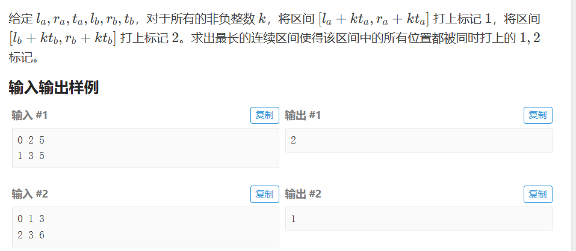
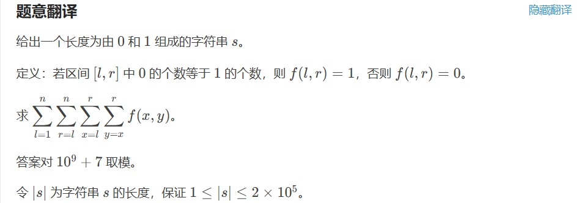

## 【模板：斐蜀定理】

[C. Lucky Days ](https://codeforces.com/problemset/problem/1055/C)



```java
public class Main { 
    // 首先尽可能让左端点重合，然后有左端点的等式：la + x*ta = lb + y*tb
    // 变形可得 x*ta + (-y*tb) = lb - la
    // 发现就是斐蜀定理：如果 a*x + b*y = gcd(a,b)，则x,y一定有整数解
    // 则有 lb - la = gcd(ta, tb),就起点相同了。
    // 但是如果左端点不能重合怎么办，尽可能逼近就行。
    private static void solve() throws IOException { // 真的太优雅了！！！
        ss = sc.nextLine().split(" ");
        int la = Integer.parseInt(ss[0]), ra = Integer.parseInt(ss[1]), ta = Integer.parseInt(ss[2]);
        ss = sc.nextLine().split(" ");
        int lb = Integer.parseInt(ss[0]), rb = Integer.parseInt(ss[1]), tb = Integer.parseInt(ss[2]);
        int lenA = ra - la + 1, lenB = rb - lb + 1, d = gcd(ta, tb);
        int x = la - lb; // 相对起点距离
        x = (x % d + d) % d; // 保证结果为正，负数取模转正数
        int ans = Math.max(0, Math.max(Math.min(x + lenA, lenB) - x, Math.min(x - d + lenA, lenB))); // 讨论起点在左边还是右边
        sc.println(ans);
    }
    
    private static int gcd(int a, int b) {
        return b == 0 ? a : gcd(b, a % b);
    }
}
```

- 进制转换：直接Integer.toString(num,需要转换的进制)

- > 在一个正整数x的结尾增加尽可能少的数字，使得该数字变成495的倍数。请你给出任意一个添加方案。

  - 对于这种问题，我们找上界，因为495是三位数，即最多添加三位数。
  - 理由：因为我们可以对任何一个数*1000（除数的位数，495是3位数，就*1000），那么加上（0~999）一定可以被Mod整除！这个结论很好推理，随便举两个例子就好了

$$
\left\lceil\frac{a}{b}\right\rceil=\left\lfloor\frac{a+b-1}{b}\right\rfloor
$$

- 负数取模转正数：x = (x % Mod + Mod) % Mod


```java
import java.io.BufferedReader;
import java.io.InputStreamReader;
import java.util.Scanner;
// https://www.luogu.com.cn/problem/P10510
public class Main{ // 被进制转换狠狠的上了一课
    static Scanner sc = new Scanner(new BufferedReader(new InputStreamReader(System.in)));
    public static void main(String[] args) {
        long V = sc.nextLong();
        int q = sc.nextInt();
        int[] a = new int[38];
        int t = 0;
        while (V != 0) {
            a[t++] = (int) (V % 3);
            V /= 3;
        }
        while (q-- > 0) {
            int op = sc.nextInt();
            int x = sc.nextInt();
            if (op <= 2) {
                a[x] = (a[x] + op) % 3;
            } else {
                a[x] = (3 - a[x]) % 3;
            }
            long ans = 0;
            for (int i = 37; i >= 0; i--) { // 这个就对，在0-int范围两种写法相同，但是int-long就只有这种是对的
                ans = ans * 3 + a[i];
            }
//            for (int j = 0; j < a.length; j++) { 这个就是错的，我真的无语。我懂了，这个超过int型就不对了，所以记住上面的写法
//                ans += (long) Math.pow(3, j) * a[j];
//            }
            System.out.println(ans);
        }
    }

}
```

1927\. 求和游戏
-----------

Alice 和 Bob 玩一个游戏，两人轮流行动，**Alice 先手** 。

给你一个 **偶数长度** 的字符串 `num` ，每一个字符为数字字符或者 `'?'` 。每一次操作中，如果 `num` 中至少有一个 `'?'` ，那么玩家可以执行以下操作：

1.  选择一个下标 `i` 满足 `num[i] == '?'` 。
2.  将 `num[i]` 用 `'0'` 到 `'9'` 之间的一个数字字符替代。

当 `num` 中没有 `'?'` 时，游戏结束。

Bob 获胜的条件是 `num` 中前一半数字的和 **等于** 后一半数字的和。Alice 获胜的条件是前一半的和与后一半的和 **不相等** 。

*   比方说，游戏结束时 `num = "243801"` ，那么 Bob 获胜，因为 `2+4+3 = 8+0+1` 。如果游戏结束时 `num = "243803"` ，那么 Alice 获胜，因为 `2+4+3 != 8+0+3` 。

在 Alice 和 Bob 都采取 **最优** 策略的前提下，如果 Alice 获胜，请返回 `true` ，如果 Bob 获胜，请返回 `false` 。

**示例 1：**

**输入：**num = "5023"
**输出：**false
**解释：**num 中没有 '?' ，没法进行任何操作。
前一半的和等于后一半的和：5 + 0 = 2 + 3 。

**示例 2：**

**输入：**num = "25??"
**输出：**true
**解释：**Alice 可以将两个 '?' 中的一个替换为 '9' ，Bob 无论如何都无法使前一半的和等于后一半的和。

**示例 3：**

**输入：**num = "?3295???"
**输出：**false
**解释：**Bob 总是能赢。一种可能的结果是：
- Alice 将第一个 '?' 用 '9' 替换。num = "93295???" 。
- Bob 将后面一半中的一个 '?' 替换为 '9' 。num = "932959??" 。
- Alice 将后面一半中的一个 '?' 替换为 '2' 。num = "9329592?" 。
- Bob 将后面一半中最后一个 '?' 替换为 '7' 。num = "93295927" 。
  Bob 获胜，因为 9 + 3 + 2 + 9 = 5 + 9 + 2 + 7 。

**提示：**

*   `2 <= num.length <= 105`
*   `num.length` 是 **偶数** 。
*   `num` 只包含数字字符和 `'?'` 。

[https://leetcode.cn/problems/sum-game/description/](https://leetcode.cn/problems/sum-game/description/)

```java
class Solution {
    public boolean sumGame(String num) {
        int sum1 = 0, sum2 = 0, count1 = 0, count2 = 0;// 前半数字和、后半数字和、前半问号数，后半问号数
        for (int i = 0; i < num.length() / 2; i++) {
            if (num.charAt(i) == '?') {
                count1++;
            } else {
                sum1 += num.charAt(i) - '0';
            }
        }
        for (int i = num.length() / 2; i < num.length(); i++) {
            if (num.charAt(i) == '?') {
                count2++;
            } else {
                sum2 += num.charAt(i) - '0';
            }
        }
        return (count1 + count2) % 2 == 1 || (sum1 - sum2) != 9 * (count2 - count1) / 2;
    }
}
```


> 
>
> #题目大意
>
> 首先选中一个区间 (x,y)，该区间内数字 1 的个数和与数字 0 的个数和应当相等，由于区间 (x,y) 是区间 (l,r) 的子串，而我们所要求的是对于所有满足条件的区间 (x,y)，一共有多少种区间 (l,r)。
>
> # 解析
>
> 首先经过简单的模拟，我们发现前缀和可以完好吻合这道题，我们维护一个见到 si=1 则 +1，反之见到 si=0 则 −1的前缀和，每当前缀和在某两位上的值相同时，例如 sumx=sumy，这表明区间 (x+1,y) 内的 1 数量的总和与 0 数量的总和相等，因此区间 (x+1,y) 对答案的贡献为 (x+1)×(n−y+1)，其中 n 为字符串总长度。
>
> ```java
> 	private static void solve() throws IOException { // 经典的不能再经典的套路题了
>         cs = sc.next().toCharArray();
>         n = cs.length;
>         long[] prefixSum = new long[n + 1];
>         for (int i = 0; i < n; i++) {
>             prefixSum[i + 1] = prefixSum[i] + (cs[i] == '1' ? 1 : -1);
>         }
>         HashMap<Long, List<Integer>> groups= new HashMap<>();
>         for (int i = 0; i <= n; i++) { // 按照前缀和分组
>             groups.computeIfAbsent(prefixSum[i], e -> new ArrayList<>()).add(i);
>         }
>         long ans = 0;
>         for (List<Integer> group : groups.values()) {
>             long sum = 0; // 前缀累计和
>             for (int i = 0; i < group.size(); i++) {
>                 int idx = group.get(i);
>                 if (i > 0) {
>                     long d = (n - idx + 1) % Mod;
>                     ans = (ans + sum * d) % Mod;
>                 }
>                 sum = (sum + idx + 1) % Mod; // 累加当前下标
>             }
>         }
>         sc.println(ans);
>     }
> ```
>
> 

