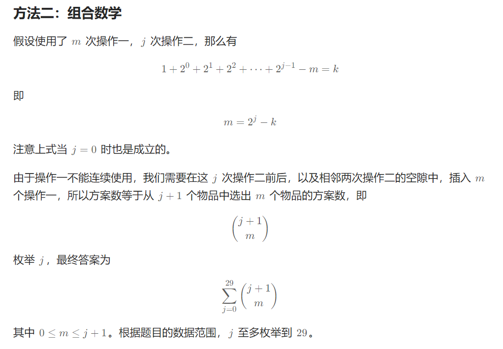
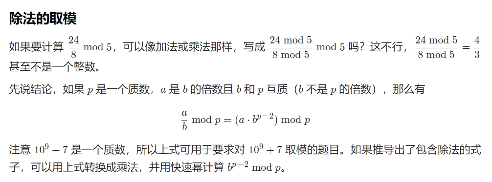
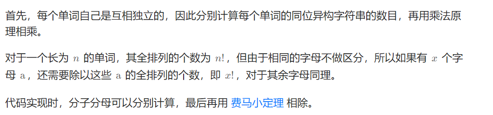

# §2.2 组合计数

1359\. 有效的快递序列数目
----------------

给你 `n` 笔订单，每笔订单都需要快递服务。

计算所有有效的 取货 / 交付 可能的顺序，使 delivery(i) 总是在 pickup(i) 之后。

由于答案可能很大，请返回答案对 10^9 + 7 取余的结果。

**示例 1：**

**输入：**n = 1
**输出：**1
**解释：**只有一种序列 (P1, D1)，物品 1 的配送服务（D1）在物品 1 的收件服务（P1）后。

**示例 2：**

**输入：**n = 2
**输出：**6
**解释：**所有可能的序列包括：
(P1,P2,D1,D2)，(P1,P2,D2,D1)，(P1,D1,P2,D2)，(P2,P1,D1,D2)，(P2,P1,D2,D1) 和 (P2,D2,P1,D1)。
(P1,D2,P2,D1) 是一个无效的序列，因为物品 2 的收件服务（P2）不应在物品 2 的配送服务（D2）之后。

**示例 3：**

**输入：**n = 3
**输出：**90

**提示：**

*   `1 <= n <= 500`

[https://leetcode.cn/problems/count-all-valid-pickup-and-delivery-options/description/](https://leetcode.cn/problems/count-all-valid-pickup-and-delivery-options/description/)

```java
class Solution {
    private static int Mod = (int) 1e9 + 7;
    public int countOrders(int n) {
        long ans = 1;
        for (long i = 2; i <= n; i++) {
            ans = ans * (2*i - 1)  % Mod * i % Mod;
        }
        return (int) ans;
    }
}
```

2400\. 恰好移动 k 步到达某一位置的方法数目
--------------------------

给你两个 **正** 整数 `startPos` 和 `endPos` 。最初，你站在 **无限** 数轴上位置 `startPos` 处。在一步移动中，你可以向左或者向右移动一个位置。

给你一个正整数 `k` ，返回从 `startPos` 出发、**恰好** 移动 `k` 步并到达 `endPos` 的 **不同** 方法数目。由于答案可能会很大，返回对 `109 + 7` **取余** 的结果。

如果所执行移动的顺序不完全相同，则认为两种方法不同。

**注意：**数轴包含负整数**。**

**示例 1：**

**输入：**startPos = 1, endPos = 2, k = 3
**输出：**3
**解释：**存在 3 种从 1 到 2 且恰好移动 3 步的方法：
- 1 -> 2 -> 3 -> 2.
- 1 -> 2 -> 1 -> 2.
- 1 -> 0 -> 1 -> 2.
  可以证明不存在其他方法，所以返回 3 。

**示例 2：**

**输入：**startPos = 2, endPos = 5, k = 10
**输出：**0
**解释：**不存在从 2 到 5 且恰好移动 10 步的方法。

**提示：**

*   `1 <= startPos, endPos, k <= 1000`

[https://leetcode.cn/problems/number-of-ways-to-reach-a-position-after-exactly-k-steps/description/](https://leetcode.cn/problems/number-of-ways-to-reach-a-position-after-exactly-k-steps/description/)

```java
import java.util.HashMap;

class Solution {
    private static int Mod = (int) 1e9 + 7;
    private HashMap<String, Integer> memo;
    public int numberOfWays(int startPos, int endPos, int k) { // 只会dfs哈哈哈
        if (k < Math.abs(endPos - startPos)) {
            return 0;
        }
        memo = new HashMap();
        return dfs(startPos, endPos, k);
    }

    private int dfs(int curPos, int endPos,int surplus) {
        if (curPos == endPos && surplus == 0) {
            return 1;
        }
        if (surplus == 0) {
            return 0;
        }
        String key = curPos + " " + surplus;
        if (memo.containsKey(key)) {
            return memo.get(key);
        }
        int ans = (dfs(curPos + 1, endPos, surplus - 1) + dfs(curPos - 1, endPos, surplus - 1)) % Mod;
        memo.put(key, ans);
        return ans;
    }
}
```

> $$
> 组合数递推公式：C_{i}^{j}=C_{i-1}^{j}+C_{i-1}^{j-1}
> $$
>

```java
class Solution {
    private static final int Mod = (int) 1e9 + 7;
    private static final int MX = 1001;
    private static final int[][] c = new int[MX][MX];
    static {
        for (int i = 0; i < MX; i++) {
            c[i][0] = c[i][i] = 1;
            for (int j = 1; j < i; j++) {
                c[i][j] = (c[i - 1][j - 1] + c[i - 1][j]) % Mod;
            }
        }
    }
    public int numberOfWays(int startPos, int endPos, int k) {
        int d = Math.abs(endPos - startPos);
        if ((k + d) % 2 == 1) {
            return 0;
        }
        return c[k][(k + d) / 2];
    }
}
```

100298\. 到达第 K 级台阶的方案数
----------------------

给你有一个 **非负** 整数 `k` 。有一个无限长度的台阶，**最低** 一层编号为 0 。

虎老师有一个整数 `jump` ，一开始值为 0 。虎老师从台阶 1 开始，虎老师可以使用 **任意** 次操作，目标是到达第 `k` 级台阶。假设虎老师位于台阶 `i` ，一次 **操作** 中，虎老师可以：

*   向下走一级到 `i - 1` ，但该操作 **不能** 连续使用，如果在台阶第 0 级也不能使用。
*   向上走到台阶 `i + 2jump` 处，然后 `jump` 变为 `jump + 1` 。

请你返回虎老师到达台阶 `k` 处的总方案数。

**注意** ，虎老师可能到达台阶 `k` 处后，通过一些操作重新回到台阶 `k` 处，这视为不同的方案。

**示例 1：**

**输入：**k = 0

**输出：**2

**解释：**

2 种到达台阶 0 的方案为：

*   虎老师从台阶 1 开始。
    *   执行第一种操作，从台阶 1 向下走到台阶 0 。
*   虎老师从台阶 1 开始。
    *   执行第一种操作，从台阶 1 向下走到台阶 0 。
    *   执行第二种操作，向上走 20 级台阶到台阶 1 。
    *   执行第一种操作，从台阶 1 向下走到台阶 0 。

**示例 2：**

**输入：**k = 1

**输出：**4

**解释：**

4 种到达台阶 1 的方案为：

*   虎老师从台阶 1 开始，已经到达台阶 1 。
*   虎老师从台阶 1 开始。
    *   执行第一种操作，从台阶 1 向下走到台阶 0 。
    *   执行第二种操作，向上走 20 级台阶到台阶 1 。
*   虎老师从台阶 1 开始。
    *   执行第二种操作，向上走 20 级台阶到台阶 2 。
    *   执行第一种操作，向下走 1 级台阶到台阶 1 。
*   虎老师从台阶 1 开始。
    *   执行第一种操作，从台阶 1 向下走到台阶 0 。
    *   执行第二种操作，向上走 20 级台阶到台阶 1 。
    *   执行第一种操作，向下走 1 级台阶到台阶 0 。
    *   执行第二种操作，向上走 21 级台阶到台阶 2 。
    *   执行第一种操作，向下走 1 级台阶到台阶 1 。

**提示：**

*   `0 <= k <= 109`

[https://leetcode.cn/problems/find-number-of-ways-to-reach-the-k-th-stair/solutions/2782792/liang-chong-fang-fa-ji-yi-hua-sou-suo-zu-j227/](https://leetcode.cn/problems/find-number-of-ways-to-reach-the-k-th-stair/solutions/2782792/liang-chong-fang-fa-ji-yi-hua-sou-suo-zu-j227/)

```java
import java.util.HashMap;

class Solution {
    HashMap<String, Integer> memo = new HashMap<>();
    public int waysToReachStair(int k) {
        if (k == 0) {
            return 2;
        }
        return dfs(1, 0, 0, k);
    }

    private int dfs(int i, int isUsed, int jump, int k) {
        if (i < 0) {
            return 0;
        }
        if ((i == k + 1 && isUsed == 0)) {
            return 1;
        }
        if (i > k + 1) {
            return 0;
        }
        String key = i + " " + " " + isUsed + " " + jump;
        if (memo.containsKey(key)) {
            return memo.get(key);
        }
        int res = dfs(i + (int) Math.pow(2, jump), 0, jump + 1, k);
        if (i == k) {
            res++;
        }
        if (isUsed == 0 && i != 0) {
            res += dfs(i - 1, 1, jump, k);
        }
        memo.put(key, res);
        return res;
    }
}
```



```java
class Solution {
    private static int MX = 31;
    private static int[][] c = new int[MX][MX];
    static {
        for (int i = 0; i < MX; i++) {
            c[i][i] = c[i][0] = 1;
            for (int j = 1; j < i; j++) {
                c[i][j] = c[i - 1][j - 1] + c[i - 1][j];
            }
        }
    }
    public int waysToReachStair(int k) {
        int ans = 0;
        for (int j = 0; j < 30; j++) {
            int m = (1 << j) - k;
            if (0 <= m && m <= j + 1) {
                ans += c[j + 1][m];
            }
        }
        return ans;
    }
}
```

2514\. 统计同位异构字符串数目(费马小定理+存在相同值的全排列)
------------------

https://leetcode.cn/circle/discuss/mDfnkW/

给你一个字符串 `s` ，它包含一个或者多个单词。单词之间用单个空格 `' '` 隔开。

如果字符串 `t` 中第 `i` 个单词是 `s` 中第 `i` 个单词的一个 **排列** ，那么我们称字符串 `t` 是字符串 `s` 的同位异构字符串。

*   比方说，`"acb dfe"` 是 `"abc def"` 的同位异构字符串，但是 `"def cab"` 和 `"adc bef"` 不是。

请你返回 `s` 的同位异构字符串的数目，由于答案可能很大，请你将它对 `109 + 7` **取余** 后返回。

**示例 1：**

**输入：**s = "too hot"
**输出：**18
**解释：**输入字符串的一些同位异构字符串为 "too hot" ，"oot hot" ，"oto toh" ，"too toh" 以及 "too oht" 。

**示例 2：**

**输入：**s = "aa"
**输出：**1
**解释：**输入字符串只有一个同位异构字符串。

**提示：**

*   `1 <= s.length <= 105`
*   `s` 只包含小写英文字母和空格 `' '` 。
*   相邻单词之间由单个空格隔开。

[https://leetcode.cn/problems/count-anagrams/](https://leetcode.cn/problems/count-anagrams/)





```java
import java.util.Arrays;

class Solution {
    private static int Mod = (int) 1e9 + 7;
    public int countAnagrams(String S) {
        char[] s = S.toCharArray();
        long ans = 1L, mul = 1L;
        int[] cnt = new int[26];
        for (int i = 0, j = 0; i < s.length; i++) {
            if (s[i] == ' ') {
                Arrays.fill(cnt, 0);
                j = 0;
            }else{
                mul = mul * ++cnt[s[i] - 'a'] % Mod;
                ans = ans * ++j % Mod;
            }
        }
        // BigInteger m = new BigInteger(Long.toString(mul));
        // BigInteger mod = new BigInteger(Integer.toString(Mod));
        // BigInteger pow = m.modPow(new BigInteger("-1"), mod);
        // String res = new BigInteger(Long.toString(ans)).multiply(pow).mod(mod).toString();
        // return Integer.parseInt(res); 这样也行，利用java的BigInteger
        return (int) (ans * pow(mul, Mod - 2) % Mod); // 这里就是我们求逆元，但是java可以用BigInteger
    }
    // 最后是a / b (mod p)
    private long pow(long x, int n) {
        long res = 1L;
        for (; n > 0; n /= 2) {
            if (n % 2 > 0) {
                res = res * x % Mod;
            }
            x = x * x % Mod;
        }
        return res;
    }
}
```

1643\. 第 K 条最小指令
----------------

Bob 站在单元格 `(0, 0)` ，想要前往目的地 `destination` ：`(row, column)` 。他只能向 **右** 或向 **下** 走。你可以为 Bob 提供导航 **指令** 来帮助他到达目的地 `destination` 。

**指令** 用字符串表示，其中每个字符：

*   `'H'` ，意味着水平向右移动
*   `'V'` ，意味着竖直向下移动

能够为 Bob 导航到目的地 `destination` 的指令可以有多种，例如，如果目的地 `destination` 是 `(2, 3)`，`"HHHVV"` 和 `"HVHVH"` 都是有效 **指令** 。

然而，Bob 很挑剔。因为他的幸运数字是 `k`，他想要遵循 **按字典序排列后的第 `k` 条最小指令** 的导航前往目的地 `destination` 。`k`  的编号 **从 1 开始** 。

给你一个整数数组 `destination` 和一个整数 `k` ，请你返回可以为 Bob 提供前往目的地 `destination` 导航的 **按字典序排列后的第 `k` 条最小指令** 。

**示例 1：**


**输入：**destination = \[2,3\], k = 1
**输出：**"HHHVV"
**解释：**能前往 (2, 3) 的所有导航指令 **按字典序排列后** 如下所示：
\["HHHVV", "HHVHV", "HHVVH", "HVHHV", "HVHVH", "HVVHH", "VHHHV", "VHHVH", "VHVHH", "VVHHH"\].

**示例 2：**

****

**输入：**destination = \[2,3\], k = 2
**输出：**"HHVHV"

**示例 3：**

****

**输入：**destination = \[2,3\], k = 3
**输出：**"HHVVH"

**提示：**

*   `destination.length == 2`
*   `1 <= row, column <= 15`
*   `1 <= k <= nCr(row + column, row)`，其中 `nCr(a, b)` 表示组合数，即从 `a` 个物品中选 `b` 个物品的不同方案数。

[https://leetcode.cn/problems/kth-smallest-instructions/description/](https://leetcode.cn/problems/kth-smallest-instructions/description/)

```java
class Solution {
    private static int MX = 31;
    private static int[][] c = new int[MX][MX];
    static {
        for (int i = 0; i < MX; i++) {
            c[i][i] = c[i][0] = 1;
            for (int j = 1; j < i; j++) {
                c[i][j] = c[i - 1][j - 1] + c[i - 1][j];
            }
        }
    }
    public String kthSmallestPath(int[] destination, int k) {
        int row = destination[0], col = destination[1];
        int total = row + col;
        StringBuilder sb = new StringBuilder();
        for (int i = 0; i < total && col > 0; i++) {
            int count = c[row + col - 1][col - 1]; // 如果当前位置填H的方案数，如果k<=count，那么就是填H；如果k>count，那么当前位置就应该填V,并且有k-=count,将当前位置填H的所有方案减去
            if (k <= count) {
                sb.append('H');
                col--;
            }else{
                sb.append('V');
                row--;
                k -= count;
            }
        }
        while (row > 0) {
            sb.append('V');
            row--;
        }
        return sb.toString();
    }
}
```


