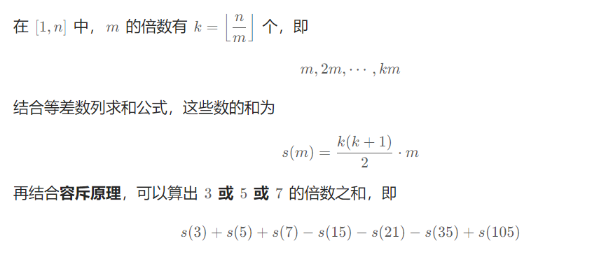

# §2.4 容斥原理

2652\. 倍数求和
-----------

给你一个正整数 `n` ，请你计算在 `[1，n]` 范围内能被 `3`、`5`、`7` 整除的所有整数之和。

返回一个整数，用于表示给定范围内所有满足约束条件的数字之和。

**示例 1：**

**输入：**n = 7
**输出：**21
**解释：**在 `[1, 7]` 范围内能被 `3`、`5`、`7` 整除的所有整数分别是 `3`、`5`、`6`、`7` 。数字之和为 `21`。

**示例 2：**

**输入：**n = 10
**输出：**40
**解释：**在 `[1, 10]` 范围内能被 `3`、`5`、`7` 整除的所有整数分别是 `3`、`5`、`6`、`7`、`9`、`10` 。数字之和为 `40`。

**示例 3：**

**输入：**n = 9
**输出：**30
**解释：**在 `[1, 9]` 范围内能被 `3`、`5`、`7` 整除的所有整数分别是 `3`、`5`、`6`、`7`、`9` 。数字之和为 `30`。

**提示：**

*   1 <= n <= 103

[https://leetcode.cn/problems/sum-multiples/solutions/2241283/o1-rong-chi-yuan-li-by-endlesscheng-yxc4/](https://leetcode.cn/problems/sum-multiples/solutions/2241283/o1-rong-chi-yuan-li-by-endlesscheng-yxc4/)

```java
class Solution {
    public int sumOfMultiples(int n) { // 暴力
        int ans = 0;
        for (int i = 1; i <= n; i++) {
            if (i % 3 == 0 || i % 5 == 0 || i % 7 == 0) {
                ans += i;
            }
        }
        return ans;
    }
}
```



```java
class Solution {
    public int sumOfMultiples(int n) {
        return f(n, 3) + f(n, 5) + f(n, 7) - f(n, 15) - f(n, 21) - f(n, 35) + f(n, 105);
    }

    private int f(int n, int m) {
        int k = n / m;
        return k * (k + 1) / 2 * m;
    }
}
```

878\. 第 N 个神奇数字
---------------

一个正整数如果能被 `a` 或 `b` 整除，那么它是神奇的。

给定三个整数 `n` , `a` , `b` ，返回第 `n` 个神奇的数字。因为答案可能很大，所以返回答案 **对** `109 + 7` **取模** 后的值。

**示例 1：**

**输入：**n = 1, a = 2, b = 3
**输出：**2

**示例 2：**

**输入：**n = 4, a = 2, b = 3
**输出：**6

**提示：**

*   `1 <= n <= 109`
*   `2 <= a, b <= 4 * 104`

[https://leetcode.cn/problems/nth-magical-number/](https://leetcode.cn/problems/nth-magical-number/)

```java
class Solution {
    private static int Mod = (int) 1e9 + 7;
    public int nthMagicalNumber(int n, int a, int b) {
        long lcm = (long) a / gcd(a, b) * b;
        long left = 1, right = (long) Math.min(a, b) * n;
        while (left <= right) {
            long mid = left + (right - left) / 2;
            if (f(mid, a, b, lcm) >= n) {
                right = mid - 1;
            }else{
                left = mid + 1;
            }
        }
        return (int) ((right + 1) % Mod);
    }

    private long f(long x, int a, int b, long lcm) {
        return x / a + x / b - x / lcm;
    }

    private int gcd(int a, int b) {
        return b == 0 ? a : gcd(b, a % b);
    }
}
```

1201\. 丑数 III
-------------

丑数是可以被 `a` **或** `b` **或** `c` 整除的 **正整数** 。

给你四个整数：`n` 、`a` 、`b` 、`c` ，请你设计一个算法来找出第 `n` 个丑数。

**示例 1：**

**输入：**n = 3, a = 2, b = 3, c = 5
**输出：**4
**解释：**丑数序列为 2, 3, 4, 5, 6, 8, 9, 10... 其中第 3 个是 4。

**示例 2：**

**输入：**n = 4, a = 2, b = 3, c = 4
**输出：**6
**解释：**丑数序列为 2, 3, 4, 6, 8, 9, 10, 12... 其中第 4 个是 6。

**示例 3：**

**输入：**n = 5, a = 2, b = 11, c = 13
**输出：**10
**解释：**丑数序列为 2, 4, 6, 8, 10, 11, 12, 13... 其中第 5 个是 10。

**提示：**

*   `1 <= n, a, b, c <= 109`
*   `1 <= a * b * c <= 1018`
*   本题结果在 `[1, 2 * 109]` 的范围内

[https://leetcode.cn/problems/ugly-number-iii/description/](https://leetcode.cn/problems/ugly-number-iii/description/)

```java
class Solution {
    public int nthUglyNumber(int n, int a, int b, int c) {
        long ab = lcm(a, b);
        long bc = lcm(b, c);
        long ac = lcm(a, c);
        long abc = lcm(c, lcm(a, b));
        long left = 1, right = (long) Math.min(c, Math.min(a, b)) * n;
        while (left <= right) {
            long mid = left + (right - left) / 2;
            if (f(mid, a, b, c, ab, bc, ac, abc) >= n) {
                right = mid - 1;
            } else {
                left = mid + 1;
            }
        }
        return (int) (right + 1);
    }

    private long f(long x, int a, int b, int c, long ab, long bc, long ac, long abc) {
        return x / a + x / b + x / c - x / ab - x / bc - x / ac + x / abc;
    }

    private long lcm(long a, long b) {
        return a / gcd(a, b) * b;
    }
    private long gcd(long a, long b) {
        return b == 0 ? a : gcd(b, a % b);
    }
}
```

2929\. 给小朋友们分糖果 II
------------------

给你两个正整数 `n` 和 `limit` 。

请你将 `n` 颗糖果分给 `3` 位小朋友，确保没有任何小朋友得到超过 `limit` 颗糖果，请你返回满足此条件下的 **总方案数** 。

**示例 1：**

**输入：**n = 5, limit = 2
**输出：**3
**解释：**总共有 3 种方法分配 5 颗糖果，且每位小朋友的糖果数不超过 2 ：(1, 2, 2) ，(2, 1, 2) 和 (2, 2, 1) 。

**示例 2：**

**输入：**n = 3, limit = 3
**输出：**10
**解释：**总共有 10 种方法分配 3 颗糖果，且每位小朋友的糖果数不超过 3 ：(0, 0, 3) ，(0, 1, 2) ，(0, 2, 1) ，(0, 3, 0) ，(1, 0, 2) ，(1, 1, 1) ，(1, 2, 0) ，(2, 0, 1) ，(2, 1, 0) 和 (3, 0, 0) 。

**提示：**

*   `1 <= n <= 106`
*   `1 <= limit <= 106`

[https://leetcode.cn/problems/distribute-candies-among-children-ii/description/](https://leetcode.cn/problems/distribute-candies-among-children-ii/description/)

```java
class Solution {
    public long distributeCandies(int n, int limit) {
        return c2(n + 2) - 3 * c2(n - limit + 1) + 3 * c2(n - 2 * limit) - c2(n - 3 * limit - 1);
    }

    private long c2(int n) {
        return n > 1 ? (long) n * (n - 1) / 2 : 0;
    }
}
```

2930\. 重新排列后包含指定子字符串的字符串数目
--------------------------

给你一个整数 `n` 。

如果一个字符串 `s` 只包含小写英文字母，**且** 将 `s` 的字符重新排列后，新字符串包含 **子字符串** `"leet"` ，那么我们称字符串 `s` 是一个 **好** 字符串。

比方说：

*   字符串 `"lteer"` 是好字符串，因为重新排列后可以得到 `"leetr"` 。
*   `"letl"` 不是好字符串，因为无法重新排列并得到子字符串 `"leet"` 。

请你返回长度为 `n` 的好字符串 **总** 数目。

由于答案可能很大，将答案对 `109 + 7` **取余** 后返回。

**子字符串** 是一个字符串中一段连续的字符序列。

**示例 1：**

**输入：**n = 4
**输出：**12
**解释：**总共有 12 个字符串重新排列后包含子字符串 "leet" ："eelt" ，"eetl" ，"elet" ，"elte" ，"etel" ，"etle" ，"leet" ，"lete" ，"ltee" ，"teel" ，"tele" 和 "tlee" 。

**示例 2：**

**输入：**n = 10
**输出：**83943898
**解释：**长度为 10 的字符串重新排列后包含子字符串 "leet" 的方案数为 526083947580 。所以答案为 526083947580 % (109 + 7) = 83943898 。

**提示：**

*   `1 <= n <= 105`

[https://leetcode.cn/problems/number-of-strings-which-can-be-rearranged-to-contain-substring/description/](https://leetcode.cn/problems/number-of-strings-which-can-be-rearranged-to-contain-substring/description/)

```java
// 正难则反
class Solution {
    private static int Mod = (int) 1e9 + 7;
    public int stringCount(int n) {
        return (int) (((pow(26, n) - (75 + n) * pow(25, n - 1) + (72 + 2 * n) * pow(24, n - 1) - (23 + n) * pow(23, n - 1)) % Mod + Mod) % Mod);
    }

    private long pow(long x, int n) { // 快速幂的x的类型一定是Long类型
        long res = 1;
        for (; n > 0; n /= 2) {
            if (n % 2 > 0) {
                res = res * x % Mod;
            }
            x = x * x % Mod;
        }
        return res;
    }
}
```

2513\. 最小化两个数组中的最大值
-------------------

给你两个数组 `arr1` 和 `arr2` ，它们一开始都是空的。你需要往它们中添加正整数，使它们满足以下条件：

*   `arr1` 包含 `uniqueCnt1` 个 **互不相同** 的正整数，每个整数都 **不能** 被 `divisor1` **整除** 。
*   `arr2` 包含 `uniqueCnt2` 个 **互不相同** 的正整数，每个整数都 **不能** 被 `divisor2` **整除** 。
*   `arr1` 和 `arr2` 中的元素 **互不相同** 。

给你 `divisor1` ，`divisor2` ，`uniqueCnt1` 和 `uniqueCnt2` ，请你返回两个数组中 **最大元素** 的 **最小值** 。

**示例 1：**

**输入：**divisor1 = 2, divisor2 = 7, uniqueCnt1 = 1, uniqueCnt2 = 3
**输出：**4
**解释：**
我们可以把前 4 个自然数划分到 arr1 和 arr2 中。
arr1 = \[1\] 和 arr2 = \[2,3,4\] 。
可以看出两个数组都满足条件。
最大值是 4 ，所以返回 4 。

**示例 2：**

**输入：**divisor1 = 3, divisor2 = 5, uniqueCnt1 = 2, uniqueCnt2 = 1
**输出：**3
**解释：**
arr1 = \[1,2\] 和 arr2 = \[3\] 满足所有条件。
最大值是 3 ，所以返回 3 。

**示例 3：**

**输入：**divisor1 = 2, divisor2 = 4, uniqueCnt1 = 8, uniqueCnt2 = 2
**输出：**15
**解释：**
最终数组为 arr1 = \[1,3,5,7,9,11,13,15\] 和 arr2 = \[2,6\] 。
上述方案是满足所有条件的最优解。

**提示：**

*   `2 <= divisor1, divisor2 <= 105`
*   `1 <= uniqueCnt1, uniqueCnt2 < 109`
*   `2 <= uniqueCnt1 + uniqueCnt2 <= 109`

[https://leetcode.cn/problems/minimize-the-maximum-of-two-arrays/description/](https://leetcode.cn/problems/minimize-the-maximum-of-two-arrays/description/)

```java
class Solution {
    public int minimizeSet(int divisor1, int divisor2, int uniqueCnt1, int uniqueCnt2) {
        long left = uniqueCnt1 + uniqueCnt2, right = (uniqueCnt1 + uniqueCnt2) * 2L;
        long lcm = (long) divisor1 * divisor2 / gcd(divisor1, divisor2);
        while (left <= right) {
            long mid = left + (right - left) / 2;
            if (check(divisor1, divisor2, uniqueCnt1, uniqueCnt2, lcm, mid)) {
                right = mid - 1;
            }else{
                left = mid + 1;
            }
        }
        return (int) right + 1;
    }

    private boolean check(int divisor1, int divisor2, int uniqueCnt1, int uniqueCnt2, long lcm, long n) {
        long arr1 = n / divisor2 - n / lcm;
        long arr2 = n / divisor1 - n / lcm;
        long minus1 = Math.max(0, uniqueCnt1 - arr1);
        long minus2 = Math.max(0, uniqueCnt2 - arr2);
        long common = n - n / divisor1 - n / divisor2 + n / lcm;
        return common >= minus1 + minus2;
    }

    private long gcd(int a, int b) {
        return b == 0 ? a : gcd(b, a % b);
    }
}
```

