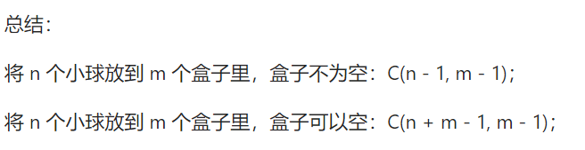
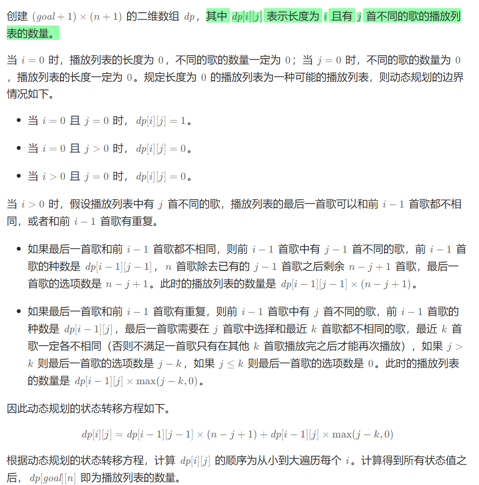

# §2.3 放球问题

1641\. 统计字典序元音字符串的数目
--------------------

给你一个整数 `n`，请返回长度为 `n` 、仅由元音 (`a`, `e`, `i`, `o`, `u`) 组成且按 **字典序排列** 的字符串数量。

字符串 `s` 按 **字典序排列** 需要满足：对于所有有效的 `i`，`s[i]` 在字母表中的位置总是与 `s[i+1]` 相同或在 `s[i+1]` 之前。

**示例 1：**

**输入：**n = 1
**输出：**5
**解释：**仅由元音组成的 5 个字典序字符串为 `["a","e","i","o","u"]`

**示例 2：**

**输入：**n = 2
**输出：**15
**解释：**仅由元音组成的 15 个字典序字符串为
\["aa","ae","ai","ao","au","ee","ei","eo","eu","ii","io","iu","oo","ou","uu"\]
注意，"ea" 不是符合题意的字符串，因为 'e' 在字母表中的位置比 'a' 靠后

**示例 3：**

**输入：**n = 33
**输出：**66045

**提示：**

*   `1 <= n <= 50` 

[https://leetcode.cn/problems/count-sorted-vowel-strings/description/](https://leetcode.cn/problems/count-sorted-vowel-strings/description/)

```java
import java.util.Arrays;

class Solution {
    int[][] memo;
    public int countVowelStrings(int n) { 
        memo = new int[n + 1][5];
        for (int i = 0; i <= n; i++) {
            Arrays.fill(memo[i], -1);
        }
        return dfs(0, 0, n);
    }

    private int dfs(int i, int j, int n) {
        if (i == n) {
            return 1;
        }
        if (memo[i][j] != -1) {
            return memo[i][j];
        }
        int res = 0;
        for (int k = j; k <= 4; k++) {
            res += dfs(i + 1, k, n);
        }
        return memo[i][j] = res;
    }
}
```

```java
// 组合数学
// 理解为把n个球放入5个框里面，而放框的方案数就是答案
// 比如现在有3个球，我们现在五个框为a,e,i,o,u  放入eou框，这个方案就是eou
// 所以就是在n个球里面放5个挡板，有c[n - 1][m - 1],这是两个挡板不能放一起的方案数（不允许有空框，因为n-1必须大于等于4等价于n>=5，所以我们加上五个球，有最后答案c[n + m - 1][m - 1]）
class Solution {
    private static int MX = 55;
    private static int[][] c = new int[MX][MX];
    static {
        for (int i = 0; i < MX; i++) {
            c[i][0] = c[i][i] = 1;
            for (int j = 1; j < i; j++) {
                c[i][j] = c[i - 1][j - 1] + c[i - 1][j];
            }
        }
    }
    public int countVowelStrings(int n) {
        return c[n + 4][4];
    }
}
```

```java
class Solution {
    public int countVowelStrings(int n) { // O（1）
        return (n + 1) * (n + 2) * (n + 3) * (n + 4) / 24;
    }
}
```




1621\. 大小为 K 的不重叠线段的数目
----------------------

给你一维空间的 `n` 个点，其中第 `i` 个点（编号从 `0` 到 `n-1`）位于 `x = i` 处，请你找到 **恰好** `k` **个不重叠** 线段且每个线段至少覆盖两个点的方案数。线段的两个端点必须都是 **整数坐标** 。这 `k` 个线段不需要全部覆盖全部 `n` 个点，且它们的端点 **可以** 重合。

请你返回 `k` 个不重叠线段的方案数。由于答案可能很大，请将结果对 `109 + 7` **取余** 后返回。

**示例 1：**


**输入：**n = 4, k = 2
**输出：**5
**解释：**
如图所示，两个线段分别用红色和蓝色标出。
上图展示了 5 种不同的方案 {(0,2),(2,3)}，{(0,1),(1,3)}，{(0,1),(2,3)}，{(1,2),(2,3)}，{(0,1),(1,2)} 。

**示例 2：**

**输入：**n = 3, k = 1
**输出：**3
**解释：**总共有 3 种不同的方案 {(0,1)}, {(0,2)}, {(1,2)} 。

**示例 3：**

**输入：**n = 30, k = 7
**输出：**796297179
**解释：**画 7 条线段的总方案数为 3796297200 种。将这个数对 109 + 7 取余得到 796297179 。

**示例 4：**

**输入：**n = 5, k = 3
**输出：**7

**示例 5：**

**输入：**n = 3, k = 2
**输出：**1

**提示：**

*   `2 <= n <= 1000`
*   `1 <= k <= n-1`

[https://leetcode.cn/problems/number-of-sets-of-k-non-overlapping-line-segments/](https://leetcode.cn/problems/number-of-sets-of-k-non-overlapping-line-segments/)

```java
import java.util.Arrays;

class Solution {
    private int Mod = (int) 1e9 + 7;
    int[][][] memo;
    public int numberOfSets(int n, int k) {
        memo = new int[n][k + 1][2];
        for (int i = 0; i < n; i++) {
            for (int j = 0; j < k + 1; j++) {
                Arrays.fill(memo[i][j], -1);
            }
        }
        return dfs(0, 0, 0, k, n - 1);
    }

    private int dfs(int i, int preCnt,int preHas, int k, int n) {
        if (preCnt == k) {
            return n - i + 1;
        }
        if (i == n) {
            return 0;
        }
        if (memo[i][preCnt][preHas] != -1) {
            return memo[i][preCnt][preHas];
        }
        int res = dfs(i + 1, preCnt, 0, k, n); // 当前位置不填，如果前面被填了，那么preCnt++
        if (preHas == 1) { // 照旧的填
            res = (res + dfs(i + 1, preCnt, 1, k, n)) % Mod;
        }
        // 填新的
        res = (res + dfs(i + 1, preCnt + 1, 1, k, n)) % Mod;
        return memo[i][preCnt][preHas] = res;
    }
}
```

```java
// 题设一共有n个点，需要选择k个线段。
// 如果点与点之间不能重合，那么直接有C[n][2*k]
// 但是题目要求可以重合，由于最多有k - 1 个线段首尾相连，我们可以多加入k-1个虚拟的点，有c[n+k-1][2*k]
// 但是这个数据比较大，如何取MOD？一种是利用杨辉三角算组合数，边算边取Mod，另一种是费马小定理
class Solution {
    private static int MX = 2001;
    private static int Mod = (int) 1e9 + 7;
    private static int[][] c = new int[MX][MX];
    static {
        for (int i = 0; i < MX; i++) {
            c[i][0] = c[i][i] = 1;
            for (int j = 1; j < i; j++) {
                c[i][j] = (c[i - 1][j - 1] + c[i - 1][j]) % Mod;
            }
        }
    }
    public int numberOfSets(int n, int k) {
        return c[n + k - 1][k * 2];
    }
}
```

```java
// 使用费马小定理
class Solution {
        public int numberOfSets(int n, int k) {
        return C_Fermat(n + k - 1, k * 2, 1000000007); // 余数
    }

    // 利用费马小定理求C(n, m)
    private int C_Fermat(int n, int m, int p) {
        // C(n, m) = a / b
        long a = multiMod(n, n - m + 1, p); // 分式上面的部分
        long b = multiMod(m, 1, p); // 分式下面的部分
        // 推论2： a/b ≡ a*b^(p-2) (mod p)
        return (int) (a * powMod(b, p - 2, p) % p);
    }

    // = n * (n-1) * (n-2) * ... * m
    private long multiMod(int n, int m, int p) {
        long r = 1;
        for (int i = m; i <= n; i++) {
            r = r * i;
            if (r > p) r %= p;
        }
        return r;
    }

    // 快速幂算法
    // a^(2x) = (a^2)^x
    private long powMod(long a, int pow, int p) { // a^pow % p 快速幂算法
        long r = 1;
        while (pow > 0) {
            if ((pow & 1) == 1) { // a^(2x+1) = a*a^(2x)
                r = (r * a) % p;
            }
            a = a * a % p;
            pow >>= 1;
        }
        return r;
    }
}
```

```java
// 使用BigInteger 算逆元
import java.math.BigInteger;
class Solution {
    public int numberOfSets(int n, int k) {
        return C(n + k - 1, 2 * k);
    }
    private int mod = 10000_00007;
    private int C(int great, int small) {
	    int a = 1;
        int b = great;
        BigInteger res = BigInteger.valueOf(1);
        for (int i = 0; i < small; i++) {
    		res = res.multiply(BigInteger.valueOf(b)).divide(BigInteger.valueOf(a));
            b--;
            a++;
        }
        res = res.remainder(BigInteger.valueOf(mod));
        return res.intValue();
    }
}
```

920\. 播放列表的数量
-------------

你的音乐播放器里有 `n` 首不同的歌，在旅途中，你计划听 `goal` 首歌（不一定不同，即，允许歌曲重复）。你将会按如下规则创建播放列表：

*   每首歌 **至少播放一次** 。
*   一首歌只有在其他 `k` 首歌播放完之后才能再次播放。

给你 `n`、`goal` 和 `k` ，返回可以满足要求的播放列表的数量。由于答案可能非常大，请返回对 `109 + 7` **取余** 的结果。

 

**示例 1：**

**输入：**n = 3, goal = 3, k = 1
**输出：**6
**解释：**有 6 种可能的播放列表。\[1, 2, 3\]，\[1, 3, 2\]，\[2, 1, 3\]，\[2, 3, 1\]，\[3, 1, 2\]，\[3, 2, 1\] 。

**示例 2：**

**输入：**n = 2, goal = 3, k = 0
**输出：**6
**解释：**有 6 种可能的播放列表。\[1, 1, 2\]，\[1, 2, 1\]，\[2, 1, 1\]，\[2, 2, 1\]，\[2, 1, 2\]，\[1, 2, 2\] 。

**示例 3：**

**输入：**n = 2, goal = 3, k = 1
**输出：**2
**解释：**有 2 种可能的播放列表。\[1, 2, 1\]，\[2, 1, 2\] 。

**提示：**

*   `0 <= k < n <= goal <= 100`

[https://leetcode.cn/problems/number-of-music-playlists/solutions/2256486/920-bo-fang-lie-biao-de-shu-liang-by-sto-m9mg/](https://leetcode.cn/problems/number-of-music-playlists/solutions/2256486/920-bo-fang-lie-biao-de-shu-liang-by-sto-m9mg/)



```java
//发现递推式就是杨辉三角
class Solution {
    private static int Mod = (int) 1e9 + 7;
    public int numMusicPlaylists(int n, int goal, int k) {
        long[][] dp = new long[goal + 1][n + 1]; // 其中 dp[i][j] 表示长度为 i 且有 j 首不同的歌的播放列表的数量。
        dp[0][0] = 1;
        for (int i = 1; i <= goal; i++) {
            for (int j = 1; j <= n; j++) {
                dp[i][j] = (dp[i - 1][j - 1] * (n - j + 1) + dp[i - 1][j] * Math.max(j - k, 0)) % Mod;
            }
        }
        return (int) dp[goal][n];
    }
}
```

