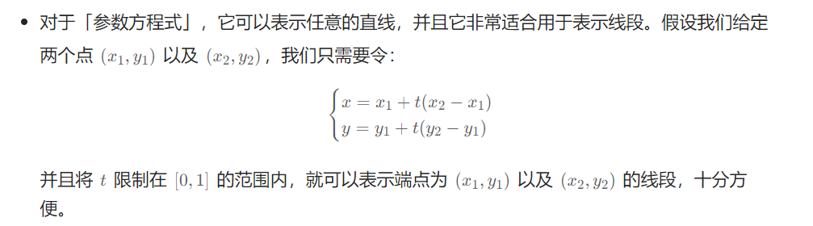
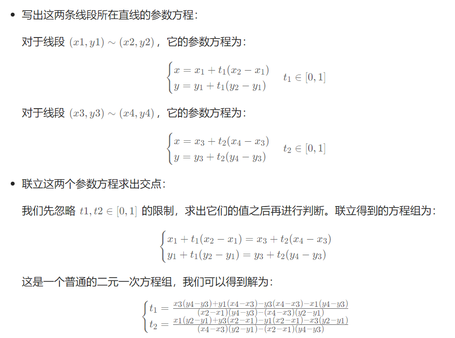
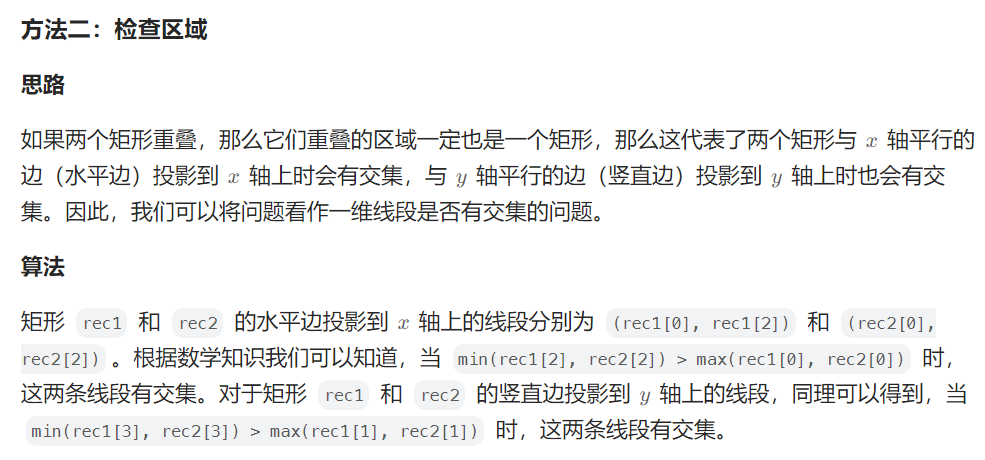

# §5.1 点、线

> 尽量不要用判断斜率是否相等，可以利用共线向量线性相关 
>
> 因为斜率k会涉及到除数为0的问题。而且除法涉及精度问题，没有乘法好。
>
> 其实就是  斜率式进行移项，从除法变成了乘法 

1232\. 缀点成线
-----------

给定一个数组 `coordinates` ，其中 `coordinates[i] = [x, y]` ， `[x, y]` 表示横坐标为 `x`、纵坐标为 `y` 的点。请你来判断，这些点是否在该坐标系中属于同一条直线上。

**示例 1：**


**输入：**coordinates = \[\[1,2\],\[2,3\],\[3,4\],\[4,5\],\[5,6\],\[6,7\]\]
**输出：**true

**示例 2：**

****

**输入：**coordinates = \[\[1,1\],\[2,2\],\[3,4\],\[4,5\],\[5,6\],\[7,7\]\]
**输出：**false

**提示：**

*   `2 <= coordinates.length <= 1000`
*   `coordinates[i].length == 2`
*   `-10^4 <= coordinates[i][0], coordinates[i][1] <= 10^4`
*   `coordinates` 中不含重复的点

[https://leetcode.cn/problems/check-if-it-is-a-straight-line/description/](https://leetcode.cn/problems/check-if-it-is-a-straight-line/description/)

```java
class Solution {
    public boolean checkStraightLine(int[][] coordinates) {
        int pre_dx = coordinates[1][0] - coordinates[0][0], pre_dy = coordinates[1][1] - coordinates[0][1];
        for (int i = 1; i < coordinates.length; i++) {
            int dx = coordinates[i][0] - coordinates[i - 1][0], dy = coordinates[i][1] - coordinates[i - 1][1];
            if (pre_dx * dy != pre_dy * dx) {
                return false;
            }
        }
        return true;
    }
}
```

2280\. 表示一个折线图的最少线段数
--------------------

给你一个二维整数数组 `stockPrices` ，其中 `stockPrices[i] = [dayi, pricei]` 表示股票在 `dayi` 的价格为 `pricei` 。**折线图** 是一个二维平面上的若干个点组成的图，横坐标表示日期，纵坐标表示价格，折线图由相邻的点连接而成。比方说下图是一个例子：


请你返回要表示一个折线图所需要的 **最少线段数** 。

**示例 1：**


**输入：**stockPrices = \[\[1,7\],\[2,6\],\[3,5\],\[4,4\],\[5,4\],\[6,3\],\[7,2\],\[8,1\]\]
**输出：**3
**解释：**
上图为输入对应的图，横坐标表示日期，纵坐标表示价格。
以下 3 个线段可以表示折线图：
- 线段 1 （红色）从 (1,7) 到 (4,4) ，经过 (1,7) ，(2,6) ，(3,5) 和 (4,4) 。
- 线段 2 （蓝色）从 (4,4) 到 (5,4) 。
- 线段 3 （绿色）从 (5,4) 到 (8,1) ，经过 (5,4) ，(6,3) ，(7,2) 和 (8,1) 。
  可以证明，无法用少于 3 条线段表示这个折线图。

**示例 2：**


**输入：**stockPrices = \[\[3,4\],\[1,2\],\[7,8\],\[2,3\]\]
**输出：**1
**解释：**
如上图所示，折线图可以用一条线段表示。

**提示：**

*   `1 <= stockPrices.length <= 105`
*   `stockPrices[i].length == 2`
*   `1 <= dayi, pricei <= 109`
*   所有 `dayi` **互不相同** 。

[https://leetcode.cn/problems/minimum-lines-to-represent-a-line-chart/description/](https://leetcode.cn/problems/minimum-lines-to-represent-a-line-chart/description/)

```java
import java.util.Arrays;

class Solution {
    public int minimumLines(int[][] stockPrices) {
        int n = stockPrices.length;
        Arrays.sort(stockPrices, (a, b) -> a[0] - b[0]);
        int ans = 0;
        int pre_dx = 0, pre_dy = 1; // 可以假定第一天之前的斜率为 1/0 ，从而简化判断逻辑。
        for (int i = 1; i < n; i++) {
            int dx = stockPrices[i][0] - stockPrices[i - 1][0], dy = stockPrices[i][1] - stockPrices[i - 1][1];
            if (pre_dx * dy != pre_dy * dx) {
                ans++;
                pre_dx = dx;
                pre_dy = dy;
            }
        }
        return ans;
    }
}
```

1610\. 可见点的最大数目
---------------

给你一个点数组 `points` 和一个表示角度的整数 `angle` ，你的位置是 `location` ，其中 `location = [posx, posy]` 且 `points[i] = [xi, yi]` 都表示 X-Y 平面上的整数坐标。

最开始，你面向东方进行观测。你 **不能** 进行移动改变位置，但可以通过 **自转** 调整观测角度。换句话说，`posx` 和 `posy` 不能改变。你的视野范围的角度用 `angle` 表示， 这决定了你观测任意方向时可以多宽。设 `d` 为你逆时针自转旋转的度数，那么你的视野就是角度范围 `[d - angle/2, d + angle/2]` 所指示的那片区域。

Your browser does not support the video tag or this video format.

对于每个点，如果由该点、你的位置以及从你的位置直接向东的方向形成的角度 **位于你的视野中** ，那么你就可以看到它。

同一个坐标上可以有多个点。你所在的位置也可能存在一些点，但不管你的怎么旋转，总是可以看到这些点。同时，点不会阻碍你看到其他点。

返回你能看到的点的最大数目。

**示例 1：**


**输入：**points = \[\[2,1\],\[2,2\],\[3,3\]\], angle = 90, location = \[1,1\]
**输出：**3
**解释：**阴影区域代表你的视野。在你的视野中，所有的点都清晰可见，尽管 \[2,2\] 和 \[3,3\]在同一条直线上，你仍然可以看到 \[3,3\] 。

**示例 2：**

**输入：**points = \[\[2,1\],\[2,2\],\[3,4\],\[1,1\]\], angle = 90, location = \[1,1\]
**输出：**4
**解释：**在你的视野中，所有的点都清晰可见，包括你所在位置的那个点。

**示例 3：**


**输入：**points = \[\[1,0\],\[2,1\]\], angle = 13, location = \[1,1\]
**输出：**1
**解释：**如图所示，你只能看到两点之一。

**提示：**

*   `1 <= points.length <= 105`
*   `points[i].length == 2`
*   `location.length == 2`
*   `0 <= angle < 360`
*   `0 <= posx, posy, xi, yi <= 100`

[https://leetcode.cn/problems/maximum-number-of-visible-points/description/](https://leetcode.cn/problems/maximum-number-of-visible-points/description/)

```java
import java.util.ArrayList;
import java.util.Collections;
import java.util.List;

class Solution {
    double eps = 1e-9;
    public int visiblePoints(List<List<Integer>> points, int angle, List<Integer> location) {
        int x = location.get(0), y = location.get(1);
        ArrayList<Double> list = new ArrayList<>(); // 存放极坐标
        int cnt = 0; // 重合的点，最后直接累加到答案里面
        double pi = Math.PI, t = angle * pi / 180; // 将t转换成极坐标，比如t = 60,那么60*pi/180 = pi/3
        for (List<Integer> p : points) {
            int a = p.get(0), b = p.get(1);
            if (a == x && b == y && ++cnt >= 0) {
                continue;
            }
            list.add(Math.atan2(b - y, a - x) + pi); // 由于atan2的范围是[-pi,pi] ,这里统一加pi
        }
        Collections.sort(list);
        int n = list.size(), mx = 0;
        for (int i = 0; i < n; i++) {
            list.add(list.get(i) + pi * 2);
        }
        int left = 0, right = 0;
        while (right < n * 2) {
            while (left < right && list.get(right) - list.get(left) > t + eps) {
                left++;
            }
            mx = Math.max(mx, right - left + 1);
            right++;
        }
        return mx + cnt;
    }
}
```

面试题 16.03. 交点
-------------

给定两条线段（表示为起点`start = {X1, Y1}`和终点`end = {X2, Y2}`），如果它们有交点，请计算其交点，没有交点则返回空值。

要求浮点型误差不超过`10^-6`。若有多个交点（线段重叠）则返回 X 值最小的点，X 坐标相同则返回 Y 值最小的点。

**示例 1：**

**输入：**
line1 = {0, 0}, {1, 0}
line2 = {1, 1}, {0, -1}
**输出：** {0.5, 0}

**示例 2：**

**输入：**
line1 = {0, 0}, {3, 3}
line2 = {1, 1}, {2, 2}
**输出：** {1, 1}

**示例 3：**

**输入：**
line1 = {0, 0}, {1, 1}
line2 = {1, 0}, {2, 1}
**输出：** {}，两条线段没有交点

**提示：**

*   坐标绝对值不会超过 2^7
*   输入的坐标均是有效的二维坐标

[https://leetcode.cn/problems/intersection-lcci/description/](https://leetcode.cn/problems/intersection-lcci/description/)





```java
class Solution {
    double[] ans = new double[0];
    public double[] intersection(int[] start1, int[] end1, int[] start2, int[] end2) {
        int x1 = start1[0], y1 = start1[1];
        int x2 = end1[0], y2 = end1[1];
        int x3 = start2[0], y3 = start2[1];
        int x4 = end2[0], y4 = end2[1];
        // 判断（x1,y1）~(x2,y2) 和 （x3,y3）~(x4,y4)是否平行
        if ((y4 - y3) * (x2 - x1) == (y2 - y1) * (x4 - x3)) {
            // 若平行，则判断 (x3, y3) 是否在「直线」(x1, y1)~(x2, y2) 上
            if ((y2 - y1) * (x3 - x1) == (y3 - y1) * (x2 - x1)) { // 四点同线
                // 判断 (x3, y3) 是否在「线段」(x1, y1)~(x2, y2) 上
                if (inside(x1, y1, x2, y2, x3, y3)) {
                    update(x3, y3);
                }
                // 判断 (x4, y4) 是否在「线段」(x1, y1)~(x2, y2) 上
                if (inside(x1, y1, x2, y2, x4, y4)) {
                    update(x4, y4);
                }
                // 判断 (x1, y1) 是否在「线段」(x3, y3)~(x4, y4) 上
                if (inside(x3, y3, x4, y4, x1, y1)) {
                    update(x1, y1);
                }
                // 判断 (x2, y2) 是否在「线段」(x3, y3)~(x4, y4) 上
                if (inside(x3, y3, x4, y4, x2, y2)) {
                    update(x2, y2);
                }
            }
        }else{ // 不平行，那么只有看是否相交了
            // 联立方程得到 t1 和 t2 的值, 这里写参数方程
            double t1 = (double) (x3 * (y4 - y3) + y1 * (x4 - x3) - y3 * (x4 - x3) - x1 * (y4 - y3)) / ((x2 - x1) * (y4 - y3) - (x4 - x3) * (y2 - y1));
            double t2 = (double) (x1 * (y2 - y1) + y3 * (x2 - x1) - y1 * (x2 - x1) - x3 * (y2 - y1)) / ((x4 - x3) * (y2 - y1) - (x2 - x1) * (y4 - y3));
            // 判断 t1 和 t2 是否均在 [0, 1] 之间，线段的参数方程要求 0<=t<=1
            if (t1 >= 0.0 && t1 <= 1.0 && t2 >= 0.0 && t2 <= 1.0) {
                ans = new double[]{x1 + t1 * (x2 - x1), y1 + t1 * (y2 - y1)};
            }
        }
        return ans;
    }

    // 判断 (xk, yk) 是否在「线段」(x1, y1)~(x2, y2) 上
    // 这里的前提是 (xk, yk) 一定在「直线」(x1, y1)~(x2, y2) 上
    private boolean inside(int x1, int y1, int x2, int y2, int xk, int yk) {
        // 若与 x 轴平行，只需要判断 x 的部分
        // 若与 y 轴平行，只需要判断 y 的部分
        // 若为普通线段，则都要判断
        return (x1 == x2 || (Math.min(x1, x2) <= xk && xk <= Math.max(x1, x2)))
                && (y1 == y2 || (Math.min(y1, y2) <= yk && yk <= Math.max(y1, y2)));
    }

    public void update(double xk, double yk) { // 题目要求：若有多个交点（线段重叠）则返回 X 值最小的点，X 坐标相同则返回 Y 值最小的点。
        // 将一个交点与当前 ans 中的结果进行比较
        // 若更优则替换
        if (ans.length == 0 || xk < ans[0] || (xk == ans[0] && yk < ans[1])) {
            ans = new double[]{xk, yk};
        }
    }

}
```

# §5.2 圆

1401\. 圆和矩形是否有重叠(板子题)
----------------

给你一个以 `(radius, xCenter, yCenter)` 表示的圆和一个与坐标轴平行的矩形 `(x1, y1, x2, y2)` ，其中 `(x1, y1)` 是矩形左下角的坐标，而 `(x2, y2)` 是右上角的坐标。

如果圆和矩形有重叠的部分，请你返回 `true` ，否则返回 `false` 。

换句话说，请你检测是否 **存在** 点 `(xi, yi)` ，它既在圆上也在矩形上（两者都包括点落在边界上的情况）。

**示例 1 ：**


**输入：**radius = 1, xCenter = 0, yCenter = 0, x1 = 1, y1 = -1, x2 = 3, y2 = 1
**输出：**true
**解释：**圆和矩形存在公共点 (1,0) 。

**示例 2 ：**

**输入：**radius = 1, xCenter = 1, yCenter = 1, x1 = 1, y1 = -3, x2 = 2, y2 = -1
**输出：**false

**示例 3 ：**


**输入：**radius = 1, xCenter = 0, yCenter = 0, x1 = -1, y1 = 0, x2 = 0, y2 = 1
**输出：**true

**提示：**

*   `1 <= radius <= 2000`
*   `-104 <= xCenter, yCenter <= 104`
*   `-104 <= x1 < x2 <= 104`
*   `-104 <= y1 < y2 <= 104`

[https://leetcode.cn/problems/circle-and-rectangle-overlapping/](https://leetcode.cn/problems/circle-and-rectangle-overlapping/)

```java
class Solution {
    // 在矩形里面找距离圆心最近的点，与圆的半径比较
    public boolean checkOverlap(int radius, int xCenter, int yCenter, int x1, int y1, int x2, int y2) {
        int a = f(x1, x2, xCenter);
        int b = f(y1, y2, yCenter);
        return a * a + b * b <= radius * radius;
    }

    private int f(int low, int high, int target) {
        if (low <= target && target <= high) {
            return 0;
        }
        return target < low ? low - target : target - high;
    }
}
```

1453\. 圆形靶内的最大飞镖数量（板子题）
------------------

Alice 向一面非常大的墙上掷出 `n` 支飞镖。给你一个数组 `darts` ，其中 `darts[i] = [xi, yi]` 表示 Alice 掷出的第 `i` 支飞镖落在墙上的位置。

Bob 知道墙上所有 `n` 支飞镖的位置。他想要往墙上放置一个半径为 `r` 的圆形靶。使 Alice 掷出的飞镖尽可能多地落在靶上。

给你整数 `r` ，请返回能够落在 **任意** 半径为 `r` 的圆形靶内或靶上的最大飞镖数。

**示例 1 ：**


**输入：**darts = \[\[-2,0\],\[2,0\],\[0,2\],\[0,-2\]\], r = 2
**输出：**4
**解释：**如果圆形靶的圆心为 (0,0) ，半径为 2 ，所有的飞镖都落在靶上，此时落在靶上的飞镖数最大，值为 4 。

**示例 2 ：**


**输入：**darts = \[\[-3,0\],\[3,0\],\[2,6\],\[5,4\],\[0,9\],\[7,8\]\], r = 5
**输出：**5
**解释：**如果圆形靶的圆心为 (0,4) ，半径为 5 ，则除了 (7,8) 之外的飞镖都落在靶上，此时落在靶上的飞镖数最大，值为 5 。

**提示：**

*   `1 <= darts.length <= 100`
*   `darts[i].length == 2`
*   `-104 <= xi, yi <= 104`
*   `darts` 中的元素互不相同
*   `1 <= r <= 5000`

[https://leetcode.cn/problems/maximum-number-of-darts-inside-of-a-circular-dartboard/description/](https://leetcode.cn/problems/maximum-number-of-darts-inside-of-a-circular-dartboard/description/)

```java
class Solution {
    static final double EPSILON = 1e-6;

    public int numPoints(int[][] darts, int r) {
        int n = darts.length;
        if (n == 1) {
            return 1;
        }
        int maxPoints = 1;
        for (int i = 0; i < n; i++) {
            for (int j = i + 1; j < n; j++) {
                int squaredDistance = (darts[j][0] - darts[i][0]) * (darts[j][0] - darts[i][0]) + (darts[j][1] - darts[i][1]) * (darts[j][1] - darts[i][1]);
                if (squaredDistance > 4 * r * r) {
                    continue;
                }
                int count;
                if (squaredDistance == 4 * r * r) {
                    double[] center = {(darts[i][0] + darts[j][0]) / 2.0, (darts[i][1] + darts[j][1]) / 2.0};
                    count = countDartsInCircle(darts, r, center);
                } else {
                    double distance = Math.sqrt(squaredDistance);
                    double halfDistance = Math.sqrt(squaredDistance) / 2;
                    double remainDistance = Math.sqrt(r * r - halfDistance * halfDistance);
                    double xMid = (darts[i][0] + darts[j][0]) / 2.0, yMid = (darts[i][1] + darts[j][1]) / 2.0;
                    double xDelta = (darts[j][0] - darts[i][0]) / distance, yDelta = (darts[j][1] - darts[i][1]) / distance;
                    double[] center1 = {xMid + remainDistance * yDelta, yMid - remainDistance * xDelta};
                    double[] center2 = {xMid - remainDistance * yDelta, yMid + remainDistance * xDelta};
                    count = Math.max(countDartsInCircle(darts, r, center1), countDartsInCircle(darts, r, center2));
                }
                maxPoints = Math.max(maxPoints, count);
            }
        }
        return maxPoints;
    }

    public int countDartsInCircle(int[][] darts, int r, double[] center) {
        int count = 0;
        for (int[] dart : darts) {
            double squaredDistance = (dart[0] - center[0]) * (dart[0] - center[0]) + (dart[1] - center[1]) * (dart[1] - center[1]);
            if (squaredDistance - r * r <= EPSILON) {
                count++;
            }
        }
        return count;
    }
}

```

# §5.3 矩形、多边形

836\. 矩形重叠
----------

矩形以列表 `[x1, y1, x2, y2]` 的形式表示，其中 `(x1, y1)` 为左下角的坐标，`(x2, y2)` 是右上角的坐标。矩形的上下边平行于 x 轴，左右边平行于 y 轴。

如果相交的面积为 **正** ，则称两矩形重叠。需要明确的是，只在角或边接触的两个矩形不构成重叠。

给出两个矩形 `rec1` 和 `rec2` 。如果它们重叠，返回 `true`；否则，返回 `false` 。

**示例 1：**

**输入：**rec1 = \[0,0,2,2\], rec2 = \[1,1,3,3\]
**输出：**true

**示例 2：**

**输入：**rec1 = \[0,0,1,1\], rec2 = \[1,0,2,1\]
**输出：**false

**示例 3：**

**输入：**rec1 = \[0,0,1,1\], rec2 = \[2,2,3,3\]
**输出：**false

**提示：**

*   `rect1.length == 4`
*   `rect2.length == 4`
*   `-109 <= rec1[i], rec2[i] <= 109`
*   `rec1` 和 `rec2` 表示一个面积不为零的有效矩形

[https://leetcode.cn/problems/rectangle-overlap/](https://leetcode.cn/problems/rectangle-overlap/)

```java
class Solution {
    public boolean isRectangleOverlap(int[] rec1, int[] rec2) {
        if (rec1[0] == rec1[2] || rec1[1] == rec1[3] || rec2[0] == rec2[2] || rec2[1] == rec2[3]) {
            return false; // 表示有矩阵的面积为0
        }
        return !(rec1[2] <= rec2[0] // 矩形1在矩形2的左边
                || rec1[3] <= rec2[1] // 矩形1在矩形2的下边
                || rec2[2] <= rec1[0] // 矩形1在矩形2的右边
                || rec2[3] <= rec1[1]); // 矩形1在矩形2的上边
    }
}
```



```java
class Solution {
    public boolean isRectangleOverlap(int[] rec1, int[] rec2) {
        return (Math.min(rec1[2], rec2[2]) > Math.max(rec1[0], rec2[0]) &&
                Math.min(rec1[3], rec2[3]) > Math.max(rec1[1], rec2[1]));
    }
}
```

223\. 矩形面积
----------

给你 **二维** 平面上两个 **由直线构成且边与坐标轴平行/垂直** 的矩形，请你计算并返回两个矩形覆盖的总面积。

每个矩形由其 **左下** 顶点和 **右上** 顶点坐标表示：

*   第一个矩形由其左下顶点 `(ax1, ay1)` 和右上顶点 `(ax2, ay2)` 定义。
*   第二个矩形由其左下顶点 `(bx1, by1)` 和右上顶点 `(bx2, by2)` 定义。

**示例 1：**


**输入：**ax1 = -3, ay1 = 0, ax2 = 3, ay2 = 4, bx1 = 0, by1 = -1, bx2 = 9, by2 = 2
**输出：**45

**示例 2：**

**输入：**ax1 = -2, ay1 = -2, ax2 = 2, ay2 = 2, bx1 = -2, by1 = -2, bx2 = 2, by2 = 2
**输出：**16

**提示：**

*   `-104 <= ax1, ay1, ax2, ay2, bx1, by1, bx2, by2 <= 104`

[https://leetcode.cn/problems/rectangle-area/description/](https://leetcode.cn/problems/rectangle-area/description/)

```java
class Solution {
    public int computeArea(int ax1, int ay1, int ax2, int ay2, int bx1, int by1, int bx2, int by2) {
        int x = Math.max(0, Math.min(ax2, bx2) - Math.max(ax1, bx1));
        int y = Math.max(0, Math.min(ay2, by2) - Math.max(ay1, by1));
        int x_y = x * y; // 矩形相交的面积
        return (ax2 - ax1) * (ay2 - ay1) + (bx2 - bx1) * (by2 - by1) - x_y;
    }
}
```

593\. 有效的正方形
------------

给定2D空间中四个点的坐标 `p1`, `p2`, `p3` 和 `p4`，如果这四个点构成一个正方形，则返回 `true` 。

点的坐标 `pi` 表示为 `[xi, yi]` 。 `输入没有任何顺序` 。

一个 **有效的正方形** 有四条等边和四个等角(90度角)。

**示例 1:**

**输入:** p1 = \[0,0\], p2 = \[1,1\], p3 = \[1,0\], p4 = \[0,1\]
**输出:** True

**示例 2:**

**输入：**p1 = \[0,0\], p2 = \[1,1\], p3 = \[1,0\], p4 = \[0,12\]
**输出：**false

**示例 3:**

**输入：**p1 = \[1,0\], p2 = \[-1,0\], p3 = \[0,1\], p4 = \[0,-1\]
**输出：**true

**提示:**

*   `p1.length == p2.length == p3.length == p4.length == 2`
*   `-104 <= xi, yi <= 104`

[https://leetcode.cn/problems/valid-square/description/](https://leetcode.cn/problems/valid-square/description/)

```java
import java.util.Arrays;

class Solution {
    public boolean validSquare(int[] p1, int[] p2, int[] p3, int[] p4) {
        // 利用正方形四条边长度相等 + 正方形两对角线长度相等
        int[] edge = {
                getDistance(p1, p2),
                getDistance(p1, p3),
                getDistance(p1, p4),
                getDistance(p2, p3),
                getDistance(p2, p4),
                getDistance(p3, p4)
        };
        Arrays.sort(edge);
        // 可能会有x=0，y=0的情况
        return edge[0] > 0 && edge[0] == edge[1] && edge[0] == edge[2] && edge[0] == edge[3] && edge[4] == edge[5];
    }
    int getDistance(int[] a, int[] b) {
        int x = a[0] - b[0];
        int y = a[1] - b[1];
        return x * x + y * y;
    }
}
```

