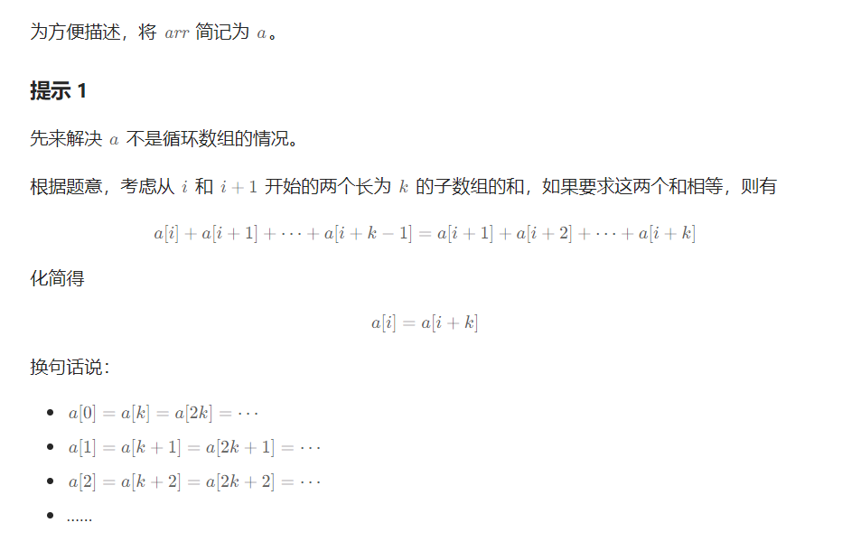
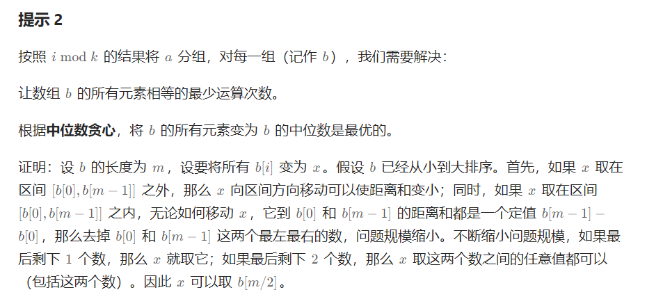
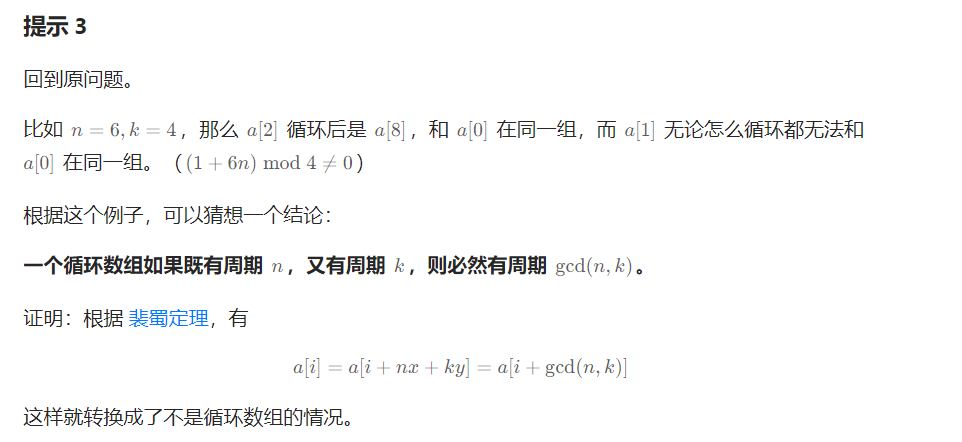
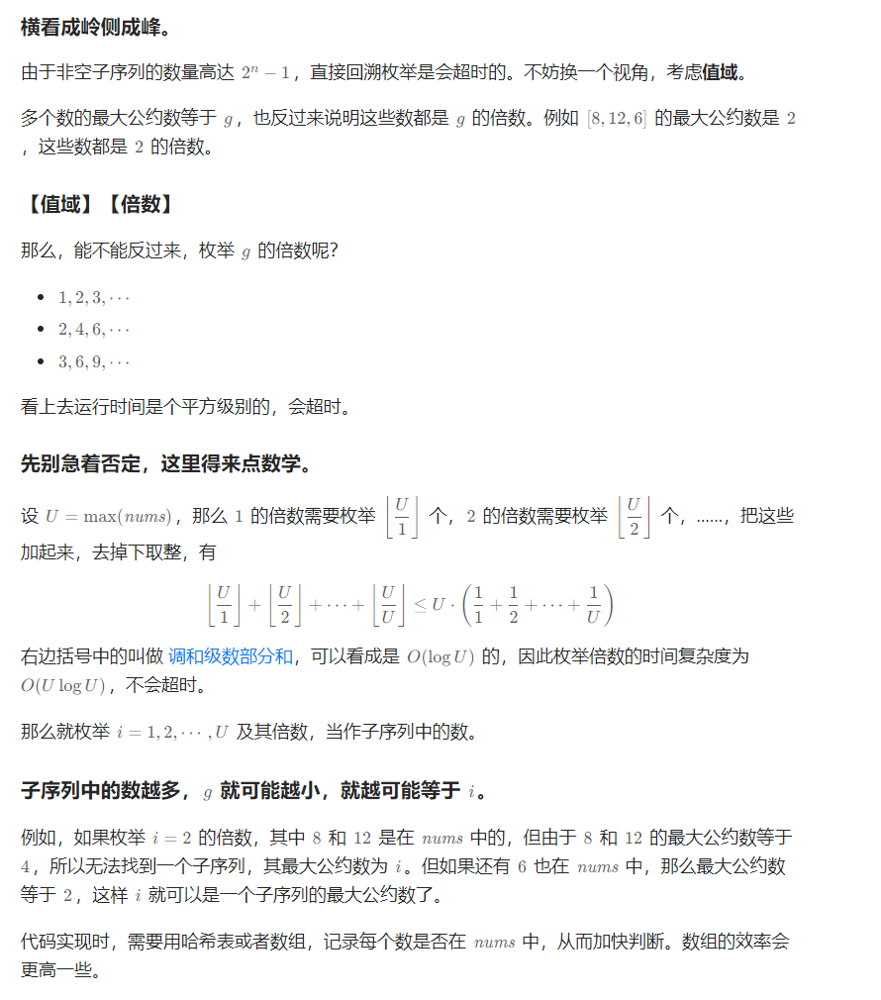
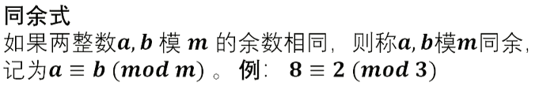
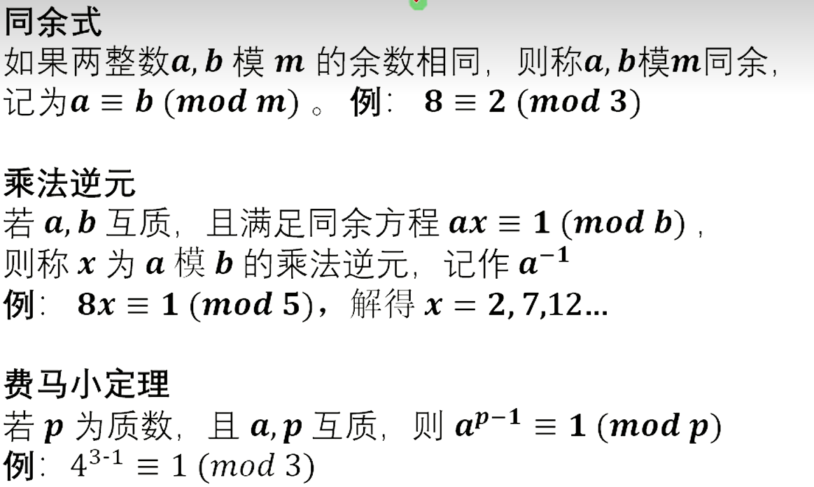
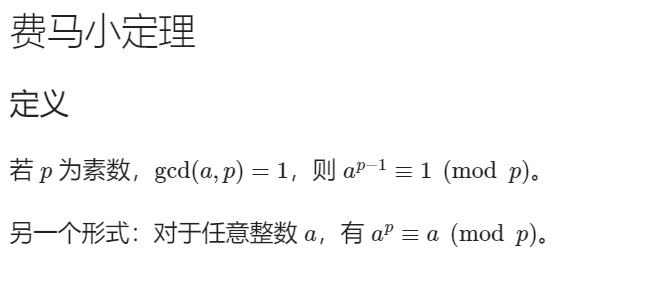
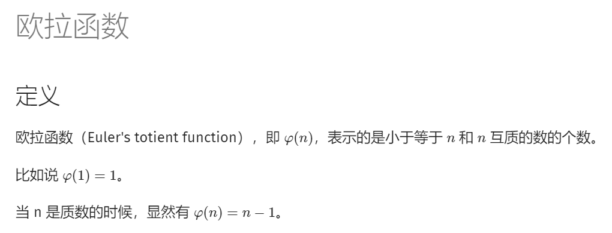
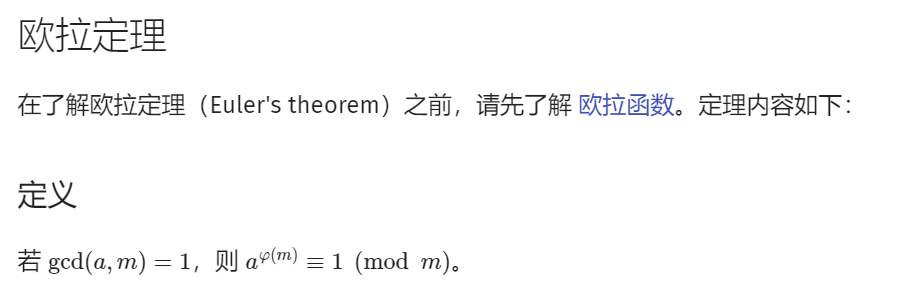

# §1.1 判断质数

3115\. 质数的最大距离
--------------

给你一个整数数组 `nums`。

返回两个（不一定不同的）质数在 `nums` 中 **下标** 的 **最大距离**。

**示例 1：**

**输入：** nums = \[4,2,9,5,3\]

**输出：** 3

**解释：** `nums[1]`、`nums[3]` 和 `nums[4]` 是质数。因此答案是 `|4 - 1| = 3`。

**示例 2：**

**输入：** nums = \[4,8,2,8\]

**输出：** 0

**解释：** `nums[2]` 是质数。因为只有一个质数，所以答案是 `|2 - 2| = 0`。

**提示：**

*   `1 <= nums.length <= 3 * 105`
*   `1 <= nums[i] <= 100`
*   输入保证 `nums` 中至少有一个质数。

[https://leetcode.cn/problems/maximum-prime-difference/description/](https://leetcode.cn/problems/maximum-prime-difference/description/)

```java
class Solution {
    static int MX = 100;
    static boolean[] pn = new boolean[MX + 1]; // pn[i]==false为素数，pn[i]==true不是素数
    static { // 埃氏筛，时间复杂度MX*log(logMX)不算太高
        pn[0] = pn[1] = true;
        for (int i = 2; i * i <= MX; i++) {
            if (!pn[i]) {
                for (int j = i; j <= MX / i; j++) {
                    pn[j * i] = true;
                }
            }
        }
    }
    public int maximumPrimeDifference(int[] nums) {
        int n = nums.length;
        int left = 0, right = 0;
        for (int i = 0; i < n; i++) {
            if (!pn[nums[i]]) {
                left = i;
                break;
            }
        }
        for (int i = n - 1; i >= 0; i--) {
            if (!pn[nums[i]]) {
                right = i;
                break;
            }
        }
        return right - left;
    }
}
```

866\. 回文质数
----------

给你一个整数 `n` ，返回大于或等于 `n` 的最小 **回文质数**。

一个整数如果恰好有两个除数：`1` 和它本身，那么它是 **质数** 。注意，`1` 不是质数。

*   例如，`2`、`3`、`5`、`7`、`11` 和 `13` 都是质数。

一个整数如果从左向右读和从右向左读是相同的，那么它是 **回文数** 。

*   例如，`101` 和 `12321` 都是回文数。

测试用例保证答案总是存在，并且在 `[2, 2 * 108]` 范围内。

**示例 1：**

**输入：**n = 6
**输出：**7

**示例 2：**

**输入：**n = 8
**输出：**11

**示例 3：**

**输入：**n = 13
**输出：**101

**提示：**

*   `1 <= n <= 108`

[https://leetcode.cn/problems/prime-palindrome/description/](https://leetcode.cn/problems/prime-palindrome/description/)

```java
class Solution {
    int MX = (int) 2e8;
    public int primePalindrome(int n) { // 暴力超时了
        for (int i = n; i <= MX; i++) {
            if (judgeIsPrime(i) && judge(i)) {
                return i;
            }
        }
        return -1;
    }

    public boolean judge(int n) { 
        char[] s = Integer.toString(n).toCharArray();
        int len = s.length;
        int i = 0;
        while (i < len - 1 - i) {
            if (s[i] != s[len - 1 - i]) {
                return false;
            }
            i++;
        }
        return true;
    }

    private boolean judgeIsPrime(int n) {
        if (n == 1) {
            return false;
        }
        for (int i = 2; i * i <= n; i++) {
            if (n % i == 0) {
                return false;
            }
        }
        return true;
    }
}
```

> 先说结论：长度是偶数的回文数一定是 11 的倍数，所有是 11 的倍数的整数中只有 11 是质数，其他数都是合数。因此 11 是唯一的长度是偶数的回文质数，其余回文质数的长度都是奇数。

```java
class Solution {
    public int primePalindrome(int n) {
        if (n <= 11) {
            int num = n;
            while (!isPrime(num)) {
                num++;
            }
            return num;
        }
        int ans = 0;
        int left = 10; // left是左侧一半数位，但是因为是奇数，所以是包括中间数位的，101，111，121，131，141，，，，202，，，，10001，只会是奇数
        while (ans == 0) {
            int x = generateNum(left);
            if (x >= n && isPrime(x)) {
                ans = x;
            }
            left++;
        }
        return ans;
    }

    private boolean isPrime(int x) { // 快速的求是否是质数
        if (x == 1) {
            return false;
        }
        if (x % 2 == 0) {
            return x == 2;
        }
        for (int i = 3; i * i <= x; i += 2) {
            if (x % i == 0) {
                return false;
            }
        }
        return true;
    }

    private int generateNum(int left) {
        int res = left;
        left /= 10; // 先退一位
        while (left > 0) {
            res = res * 10 + left % 10;
            left /= 10;
        }
        return res;
    }
}
```

# §1.2 预处理质数（筛质数）

2601\. 质数减法运算
-------------

给你一个下标从 **0** 开始的整数数组 `nums` ，数组长度为 `n` 。

你可以执行无限次下述运算：

*   选择一个之前未选过的下标 `i` ，并选择一个 **严格小于** `nums[i]` 的质数 `p` ，从 `nums[i]` 中减去 `p` 。

如果你能通过上述运算使得 `nums` 成为严格递增数组，则返回 `true` ；否则返回 `false` 。

**严格递增数组** 中的每个元素都严格大于其前面的元素。

**示例 1：**

**输入：**nums = \[4,9,6,10\]
**输出：**true
**解释：**
在第一次运算中：选择 i = 0 和 p = 3 ，然后从 nums\[0\] 减去 3 ，nums 变为 \[1,9,6,10\] 。
在第二次运算中：选择 i = 1 和 p = 7 ，然后从 nums\[1\] 减去 7 ，nums 变为 \[1,2,6,10\] 。
第二次运算后，nums 按严格递增顺序排序，因此答案为 true 。

**示例 2：**

**输入：**nums = \[6,8,11,12\]
**输出：**true
**解释：**nums 从一开始就按严格递增顺序排序，因此不需要执行任何运算。

**示例 3：**

**输入：**nums = \[5,8,3\]
**输出：**false
**解释：**可以证明，执行运算无法使 nums 按严格递增顺序排序，因此答案是 false 。

**提示：**

*   `1 <= nums.length <= 1000`
*   `1 <= nums[i] <= 1000`
*   `nums.length == n`

[https://leetcode.cn/problems/prime-subtraction-operation/](https://leetcode.cn/problems/prime-subtraction-operation/)

```java
import java.util.ArrayList; // 2ms
import java.util.List;

class Solution {
    private static final int MX = 1000;
    private static final List<Integer> primes = new ArrayList<Integer>();

    static {
        primes.add(0);
        boolean[] visited = new boolean[MX + 1];
        for (int i = 2; i < MX; i++) {
            if (!visited[i]) {
                primes.add(i);
                for (int j = i; j <= MX / i; j++) {
                    visited[i * j] = true;
                }
            }
        }
    }

    public boolean primeSubOperation(int[] nums) {
        int pre = 0;
        for (int num : nums) {
            if (num <= pre) {
                return false;
            }
            int idx = lowerBound(primes, num - pre);
            pre = num - primes.get(idx);
        }
        return true;
    }

    private int lowerBound(List<Integer> nums, int target) {
        int left = 0, right = nums.size()-1;
        while (left < right) {
            int mid = left + (right - left) / 2;
            if (nums.get(mid) >= target) {
                right = mid - 1;
            }else{
                left = mid + 1;
            }
        }
        return primes.get(left) < target ? left : left - 1;
    }

}
```

```java
import java.util.ArrayList;  // 30ms

class Solution {
    static int MX = (int) 1e6;
    static boolean[] pn = new boolean[MX + 1]; // pn[i]==false为素数，pn[i]==true不是素数
    static ArrayList<Integer> list = new ArrayList<Integer>(); // 预处理质数表
    static { // 埃氏筛，时间复杂度MX*log(logMX)不算太高
        pn[0] = pn[1] = true;
        for (int i = 2; i * i <= MX; i++) {
            if (!pn[i]) {
                for (int j = i; j <= MX / i; j++) {
                    pn[j * i] = true;
                }
            }
        }
        for (int i = 2; i <= MX; i++) {
            if (!pn[i]) {
                list.add(i);
            }
        }
    }
    public boolean primeSubOperation(int[] nums) {
        int pre = 0; // pre 是上一个减完后的数字
        for (int num : nums) {
            if (num <= pre) {
                return false;
            }
            int idx = binarySearch(num - pre);
            if (idx < 0) {
                pre = num;
                continue;
            }
            pre = num - list.get(idx);
        }
        return true;
    }

    private int binarySearch(int target) {
        int left = 0, right = list.size() - 1;
        while (left <= right) {
            int mid = left + (right - left) / 2;
            if (list.get(mid) < target) {
                left = mid + 1;
            }else{
                right = mid - 1;
            }
        }
        return left - 1;
    }


}
```

# §1.3 质因数分解

2521\. 数组乘积中的不同质因数数目
--------------------

给你一个正整数数组 `nums` ，对 `nums` 所有元素求积之后，找出并返回乘积中 **不同质因数** 的数目。

**注意：**

*   **质数** 是指大于 `1` 且仅能被 `1` 及自身整除的数字。
*   如果 `val2 / val1` 是一个整数，则整数 `val1` 是另一个整数 `val2` 的一个因数。

**示例 1：**

**输入：**nums = \[2,4,3,7,10,6\]
**输出：**4
**解释：**
nums 中所有元素的乘积是：2 \* 4 \* 3 \* 7 \* 10 \* 6 = 10080 = 25 \* 32 \* 5 \* 7 。
共有 4 个不同的质因数，所以返回 4 。

**示例 2：**

**输入：**nums = \[2,4,8,16\]
**输出：**1
**解释：**
nums 中所有元素的乘积是：2 \* 4 \* 8 \* 16 = 1024 = 210 。
共有 1 个不同的质因数，所以返回 1 。

**提示：**

*   `1 <= nums.length <= 104`
*   `2 <= nums[i] <= 1000`

[https://leetcode.cn/problems/distinct-prime-factors-of-product-of-array/description/](https://leetcode.cn/problems/distinct-prime-factors-of-product-of-array/description/)

```java
import java.util.ArrayList;
import java.util.HashSet;
import java.util.List;
 
class Solution { // 暴力，因为数据范围小，66ms
    static int MX = (int) 1e3;
    static boolean[] pn = new boolean[MX + 1];
    static List<Integer> list = new ArrayList<Integer>();
    static {
        pn[0] = pn[1] = true;
        for (int i = 2; i <= MX; i++) {
            if (!pn[i]) {
                list.add(i);
                for (int j = i; j <= MX / i; j++) {
                    pn[j * i] = true;
                }
            }
        }
    }
    public int distinctPrimeFactors(int[] nums) {
        HashSet<Integer> cnt = new HashSet<>();
        for (int num : nums) {
            if (!pn[num]) {
                cnt.add(num);
                continue;
            }
            for (int x : list) {
                if (num % x == 0) {
                    cnt.add(x);
                }
                if (x >= num) {
                    break;
                }
            }
        }
        return cnt.size();
    }

}
```

> 这题其实根本不用算质数，从2开始计算时，遍历的num对2除完之后，后面所有的非质数4、6、8、10、12...都无法被除完，可以自动跳过，同理遇到3，后面的6、9、12、15...一样也可以被跳过。 

```java
import java.util.HashSet;

class Solution {
    public int distinctPrimeFactors(int[] nums) { // 求质因数的模板 10ms
        HashSet<Integer> set = new HashSet<>();
        for (int num : nums) {
            for (int i = 2; i * i <= num; i++) {
                if (num % i == 0) {
                    set.add(i);
                    while (num % i == 0) {
                        num /= i;
                    }
                }
            }
            if (num > 1) {
                set.add(num);
            }
        }
        return set.size();
    }
}
```

2507\. 使用质因数之和替换后可以取到的最小值
-------------------------

给你一个正整数 `n` 。

请你将 `n` 的值替换为 `n` 的 **质因数** 之和，重复这一过程。

*   注意，如果 `n` 能够被某个质因数多次整除，则在求和时，应当包含这个质因数同样次数。

返回 `n` 可以取到的最小值。

**示例 1：**

**输入：**n = 15
**输出：**5
**解释：**最开始，n = 15 。
15 = 3 \* 5 ，所以 n 替换为 3 + 5 = 8 。
8 = 2 \* 2 \* 2 ，所以 n 替换为 2 + 2 + 2 = 6 。
6 = 2 \* 3 ，所以 n 替换为 2 + 3 = 5 。
5 是 n 可以取到的最小值。

**示例 2：**

**输入：**n = 3
**输出：**3
**解释：**最开始，n = 3 。
3 是 n 可以取到的最小值。

**提示：**

*   `2 <= n <= 105`

[https://leetcode.cn/problems/smallest-value-after-replacing-with-sum-of-prime-factors/description/](https://leetcode.cn/problems/smallest-value-after-replacing-with-sum-of-prime-factors/description/)

```java
class Solution {
    public int smallestValue(int n) { // 分解质因子模板
        while (true) {
            int x = n, s = 0;
            for (int i = 2; i * i <= x; i++) {
                while (x % i == 0) {
                    s += i;
                    x /= i;
                }
            }
            if (x > 1) {
                s += x;
            }
            if (s == n) {
                return s;
            }
            n = s;
        }
    }
}
```

2584\. 分割数组使乘积互质
----------------

给你一个长度为 `n` 的整数数组 `nums` ，下标从 **0** 开始。

如果在下标 `i` 处 **分割** 数组，其中 `0 <= i <= n - 2` ，使前 `i + 1` 个元素的乘积和剩余元素的乘积互质，则认为该分割 **有效** 。

*   例如，如果 `nums = [2, 3, 3]` ，那么在下标 `i = 0` 处的分割有效，因为 `2` 和 `9` 互质，而在下标 `i = 1` 处的分割无效，因为 `6` 和 `3` 不互质。在下标 `i = 2` 处的分割也无效，因为 `i == n - 1` 。

返回可以有效分割数组的最小下标 `i` ，如果不存在有效分割，则返回 `-1` 。

当且仅当 `gcd(val1, val2) == 1` 成立时，`val1` 和 `val2` 这两个值才是互质的，其中 `gcd(val1, val2)` 表示 `val1` 和 `val2` 的最大公约数。

**示例 1：**


**输入：**nums = \[4,7,8,15,3,5\]
**输出：**2
**解释：**上表展示了每个下标 i 处的前 i + 1 个元素的乘积、剩余元素的乘积和它们的最大公约数的值。
唯一一个有效分割位于下标 2 。

**示例 2：**


**输入：**nums = \[4,7,15,8,3,5\]
**输出：**\-1
**解释：**上表展示了每个下标 i 处的前 i + 1 个元素的乘积、剩余元素的乘积和它们的最大公约数的值。
不存在有效分割。

**提示：**

*   `n == nums.length`
*   `1 <= n <= 104`
*   `1 <= nums[i] <= 106`

[https://leetcode.cn/problems/split-the-array-to-make-coprime-products/description/](https://leetcode.cn/problems/split-the-array-to-make-coprime-products/description/)

```java
import java.util.HashMap;

class Solution {
    public int findValidSplit(int[] nums) {
        int n = nums.length;
        HashMap<Integer, Integer> left = new HashMap<>(); // left[p] 表示质数 p 首次出现的下标
        int[] right = new int[n]; // right[i] 表示左端点为 i 的区间的右端点的最大值
        for (int i = 0; i < n; i++) {
            int x = nums[i];
            for (int j = 2; j * j <= x; j++) { // 分解质因子模板
                if (x % j == 0) {
                    if (left.containsKey(j)) {
                        right[left.get(j)] = i;
                    }else{
                        left.put(j, i);
                    }
                    while (x % j == 0) {
                        x /= j;
                    }
                }
            }
            if (x > 1) {
                if (left.containsKey(x)) {
                    right[left.get(x)] = i;
                }else{
                    left.put(x, i);
                }
            }
        }
        int maxR = 0;
        for (int l = 0; l < n; l++) { // 左节点
            if (l > maxR) {
                return maxR;
            }
            maxR = Math.max(maxR, right[l]);
        }
        return -1;
    }
}
```

2709\. 最大公约数遍历(并查集+分解质因子模板)
--------------

给你一个下标从 **0** 开始的整数数组 `nums` ，你可以在一些下标之间遍历。对于两个下标 `i` 和 `j`（`i != j`），当且仅当 `gcd(nums[i], nums[j]) > 1` 时，我们可以在两个下标之间通行，其中 `gcd` 是两个数的 **最大公约数** 。

你需要判断 `nums` 数组中 **任意** 两个满足 `i < j` 的下标 `i` 和 `j` ，是否存在若干次通行可以从 `i` 遍历到 `j` 。

如果任意满足条件的下标对都可以遍历，那么返回 `true` ，否则返回 `false` 。

**示例 1：**

**输入：**nums = \[2,3,6\]
**输出：**true
**解释：**这个例子中，总共有 3 个下标对：(0, 1) ，(0, 2) 和 (1, 2) 。
从下标 0 到下标 1 ，我们可以遍历 0 -> 2 -> 1 ，我们可以从下标 0 到 2 是因为 gcd(nums\[0\], nums\[2\]) = gcd(2, 6) = 2 > 1 ，从下标 2 到 1 是因为 gcd(nums\[2\], nums\[1\]) = gcd(6, 3) = 3 > 1 。
从下标 0 到下标 2 ，我们可以直接遍历，因为 gcd(nums\[0\], nums\[2\]) = gcd(2, 6) = 2 > 1 。同理，我们也可以从下标 1 到 2 因为 gcd(nums\[1\], nums\[2\]) = gcd(3, 6) = 3 > 1 。

**示例 2：**

**输入：**nums = \[3,9,5\]
**输出：**false
**解释：**我们没法从下标 0 到 2 ，所以返回 false 。

**示例 3：**

**输入：**nums = \[4,3,12,8\]
**输出：**true
**解释：**总共有 6 个下标对：(0, 1) ，(0, 2) ，(0, 3) ，(1, 2) ，(1, 3) 和 (2, 3) 。所有下标对之间都存在可行的遍历，所以返回 true 。

**提示：**

*   `1 <= nums.length <= 105`
*   `1 <= nums[i] <= 105`

[https://leetcode.cn/problems/greatest-common-divisor-traversal/description/](https://leetcode.cn/problems/greatest-common-divisor-traversal/description/)

```java
import java.util.Arrays;

class Solution {
    static int MX = (int) 1e5 + 10;
    public boolean canTraverseAllPairs(int[] nums) {
        int n = nums.length;
        int[] parent = new int[MX];
        Arrays.setAll(parent, i -> i);
        for (int num : nums) {
            int x = num;
            for (int i = 2; i * i <= num; i++) {
                if (num % i == 0) {
                    union(parent, i, x);
                    union(parent, i, num);
                    while (num % i == 0) {
                        num /= i;
                    }
                }
            }
            if (num > 1) {
                union(parent, num, x);
            }
        }
        for (int i = 1; i < n; i++) {
            if (nums[i] == 1 || find(parent, nums[i]) != find(parent, nums[i - 1])) {
                return false;
            }
        }
        return true;

    }

    public void union(int[] parent, int index1, int index2) {
        parent[find(parent, index1)] = find(parent, index2);
    }

    public int find(int[] parent, int index) {
        if (parent[index] != index) {
            parent[index] = find(parent, parent[index]);
        }
        return parent[index];
    }
}
```

2862\. 完全子集的最大元素和(core函数的应用)
-----------------

给你一个下标从 **1** 开始、由 `n` 个整数组成的数组。你需要从 `nums` 选择一个 **完全集**，其中每对元素下标的乘积都是一个

完全平方数

，例如选择 `ai` 和 `aj` ，`i * j` 一定是完全平方数。

返回 **完全子集** 所能取到的 **最大元素和** 。

**示例 1：**

**输入：**nums = \[8,7,3,5,7,2,4,9\]
**输出：**16
**解释：**我们选择了下标 2 和 8 的元素，并且 2 \* 8 是一个完全平方数。

**示例 2：**

**输入：**nums = \[8,10,3,8,1,13,7,9,4\]
**输出：**20
**解释：**我们选择了下标 1，4 和 9 的元素。1 \* 4，1 \* 9，4 \* 9 都是完全平方数。

**提示：**

*   `1 <= n == nums.length <= 104`
*   `1 <= nums[i] <= 109`

[https://leetcode.cn/problems/maximum-element-sum-of-a-complete-subset-of-indices/description/](https://leetcode.cn/problems/maximum-element-sum-of-a-complete-subset-of-indices/description/)

```java
import java.util.List;

class Solution {
    public long maximumSum(List<Integer> nums) {
        long ans = 0;
        int n = nums.size();
        long[] sum = new long[n + 1];
        for (int i = 0; i < n; i++) {
            int c = core(i + 1);
            sum[c] += nums.get(i);
            ans = Math.max(ans, sum[c]);
        }
        return ans;
    }

    // 定义 core(n) 为 n 除去完全平方因子后的剩余结果。
    private int core(int n) {
        int res = 1;
        for (int i = 2; i * i <= n; i++) {
            int e = 0;
            while (n % i == 0) {
                e ^= 1;
                n /= i;
            }
            if (e == 1) { // 只统计奇数的质因子
                res *= i;
            }
        }
        if (n > 1) {
            res *= n;
        }
        return res;
    }
}
```

# §1.4 阶乘分解

172\. 阶乘后的零
-----------

给定一个整数 `n` ，返回 `n!` 结果中尾随零的数量。

提示 `n! = n * (n - 1) * (n - 2) * ... * 3 * 2 * 1`

**示例 1：**

**输入：**n = 3
**输出：**0
**解释：**3! = 6 ，不含尾随 0

**示例 2：**

**输入：**n = 5
**输出：**1
**解释：**5! = 120 ，有一个尾随 0

**示例 3：**

**输入：**n = 0
**输出：**0

**提示：**

*   `0 <= n <= 104`

**进阶：**你可以设计并实现对数时间复杂度的算法来解决此问题吗？

[https://leetcode.cn/problems/factorial-trailing-zeroes/solutions/1366037/by-ac\_oier-1y6w/](https://leetcode.cn/problems/factorial-trailing-zeroes/solutions/1366037/by-ac_oier-1y6w/)

```java
class Solution {
    public int trailingZeroes(int n) { // 算一下乘法因子里有多少个5就是了
        int ans = 0;
        while (n >= 5) {
            ans += n / 5;
            n /= 5;
        }
        return ans;
    }
}
```

793\. 阶乘函数后 K 个零
----------------

 `f(x)` 是 `x!` 末尾是 0 的数量。回想一下 `x! = 1 * 2 * 3 * ... * x`，且 `0! = 1` 。

*   例如， `f(3) = 0` ，因为 `3! = 6` 的末尾没有 0 ；而 `f(11) = 2` ，因为 `11!= 39916800` 末端有 2 个 0 。

给定 `k`，找出返回能满足 `f(x) = k` 的非负整数 `x` 的数量。

**示例 1：**

**输入：**k = 0
**输出：**5
**解释：**0!, 1!, 2!, 3!, 和 4! 均符合 k = 0 的条件。

**示例 2：**

**输入：**k = 5
**输出：**0
**解释：**没有匹配到这样的 x!，符合 k = 5 的条件。

**示例 3:**

**输入:** k = 3
**输出:** 5

**提示:**

*   `0 <= k <= 109`

[https://leetcode.cn/problems/preimage-size-of-factorial-zeroes-function/description/](https://leetcode.cn/problems/preimage-size-of-factorial-zeroes-function/description/)

```java
class Solution {
    public int preimageSizeFZF(int k) {
        return (int) (help(k + 1) - help(k));
    }

    private long help(int k) {
        long left = 0, right = 5L * k;
        while (left <= right) {
            long mid = left + (right - left) / 2;
            if (zeta(mid) < k) {
                left = mid + 1;
            }else{
                right = mid - 1;
            }
        }
        return right + 1;
    }

    private long zeta(long n) {
        long ans = 0;
        while (n >= 5) {
            n /= 5;
            ans += n;
        }
        return ans;
    }
}
```

# §1.5 因子

2427\. 公因子的数目
-------------

给你两个正整数 `a` 和 `b` ，返回 `a` 和 `b` 的 **公** 因子的数目。

如果 `x` 可以同时整除 `a` 和 `b` ，则认为 `x` 是 `a` 和 `b` 的一个 **公因子** 。

**示例 1：**

**输入：**a = 12, b = 6
**输出：**4
**解释：**12 和 6 的公因子是 1、2、3、6 。

**示例 2：**

**输入：**a = 25, b = 30
**输出：**2
**解释：**25 和 30 的公因子是 1、5 。

**提示：**

*   `1 <= a, b <= 1000`

[https://leetcode.cn/problems/number-of-common-factors/submissions/532214510/](https://leetcode.cn/problems/number-of-common-factors/submissions/532214510/)

```java
class Solution {
    /*
     * 枚举因子，挨个判断能否整除 a 和 b。改进方案是枚举 a 和 b 的最大公因数的因子。
     */
    public int commonFactors(int a, int b) {
        int g = gcd(a, b);
        int ans = 0;
        for (int i = 1; i * i <= g; i++) {
            if (g % i == 0) {
                ans++; // i 是公因子
                if (i * i < g) {
                    ans++; // g/i 是公因子
                }
            }
        }
        return ans;
    }

    private int gcd(int a, int b) {
        return b == 0 ? a : gcd(b, a % b);
    }
}
```

1492\. n 的第 k 个因子
-----------------

给你两个正整数 `n` 和 `k` 。

如果正整数 `i` 满足 `n % i == 0` ，那么我们就说正整数 `i` 是整数 `n` 的因子。

考虑整数 `n` 的所有因子，将它们 **升序排列** 。请你返回第 `k` 个因子。如果 `n` 的因子数少于 `k` ，请你返回 `-1` 。

**示例 1：**

**输入：**n = 12, k = 3
**输出：**3
**解释：**因子列表包括 \[1, 2, 3, 4, 6, 12\]，第 3 个因子是 3 。

**示例 2：**

**输入：**n = 7, k = 2
**输出：**7
**解释：**因子列表包括 \[1, 7\] ，第 2 个因子是 7 。

**示例 3：**

**输入：**n = 4, k = 4
**输出：**\-1
**解释：**因子列表包括 \[1, 2, 4\] ，只有 3 个因子，所以我们应该返回 -1 。

**提示：**

*   `1 <= k <= n <= 1000`

**进阶：**

你可以设计时间复杂度小于 O(n) 的算法来解决此问题吗？

[https://leetcode.cn/problems/the-kth-factor-of-n/description/](https://leetcode.cn/problems/the-kth-factor-of-n/description/)

```java
class Solution {
    public int kthFactor(int n, int k){ // o(n)
        int ans = -1, i = 1;
        while (k > 0 && i <= n) {
            if (n % i == 0) {
                k--;
                ans = i;
            }
            i++;
        }
        return k == 0 ? ans : -1;
    }
}
```

```java
class Solution {
    public int kthFactor(int n, int k) { // o(n^(1/2))
        int factor = 1, count = 0;
        while (factor * factor < n) {
            if (n % factor == 0) {
                count++;
                if (count == k) {
                    return factor;
                }
            }
            factor++;
        }
        int total = count * 2;
        if (factor * factor == n) {
            total++;
        }
        factor = 1;
        count = 0;
        while (factor * factor <= n) {
            if (n % factor == 0) {
                count++;
                if (count == total - k + 1) {
                    return n / factor;
                }
            }
            factor++;
        }
        return -1;
    }
}
```

1390\. 四因数
----------

给你一个整数数组 `nums`，请你返回该数组中恰有四个因数的这些整数的各因数之和。如果数组中不存在满足题意的整数，则返回 `0` 。

**示例 1：**

**输入：**nums = \[21,4,7\]
**输出：**32
**解释：**
21 有 4 个因数：1, 3, 7, 21
4 有 3 个因数：1, 2, 4
7 有 2 个因数：1, 7
答案仅为 21 的所有因数的和。

**示例 2:**

**输入:** nums = \[21,21\]
**输出:** 64

**示例 3:**

**输入:** nums = \[1,2,3,4,5\]
**输出:** 0

**提示：**

*   `1 <= nums.length <= 104`
*   `1 <= nums[i] <= 105`

[https://leetcode.cn/problems/four-divisors/](https://leetcode.cn/problems/four-divisors/)

```java
class Solution {
    public int sumFourDivisors(int[] nums) {
        int ans = 0;
        for (int num : nums) {
            int cnt = 0, sum = 0;
            for (int i = 1; i * i <= num; i++) { // 这里不能省掉 i*i == num, 我一直以为完全平方数不行，但是你看625，由1，625，25，5组成！！！
                if (num % i == 0) {
                    cnt++;
                    sum += i;
                    if (i * i != num) {
                        cnt++;
                        sum += num / i;
                    }
                }
            }
            if (cnt == 4) {
                ans += sum;
            }
        }
        return ans;
    }
}
```

1362\. 最接近的因数
-------------

给你一个整数 `num`，请你找出同时满足下面全部要求的两个整数：

*   两数乘积等于  `num + 1` 或 `num + 2`
*   以绝对差进行度量，两数大小最接近

你可以按任意顺序返回这两个整数。

**示例 1：**

**输入：**num = 8
**输出：**\[3,3\]
**解释：**对于 num + 1 = 9，最接近的两个因数是 3 & 3；对于 num + 2 = 10, 最接近的两个因数是 2 & 5，因此返回 3 & 3 。

**示例 2：**

**输入：**num = 123
**输出：**\[5,25\]

**示例 3：**

**输入：**num = 999
**输出：**\[40,25\]

**提示：**

*   `1 <= num <= 10^9`

[https://leetcode.cn/problems/closest-divisors/submissions/532230155/](https://leetcode.cn/problems/closest-divisors/submissions/532230155/)

```java
class Solution {
    public int[] closestDivisors(int num) {
        int[] ans = new int[2];
        int diff = Integer.MAX_VALUE;
        for (int i = 1; i * i <= num + 2; i++) {
            if ((num + 1) % i == 0) {
                if (diff > Math.abs((num + 1) / i - i)) {
                    ans = new int[]{(num + 1) / i, i};
                    diff = Math.abs((num + 1) / i - i);
                }
            }
            if ((num + 2) % i == 0) {
                if (diff > Math.abs((num + 2) / i - i)) {
                    ans = new int[]{(num + 2) / i, i};
                    diff = Math.abs((num + 2) / i - i);
                }
            }
        }
        return ans;
    }

}
```

829\. 连续整数求和
------------

给定一个正整数 `n`，返回 _连续正整数满足所有数字之和为 `n` 的组数_ 。 

**示****例 1:**

**输入:** n = 5
**输出:** 2
**解释:** 5 = 2 + 3，共有两组连续整数(\[5\],\[2,3\])求和后为 5。

**示例 2:**

**输入:** n = 9
**输出:** 3
**解释:** 9 = 4 + 5 = 2 + 3 + 4

**示例 3:**

**输入:** n = 15
**输出:** 4
**解释:** 15 = 8 + 7 = 4 + 5 + 6 = 1 + 2 + 3 + 4 + 5

**提示:**

*   `1 <= n <= 109`​​​​​​​

[https://leetcode.cn/problems/consecutive-numbers-sum/description/](https://leetcode.cn/problems/consecutive-numbers-sum/description/)

```java
class Solution {
    public int consecutiveNumbersSum(int n) {
        int ans = 0;
        n *= 2;
        for (int i = 1; i * i < n; i++) {
            if (n % i != 0) {
                continue;
            }
            if ((n / i - (i - 1)) % 2 == 0) {
                ans++;
            }
        }
        return ans;
    }
}
```

952\. 按公因数计算最大组件大小
------------------

给定一个由不同正整数的组成的非空数组 `nums` ，考虑下面的图：

*   有 `nums.length` 个节点，按从 `nums[0]` 到 `nums[nums.length - 1]` 标记；
*   只有当 `nums[i]` 和 `nums[j]` 共用一个大于 1 的公因数时，`nums[i]` 和 `nums[j]`之间才有一条边。

返回 _图中最大连通组件的大小_ 。

**示例 1：**


**输入：**nums = \[4,6,15,35\]
**输出：**4

**示例 2：**


**输入：**nums = \[20,50,9,63\]
**输出：**2

**示例 3：**


**输入：**nums = \[2,3,6,7,4,12,21,39\]
**输出：**8

**提示：**

*   `1 <= nums.length <= 2 * 104`
*   `1 <= nums[i] <= 105`
*   `nums` 中所有值都 **不同**

[https://leetcode.cn/problems/largest-component-size-by-common-factor/](https://leetcode.cn/problems/largest-component-size-by-common-factor/)

```java
import java.util.Arrays;
import java.util.HashMap;

class Solution {
    private static int MX = (int) 1e5 + 10;
    public int largestComponentSize(int[] nums) {
        int[] parent = new int[MX];
        Arrays.setAll(parent, i -> i);
        int n = nums.length;
        for (int i = 0; i < n; i++) {
            int g = nums[i];
            if (g > 1) {
                for (int j = 2; j*j <= g; j++) { // 这里如果写j<g直接超时
                    if (g % j == 0) {
                        union(parent, j, g);
                        union(parent, g / j, g);
                    }
                    // while (g % j == 0) { 加上这一段直接报错，确实！
                    //    g /= j;
                    //}
                }
                // if (g > 1) {
                //    union(parent, g, nums[i]);
                // }
            }
        }
        HashMap<Integer, Integer> cnt = new HashMap<>();
        for (int num : nums) {
            cnt.merge(find(parent, num), 1, Integer::sum);
        }
        int ans = 1;
        for (int c : cnt.values()) {
            ans = Math.max(ans, c);
        }
        return ans;
    }

    private int find(int[] parent, int index) {
        if (parent[index] != index) {
            parent[index] = find(parent, parent[index]);
        }
        return parent[index];
    }

    private void union(int[] parent, int index1, int index2) {
        parent[find(parent, index1)] = find(parent, parent[index2]);
    }
}
```

1627\. 带阈值的图连通性
---------------

有 `n` 座城市，编号从 `1` 到 `n` 。编号为 `x` 和 `y` 的两座城市直接连通的前提是： `x` 和 `y` 的公因数中，至少有一个 **严格大于** 某个阈值 `threshold` 。更正式地说，如果存在整数 `z` ，且满足以下所有条件，则编号 `x` 和 `y` 的城市之间有一条道路：

*   `x % z == 0`
*   `y % z == 0`
*   `z > threshold`

给你两个整数 `n` 和 `threshold` ，以及一个待查询数组，请你判断每个查询 `queries[i] = [ai, bi]` 指向的城市 `ai` 和 `bi` 是否连通（即，它们之间是否存在一条路径）。

返回数组 `answer` ，其中`answer.length == queries.length` 。如果第 `i` 个查询中指向的城市 `ai` 和 `bi` 连通，则 `answer[i]` 为 `true` ；如果不连通，则 `answer[i]` 为 `false` 。

**示例 1：**


**输入：**n = 6, threshold = 2, queries = \[\[1,4\],\[2,5\],\[3,6\]\]
**输出：**\[false,false,true\]
**解释：**每个数的因数如下：
1:   1
2:   1, 2
3:   1, **3**
4:   1, 2, **4**
5:   1, **5**
6:   1, 2, **3**, **6**
所有大于阈值的的因数已经加粗标识，只有城市 3 和 6 共享公约数 3 ，因此结果是： 
\[1,4\]   1 与 4 不连通
\[2,5\]   2 与 5 不连通
\[3,6\]   3 与 6 连通，存在路径 3--6

**示例 2：**


**输入：**n = 6, threshold = 0, queries = \[\[4,5\],\[3,4\],\[3,2\],\[2,6\],\[1,3\]\]
**输出：**\[true,true,true,true,true\]
**解释：**每个数的因数与上一个例子相同。但是，由于阈值为 0 ，所有的因数都大于阈值。因为所有的数字共享公因数 1 ，所以所有的城市都互相连通。

**示例 3：**


**输入：**n = 5, threshold = 1, queries = \[\[4,5\],\[4,5\],\[3,2\],\[2,3\],\[3,4\]\]
**输出：**\[false,false,false,false,false\]
**解释：**只有城市 2 和 4 共享的公约数 2 严格大于阈值 1 ，所以只有这两座城市是连通的。
注意，同一对节点 \[x, y\] 可以有多个查询，并且查询 \[x，y\] 等同于查询 \[y，x\] 。

**提示：**

*   `2 <= n <= 104`
*   `0 <= threshold <= n`
*   `1 <= queries.length <= 105`
*   `queries[i].length == 2`
*   `1 <= ai, bi <= cities`
*   `ai != bi`

[https://leetcode.cn/problems/graph-connectivity-with-threshold/description/](https://leetcode.cn/problems/graph-connectivity-with-threshold/description/)

```java
import java.util.ArrayList;
import java.util.Arrays;
import java.util.List;

class Solution {
    public List<Boolean> areConnected(int n, int threshold, int[][] queries) {
        ArrayList<Boolean> ans = new ArrayList<>();
        int[] parent = new int[n + 1];
        Arrays.setAll(parent, i -> i);
        for (int i = threshold + 1; i <= n; i++) {
            for (int j = 2; i * j <= n; j++) {
                union(parent, i, i * j);
            }
        }
        for (int[] q : queries) {
            ans.add(find(parent, q[0]) == find(parent, q[1]));
        }
        return ans;
    }

    private int find(int[] p, int i) {
        if (p[i] != i) {
            p[i] = find(p, p[i]);
        }
        return p[i];
    }

    private void union(int[] p, int i1, int i2) {
        p[find(p, i2)] = find(p, i1);
    }


//    private int find(int[] parent, int index) {
//        if (parent[index] != index) {
//            parent[index] = find(parent, parent[index]);
//        }
//        return parent[index];
//    }
//
//    private void union(int[] parent, int index1, int index2) {
//        parent[find(parent, index1)] = find(parent, parent[index2]);
//    }
}
```

2183\. 统计可以被 K 整除的下标对数目（预处理：统计每个数的因子模板）
-----------------------

给你一个下标从 **0** 开始、长度为 `n` 的整数数组 `nums` 和一个整数 `k` ，返回满足下述条件的下标对 `(i, j)` 的数目：

*   `0 <= i < j <= n - 1` 且
*   `nums[i] * nums[j]` 能被 `k` 整除。

**示例 1：**

**输入：**nums = \[1,2,3,4,5\], k = 2
**输出：**7
**解释：**
共有 7 对下标的对应积可以被 2 整除：
(0, 1)、(0, 3)、(1, 2)、(1, 3)、(1, 4)、(2, 3) 和 (3, 4)
它们的积分别是 2、4、6、8、10、12 和 20 。
其他下标对，例如 (0, 2) 和 (2, 4) 的乘积分别是 3 和 15 ，都无法被 2 整除。    

**示例 2：**

**输入：**nums = \[1,2,3,4\], k = 5
**输出：**0
**解释：**不存在对应积可以被 5 整除的下标对。

**提示：**

*   `1 <= nums.length <= 105`
*   `1 <= nums[i], k <= 105`

[https://leetcode.cn/problems/count-array-pairs-divisible-by-k/description/](https://leetcode.cn/problems/count-array-pairs-divisible-by-k/description/)


```java
import java.util.ArrayList;
import java.util.HashMap;
import java.util.List;

class Solution {
    private static int mx = (int) 1e5 + 1;
    private static ArrayList<List<Integer>> list = new ArrayList<>(mx);
    static { // 预处理：统计每个数的因子模板
        for (int i = 0; i < mx; i++) {
            list.add(new ArrayList<>());
        }
        // 预处理每个数的所有因子，时间复杂度 O(MlogM)，M=1e5
        for (int i = 1; i < mx; i++) {
            for (int j = i; j < mx; j += i) {
                list.get(j).add(i); // j的因子是i
            }
        }
    }

    public long countPairs(int[] nums, int k) {
        long ans = 0L;
        HashMap<Integer, Integer> cnt = new HashMap<>(); // {一个因子，比如2：num种2的倍数出现次数}
        for (int num : nums) {
            ans += cnt.getOrDefault(k / gcd(num, k), 0);
            for (int x : list.get(num)) { // num的所有因子
                cnt.put(x, cnt.getOrDefault(x, 0) + 1);
            }
        }
        return ans;
    }

    private int gcd(int a, int b) {
        return b == 0 ? a : gcd(b, a % b);
    }
}
```

```java
import java.util.ArrayList;
import java.util.HashMap;

class Solution {
    public long countPairs(int[] nums, int k) {
        // 预处理k的所有因子
        ArrayList<Integer> list = new ArrayList<>();
        for (int i = 1; i * i <= k; i++) {
            if (k % i == 0) {
                list.add(i);
                if (i * i < k) {
                    list.add(k / i);
                }
            }
        }
        long ans = 0L;
        HashMap<Integer, Integer> cnt = new HashMap<>();
        for (int num : nums) {
            ans += cnt.getOrDefault(k / gcd(k, num), 0);
            for (int d : list) {
                if (num % d == 0) {
                    cnt.put(d, cnt.getOrDefault(d, 0) + 1);
                }
            }
        }
        return ans;
    }

    private int gcd(int a, int b) {
        return b == 0 ? a : gcd(b, a % b);
    }
}
```

100321\. 优质数对的总数 II
-------------------

给你两个整数数组 `nums1` 和 `nums2`，长度分别为 `n` 和 `m`。同时给你一个**正整数** `k`。

如果 `nums1[i]` 可以被 `nums2[j] * k` 整除，则称数对 `(i, j)` 为 **优质数对**（`0 <= i <= n - 1`, `0 <= j <= m - 1`）。

返回 **优质数对** 的总数。

**示例 1：**

**输入：**nums1 = \[1,3,4\], nums2 = \[1,3,4\], k = 1

**输出：**5

**解释：**

5个优质数对分别是 `(0, 0)`, `(1, 0)`, `(1, 1)`, `(2, 0)`, 和 `(2, 2)`。

**示例 2：**

**输入：**nums1 = \[1,2,4,12\], nums2 = \[2,4\], k = 3

**输出：**2

**解释：**

2个优质数对分别是 `(3, 0)` 和 `(3, 1)`。

**提示：**

*   `1 <= n, m <= 105`
*   `1 <= nums1[i], nums2[j] <= 106`
*   `1 <= k <= 103`

[https://leetcode.cn/contest/weekly-contest-399/problems/find-the-number-of-good-pairs-ii/description/](https://leetcode.cn/contest/weekly-contest-399/problems/find-the-number-of-good-pairs-ii/description/)

```java
import java.util.HashMap;

class Solution {
    public long numberOfPairs(int[] nums1, int[] nums2, int k) {
        HashMap<Integer, Integer> map = new HashMap<>();
        for (int x : nums2) {
            map.merge(x, 1, Integer::sum);
        }
        long ans = 0L;
        for (int x : nums1) {
            if (x % k != 0) {
                continue;
            }
            x /= k;
            for (int i = 1; i * i <= x; i++) {
                if (x % i != 0) {
                    continue;
                }
                int t = x / i;
                ans += map.getOrDefault(i, 0);
                ans += t != i ? map.getOrDefault(t, 0) : 0;
            }
        }
        return ans;
    }
}
```

# §1.6 最大公约数（GCD）

914\. 卡牌分组
----------

给定一副牌，每张牌上都写着一个整数。

此时，你需要选定一个数字 `X`，使我们可以将整副牌按下述规则分成 1 组或更多组：

*   每组都有 `X` 张牌。
*   组内所有的牌上都写着相同的整数。

仅当你可选的 `X >= 2` 时返回 `true`。

**示例 1：**

**输入：**deck = \[1,2,3,4,4,3,2,1\]
**输出：**true
**解释：**可行的分组是 \[1,1\]，\[2,2\]，\[3,3\]，\[4,4\]

**示例 2：**

**输入：**deck = \[1,1,1,2,2,2,3,3\]
**输出：**false
**解释：**没有满足要求的分组。


**提示：**

*   `1 <= deck.length <= 104`
*   `0 <= deck[i] < 104`

[https://leetcode.cn/problems/x-of-a-kind-in-a-deck-of-cards/description/](https://leetcode.cn/problems/x-of-a-kind-in-a-deck-of-cards/description/)

```java
import java.util.HashMap;

class Solution {
    public boolean hasGroupsSizeX(int[] deck) {
        HashMap<Integer, Integer> cnt = new HashMap<>();
        for (int d : deck) {
            cnt.merge(d, 1, Integer::sum);
        }
        int pre = -1;
        for (int x : cnt.values()) {
            if (x < 2) {
                return false;
            }
            if (pre == -1) {
                pre = x;
            }else{
                pre = gcd(pre, x);
            }
        }
        return pre > 1;
    }

    private int gcd(int a, int b) {
        return b == 0 ? a : gcd(b, a % b);
    }
}
```

2001\. 可互换矩形的组数
---------------

用一个下标从 **0** 开始的二维整数数组 `rectangles` 来表示 `n` 个矩形，其中 `rectangles[i] = [widthi, heighti]` 表示第 `i` 个矩形的宽度和高度。

如果两个矩形 `i` 和 `j`（`i < j`）的宽高比相同，则认为这两个矩形 **可互换** 。更规范的说法是，两个矩形满足 `widthi/heighti == widthj/heightj`（使用实数除法而非整数除法），则认为这两个矩形 **可互换** 。

计算并返回 `rectangles` 中有多少对 **可互换** 矩形。

**示例 1：**

**输入：**rectangles = \[\[4,8\],\[3,6\],\[10,20\],\[15,30\]\]
**输出：**6
**解释：**下面按下标（从 0 开始）列出可互换矩形的配对情况：
- 矩形 0 和矩形 1 ：4/8 == 3/6
- 矩形 0 和矩形 2 ：4/8 == 10/20
- 矩形 0 和矩形 3 ：4/8 == 15/30
- 矩形 1 和矩形 2 ：3/6 == 10/20
- 矩形 1 和矩形 3 ：3/6 == 15/30
- 矩形 2 和矩形 3 ：10/20 == 15/30

**示例 2：**

**输入：**rectangles = \[\[4,5\],\[7,8\]\]
**输出：**0
**解释：**不存在成对的可互换矩形。

**提示：**

*   `n == rectangles.length`
*   `1 <= n <= 105`
*   `rectangles[i].length == 2`
*   `1 <= widthi, heighti <= 105`

[https://leetcode.cn/problems/number-of-pairs-of-interchangeable-rectangles/description/](https://leetcode.cn/problems/number-of-pairs-of-interchangeable-rectangles/description/)

```java
import java.util.HashMap;

class Solution {
    public long interchangeableRectangles(int[][] rectangles) {
        HashMap<Integer, Integer> cnt = new HashMap<>();
        long ans = 0;
        for (int[] r : rectangles) {
            int g = gcd(r[0], r[1]);
            int k = r[0] / g * 100000 + r[1] / g;
            ans += cnt.getOrDefault(k, 0);
            cnt.merge(k, 1, Integer::sum);
        }
        return ans;
    }

    private int gcd(int a, int b) {
        return b == 0 ? a : gcd(b, a % b);
    }
}
```

2344\. 使数组可以被整除的最少删除次数
----------------------

给你两个正整数数组 `nums` 和 `numsDivide` 。你可以从 `nums` 中删除任意数目的元素。

请你返回使 `nums` 中 **最小** 元素可以整除 `numsDivide` 中所有元素的 **最少** 删除次数。如果无法得到这样的元素，返回 `-1` 。

如果 `y % x == 0` ，那么我们说整数 `x` 整除 `y` 。

**示例 1：**

**输入：**nums = \[2,3,2,4,3\], numsDivide = \[9,6,9,3,15\]
**输出：**2
**解释：**
\[2,3,2,4,3\] 中最小元素是 2 ，它无法整除 numsDivide 中所有元素。
我们从 nums 中删除 2 个大小为 2 的元素，得到 nums = \[3,4,3\] 。
\[3,4,3\] 中最小元素为 3 ，它可以整除 numsDivide 中所有元素。
可以证明 2 是最少删除次数。

**示例 2：**

**输入：**nums = \[4,3,6\], numsDivide = \[8,2,6,10\]
**输出：**\-1
**解释：**
我们想 nums 中的最小元素可以整除 numsDivide 中的所有元素。
没有任何办法可以达到这一目的。

**提示：**

*   `1 <= nums.length, numsDivide.length <= 105`
*   `1 <= nums[i], numsDivide[i] <= 109`

[https://leetcode.cn/problems/minimum-deletions-to-make-array-divisible/description/](https://leetcode.cn/problems/minimum-deletions-to-make-array-divisible/description/)

```java
import java.util.Arrays;

class Solution {
    public int minOperations(int[] nums, int[] numsDivide) {
        int g = 0;
        for (int num : numsDivide) { // gcd(0,x) = x
            g = gcd(g, num);
        }
        Arrays.sort(nums);
        int ans = 0;
        for (int num : nums) {
            if (g % num == 0) { // 只要是 g 的因子就行
                return ans;
            } else {
                ans++;
            }
        }
        return -1;
    }

    private int gcd(int a, int b) {
        return b == 0 ? a : gcd(b, a % b);
    }
}
```

858\. 镜面反射
----------

有一个特殊的正方形房间，每面墙上都有一面镜子。除西南角以外，每个角落都放有一个接受器，编号为 `0`， `1`，以及 `2`。

正方形房间的墙壁长度为 `p`，一束激光从西南角射出，首先会与东墙相遇，入射点到接收器 `0` 的距离为 `q` 。

返回光线最先遇到的接收器的编号（保证光线最终会遇到一个接收器）。

 

**示例 1：**


**输入：**p = 2, q = 1
**输出：**2
**解释：**这条光线在第一次被反射回左边的墙时就遇到了接收器 2 。

**示例 2：**

**输入：**p = 3, q = 1
**输入：**1

**提示：**

*   `1 <= q <= p <= 1000`

[https://leetcode.cn/problems/mirror-reflection/solutions/2076565/by-stormsunshine-wja9/](https://leetcode.cn/problems/mirror-reflection/solutions/2076565/by-stormsunshine-wja9/)


```java
class Solution {
    public int mirrorReflection(int p, int q) {
        int m = p * q / gcd(p, q);
        int x = m / q;
        int y = m / p;
        if (x % 2 == 1 && y % 2 == 1) {
            return 1;
        }
        return x % 2 == 1 ? 0 : 2;
    }
    private int gcd(int a, int b) {
        return b == 0 ? a : gcd(b, a % b);
    }
}
```

1250. 检查「好数组」（裴蜀定理）
--------------

> 裴蜀定理得名于法国数学家艾蒂安·裴蜀，是一个关于最大公约数的定理。
>
> 裴蜀定理的内容是：对于不全为零的任意整数 a 和 b，记 g=gcd⁡(a,b)，则对于任意整数 x 和 y 都满足 a*x+b*y 是 g 的倍数，特别地，存在整数 x 和 y 满足 a*x+b*y=g。

给你一个正整数数组 `nums`，你需要从中任选一些子集，然后将子集中每一个数乘以一个 **任意整数**，并求出他们的和。

假如该和结果为 `1`，那么原数组就是一个「**好数组**」，则返回 `True`；否则请返回 `False`。

**示例 1：**

**输入：**nums = \[12,5,7,23\]
**输出：**true
**解释：**挑选数字 5 和 7。
5\*3 + 7\*(-2) = 1

**示例 2：**

**输入：**nums = \[29,6,10\]
**输出：**true
**解释：**挑选数字 29, 6 和 10。
29\*1 + 6\*(-3) + 10\*(-1) = 1

**示例 3：**

**输入：**nums = \[3,6\]
**输出：**false

**提示：**

*   `1 <= nums.length <= 10^5`
*   `1 <= nums[i] <= 10^9`

[https://leetcode.cn/problems/check-if-it-is-a-good-array/description/](https://leetcode.cn/problems/check-if-it-is-a-good-array/description/)

```java
class Solution {
    public boolean isGoodArray(int[] nums) {
        int div = 0;
        for (int num : nums) {
            div = gcd(num, div);
            if (div == 1) {
                return true;
            }
        }
        return false;
    }

    private int gcd(int a, int b) {
        return b == 0 ? a : gcd(b, a % b);
    }
}
```

2543\. 判断一个点是否可以到达
------------------

给你一个无穷大的网格图。一开始你在 `(1, 1)` ，你需要通过有限步移动到达点 `(targetX, targetY)` 。

**每一步** ，你可以从点 `(x, y)` 移动到以下点之一：

*   `(x, y - x)`
*   `(x - y, y)`
*   `(2 * x, y)`
*   `(x, 2 * y)`

给你两个整数 `targetX` 和 `targetY` ，分别表示你最后需要到达点的 X 和 Y 坐标。如果你可以从 `(1, 1)` 出发到达这个点，请你返回`true` ，否则返回 `false` 。

**示例 1：**

**输入：**targetX = 6, targetY = 9
**输出：**false
**解释：**没法从 (1,1) 出发到达 (6,9) ，所以返回 false 。

**示例 2：**

**输入：**targetX = 4, targetY = 7
**输出：**true
**解释：**你可以按照以下路径到达：(1,1) -> (1,2) -> (1,4) -> (1,8) -> (1,7) -> (2,7) -> (4,7) 。

**提示：**

*   `1 <= targetX, targetY <= 109`

[https://leetcode.cn/problems/check-if-point-is-reachable/solutions/2073036/wen-ti-zhuan-huan-gcdju-ti-gou-zao-fang-0plx0/](https://leetcode.cn/problems/check-if-point-is-reachable/solutions/2073036/wen-ti-zhuan-huan-gcdju-ti-gou-zao-fang-0plx0/)


```java
class Solution {
    public boolean isReachable(int targetX, int targetY) {
        int g = gcd(targetX, targetY);
        return (g & (g - 1)) == 0;
    }

    private int gcd(int a, int b) {
        return b == 0 ? a : gcd(b, a % b);
    }
}
```

2607. 使子数组元素和相等(中位数贪心+裴蜀定理) 神！！！
----------------

给你一个下标从 **0** 开始的整数数组 `arr` 和一个整数 `k` 。数组 `arr` 是一个循环数组。换句话说，数组中的最后一个元素的下一个元素是数组中的第一个元素，数组中第一个元素的前一个元素是数组中的最后一个元素。

你可以执行下述运算任意次：

*   选中 `arr` 中任意一个元素，并使其值加上 `1` 或减去 `1` 。

执行运算使每个长度为 `k` 的 **子数组** 的元素总和都相等，返回所需要的最少运算次数。

**子数组** 是数组的一个连续部分。

**示例 1：**

**输入：**arr = \[1,4,1,3\], k = 2
**输出：**1
**解释：**在下标为 1 的元素那里执行一次运算，使其等于 3 。
执行运算后，数组变为 \[1,3,1,3\] 。
- 0 处起始的子数组为 \[1, 3\] ，元素总和为 4 
- 1 处起始的子数组为 \[3, 1\] ，元素总和为 4 
- 2 处起始的子数组为 \[1, 3\] ，元素总和为 4 
- 3 处起始的子数组为 \[3, 1\] ，元素总和为 4 

**示例 2：**

**输入：**arr = \[2,5,5,7\], k = 3
**输出：**5
**解释：**在下标为 0 的元素那里执行三次运算，使其等于 5 。在下标为 3 的元素那里执行两次运算，使其等于 5 。
执行运算后，数组变为 \[5,5,5,5\] 。
- 0 处起始的子数组为 \[5, 5, 5\] ，元素总和为 15
- 1 处起始的子数组为 \[5, 5, 5\] ，元素总和为 15
- 2 处起始的子数组为 \[5, 5, 5\] ，元素总和为 15
- 3 处起始的子数组为 \[5, 5, 5\] ，元素总和为 15

**提示：**

*   `1 <= k <= arr.length <= 105`
*   `1 <= arr[i] <= 109`

[https://leetcode.cn/problems/make-k-subarray-sums-equal/description/](https://leetcode.cn/problems/make-k-subarray-sums-equal/description/)







```java
import java.util.ArrayList;
import java.util.Collections;

class Solution {
    public long makeSubKSumEqual(int[] arr, int k) {
        int n = arr.length;
        k = gcd(n, k);
        long ans = 0;
        for (int i = 0; i < k; i++) {
            ArrayList<Integer> list = new ArrayList<>();
            for (int j = i; j < n; j += k) {
                list.add(arr[j]);
            }
            Collections.sort(list);
            int target = list.get(list.size() / 2);
            for (int x : list) {
                ans += Math.abs(target - x);
            }
        }
        return ans;
    }

    private int gcd(int a, int b) {
        return b == 0 ? a : gcd(b, a % b);
    }
}
```

149\. 直线上最多的点数
--------------

给你一个数组 `points` ，其中 `points[i] = [xi, yi]` 表示 **X-Y** 平面上的一个点。求最多有多少个点在同一条直线上。

**示例 1：**


**输入：**points = \[\[1,1\],\[2,2\],\[3,3\]\]
**输出：**3

**示例 2：**


**输入：**points = \[\[1,1\],\[3,2\],\[5,3\],\[4,1\],\[2,3\],\[1,4\]\]
**输出：**4

**提示：**

*   `1 <= points.length <= 300`
*   `points[i].length == 2`
*   `-104 <= xi, yi <= 104`
*   `points` 中的所有点 **互不相同**

[https://leetcode.cn/problems/max-points-on-a-line/description/](https://leetcode.cn/problems/max-points-on-a-line/description/)

```java
import java.util.HashMap;

class Solution {
    public int maxPoints(int[][] points) {
        int ans = 1;
        int n = points.length;
        for (int i = 0; i < n; i++) {
            HashMap<String, Integer> cnt = new HashMap<>();
            int mx = 0;
            for (int j = i + 1; j < n; j++) {
                int x1 = points[i][0], y1 = points[i][1], x2 = points[j][0], y2 = points[j][1];
                int a = x1 - x2, b = y1 - y2;
                int g = gcd(a, b);
                String key = (b / g) + "_" + (a / g);
                cnt.put(key, cnt.getOrDefault(key, 0) + 1);
                mx = Math.max(mx, cnt.get(key));
            }
            ans = Math.max(ans, mx + 1); // 记得加1
        }
        return ans;
    }

    private int gcd(int a, int b) {
        return b == 0 ? a : gcd(b, a % b);
    }
}
```

# §1.7 GCD 性质（随着数组中数的增多，数组的最大公因数gcd只会变小或者保持不变，不会变大。 ）

2447\. 最大公因数等于 K 的子数组数目(模板)
-----------------------

给你一个整数数组 `nums` 和一个整数 `k` ，请你统计并返回 `nums` 的子数组中元素的最大公因数等于 `k` 的子数组数目。

**子数组** 是数组中一个连续的非空序列。

**数组的最大公因数** 是能整除数组中所有元素的最大整数。

**示例 1：**

**输入：**nums = \[9,3,1,2,6,3\], k = 3
**输出：**4
**解释：**nums 的子数组中，以 3 作为最大公因数的子数组如下：
- \[9,**_3_**,1,2,6,3\]
- \[9,3,1,2,6,_**3**_\]
- \[**_9,3_**,1,2,6,3\]
- \[9,3,1,2,_**6,3**_\]

**示例 2：**

**输入：**nums = \[4\], k = 7
**输出：**0
**解释：**不存在以 7 作为最大公因数的子数组。

**提示：**

*   `1 <= nums.length <= 1000`
*   `1 <= nums[i], k <= 109`

[https://leetcode.cn/problems/number-of-subarrays-with-gcd-equal-to-k/description/](https://leetcode.cn/problems/number-of-subarrays-with-gcd-equal-to-k/description/)

```java
class Solution {
    public int subarrayGCD(int[] nums, int k) { // 暴力
        int ans = 0;
        int n = nums.length;
        for (int i = 0; i < n; i++) {
            int g = 0;
            for (int j = i; j < n; j++) {
                g = gcd(g, nums[j]);
                if (g == k) {
                    ans++;
                }
                if (g < k) {
                    break;
                }
            }
        }
        return ans;
    }

    private int gcd(int a, int b) {
        return b == 0 ? a : gcd(b, a % b);
    }
}
```

```java
import java.util.*;

class Solution {
    public int subarrayGCD(int[] nums, int k) {
        // 这个题思想非常重要，以i - 1结尾的子数组，那么最后一个元素就是nums[i - 1],这个nums[i - 1]必须是 %k==0 不然就没有用！！！
        // 先写一个hash表版本
        int ans = 0;
        HashMap<Integer, Integer> prevCnts = new HashMap<>(); // 存储nums[i - 1]的 <特定下标结尾的最大公因子，出现次数>
        prevCnts.put(0, 1);
        for (int num : nums) {
            HashMap<Integer, Integer> curCnts = new HashMap<>();
            curCnts.put(0, 1);
            if (num % k == 0) {
                Set<Map.Entry<Integer, Integer>> entries = prevCnts.entrySet();
                for (Map.Entry<Integer, Integer> entry : entries) {
                    int prevDivisor = entry.getKey(), prevCnt = entry.getValue();
                    int curDivisor = gcd(num, prevDivisor);
                    curCnts.put(curDivisor, curCnts.getOrDefault(curDivisor, 0) + prevCnt);
                }
                ans += curCnts.getOrDefault(k, 0);
            }
            prevCnts = curCnts;
        }
        return ans;
    }
    public int gcd(int a, int b){
        return b == 0 ? a : gcd(b, a % b);
    }
}
```

> **下面深度剖析一个模板，同时也是位运算中 *或运算* 的究极大杀器！！！**

```java
import java.util.*;

class Solution {
    public int subarrayGCD(int[] nums, int k) {
        // 这个题思想非常重要，以i - 1结尾的子数组，那么最后一个元素就是nums[i - 1],这个nums[i - 1]必须是 %k==0 不然就没有用！！！
        // 模板
        int ans = 0;
        int n = nums.length;
        ArrayList<int[]> records = new ArrayList<>();// //[gcd, 相同gcd区间的右端点]
        int index0 = -1;
        for (int i = 0; i < n; i++) {
            int num = nums[i];
            if (num % k != 0) {
                index0 = i;
                records = new ArrayList<>();
            }else{ // num%k==0
                records.add(new int[]{num, i});
                // 原地去重
                int j = 0;
                for (int[] rec : records) {
                    rec[0] = gcd(rec[0], num);
                    if (records.get(j)[0] != rec[0]) {
                        records.set(++j, rec);
                    }else{
                        //相同gcd 更新右端点
                        records.set(j, rec);
                    }
                }
                records.subList(j + 1, records.size()).clear();
                int[] first = records.get(0); // 这是最长的那个子数组，也就是从[index0,i],中间还有[index0+1,i]、[index0+2,i]、[index0+3,i]、[index0+4,i]、[index0+5,i]
                if (first[0] == k) {
                    ans += first[1] - index0;
                }
            }
        }
        return ans;
    }
    public int gcd(int a, int b){
        return b == 0 ? a : gcd(b, a % b);
    }
}
```

## 2654\. 使数组所有元素变成 1 的最少操作次数

给你一个下标从 **0** 开始的 **正** 整数数组 `nums` 。你可以对数组执行以下操作 **任意** 次：

- 选择一个满足 `0 <= i < n - 1` 的下标 `i` ，将 `nums[i]` 或者 `nums[i+1]` 两者之一替换成它们的最大公约数。

请你返回使数组 `nums` 中所有元素都等于 `1` 的 **最少** 操作次数。如果无法让数组全部变成 `1` ，请你返回 `-1` 。

两个正整数的最大公约数指的是能整除这两个数的最大正整数。

**示例 1：**

**输入：**nums = \[2,6,3,4\]
**输出：**4
**解释：**我们可以执行以下操作：

- 选择下标 i = 2 ，将 nums\[2\] 替换为 gcd(3,4) = 1 ，得到 nums = \[2,6,1,4\] 。
- 选择下标 i = 1 ，将 nums\[1\] 替换为 gcd(6,1) = 1 ，得到 nums = \[2,1,1,4\] 。
- 选择下标 i = 0 ，将 nums\[0\] 替换为 gcd(2,1) = 1 ，得到 nums = \[1,1,1,4\] 。
- 选择下标 i = 2 ，将 nums\[3\] 替换为 gcd(1,4) = 1 ，得到 nums = \[1,1,1,1\] 。

**示例 2：**

**输入：**nums = \[2,10,6,14\]
**输出：**\-1
**解释：**无法将所有元素都变成 1 。

**提示：**

- `2 <= nums.length <= 50`
- `1 <= nums[i] <= 106`

[https://leetcode.cn/problems/minimum-number-of-operations-to-make-all-array-elements-equal-to-1/](https://leetcode.cn/problems/minimum-number-of-operations-to-make-all-array-elements-equal-to-1/)

```java
class Solution { // 暴力
    public int minOperations(int[] nums) { // 就是找长度最短的互质数子数组
        int n = nums.length;
        int len = n + 1;
        int cnt1 = 0;
        for (int i = 0; i < n; i++) {
            if (nums[i] == 1) {
                cnt1++;
            }
        }
        if (cnt1 != 0) {
            return n - cnt1;
        }
        for (int i = 0; i < n; i++) {
            int g = 0;
            for (int j = i; j < n; j++) {
                g = gcd(nums[j], g);
                if (g == 1) {
                    len = Math.min(len, j - i + 1);
                    break;
                }
            }
        }
        return len == n + 1 ? -1 : len + n - 2;
    }

    private int gcd(int a, int b) {
        return b == 0 ? a : gcd(b, a % b);
    }
}
```

```java
// 如果数据范围加到1e5, 那么上面的方法就不行了
import java.util.ArrayList;

class Solution {
    public int minOperations(int[] nums) { // 就是找长度最短的互质数子数组
        int n = nums.length;
        int len = n + 1;
        int cnt1 = 0;
        for (int i = 0; i < n; i++) {
            if (nums[i] == 1) {
                cnt1++;
            }
        }
        if (cnt1 != 0) {
            return n - cnt1;
        }
        // 从这里开始修改
        ArrayList<int[]> records = new ArrayList<>(); // records.get(i) = {gcd, 相同gcd闭区间的右端点}
        for (int i = 0; i < n; i++) {
            records.add(new int[]{nums[i], i});
            // 原地去重，因为相同的 GCD 都相邻在一起
            int j = 0;
            for (int[] rec : records) {
                rec[0] = gcd(rec[0], nums[i]);
                if (records.get(j)[0] != rec[0]) {
                    records.set(++j, rec);
                }else{
                    records.set(j, rec);
                }
            }
            records.subList(j + 1, records.size()).clear();
            if (records.get(0)[0] == 1) {
                len = Math.min(len, i - records.get(0)[1]);
            }
        }
        return len == n + 1 ? -1 : n + len - 1;
    }

    private int gcd(int a, int b) {
        return b == 0 ? a : gcd(b, a % b);
    }
}
```

1819\. 序列中不同最大公约数的数目(2540)
--------------------

给你一个由正整数组成的数组 `nums` 。

数字序列的 **最大公约数** 定义为序列中所有整数的共有约数中的最大整数。

*   例如，序列 `[4,6,16]` 的最大公约数是 `2` 。

数组的一个 **子序列** 本质是一个序列，可以通过删除数组中的某些元素（或者不删除）得到。

*   例如，`[2,5,10]` 是 `[1,2,1,**2**,4,1,**5**,**10**]` 的一个子序列。

计算并返回 `nums` 的所有 **非空** 子序列中 **不同** 最大公约数的 **数目** 。

**示例 1：**


**输入：**nums = \[6,10,3\]
**输出：**5
**解释：**上图显示了所有的非空子序列与各自的最大公约数。
不同的最大公约数为 6 、10 、3 、2 和 1 。

**示例 2：**

**输入：**nums = \[5,15,40,5,6\]
**输出：**7

**提示：**

*   `1 <= nums.length <= 105`
*   `1 <= nums[i] <= 2 * 105`

[https://leetcode.cn/problems/number-of-different-subsequences-gcds/](https://leetcode.cn/problems/number-of-different-subsequences-gcds/)



```java
class Solution {
    public int countDifferentSubsequenceGCDs(int[] nums) {
        int ans = 0, mx = 0;
        for (int num : nums) {
            mx = Math.max(num, mx);
        }
        boolean[] has = new boolean[mx + 1];
        for (int num : nums) {
            has[num] = true;
        }
        for (int i = 1; i <= mx; i++) {
            int g = 0;
            for (int j = i; j <= mx; j += i) {
                if (has[j]) {
                    g = gcd(g, j);
                }
            }
            if (g == i) {
                ans++;
            }
        }
        return ans;
    }

    private int gcd(int a, int b) {
        return b == 0 ? a : gcd(b, a % b);
    }
}
```

# §1.9 最小公倍数（LCM）（最小公倍数不会变小 ）

2413\. 最小偶倍数
------------

给你一个正整数 `n` ，返回 `2` 和 `n` 的最小公倍数（正整数）。

**示例 1：**

**输入：**n = 5
**输出：**10
**解释：**5 和 2 的最小公倍数是 10 。

**示例 2：**

**输入：**n = 6
**输出：**6
**解释：**6 和 2 的最小公倍数是 6 。注意数字会是它自身的倍数。

**提示：**

*   `1 <= n <= 150`

[https://leetcode.cn/problems/smallest-even-multiple/description/](https://leetcode.cn/problems/smallest-even-multiple/description/)

```java
class Solution {
    public int smallestEvenMultiple(int n) {
        return n * 2 / gcd(n, 2);
    }

    private int gcd(int a, int b) {
        return b == 0 ? a : gcd(b, a % b);
    }
}
```

2470\. 最小公倍数为 K 的子数组数目（模板）
----------------------

给你一个整数数组 `nums` 和一个整数 `k` ，请你统计并返回 `nums` 的 **子数组** 中满足 _元素最小公倍数为 `k`_ 的子数组数目。

**子数组** 是数组中一个连续非空的元素序列。

**数组的最小公倍数** 是可被所有数组元素整除的最小正整数。

**示例 1 ：**

**输入：**nums = \[3,6,2,7,1\], k = 6
**输出：**4
**解释：**以 6 为最小公倍数的子数组是：
- \[_**3**_,_**6**_,2,7,1\]
- \[_**3**_,_**6**_,_**2**_,7,1\]
- \[3,_**6**_,2,7,1\]
- \[3,_**6**_,_**2**_,7,1\]

**示例 2 ：**

**输入：**nums = \[3\], k = 2
**输出：**0
**解释：**不存在以 2 为最小公倍数的子数组。

**提示：**

*   `1 <= nums.length <= 1000`
*   `1 <= nums[i], k <= 1000`

[https://leetcode.cn/problems/number-of-subarrays-with-lcm-equal-to-k/](https://leetcode.cn/problems/number-of-subarrays-with-lcm-equal-to-k/)

```java
class Solution {
    public int subarrayLCM(int[] nums, int k) { // 暴力
        int n = nums.length, ans = 0;
        for (int i = 0; i < n; i++) {
            int x = nums[i];
            for (int j = i; j < n; j++) {
                x = lcm(x, nums[j]);
                if (x == k) ans++;
                else if (x > k) break;
            }
        }
        return ans;
    }

    public int gcd(int b, int a) {
        return a != 0 ? gcd(a, b % a) : b;
    }

    public int lcm(int a, int b) {
        return a * b / gcd(a, b);
    }
}
```

```java
import java.util.ArrayList;

class Solution {
    public int subarrayLCM(int[] nums, int k) { // 模板
        int ans = 0;
        int n = nums.length, index0 = -1;
        ArrayList<int[]> records = new ArrayList<>(); // {LCM，相同 LCM 区间的右端点} ,利用lcm不会减少的特点
        for (int i = 0; i < n; i++) {
            int x = nums[i];
            if (k % x != 0) { // 注意这里与gcd的区别：保证后续求的 LCM 都是 k 的因子
                records = new ArrayList<>();
                index0 = i;
            }else{
                records.add(new int[]{x, i});
                // 原地去重
                int j = 0;
                for (int[] rec : records) {
                    rec[0] = lcm(rec[0], x);
                    if (records.get(j)[0] != rec[0]) {
                        records.set(++j, rec);
                    }else{
                        records.set(j, rec);
                    }
                }
                records.subList(j + 1, records.size()).clear();
                if (records.get(0)[0] == k) {
                    ans += records.get(0)[1] - index0;
                }
            }
        }
        return ans;
    }

    private int gcd(int a, int b) {
        return b == 0 ? a : gcd(b, a % b);
    }

    private int lcm(int a, int b) {
        return (a * b) / gcd(a, b);
    }
}
```

2197\. 替换数组中的非互质数
-----------------

给你一个整数数组 `nums` 。请你对数组执行下述操作：

1.  从 `nums` 中找出 **任意** 两个 **相邻** 的 **非互质** 数。
2.  如果不存在这样的数，**终止** 这一过程。
3.  否则，删除这两个数，并 **替换** 为它们的 **最小公倍数**（Least Common Multiple，LCM）。
4.  只要还能找出两个相邻的非互质数就继续 **重复** 这一过程。

返回修改后得到的 **最终** 数组。可以证明的是，以 **任意** 顺序替换相邻的非互质数都可以得到相同的结果。

生成的测试用例可以保证最终数组中的值 **小于或者等于** `108` 。

两个数字 `x` 和 `y` 满足 **非互质数** 的条件是：`GCD(x, y) > 1` ，其中 `GCD(x, y)` 是 `x` 和 `y` 的 **最大公约数** 。

**示例 1 ：**

**输入：**nums = \[6,4,3,2,7,6,2\]
**输出：**\[12,7,6\]
**解释：**
- (6, 4) 是一组非互质数，且 LCM(6, 4) = 12 。得到 nums = \[_**12**_,3,2,7,6,2\] 。
- (12, 3) 是一组非互质数，且 LCM(12, 3) = 12 。得到 nums = \[_**12**_,2,7,6,2\] 。
- (12, 2) 是一组非互质数，且 LCM(12, 2) = 12 。得到 nums = \[_**12**_,7,6,2\] 。
- (6, 2) 是一组非互质数，且 LCM(6, 2) = 6 。得到 nums = \[12,7,_**6**_\] 。
  现在，nums 中不存在相邻的非互质数。
  因此，修改后得到的最终数组是 \[12,7,6\] 。
  注意，存在其他方法可以获得相同的最终数组。

**示例 2 ：**

**输入：**nums = \[2,2,1,1,3,3,3\]
**输出：**\[2,1,1,3\]
**解释：**
- (3, 3) 是一组非互质数，且 LCM(3, 3) = 3 。得到 nums = \[2,2,1,1,_**3**_,3\] 。
- (3, 3) 是一组非互质数，且 LCM(3, 3) = 3 。得到 nums = \[2,2,1,1,_**3**_\] 。
- (2, 2) 是一组非互质数，且 LCM(2, 2) = 2 。得到 nums = \[_**2**_,1,1,3\] 。
  现在，nums 中不存在相邻的非互质数。 
  因此，修改后得到的最终数组是 \[2,1,1,3\] 。 
  注意，存在其他方法可以获得相同的最终数组。

**提示：**

*   `1 <= nums.length <= 105`
*   `1 <= nums[i] <= 105`
*   生成的测试用例可以保证最终数组中的值 **小于或者等于** `108` 。

[https://leetcode.cn/problems/replace-non-coprime-numbers-in-array/description/](https://leetcode.cn/problems/replace-non-coprime-numbers-in-array/description/)

```java
import java.util.ArrayList;
import java.util.List;

class Solution {
    public List<Integer> replaceNonCoprimes(int[] nums) {
        ArrayList<Integer> s = new ArrayList<Integer>();
        for (int num : nums) {
            s.add(num);
            while (s.size() > 1) {
                int x = s.get(s.size() - 1);
                int y = s.get(s.size() - 2);
                int g = gcd(x, y);
                if (g == 1) break;
                s.remove(s.size() - 1);
                s.set(s.size() - 1, x / g * y);
            }
        }
        return s;
    }

    int gcd(int a, int b) {
        return b == 0 ? a : gcd(b, a % b);
    }
}
```

# §1.10 互质

1766\. 互质树
----------

给你一个 `n` 个节点的树（也就是一个无环连通无向图），节点编号从 `0` 到 `n - 1` ，且恰好有 `n - 1` 条边，每个节点有一个值。树的 **根节点** 为 0 号点。

给你一个整数数组 `nums` 和一个二维数组 `edges` 来表示这棵树。`nums[i]` 表示第 `i` 个点的值，`edges[j] = [uj, vj]` 表示节点 `uj` 和节点 `vj` 在树中有一条边。

当 `gcd(x, y) == 1` ，我们称两个数 `x` 和 `y` 是 **互质的** ，其中 `gcd(x, y)` 是 `x` 和 `y` 的 **最大公约数** 。

从节点 `i` 到 **根** 最短路径上的点都是节点 `i` 的祖先节点。一个节点 **不是** 它自己的祖先节点。

请你返回一个大小为 `n` 的数组 `ans` ，其中 `ans[i]`是离节点 `i` 最近的祖先节点且满足 `nums[i]` 和 `nums[ans[i]]` 是 **互质的** ，如果不存在这样的祖先节点，`ans[i]` 为 `-1` 。

**示例 1：**

****

**输入：**nums = \[2,3,3,2\], edges = \[\[0,1\],\[1,2\],\[1,3\]\]
**输出：**\[-1,0,0,1\]
**解释：**上图中，每个节点的值在括号中表示。
- 节点 0 没有互质祖先。
- 节点 1 只有一个祖先节点 0 。它们的值是互质的（gcd(2,3) == 1）。
- 节点 2 有两个祖先节点，分别是节点 1 和节点 0 。节点 1 的值与它的值不是互质的（gcd(3,3) == 3）但节点 0 的值是互质的(gcd(2,3) == 1)，所以节点 0 是最近的符合要求的祖先节点。
- 节点 3 有两个祖先节点，分别是节点 1 和节点 0 。它与节点 1 互质（gcd(3,2) == 1），所以节点 1 是离它最近的符合要求的祖先节点。

**示例 2：**


**输入：**nums = \[5,6,10,2,3,6,15\], edges = \[\[0,1\],\[0,2\],\[1,3\],\[1,4\],\[2,5\],\[2,6\]\]
**输出：**\[-1,0,-1,0,0,0,-1\]

**提示：**

*   `nums.length == n`
*   `1 <= nums[i] <= 50`
*   `1 <= n <= 105`
*   `edges.length == n - 1`
*   `edges[j].length == 2`
*   `0 <= uj, vj < n`
*   `uj != vj`

[https://leetcode.cn/problems/tree-of-coprimes/description/](https://leetcode.cn/problems/tree-of-coprimes/description/)

```java
import java.util.ArrayList;
import java.util.Arrays;
import java.util.List;

class Solution {
    private static final int MX = 51;
    private static int[][] coprime = new int[MX][MX];
    static {
        for (int i = 1; i < MX; i++) {
            int k = 0;
            for (int j = 1; j < MX; j++) {
                if (gcd(i, j) == 1) {
                    coprime[i][k++] = j;
                }
            }
        }
    }
    public int[] getCoprimes(int[] nums, int[][] edges) {
        int n = nums.length;
        List<Integer>[] g = new List[n];
        Arrays.setAll(g, e -> new ArrayList<>());
        for (int[] edge : edges) {
            int x = edge[0], y = edge[1];
            g[x].add(y);
            g[y].add(x);
        }
        int[] depths = new int[MX]; // 值i的最大depth
        int[] nodeIds = new int[MX]; // 值i对应的节点编号
        int[] ans = new int[n];
        Arrays.fill(ans, -1);
        dfs(0, -1, 1, g, nums, ans, depths, nodeIds);
        return ans;
    }

    private void dfs(int x, int fa, int depth, List<Integer>[] g, int[] nums, int[] ans, int[] depths, int[] nodeIds) {
        int val = nums[x];
        int maxDepth = 0;
        for (int p : coprime[val]) {
            if (p == 0) {
                break;
            }
            if (depths[p] > maxDepth) {
                maxDepth = depths[p];
                ans[x] = nodeIds[p];
            }
        }
        int tempDepth = depths[val];
        int tempNodeIds = nodeIds[val];
        depths[val] = depth;
        nodeIds[val] = x;
        for (int y : g[x]) {
            if (y != fa) {
                dfs(y, x, depth + 1, g, nums, ans, depths, nodeIds);
            }
        }
        depths[val] = tempDepth;
        nodeIds[val] = tempNodeIds;
    }

    private static int gcd(int a, int b) {
        return b == 0 ? a : gcd(b, a % b);
    }
}
```

# §1.11 同余

> 

> 取模运算的结果符号与被除数的符号相关。Java遵循的规则是：如果被除数和除数都为整数，则取模运算的结果符号与被除数相同。 

2453\. 摧毁一系列目标
--------------

给你一个下标从 **0** 开始的数组 `nums` ，它包含若干正整数，表示数轴上你需要摧毁的目标所在的位置。同时给你一个整数 `space` 。

你有一台机器可以摧毁目标。给机器 **输入** `nums[i]` ，这台机器会摧毁所有位置在 `nums[i] + c * space` 的目标，其中 `c` 是任意非负整数。你想摧毁 `nums` 中 **尽可能多** 的目标。

请你返回在摧毁数目最多的前提下，`nums[i]` 的 **最小值** 。

**示例 1：**

**输入：**nums = \[3,7,8,1,1,5\], space = 2
**输出：**1
**解释：**如果我们输入 nums\[3\] ，我们可以摧毁位于 1,3,5,7,9,... 这些位置的目标。
这种情况下， 我们总共可以摧毁 5 个目标（除了 nums\[2\]）。
没有办法摧毁多于 5 个目标，所以我们返回 nums\[3\] 。

**示例 2：**

**输入：**nums = \[1,3,5,2,4,6\], space = 2
**输出：**1
**解释：**输入 nums\[0\] 或者 nums\[3\] 都会摧毁 3 个目标。
没有办法摧毁多于 3 个目标。
由于 nums\[0\] 是最小的可以摧毁 3 个目标的整数，所以我们返回 1 。

**示例 3：**

**输入：**nums = \[6,2,5\], space = 100
**输出：**2
**解释：**无论我们输入哪个数字，都只能摧毁 1 个目标。输入的最小整数是 nums\[1\] 。

**提示：**

*   `1 <= nums.length <= 105`
*   `1 <= nums[i] <= 109`
*   `1 <= space <= 109`

[https://leetcode.cn/problems/destroy-sequential-targets/description/](https://leetcode.cn/problems/destroy-sequential-targets/description/)

```java
import java.util.HashMap;

class Solution {
    public int destroyTargets(int[] nums, int space) {
        HashMap<Integer, Integer> cnt = new HashMap<>();
        int mx = 0;
        int ans = nums.length;
        for (int num : nums) {
            cnt.merge(num % space, 1, Integer::sum);
        }
        for (int num : nums) {
            if (mx < cnt.get(num % space)) {
                mx = cnt.get(num % space);
                ans = num;
            }
            else if (mx == cnt.get(num % space)) {
                mx = cnt.get(num % space);
                ans = Math.min(ans, num);
            }
        }
        return ans;
    }
}
```

2598\. 执行操作后的最大 MEX
-------------------

给你一个下标从 **0** 开始的整数数组 `nums` 和一个整数 `value` 。

在一步操作中，你可以对 `nums` 中的任一元素加上或减去 `value` 。

*   例如，如果 `nums = [1,2,3]` 且 `value = 2` ，你可以选择 `nums[0]` 减去 `value` ，得到 `nums = [-1,2,3]` 。

数组的 MEX (minimum excluded) 是指其中数组中缺失的最小非负整数。

*   例如，`[-1,2,3]` 的 MEX 是 `0` ，而 `[1,0,3]` 的 MEX 是 `2` 。

返回在执行上述操作 **任意次** 后，`nums` 的最大 MEX _。_

**示例 1：**

**输入：**nums = \[1,-10,7,13,6,8\], value = 5
**输出：**4
**解释：**执行下述操作可以得到这一结果：
- nums\[1\] 加上 value 两次，nums = \[1,_**0**_,7,13,6,8\]
- nums\[2\] 减去 value 一次，nums = \[1,0,_**2**_,13,6,8\]
- nums\[3\] 减去 value 两次，nums = \[1,0,2,_**3**_,6,8\]
  nums 的 MEX 是 4 。可以证明 4 是可以取到的最大 MEX 。

**示例 2：**

**输入：**nums = \[1,-10,7,13,6,8\], value = 7
**输出：**2
**解释：**执行下述操作可以得到这一结果：
- nums\[2\] 减去 value 一次，nums = \[1,-10,_**0**_,13,6,8\]
  nums 的 MEX 是 2 。可以证明 2 是可以取到的最大 MEX 。

**提示：**

*   `1 <= nums.length, value <= 105`
*   `-109 <= nums[i] <= 109`

[https://leetcode.cn/problems/smallest-missing-non-negative-integer-after-operations/](https://leetcode.cn/problems/smallest-missing-non-negative-integer-after-operations/)

```java
import java.util.HashSet;

class Solution {
    public int findSmallestInteger(int[] nums, int value) { // 这个居然卡我超时！！！
        HashSet<Integer> set = new HashSet<>();
        for (int num : nums) {
            int v = (num % value + value) % value; // 保证取余为正数
            while (set.contains(v)) {
                v += value;
            }
            set.add(v);
        }
        for (int i = 0; i < nums.length; i++) {
            if (!set.contains(i)) {
                return i;
            }
        }
        return nums.length;
    }
}
```

```java
import java.util.HashMap;

class Solution {
    public int findSmallestInteger(int[] nums, int value) {
        HashMap<Integer, Integer> cnt = new HashMap<>();
        for (int num : nums) {
            int v = (num % value + value) % value;
            cnt.merge(v, 1, Integer::sum);
        }
        int mex = 0;
        while (cnt.merge(mex % value, -1, Integer::sum) >= 0) { // cnt.merge()返回合并后的value
            mex++;
        }
        return mex;
    }
}
```

1590. 使数组和能被 P 整除（同余经典模板题）
------------------

给你一个正整数数组 `nums`，请你移除 **最短** 子数组（可以为 **空**），使得剩余元素的 **和** 能被 `p` 整除。 **不允许** 将整个数组都移除。

请你返回你需要移除的最短子数组的长度，如果无法满足题目要求，返回 `-1` 。

**子数组** 定义为原数组中连续的一组元素。

**示例 1：**

**输入：**nums = \[3,1,4,2\], p = 6
**输出：**1
**解释：**nums 中元素和为 10，不能被 p 整除。我们可以移除子数组 \[4\] ，剩余元素的和为 6 。

**示例 2：**

**输入：**nums = \[6,3,5,2\], p = 9
**输出：**2
**解释：**我们无法移除任何一个元素使得和被 9 整除，最优方案是移除子数组 \[5,2\] ，剩余元素为 \[6,3\]，和为 9 。

**示例 3：**

**输入：**nums = \[1,2,3\], p = 3
**输出：**0
**解释：**和恰好为 6 ，已经能被 3 整除了。所以我们不需要移除任何元素。

**示例  4：**

**输入：**nums = \[1,2,3\], p = 7
**输出：**\-1
**解释：**没有任何方案使得移除子数组后剩余元素的和被 7 整除。

**示例 5：**

**输入：**nums = \[1000000000,1000000000,1000000000\], p = 3
**输出：**0

**提示：**

*   `1 <= nums.length <= 105`
*   `1 <= nums[i] <= 109`
*   `1 <= p <= 109`

[https://leetcode.cn/problems/make-sum-divisible-by-p/description/](https://leetcode.cn/problems/make-sum-divisible-by-p/description/)

```java
import java.util.HashMap;

class Solution {
    public int minSubarray(int[] nums, int p) {
        int n = nums.length, ans = n;
        int[] prefixSum = new int[n + 1];
        for (int i = 0; i < n; i++) {
            prefixSum[i + 1] = (prefixSum[i] + nums[i]) % p;
        }
        int x = prefixSum[n];
        if (x == 0) {
            return 0;
        }
        HashMap<Integer, Integer> last = new HashMap<>();
        for (int i = 0; i <= n; i++) {
            last.put(prefixSum[i], i);
            // 如果不存在，-n 可以保证 i-j >= n
            int j = last.getOrDefault((prefixSum[i] - x + p) % p, -n);
            ans = Math.min(ans, i - j);
        }
        return ans < n ? ans : -1;
    }
}
```

# §1.12 其它

> 
>
> 

326\. 3 的幂
----------

给定一个整数，写一个函数来判断它是否是 3 的幂次方。如果是，返回 `true` ；否则，返回 `false` 。

整数 `n` 是 3 的幂次方需满足：存在整数 `x` 使得 `n == 3x`

**示例 1：**

**输入：**n = 27
**输出：**true

**示例 2：**

**输入：**n = 0
**输出：**false

**示例 3：**

**输入：**n = 9
**输出：**true

**示例 4：**

**输入：**n = 45
**输出：**false

**提示：**

*   `-231 <= n <= 231 - 1`

**进阶：**你能不使用循环或者递归来完成本题吗？

[https://leetcode.cn/problems/power-of-three/description/](https://leetcode.cn/problems/power-of-three/description/)

```java
class Solution {
    public boolean isPowerOfThree(int n) {
        while (n % 3 == 0 && n > 0) {
            n /= 3;
        }
        return n == 1;
    }
}
```

633\. 平方数之和
-----------

给定一个非负整数 `c` ，你要判断是否存在两个整数 `a` 和 `b`，使得 `a2 + b2 = c` 。

**示例 1：**

**输入：**c = 5
**输出：**true
**解释：**1 \* 1 + 2 \* 2 = 5

**示例 2：**

**输入：**c = 3
**输出：**false

**提示：**

*   `0 <= c <= 231 - 1`

[https://leetcode.cn/problems/sum-of-square-numbers/solutions/748322/gong-shui-san-xie-yi-ti-san-jie-mei-ju-s-7qi5/](https://leetcode.cn/problems/sum-of-square-numbers/solutions/748322/gong-shui-san-xie-yi-ti-san-jie-mei-ju-s-7qi5/)

> **费马平方和 : 奇质数能表示为两个平方数之和的充分必要条件是该质数被 4 除余 1 。** 

```java
class Solution {
    public boolean judgeSquareSum(int c) { // 暴力
        int mx = (int) Math.sqrt(c);
        for (int a = 0; a <= mx; a++) {
            int b = (int) Math.sqrt(c - a * a);
            if (a * a + b * b == c) {
                return true;
            }
        }
        return false;
    }
}
```

1015\. 可被 K 整除的最小整数
-------------------

给定正整数 `k` ，你需要找出可以被 `k` 整除的、仅包含数字 `**1**` 的最 **小** 正整数 `n` 的长度。

返回 `n` 的长度。如果不存在这样的 `n` ，就返回-1。

**注意：** `n` 可能不符合 64 位带符号整数。

**示例 1：**

**输入：**k = 1
**输出：**1
**解释：**最小的答案是 n = 1，其长度为 1。

**示例 2：**

**输入：**k = 2
**输出：**\-1
**解释：**不存在可被 2 整除的正整数 n 。

**示例 3：**

**输入：**k = 3
**输出：**3
**解释：**最小的答案是 n = 111，其长度为 3。

**提示：**

*   `1 <= k <= 105`

[https://leetcode.cn/problems/smallest-integer-divisible-by-k/solutions/2263780/san-chong-suan-fa-you-hua-pythonjavacgo-tk4cj/](https://leetcode.cn/problems/smallest-integer-divisible-by-k/solutions/2263780/san-chong-suan-fa-you-hua-pythonjavacgo-tk4cj/)

```java
class Solution {
    public int smallestRepunitDivByK(int k) { // 暴力
        int p = 0;
        for (int i = 1; i <= k; i++) { // 这里你怎么知道边界是i<=k?见下一种写法
            p = (p * 10 + 1) % k;
            if (p == 0) {
                return i;
            }
        }
        return -1;
    }
}
```

```java
import java.util.HashSet;

class Solution {
    public int smallestRepunitDivByK(int k) {
        HashSet<Integer> set = new HashSet<>();
        int x = 1 % k;
        while (x > 0 && set.add(x)) { // 避免进入循环
            x = (x * 10 + 1) % k;
        }
        return x > 0 ? -1 : set.size() + 1;
    }
}
```

```java
class Solution {
    public int smallestRepunitDivByK(int k) { // 优化
        if (k % 2 == 0 || k % 5 == 0)
            return -1;
        int x = 1 % k;
        for (int i = 1; ; i++) { // 一定有解
            if (x == 0)
                return i;
            x = (x * 10 + 1) % k;
        }
    }
}
```

> 
>
> 

```java
class Solution {
    public int smallestRepunitDivByK(int k) { // 了解即可
        if (k % 2 == 0 || k % 5 == 0)
            return -1;
        int m = phi(k * 9);
        // 从小到大枚举不超过 sqrt(m) 的因子
        int i = 1;
        for (; i * i <= m; i++)
            if (m % i == 0 && pow(10, i, k * 9) == 1)
                return i;
        // 从小到大枚举不低于 sqrt(m) 的因子
        for (i--; ; i--)
            if (m % i == 0 && pow(10, m / i, k * 9) == 1)
                return m / i;
    }

    // 计算欧拉函数（n 以内的与 n 互质的数的个数）
    private int phi(int n) {
        int res = n;
        for (int i = 2; i * i <= n; i++) {
            if (n % i == 0) {
                res = res / i * (i - 1);
                while (n % i == 0) n /= i;
            }
        }
        if (n > 1)
            res = res / n * (n - 1);
        return res;
    }

    // 快速幂，返回 pow(x, n) % mod
    private long pow(long x, int n, long mod) {
        long res = 1;
        for (; n > 0; n /= 2) {
            if (n % 2 > 0) res = res * x % mod;
            x = x * x % mod;
        }
        return res;
    }
}
```

3102\. 最小化曼哈顿距离
---------------

给你一个下标从 **0** 开始的数组 `points` ，它表示二维平面上一些点的整数坐标，其中 `points[i] = [xi, yi]` 。

两点之间的距离定义为它们的

曼哈顿距离

。

请你恰好移除一个点，返回移除后任意两点之间的 **最大** 距离可能的 **最小** 值。

**示例 1：**

**输入：**points = \[\[3,10\],\[5,15\],\[10,2\],\[4,4\]\]
**输出：**12
**解释：**移除每个点后的最大距离如下所示：
- 移除第 0 个点后，最大距离在点 (5, 15) 和 (10, 2) 之间，为 |5 - 10| + |15 - 2| = 18 。
- 移除第 1 个点后，最大距离在点 (3, 10) 和 (10, 2) 之间，为 |3 - 10| + |10 - 2| = 15 。
- 移除第 2 个点后，最大距离在点 (5, 15) 和 (4, 4) 之间，为 |5 - 4| + |15 - 4| = 12 。
- 移除第 3 个点后，最大距离在点 (5, 15) 和 (10, 2) 之间的，为 |5 - 10| + |15 - 2| = 18 。
  在恰好移除一个点后，任意两点之间的最大距离可能的最小值是 12 。

**示例 2：**

**输入：**points = \[\[1,1\],\[1,1\],\[1,1\]\]
**输出：**0
**解释：**移除任一点后，任意两点之间的最大距离都是 0 。

**提示：**

*   `3 <= points.length <= 105`
*   `points[i].length == 2`
*   `1 <= points[i][0], points[i][1] <= 108`

[https://leetcode.cn/problems/minimize-manhattan-distances/description/?envType=daily-question&envId=2024-07-09](https://leetcode.cn/problems/minimize-manhattan-distances/description/?envType=daily-question&envId=2024-07-09)

```java
import java.util.Arrays;
import java.util.TreeMap;

class Solution {
    public int minimumDistance(int[][] points) {
        TreeMap<Integer, Integer> xs = new TreeMap<>();
        TreeMap<Integer, Integer> ys = new TreeMap<>();
        for (int[] p : points) {
            xs.merge(p[0] + p[1], 1, Integer::sum);
            ys.merge(p[1] - p[0], 1, Integer::sum);
        }
        int ans = Integer.MAX_VALUE;
        for (int[] p : points) {
            int x = p[0] + p[1];
            int y = p[1] - p[0];
            if (xs.get(x) == 1) {
                xs.remove(x);
            }else{
                xs.merge(x, -1, Integer::sum);
            }
            if (ys.get(y) == 1) {
                ys.remove(y);
            }else{
                ys.merge(y, -1, Integer::sum);
            }
            int dx = xs.lastKey() - xs.firstKey();
            int dy = ys.lastKey() - ys.firstKey();
            ans = Math.min(ans, Math.max(dx, dy));

            xs.merge(x, 1, Integer::sum);
            ys.merge(y, 1, Integer::sum);
        }
        return ans;
    }
}
```

```java
class Solution {
    public int minimumDistance(int[][] points) {
        final int INF = Integer.MAX_VALUE;
        int maxX1 = -INF, maxX2 = -INF, maxY1 = -INF, maxY2 = -INF;
        int minX1 = INF, minX2 = INF, minY1 = INF, minY2 = INF;
        int maxXi = 0, minXi = 0, maxYi = 0, minYi = 0;

        for (int i = 0; i < points.length; i++) {
            int[] p = points[i];
            int x = p[0] + p[1];
            int y = p[1] - p[0];

            // x 最大次大
            if (x > maxX1) {
                maxX2 = maxX1;
                maxX1 = x;
                maxXi = i;
            } else if (x > maxX2) {
                maxX2 = x;
            }

            // x 最小次小
            if (x < minX1) {
                minX2 = minX1;
                minX1 = x;
                minXi = i;
            } else if (x < minX2) {
                minX2 = x;
            }

            // y 最大次大
            if (y > maxY1) {
                maxY2 = maxY1;
                maxY1 = y;
                maxYi = i;
            } else if (y > maxY2) {
                maxY2 = y;
            }

            // y 最小次小
            if (y < minY1) {
                minY2 = minY1;
                minY1 = y;
                minYi = i;
            } else if (y < minY2) {
                minY2 = y;
            }
        }

        int ans = INF;
        for (int i : new int[]{maxXi, minXi, maxYi, minYi}) {
            int dx = (i == maxXi ? maxX2 : maxX1) - (i == minXi ? minX2 : minX1);
            int dy = (i == maxYi ? maxY2 : maxY1) - (i == minYi ? minY2 : minY1);
            ans = Math.min(ans, Math.max(dx, dy));
        }
        return ans;
    }
}
```

