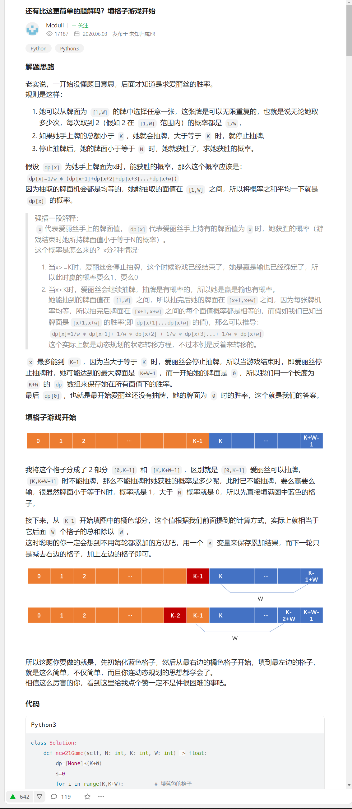

# 概率期望

1227\. 飞机座位分配概率
---------------

有 `n` 位乘客即将登机，飞机正好有 `n` 个座位。第一位乘客的票丢了，他随便选了一个座位坐下。

剩下的乘客将会：

*   如果他们自己的座位还空着，就坐到自己的座位上，

*   当他们自己的座位被占用时，随机选择其他座位

第 `n` 位乘客坐在自己的座位上的概率是多少？

**示例 1：**

**输入：**n = 1
**输出：**1.00000
**解释：**第一个人只会坐在自己的位置上。

**示例 2：**

**输入:** n = 2
**输出:** 0.50000
**解释：**在第一个人选好座位坐下后，第二个人坐在自己的座位上的概率是 0.5。

**提示：**

*   `1 <= n <= 10^5`

[https://leetcode.cn/problems/airplane-seat-assignment-probability/description/](https://leetcode.cn/problems/airplane-seat-assignment-probability/description/)

```java
class Solution {
    public double nthPersonGetsNthSeat(int n) {
        return n == 1 ? 1.0 : 0.5;
    }
}
```

688\. 骑士在棋盘上的概率
---------------

在一个 `n x n` 的国际象棋棋盘上，一个骑士从单元格 `(row, column)` 开始，并尝试进行 `k` 次移动。行和列是 **从 0 开始** 的，所以左上单元格是 `(0,0)` ，右下单元格是 `(n - 1, n - 1)` 。

象棋骑士有8种可能的走法，如下图所示。每次移动在基本方向上是两个单元格，然后在正交方向上是一个单元格。


每次骑士要移动时，它都会随机从8种可能的移动中选择一种(即使棋子会离开棋盘)，然后移动到那里。

骑士继续移动，直到它走了 `k` 步或离开了棋盘。

返回 _骑士在棋盘停止移动后仍留在棋盘上的概率_ 。

**示例 1：**

**输入:** n = 3, k = 2, row = 0, column = 0
**输出:** 0.0625
**解释:** 有两步(到(1,2)，(2,1))可以让骑士留在棋盘上。
在每一个位置上，也有两种移动可以让骑士留在棋盘上。
骑士留在棋盘上的总概率是0.0625。

**示例 2：**

**输入:** n = 1, k = 0, row = 0, column = 0
**输出:** 1.00000

**提示:**

*   `1 <= n <= 25`
*   `0 <= k <= 100`
*   `0 <= row, column <= n - 1`

[https://leetcode.cn/problems/knight-probability-in-chessboard/description/](https://leetcode.cn/problems/knight-probability-in-chessboard/description/)

```java
class Solution {
    static int[][] dirs = {{-2, -1}, {-2, 1}, {-1, 2}, {1, 2}, {2, 1}, {2, -1}, {1, -2}, {-1, -2}};

    public double knightProbability(int n, int k, int row, int column) {
        double[][][] dp = new double[k + 1][n][n];
        dp[0][row][column] = 1.0;
        for (int m = 0; m < k; m++) {
            for (int i = 0; i < n; i++) {
                for (int j = 0; j < n; j++) {
                    for (int[] dir : dirs) {
                        int newRow = i + dir[0], newColumn = j + dir[1];
                        if (newRow >= 0 && newRow < n && newColumn >= 0 && newColumn < n) {
                            dp[m + 1][newRow][newColumn] += dp[m][i][j] / 8;
                        }
                    }
                }
            }
        }
        double total = 0.0;
        for (int i = 0; i < n; i++) {
            for (int j = 0; j < n; j++) {
                total += dp[k][i][j];
            }
        }
        return total;
    }
}
```

837\. 新 21 点
------------

爱丽丝参与一个大致基于纸牌游戏 **“21点”** 规则的游戏，描述如下：

爱丽丝以 `0` 分开始，并在她的得分少于 `k` 分时抽取数字。 抽取时，她从 `[1, maxPts]` 的范围中随机获得一个整数作为分数进行累计，其中 `maxPts` 是一个整数。 每次抽取都是独立的，其结果具有相同的概率。

当爱丽丝获得 `k` 分 **或更多分** 时，她就停止抽取数字。

爱丽丝的分数不超过 `n` 的概率是多少？

与实际答案误差不超过 `10-5` 的答案将被视为正确答案。

 

**示例 1：**

**输入：**n = 10, k = 1, maxPts = 10
**输出：**1.00000
**解释：**爱丽丝得到一张牌，然后停止。

**示例 2：**

**输入：**n = 6, k = 1, maxPts = 10
**输出：**0.60000
**解释：**爱丽丝得到一张牌，然后停止。 在 10 种可能性中的 6 种情况下，她的得分不超过 6 分。

**示例 3：**

**输入：**n = 21, k = 17, maxPts = 10
**输出：**0.73278

**提示：**

*   `0 <= k <= n <= 104`
*   `1 <= maxPts <= 104`

[https://leetcode.cn/problems/new-21-game/description/](https://leetcode.cn/problems/new-21-game/description/)



```java
class Solution {
    public double new21Game(int n, int k, int maxPts) {
        double[] dp = new double[k+ maxPts];
        double sum = 0;
        for (int i = k; i < k + maxPts; i++) {
            dp[i] = i <= n ? 1 : 0;
            sum += dp[i];
        }
        for (int i = k - 1; i >= 0; i--) {
            dp[i] = sum / maxPts;
            sum = sum - dp[i + maxPts] + dp[i];
        }
        return dp[0];
    }
}
```


1467\. 两个盒子中球的颜色数相同的概率
----------------------

桌面上有 `2n` 个颜色不完全相同的球，球上的颜色共有 `k` 种。给你一个大小为 `k` 的整数数组 `balls` ，其中 `balls[i]` 是颜色为 `i` 的球的数量。

所有的球都已经 **随机打乱顺序** ，前 `n` 个球放入第一个盒子，后 `n` 个球放入另一个盒子（请认真阅读示例 2 的解释部分）。

**注意：**这两个盒子是不同的。例如，两个球颜色分别为 `a` 和 `b`，盒子分别为 `[]` 和 `()`，那么 `[a] (b)` 和 `[b] (a)` 这两种分配方式是不同的（请认真阅读示例的解释部分）。

请返回「两个盒子中球的颜色数相同」的情况的概率。答案与真实值误差在 `10^-5` 以内，则被视为正确答案

**示例 1：**

**输入：**balls = \[1,1\]
**输出：**1.00000
**解释：**球平均分配的方式只有两种：
- 颜色为 1 的球放入第一个盒子，颜色为 2 的球放入第二个盒子
- 颜色为 2 的球放入第一个盒子，颜色为 1 的球放入第二个盒子
  这两种分配，两个盒子中球的颜色数都相同。所以概率为 2/2 = 1 。

**示例 2：**

**输入：**balls = \[2,1,1\]
**输出：**0.66667
**解释：**球的列表为 \[1, 1, 2, 3\]
随机打乱，得到 12 种等概率的不同打乱方案，每种方案概率为 1/12 ：
\[1,1 / 2,3\], \[1,1 / 3,2\], \[1,2 / 1,3\], \[1,2 / 3,1\], \[1,3 / 1,2\], \[1,3 / 2,1\], \[2,1 / 1,3\], \[2,1 / 3,1\], \[2,3 / 1,1\], \[3,1 / 1,2\], \[3,1 / 2,1\], \[3,2 / 1,1\]
然后，我们将前两个球放入第一个盒子，后两个球放入第二个盒子。
这 12 种可能的随机打乱方式中的 8 种满足「两个盒子中球的颜色数相同」。
概率 = 8/12 = 0.66667

**示例 3：**

**输入：**balls = \[1,2,1,2\]
**输出：**0.60000
**解释：**球的列表为 \[1, 2, 2, 3, 4, 4\]。要想显示所有 180 种随机打乱方案是很难的，但只检查「两个盒子中球的颜色数相同」的 108 种情况是比较容易的。
概率 = 108 / 180 = 0.6 。

**提示：**

*   `1 <= balls.length <= 8`
*   `1 <= balls[i] <= 6`
*   `sum(balls)` 是偶数

[https://leetcode.cn/problems/probability-of-a-two-boxes-having-the-same-number-of-distinct-balls/description/](https://leetcode.cn/problems/probability-of-a-two-boxes-having-the-same-number-of-distinct-balls/description/)

```java
class Solution {
    private static int MX = 49;
    int n;
    double ans = 0;
    private static long[][] c = new long[MX][MX]; // 这里记得开long
    static {
        for (int i = 0; i < MX; i++) {
            c[i][i] = c[i][0] = 1;
            for (int j = 1; j < i; j++) {
                c[i][j] = c[i - 1][j] + c[i - 1][j - 1];
            }
        }
    }
    public double getProbability(int[] balls) { // 回溯（暴力写法）
        n = balls.length;
        int[] firstBox = new int[n];
        int[] secondBox = new int[n];
        System.arraycopy(balls, 0, firstBox, 0, n);
        backtrack(firstBox, secondBox, 0);
        return ans;
    }

    private void backtrack(int[] firstBox, int[] secondBox, int index) { 
        if (index == n) { // 到达最后一类球
            int firstSum = 0, secondSum = 0;
            int firstColors = 0, secondColors = 0;
            for (int i = 0; i < n; i++) {
                if (firstBox[i] > 0) {
                    firstSum += firstBox[i];
                    firstColors++;
                }
                if (secondBox[i] > 0) {
                    secondSum += secondBox[i];
                    secondColors++;
                }
            }
            if (firstSum == secondSum && firstColors == secondColors) {
                double probability = 1;
                for (int i = 0; i < n; i++) {
                    probability *= c[firstBox[i] + secondBox[i]][firstBox[i]];
                }
                probability /= c[firstSum + secondSum][firstSum];
                ans += probability;
            }
        }else{
            int firstCur = firstBox[index], secondCur = secondBox[index];
            for (int i = 0; i <= firstCur; i++) { // 开始表示第i种颜色的球全在第一个盒子中
                firstBox[index] = firstCur - i; // 拿出i个，然后放入第二个盒子
                secondBox[index] = secondCur + i;
                backtrack(firstBox, secondBox, index + 1);
            }
            firstBox[index] = firstCur;
            secondBox[index] = secondCur; // 恢复现场
        }
    }
}
```

```java
import java.util.Arrays;

class Solution {
    private static int MX = 49;
    private static long[][] c = new long[MX][MX];
    static {
        for (int i = 0; i < MX; i++) {
            c[i][0] = c[i][i] = 1;
            for (int j = 1; j < i; j++) {
                c[i][j] = c[i - 1][j - 1] + c[i - 1][j];
            }
        }
    }

    Long[][][][] dp;
    int[] balls;
    public double getProbability(int[] balls) {
        this.balls = balls;
        int s = Arrays.stream(balls).sum();
        long sum = c[s][s / 2];
        dp = new Long[balls.length][s / 2 + 1][balls.length + 1][balls.length + 1];
        Long ans = dfs(0, s / 2, 0, balls.length);
        return ans / (double) sum;
    }

    /**
     *
     * @param start 当前种类的下标
     * @param s     两个盒子中球的数量差
     * @param cnt0  盒子1的种类
     * @param cnt1  盒子2的种类
     * @return long 方案数
     */
    private long dfs(int start, int s, int cnt0, int cnt1) {
        if (start >= balls.length) {
            return s == 0 && cnt0 == cnt1 ? 1 : 0;
        }
        if (dp[start][s][cnt0][cnt1] != null) {
            return dp[start][s][cnt0][cnt1];
        }
        long ans = 0;
        for (int i = 0; i <= Math.min(balls[start], s); i++) {
            ans += c[balls[start]][i] * dfs(start + 1, s - i, cnt0 + (i == 0 ? 0 : 1), cnt1 - (i == balls[start] ? 1 : 0));
        }
        return dp[start][s][cnt0][cnt1] = ans;
    }
}
```