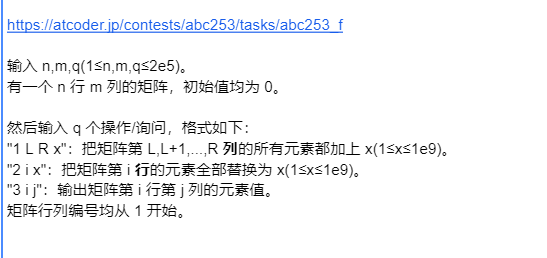

> **不是所有的线段树题目都可以动态开点。**‌
>
> 线段树是一种高效处理区间查询和修改的数据结构，适用于满足加法性质的问题，如最大值、最小值、区间和等。然而，对于不满足加法性质的问题，如区间众数、区间最长连续等，线段树并不适用。动态开点线段树是线段树的一种应用，它允许在运行时动态地创建节点，这对于处理某些特定问题非常有用。但是，这并不意味着所有线段树题目都可以使用动态开点方法解决。实际上，动态开点线段树更多地被视为线段树合并和[主席树](https://www.baidu.com/s?sa=re_dqa_generate&wd=%E4%B8%BB%E5%B8%AD%E6%A0%91&rsv_pq=9e6f166c000b32cb&oq=%E6%89%80%E6%9C%89%E7%9A%84%E7%BA%BF%E6%AE%B5%E6%A0%91%E9%A2%98%E7%9B%AE%E9%83%BD%E5%8F%AF%E4%BB%A5%E5%8A%A8%E6%80%81%E5%BC%80%E7%82%B9%E5%90%97&rsv_t=579e9sSVLqOuRNzqPIB4yaM4jc3QkZbcCi3WxElCFbqkjKD3ZnrW9i/ZRoifjDSps+7W&tn=baiduhome_pg&ie=utf-8)的前置知识，而不是一种通用的解决方案。
>
> 因此，是否可以使用动态开点线段树解决特定问题，需要根据问题的具体性质和需求来判断。在处理问题时，应首先分析问题是否满足线段树的应用条件，即是否满足加法性质，然后再考虑是否需要动态开点的功能。对于不满足加法性质的问题，或者不需要动态调整的问题，使用传统的静态线段树可能更为合适‌

# 【模板】

> pushup就是一个向上归并的过程，涉及区间查询就需要pushup
>
> pushdwn是向下懒加载，涉及区间更新就需要pushdown

> 注意：pushdown里面是累加还是直接赋值

## [1、静态线段树 + 区间和](https://www.luogu.com.cn/problem/P3372)

```java
import java.io.*;
import java.math.BigInteger;
import java.util.*;

public class Main {
	// 快读已经删除
    public static void main(String[] args) throws IOException {
        // int T = sc.nextInt();
        while (T-- > 0) {
            solve();
            // sc.bw.flush();
        }
        sc.bw.flush();
        sc.bw.close();
    }

    private static String[] ss;
    private static String s;

    private static void solve() throws IOException {
        int n = sc.nextInt();
        int m = sc.nextInt();
        ss = sc.nextLine().split(" ");
        for (int i = 1; i <= n; i++) {
            nums[i] = Integer.parseInt(ss[i - 1]); // 下标从1开始
        }
        build(1, 1, n);
        for (int i = 0; i < m; i++) {
            ss = sc.nextLine().split(" ");
            int q = Integer.parseInt(ss[0]);
            if (q == 1) {
                int x = Integer.parseInt(ss[1]);
                int y = Integer.parseInt(ss[2]);
                int z = Integer.parseInt(ss[3]);
                update(1, x, y, z);
            }else {
                int x = Integer.parseInt(ss[1]);
                int y = Integer.parseInt(ss[2]);
                sc.println(query(1, x, y));
            }
        }
    }

    static final int N = 100010;
    static int[] nums = new int[N + 2];
    static Node[] nodes = new Node[4 * N + 2];

    static class Node {
        int l, r;
        long val, add;

        Node(int l, int r) {
            this.l = l;
            this.r = r;
        }
    }

    static void build(int p, int l, int r) { // 对于一个区间（编号为p），他的左儿子为2p，右儿子为2p+1
        nodes[p] = new Node(l, r);
        if (l == r) {
            nodes[p].val = nums[l];
            return;
        }
        int mid = (l + r) >> 1;
        build(p * 2, l, mid);
        build(p * 2 + 1, mid + 1, r);
        nodes[p].val = nodes[p * 2].val + nodes[p * 2 + 1].val;
    }

    static void pushdown(int p) {
        if (nodes[p].add != 0) {
            nodes[p * 2].val += nodes[p].add * (nodes[p * 2].r - nodes[p * 2].l + 1);
            nodes[p * 2 + 1].val += nodes[p].add * (nodes[p * 2 + 1].r - nodes[p * 2 + 1].l + 1);
            nodes[p * 2].add += nodes[p].add;
            nodes[p * 2 + 1].add += nodes[p].add;
            nodes[p].add = 0;
        }
    }

    static void update(int p, int x, int y, int z) {
        if (x <= nodes[p].l && y >= nodes[p].r) {
            nodes[p].val += (long) z * (nodes[p].r - nodes[p].l + 1);
            nodes[p].add += z;
            return;
        }
        pushdown(p);
        int mid = (nodes[p].l + nodes[p].r) >> 1;
        if (x <= mid) update(p * 2, x, y, z);
        if (y > mid) update(p * 2 + 1, x, y, z);
        nodes[p].val = nodes[p * 2].val + nodes[p * 2 + 1].val;
    }

    static long query(int p, int x, int y) {
        if (x <= nodes[p].l && y >= nodes[p].r) return nodes[p].val;
        pushdown(p);
        int mid = (nodes[p].l + nodes[p].r) >> 1;
        long ans = 0;
        if (x <= mid) ans += query(p * 2, x, y);
        if (y > mid) ans += query(p * 2 + 1, x, y);
        return ans;
    }
}
```

## [2、静态线段树 + 区间开关灯](https://www.luogu.com.cn/problem/P3870)

```java
import java.io.*;
import java.math.BigInteger;
import java.util.*;

public class Main {
    public static void main(String[] args) throws IOException {
        // int T = sc.nextInt();
        while (T-- > 0) {
            solve();
            // sc.bw.flush();
        }
        sc.bw.flush();
        sc.bw.close();
    }

    private static String[] ss;
    private static String s;

    private static void solve() throws IOException {
        int n = sc.nextInt();
        int m = sc.nextInt();
        build(1, 1, n);
        for (int i = 0; i < m; i++) {
            ss = sc.nextLine().split(" ");
            int ops = Integer.parseInt(ss[0]);
            int left = Integer.parseInt(ss[1]);
            int right = Integer.parseInt(ss[2]);
            if (ops == 0) {
                update(1, left, right);
            }else{
                sc.println(query(1, left, right));
            }
        }
    }

    static final int N = 100010;
    static Node[] nodes = new Node[4 * N + 2];

    static class Node {
        int l, r;
        long val0, val1, add; // val0表示关着的灯的数量， val1表示开着的灯数量

        Node(int l, int r) {
            this.l = l;
            this.r = r;
        }
    }

    static void build(int p, int l, int r) { // 对于一个区间（编号为p），他的左儿子为2p，右儿子为2p+1
        nodes[p] = new Node(l, r);
        if (l == r) {
            nodes[p].val0++;
            return;
        }
        int mid = (l + r) >> 1;
        build(p * 2, l, mid);
        build(p * 2 + 1, mid + 1, r);
        nodes[p].val0 = nodes[p * 2].val0 + nodes[p * 2 + 1].val0;
    }

    static void pushdown(int p) {
        if (nodes[p].add == 0) {
            return;
        }
        // 交换
        long tmp = nodes[p*2].val0;
        nodes[p * 2].val0 = nodes[p * 2].val1;
        nodes[p * 2].val1 = tmp;
        tmp = nodes[p * 2 + 1].val0;
        nodes[p * 2 + 1].val0 = nodes[p * 2 + 1].val1;
        nodes[p * 2 + 1].val1 = tmp;
        // 开关灯就相当于 ^ 一下
        nodes[p * 2].add ^= 1;
        nodes[p * 2 + 1].add ^= 1;
        nodes[p].add = 0;
    }

    static void update(int p, int x, int y) {
        if (x <= nodes[p].l && y >= nodes[p].r) {
            nodes[p].add ^= 1;
            long tmp = nodes[p].val0;
            nodes[p].val0 = nodes[p].val1;
            nodes[p].val1 = tmp;
            return;
        }
        pushdown(p);
        int mid = (nodes[p].l + nodes[p].r) >> 1;
        if (x <= mid) update(p * 2, x, y);
        if (y > mid) update(p * 2 + 1, x, y);
        nodes[p].val0 = nodes[p * 2].val0 + nodes[p * 2 + 1].val0;
        nodes[p].val1 = nodes[p * 2].val1 + nodes[p * 2 + 1].val1;
    }

    static long query(int p, int x, int y) {
        if (x <= nodes[p].l && y >= nodes[p].r) return nodes[p].val1;
        pushdown(p);
        int mid = (nodes[p].l + nodes[p].r) >> 1;
        long ans = 0;
        if (x <= mid) ans += query(p * 2, x, y);
        if (y > mid) ans += query(p * 2 + 1, x, y);
        return ans;
    }
}
```

## [3、静态线段树 + 等差数列修改区间](https://www.luogu.com.cn/problem/P1438)

> 本题正解很明显就是：**线段树**
>
> **是的，你没有看错，就只有线段树。**
>
> 很显然我们直接按照线段树板题写就可以了，维护题目需要维护的，注意到只有单点查询，所以我们根本不需要维护区间和，**对于区间来讲，我们只用维护修改操作**，修改操作只需要 s,d（首项和公差）。
>
> 考虑该操作如何向下传递（pushdown）:
>
> 1. 对于左区间来讲，s,d 没有改变，直接赋值。
> 2. 对于右区间来讲，只有 Sright=Sfather+len∗d，其中 len 是左区间长度。
>
> 此外我们发现：对于同一段区间，修改操作是可以叠加的。
>
> **好的，我们做完了**，甚至不需要 pushup 操作。
>
> 是的，就是这么简单，当区间变成一个点时，我们发现对于这个点的修改就是加上 s。

```java
import java.io.*;
import java.math.BigInteger;
import java.util.*;

public class Main {
    private static void solve() throws IOException {
        int n = sc.nextInt();
        int m = sc.nextInt();
        ss = sc.nextLine().split(" ");
        for (int i = 1; i <= n; i++) {
            nums[i] = Integer.parseInt(ss[i - 1]);
        }
        build(1, 1, n);
        for (int i = 0; i < m; i++) {
            ss = sc.nextLine().split(" ");
            int ops = Integer.parseInt(ss[0]);
            if (ops == 1) {
                int left = Integer.parseInt(ss[1]);
                int right = Integer.parseInt(ss[2]);
                int s = Integer.parseInt(ss[3]); // 首项
                int d = Integer.parseInt(ss[4]); // 公差
                update(1, left, right, s, d);
            }else{
                int x = Integer.parseInt(ss[1]);
                sc.println(query(1, x));
            }
        }
    }

    static final int N = 100010;
    static Node[] nodes = new Node[4 * N + 2];
    static int[] nums = new int[N];

    static class Node {
        int l, r;
        long val, add, s, d; // 首项：s 公差：d

        Node(int l, int r) {
            this.l = l;
            this.r = r;
        }
    }

    static void build(int p, int l, int r) { // 对于一个区间（编号为p），他的左儿子为2p，右儿子为2p+1
        nodes[p] = new Node(l, r);
        if (l == r) {
            nodes[p].val = nums[l];
            return;
        }
        int mid = (l + r) >> 1;
        build(p * 2, l, mid);
        build(p * 2 + 1, mid + 1, r);
    }

    static void pushdown(int p) {
        if (nodes[p].add == 0) {
            return;
        }
        nodes[p * 2].s += nodes[p].s; // 必须是+=，因为是懒加载，所有不能用覆盖
        nodes[p * 2].d += nodes[p].d;
        nodes[p * 2].add = 1;
        nodes[p * 2 + 1].s += nodes[p].s + (nodes[p * 2 + 1].l - nodes[p * 2].l) * nodes[p].d;
        nodes[p * 2 + 1].d += nodes[p].d;
        nodes[p * 2 + 1].add = 1;
        nodes[p].add = 0;
        nodes[p].d = nodes[p].s = 0;
    }

    static void update(int p, int x, int y, int s, int d) { // 这里的节点p不是真正意义上的数组编号，而是二叉树节点编号
        if (x <= nodes[p].l && y >= nodes[p].r) {
            nodes[p].add = 1;
            nodes[p].s += s + (long) (nodes[p].l - x) * d;
            nodes[p].d += d; // 为了向上归并时，上一行元素的公差就比下一行的公差大d
            return;
        }
        pushdown(p);
        int mid = (nodes[p].l + nodes[p].r) >> 1;
        if (x <= mid) update(p * 2, x, y, s, d);
        if (y > mid) update(p * 2 + 1, x, y, s, d);
        // 不需要区间合并！！！都没有区间上的提问
    }

    static long query(int p, int x) {
        if (nodes[p].l == nodes[p].r) { // 单点查询
            nodes[p].val += nodes[p].s;
            nodes[p].s = nodes[p].d = 0;
            return nodes[p].val;
        }
        pushdown(p);
        int mid = (nodes[p].l + nodes[p].r) >> 1;
        if (x <= mid) return query(p * 2, x);
        else return query(p * 2 + 1, x);
    }
}
```

## [4、静态线段树 + 区间修改（累加+赋值） + 区间最大值](https://www.luogu.com.cn/problem/P1438)

> 评测机卡java  9/10  最后1e6过不去
>
> 这题有一个坑，最开始我只用了
>
> ```java
> static class Node {
>         int l, r;
>         long val, add; // add中 1表示原地赋值，2表示需要累加的值
>         Node(int l, int r) {
>             this.l = l;
>             this.r = r;
>         }
>     }
> ```
>
> 但是有一个问题，就是懒加载节点时，我们如果一个前面堆积着操作1，但是需要用这个节点我们上一次操作是操作2，这时前面的所有操作都会变成操作2

```java
import java.io.*;
import java.math.BigInteger;
import java.util.*;

public class Main {
    public static void main(String[] args) throws IOException {
        // int T = sc.nextInt();
        while (T-- > 0) {
            solve();
            // sc.bw.flush();
        }
        sc.bw.flush();
        sc.bw.close();
    }

    private static String[] ss;
    private static String s;
    static boolean flag = true;

    private static void solve() throws IOException {
        int n = sc.nextInt();
        int m = sc.nextInt();
        ss = sc.nextLine().split(" ");
        for (int i = 1; i <= n; i++) {
            nums[i] = Integer.parseInt(ss[i - 1]);
        }
        build(1, 1, n);
        for (int i = 0; i < m; i++) {
            ss = sc.nextLine().split(" ");
            int ops = Integer.parseInt(ss[0]);
            int left = Integer.parseInt(ss[1]);
            int right = Integer.parseInt(ss[2]);
            if (ops == 1 || ops == 2) {
                int val = Integer.parseInt(ss[3]);
                update(1, left, right, val, ops);
            } else {
                sc.println(query(1, left, right));
            }
        }
    }

    static final int N = 1000010;
    static Node[] nodes = new Node[4 * N + 2];
    static long[] nums = new long[N];

    static class Node {
        int l, r;
        long val, tag1, tag2; // tag1表示原地赋值，tag2表示需要累加的值
        boolean isUsedOps1; // 表示是否有操作一需要下放

        Node(int l, int r) {
            this.l = l;
            this.r = r;
        }
    }

    static void build(int p, int l, int r) { // 对于一个区间（编号为p），他的左儿子为2p，右儿子为2p+1
        nodes[p] = new Node(l, r);
        if (l == r) {
            nodes[p].val = nums[l];
            return;
        }
        int mid = (l + r) >> 1;
        build(p * 2, l, mid);
        build(p * 2 + 1, mid + 1, r);
        nodes[p].val = Math.max(nodes[p * 2].val, nodes[p * 2 + 1].val);
    }

    static void pushdown(int p) {
        if (nodes[p].isUsedOps1) { // 有赋值操作需要下放
            nodes[p * 2].tag1 = nodes[p * 2 + 1].tag1 = nodes[p].tag1;
            nodes[p * 2].tag2 = nodes[p * 2 + 1].tag2 = nodes[p].tag2;
            nodes[p * 2].val = nodes[p * 2 + 1].val = nodes[p].tag1 + nodes[p].tag2;
            nodes[p * 2].isUsedOps1 = nodes[p * 2 + 1].isUsedOps1 = true;
        }else{ // 操作二
            nodes[p * 2].tag2 += nodes[p].tag2;
            nodes[p * 2 + 1].tag2 += nodes[p].tag2;
            nodes[p * 2].val += nodes[p].tag2;
            nodes[p * 2 + 1].val += nodes[p].tag2;
        }
        nodes[p].isUsedOps1 = false;
        nodes[p].tag1 = nodes[p].tag2 = 0;
    }

    static void update(int p, int pl, int pr, int x, int ops) { // 这里的节点p不是真正意义上的数组编号，而是二叉树节点编号
        if (pl <= nodes[p].l && pr >= nodes[p].r) {
            if (ops == 1) {
                nodes[p].val = x;
                nodes[p].tag1 = x;
                nodes[p].tag2 = 0;
                nodes[p].isUsedOps1 = true;
            } else if (ops == 2) {
                nodes[p].val += x;
                nodes[p].tag2 += x;
            }
            return;
        }
        pushdown(p);
        int mid = (nodes[p].l + nodes[p].r) >> 1;
        if (pl <= mid) update(p * 2, pl, pr, x, ops);
        if (pr > mid) update(p * 2 + 1, pl, pr, x, ops);
        // 给定区间[l,r]，求区间内的最大值。  归并过程
        nodes[p].val = Math.max(nodes[p * 2].val, nodes[p * 2 + 1].val);
    }

    static long query(int p, int pl, int pr) {
        if (pl <= nodes[p].l && pr >= nodes[p].r) {
            return nodes[p].val;
        }
        pushdown(p);
        int mid = (nodes[p].l + nodes[p].r) >> 1;
        long ans = Long.MIN_VALUE;
        if (pl <= mid) ans = Math.max(ans, query(p * 2, pl, pr));
        if (pr > mid) ans = Math.max(ans, query(p * 2 + 1, pl, pr));
        return ans;
    }
}
```

## [5、静态线段树 + 区间修改（乘法+加法） + 区间和](https://www.luogu.com.cn/problem/P3373)

```java
import java.io.*;
import java.math.BigInteger;
import java.util.*;

public class Main {
    private static void solve() throws IOException {
        int n = sc.nextInt();
        int q = sc.nextInt();
        Mod = sc.nextInt();
        ss = sc.nextLine().split(" ");
        for (int i = 1; i <= n; i++) {
            nums[i] = Integer.parseInt(ss[i - 1]);
        }
        build(1, 1, n);
        for (int i = 0; i < q; i++) {
            ss = sc.nextLine().split(" ");
            int ops = Integer.parseInt(ss[0]);
            int left = Integer.parseInt(ss[1]);
            int right = Integer.parseInt(ss[2]);
            if (ops == 1 || ops == 2) {
                int val = Integer.parseInt(ss[3]);
                update(1, left, right, val, ops);
            } else {
                sc.println(query(1, left, right));
            }
        }
    }

    static final int N = 1000010;
    static Node[] nodes = new Node[4 * N + 2];
    static long[] nums = new long[N];

    static class Node {
        int l, r;
        long val, tag1, tag2; // tag1表示累乘，tag2表示累加

        Node(int l, int r) {
            this.tag2 = 1;
            this.l = l;
            this.r = r;
        }
    }

    static void build(int p, int l, int r) { // 对于一个区间（编号为p），他的左儿子为2p，右儿子为2p+1
        nodes[p] = new Node(l, r);
        if (l == r) {
            nodes[p].val = nums[l];
            return;
        }
        int mid = (l + r) >> 1;
        build(p * 2, l, mid);
        build(p * 2 + 1, mid + 1, r);
        nodes[p].val = (nodes[p * 2].val + nodes[p * 2 + 1].val) % Mod;
    }

    static void pushdown(int p) {
        // 根据我们规定的优先度，儿子的值=此刻儿子的值*爸爸的乘法lazy_tag+儿子的区间长度*爸爸的加法lazy_tag
        int mid = (nodes[p].l + nodes[p].r) / 2;
        nodes[p * 2].val = (nodes[p * 2].val * nodes[p].tag2 + nodes[p].tag1 * (mid - nodes[p].l + 1)) % Mod; // 要中间节点
        nodes[p * 2 + 1].val = (nodes[p * 2 + 1].val * nodes[p].tag2 + nodes[p].tag1 * (nodes[p].r - mid)) % Mod; // 不要中间节点
        // 维护lazy_tag
        nodes[p * 2].tag2 = (nodes[p * 2].tag2 * nodes[p].tag2) % Mod;
        nodes[p * 2 + 1].tag2 = (nodes[p * 2 + 1].tag2 * nodes[p].tag2) % Mod;
        nodes[p * 2].tag1 = (nodes[p * 2].tag1 * nodes[p].tag2 + nodes[p].tag1) % Mod;
        nodes[p * 2 + 1].tag1 = (nodes[p * 2 + 1].tag1 * nodes[p ].tag2 + nodes[p].tag1) % Mod;
        // 重置父节点
        nodes[p].tag2 = 1;
        nodes[p].tag1 = 0;
    }

    static void update(int p, int pl, int pr, int x, int ops) { // 这里的节点p不是真正意义上的数组编号，而是二叉树节点编号
        if (pl <= nodes[p].l && pr >= nodes[p].r) {
            if (ops == 1) { // 乘法
                nodes[p].val = nodes[p].val * x % Mod;
                nodes[p].tag2 = (nodes[p].tag2 * x) % Mod;
                nodes[p].tag1 = (nodes[p].tag1 * x) % Mod;
            } else if (ops == 2) { // 加法
                nodes[p].val = (nodes[p].val + (long) x * (nodes[p].r - nodes[p].l + 1)) % Mod;
                nodes[p].tag1 = (nodes[p].tag1 + x) % Mod;
            }
            return;
        }
        pushdown(p);
        int mid = (nodes[p].l + nodes[p].r) >> 1;
        if (pl <= mid) update(p * 2, pl, pr, x, ops);
        if (pr > mid) update(p * 2 + 1, pl, pr, x, ops);
        // 给定区间[l,r]，求区间内的最大值。  归并过程
        nodes[p].val = (nodes[p * 2].val + nodes[p * 2 + 1].val) % Mod;
    }

    static long query(int p, int pl, int pr) {
        if (pl <= nodes[p].l && pr >= nodes[p].r) {
            return nodes[p].val;
        }
        pushdown(p);
        int mid = (nodes[p].l + nodes[p].r) >> 1;
        long ans = 0;
        if (pl <= mid) ans += query(p * 2, pl, pr);
        if (pr > mid) ans += query(p * 2 + 1, pl, pr);
        return ans % Mod;
    }
}
```

## [6、静态线段树 + 单点修改+（区间里面连续区间，有负数）最大值查询](https://www.luogu.com.cn/problem/P4513)

```java
class Main{ // 又卡我java内存
    private static String[] ss;
    private static String s;
    static boolean flag = true;

    private static void solve() throws IOException {
        int n = sc.nextInt();
        int m = sc.nextInt();
        for (int i = 1; i <= n; i++) {
            nums[i] = sc.nextInt();
        }
        build(1, 1, n);
        for (int i = 0; i < m; i++) {
            ss = sc.nextLine().split(" ");
            int ops = Integer.parseInt(ss[0]);
            if (ops == 1) {
                int left = Integer.parseInt(ss[1]);
                int right = Integer.parseInt(ss[2]);
                if (left > right) {
                    int tmp = left;
                    left = right;
                    right = tmp;
                }
                sc.println(query(1, left, right).ans);
            } else if (ops == 2) {
                int x = Integer.parseInt(ss[1]);
                int y = Integer.parseInt(ss[2]);
                update(1, x, y);
            }
        }
    }

    static final int N = 500010;
    static Node[] nodes = new Node[4 * N + 2];
    static long[] nums = new long[N];

    static class Node {
        int l, r;
        long sum, leftMax, rightMax, ans; // sum就是区间和，就是（val）,leftMax:左端点开始最大值；rightMax:右端点开始最大值；ans:区间最大值
        Node(int l, int r) {
            this.l = l;
            this.r = r;
        }
    }

    static void build(int p, int l, int r) { // 对于一个区间（编号为p），他的左儿子为2p，右儿子为2p+1
        nodes[p] = new Node(l, r);
        if (l == r) {
            nodes[p].leftMax= nodes[p].rightMax= nodes[p].ans = nodes[p].sum = nums[l];
            return;
        }
        int mid = (l + r) >> 1;
        build(p * 2, l, mid);
        build(p * 2 + 1, mid + 1, r);
        pushup(p);
    }

    static void pushup(int p) {
        nodes[p].sum = nodes[p * 2].sum + nodes[p * 2 + 1].sum;
        nodes[p].leftMax = Math.max(nodes[p * 2].leftMax, nodes[p * 2].sum + nodes[p * 2 + 1].leftMax);
        nodes[p].rightMax = Math.max(nodes[p * 2 + 1].rightMax, nodes[p * 2 + 1].sum + nodes[p * 2].rightMax);
        nodes[p].ans = Math.max(nodes[p * 2].rightMax + nodes[p*2+1].leftMax, Math.max(nodes[p * 2].ans, nodes[p * 2 + 1].ans));
    }

    static void update(int p, int x, int y) { // 这里的节点p不是真正意义上的数组编号，而是二叉树节点编号
//        if (pl <= nodes[p].l && pr >= nodes[p].r) {
//            nodes[p].sum = nodes[p].leftMax = nodes[p].rightMax = nodes[p].ans = s; // 单点更新
//            return;
//        }
        if (nodes[p].l == nodes[p].r) {
            nodes[p].sum = nodes[p].leftMax = nodes[p].rightMax = nodes[p].ans = y; // 单点更新
            return;
        }
        int mid = (nodes[p].l + nodes[p].r) / 2;
        if (x <= mid) update(p * 2, x, y);
        else update(p * 2 + 1, x, y);
        // 给定区间[l,r]，求区间内的最大值。  归并过程
        pushup(p);
    }

    static Node query(int p, int pl, int pr) {
        if (pl <= nodes[p].l && pr >= nodes[p].r) {
            return nodes[p];
        }
        int mid = (nodes[p].l + nodes[p].r) >> 1;
        if (pr <= mid) { // 全在左边
            return query(p * 2, pl, pr);
        } else if (pl > mid) { // 全在右边
            return query(p * 2 + 1, pl, pr);
        }else{
            //否则就左右儿子都访问，然后合并区间
            Node node = new Node(0, 0), a = query(p * 2, pl, pr), b = query(p * 2 + 1, pl, pr);
            node.leftMax = Math.max(a.leftMax, a.sum + b.leftMax);
            node.rightMax = Math.max(b.rightMax, b.sum + a.rightMax);
            node.ans = Math.max(a.rightMax + b.leftMax, Math.max(a.ans, b.ans));
            return node;
        }
    }
}
```

## [7、静态线段树 + 区间修改+区间查询（平均数+方差）](https://www.luogu.com.cn/problem/P1471)

> 方差不用开方！！！
>
> nodes[p]对应的区间长度就是nodes[p].r - nodes[p].l + 1

```java
public class Main {
    static Read sc = new Read();
    private static int Mod = (int) 1e9 + 7;
    private static int T = 1;

    public static void main(String[] args) throws IOException {
        // int T = sc.nextInt();
        while (T-- > 0) {
            //solveClapper();
            solve();
            // sc.bw.flush();
        }
        sc.bw.flush();
        sc.bw.close();
    }

    private static String[] ss;
    private static String s;
    static boolean flag = true;

    static final int N = 100010;
    static double[] nums = new double[N + 2];
    static Node[] nodes = new Node[4 * N + 2];

    static class Node {
        int l, r;
        double sum, pow2, add; // 区间和， 区间平方和， 懒标记

        Node(int l, int r) {
            this.l = l;
            this.r = r;
        }
    }

    static void build(int p, int l, int r) { // 对于一个区间（编号为p），他的左儿子为2p，右儿子为2p+1
        nodes[p] = new Node(l, r);
        if (l == r) {
            nodes[p].sum = nums[l];
            nodes[p].pow2 = nums[l] * nums[l];
            return;
        }
        int mid = (l + r) >> 1;
        build(p * 2, l, mid);
        build(p * 2 + 1, mid + 1, r);
        pushup(p);
    }

    static void pushup(int p) {
        nodes[p].sum = nodes[p * 2].sum + nodes[p * 2 + 1].sum;
        nodes[p].pow2 = nodes[p * 2].pow2 + nodes[p * 2 + 1].pow2;
    }

    static void pushdown(int p) {
        double add = nodes[p].add;
        if (add != 0) {
            nodes[p * 2].pow2 += 2 * add * nodes[p * 2].sum + add * add * (nodes[p * 2].r - nodes[p * 2].l + 1);
            nodes[p * 2 + 1].pow2 += 2 * add * nodes[p * 2 + 1].sum + add * add * (nodes[p * 2 + 1].r - nodes[p * 2 + 1].l + 1);
            nodes[p * 2].sum += add * (nodes[p * 2].r - nodes[p * 2].l + 1);
            nodes[p * 2 + 1].sum += add * (nodes[p * 2 + 1].r - nodes[p * 2 + 1].l + 1);
            nodes[p * 2].add += add;
            nodes[p * 2 + 1].add += add;
            nodes[p].add = 0;
        }
    }

    static void update(int p, int x, int y, double z) {
        if (x <= nodes[p].l && y >= nodes[p].r) {
            nodes[p].pow2 += 2 * z * nodes[p].sum + z * z * (nodes[p].r - nodes[p].l + 1);
            nodes[p].sum +=  z * (nodes[p].r - nodes[p].l + 1);
            nodes[p].add += z;
            return;
        }
        pushdown(p);
        int mid = (nodes[p].l + nodes[p].r) / 2;
        if (x <= mid) update(p * 2, x, y, z);
        if (y > mid) update(p * 2 + 1, x, y, z);
        pushup(p);
    }

    static double query(int p, int x, int y, int ops) {
        if (x <= nodes[p].l && y >= nodes[p].r){
            if (ops == 2) {
                // 返回总数
                return nodes[p].sum;
            }else{
                // 返回方差的平方
                return nodes[p].pow2;
            }
        }
        pushdown(p);
        int mid = (nodes[p].l + nodes[p].r) / 2;
        double ans = 0;
        if (x <= mid) ans += query(p * 2, x, y, ops);
        if (y > mid) ans += query(p * 2 + 1, x, y, ops);
        return ans;
    }

    private static void solve() throws IOException {
        int n = sc.nextInt();
        int m = sc.nextInt();
        ss = sc.nextLine().split(" ");
        for (int i = 0; i < n; i++) {
            nums[i + 1] = Double.parseDouble(ss[i]);
        }
        build(1, 1, n);
        for (int i = 0; i < m; i++) {
            int ops = sc.nextInt();
            if (ops == 1) {
                int x = sc.nextInt();
                int y = sc.nextInt();
                double z = sc.nextDouble();
                update(1, x, y, z);
            }else{
                int x = sc.nextInt();
                int y = sc.nextInt();
                double ave = query(1, x, y, 2) / (y - x + 1);
                DecimalFormat format = new DecimalFormat("0.0000");
                if (ops == 2) {
                    sc.println(format.format(ave));
                }else{
                    double pow2 = query(1, x, y, 3) / (y - x + 1);
                    sc.println(format.format(pow2 - ave * ave));
                }
            }
        }
    }

}
```

## [8、静态线段树 + 单点修改+（区间最长01交替字串）](https://www.luogu.com.cn/problem/P4513)

```java
public class Main {
    public static void main(String[] args) throws IOException {
        // int T = sc.nextInt();
        while (T-- > 0) {
            solve();
            // sc.bw.flush();
        }
        sc.bw.flush();
        sc.bw.close();
    }

    private static String[] ss;
    private static String s;
    static boolean flag = true;

    static final int N = 200010;
    static long[] nums = new long[N + 2];
    static Node[] nodes = new Node[4 * N + 2];

    static class Node {
        int l, r;
        long leftMax, rightMax, sum;

        Node(int l, int r) {
            leftMax = rightMax = sum = 1;
            this.l = l;
            this.r = r;
        }
    }

    static void build(int p, int l, int r) { // 对于一个区间（编号为p），他的左儿子为2p，右儿子为2p+1
        nodes[p] = new Node(l, r);
        if (l == r) {
            nodes[p].sum = 1;
            return;
        }
        int mid = (l + r) >> 1;
        build(p * 2, l, mid);
        build(p * 2 + 1, mid + 1, r);
        pushup(p);
    }

    static void pushup(int p) {
        nodes[p].sum = Math.max(nodes[p * 2].sum, nodes[p * 2 + 1].sum);
        nodes[p].leftMax = nodes[p * 2].leftMax;
        nodes[p].rightMax = nodes[p * 2 + 1].rightMax;
        if (nums[nodes[p * 2].r] != nums[nodes[p * 2 + 1].l]) {
            nodes[p].sum = Math.max(nodes[p].sum, nodes[p * 2].rightMax + nodes[p * 2 + 1].leftMax);
            if (nodes[p * 2].leftMax == nodes[p * 2].r - nodes[p * 2].l + 1) {
                nodes[p].leftMax += nodes[p * 2 + 1].leftMax;
            }
            if (nodes[p * 2 + 1].rightMax == nodes[p * 2 + 1].r - nodes[p * 2 + 1].l + 1) {
                nodes[p].rightMax += nodes[p * 2].rightMax;
            }
        }
    }

    static void update(int p, int x, int y) {
        if (x <= nodes[p].l && y >= nodes[p].r) {
            nums[nodes[p].l] ^= 1;
            return;
        }
        int mid = (nodes[p].l + nodes[p].r) / 2;
        if (x <= mid) update(p * 2, x, y);
        if (y > mid) update(p * 2 + 1, x, y);
        pushup(p);
    }

    static long query(int p, int x, int y) {
        if (x <= nodes[p].l && y >= nodes[p].r){
            return nodes[p].sum;
        }
        int mid = (nodes[p].l + nodes[p].r) / 2;
        long ans = 0;
        if (x <= mid) ans += query(p * 2, x, y);
        if (y > mid) ans += query(p * 2 + 1, x, y);
        return ans;
    }

    private static void solve() throws IOException {
        int n = sc.nextInt();
        int m = sc.nextInt();
        for (int i = 0; i < n; i++) {
            nums[i + 1] = 0;
        }
        build(1, 1, n);
        for (int i = 0; i < m; i++) {
            int x = sc.nextInt();
            update(1, x, x);
            sc.println(query(1, 1, n));
        }
    }

    private static void solve1() throws IOException { // 对拍器
        int n = 10000;
        int m = 100;
        build(1, 1, n);
        Random random = new Random();
        for (int i = 0; i < m; i++) {
            int x = random.nextInt(n) + 1;
            update(1, x, x);
            long segans = query(1, 1, n);
            long ans = 1;
            long pre = nums[1];
            long cnt = 1;
            for (int j = 2; j <= n; j++) {
                if ((nums[j] ^ pre) == 1) {
                    cnt++;
                    pre ^= 1;
                }else{
                    ans = Math.max(ans, cnt);
                    cnt = 1;
                    pre = nums[j];
                }
            }
            ans = Math.max(ans, cnt);
            if (segans != ans) {
                for (int j = 1; j <= n; j++) {
                    sc.print(nums[j]+",");
                }
                sc.println(" ");
                sc.println("segans:       "+segans);
                sc.println("ans:          " + ans);
                sc.println("--------------------" + i);
                return;
            }
        }
    }


}
```

## [9、静态线段树 + 区间修改+区间查询（状态压缩）](https://www.luogu.com.cn/problem/P1558)

> 30种不同的颜料用（1<<i）来表示状态

```java
import java.io.*;
import java.math.BigInteger;
import java.util.*;

public class Main {
    static Read sc = new Read();
    private static final int Mod = (int) 1e9 + 7;
    private static int T = 1;

    public static void main(String[] args) throws IOException {
        // int T = sc.nextInt();
        while (T-- > 0) {
            solve();
            // sc.bw.flush();
        }
        sc.bw.flush();
        sc.bw.close();
    }

    private static String[] ss;
    private static String s;

    static final int N = 100010;
    static int[] nums = new int[N + 2];
    static Node[] nodes = new Node[4 * N + 2];

    static class Node {
        int l, r;
        long val, add;

        Node(int l, int r) {
            this.l = l;
            this.r = r;
        }
    }

    static void build(int p, int l, int r) { // 对于一个区间（编号为p），他的左儿子为2p，右儿子为2p+1
        nodes[p] = new Node(l, r);
        if (l == r) {
            nodes[p].val = (1 << 1); // 一号色是1左移一位，而不是1
            nums[l] = (1 << 1); // 对拍一下
            return;
        }
        int mid = (l + r) >> 1;
        build(p * 2, l, mid);
        build(p * 2 + 1, mid + 1, r);
        pushup(p);
    }

    static void pushdown(int p) {
        long add = nodes[p].add;
        if (add != 0) {
            nodes[p * 2].val = (1L << add);
            nodes[p * 2 + 1].val = (1L << add);
            nodes[p * 2].add = add;
            nodes[p * 2 + 1].add = add;
            nodes[p].add = 0;
        }
    }

    static void pushup(int p) {
        nodes[p].val = nodes[p * 2].val | nodes[p * 2 + 1].val;
    }

    static void update(int p, int x, int y, int z) {
        if (x <= nodes[p].l && y >= nodes[p].r) {
            nodes[p].val = (1L << z);
            nodes[p].add = z;
            return;
        }
        pushdown(p);
        int mid = (nodes[p].l + nodes[p].r) >> 1;
        if (x <= mid) update(p * 2, x, y, z);
        if (y > mid) update(p * 2 + 1, x, y, z);
        pushup(p);
    }

    static long query(int p, int x, int y) {
        if (x <= nodes[p].l && y >= nodes[p].r) return nodes[p].val;
        pushdown(p);
        int mid = (nodes[p].l + nodes[p].r) >> 1;
        long ans = 0;
        if (x <= mid) ans |= query(p * 2, x, y);
        if (y > mid) ans |= query(p * 2 + 1, x, y);
        return ans;
    }
    private static void solve() throws IOException {
        int L = sc.nextInt(), T = sc.nextInt(), O = sc.nextInt();
        build(1, 1, L);
        while (O-- > 0) {
            ss = sc.nextLine().split(" ");
            int l = Integer.parseInt(ss[1]);
            int r = Integer.parseInt(ss[2]);
            if (l > r) {
                int tmp = l;
                l = r;
                r = tmp;
            }
            if (ss[0].equals("C")) {
                update(1, l, r, Integer.parseInt(ss[3]));
            }else{
                sc.println(Long.bitCount(query(1, l, r)));
            }
        }
    }

    private static void solve1() throws IOException { // 对拍
        int L = 100000, T = 30, O = 10000;
        build(1, 1, L);
        Random random = new Random();
        while (O-- > 0) {
            int ops = random.nextInt(2);
            if (ops == 1) {
                int l = random.nextInt(L) + 1;
                int r = Math.min(L, random.nextInt(L) + l);
                int x = random.nextInt(T) + 1;
                update(1, l, r, x);
                for (int i = l; i <= r; i++) {
                    nums[i] = (1 << x);
                }
            } else {
                int l = random.nextInt(L) + 1;
                int r = Math.min(L, random.nextInt(L) + l);
                long ans1 = Long.bitCount(query(1, l, r));
                long cnt = 0;
                for (int i = l; i <= r; i++) {
                    cnt |= nums[i];
                }
                long ans2 = Long.bitCount(cnt);
                if (ans1 != ans2) {
                    System.out.println("ans1: " + ans1);
                    System.out.println("ans2: " + ans2);
                    System.out.println("L: " + l + "  R: " + r);
                    for (int i = 1; i <= L; i++) {
                        System.out.print(nums[i] + " ");
                    }
                    return;
                }
            }
        }
    }
}
```

## [10、静态线段树 + 单点修改+区间查询（区间字符串）](https://www.luogu.com.cn/problem/P1558)

> 调试了四个多小时，我真的会疯。  （java引用与赋值）
>
>  // ans = node; // 这里是引用地址呀，大哥！！！调了四个小时
>      ans.isValid = true;
>   // ans.cs = node.cs; 这也是错的
>       for (int i = 0; i < n; i++) {
>                ans.cs[i] = node.cs[i];
>         }

```java
public class Main {
    public static void main(String[] args) throws IOException {
        // int T = sc.nextInt();
        while (T-- > 0) {
            solve();
            // sc.bw.flush();
        }
        sc.bw.flush();
        sc.bw.close();
    }

    private static String[] ss;
    private static String s;

    static final int N = 100010;
    static int[] nums = new int[N + 2];
    static Node[] nodes = new Node[4 * N + 2];

    static class Node {
        int l, r;
        char[] cs;
        boolean isValid;
        Node(int l, int r) {
            cs = new char[n];
            Arrays.fill(cs, '?');
            isValid = true;
            this.l = l;
            this.r = r;
        }
    }

    static void build(int p, int l, int r) throws IOException { // 对于一个区间（编号为p），他的左儿子为2p，右儿子为2p+1
        nodes[p] = new Node(l, r);
        if (l == r) {
            nodes[p].cs = sc.next().toCharArray();
            // strs[l] = new String(nodes[p].cs); 对拍用
            return;
        }
        int mid = (l + r) >> 1;
        build(p * 2, l, mid);
        build(p * 2 + 1, mid + 1, r);
        pushup(p);
    }

    static void pushup(int p) {
        for (int i = 0; i < nodes[p].cs.length; i++) {
            if (nodes[p * 2].isValid && nodes[p * 2 + 1].isValid) {
                if (nodes[p * 2].cs[i] == '?' && nodes[p * 2 + 1].cs[i] == '?') {
                    nodes[p].cs[i] = '?';
                } else if (nodes[p * 2].cs[i] == '?') {
                    nodes[p].cs[i] = nodes[p * 2 + 1].cs[i];
                } else if (nodes[p * 2 + 1].cs[i] == '?') {
                    nodes[p].cs[i] = nodes[p * 2].cs[i];
                } else if(nodes[p * 2].cs[i] == nodes[p * 2 + 1].cs[i]){
                    nodes[p].cs[i] = nodes[p * 2].cs[i];
                }else{
                    nodes[p].isValid = false;
                    return;
                }
            } else {
                nodes[p].isValid = false;
                return;
            }
        }
        nodes[p].isValid = true;
    }

    static void update(int p, int x, int y, char[] z) {
        if (x <= nodes[p].l && y >= nodes[p].r) {
            nodes[p].cs = z;
            return;
        }
        int mid = (nodes[p].l + nodes[p].r) >> 1;
        if (x <= mid) update(p * 2, x, y, z);
        if (y > mid) update(p * 2 + 1, x, y, z);
        pushup(p);
    }

    static Node query(int p, int x, int y) {
        if (x <= nodes[p].l && y >= nodes[p].r) return nodes[p];
        int mid = (nodes[p].l + nodes[p].r) >> 1;
        Node ans = new Node(-1, -1);
        if (x <= mid){
            Node node = query(p * 2, x, y);
            if (!node.isValid) {
                ans.isValid = false;
                return ans;
            }else{
                // ans = node; // 这里是引用地址呀，大哥！！！调了四个小时
                ans.isValid = true;
                // ans.cs = node.cs; 这也是错的
                for (int i = 0; i < n; i++) {
                    ans.cs[i] = node.cs[i];
                }
            }
        }
        if (y > mid){
            Node node = query(p * 2 + 1, x, y);
            if (!node.isValid) {
                ans.isValid = false;
                return ans;
            }else{
                char[] cs1 = ans.cs;
                char[] cs2 = node.cs;
                for (int i = 0; i < cs1.length; i++) {
                    if (cs1[i] == '?' && cs2[i] == '?') {
                        ans.cs[i] = '?';
                    } else if (cs1[i] == '?') {
                        ans.cs[i] = cs2[i];
                    } else if (cs2[i] == '?' || cs1[i] == cs2[i]) {

                    }  else {
                        ans.isValid = false;
                        return ans;
                    }
                }
            }
        }
        return ans;
    }
    static int n;
    private static void solve() throws IOException {
        n = sc.nextInt();
        int m = sc.nextInt(), q = sc.nextInt();
        build(1, 1, m);
        int ans = 0;
        while (q-- > 0) {
            ss = sc.nextLine().split(" ");
            if (Integer.parseInt(ss[0]) == 0) {
                Node node = query(1, Integer.parseInt(ss[1]), Integer.parseInt(ss[2]));
                if (node.isValid) {
                    int cnt = 1;
                    for (int i = 0; i < node.cs.length; i++) {
                        if (node.cs[i] == '?') {
                            cnt *= 2;
                        }
                    }
                    ans ^= cnt;
                }
            }else{
                update(1, Integer.parseInt(ss[1]), Integer.parseInt(ss[1]), ss[2].toCharArray());
            }
        }
        sc.println(ans);
    }

    static String[] strs;
    private static void solve1() throws IOException {
        n = sc.nextInt(); // 字符串的长度
        int m = sc.nextInt(), q = sc.nextInt();
        strs = new String[m + 1];
        build(1, 1, m);
        int ans = 0;
        int ans1 = 0;
        while (q-- > 0) {
            ss = sc.nextLine().split(" ");
            if (Integer.parseInt(ss[0]) == 0) {
                int l = Integer.parseInt(ss[1]);
                int r = Integer.parseInt(ss[2]);
                Node node = query(1, l, r);

                int cnt = 0;
                if (node.isValid) {
                    cnt = 1;
                    for (int i = 0; i < node.cs.length; i++) {
                        if (node.cs[i] == '?') {
                            cnt *= 2;
                        }
                    }
                }

                int cnt1 = 0;
                char[] pp = strs[l].toCharArray();
                boolean ff = true;
                for (int i = l+1; i <= r && ff; i++) {
                    for (int j = 0; j < n; j++) {
                        if (pp[j] == '?' && strs[i].charAt(j) == '?') {
                            pp[j] = '?';
                        } else if (pp[j] == '?') {
                            pp[j] = strs[i].charAt(j);
                        } else if (strs[i].charAt(j) == '?' || strs[i].charAt(j) == pp[j]) {

                        }else{
                            ff = false;
                            break;
                        }
                    }
                }
                if (!ff) {
                }else{
                    cnt1 = 1;
                    for (int i = 0; i < n; i++) {
                        if (pp[i] == '?') {
                            cnt1 *= 2;
                        }
                    }
                }
                if (cnt != cnt1) {
                    System.out.println(Arrays.toString(strs));
                    System.out.println(new String(pp));
                    System.out.println("cnt:  " + cnt);
                    System.out.println("bf:  "+cnt1);
                    return;
                }
                ans1 ^= cnt1;
                ans ^= cnt;
            }else{
                int l = Integer.parseInt(ss[1]);
                String str = ss[2];
                update(1, Integer.parseInt(ss[1]), Integer.parseInt(ss[1]), ss[2].toCharArray());
                strs[l] = str;
            }
        }
        System.out.println(ans);
        System.out.println(ans1);
    }
}
```


# 【问题】

732\. 我的日程安排表 III（动态开点线段树+懒标记）
-----------------

当 `k` 个日程安排有一些时间上的交叉时（例如 `k` 个日程安排都在同一时间内），就会产生 `k` 次预订。

给你一些日程安排 `[start, end)` ，请你在每个日程安排添加后，返回一个整数 `k` ，表示所有先前日程安排会产生的最大 `k` 次预订。

实现一个 `MyCalendarThree` 类来存放你的日程安排，你可以一直添加新的日程安排。

*   `MyCalendarThree()` 初始化对象。
*   `int book(int start, int end)` 返回一个整数 `k` ，表示日历中存在的 `k` 次预订的最大值。

**示例：**

**输入：**
\["MyCalendarThree", "book", "book", "book", "book", "book", "book"\]
\[\[\], \[10, 20\], \[50, 60\], \[10, 40\], \[5, 15\], \[5, 10\], \[25, 55\]\]
**输出：**
\[null, 1, 1, 2, 3, 3, 3\]

**解释：**
MyCalendarThree myCalendarThree = new MyCalendarThree();
myCalendarThree.book(10, 20); // 返回 1 ，第一个日程安排可以预订并且不存在相交，所以最大 k 次预订是 1 次预订。
myCalendarThree.book(50, 60); // 返回 1 ，第二个日程安排可以预订并且不存在相交，所以最大 k 次预订是 1 次预订。
myCalendarThree.book(10, 40); // 返回 2 ，第三个日程安排 \[10, 40) 与第一个日程安排相交，所以最大 k 次预订是 2 次预订。
myCalendarThree.book(5, 15); // 返回 3 ，剩下的日程安排的最大 k 次预订是 3 次预订。
myCalendarThree.book(5, 10); // 返回 3
myCalendarThree.book(25, 55); // 返回 3

**提示：**

*   `0 <= start < end <= 109`
*   每个测试用例，调用 `book` 函数最多不超过 `400`次

[https://leetcode.cn/problems/my-calendar-iii/description/](https://leetcode.cn/problems/my-calendar-iii/description/)
```java
class MyCalendarThree {
    int N = (int) 1e9; // 设定上限为1e9
    static class Node {
        Node leftNode, rightNode; 
        int val, add;
    }
    Node root = new Node(); 

    // 更新线段树的方法
    void update(Node node, int leftChild, int rightChild, int left, int right, int delta) {
        if (left <= leftChild && rightChild <= right) {
            node.val += delta; // 更新当前节点的值
            node.add += delta; // 标识当前节点需要懒惰传播的值
            return;
        }
        pushdown(node); 
        int mid = leftChild + (rightChild - leftChild) / 2;
        if (left <= mid) update(node.leftNode, leftChild, mid, left, right, delta);
        if (right > mid) update(node.rightNode, mid + 1, rightChild, left, right, delta);
        pushup(node); 
    }

    // 查询线段树的方法
    int query(Node node, int leftChild, int rightChild, int left, int right) {
        if (leftChild >= left && rightChild <= right) {
            return node.val; 
        }
        pushdown(node); 
        int mid = leftChild + (rightChild - leftChild) / 2, ans = 0; 
        if (left <= mid) ans = query(node.leftNode, leftChild, mid, left, right);
        if (right > mid) ans = Math.max(query(node.rightNode, mid + 1, rightChild, left, right), ans);
        return ans;
    }

    // 下推延迟更新的方法
    void pushdown(Node node) {
        if (node.leftNode == null) {
            node.leftNode = new Node(); 
        }
        if (node.rightNode == null) {
            node.rightNode = new Node(); 
        }
        if (node.add > 0) {
            int add = node.add;
            node.leftNode.add += add;
            node.rightNode.add += add;
            node.leftNode.val += add;
            node.rightNode.val += add;
            node.add = 0; // 清除当前节点的延迟更新标记    
        }
    }

    // 更新当前节点值的方法
    void pushup(Node node) {
        node.val = Math.max(node.leftNode.val, node.rightNode.val);
    }

    // 构造方法
    public MyCalendarThree() {
    }

    // 预订时间的方法
    public int book(int start, int end) {
        update(root, 0, N, start + 1, end, 1); // 更新线段树
        return query(root, 0, N, 0, N); // 查询最大预订数
    }
}
```

699\. 掉落的方块
-----------

在二维平面上的 x 轴上，放置着一些方块。

给你一个二维整数数组 `positions` ，其中 `positions[i] = [lefti, sideLengthi]` 表示：第 `i` 个方块边长为 `sideLengthi` ，其左侧边与 x 轴上坐标点 `lefti` 对齐。

每个方块都从一个比目前所有的落地方块更高的高度掉落而下。方块沿 y 轴负方向下落，直到着陆到 **另一个正方形的顶边** 或者是 **x 轴上** 。一个方块仅仅是擦过另一个方块的左侧边或右侧边不算着陆。一旦着陆，它就会固定在原地，无法移动。

在每个方块掉落后，你必须记录目前所有已经落稳的 **方块堆叠的最高高度** 。

返回一个整数数组 `ans` ，其中 `ans[i]` 表示在第 `i` 块方块掉落后堆叠的最高高度。

**示例 1：**


**输入：**positions = \[\[1,2\],\[2,3\],\[6,1\]\]
**输出：**\[2,5,5\]
**解释：**
第 1 个方块掉落后，最高的堆叠由方块 1 组成，堆叠的最高高度为 2 。
第 2 个方块掉落后，最高的堆叠由方块 1 和 2 组成，堆叠的最高高度为 5 。
第 3 个方块掉落后，最高的堆叠仍然由方块 1 和 2 组成，堆叠的最高高度为 5 。
因此，返回 \[2, 5, 5\] 作为答案。

**示例 2：**

**输入：**positions = \[\[100,100\],\[200,100\]\]
**输出：**\[100,100\]
**解释：**
第 1 个方块掉落后，最高的堆叠由方块 1 组成，堆叠的最高高度为 100 。
第 2 个方块掉落后，最高的堆叠可以由方块 1 组成也可以由方块 2 组成，堆叠的最高高度为 100 。
因此，返回 \[100, 100\] 作为答案。
注意，方块 2 擦过方块 1 的右侧边，但不会算作在方块 1 上着陆。

**提示：**

*   `1 <= positions.length <= 1000`
*   `1 <= lefti <= 108`
*   `1 <= sideLengthi <= 106`

[https://leetcode.cn/problems/falling-squares/](https://leetcode.cn/problems/falling-squares/)

```java
import java.util.ArrayList;
import java.util.List;

class Solution {
    int N = (int) 1e9; // 设定上限为1e9
    static class Node {
        Node leftNode, rightNode; // 代表当前节点的左右子节点leftSon,rightSon
        int val, add = -1; // val表示节点的预订次数，add表示懒惰传播时要加到子节点的值
    }
    Node root = new Node(); // 线段树的根节点

    // 更新线段树的方法
    void update(Node node, int leftChild, int rightChild, int left, int right, int delta) {
        if (left <= leftChild && rightChild <= right) {
            node.val = delta; // 更新当前节点的值
            node.add = delta; // 标识当前节点需要懒惰传播的值
            return;
        }
        pushdown(node); // 把当前节点的更新值传播到子节点
        int mid = leftChild + (rightChild - leftChild) / 2; // 计算中间点，无符号右移一位相当于除以2
        // 递归向下更新
        if (left <= mid) update(node.leftNode, leftChild, mid, left, right, delta);
        if (right > mid) update(node.rightNode, mid + 1, rightChild, left, right, delta);
        pushup(node); // 更新完成后，维护当前节点的值
    }

    // 查询线段树的方法
    int query(Node node, int leftChild, int rightChild, int left, int right) {
        if (leftChild >= left && rightChild <= right) {
            return node.val; // 如果当前节点完全覆盖查询区间，直接返回节点值
        }
        pushdown(node); // 先下推延迟标记
        int mid = leftChild + (rightChild - leftChild) / 2, ans = 0; // 初始化答案为0
        // 查询左右子树，并更新答案
        if (left <= mid) ans = query(node.leftNode, leftChild, mid, left, right);
        if (right > mid) ans = Math.max(query(node.rightNode, mid + 1, rightChild, left, right), ans);
        return ans;
    }

    // 下推延迟更新的方法
    void pushdown(Node node) {
        if (node.leftNode == null) {
            node.leftNode = new Node(); // 创建左子节点
        }
        if (node.rightNode == null) {
            node.rightNode = new Node(); // 创建右子节点
        }
        // 如果有延迟更新，则更新子节点
        if (node.add != -1) { // 不可能为负数
            // 这里是否可以改成 if (node.add != 0)
            int add = node.add;
            node.leftNode.add = add;
            node.rightNode.add = add;
            node.leftNode.val = add;
            node.rightNode.val = add;
            node.add = -1; // 清除当前节点的延迟更新标记
        }
    }

    // 更新当前节点值的方法
    void pushup(Node node) {
        node.val = Math.max(node.leftNode.val, node.rightNode.val); // 取最大值更新当前节点
    }

    public List<Integer> fallingSquares(int[][] positions) { // note 减少一次懒加载
        ArrayList<Integer> ans = new ArrayList<>();
        int maxHeight = 0; // 可以用来记录当前的最大高度
        for (int[] p : positions) {
            int left = p[0], right = left + p[1] - 1;
            int mx = query(root, 0, N, left, right); // 查找这个区间的最大值
            update(root, 0, N, left, right, mx + p[1]); // 修改这个区间所有值为0，这里我修改了模板，delta直接赋值给节点，不是累加上去
            maxHeight = Math.max(maxHeight, mx + p[1]);
            ans.add(maxHeight);
        }
        return ans;
    }
}
```

715\. Range 模块（非常特殊的树变型）
--------------

Range模块是跟踪数字范围的模块。设计一个数据结构来跟踪表示为 **半开区间** 的范围并查询它们。

**半开区间** `[left, right)` 表示所有 `left <= x < right` 的实数 `x` 。

实现 `RangeModule` 类:

*   `RangeModule()` 初始化数据结构的对象。
*   `void addRange(int left, int right)` 添加 **半开区间** `[left, right)`，跟踪该区间中的每个实数。添加与当前跟踪的数字部分重叠的区间时，应当添加在区间 `[left, right)` 中尚未跟踪的任何数字到该区间中。
*   `boolean queryRange(int left, int right)` 只有在当前正在跟踪区间 `[left, right)` 中的每一个实数时，才返回 `true` ，否则返回 `false` 。
*   `void removeRange(int left, int right)` 停止跟踪 **半开区间** `[left, right)` 中当前正在跟踪的每个实数。

**示例 1：**

**输入**
\["RangeModule", "addRange", "removeRange", "queryRange", "queryRange", "queryRange"\]
\[\[\], \[10, 20\], \[14, 16\], \[10, 14\], \[13, 15\], \[16, 17\]\]
**输出**
\[null, null, null, true, false, true\]

**解释**
RangeModule rangeModule = new RangeModule();
rangeModule.addRange(10, 20);
rangeModule.removeRange(14, 16);
rangeModule.queryRange(10, 14); 返回 true （区间 \[10, 14) 中的每个数都正在被跟踪）
rangeModule.queryRange(13, 15); 返回 false（未跟踪区间 \[13, 15) 中像 14, 14.03, 14.17 这样的数字）
rangeModule.queryRange(16, 17); 返回 true （尽管执行了删除操作，区间 \[16, 17) 中的数字 16 仍然会被跟踪）

**提示：**

*   `1 <= left < right <= 109`
*   在单个测试用例中，对 `addRange` 、  `queryRange` 和 `removeRange` 的调用总数不超过 `104` 次

[https://leetcode.cn/problems/range-module/description/](https://leetcode.cn/problems/range-module/description/)

```java
class RangeModule {
    int N = (int) 1e9 + 7;

    class Node {
        Node leftNode, rightNode;
        int val, add;
    }

    Node root = new Node();

    int query(Node node, int leftChild, int rightChild, int left, int right) {
        // int len = right - left + 1;
        int len = rightChild - leftChild + 1;
        if (left <= leftChild && right >= rightChild) {
            return node.val;
        }
        pushdown(node, len);
        int mid = leftChild + (rightChild - leftChild) / 2, ans = 0;
        if (left <= mid) {
            ans =  query(node.leftNode, leftChild, mid, left, right);
        }
        if (right > mid) {
            ans += query(node.rightNode, mid + 1, rightChild, left, right);
        }
        return ans;
    }

    void update(Node node, int leftChild, int rightChild, int left, int right, int delta) {
        // int len = right - left + 1;
        int len = rightChild - leftChild + 1;
        if (left <= leftChild && right >= rightChild) {
            node.val = delta == 1 ? len : 0;
            node.add = delta;
            return;
        }
        pushdown(node, len);
        int mid = leftChild + (rightChild - leftChild) / 2;
        if (left <= mid) {
            update(node.leftNode, leftChild, mid, left, right, delta);
        }
        if (right > mid) {
            update(node.rightNode, mid + 1, rightChild, left, right, delta);
        }
        pushup(node);
    }

    void pushdown(Node node, int len) {
        if (node.leftNode == null) {
            node.leftNode = new Node();
        }
        if (node.rightNode == null) {
            node.rightNode = new Node();
        }
        int add = node.add;
        if (add == 0) {
            return;
        }
        if (add == -1) {
            node.leftNode.val = node.rightNode.val = 0;
        }else{
            node.leftNode.val = len - len / 2; // 如果为奇数，左区间 = 右区间 + 1
            node.rightNode.val = len / 2;
        }
        node.leftNode.add = node.rightNode.add = add;
        node.add = 0;
    }

    void pushup(Node node) {
        node.val = node.leftNode.val + node.rightNode.val;
    }
    public RangeModule() {

    }

    public void addRange(int left, int right) {
        update(root, 0, N, left, right - 1, 1);
    }

    public boolean queryRange(int left, int right) {
        return query(root, 0, N, left, right - 1) == right - left;
    }

    public void removeRange(int left, int right) {
        update(root, 0, N, left, right - 1, -1);
    }
}

/**
 * Your RangeModule object will be instantiated and called as such:
 * RangeModule obj = new RangeModule();
 * obj.addRange(left,right);
 * boolean param_2 = obj.queryRange(left,right);
 * obj.removeRange(left,right);
 */
```

2276\. 统计区间中的整数数目
-----------------

给你区间的 **空** 集，请你设计并实现满足要求的数据结构：

*   **新增：**添加一个区间到这个区间集合中。
*   **统计：**计算出现在 **至少一个** 区间中的整数个数。

实现 `CountIntervals` 类：

*   `CountIntervals()` 使用区间的空集初始化对象
*   `void add(int left, int right)` 添加区间 `[left, right]` 到区间集合之中。
*   `int count()` 返回出现在 **至少一个** 区间中的整数个数。

**注意：**区间 `[left, right]` 表示满足 `left <= x <= right` 的所有整数 `x` 。

**示例 1：**

**输入**
\["CountIntervals", "add", "add", "count", "add", "count"\]
\[\[\], \[2, 3\], \[7, 10\], \[\], \[5, 8\], \[\]\]
**输出**
\[null, null, null, 6, null, 8\]

**解释**
CountIntervals countIntervals = new CountIntervals(); // 用一个区间空集初始化对象
countIntervals.add(2, 3);  // 将 \[2, 3\] 添加到区间集合中
countIntervals.add(7, 10); // 将 \[7, 10\] 添加到区间集合中
countIntervals.count();    // 返回 6
                           // 整数 2 和 3 出现在区间 \[2, 3\] 中
                           // 整数 7、8、9、10 出现在区间 \[7, 10\] 中
countIntervals.add(5, 8);  // 将 \[5, 8\] 添加到区间集合中
countIntervals.count();    // 返回 8
                           // 整数 2 和 3 出现在区间 \[2, 3\] 中
                           // 整数 5 和 6 出现在区间 \[5, 8\] 中
                           // 整数 7 和 8 出现在区间 \[5, 8\] 和区间 \[7, 10\] 中
                           // 整数 9 和 10 出现在区间 \[7, 10\] 中

**提示：**

*   `1 <= left <= right <= 109`
*   最多调用  `add` 和 `count` 方法 **总计** `105` 次
*   调用 `count` 方法至少一次

[https://leetcode.cn/problems/count-integers-in-intervals/submissions/530539526/](https://leetcode.cn/problems/count-integers-in-intervals/submissions/530539526/)

```java
class CountIntervals {

    int N = (int) 1e9 + 7;

    class Node {
        Node leftNode, rightNode;
        int val, add;
    }

    Node root = new Node();

    int query(Node node, int leftChild, int rightChild, int left, int right) {
        // int len = right - left + 1;
        int len = rightChild - leftChild + 1;
        if (left <= leftChild && right >= rightChild) {
            return node.val;
        }
        pushdown(node, len);
        int mid = leftChild + (rightChild - leftChild) / 2, ans = 0;
        if (left <= mid) {
            ans =  query(node.leftNode, leftChild, mid, left, right);
        }
        if (right > mid) {
            ans += query(node.rightNode, mid + 1, rightChild, left, right);
        }
        return ans;
    }

    void update(Node node, int leftChild, int rightChild, int left, int right, int delta) {
        // int len = right - left + 1;
        int len = rightChild - leftChild + 1;
        if (left <= leftChild && right >= rightChild) {
            node.val = delta == 1 ? len : 0;
            node.add = delta;
            return;
        }
        pushdown(node, len);
        int mid = leftChild + (rightChild - leftChild) / 2;
        if (left <= mid) {
            update(node.leftNode, leftChild, mid, left, right, delta);
        }
        if (right > mid) {
            update(node.rightNode, mid + 1, rightChild, left, right, delta);
        }
        pushup(node);
    }

    void pushdown(Node node, int len) {
        if (node.leftNode == null) {
            node.leftNode = new Node();
        }
        if (node.rightNode == null) {
            node.rightNode = new Node();
        }
        int add = node.add;
        if (add == 0) {
            return;
        }
        if (add == -1) {
            node.leftNode.val = node.rightNode.val = 0;
        }else{
            node.leftNode.val = len - len / 2; // 如果为奇数，左区间 = 右区间 + 1
            node.rightNode.val = len / 2;
        }
        node.leftNode.add = node.rightNode.add = add;
        node.add = 0;
    }

    void pushup(Node node) {
        node.val = node.leftNode.val + node.rightNode.val;
    }


    public CountIntervals() {

    }

    public void add(int left, int right) {
        update(root, 0, N, left, right, 1);
    }

    public int count() {
        return query(root, 0, N, 0, N);
    }
}

/**
 * Your RangeModule object will be instantiated and called as such:
 * RangeModule obj = new RangeModule();
 * obj.addRange(left,right);
 * boolean param_2 = obj.queryRange(left,right);
 * obj.removeRange(left,right);
 */
```

2770\. 达到末尾下标所需的最大跳跃次数
----------------------

给你一个下标从 **0** 开始、由 `n` 个整数组成的数组 `nums` 和一个整数 `target` 。

你的初始位置在下标 `0` 。在一步操作中，你可以从下标 `i` 跳跃到任意满足下述条件的下标 `j` ：

*   `0 <= i < j < n`
*   `-target <= nums[j] - nums[i] <= target`

返回到达下标 `n - 1` 处所需的 **最大跳跃次数** 。

如果无法到达下标 `n - 1` ，返回 `-1` 。

**示例 1：**

**输入：**nums = \[1,3,6,4,1,2\], target = 2
**输出：**3
**解释：**要想以最大跳跃次数从下标 0 到下标 n - 1 ，可以按下述跳跃序列执行操作：
- 从下标 0 跳跃到下标 1 。 
- 从下标 1 跳跃到下标 3 。 
- 从下标 3 跳跃到下标 5 。 
  可以证明，从 0 到 n - 1 的所有方案中，不存在比 3 步更长的跳跃序列。因此，答案是 3 。 

**示例 2：**

**输入：**nums = \[1,3,6,4,1,2\], target = 3
**输出：**5
**解释：**要想以最大跳跃次数从下标 0 到下标 n - 1 ，可以按下述跳跃序列执行操作：
- 从下标 0 跳跃到下标 1 。 
- 从下标 1 跳跃到下标 2 。 
- 从下标 2 跳跃到下标 3 。 
- 从下标 3 跳跃到下标 4 。 
- 从下标 4 跳跃到下标 5 。 
  可以证明，从 0 到 n - 1 的所有方案中，不存在比 5 步更长的跳跃序列。因此，答案是 5 。 

**示例 3：**

**输入：**nums = \[1,3,6,4,1,2\], target = 0
**输出：**\-1
**解释：**可以证明不存在从 0 到 n - 1 的跳跃序列。因此，答案是 -1 。 

**提示：**

*   `2 <= nums.length == n <= 1000`
*   `-109 <= nums[i] <= 109`
*   `0 <= target <= 2 * 109`

[https://leetcode.cn/problems/maximum-number-of-jumps-to-reach-the-last-index/description/](https://leetcode.cn/problems/maximum-number-of-jumps-to-reach-the-last-index/description/)

> 1.下面写一下我的错误版本：首先在dfs中，ans初始化为0，那么无论我们是否到达n-1这个节点，都会有memo[n - 1] = 0, 而我们初始化为-1，这样我们就没有办法判断是否到达n - 1这个节点。
>
> *解决方案：以后ans初始化最好是Integer.MIN_VALUE, 或则Integer.MAX_VALUE。*
>
> 2.再看错误版本二，我们已经解决了错误版本一中的问题，但是return ans == Integer.MIN_VALUE / 2 ? -1 : ans;如果说到达最后一个节点我们是通过一个不可到达的节点到达的。 其实我们这个算法是必须到达n - 1这个节点才会返回0，不然返回一个极小值，但是这个极小值被+1之后，就不是Integer.MIN_VALUE，所以我们不能这样判

```java
import java.util.Arrays;

class Solution { // 错误版本1
    int n;
    int[] memo;
    public int maximumJumps(int[] nums, int target) {
        n = nums.length;
        memo = new int[n];
        Arrays.fill(memo, -1);
        return dfs(0, nums, target);
    }

    private int dfs(int i, int[] nums, int target) { // 表示到达节点i需要的最大跳跃次数
        if (i == n - 1) {
            return 0;
        }
        if (memo[i] != -1) {
            return memo[i];
        }   
        int res = 0;
        for (int j = i + 1; j < n; j++) {
            if (Math.abs(nums[j] - nums[i]) <= target) {
                res = Math.max(res, dfs(j, nums, target) + 1);
            }
        }
        return memo[i] = res;
    }
}
```

```java
import java.util.Arrays;

class Solution { // 错误版本2
    int n;
    int[] memo;
    public int maximumJumps(int[] nums, int target) {
        n = nums.length;
        memo = new int[n];
        Arrays.fill(memo, -1);
        int ans = dfs(0, nums, target);
        return ans == Integer.MIN_VALUE / 2 ? -1 : ans;
    }

    private int dfs(int i, int[] nums, int target) { // 表示到达节点i需要的最大跳跃次数
        if (i == n - 1) {
            return 0;
        }
        if (memo[i] != -1) {
            return memo[i];
        }
        int res = Integer.MIN_VALUE / 2;
        for (int j = n - 1; j > i; j--) {
            if (Math.abs(nums[j] - nums[i]) <= target) {
                res = Math.max(res, dfs(j, nums, target) + 1);
            }
        }
        return memo[i] = res;
    }
}
```

```java
import java.util.Arrays;

class Solution {
    int n;
    int[] memo;
    public int maximumJumps(int[] nums, int target) {
        n = nums.length;
        memo = new int[n];
        Arrays.fill(memo, -1);
        int ans = dfs(0, nums, target);
        return ans < 0 ? -1 : ans;
    }

    private int dfs(int i, int[] nums, int target) { // 表示到达节点i需要的最大跳跃次数
        if (i == n - 1) {
            return 0;
        }
        if (memo[i] != -1) {
            return memo[i];
        }
        int res = Integer.MIN_VALUE / 2;
        for (int j = n - 1; j > i; j--) {
            if (Math.abs(nums[j] - nums[i]) <= target) {
                res = Math.max(res, dfs(j, nums, target) + 1);
            }
        }
        return memo[i] = res;
    }
}
```

```java
import java.util.Arrays;

class Solution {
    public int maximumJumps(int[] nums, int target) { // 递推
        int n = nums.length;
        int[] dp = new int[n];
        Arrays.fill(dp, -1);
        dp[0] = 0;
        for (int i = 1; i < n; i++) {
            for (int j = i - 1; j >= 0; j--) {
                if (Math.abs(nums[i] - nums[j]) > target || dp[j] == -1) {
                    continue;
                }
                dp[i] = Math.max(dp[i], dp[j] + 1);
            }
        }
        return dp[n - 1];
    }
}
```

300\. 最长递增子序列（四种解法）
-------------

给你一个整数数组 `nums` ，找到其中最长严格递增子序列的长度。

**子序列** 是由数组派生而来的序列，删除（或不删除）数组中的元素而不改变其余元素的顺序。例如，`[3,6,2,7]` 是数组 `[0,3,1,6,2,2,7]` 的

子序列

。

 

**示例 1：**

**输入：**nums = \[10,9,2,5,3,7,101,18\]
**输出：**4
**解释：**最长递增子序列是 \[2,3,7,101\]，因此长度为 4 。

**示例 2：**

**输入：**nums = \[0,1,0,3,2,3\]
**输出：**4

**示例 3：**

**输入：**nums = \[7,7,7,7,7,7,7\]
**输出：**1

**提示：**

*   `1 <= nums.length <= 2500`
*   `-104 <= nums[i] <= 104`

**进阶：**

*   你能将算法的时间复杂度降低到 `O(n log(n))` 吗?

[https://leetcode.cn/problems/longest-increasing-subsequence/](https://leetcode.cn/problems/longest-increasing-subsequence/)

```java
class Solution {
    public int lengthOfLIS(int[] nums) { // O(n^2)
        int n = nums.length;
        int[] dp = new int[n]; // dfs(i) 表示以 nums[i] 结尾的最长递增子序列（LIS）的长度。
        int ans = 1;
        for (int i = 1; i < n; i++) {
            for (int j = 0; j < i; j++) {
                if (nums[i] > nums[j]) {
                    dp[i] = Math.max(dp[i], dp[j] + 1);
                }
            }
            ans = Math.max(ans, dp[i] + 1);
        }
        return ans;
    }
}
```

```java
import java.util.ArrayList;
import java.util.List;

class Solution {
    public int lengthOfLIS(int[] nums) { // 解法二：二分贪心
        ArrayList<Integer> g = new ArrayList<>();
        for (int x : nums) {
            // 找替换的位置
            int pos = binarySearch(g, x);
            if (pos == g.size()) {
                g.add(x);
            } else {
                g.set(pos, x);
            }
        }
        return g.size();
    }

    private int binarySearch(List<Integer> g, int target) {
        int left = 0, right = g.size() - 1;
        while (left <= right) {
            int mid = left + (right - left) / 2;
            if (g.get(mid) < target) {
                left = mid + 1;
            }else{
                right = mid - 1;
            }
        }
        return right + 1;
    }
}
```

```java
public int lengthOfLIS(int[] nums) { // 解法三：树状数组，维护区间最大长度
        int n = nums.length;
        // 离散化
        int[] temp = nums.clone();
        Arrays.sort(temp);
        HashMap<Integer, Integer> map = new HashMap<>();
        for (int i = 0; i < n; i++) {
            map.putIfAbsent(temp[i], i + 1);
        }
        BIT bit = new BIT(n);
        for (int i = 0; i < n; i++) {
            int x = map.get(nums[i]);
            int len = Math.max(bit.query(x - 1), 0) + 1;
            bit.update(x, len);
        }
        return bit.query(n);
    }

    class BIT{ // 维护区间的最大长度
        int n;
        int[] treeArr; // 存储当前位置的最大长度

        public BIT(int n) {
            this.n = n;
            treeArr = new int[n + 1];
        }

        private int lowBit(int x) {
            return x & -x;
        }

        private void update(int x, int len) {
            while (x <= n) {
                if (treeArr[x] < len) {
                    treeArr[x] = len;
                }
                x += lowBit(x);
            }
        }

        public int query(int x) { // 查找最长度len
            int res = Integer.MIN_VALUE;
            while (x > 0) {
                res = Math.max(res, treeArr[x]);
                x -= lowBit(x);
            }
            return res;
        }
    }
```

```java
class Solution {
    int N = (int) 1e5;
    static class Node{
        Node leftNode,rightNode;
        int val, add;
    }

    Node root = new Node();

    int query(Node node, int leftChild, int rightChild, int left, int right) {
        if (left <= leftChild && right >= rightChild) {
            return node.val;
        }
        pushdown(node);
        int mid = leftChild + (rightChild - leftChild) / 2, ans = 0;
        if (left <= mid) {
            ans = query(node.leftNode, leftChild, mid, left, right);
        }
        if (right > mid) {
            ans = Math.max(query(node.rightNode, mid + 1, rightChild, left, right), ans);
        }
        return ans;
    }

    void update(Node node, int leftChild, int rightChild, int left, int right, int delta) {
        // int len = rightChild - leftChild + 1;
        if (left <= leftChild && right >= rightChild) {
            node.val = delta;
            node.add = delta;
            return;
        }
        pushdown(node);
        int mid = leftChild + (rightChild - leftChild) / 2;
        if (left <= mid) {
            update(node.leftNode, leftChild, mid, left, right, delta);
        }
        if (right > mid) {
            update(node.rightNode, mid + 1, rightChild, left, right, delta);
        }
        pushon(node);
    }

    void pushdown(Node node) {
        if (node.leftNode == null) {
            node.leftNode = new Node();
        }
        if (node.rightNode == null) {
            node.rightNode = new Node();
        }
        if (node.add == 0) {
            return;
        }
        // 相同的点不行，要求严格单调递增
        int add = node.add;
        node.leftNode.val = node.rightNode.val = add; // 不要累加
        node.leftNode.add = node.rightNode.add = add; // 不要累加
        node.add = 0;
    }

    void pushon(Node node) {
        node.val = Math.max(node.leftNode.val, node.rightNode.val);
    }
    public int lengthOfLIS(int[] nums) {
        // 使用线段树进行单点更新+区间查询，线段树区间存储从0到i的最长递增子序列
        int ans = 1;
        for (int num : nums) {
            int x = num + 10005;
            int cnt = query(root, 0, N, 0, x - 1) + 1; // 查询区间最大值
            update(root, 0, N, x, x, cnt); // 更新区间最大值，单点更新
            ans = Math.max(ans, cnt);
        }
        return ans;
    }
}
```

2407\. 最长递增子序列 II
-----------------

给你一个整数数组 `nums` 和一个整数 `k` 。

找到 `nums` 中满足以下要求的最长子序列：

*   子序列 **严格递增**
*   子序列中相邻元素的差值 **不超过** `k` 。

请你返回满足上述要求的 **最长子序列** 的长度。

**子序列** 是从一个数组中删除部分元素后，剩余元素不改变顺序得到的数组。

**示例 1：**

**输入：**nums = \[4,2,1,4,3,4,5,8,15\], k = 3
**输出：**5
**解释：**
满足要求的最长子序列是 \[1,3,4,5,8\] 。
子序列长度为 5 ，所以我们返回 5 。
注意子序列 \[1,3,4,5,8,15\] 不满足要求，因为 15 - 8 = 7 大于 3 。

**示例 2：**

**输入：**nums = \[7,4,5,1,8,12,4,7\], k = 5
**输出：**4
**解释：**
满足要求的最长子序列是 \[4,5,8,12\] 。
子序列长度为 4 ，所以我们返回 4 。

**示例 3：**

**输入：**nums = \[1,5\], k = 1
**输出：**1
**解释：**
满足要求的最长子序列是 \[1\] 。
子序列长度为 1 ，所以我们返回 1 。

**提示：**

*   `1 <= nums.length <= 105`
*   `1 <= nums[i], k <= 105`

[https://leetcode.cn/problems/longest-increasing-subsequence-ii/description/](https://leetcode.cn/problems/longest-increasing-subsequence-ii/description/)

```java
class Solution { // 我直接上线段树
    int N = (int) 1e5 + 10;
    static class Node{
        Node leftNode, rightNode;
        int val, add;
    }

    Node root = new Node();

    void update(Node node, int leftChild, int rightChild, int left, int right, int x) {
        if (left <= leftChild && right >= rightChild) {
            node.val = x;
            node.add = x;
            return;
        }
        pushdown(node);
        int mid = leftChild + (rightChild - leftChild) / 2;
        if (left <= mid) {
            update(node.leftNode, leftChild, mid, left, right, x);
        }
        if (right > mid) {
            update(node.rightNode, mid + 1, rightChild, left, right, x);
        }
        pushup(node);
    }

    int query(Node node, int leftChild, int rightChild, int left, int right) {
        if (left <= leftChild && right >= rightChild) {
            return node.val;
        }
        pushdown(node);
        int mid = leftChild + (rightChild - leftChild) / 2;
        int ans = 0;
        if (left <= mid) {
            ans = query(node.leftNode, leftChild, mid, left, right);
        }
        if (right > mid) {
            ans = Math.max(ans, query(node.rightNode, mid + 1, rightChild, left, right));
        }
        return ans;
    }

    void pushdown(Node node) {
        if (node.leftNode == null) {
            node.leftNode = new Node();
        }
        if (node.rightNode == null) {
            node.rightNode = new Node();
        }
        if (node.add == 0) {
            return;
        }
        node.leftNode.val = node.rightNode.val = node.leftNode.add = node.rightNode.add = node.add;
        node.add = 0;
    }

    void pushup(Node node) {
        node.val = Math.max(node.leftNode.val, node.rightNode.val);
    }
    public int lengthOfLIS(int[] nums, int k) {
        // 线段树存储当前位置最长的递增子序列
        int ans = 1;
        for (int x : nums) {
            int cnt = query(root, 0, N, x - k, x - 1) + 1;
            ans = Math.max(ans, cnt);
            update(root, 0, N, x, x, cnt);
        }
        return ans;
    }
}
```

100306\. 不包含相邻元素的子序列的最大和
------------------------

给你一个整数数组 `nums` 和一个二维数组 `queries`，其中 `queries[i] = [posi, xi]`。

对于每个查询 `i`，首先将 `nums[posi]` 设置为 `xi`，然后计算查询 `i` 的答案，该答案为 `nums` 中 **不包含相邻元素** 的子序列的 **最大** 和。

返回所有查询的答案之和。

由于最终答案可能非常大，返回其对 `109 + 7` **取余** 的结果。

**子序列** 是指从另一个数组中删除一些或不删除元素而不改变剩余元素顺序得到的数组。

**示例 1：**

**输入：**nums = \[3,5,9\], queries = \[\[1,-2\],\[0,-3\]\]

**输出：**21

**解释：**  
执行第 1 个查询后，`nums = [3,-2,9]`，不包含相邻元素的子序列的最大和为 `3 + 9 = 12`。  
执行第 2 个查询后，`nums = [-3,-2,9]`，不包含相邻元素的子序列的最大和为 9 。

**示例 2：**

**输入：**nums = \[0,-1\], queries = \[\[0,-5\]\]

**输出：**0

**解释：**  
执行第 1 个查询后，`nums = [-5,-1]`，不包含相邻元素的子序列的最大和为 0（选择空子序列）。

**提示：**

*   `1 <= nums.length <= 5 * 104`
*   `-105 <= nums[i] <= 105`
*   `1 <= queries.length <= 5 * 104`
*   `queries[i] == [posi, xi]`
*   `0 <= posi <= nums.length - 1`
*   `-105 <= xi <= 105`

[https://leetcode.cn/problems/maximum-sum-of-subsequence-with-non-adjacent-elements/description/](https://leetcode.cn/problems/maximum-sum-of-subsequence-with-non-adjacent-elements/description/)

```java
class Solution {
	public int maximumSumSubsequence(int[] nums, int[][] queries) { // 暴力打家劫舍，12785
ms，这绝对被rejudge，还是要用线段树维护状态才行。
		int Mod = (int) 1e9 + 7;
		int ans = 0, n = nums.length;
		for (int[] q : queries) {
			int[] dp = new int[n + 1];
			int pos = q[0], x = q[1];
			nums[pos] = x;
			dp[0] = Math.max(0, nums[0]);
			if (n > 1) {
				dp[1] = Math.max(0, Math.max(dp[0], nums[1]));
			}
			for (int i = 2; i < n; i++) {
				dp[i] = Math.max(dp[i], Math.max(dp[i - 1], dp[i - 2] + nums[i]));
			}
			ans += dp[n - 1];
			ans %= Mod;
		}
		return ans;
	}
}
```

3165\. 不包含相邻元素的子序列的最大和
----------------------

给你一个整数数组 `nums` 和一个二维数组 `queries`，其中 `queries[i] = [posi, xi]`。

对于每个查询 `i`，首先将 `nums[posi]` 设置为 `xi`，然后计算查询 `i` 的答案，该答案为 `nums` 中 **不包含相邻元素** 的子序列的 **最大** 和。

返回所有查询的答案之和。

由于最终答案可能非常大，返回其对 `109 + 7` **取余** 的结果。

**子序列** 是指从另一个数组中删除一些或不删除元素而不改变剩余元素顺序得到的数组。

**示例 1：**

**输入：**nums = \[3,5,9\], queries = \[\[1,-2\],\[0,-3\]\]

**输出：**21

**解释：**  
执行第 1 个查询后，`nums = [3,-2,9]`，不包含相邻元素的子序列的最大和为 `3 + 9 = 12`。  
执行第 2 个查询后，`nums = [-3,-2,9]`，不包含相邻元素的子序列的最大和为 9 。

**示例 2：**

**输入：**nums = \[0,-1\], queries = \[\[0,-5\]\]

**输出：**0

**解释：**  
执行第 1 个查询后，`nums = [-5,-1]`，不包含相邻元素的子序列的最大和为 0（选择空子序列）。

**提示：**

*   `1 <= nums.length <= 5 * 104`
*   `-105 <= nums[i] <= 105`
*   `1 <= queries.length <= 5 * 104`
*   `queries[i] == [posi, xi]`
*   `0 <= posi <= nums.length - 1`
*   `-105 <= xi <= 105`

[https://leetcode.cn/problems/maximum-sum-of-subsequence-with-non-adjacent-elements/description/](https://leetcode.cn/problems/maximum-sum-of-subsequence-with-non-adjacent-elements/description/)

```java
class Solution {
	public int maximumSumSubsequence(int[] nums, int[][] queries) {
		int n = nums.length;
		Node node = new Node();
		for (int i = 0; i < n; i++) {
			update(node, 0, n - 1, i, i, nums[i]);
		}
		int mod = (int) (1e9) + 7;
		long ret = 0;
		for (int[] q : queries) {
			update(node, 0, n - 1, q[0], q[0], q[1]);
			ret = (ret + node.val[1][1]) % mod;
		}
		return (int) ret;
	}

	class Node {
		Node left, right;
		long[][] val = new long[2][2];

//		public Node() {
//			val = new long[2][2];
//		}

	}

	public void pushDown(Node node) {
		if (node.left == null)
			node.left = new Node();
		if (node.right == null)
			node.right = new Node();
	}

	public void pushUp(Node node) {
		long[][] left = node.left.val;
		long[][] right = node.right.val;
		node.val[0][0] = Math.max(left[0][0] + right[1][0], left[0][1] + right[0][0]);
		node.val[0][1] = Math.max(left[0][1] + right[0][1], left[0][0] + right[1][1]);
		node.val[1][0] = Math.max(left[1][0] + right[1][0], left[1][1] + right[0][0]);
		node.val[1][1] = Math.max(left[1][0] + right[1][1], left[1][1] + right[0][1]);
	}

	public void update(Node node, int sl, int sr, int left, int right, int value) {
		if (left <= sl && right >= sr) {
			node.val[1][1] = Math.max(value, 0);
			return;
		}
		int mid = sl + sr >> 1;
		pushDown(node);
		if (mid >= left)
			update(node.left, sl, mid, left, right, value);
		if (right > mid)
			update(node.right, mid + 1, sr, left, right, value);
		pushUp(node);
	}

	public long[][] query(Node node, int sl, int sr, int l, int r) {
		if (sl > sr || sl > r || sr < l)
			return new long[2][2];
		if (sl >= l && sr <= r)
			return node.val;
		int mid = sl + sr >> 1;
		pushDown(node);
		long[][] left = query(node.left, sl, mid, l, r);
		long[][] right = query(node.right, mid + 1, sr, l, r);
		long[][] ret = new long[2][2];
		ret[0][0] = Math.max(left[0][0] + right[1][0], left[0][1] + right[0][0]);
		ret[0][1] = Math.max(left[0][1] + right[0][1], left[0][0] + right[1][1]);
		ret[1][0] = Math.max(left[1][0] + right[1][0], left[1][1] + right[0][0]);
		ret[1][1] = Math.max(left[1][0] + right[1][1], left[1][1] + right[0][1]);
		return ret;
	}
}
```

3161\. 物块放置查询(不会)
-------------

有一条无限长的数轴，原点在 0 处，沿着 x 轴 **正** 方向无限延伸。

给你一个二维数组 `queries` ，它包含两种操作：

1.  操作类型 1 ：`queries[i] = [1, x]` 。在距离原点 `x` 处建一个障碍物。数据保证当操作执行的时候，位置 `x` 处 **没有** 任何障碍物。
2.  操作类型 2 ：`queries[i] = [2, x, sz]` 。判断在数轴范围 `[0, x]` 内是否可以放置一个长度为 `sz` 的物块，这个物块需要 **完全** 放置在范围 `[0, x]` 内。如果物块与任何障碍物有重合，那么这个物块 **不能** 被放置，但物块可以与障碍物刚好接触。注意，你只是进行查询，并 **不是** 真的放置这个物块。每个查询都是相互独立的。

请你返回一个 boolean 数组`results` ，如果第 `i` 个操作类型 2 的操作你可以放置物块，那么 `results[i]` 为 `true` ，否则为 `false` 。

**示例 1：**

**输入：**queries = \[\[1,2\],\[2,3,3\],\[2,3,1\],\[2,2,2\]\]

**输出：**\[false,true,true\]

**解释：**

****

查询 0 ，在 `x = 2` 处放置一个障碍物。在 `x = 3` 之前任何大小不超过 2 的物块都可以被放置。

**示例 2：**

**输入：**queries = \[\[1,7\],\[2,7,6\],\[1,2\],\[2,7,5\],\[2,7,6\]\]

**输出：**\[true,true,false\]

**解释：**

****

*   查询 0 在 `x = 7` 处放置一个障碍物。在 `x = 7` 之前任何大小不超过 7 的物块都可以被放置。
*   查询 2 在 `x = 2` 处放置一个障碍物。现在，在 `x = 7` 之前任何大小不超过 5 的物块可以被放置，`x = 2` 之前任何大小不超过 2 的物块可以被放置。

**提示：**

*   `1 <= queries.length <= 15 * 104`
*   `2 <= queries[i].length <= 3`
*   `1 <= queries[i][0] <= 2`
*   `1 <= x, sz <= min(5 * 104, 3 * queries.length)`
*   输入保证操作 1 中，`x` 处不会有障碍物。
*   输入保证至少有一个操作类型 2 。

[https://leetcode.cn/problems/block-placement-queries/solutions/2790332/bu-zhi-dao-suan-bu-suan-xian-duan-shu-de-w50c/](https://leetcode.cn/problems/block-placement-queries/solutions/2790332/bu-zhi-dao-suan-bu-suan-xian-duan-shu-de-w50c/)

```java
class Solution {
    public List<Boolean> getResults(int[][] queries) {
        int N = 50000;
        Node node = new Node(N);
        List<Boolean> ret = new ArrayList<>();
        //记录两次2操作所有障碍物
        List<Integer> tmp = new ArrayList<>();
        for (int[] q : queries) {
            if (q[0] == 1) {
                tmp.add(q[1]);
            } else {
                // 线段树正常是中间值去开子节点的，这里用了障碍物，避免顺序的case将线段树退化成链表，这里先shuffle下；
                Collections.shuffle(tmp);
                for(int num:tmp){
                    update(node,0,N,num);
                }
                tmp.clear();
                // 最大区间长度大于物体长度
                ret.add(query(node, 0, N, q[1]) >= q[2]);
            }
        }
        return ret;
    }

    class Node {
        //mid=0 没有障碍物，否则mid=barrier
        int mid;
        Node left, right;
        //最大区间长度
        int val;

        public Node(int val) {
            this.val = val;
        }

    }

    public void pushUp(Node node) {
        node.val = Math.max(node.left.val, node.right.val);
    }

    public void update(Node node, int sl, int sr, int barrier) {
        // 不在区间，直接跳过
        if (barrier <= sl && barrier >= sr) {
            return;
        }
        // 区间没有障碍物，先开子节点
        if (node.mid == 0) {
            node.left = new Node(barrier - sl);
            node.right = new Node(sr - barrier);
            node.mid = barrier;
            
        } else {
            //区间存在障碍物，左右节点更新
            if (node.mid > barrier) update(node.left, sl, node.mid, barrier);
            if (barrier > node.mid) update(node.right, node.mid, sr, barrier);
        }
        // 更新当前节点
        pushUp(node);

    }

    public int query(Node node, int sl, int sr, int r) {
        // 查询区间完全覆盖该节点
        if (r >= sr) {
            return node.val;
        }
        // 区间内没有障碍物，直接返回区间左边界 到 r长度
        if (node.mid == 0) {
            return r - sl;
        } else {
            // 左右边界分别计算 求最大值
            int ans = 0;
            ans = Math.max(query(node.left, sl, node.mid, r), ans);
            if (node.mid < r) ans = Math.max(query(node.right, node.mid, sr, r), ans);
            return ans;
        }
    }
}
```

3072\. 将元素分配到两个数组中 II
---------------------

给你一个下标从 **1** 开始、长度为 `n` 的整数数组 `nums` 。

现定义函数 `greaterCount` ，使得 `greaterCount(arr, val)` 返回数组 `arr` 中 **严格大于** `val` 的元素数量。

你需要使用 `n` 次操作，将 `nums` 的所有元素分配到两个数组 `arr1` 和 `arr2` 中。在第一次操作中，将 `nums[1]` 追加到 `arr1` 。在第二次操作中，将 `nums[2]` 追加到 `arr2` 。之后，在第 `i` 次操作中：

*   如果 `greaterCount(arr1, nums[i]) > greaterCount(arr2, nums[i])` ，将 `nums[i]` 追加到 `arr1` 。
*   如果 `greaterCount(arr1, nums[i]) < greaterCount(arr2, nums[i])` ，将 `nums[i]` 追加到 `arr2` 。
*   如果 `greaterCount(arr1, nums[i]) == greaterCount(arr2, nums[i])` ，将 `nums[i]` 追加到元素数量较少的数组中。
*   如果仍然相等，那么将 `nums[i]` 追加到 `arr1` 。

连接数组 `arr1` 和 `arr2` 形成数组 `result` 。例如，如果 `arr1 == [1,2,3]` 且 `arr2 == [4,5,6]` ，那么 `result = [1,2,3,4,5,6]` 。

返回整数数组 `result` 。

**示例 1：**

**输入：**nums = \[2,1,3,3\]
**输出：**\[2,3,1,3\]
**解释：**在前两次操作后，arr1 = \[2\] ，arr2 = \[1\] 。
在第 3 次操作中，两个数组中大于 3 的元素数量都是零，并且长度相等，因此，将 nums\[3\] 追加到 arr1 。
在第 4 次操作中，两个数组中大于 3 的元素数量都是零，但 arr2 的长度较小，因此，将 nums\[4\] 追加到 arr2 。
在 4 次操作后，arr1 = \[2,3\] ，arr2 = \[1,3\] 。
因此，连接形成的数组 result 是 \[2,3,1,3\] 。

**示例 2：**

**输入：**nums = \[5,14,3,1,2\]
**输出：**\[5,3,1,2,14\]
**解释：**在前两次操作后，arr1 = \[5\] ，arr2 = \[14\] 。
在第 3 次操作中，两个数组中大于 3 的元素数量都是一，并且长度相等，因此，将 nums\[3\] 追加到 arr1 。
在第 4 次操作中，arr1 中大于 1 的元素数量大于 arr2 中的数量（2 > 1），因此，将 nums\[4\] 追加到 arr1 。
在第 5 次操作中，arr1 中大于 2 的元素数量大于 arr2 中的数量（2 > 1），因此，将 nums\[5\] 追加到 arr1 。
在 5 次操作后，arr1 = \[5,3,1,2\] ，arr2 = \[14\] 。
因此，连接形成的数组 result 是 \[5,3,1,2,14\] 。

**示例 3：**

**输入：**nums = \[3,3,3,3\]
**输出：**\[3,3,3,3\]
**解释：**在 4 次操作后，arr1 = \[3,3\] ，arr2 = \[3,3\] 。
因此，连接形成的数组 result 是 \[3,3,3,3\] 。

**提示：**

*   `3 <= n <= 105`
*   `1 <= nums[i] <= 109`

[https://leetcode.cn/problems/distribute-elements-into-two-arrays-ii/description/?envType=daily-question&envId=2024-06-05](https://leetcode.cn/problems/distribute-elements-into-two-arrays-ii/description/?envType=daily-question&envId=2024-06-05)

```java

```

100317\. 数组中的峰值（单点更新，不需要更新add值）
---------------

数组 `arr` 中 **大于** 前面和后面相邻元素的元素被称为 **峰值** 元素。

给你一个整数数组 `nums` 和一个二维整数数组 `queries` 。

你需要处理以下两种类型的操作：

*   `queries[i] = [1, li, ri]` ，求出子数组 `nums[li..ri]` 中 **峰值** 元素的数目。
*   `queries[i] = [2, indexi, vali]` ，将 `nums[indexi]` 变为 `vali` 。

请你返回一个数组 `answer` ，它依次包含每一个第一种操作的答案。

**注意：**

*   子数组中 **第一个** 和 **最后一个** 元素都 **不是** 峰值元素。

**示例 1：**

**输入：**nums = \[3,1,4,2,5\], queries = \[\[2,3,4\],\[1,0,4\]\]

**输出：**\[0\]

**解释：**

第一个操作：我们将 `nums[3]` 变为 4 ，`nums` 变为 `[3,1,4,4,5]` 。

第二个操作：`[3,1,4,4,5]` 中峰值元素的数目为 0 。

**示例 2：**

**输入：**nums = \[4,1,4,2,1,5\], queries = \[\[2,2,4\],\[1,0,2\],\[1,0,4\]\]

**输出：**\[0,1\]

**解释：**

第一个操作：`nums[2]` 变为 4 ，它已经是 4 了，所以保持不变。

第二个操作：`[4,1,4]` 中峰值元素的数目为 0 。

第三个操作：第二个 4 是 `[4,1,4,2,1]` 中的峰值元素。

**提示：**

*   `3 <= nums.length <= 105`
*   `1 <= nums[i] <= 105`
*   `1 <= queries.length <= 105`
*   `queries[i][0] == 1` 或者 `queries[i][0] == 2`
*   对于所有的 `i` ，都有：
    *   `queries[i][0] == 1` ：`0 <= queries[i][1] <= queries[i][2] <= nums.length - 1`
    *   `queries[i][0] == 2` ：`0 <= queries[i][1] <= nums.length - 1`, `1 <= queries[i][2] <= 105`

[https://leetcode.cn/problems/peaks-in-array/description/](https://leetcode.cn/problems/peaks-in-array/description/)

```java

import java.util.ArrayList;
import java.util.List;

class Solution {
    int N = (int) 1e5 + 1;
    int[] nums;

    class Node {
        Node leftNode, rightNode;
        int val;
    }

    Node root = new Node();

    int query(Node node, int leftChild, int rightChild, int left, int right) {
        if (left <= leftChild && right >= rightChild) {
            return node.val;
        }
        pushdown(node);
        int mid = leftChild + (rightChild - leftChild) / 2, ans = 0;
        if (left <= mid) {
            ans =  query(node.leftNode, leftChild, mid, left, right);
        }
        if (right > mid) {
            ans += query(node.rightNode, mid + 1, rightChild, left, right);
        }
        return ans;
    }

    public void update(int index, int val) {
        nums[index] = val;
        update(root, 0, N, index, index);
        if (index > 0) {
            update(root, 0, N, index - 1, index - 1);
        }
        if (index < nums.length - 1) {
            update(root, 0, N, index + 1, index + 1);
        }
    }

    void update(Node node, int leftChild, int rightChild, int left, int right) {
        if (left <= leftChild && right >= rightChild) {
            node.val = isPeak(left) ? 1 : 0;
            return;
        }
        pushdown(node);
        int mid = leftChild + (rightChild - leftChild) / 2;
        if (left <= mid) {
            update(node.leftNode, leftChild, mid, left, right);
        }
        if (right > mid) {
            update(node.rightNode, mid + 1, rightChild, left, right);
        }
        pushup(node);
    }

    void pushdown(Node node) {
        if (node.leftNode == null) {
            node.leftNode = new Node();
        }
        if (node.rightNode == null) {
            node.rightNode = new Node();
        }
    }

    void pushup(Node node) {
        node.val = node.leftNode.val + node.rightNode.val;
    }

    private boolean isPeak(int index) {
        if (index <= 0 || index >= nums.length - 1) {
            return false;
        }
        return nums[index] > nums[index - 1] && nums[index] > nums[index + 1];
    }

    public List<Integer> countOfPeaks(int[] nums, int[][] queries) {
        this.nums = nums;
        // 建树
        int n = nums.length;
        for (int i = 0; i < n; i++) {
            update(i, nums[i]);
        }
        List<Integer> result = new ArrayList<>();
        for (int[] query : queries) {
            if (query[0] == 1) {
                int li = query[1] + 1; // 陷阱1，记得加一减一
                int ri = query[2] - 1;
                result.add(query(root, 0, N, li, ri));
            } else if (query[0] == 2) {
                int index = query[1]; 
                int val = query[2];
                update(index, val);  // 陷阱2，记得更新左右点
            }
        }
        return result;
    }

}
```

493\. 翻转对(离散化+线段树区间合并板子)
---------

给定一个数组 `nums` ，如果 `i < j` 且 `nums[i] > 2*nums[j]` 我们就将 `(i, j)` 称作一个**_重要翻转对_**。

你需要返回给定数组中的重要翻转对的数量。

**示例 1:**

**输入**: \[1,3,2,3,1\]
**输出**: 2

**示例 2:**

**输入**: \[2,4,3,5,1\]
**输出**: 3

**注意:**

1.  给定数组的长度不会超过`50000`。
2.  输入数组中的所有数字都在32位整数的表示范围内。

[https://leetcode.cn/problems/reverse-pairs/description/](https://leetcode.cn/problems/reverse-pairs/description/)

```java
import java.util.*;

class Solution { // 线段树做法

    int N = 50000;

    class Node {
        Node leftNode, rightNode;
        int val, add;
    }

    Node root = new Node();

    int query(Node node, int leftChild, int rightChild, int left, int right) {
        // int len = right - left + 1;
        int len = rightChild - leftChild + 1;
        if (left <= leftChild && right >= rightChild) {
            return node.val;
        }
        pushdown(node, len);
        int mid = leftChild + (rightChild - leftChild) / 2, ans = 0;
        if (left <= mid) {
            ans =  query(node.leftNode, leftChild, mid, left, right);
        }
        if (right > mid) {
            ans += query(node.rightNode, mid + 1, rightChild, left, right);
        }
        return ans;
    }

    void update(Node node, int leftChild, int rightChild, int left, int right, int delta) {
        // int len = right - left + 1;
        int len = rightChild - leftChild + 1;
        if (left <= leftChild && right >= rightChild) {
            node.val += delta == 1 ? len : 0;
            node.add = delta;
            return;
        }
        pushdown(node, len);
        int mid = leftChild + (rightChild - leftChild) / 2;
        if (left <= mid) {
            update(node.leftNode, leftChild, mid, left, right, delta);
        }
        if (right > mid) {
            update(node.rightNode, mid + 1, rightChild, left, right, delta);
        }
        pushup(node);
    }

    void pushdown(Node node, int len) {
        if (node.leftNode == null) {
            node.leftNode = new Node();
        }
        if (node.rightNode == null) {
            node.rightNode = new Node();
        }
        int add = node.add;
        if (add == 0) {
            return;
        }
        if (add == -1) {
            node.leftNode.val = node.rightNode.val = 0;
        }else{
            node.leftNode.val = len - len / 2; // 如果为奇数，左区间 = 右区间 + 1
            node.rightNode.val = len / 2;
        }
        node.leftNode.add = node.rightNode.add = add;
        node.add = 0;
    }

    void pushup(Node node) {
        node.val = node.leftNode.val + node.rightNode.val;
    }
    
    public int reversePairs(int[] nums) {
        int ans = 0;
        Map<Integer, Integer> ranks = getRanks(nums);
        int n = nums.length;
        int[] sorted = new int[n];
        for (int i = 0; i < n; i++) {
            sorted[i] = nums[i];
        }
        Arrays.sort(sorted);
        for (int i = 0; i < n; i++) {
            int rank = ranks.get(nums[i]);
            int minRank = binarySearch(sorted, (long) 2 * nums[i] + 1);
            ans += query(root, 0, N, minRank, n - 1);
            update(root, 0, N, rank, rank, 1);
        }
        return ans;
    }

    public Map<Integer, Integer> getRanks(int[] nums) {
        int length = nums.length;
        int[] sorted = new int[length];
        System.arraycopy(nums, 0, sorted, 0, length);
        Arrays.sort(sorted);
        Map<Integer, Integer> ranks = new HashMap<Integer, Integer>();
        for (int i = 0; i < length; i++) {
            int num = sorted[i];
            if (i == 0 || num > sorted[i - 1]) {
                ranks.put(num, i);
            }
        }
        return ranks;
    }

    public int binarySearch(int[] nums, long target) {
        int low = 0, high = nums.length;
        while (low < high) {
            int mid = low + (high - low) / 2;
            if (nums[mid] >= target) {
                high = mid;
            } else {
                low = mid + 1;
            }
        }
        return low;
    }
}
```

```java
class Solution {
    public int reversePairs(int[] nums) {
        if (nums.length == 0) {
            return 0;
        }
        return reversePairsRecursive(nums, 0, nums.length - 1);
    }

    public int reversePairsRecursive(int[] nums, int left, int right) {
        if (left == right) {
            return 0;
        } else {
            int mid = (left + right) / 2;
            int n1 = reversePairsRecursive(nums, left, mid);
            int n2 = reversePairsRecursive(nums, mid + 1, right);
            int ret = n1 + n2;

            // 首先统计下标对的数量
            int i = left;
            int j = mid + 1;
            while (i <= mid) {
                while (j <= right && (long) nums[i] > 2 * (long) nums[j]) {
                    j++;
                }
                ret += j - mid - 1;
                i++;
            }

            // 随后合并两个排序数组
            int[] sorted = new int[right - left + 1];
            int p1 = left, p2 = mid + 1;
            int p = 0;
            while (p1 <= mid || p2 <= right) {
                if (p1 > mid) {
                    sorted[p++] = nums[p2++];
                } else if (p2 > right) {
                    sorted[p++] = nums[p1++];
                } else {
                    if (nums[p1] < nums[p2]) {
                        sorted[p++] = nums[p1++];
                    } else {
                        sorted[p++] = nums[p2++];
                    }
                }
            }
            for (int k = 0; k < sorted.length; k++) {
                nums[left + k] = sorted[k];
            }
            return ret;
        }
    }
}
```

```java
class Solution {
    public int reversePairs(int[] nums) {
        Set<Long> allNumbers = new TreeSet<Long>();
        for (int x : nums) {
            allNumbers.add((long) x);
            allNumbers.add((long) x * 2);
        }
        // 利用哈希表进行离散化
        Map<Long, Integer> values = new HashMap<Long, Integer>();
        int idx = 0;
        for (long x : allNumbers) {
            values.put(x, idx);
            idx++;
        }

        int ret = 0;
        BIT bit = new BIT(values.size());
        for (int i = 0; i < nums.length; i++) {
            int left = values.get((long) nums[i] * 2), right = values.size() - 1;
            ret += bit.query(right + 1) - bit.query(left + 1);
            bit.update(values.get((long) nums[i]) + 1, 1);
        }
        return ret;
    }
}

class BIT {
    int[] tree;
    int n;

    public BIT(int n) {
        this.n = n;
        this.tree = new int[n + 1];
    }

    public static int lowbit(int x) {
        return x & (-x);
    }

    public void update(int x, int d) {
        while (x <= n) {
            tree[x] += d;
            x += lowbit(x);
        }
    }

    public int query(int x) {
        int ans = 0;
        while (x != 0) {
            ans += tree[x];
            x -= lowbit(x);
        }
        return ans;
    }
}
```



```java
package com.tea._2024.August._8th;

import java.io.IOException;
import java.io.InputStream;
import java.io.OutputStream;
import java.util.ArrayList;
import java.util.Arrays;
import java.util.HashMap;
import java.util.InputMismatchException;

// https://atcoder.jp/contests/abc253/tasks/abc253_f 线段树
public class Main {                                                                                                                                                                                        static class FastReader{InputStream is = System.in;byte[] inbuf = new byte[1024];int lenbuf = 0,ptrbuf = 0;int readByte(){if(lenbuf == -1) throw new InputMismatchException();if(ptrbuf >= lenbuf){ptrbuf = 0;try { lenbuf = is.read(inbuf); } catch (IOException e) { throw new InputMismatchException();}if (lenbuf <= 0) return -1;}return inbuf[ptrbuf++];}boolean isSpaceChar(int c){return !(c >= 33 && c <= 126);}int skip(){int b; while((b = readByte()) != -1 && isSpaceChar(b)); return b;}String next(){int b = skip();StringBuilder sb = new StringBuilder();while(!(isSpaceChar(b))){sb.appendCodePoint(b);b = readByte();}return sb.toString();}int nextInt(){return (int)nextLong();}long nextLong(){long num = 0;int b;boolean minus = false;while((b = readByte()) != -1 && !((b >= '0' && b <= '9') || b == '-'));if(b == '-'){minus = true;b = readByte();}while(true){if(b >= '0' && b <= '9'){num = num * 10 + (b - '0');}else{return minus ? -num : num;}b = readByte();}}double nextDouble(){return Double.parseDouble(next());}}static class FastWriter{OutputStream out = System.out;int BUF_SIZE = 1<<13;byte[] buf = new byte[BUF_SIZE];int tr = 0;int countDigits(int l){if (l >= 1000000000) return 10;if (l >= 100000000) return 9;if (l >= 10000000) return 8;if (l >= 1000000) return 7;if (l >= 100000) return 6;if (l >= 10000) return 5;if (l >= 1000) return 4;if (l >= 100) return 3;if (l >= 10) return 2;return 1;}int countDigits(long l){if (l >= 1000000000000000000L) return 19;if (l >= 100000000000000000L) return 18;if (l >= 10000000000000000L) return 17;if (l >= 1000000000000000L) return 16;if (l >= 100000000000000L) return 15;if (l >= 10000000000000L) return 14;if (l >= 1000000000000L) return 13;if (l >= 100000000000L) return 12;if (l >= 10000000000L) return 11;if (l >= 1000000000L) return 10;if (l >= 100000000L) return 9;if (l >= 10000000L) return 8;if (l >= 1000000L) return 7;if (l >= 100000L) return 6;if (l >= 10000L) return 5;if (l >= 1000L) return 4;if (l >= 100L) return 3;if (l >= 10L) return 2;return 1;}FastWriter write(byte b){buf[tr++] = b;if(tr == BUF_SIZE)innerflush();return this;}FastWriter write(char c){return write((byte)c);}FastWriter write(int x){if(x == Integer.MIN_VALUE){return write((long)x);}if(tr + 12 >= BUF_SIZE)innerflush();if(x < 0){write((byte)'-');x = -x;}int d = countDigits(x);for(int i = tr + d - 1; i >= tr; i--){buf[i] = (byte)('0'+x%10);x /= 10;}tr += d;return this;}FastWriter write(long x){if(x == Long.MIN_VALUE){return write("" + x);}if(tr + 21 >= BUF_SIZE)innerflush();if(x < 0){write((byte)'-');x = -x;}int d = countDigits(x);for(int i = tr + d - 1; i >= tr; i--){buf[i] = (byte)('0'+x%10);x /= 10;}tr += d;return this;}FastWriter write(double x, int precision){if(x < 0){write('-');x = -x;}x += Math.pow(10, -precision)/2;write((long)x).write(".");x -= (long)x;for(int i = 0; i < precision; i++){x *= 10;write((char)('0'+(int)x));x -= (int)x;}return this;}FastWriter write(String s) {s.chars().forEach(c -> {buf[tr++] = (byte)c;if(tr == BUF_SIZE)innerflush();});return this;}FastWriter print(char c){return write(c);}FastWriter print(String s){return write(s);}FastWriter print(int x){return write(x);}FastWriter print(long x){return write(x);}FastWriter print(double x, int precision){return write(x, precision);}FastWriter writeln() {return write((byte)'\n');}FastWriter println(char c){return write(c).writeln();}FastWriter println(int x){return write(x).writeln();}FastWriter println(long x){return write(x).writeln();}FastWriter println(double x, int precision){return write(x, precision).writeln();}FastWriter println(String s){return write(s).writeln();} FastWriter println(Object obj) {return write(obj.toString()).writeln();} void innerflush(){try{out.write(buf, 0, tr);tr = 0;}catch (IOException e){throw new RuntimeException("innerflush");}}void flush(){innerflush();try{out.flush();}catch (IOException e){throw new RuntimeException("flush");}}}static FastReader sc = new FastReader();static FastWriter out = new FastWriter();
    public static void main(String[] args) {/* int t = sc.nextInt(); while (t-- > 0) */ solve(); out.flush();}

    static void solve() {
        int n = sc.nextInt(), m = sc.nextInt(), q = sc.nextInt();
        SegTree tree = new SegTree(m);
        int[] last = new int[n + 1];
        long[] val = new long[q + 1];
        int[][] qurey = new int[q + 1][];
        HashMap<Integer, Long>[] preSum = new HashMap[q + 1];
        Arrays.setAll(preSum, v -> new HashMap<>());
        for (int t = 1; t <= q; t++) {
            int i, j, l, r, x;
            int op = sc.nextInt();
            switch (op) {
                case 1:
                    l = sc.nextInt();
                    r = sc.nextInt();
                    x = sc.nextInt();
                    qurey[t] = new int[]{op, l, r, x};
                    break;
                case 2:
                    i = sc.nextInt();
                    x = sc.nextInt();
                    last[i] = t;
                    qurey[t] = new int[]{op, i, x};
                    break;
                default:
                    i = sc.nextInt();
                    j = sc.nextInt();
                    preSum[last[i]].put(j, 0L);
                    qurey[t] = new int[]{op, i, j};
                    break;
            }
        }
        Arrays.fill(last, 0);
        for (int t = 1; t <= q; t++) {
            int i, j, l, r, x;
            switch (qurey[t][0]) {
                case 1:
                    l = qurey[t][1];
                    r = qurey[t][2];
                    x = qurey[t][3];
                    tree.add(l, r, x);
                    break;
                case 2:
                    i = qurey[t][1];
                    x = qurey[t][2];
                    last[i] = t;
                    val[t] = x;
                    break;
                default:
                    i = qurey[t][1];
                    j = qurey[t][2];
                    int k = last[i];
                    out.println(val[k] + tree.query(j) - preSum[k].get(j));
                    break;
            }
            for (int k : new ArrayList<>(preSum[t].keySet())) {
                preSum[t].put(k, tree.query(k));
            }
        }
    }

    static class SegTree {
        private long[] sum;
        private long[] lazy;
        private int N;

        public SegTree(int len) {
            N = len;
            sum = new long[N << 2];
            lazy = new long[N << 2];
        }

        private void up(int i) {
            sum[i] = sum[i << 1] + sum[i << 1 | 1];
        }

        private void down(int i, int ln, int rn) {
            if (lazy[i] > 0) {
                lazy[i << 1] += lazy[i];
                lazy[i << 1 | 1] += lazy[i];
                sum[i << 1] += lazy[i] * ln;
                sum[i << 1 | 1] += lazy[i] * rn;
                lazy[i] = 0;
            }
        }

        public void add(int l, int r, long v) {
            add(l, r, v, 1, N, 1);
        }

        private void add(int L, int R, long V, int l, int r, int i) {
            if (L <= l && r <= R) {
                lazy[i] += V;
                sum[i] += V * (r - l + 1);
                return;
            }
            int m = (l + r) >> 1;
            down(i, m - l + 1, r - m);
            if (L <= m) {
                add(L, R, V, l, m, i << 1);
            }
            if (R > m) {
                add(L, R, V, m + 1, r, i << 1 | 1);
            }
            up(i);
        }

        public long query(int o) {
            return query(o, 1, N, 1);
        }

        private long query(int o, int l, int r, int i) {
            if (l == r) {
                return sum[i];
            }
            int m = (l + r) >> 1;
            down(i, m - l + 1, r - m);
            if (o <= m) {
                return query(o, l, m, i << 1);
            } else {
                return query(o, m + 1, r, i << 1 | 1);
            }
        }
    }
}
```

2940\. 找到 Alice 和 Bob 可以相遇的建筑
-----------------------------

给你一个下标从 **0** 开始的正整数数组 `heights` ，其中 `heights[i]` 表示第 `i` 栋建筑的高度。

如果一个人在建筑 `i` ，且存在 `i < j` 的建筑 `j` 满足 `heights[i] < heights[j]` ，那么这个人可以移动到建筑 `j` 。

给你另外一个数组 `queries` ，其中 `queries[i] = [ai, bi]` 。第 `i` 个查询中，Alice 在建筑 `ai` ，Bob 在建筑 `bi` 。

请你能返回一个数组 `ans` ，其中 `ans[i]` 是第 `i` 个查询中，Alice 和 Bob 可以相遇的 **最左边的建筑** 。如果对于查询 `i` ，Alice 和 Bob 不能相遇，令 `ans[i]` 为 `-1` 。

**示例 1：**

**输入：**heights = \[6,4,8,5,2,7\], queries = \[\[0,1\],\[0,3\],\[2,4\],\[3,4\],\[2,2\]\]
**输出：**\[2,5,-1,5,2\]
**解释：**第一个查询中，Alice 和 Bob 可以移动到建筑 2 ，因为 heights\[0\] < heights\[2\] 且 heights\[1\] < heights\[2\] 。
第二个查询中，Alice 和 Bob 可以移动到建筑 5 ，因为 heights\[0\] < heights\[5\] 且 heights\[3\] < heights\[5\] 。
第三个查询中，Alice 无法与 Bob 相遇，因为 Alice 不能移动到任何其他建筑。
第四个查询中，Alice 和 Bob 可以移动到建筑 5 ，因为 heights\[3\] < heights\[5\] 且 heights\[4\] < heights\[5\] 。
第五个查询中，Alice 和 Bob 已经在同一栋建筑中。
对于 ans\[i\] != -1 ，ans\[i\] 是 Alice 和 Bob 可以相遇的建筑中最左边建筑的下标。
对于 ans\[i\] == -1 ，不存在 Alice 和 Bob 可以相遇的建筑。

**示例 2：**

**输入：**heights = \[5,3,8,2,6,1,4,6\], queries = \[\[0,7\],\[3,5\],\[5,2\],\[3,0\],\[1,6\]\]
**输出：**\[7,6,-1,4,6\]
**解释：**第一个查询中，Alice 可以直接移动到 Bob 的建筑，因为 heights\[0\] < heights\[7\] 。
第二个查询中，Alice 和 Bob 可以移动到建筑 6 ，因为 heights\[3\] < heights\[6\] 且 heights\[5\] < heights\[6\] 。
第三个查询中，Alice 无法与 Bob 相遇，因为 Bob 不能移动到任何其他建筑。
第四个查询中，Alice 和 Bob 可以移动到建筑 4 ，因为 heights\[3\] < heights\[4\] 且 heights\[0\] < heights\[4\] 。
第五个查询中，Alice 可以直接移动到 Bob 的建筑，因为 heights\[1\] < heights\[6\] 。
对于 ans\[i\] != -1 ，ans\[i\] 是 Alice 和 Bob 可以相遇的建筑中最左边建筑的下标。
对于 ans\[i\] == -1 ，不存在 Alice 和 Bob 可以相遇的建筑。

**提示：**

*   `1 <= heights.length <= 5 * 104`
*   `1 <= heights[i] <= 109`
*   `1 <= queries.length <= 5 * 104`
*   `queries[i] = [ai, bi]`
*   `0 <= ai, bi <= heights.length - 1`

[https://leetcode.cn/problems/find-building-where-alice-and-bob-can-meet/](https://leetcode.cn/problems/find-building-where-alice-and-bob-can-meet/)

```java
class Solution { // 单调栈写法，不过遇到极端情况会超时
    public int[] leftmostBuildingQueries(int[] heights, int[][] queries) {
        ArrayDeque<Integer> deque = new ArrayDeque<>();
        int n = heights.length;
        int[] next = new int[n];
        Arrays.fill(next, -1);
        for (int i = 0; i < n; i++) {
            while (!deque.isEmpty() && heights[deque.peekLast()] < heights[i]) {
                next[deque.pollLast()] = i;
            }
            deque.addLast(i);
        }
        int[] ans = new int[queries.length];
        for (int i = 0; i < queries.length; i++) {
            int a = queries[i][0];
            int b = queries[i][1];
            if (a == b) {
                ans[i] = a;
            } else if ((a > b && heights[a] > heights[b]) || (b > a && heights[b] > heights[a])) {
                //a或b直接比对方更大，对方可以直接来
                ans[i] = Math.max(a, b);
            } else {
                //这里要找比a和b更大的
                int maxIdx = (next[a] != -1 && next[b] != -1) ? Math.max(next[a], next[b]) : -1;
                int maxHeight = Math.max(heights[a], heights[b]) + 1;
                while (maxIdx != -1 && heights[maxIdx] < maxHeight) {
                    maxIdx = next[maxIdx];
                }
                ans[i] = maxIdx;
            }
        }
        return ans;
    }
}
```

```java
class Solution { // 离线 + 最小堆
    public int[] leftmostBuildingQueries(int[] heights, int[][] queries) {
        int[] ans = new int[queries.length];
        Arrays.fill(ans, -1);
        List<int[]>[] qs = new ArrayList[heights.length];
        Arrays.setAll(qs, i -> new ArrayList<>());

        for (int i = 0; i < queries.length; i++) {
            int a = queries[i][0];
            int b = queries[i][1];
            if (a > b) {
                int tmp = a;
                a = b;
                b = tmp; // 保证 a <= b
            }
            if (a == b || heights[a] < heights[b]) {
                ans[i] = b; // a 直接跳到 b
            } else {
                qs[b].add(new int[]{heights[a], i}); // 离线询问
            }
        }

        PriorityQueue<int[]> pq = new PriorityQueue<>((a, b) -> a[0] - b[0]);
        for (int i = 0; i < heights.length; i++) {
            while (!pq.isEmpty() && pq.peek()[0] < heights[i]) {
                // 堆顶的 heights[a] 可以跳到 heights[i]
                ans[pq.poll()[1]] = i;
            }
            for (int[] q : qs[i]) {
                pq.offer(q); // 后面再回答
            }
        }
        return ans;
    }
}

作者：灵茶山艾府
链接：https://leetcode.cn/problems/find-building-where-alice-and-bob-can-meet/solutions/2533058/chi-xian-zui-xiao-dui-pythonjavacgo-by-e-9ewj/
来源：力扣（LeetCode）
著作权归作者所有。商业转载请联系作者获得授权，非商业转载请注明出处。
```

```java
class Solution { // 离线 + 单调栈二分
    public int[] leftmostBuildingQueries(int[] heights, int[][] queries) {
        int n = heights.length;
        int[] ans = new int[queries.length];
        List<int[]>[] qs = new ArrayList[n];
        Arrays.setAll(qs, i -> new ArrayList<>());

        for (int i = 0; i < queries.length; i++) {
            int a = queries[i][0];
            int b = queries[i][1];
            if (a > b) {
                int tmp = a;
                a = b;
                b = tmp; // 保证 a <= b
            }
            if (a == b || heights[a] < heights[b]) {
                ans[i] = b; // a 直接跳到 b
            } else {
                qs[b].add(new int[]{heights[a], i}); // 离线询问
            }
        }

        int[] st = new int[n];
        int top = 0;
        for (int i = n - 1; i >= 0; i--) {
            for (int[] q : qs[i]) {
                ans[q[1]] = binarySearch(heights, st, top, q[0]);
            }
            while (top > 0 && heights[i] >= heights[st[top - 1]]) {
                top--;
            }
            st[top++] = i;
        }
        return ans;
    }

    // 返回 st 中最后一个 > x 的高度的下标
    // 如果不存在，返回 -1
    // https://www.bilibili.com/video/BV1AP41137w7/
    private int binarySearch(int[] heights, int[] st, int right, int x) {
        int left = -1; // 开区间 (left, right)
        while (left + 1 < right) { // 开区间不为空
            int mid = (left + right) >>> 1;
            if (heights[st[mid]] > x) {
                left = mid; // 范围缩小到 (mid, right)
            } else {
                right = mid; // 范围缩小到 (left, mid)
            }
        }
        return left < 0 ? -1 : st[left];
    }
}

作者：灵茶山艾府
链接：https://leetcode.cn/problems/find-building-where-alice-and-bob-can-meet/solutions/2533058/chi-xian-zui-xiao-dui-pythonjavacgo-by-e-9ewj/
来源：力扣（LeetCode）
著作权归作者所有。商业转载请联系作者获得授权，非商业转载请注明出处。
```

```java
class Solution { // 在线 + 线段树
    public int[] leftmostBuildingQueries(int[] heights, int[][] queries) {
        int n = heights.length;
        mx = new int[2 << (Integer.SIZE - Integer.numberOfLeadingZeros(n))];
        build(1, 0, n - 1, heights);

        int[] ans = new int[queries.length];
        for (int i = 0; i < queries.length; i++) {
            int a = queries[i][0];
            int b = queries[i][1];
            if (a > b) {
                int tmp = a;
                a = b;
                b = tmp; // 保证 a <= b
            }
            if (a == b || heights[a] < heights[b]) {
                ans[i] = b; // a 直接跳到 b
            } else {
                // 线段树二分，找 [b+1,n-1] 中的第一个 > heights[a] 的位置
                ans[i] = query(1, 0, n - 1, b + 1, heights[a]);
            }
        }
        return ans;
    }

    private int[] mx;

    // 用 heights 初始化线段树，维护区间最大值
    private void build(int o, int l, int r, int[] heights) {
        if (l == r) {
            mx[o] = heights[l];
            return;
        }
        int m = (l + r) / 2;
        build(o * 2, l, m, heights);
        build(o * 2 + 1, m + 1, r, heights);
        mx[o] = Math.max(mx[o * 2], mx[o * 2 + 1]);
    }

    // 返回 [L,n-1] 中第一个 > v 的值的下标
    // 如果不存在，返回 -1
    private int query(int o, int l, int r, int L, int v) {
        if (mx[o] <= v) { // 区间最大值 <= v
            return -1; // 没有 > v 的数
        }
        if (l == r) { // 找到了
            return l;
        }
        int m = (l + r) / 2;
        if (L <= m) {
            int pos = query(o * 2, l, m, L, v); // 递归左子树
            if (pos >= 0) { // 找到了
                return pos;
            }
        }
        return query(o * 2 + 1, m + 1, r, L, v); // 递归右子树
    }
}

作者：灵茶山艾府
链接：https://leetcode.cn/problems/find-building-where-alice-and-bob-can-meet/solutions/2533058/chi-xian-zui-xiao-dui-pythonjavacgo-by-e-9ewj/
来源：力扣（LeetCode）
著作权归作者所有。商业转载请联系作者获得授权，非商业转载请注明出处。
```

# 