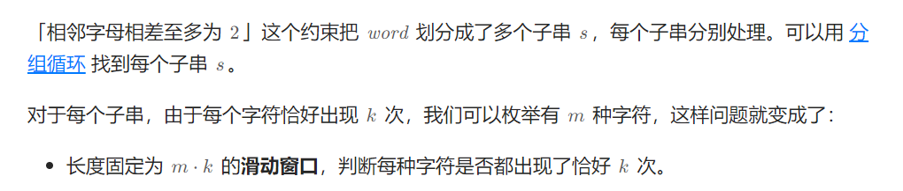

2555\. 两个线段获得的最多奖品(2081)
------------------

在 **X轴** 上有一些奖品。给你一个整数数组 `prizePositions` ，它按照 **非递减** 顺序排列，其中 `prizePositions[i]` 是第 `i` 件奖品的位置。数轴上一个位置可能会有多件奖品。再给你一个整数 `k` 。

你可以同时选择两个端点为整数的线段。每个线段的长度都必须是 `k` 。你可以获得位置在任一线段上的所有奖品（包括线段的两个端点）。注意，两个线段可能会有相交。

*   比方说 `k = 2` ，你可以选择线段 `[1, 3]` 和 `[2, 4]` ，你可以获得满足 `1 <= prizePositions[i] <= 3` 或者 `2 <= prizePositions[i] <= 4` 的所有奖品 i 。

请你返回在选择两个最优线段的前提下，可以获得的 **最多** 奖品数目。

**示例 1：**

**输入：**prizePositions = \[1,1,2,2,3,3,5\], k = 2
**输出：**7
**解释：**这个例子中，你可以选择线段 \[1, 3\] 和 \[3, 5\] ，获得 7 个奖品。

**示例 2：**

**输入：**prizePositions = \[1,2,3,4\], k = 0
**输出：**2
**解释：**这个例子中，一个选择是选择线段 `[3, 3]` 和 `[4, 4]` ，获得 2 个奖品。

**提示：**

*   `1 <= prizePositions.length <= 105`
*   `1 <= prizePositions[i] <= 109`
*   `0 <= k <= 109`
*   `prizePositions` 有序非递减。

[https://leetcode.cn/problems/maximize-win-from-two-segments/description/?envType=daily-question&envId=2024-09-11](https://leetcode.cn/problems/maximize-win-from-two-segments/description/?envType=daily-question&envId=2024-09-11)

```java
class Solution {
    public int maximizeWin(int[] nums, int k) {
        int n = nums.length;
        int[] mx = new int[n + 1];
        int ans = 0, left = 0;
        for (int right = 0; right < n; right++) {
            while (nums[right] - nums[left] > k) {
                left++;
            }
            ans = Math.max(ans, mx[left] + right - left + 1);
            mx[right + 1] = Math.max(mx[right], right - left + 1);
        }
        return ans;
    }
}
```


2831\. 找出最长等值子数组
----------------

给你一个下标从 **0** 开始的整数数组 `nums` 和一个整数 `k` 。

如果子数组中所有元素都相等，则认为子数组是一个 **等值子数组** 。注意，空数组是 **等值子数组** 。

从 `nums` 中删除最多 `k` 个元素后，返回可能的最长等值子数组的长度。

**子数组** 是数组中一个连续且可能为空的元素序列。

**示例 1：**

**输入：**nums = \[1,3,2,3,1,3\], k = 3
**输出：**3
**解释：**最优的方案是删除下标 2 和下标 4 的元素。
删除后，nums 等于 \[1, 3, 3, 3\] 。
最长等值子数组从 i = 1 开始到 j = 3 结束，长度等于 3 。
可以证明无法创建更长的等值子数组。

**示例 2：**

**输入：**nums = \[1,1,2,2,1,1\], k = 2
**输出：**4
**解释：**最优的方案是删除下标 2 和下标 3 的元素。 
删除后，nums 等于 \[1, 1, 1, 1\] 。 
数组自身就是等值子数组，长度等于 4 。 
可以证明无法创建更长的等值子数组。

**提示：**

*   `1 <= nums.length <= 105`
*   `1 <= nums[i] <= nums.length`
*   `0 <= k <= nums.length`

[https://leetcode.cn/problems/find-the-longest-equal-subarray/submissions/534143279/?envType=daily-question&envId=2024-05-23](https://leetcode.cn/problems/find-the-longest-equal-subarray/submissions/534143279/?envType=daily-question&envId=2024-05-23)

```java
import java.util.*;

class Solution {
    public int longestEqualSubarray(List<Integer> nums, int k) {
    	HashMap<Integer, List<Integer>> cnt = new HashMap<Integer, List<Integer>>();
    	int n = nums.size(), ans = 0;
    	for(int i = 0; i<n ; i++) {
    		cnt.computeIfAbsent(nums.get(i), e->new ArrayList<Integer>()).add(i);   		
    	}
    	for(int key:cnt.keySet()) {
    		List<Integer> list = cnt.get(key);
    		int size = list.size();
    		int left = 0, right = 0;
    		while(right<size) {
    			while(list.get(right) - list.get(left)+1> right - left+1+k) {
    				left++;
    			}
    			ans = Math.max(ans, right - left+1);
    			right++;
    		}
    	}
    	return ans;
    }
}
```

2953\. 统计完全子字符串
---------------

给你一个字符串 `word` 和一个整数 `k` 。

如果 `word` 的一个子字符串 `s` 满足以下条件，我们称它是 **完全字符串：**

*   `s` 中每个字符 **恰好** 出现 `k` 次。
*   相邻字符在字母表中的顺序 **至多** 相差 `2` 。也就是说，`s` 中两个相邻字符 `c1` 和 `c2` ，它们在字母表中的位置相差 **至多** 为 `2` 。

请你返回 `word` 中 **完全** 子字符串的数目。

**子字符串** 指的是一个字符串中一段连续 **非空** 的字符序列。

**示例 1：**

**输入：**word = "igigee", k = 2
**输出：**3
**解释：**完全子字符串需要满足每个字符恰好出现 2 次，且相邻字符相差至多为 2 ：_**igig**_ee, igig**ee**, _**igigee** 。_

**示例 2：**

**输入：**word = "aaabbbccc", k = 3
**输出：**6
**解释：**完全子字符串需要满足每个字符恰好出现 3 次，且相邻字符相差至多为 2 ：_**aaa**_bbbccc, aaa_**bbb**_ccc, aaabbb_**ccc**_, _**aaabbb**_ccc, aaa_**bbbccc**_, _**aaabbbccc**_ 。

**提示：**

*   `1 <= word.length <= 105`
*   `word` 只包含小写英文字母。
*   `1 <= k <= word.length`

[https://leetcode.cn/problems/count-complete-substrings/description/](https://leetcode.cn/problems/count-complete-substrings/description/)

```java
class Solution {
    public int countCompleteSubstrings(String word, int k) {
        int n = word.length();
        int ans = 0;
        for (int i = 0; i < n;) { // 没有i++
            int i0 = i;
            for (i++; i < n && Math.abs(word.charAt(i) - word.charAt(i - 1)) <= 2; i++);
            ans += f(word.substring(i0, i), k);
        }
        return ans;
    }

    private int f(String S, int k) {
        char[] s = S.toCharArray();
        int res = 0;
        for (int m = 1; m <= 26 && m * k <= s.length; m++) {
            int[] cnt = new int[26];
            for (int right = 0; right < s.length; right++) {
                cnt[s[right] - 'a']++;
                int left = right + 1 - k * m;
                if (left >= 0) {
                    boolean flag = true;
                    for (int i = 0; i < 26; i++) {
                        if (cnt[i] > 0 && cnt[i] != k) {
                            flag = false;
                            break;
                        }
                    }
                    if (flag) {
                        res++;
                    }
                    cnt[s[left] - 'a']--;
                }
            }
        }
        return res;
    }
}
```
## 【笔试】[美团春招笔试题](https://kamacoder.com/problemcontest.php?cid=1069&pid=3)


```java
	private static void solve() throws IOException {
        int n = sc.nextInt(), k = sc.nextInt();
        int[] nums = new int[n];
        ss = sc.nextLine().split(" ");
        int[] count2 = new int[n];
        int[] count5 = new int[n];
        int tot2 = 0, tot5 = 0;
        for (int i = 0; i < n; i++) {
            nums[i] = Integer.parseInt(ss[i]);
            int cnt2 = 0, cnt5 = 0;
            int x = nums[i];
            while (x % 2 == 0) {
                cnt2++;
                x /= 2;
            }
            while (x % 5 == 0) {
                cnt5++;
                x /= 5;
            }
            count2[i] = cnt2;
            count5[i] = cnt5;
            tot5 += cnt5;
            tot2 += cnt2;
        }
        int s2 = tot2 - k; // 表示最多可以删除s2个2
        int s5 = tot5 - k; // 表示最多可以删除s5个5
        long res = 0;
        int left = 0;
        int sum2 = 0, sum5 = 0;
        for (int right = 0; right < n; right++) {
            sum2 += count2[right];
            sum5 += count5[right];
            while (sum2 > s2 || sum5 > s5) {
                sum2 -= count2[left];
                sum5 -= count5[left];
                left++;
            }
            res += (right - left + 1);
        }
        sc.println(res);
    }
```

## [子序列构造](https://ac.nowcoder.com/acm/contest/99718/D)


```java
    private static void solve() throws IOException {
        n = sc.nextInt();
        // int k = sc.nextInt();
        long k = sc.nextLong();
        cs = sc.next().toCharArray();
        int l = 0, r = 0;
        long tot = 0L;
        int cnt0 = 0, cnt1 = 0;
//        for (int r = 0; r < n; r++) { // 错误，只能过90%
//            if (cs[r] == '0') {
//                cnt0++;
//            }else{
//                cnt1++;
//                tot += cnt0;
//            }
//            while (l < r && tot > k) {
//                if (cs[l] == '0') {
//                    tot -= cnt1;
//                    cnt0--;
//                } else {
//                    cnt1--;
//                }
//                l++;
//            }
//            if (tot == k) {
//                sc.print((l + 1) + " " + (r + 1));
//                return;
//            }
//            
//        }
        while (l < n) {
            while (r < n && tot < k) {
                if (cs[r] == 1) {
                    tot += cnt0;
                    cnt1++;
                }else{
                    cnt0++;
                }
                r++;
            }
            if (tot == k) {
                sc.print((l + 1) + " " + (r + 1));
                return;
            }
            if (cs[l] == '0') {
                tot -= cnt1;
                cnt0--;
            }else{
                cnt1--;
            }
            l++;
        }
        sc.print(-1);
    }
```

## [3413. 收集连续 K 个袋子可以获得的最多硬币数量](https://leetcode.cn/problems/maximum-coins-from-k-consecutive-bags/) 

在一条数轴上有无限多个袋子，每个坐标对应一个袋子。其中一些袋子里装有硬币。

给你一个二维数组 `coins`，其中 `coins[i] = [li, ri, ci]` 表示从坐标 `li` 到 `ri` 的每个袋子中都有 `ci` 枚硬币。

数组 `coins` 中的区间互不重叠。

另给你一个整数 `k`。

返回通过收集连续 `k` 个袋子可以获得的 **最多** 硬币数量。

```java
import java.util.Arrays;

class Solution {
    public long maximumCoins(int[][] coins, int k) {
        Arrays.sort(coins, (a, b) -> a[0] - b[0]);
        long ans1 = f(coins, k);
        // 反转数组
        for (int i = 0, j = coins.length - 1; i < j; i++, j--) {
            int[] tmp = coins[i];
            coins[i] = coins[j];
            coins[j] = tmp;
        }
        // 反转每个区间
        for (int[] t : coins) {
            int tmp = t[0];
            t[0] = -t[1];
            t[1] = -tmp;
        }
        return Math.max(ans1, f(coins, k));
    }

    private long f(int[][] coins, int k) {
        long ans = 0;
        long cover = 0;
        int l = 0, r = 0, n = coins.length;
        while (r < n) {
            cover += (long) (coins[r][1] - coins[r][0] + 1) * coins[r][2];
            int leftP = coins[r][1] - k + 1;
            while (coins[l][1] < leftP) {
                cover -= (long) (coins[l][1] - coins[l][0] + 1) * coins[l][2];
                l++;
            }
            long unCover = Math.max(0, (long) (leftP - coins[l][0]) * coins[l][2]);
            ans = Math.max(ans, cover - unCover);
            r++;
        }
        return ans;
    }
}
```

