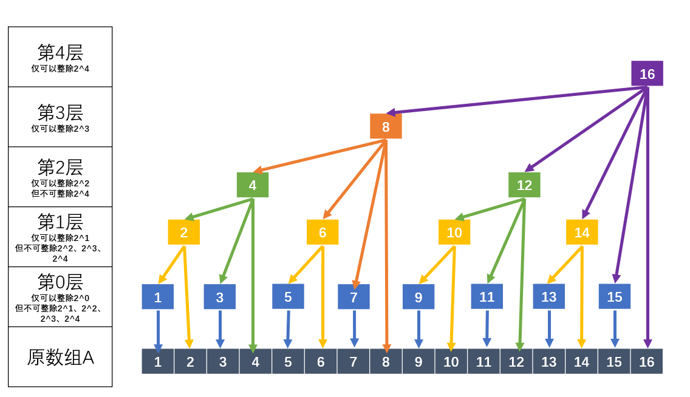
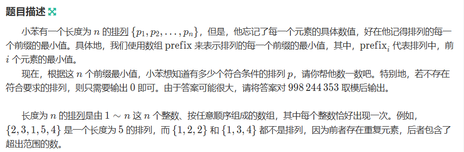

# 【模板】

## [离散化 + 树状数组 + 逆序对板子](https://www.luogu.com.cn/problem/P1908)

```java
public class Main{
    public static void main(String[] args) throws IOException {
        // int T = sc.nextInt();
        while (T-- > 0) {
            solve();
            // sc.bw.flush();
        }
        sc.bw.flush();
        sc.bw.close();
    }

    private static String[] ss;
    private static String s;
    static boolean flag = true;

    private static void solve() throws IOException {
        int n = sc.nextInt();
        ss = sc.nextLine().split(" ");
        int[] nums = new int[n];
        for (int i = 0; i < n; i++) {
            nums[i] = Integer.parseInt(ss[i]);
        }
        // 离散化
        int[] tmp = new int[n];
        System.arraycopy(nums, 0, tmp, 0, n);
        Arrays.sort(tmp);
        for (int i = 0; i < n; i++) {
            nums[i] = Arrays.binarySearch(tmp, nums[i]) + 1;
        }
        long ans = 0;
        BIT bit = new BIT(n);
        for (int i = n - 1; i >= 0; i--) {
            ans += bit.query(nums[i] - 1);
            bit.update(nums[i]);
        }
        sc.println(ans);
    }

    static class BIT{
        private int maxN;
        private int[] treeArray;

        public BIT(int maxN) {
            this.maxN = maxN;
            treeArray = new int[maxN + 1];
        }

        public int lowBit(int x) {
            return x & (-x);
        }

        public void update(int x) {
            while (x <= maxN) {
                treeArray[x]++;
                x += lowBit(x);
            }
        }

        public int query(int x) {
            int res = 0;
            while (x >= 1) {
                res += treeArray[x];
                x -= lowBit(x);
            }
            return res;
        }
    }
}
```

## [去重离散化 + 树状数组 + 前后缀最值](https://www.luogu.com.cn/problem/P1637)

```java
public class Main {
    static Read sc = new Read();
    private static final int Mod = (int) 1e9 + 7;
    private static int T = 1;

    public static void main(String[] args) throws IOException {
        // int T = sc.nextInt();
        while (T-- > 0) {
            solve();
            // sc.bw.flush();
        }
        sc.bw.flush();
        sc.bw.close();
    }

    private static String[] ss;
    private static String s;

    private static void solve() throws IOException {
        int n = sc.nextInt();
        ss = sc.nextLine().split(" ");
        int[] nums = new int[n]; // nums中有相同元素，如何离散化？
        for (int i = 0; i < n; i++) {
            nums[i] = Integer.parseInt(ss[i]);
        }
        // 离散化
        int[] tmp = new int[n];
        System.arraycopy(nums, 0, tmp, 0, n);
        int k = 0;
        Arrays.sort(tmp);
        for (int i = 1; i < n; i++) { // 去重
            if (tmp[i] == tmp[i - 1]) {
                k++;
            }
            tmp[i - k] = tmp[i];
        }
        for (int i = 0; i < n; i++) {
            nums[i] = Arrays.binarySearch(tmp, nums[i]) + 1;
        }
        BIT bit1 = new BIT(n);
        BIT bit2 = new BIT(n);
        int[] suffix = new int[n];
        for (int i = n - 1; i >= 0; i--) {
            suffix[i] = n - 1 - i - bit2.query(nums[i]); // 妙
            bit2.update(nums[i]);
        }
        long ans = 0;
        for (int i = 0; i < n; i++) {
            int c = bit1.query(nums[i] - 1);
            bit1.update(nums[i]);
            ans += (long) suffix[i] * c;
        }
        sc.println(ans);
    }

    static class BIT{
        private int maxN;
        private int[] treeArray;

        public BIT(int maxN) {
            this.maxN = maxN;
            treeArray = new int[maxN + 1];
        }

        public int lowBit(int x) {
            return x & (-x);
        }

        public void update(int x) {
            while (x <= maxN) {
                treeArray[x]++;
                x += lowBit(x);
            }
        }

        public int query(int x) {
            int res = 0;
            while (x >= 1) {
                res += treeArray[x];
                x -= lowBit(x);
            }
            return res;
        }
    }
}
```


# 【问题】

## 307\. 区域和检索 - 数组可修改

给你一个数组 `nums` ，请你完成两类查询。

1. 其中一类查询要求 **更新** 数组 `nums` 下标对应的值
2. 另一类查询要求返回数组 `nums` 中索引 `left` 和索引 `right` 之间（ **包含** ）的nums元素的 **和** ，其中 `left <= right`

实现 `NumArray` 类：

- `NumArray(int[] nums)` 用整数数组 `nums` 初始化对象
- `void update(int index, int val)` 将 `nums[index]` 的值 **更新** 为 `val`
- `int sumRange(int left, int right)` 返回数组 `nums` 中索引 `left` 和索引 `right` 之间（ **包含** ）的nums元素的 **和** （即，`nums[left] + nums[left + 1], ..., nums[right]`）

**示例 1：**

**输入**：
\["NumArray", "sumRange", "update", "sumRange"\]
\[\[\[1, 3, 5\]\], \[0, 2\], \[1, 2\], \[0, 2\]\]
**输出**：
\[null, 9, null, 8\]

**解释**：
NumArray numArray = new NumArray(\[1, 3, 5\]);
numArray.sumRange(0, 2); // 返回 1 + 3 + 5 = 9
numArray.update(1, 2);   // nums = \[1,2,5\]
numArray.sumRange(0, 2); // 返回 1 + 2 + 5 = 8

**提示：**

- `1 <= nums.length <= 3 * 104`
- `-100 <= nums[i] <= 100`
- `0 <= index < nums.length`
- `-100 <= val <= 100`
- `0 <= left <= right < nums.length`
- 调用 `update` 和 `sumRange` 方法次数不大于 `3 * 104` 

[https://leetcode.cn/problems/range-sum-query-mutable/description/](https://leetcode.cn/problems/range-sum-query-mutable/description/)

```java
import java.util.Arrays;

class NumArray {
    int[] nums;
    int[] tree;
    public NumArray(int[] nums) {
        int n = nums.length;
        this.nums = new int[n];
        tree = new int[n + 1];
        for (int i = 0; i < n; i++) {
            update(i, nums[i]);
        }
        System.out.println(Arrays.toString(tree));
    }

    public void update(int index, int val) {
        int delta = val - nums[index];
        nums[index] = val;
        int i = index + 1;
        while (i < tree.length) {
            tree[i] += delta;
            i += lowBit(i);
        }
    }

    public int sumRange(int left, int right) {
        return query(right + 1) - query(left);
    }

    private int query(int i) {
        int ans = 0;
        while (i > 0) {
            ans += tree[i];
            i -= lowBit(i);
        }
        return ans;
    }

    private int lowBit(int i) {
        return i & -i;
    }
}

/**
 * Your NumArray object will be instantiated and called as such:
 * NumArray obj = new NumArray(nums);
 * obj.update(index,val);
 * int param_2 = obj.sumRange(left,right);
 */
```

1505\. 最多 K 次交换相邻数位后得到的最小整数
---------------------------

给你一个字符串 `num` 和一个整数 `k` 。其中，`num` 表示一个很大的整数，字符串中的每个字符依次对应整数上的各个 **数位** 。

你可以交换这个整数相邻数位的数字 **最多** `k` 次。

请你返回你能得到的最小整数，并以字符串形式返回。

**示例 1：**


**输入：**num = "4321", k = 4
**输出：**"1342"
**解释：**4321 通过 4 次交换相邻数位得到最小整数的步骤如上图所示。

**示例 2：**

**输入：**num = "100", k = 1
**输出：**"010"
**解释：**输出可以包含前导 0 ，但输入保证不会有前导 0 。

**示例 3：**

**输入：**num = "36789", k = 1000
**输出：**"36789"
**解释：**不需要做任何交换。

**示例 4：**

**输入：**num = "22", k = 22
**输出：**"22"

**示例 5：**

**输入：**num = "9438957234785635408", k = 23
**输出：**"0345989723478563548"

**提示：**

*   `1 <= num.length <= 30000`
*   `num` 只包含 **数字** 且不含有 **前导 0** 。
*   `1 <= k <= 10^9`

[https://leetcode.cn/problems/minimum-possible-integer-after-at-most-k-adjacent-swaps-on-digits/description/](https://leetcode.cn/problems/minimum-possible-integer-after-at-most-k-adjacent-swaps-on-digits/description/)

```java
import java.util.Arrays;
import java.util.Deque;
import java.util.LinkedList;

class Solution {
    public String minInteger(String num, int k) {
        int n = num.length();
        Deque<Integer>[] position = new Deque[10];
        Arrays.setAll(position, e -> new LinkedList<Integer>());
        for (int i = 0; i < n; i++) {
            position[num.charAt(i) - '0'].offer(i + 1);
        }
        StringBuilder ans = new StringBuilder();
        BitTree bitTree = new BitTree(n);
        for (int i = 1; i <= n; i++) {
            for (int j = 0; j < 10; j++) {
                if (!position[j].isEmpty()) {
                    int step = position[j].peek() - i + bitTree.query(n) - bitTree.query(position[j].peek());
                    if (step <= k) {
                        k -= step;
                        ans.append(j);
                        bitTree.update(position[j].poll(), 1);
                        // bitTree.update(position[j].poll(), -1);
                        break;
                    }
                }
            }
        }
        return ans.toString();
    }


    class BitTree{
        int[] tree;

        public BitTree(int n) {
            tree = new int[n + 1];
        }

        private int lowBit(int i) {
            return i & -i;
        }
        public void update(int i, int val) {
            while (i < tree.length) {
                tree[i] += val;
                i += lowBit(i);
            }
        }

        public int query(int i) {
            int ans = 0;
            while (i > 0) {
                ans += tree[i];
                i -= lowBit(i);
            }
            return ans;
        }
    }
}
```

LCR 170. 交易逆序对的总数
-----------------

在股票交易中，如果前一天的股价高于后一天的股价，则可以认为存在一个「交易逆序对」。请设计一个程序，输入一段时间内的股票交易记录 `record`，返回其中存在的「交易逆序对」总数。

**示例 1:**

**输入：**record = \[9, 7, 5, 4, 6\]
**输出：**8
**解释：**交易中的逆序对为 (9, 7), (9, 5), (9, 4), (9, 6), (7, 5), (7, 4), (7, 6), (5, 4)。

**限制：**

`0 <= record.length <= 50000`

[https://leetcode.cn/problems/shu-zu-zhong-de-ni-xu-dui-lcof/description/](https://leetcode.cn/problems/shu-zu-zhong-de-ni-xu-dui-lcof/description/)

```java
import java.util.Arrays;

class Solution {
    public int reversePairs(int[] record) {
        int n = record.length;
        int[] temp = new int[n];
        System.arraycopy(record, 0, temp, 0, n);
        // 离散化
        Arrays.sort(temp);
        for (int i = 0; i < n; i++) {
            // 在一个已排序的数组（tmp）中查找特定元素（record[i]），并返回该元素在数组中的索引位置（从1开始计数）。如果元素不存在于数组中，返回的值将是一个负数，表示元素可插入的位置的负数形式（按照插入后数组仍然有序的方式计算）。
            record[i] = Arrays.binarySearch(temp, record[i]) + 1;
        }
        // 树状数组统计逆序对
        int ans = 0;
        BitTree bit = new BitTree(n);
        for (int i = n - 1; i >= 0; i--) {
            ans += bit.query(record[i] - 1); // bit.query(record[i] - 1); record[i] 是小于等于record[i]的前缀和，这里减一，就是小于record[i]的前缀和
            bit.update(record[i]);
        }

        return ans;
    }

    // 树状数组模板
    class BitTree {
        // 最大数组长度
        private int maxN;
        // 树状数组存储结构
        private int[] treeArray;

        // 构造函数，初始化树状数组
        public BitTree(int maxN) {
            this.maxN = maxN;
            treeArray = new int[maxN + 1];
        }

        // 获取x的二进制表示中最低位的1所对应的值
        public int lowBit(int x) {
            return x & (-x);
        }

        // 更新操作，将数组中位置x的元素加1
        public void update(int x) {
            while (x <= maxN) {
                treeArray[x]++;
                x += lowBit(x);
            }
        }

        // 查询操作，获取数组前缀和，即位置1到位置x的所有元素的和
        public int query(int x) {
            int res = 0;
            while (x >= 1) {
                res += treeArray[x];
                x -= lowBit(x);
            }
            return res;
        }
    }
}
```

315\. 计算右侧小于当前元素的个数
-------------------

给你一个整数数组 `nums` ，按要求返回一个新数组 `counts` 。数组 `counts` 有该性质： `counts[i]` 的值是  `nums[i]` 右侧小于 `nums[i]` 的元素的数量。

**示例 1：**

**输入：**nums = \[5,2,6,1\]
**输出：**`[2,1,1,0]  **解释：**`
5 的右侧有 **2** 个更小的元素 (2 和 1)
2 的右侧仅有 **1** 个更小的元素 (1)
6 的右侧有 **1** 个更小的元素 (1)
1 的右侧有 **0** 个更小的元素

**示例 2：**

**输入：**nums = \[-1\]
**输出：**\[0\]

**示例 3：**

**输入：**nums = \[-1,-1\]
**输出：**\[0,0\]

**提示：**

*   `1 <= nums.length <= 105`
*   `-104 <= nums[i] <= 104`

[https://leetcode.cn/problems/count-of-smaller-numbers-after-self/description/](https://leetcode.cn/problems/count-of-smaller-numbers-after-self/description/)

```java
import java.util.ArrayList;
import java.util.Arrays;
import java.util.Collections;
import java.util.List;

class Solution {
    public List<Integer> countSmaller(int[] nums) {
        int n = nums.length;
        int[] temp = new int[n];
        // 离散化
        System.arraycopy(nums, 0, temp, 0, n);
        Arrays.sort(temp);
        for (int i = 0; i < n; i++) {
            nums[i] = Arrays.binarySearch(temp, nums[i]) + 1;
        }
        ArrayList<Integer> ans = new ArrayList<>();
        BitTree tree = new BitTree(n);
        for (int i = n - 1; i >= 0; i--) {
            int t = tree.query(nums[i] - 1);
            tree.update(nums[i]);
            ans.add(t);
        }
        Collections.reverse(ans);
        return ans;
    }
    // 树状数组模板
    class BitTree {
        // 最大数组长度
        private int maxN;
        // 树状数组存储结构
        private int[] treeArray;

        // 构造函数，初始化树状数组
        public BitTree(int maxN) {
            this.maxN = maxN;
            treeArray = new int[maxN + 1];
        }

        // 获取x的二进制表示中最低位的1所对应的值
        public int lowBit(int x) {
            return x & (-x);
        }

        // 更新操作，将数组中位置x的元素加1
        public void update(int x) {
            while (x <= maxN) {
                treeArray[x]++;
                x += lowBit(x);
            }
        }

        // 查询操作，获取数组前缀和，即位置1到位置x的所有元素的和
        public int query(int x) {
            int res = 0;
            while (x >= 1) {
                res += treeArray[x];
                x -= lowBit(x);
            }
            return res;
        }
    }
}
```

1626\. 无矛盾的最佳球队
---------------

假设你是球队的经理。对于即将到来的锦标赛，你想组合一支总体得分最高的球队。球队的得分是球队中所有球员的分数 **总和** 。

然而，球队中的矛盾会限制球员的发挥，所以必须选出一支 **没有矛盾** 的球队。如果一名年龄较小球员的分数 **严格大于** 一名年龄较大的球员，则存在矛盾。同龄球员之间不会发生矛盾。

给你两个列表 `scores` 和 `ages`，其中每组 `scores[i]` 和 `ages[i]` 表示第 `i` 名球员的分数和年龄。请你返回 **所有可能的无矛盾球队中得分最高那支的分数** 。

**示例 1：**

**输入：**scores = \[1,3,5,10,15\], ages = \[1,2,3,4,5\]
**输出：**34
**解释：**你可以选中所有球员。

**示例 2：**

**输入：**scores = \[4,5,6,5\], ages = \[2,1,2,1\]
**输出：**16
**解释：**最佳的选择是后 3 名球员。注意，你可以选中多个同龄球员。

**示例 3：**

**输入：**scores = \[1,2,3,5\], ages = \[8,9,10,1\]
**输出：**6
**解释：**最佳的选择是前 3 名球员。

**提示：**

*   `1 <= scores.length, ages.length <= 1000`
*   `scores.length == ages.length`
*   `1 <= scores[i] <= 106`
*   `1 <= ages[i] <= 1000`

[https://leetcode.cn/problems/best-team-with-no-conflicts/description/](https://leetcode.cn/problems/best-team-with-no-conflicts/description/)

```java
import java.util.Arrays;

class Solution {
    /*  1626. 无矛盾的最佳球队
        假设你是球队的经理。对于即将到来的锦标赛，你想组合一支总体得分最高的球队。球队的得分是球队中所有球员的分数 总和 。
        然而，球队中的矛盾会限制球员的发挥，所以必须选出一支 没有矛盾 的球队。如果一名年龄较小球员的分数 严格大于 一名年龄较大的球员，则存在矛盾。同龄球员之间不会发生矛盾。
        给你两个列表 scores 和 ages，其中每组 scores[i] 和 ages[i] 表示第 i 名球员的分数和年龄。请你返回 所有可能的无矛盾球队中得分最高那支的分数 。*/
    public int bestTeamScore(int[] scores, int[] ages) {
        int n = scores.length;
        Integer[] ids = new Integer[n];
        for (int i = 0; i < n; i++) {
            ids[i] = i;
        }
        Arrays.sort(ids, (i, j) -> scores[i] != scores[j] ? scores[i] - scores[j] : ages[i] - ages[j]); // 按分数排序,如果分数相同，我们就按照年龄从小到大排序，按来年龄排序也行，不过需要对分数做离散化处理。
        int len = 1000; // 年龄最大为1000,如果再大就离散化
        BIT bit = new BIT(len); // 树状数组存储满足条件的最大分数前缀和 （区间查询，单点更新）
        for (int id : ids) {
            bit.update(ages[id], bit.query(ages[id]) + scores[id]);
        }
        return bit.query(len);
    }
    class BIT{
        int n;
        int[] treeArr;
        public BIT(int n){
            this.n = n;
            treeArr = new int[n + 1];
        }

        private int lowBit(int x) {
            return x & -x;
        }

        private int query(int x) {
            int res = 0;
            while (x > 0) {
                res = Math.max(res, treeArr[x]);
                x -= lowBit(x);
            }
            return res;
        }

        private void update(int x, int score) {
            while (x <= n) {
                treeArr[x] = Math.max(score, treeArr[x]); // 满足年龄要求的区间加分数
                x += lowBit(x);
            }
        }

    }
}
```

1409\. 查询带键的排列
--------------

给定一个正整数数组 `queries` ，其取值范围在 `1` 到 `m` 之间。 请你根据以下规则按顺序处理所有 `queries[i]`（从 `i=0` 到 `i=queries.length-1`）：

*   首先，你有一个排列 `P=[1,2,3,...,m]`。
*   对于当前的 `i` ，找到 `queries[i]` 在排列 `P` 中的位置（**从 0 开始索引**），然后将它移到排列 `P` 的开头（即下标为 0 处）。注意， `queries[i]` 的查询结果是 `queries[i]` 在 `P` 中移动前的位置。

返回一个数组，包含从给定  `queries` 中查询到的结果。

**示例 1：**

**输入：**queries = \[3,1,2,1\], m = 5
**输出：**\[2,1,2,1\] 
**解释：处理** queries 的过程如下：
对于 i=0: queries\[i\]=3, P=\[1,2,3,4,5\], 3 在 P 中的位置是 **2**，然后我们把 3 移动到 P 的开头，得到 P=\[3,1,2,4,5\] 。
对于 i=1: queries\[i\]=1, P=\[3,1,2,4,5\], 1 在 P 中的位置是 **1**，然后我们把 1 移动到 P 的开头，得到 P=\[1,3,2,4,5\] 。 
对于 i=2: queries\[i\]=2, P=\[1,3,2,4,5\], 2 在 P 中的位置是 **2**，然后我们把 2 移动到 P 的开头，得到 P=\[2,1,3,4,5\] 。
对于 i=3: queries\[i\]=1, P=\[2,1,3,4,5\], 1 在 P 中的位置是 **1**，然后我们把 1 移动到 P 的开头，得到 P=\[1,2,3,4,5\] 。 
因此，包含结果的数组为 \[2,1,2,1\] 。  

**示例 2：**

**输入：**queries = \[4,1,2,2\], m = 4
**输出：**\[3,1,2,0\]

**示例 3：**

**输入：**queries = \[7,5,5,8,3\], m = 8
**输出：**\[6,5,0,7,5\]

**提示：**

*   `1 <= m <= 10^3`
*   `1 <= queries.length <= m`
*   `1 <= queries[i] <= m`

[https://leetcode.cn/problems/queries-on-a-permutation-with-key/description/](https://leetcode.cn/problems/queries-on-a-permutation-with-key/description/)

```java
class Solution {
    public int[] processQueries(int[] queries, int m) {
        int n = queries.length;
        BIT bit = new BIT(m + n);
        int[] pos = new int[m + 1];
        for (int i = 1; i <= m; i++) {
            pos[i] = n + i;
            bit.update(n + i, 1);
        }

        int[] ans = new int[n];
        for (int i = 0; i < n; i++) {
            int cur = pos[queries[i]];
            bit.update(cur, -1);
            ans[i] = bit.query(cur);
            cur = n - i;
            pos[queries[i]] = cur;
            bit.update(cur, 1);
        }
        return ans;
    }
    class BIT {
        // 最大数组长度
        private int maxN;
        // 树状数组存储结构
        private int[] treeArray;

        // 构造函数，初始化树状数组
        public BIT(int maxN) {
            this.maxN = maxN;
            treeArray = new int[maxN + 1];
        }

        // 获取x的二进制表示中最低位的1所对应的值
        public int lowBit(int x) {
            return x & (-x);
        }

        // 更新操作，将数组中位置x的元素加1
        public void update(int x,int dt) {
            while (x <= maxN) {
                treeArray[x]+=dt;
                x += lowBit(x);
            }
        }

        // 查询操作，获取数组前缀和，即位置1到位置x的所有元素的和
        public int query(int x) {
            int res = 0;
            while (x >= 1) {
                res += treeArray[x];
                x -= lowBit(x);
            }
            return res;
        }
    }
}
```

2552\. 统计上升四元组
--------------

给你一个长度为 `n` 下标从 **0** 开始的整数数组 `nums` ，它包含 `1` 到 `n` 的所有数字，请你返回上升四元组的数目。

如果一个四元组 `(i, j, k, l)` 满足以下条件，我们称它是上升的：

*   `0 <= i < j < k < l < n` 且
*   `nums[i] < nums[k] < nums[j] < nums[l]` 。

**示例 1：**

**输入：**nums = \[1,3,2,4,5\]
**输出：**2
**解释：**
- 当 i = 0 ，j = 1 ，k = 2 且 l = 3 时，有 nums\[i\] < nums\[k\] < nums\[j\] < nums\[l\] 。
- 当 i = 0 ，j = 1 ，k = 2 且 l = 4 时，有 nums\[i\] < nums\[k\] < nums\[j\] < nums\[l\] 。
  没有其他的四元组，所以我们返回 2 。

**示例 2：**

**输入：**nums = \[1,2,3,4\]
**输出：**0
**解释：**只存在一个四元组 i = 0 ，j = 1 ，k = 2 ，l = 3 ，但是 nums\[j\] < nums\[k\] ，所以我们返回 0 。

**提示：**

*   `4 <= nums.length <= 4000`
*   `1 <= nums[i] <= nums.length`
*   `nums` 中所有数字 **互不相同** ，`nums` 是一个排列。

[https://leetcode.cn/problems/count-increasing-quadruplets/description/?envType=daily-question&envId=2024-09-10](https://leetcode.cn/problems/count-increasing-quadruplets/description/?envType=daily-question&envId=2024-09-10)

```java
import java.util.Arrays;

class Solution {
    int[] treeleft, treeright;
    int n;
    public long countQuadruplets(int[] nums) {
        this.n = nums.length;
        this.treeleft = new int[n + 1];// 统计比nums[k]小的个数tree
        this.treeright = new int[n + 1]; // 统计比nums[j]大的个数tree
        long ans = 0;
        for (int i = 0; i < n; i++) {
            Arrays.fill(treeright, 0); // 每次更新nums[j]，需要初始化
            for (int j = n - 1; j > i; j--) {
                if (nums[i] > nums[j]) {
                    ans += (long) query(treeleft, nums[j]) * (n - j - 1 - query(treeright, nums[i]));
                }
                add(treeright, nums[j]);
            }
            add(treeleft, nums[i]);
        }
        return ans;
    }

    public void add(int[] tree, int x) {
        while (x < n + 1) {
            tree[x]++;
            x += lowbit(x);
        }
    }

    public int query(int[] tree, int x) {
        int sum = 0;
        while (x > 0) {
            sum += tree[x];
            x -= lowbit(x);
        }
        return sum;
    }

    public int lowbit(int x) {
        return x & (-x);
    }
}
```

## [【排列计数】](https://ac.nowcoder.com/acm/contest/102303/D)



```java

```

 

