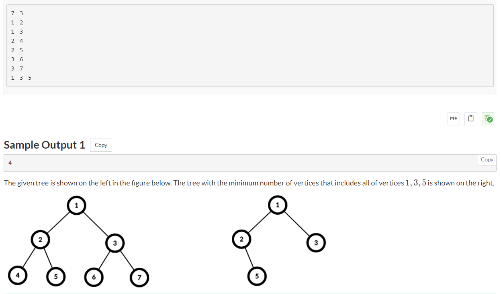
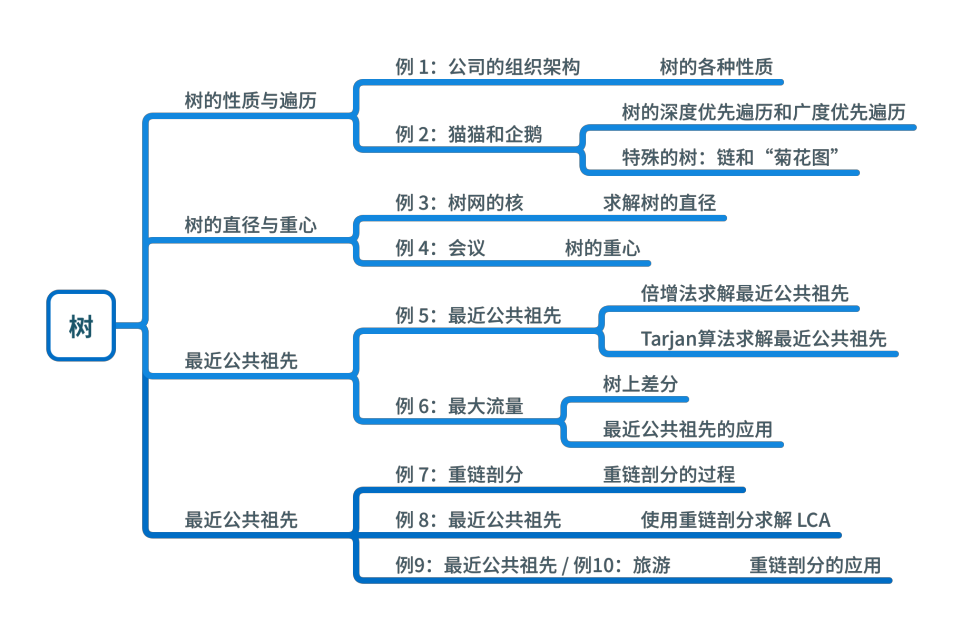

## [【模板】树上删边（使每个连通块大小为偶数）](https://ac.nowcoder.com/acm/contest/80743/D)


> 技巧：建树使用无向图，然后建邻接表。
>
> ​	由于树的连通分量为1，并且没有回路，所以不需要visited数组

```java
import java.io.BufferedReader;
import java.io.InputStreamReader;
import java.util.ArrayList;
import java.util.Arrays;
import java.util.List;
import java.util.Scanner;

public class Main {
    private static Scanner sc = new Scanner(new BufferedReader(new InputStreamReader(System.in)));
    static int n;
    static List<Integer>[] g;
    static int[] size;
    static long ans = 0;

    public static void main(String[] args) {
        n = sc.nextInt();
        size = new int[n + 1];
        g = new ArrayList[n + 1];
        Arrays.setAll(g, e -> new ArrayList<>());
        while (sc.hasNext()) {
            int x = sc.nextInt(), y = sc.nextInt();
            g[x].add(y);
            g[y].add(x);
        }
        if ((n & 1) == 1) {
            System.out.println(-1);
        }else{
            dfs(1, 0);
            for (int i = 1; i <= n; i++) {
                if (size[i] == 0) {
                    continue;
                }
                if ((size[i] & 1) == 0) {
                    ans++;
                }
            }
            System.out.println(ans - 1);
        }
        sc.close();
    }

    private static void dfs(int x, int fa) {
        size[x] = 1;
        for (int y : g[x]) {
            if (y != fa) {
                dfs(y, x);
                size[x] += size[y];
            }
        }
    }
}
```
## 【模板】树上倍增和LCA(树上祖先)

> LCA问题
>
> 给定树上的任意两点a和b，如何快速查询出a和b的最低公共祖先，常见的有三个方法
>
> 1）树上倍增
>
> 2）tarjan算法+并查集
>
> 3）树链剖分

**1483\. 树节点的第 K 个祖先（树上倍增）（链式前向星建图模板）**

给你一棵树，树上有 `n` 个节点，按从 `0` 到 `n-1` 编号。树以父节点数组的形式给出，其中 `parent[i]` 是节点 `i` 的父节点。树的根节点是编号为 `0` 的节点。

树节点的第 _`k`_ 个祖先节点是从该节点到根节点路径上的第 `k` 个节点。

实现 `TreeAncestor` 类：

*   `TreeAncestor（int n， int[] parent）` 对树和父数组中的节点数初始化对象。
*   `getKthAncestor``(int node, int k)` 返回节点 `node` 的第 `k` 个祖先节点。如果不存在这样的祖先节点，返回 `-1` 。

**示例 1：**

****

**输入：**
\["TreeAncestor","getKthAncestor","getKthAncestor","getKthAncestor"\]
\[\[7,\[-1,0,0,1,1,2,2\]\],\[3,1\],\[5,2\],\[6,3\]\]

**输出：**
\[null,1,0,-1\]

**解释：**
TreeAncestor treeAncestor = new TreeAncestor(7, \[-1, 0, 0, 1, 1, 2, 2\]);

treeAncestor.getKthAncestor(3, 1);  // 返回 1 ，它是 3 的父节点
treeAncestor.getKthAncestor(5, 2);  // 返回 0 ，它是 5 的祖父节点
treeAncestor.getKthAncestor(6, 3);  // 返回 -1 因为不存在满足要求的祖先节点

**提示：**

*   `1 <= k <= n <= 5 * 104`
*   `parent[0] == -1` 表示编号为 `0` 的节点是根节点。
*   对于所有的 `0 < i < n` ，`0 <= parent[i] < n` 总成立
*   `0 <= node < n`
*   至多查询 `5 * 104` 次

[https://leetcode.cn/problems/kth-ancestor-of-a-tree-node/description/](https://leetcode.cn/problems/kth-ancestor-of-a-tree-node/description/)

> 链式前向星建图，方法一比较万能

```java
import java.util.Arrays;

class TreeAncestor {
    private static int MAXN = 50001;
    private static int power;
    private static int cnt;

    // 链式前向星建图
    public static int[] head = new int[MAXN]; // 头结点数组，用于存储每个顶点的第一条边的索引。 [索引，值] = [头边号，点号]

    public static int[] next = new int[MAXN]; // 邻接边表数组，用于存储每条边的下一条边的索引。 [索引，值] = [下一条边号，边号]

    public static int[] to = new int[MAXN]; // 目标节点数组，用于存储每条边的目标节点。 [索引，值] = [边号，去往的点]

    // deep[i] : 节点i在第几层
    private static int[] deep = new int[MAXN];

    // stjump[i][p] : 节点i往上跳2的p次方步，到达的节点编号
    private static int[][] stjump = new int[MAXN][32]; // 针对这个题：这里的32修改为17可以快30ms

    public TreeAncestor(int n, int[] parent) {
        power = 32 - Integer.numberOfLeadingZeros(n);
        cnt = 1; // 初始化为1
        Arrays.fill(head, 0); // 如果head[i] = 0，表示没有边与这个点相连
        for (int i = 1; i < parent.length; i++) { // 这里下标从1开始，因为parent[0] = -1, 直接跳过
            addEdge(parent[i], i);
        }
        dfs(0, 0);
    }

    private static void addEdge(int u, int v) { // u -> v
        next[cnt] = head[u]; // 类似链表的next，这是下一条边的索引
        to[cnt] = v; // 第cnt条边指向节点v
        head[u] = cnt++;// 节点u有第cnt条边
    }

    private static void dfs(int x, int fa) {
        if (x == 0) {
            deep[x] = 1;
        }else{
            deep[x] = deep[fa] + 1;
        }
        stjump[x][0] = fa;
        for (int i = 1; i <= power; i++) {
            stjump[x][i] = stjump[stjump[x][i - 1]][i - 1]; // 递推式，举例：比如i = 3我们往上走2^2 = 4步,到达节点a,a再往上走2^2 = 4步，就到b，也就是第8步的位置
        }
        for (int e = head[x]; e != 0; e = next[e]) {
            dfs(to[e], x);
        }
    }

    public int getKthAncestor(int node, int k) { // 节点node的第k个祖先节点
        if (deep[node] <= k) {
            return -1;
        }
        // s是想要去往的层数
        int s = deep[node] - k;
        for (int p = 32 - Integer.numberOfLeadingZeros(k); p >= 0; p--) { // 这里使用位运算也行
            if (deep[stjump[node][p]] >= s) {
                node = stjump[node][p];
            }
        }
        return node;
    }
}

/**
 * Your TreeAncestor object will be instantiated and called as such:
 * TreeAncestor obj = new TreeAncestor(n, parent);
 * int param_1 = obj.getKthAncestor(node,k);
 */
```

## 【模板】最近公共祖先（LCA）

> ## 题目描述
>
> 如题，给定一棵有根多叉树，请求出指定两个点直接最近的公共祖先。
>
> ## 输入格式
>
> 第一行包含三个正整数 $N,M,S$，分别表示树的结点个数、询问的个数和树根结点的序号。
>
> 接下来 $N-1$ 行每行包含两个正整数 $x, y$，表示 $x$ 结点和 $y$ 结点之间有一条直接连接的边（数据保证可以构成树）。
>
> 接下来 $M$ 行每行包含两个正整数 $a, b$，表示询问 $a$ 结点和 $b$ 结点的最近公共祖先。
>
> ## 输出格式
>
> 输出包含 $M$ 行，每行包含一个正整数，依次为每一个询问的结果。
>
> ## 样例 #1
>
> ### 样例输入 #1
>
> ```
> 5 5 4
> 3 1
> 2 4
> 5 1
> 1 4
> 2 4
> 3 2
> 3 5
> 1 2
> 4 5
> ```
>
> ### 样例输出 #1
>
> ```
> 4
> 4
> 1
> 4
> 4
> ```
>
> ## 提示
>
> 对于 $30\%$ 的数据，$N\leq 10$，$M\leq 10$。
>
> 对于 $70\%$ 的数据，$N\leq 10000$，$M\leq 10000$。
>
> 对于 $100\%$ 的数据，$1 \leq N,M\leq 500000$，$1 \leq x, y,a ,b \leq N$，**不保证** $a \neq b$。
>
>
> 样例说明：
>
> 该树结构如下：
>
>   
>
> 第一次询问：$2, 4$ 的最近公共祖先，故为 $4$。
>
> 第二次询问：$3, 2$ 的最近公共祖先，故为 $4$。
>
> 第三次询问：$3, 5$ 的最近公共祖先，故为 $1$。
>
> 第四次询问：$1, 2$ 的最近公共祖先，故为 $4$。
>
> 第五次询问：$4, 5$ 的最近公共祖先，故为 $4$。
>
> 故输出依次为 $4, 4, 1, 4, 4$。
>
>
> 2021/10/4 数据更新 @fstqwq：应要求加了两组数据卡掉了暴力跳。

```java
import java.io.*;
import java.util.Arrays;

public class Main {
    public static int MAXN = 500001;

    public static int LIMIT = 20;

    // 根据节点个数n，计算出2的几次方就够用了
    public static int power;

    // 链式前向星建图
    public static int[] head = new int[MAXN];

    public static int[] next = new int[MAXN << 1];

    public static int[] to = new int[MAXN << 1];

    public static int cnt;

    // deep[i] : 节点i在第几层
    public static int[] deep = new int[MAXN];

    // stjump[i][p] : 节点i往上跳2的p次方步，到达的节点编号
    public static int[][] stjump = new int[MAXN][LIMIT];
    public static void build(int n) {
        power = 32 - Integer.numberOfLeadingZeros(n);
        cnt = 1;
        Arrays.fill(head, 1, n + 1, 0);
    }

    public static void addEdge(int u, int v) {
        next[cnt] = head[u];
        to[cnt] = v;
        head[u] = cnt++;
    }

    // dfs递归版
    // 一般来说都这么写，但是本题附加的测试数据很毒
    // java这么写就会因为递归太深而爆栈，c++这么写就能通过
    public static void dfs(int x, int fa) {
        deep[x] = deep[fa] + 1;
        stjump[x][0] = fa;
        for (int p = 1; p <= power; p++) {
            stjump[x][p] = stjump[stjump[x][p - 1]][p - 1];
        }
        for (int e = head[x]; e != 0; e = next[e]) {
            if (to[e] != fa) {
                dfs(to[e], x);
            }
        }
    }

    private static int lca(int a, int b) {
        if (deep[a] < deep[b]) {
            int tmp = a;
            a = b;
            b = tmp;
        }
        for (int p = power; p >= 0; p--) {
            if (deep[stjump[a][p]] >= deep[b]) {
                a = stjump[a][p];
            }
        }
        if (a == b) {
            return a;
        }
        // a和b在同一层
        for (int p = power; p >= 0; p--) {
            if (stjump[a][p] != stjump[b][p]) {
                a = stjump[a][p];
                b = stjump[b][p];
            }
        }
        return stjump[a][0];
    }
    public static void main(String[] args) throws IOException {
        BufferedReader br = new BufferedReader(new InputStreamReader(System.in));
        StreamTokenizer in = new StreamTokenizer(br);
        PrintWriter out = new PrintWriter(new OutputStreamWriter(System.out));
        in.nextToken();
        int n = (int) in.nval;
        in.nextToken();
        int m = (int) in.nval;
        in.nextToken();
        int root = (int) in.nval;
        build(n);
        for (int i = 1, u, v; i < n; i++) {
            in.nextToken();
            u = (int) in.nval;
            in.nextToken();
            v = (int) in.nval;
            addEdge(u, v);
            addEdge(v, u);
        }
        dfs(root, 0);
        for (int i = 1, a, b; i <= m; i++) {
            in.nextToken();
            a = (int) in.nval;
            in.nextToken();
            b = (int) in.nval;
            out.println(lca(a, b));
        }
        out.flush();
        out.close();
        br.close();
    }
}
```

## [【模板】求一棵树到达关键节点的最少节点数目](https://atcoder.jp/contests/abc368/tasks/abc368_d)



```java
class Main{
        private static String[] ss;
    private static String s;

    private static List<Integer>[] g;
    static int maxN = 200010;
    private static int[] vs = new int[maxN];

    // https://atcoder.jp/contests/abc368/tasks/abc368_d  树：求一棵树到达关键节点的最少节点数目
    private static void solveD() throws IOException {
        int n = sc.nextInt();
        int k = sc.nextInt(), x = 0, y = 0;
        g = new List[n];
        Arrays.setAll(g, e -> new ArrayList<>());
        for (int i = 0; i < n - 1; i++) {
            ss = sc.nextLine().split(" ");
            x = Integer.parseInt(ss[0]) - 1;
            y = Integer.parseInt(ss[1]) - 1;
            g[x].add(y);
            g[y].add(x);
        }
        ss = sc.nextLine().split(" ");
        for (int i = 0; i < k; i++) {
            x = Integer.parseInt(ss[i]) - 1;
            vs[x]++;
        }
        dfs(x, -1);
        int ans = 0;
        for (int i = 0; i <= n; i++) {
            if (vs[i] > 0) {
                ans++;
            }
        }
        sc.println(ans);
    }
    private static void dfs(int x, int fa) { // 核心
        for (int y : g[x]) {
            if (y != fa) {
                dfs(y, x);
                vs[x] += vs[y];
            }
        }
    }
}
```

# 【洛谷模板题】

 

## [【模板】树的遍历dfs + 统计到root距离为d的节点数目](https://www.luogu.com.cn/problem/P5908)

```java
public class Main {
    public static void main(String[] args) throws IOException {
        // int T = sc.nextInt();
        while (T-- > 0) {
            solve();
            // sc.bw.flush();
        }
        sc.bw.flush();
        sc.bw.close();
    }

    private static String[] ss;
    private static String s;
    private static List<Integer>[] g;

    private static void solve() throws IOException {
        int n = sc.nextInt(), d = sc.nextInt();
        g = new List[n];
        Arrays.setAll(g, e -> new ArrayList<>());
        for (int i = 0; i < n - 1; i++) {
            ss = sc.nextLine().split(" ");
            int x = Integer.parseInt(ss[0]) - 1, y = Integer.parseInt(ss[1]) - 1;
            g[x].add(y);
            g[y].add(x);
        }
        sc.println(dfs(0, -1, d) - 1); //减去初始点
    }

    private static int dfs(int x, int fa, int d) {
        if (d < 0) {
            return 0;
        }
        int res = 1;
        for (int y : g[x]) {
            if (y != fa) {
                res += dfs(y, x, d - 1);
            }
        }
        return res;
    }
}
```


