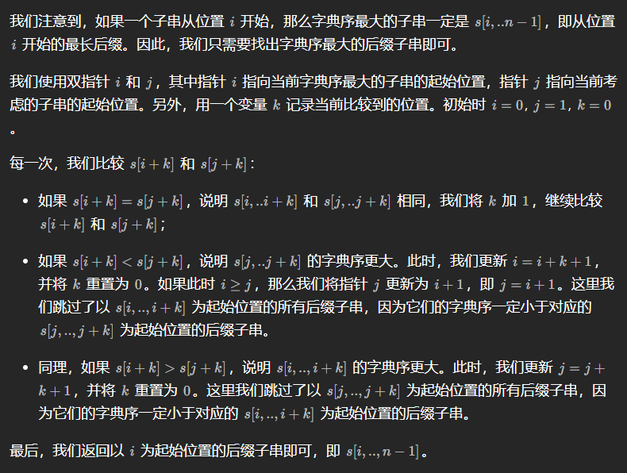

## [1163. 按字典序排在最后的子串](https://leetcode.cn/problems/last-substring-in-lexicographical-order/) 

给你一个字符串 `s` ，找出它的所有子串并按字典序排列，返回排在最后的那个子串。 

```java
class Solution {
    public String lastSubstring(String s) {
        int i = 0, j = 1, n = s.length();
        while (j < n) {
            int k = 0;
            while (j + k < n && s.charAt(i + k) == s.charAt(j + k)) {
                k++;
            }
            if (j + k < n && s.charAt(i + k) < s.charAt(j + k)) {
                int t = i;
                i = j;
                j = Math.max(j + 1, t + k + 1);
            } else {
                j = j + k + 1;
            }
        }
        return s.substring(i);
    }
}
```

https://leetcode.cn/problems/last-substring-in-lexicographical-order/solutions/2242562/python3javacgotypescript-yi-ti-yi-jie-sh-3amj/

> 
>