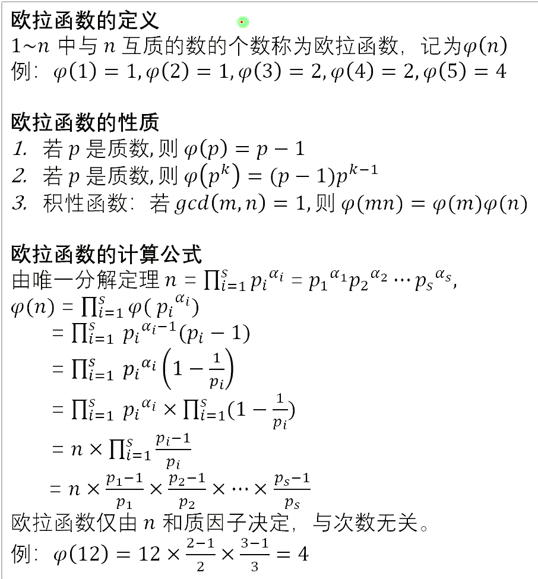
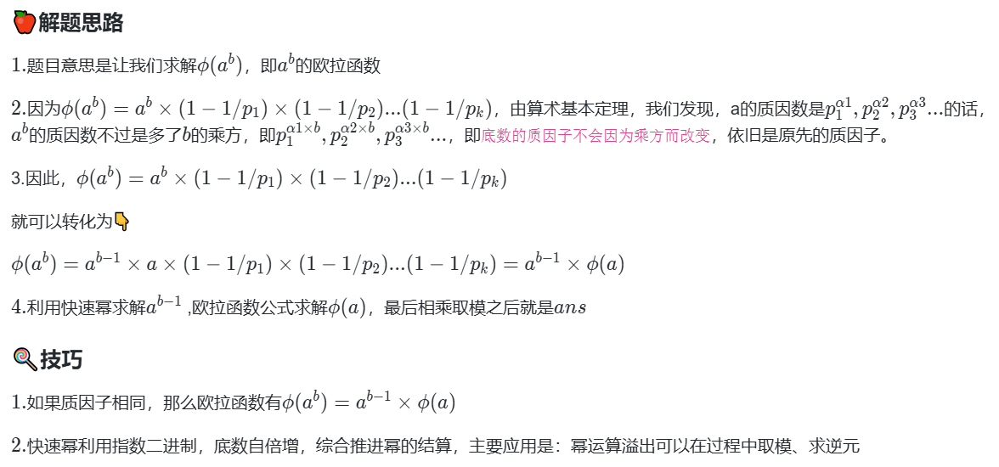

## [欧拉函数](https://www.lanqiao.cn/problems/20086/learning/?contest_id=228)

欧拉函数的性质：

1、若$p$是质数，则$\varphi(p) = p - 1$

2、若$p$是质数，则$\varphi(p^k) =  (p - 1)p^{k- 1}$

3、积性函数：若$gcd(m,n) = 1$，则$\varphi(mn) = \varphi(m)\varphi(n)$





```java
	/**
     * 求欧拉函数 (https://oi-wiki.org/math/number-theory/euler-totient/)
     * 欧拉函数：是小于等于n的正整数中与n互质的数的数目。
     * 互质：两个数的最大公约数为1。
     * 质数x的欧拉函数为x - 1。比如x = 5，有1,2,3,4。
     */
    private static long eulerPhi(long n) { //  O(√n)
        long result = n;
        for (int p = 2; (long) p * p <= n; p++) {
            if (n % p == 0) {
                while (n % p == 0) {
                    n /= p;
                }
                result -= result / p;
            }
        }
        if (n > 1) {
            result -= result / n;
        }
        return result;
    }
```

## 筛法求欧拉函数

```java
import java.util.Arrays;

public class Main {
    public static int[] eulerPhiSieve(int n) { // O(nloglogn)
        int[] phi = new int[n + 1];
        Arrays.setAll(phi, i -> i);
        for (int i = 2; i <= n; i++) {
            if (phi[i] == i) {
                for (int j = i; j <= n; j += i) {
                    phi[j] -= phi[j] / i;
                }
            }
        }
        return phi;
    }

    public static void main(String[] args) {
        int n = 10; // Example value
        int[] phi = eulerPhiSieve(n);
        for (int i = 1; i <= n; i++) {
            System.out.println("phi(" + i + ") = " + phi[i]);
        }
    }
}
```

