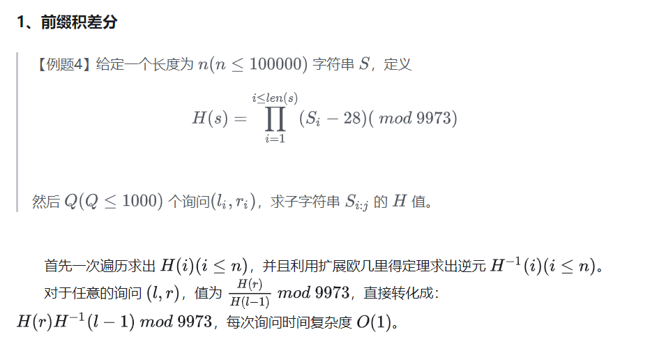
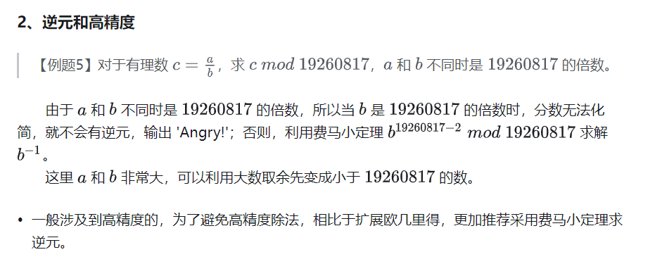
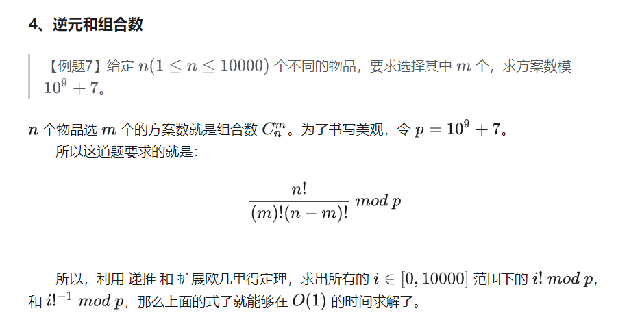

# [【模板】逆元](https://zhuanlan.zhihu.com/p/449221995)

> 【例题一】：给定正整数 a 和 b，求满足等式 ax+by=1 的 x 的最小正整数解。如果不存在返回 -1。 

## 扩展欧几里得求逆元

- 如果a与b不互质，逆元不存在，返回 -1

- 如果gcd(a, b) = 1

```java
public class ExtendedGCD {
    public static long expGcd(long a, long b, long[] xy) {
        long q, temp;
        if (b == 0) {
            q = a;
            xy[0] = 1;
            xy[1] = 0;
        } else {
            q = expGcd(b, a % b, xy);
            temp = xy[0];
            xy[0] = xy[1];
            xy[1] = temp - (a / b) * xy[1];
        }
        return q;
    }

    public static void main(String[] args) {  // 计算ax + by = 1
        long[] xy = new long[2];
        long a = 27;
        long b = 8;
        long gcd = expGcd(a, b, xy);
        System.out.println("GCD: " + gcd);
        System.out.println("x: " + xy[0]);
        System.out.println("y: " + xy[1]);
        /* 	GCD: 1
            x: 3 这里的x就是逆元
            y: -10	*/
    }
}
```

## 费马小定理

> 【例题二】给定素数 p 和 正整数 a，求满足 ax ≡ 1(mod p) 的最小正整数 x，如果不存在返回 −1。 
>
> 【例题2】和【例题1】的区别就是：模数（p）变成了素数。所以我们可以利用费马小定理来求逆元。 

```java
public class Main {
    public static long qpow(long a, long n, long mod) { // 快速幂
        long ans = 1;
        while (n != 0) {
            if ((n & 1) != 0) {
                ans = ans * a % mod;
            }
            a = a * a % mod;
            n >>= 1;
        }
        return ans;
    }

    public static long inv(long a, long p) { // 求逆元
        return qpow(a, p - 2, p);
    }
}
```

## 逆元的应用







```java
    private static final int Mod = (int) 1e9 + 7;
    private static final int MX = 41;
    private static final long[] F = new long[MX]; // f[i] = i!
    private static final long[] INV_F = new long[MX]; // inv_f = i!^-1
    static {
        F[0] = 1;
        for (int i = 1; i < MX; i++) {
            F[i] = F[i - 1] * i % Mod;
        }
        INV_F[MX - 1] = qpow(F[MX - 1], Mod - 2, Mod);
        for (int i = MX - 1; i > 0; i--) {
            INV_F[i - 1] = INV_F[i] * i % Mod;
        }
    }
```


