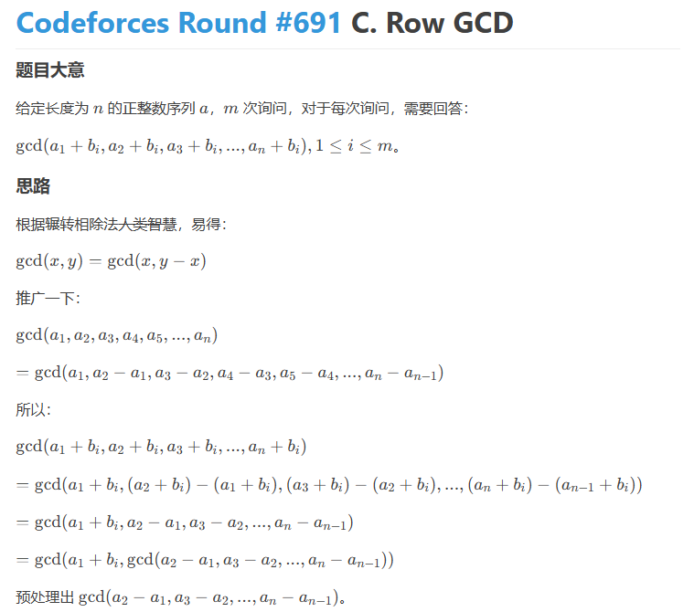
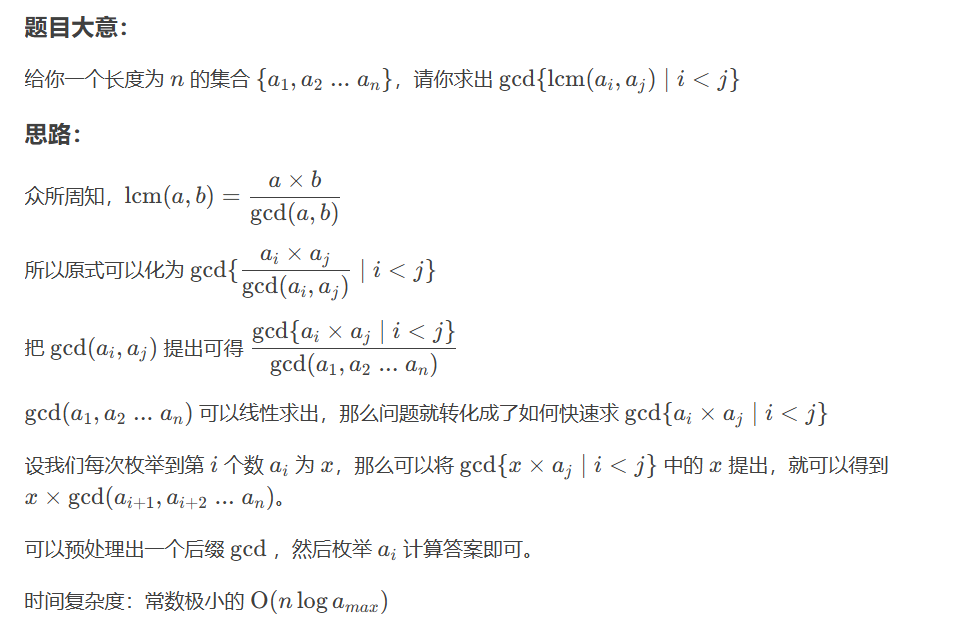

```java
    private static void solve() throws IOException {
        int n = sc.nextInt(), m = sc.nextInt();
        long[] a = new long[n];
        long[] b = new long[m];
        ss = sc.nextLine().split(" ");
        for (int i = 0; i < n; i++) {
            a[i] = Long.parseLong(ss[i]);
        }
        ss = sc.nextLine().split(" ");
        for (int i = 0; i < m; i++) {
            b[i] = Long.parseLong(ss[i]);
        }
        Arrays.sort(a);
        StringBuilder res = new StringBuilder();
        long g1 = 0;
        for (int i = 1; i < n; i++) {
            g1 = gcd(g1, a[i] - a[i - 1]);
        }
        for (int i = 0; i < m; i++) {
            long g = gcd(g1, a[0] + b[i]);
            res.append(g).append(" ");
        }
        res.deleteCharAt(res.length() - 1);
        sc.println(res.toString());
    }

    private static long gcd(long a, long b) {
        return b == 0 ? a : gcd(b, a % b);
    }
```




```java
`public static void main(String[] args) throws IOException {
        BufferedReader br = new BufferedReader(new InputStreamReader(System.in));
        int n = Integer.parseInt(br.readLine());
        for (int i = 1; i <= n; ++i) {
            a[i] = read(br);
        }
        for (int i = n; i >= 1; --i) { // gcd的后缀数组
            b[i] = gcd(b[i + 1], a[i]);
        }
        for (int i = 1; i <= n; ++i) {
            ans = gcd(ans, a[i] * b[i + 1]);
        }
        System.out.println(ans / b[1]);
    }

    private static long gcd(long a, long b) {
        return b == 0 ? a : gcd(b, a % b);
    }
```

> # CF1920C Partitioning the Array
>
> **问题的核心目标：**
>
> 对于数组 `a` 和一个 `n` 的因子 `k`：
> 1.  我们将数组 `a` 分割成 `n/k` 个长度为 `k` 的连续子数组。
>     例如，如果 `a = [a1, a2, a3, a4, a5, a6]` 且 `k=2`，子数组是 `S1=[a1,a2]`, `S2=[a3,a4]`, `S3=[a5,a6]`。
> 2.  我们要判断是否存在一个整数 `m >= 2`，使得如果我们将这些子数组中的所有元素 `x` 都替换为 `x % m`（`x` 对 `m` 取模），那么所有这些新的子数组都会变得完全相同。
>
> 如果存在这样的 `m`，那么对于这个 `k`，艾伦就得一分。我们要计算艾伦总共能得多少分。
>
> **解题原理逐步分析：**
>
> 1. **子数组在模 `m` 意义下相同的含义：**
>     如果所有 `n/k` 个子数组在模 `m` 意义下都相同，这意味着：
>     *   第一个子数组的第1个元素 % `m` == 第二个子数组的第1个元素 % `m` == ... == 最后一个子数组的第1个元素 % `m`。
>     *   第一个子数组的第2个元素 % `m` == 第二个子数组的第2个元素 % `m` == ... == 最后一个子数组的第2个元素 % `m`。
>     *   ...
>     *   第一个子数组的第 `k` 个元素 % `m` == 第二个子数组的第 `k` 个元素 % `m` == ... == 最后一个子数组的第 `k` 个元素 % `m`。
>
>     我们把子数组内元素的位置称为**相对位置** `p`（从 `0` 到 `k-1`，或者题目中的 `1` 到 `k`）。
>     那么，对于**任意一个固定的相对位置 `p`**，所有子数组在这个位置 `p` 上的原始元素（我们记为 `val_1_p, val_2_p, ..., val_{n/k}_p`）必须满足：
>     `val_1_p % m == val_2_p % m == ... == val_{n/k}_p % m`
>
> 2. **对 `m` 的约束条件（针对单个相对位置 `p`）：**
>     如果 `X % m == Y % m`，那么 `(X - Y)` 必须能被 `m` 整除（即 `(X - Y)` 是 `m` 的倍数）。
>     所以，对于固定的相对位置 `p`，`m` 必须整除以下所有差值的绝对值：
>     *   `abs(val_1_p - val_2_p)`
>     *   `abs(val_2_p - val_3_p)`
>     *   ...
>     *   `abs(val_{i}_p - val_{i+1}_p)` （对于所有相邻的子数组块 `i` 和 `i+1`）
>
>     这意味着，`m` 必须是这些差值绝对值的**公约数**。
>     为了让 `m` 尽可能大（或者说，为了找到是否存在这样的 `m`），我们考虑这些差值绝对值的**最大公约数 (GCD)**。
>     令 `G_p = GCD(abs(val_1_p - val_2_p), abs(val_2_p - val_3_p), ...)`。
>     那么，对于这个相对位置 `p`，`m` 必须整除 `G_p`。
>
> 3. **对 `m` 的约束条件（针对所有相对位置）：**
>     关键在于，题目要求的是**存在某一个 `m`**，这个 `m` 要使得所有子数组在所有相对位置上都满足模 `m` 后相同。
>     也就是说，这个**同一个 `m`** 必须：
>     *   整除 `G_0` （对应相对位置 `p=0` 的差值GCD）
>     *   整除 `G_1` （对应相对位置 `p=1` 的差值GCD）
>     *   ...
>     *   整除 `G_{k-1}` （对应相对位置 `p=k-1` 的差值GCD）
>
>     因此，`m` 必须是 `G_0, G_1, ..., G_{k-1}` 这些数的**公约数**。
>     为了找到是否存在这样的 `m`（特别是 `m >= 2`），我们考虑这些 `G_p` 值的**总的最大公约数**。
>     令 `GCD_overall_for_k = GCD(G_0, G_1, ..., G_{k-1})`。
>     那么，我们要找的 `m` 必须整除这个 `GCD_overall_for_k`。
>
> 4. **最终的判断条件 `m >= 2`：**
>     我们要找一个 `m >= 2` 并且 `m` 整除 `GCD_overall_for_k`。
>     这样的 `m` 是否存在，完全取决于 `GCD_overall_for_k` 的值：
>     *   **如果 `GCD_overall_for_k = 0`**：
>         这种情况发生当且仅当所有的 `G_p` 都为 `0`。而一个 `G_p = 0` 意味着对于相对位置 `p`，所有子数组的元素原本就是完全相同的（即 `val_1_p = val_2_p = ...`）。如果所有 `G_p` 都为 `0`，说明所有子数组在分割后就已经是完全相同的了，不需要取模。在这种情况下，我们可以选择任何 `m >= 2`（例如 `m=2`），条件自然满足。所以艾伦得分。
>     *   **如果 `GCD_overall_for_k >= 2`**：
>         我们可以直接选择 `m = GCD_overall_for_k`。这个 `m` 满足 `m >= 2`，并且它能整除它自身。所以条件满足。艾伦得分。
>     *   **如果 `GCD_overall_for_k = 1`**：
>         唯一能整除 `1` 的正整数 `m` 就是 `1`。但这不满足题目 `m >= 2` 的要求。所以这种情况下艾伦不得分。
>
>     **总结：对于一个给定的 `k`，艾伦得分当且仅当 `GCD_overall_for_k != 1`。**
>     （即 `GCD_overall_for_k` 等于 `0` 或 大于等于 `2`）。
>
> 5. **算法流程（对于每个因子 `k`）：**
>     a.  **特殊情况 `k=n`**：此时只有一个子数组（整个数组本身）。它自然与自身相同。所以 `k=n` 时总是得1分。
>     b.  **对于 `k < n`**：
>         i.  初始化一个变量 `current_total_gcd = 0`。这个变量将用来计算 `GCD_overall_for_k`。
>         ii. 对于子数组内的每一个相对位置 `p` (从 `0` 到 `k-1`)：
>             1.  计算 `G_p`：找出所有相邻子数组在位置 `p` 上的元素差的绝对值，然后计算这些差值绝对值的GCD。
>                 *   如果计算过程中，`G_p` 自身先变成了 `1`（说明对于这个位置 `p`，只有 `m=1` 才行），那么这个 `k` 就不可能得分了，可以直接跳过这个 `k`，处理下一个因子。
>             2.  将 `G_p` 融入到 `current_total_gcd` 中：
>                 *   如果 `G_p = 0`：它不提供新的约束，`current_total_gcd` 不变（除非 `current_total_gcd` 本身也是0）。
>                 *   如果 `G_p > 0`：
>                     *   如果 `current_total_gcd` 之前是 `0`（表示这是第一个遇到的非零 `G_p`），则 `current_total_gcd = G_p`。
>                     *   否则，`current_total_gcd = GCD(current_total_gcd, G_p)`。
>                 *   在更新 `current_total_gcd` 后，如果 `current_total_gcd` 变成了 `1`，那么这个 `k` 也不可能得分了，可以直接跳过这个 `k`。
>         iii. 如果顺利完成了对所有相对位置 `p` 的处理（即没有中途因为某个 `G_p=1` 或 `current_total_gcd=1` 而跳出），那么此时的 `current_total_gcd` 就是我们想要的 `GCD_overall_for_k`。
>         iv. 根据 `current_total_gcd != 1` 来判断是否为这个 `k` 加分。
>
> **举例说明：`a = [2, 6, 3, 6, 6, 6]`，`k=3`**
> 子数组: `S1 = [2, 6, 3]`, `S2 = [6, 6, 6]`
>
> *   **相对位置 `p=0`** (比较 `a[0]` 和 `a[3]`):
>     *   `val_1_0 = 2`, `val_2_0 = 6`
>     *   `abs(2-6) = 4`.
>     *   `G_0 = 4`.
> *   **相对位置 `p=1`** (比较 `a[1]` 和 `a[4]`):
>     *   `val_1_1 = 6`, `val_2_1 = 6`
>     *   `abs(6-6) = 0`.
>     *   `G_1 = 0`.
> *   **相对位置 `p=2`** (比较 `a[2]` 和 `a[5]`):
>     *   `val_1_2 = 3`, `val_2_2 = 6`
>     *   `abs(3-6) = 3`.
>     *   `G_2 = 3`.
>
> 现在计算 `GCD_overall_for_k=3 = GCD(G_0, G_1, G_2)`。
> 由于 `G_1=0` 不提供约束，我们实际计算 `GCD(G_0, G_2) = GCD(4, 3) = 1`。
> 因为 `GCD_overall_for_k=3` 是 `1`，所以对于 `k=3`，艾伦不得分。
>
> 这个原理就是通过层层计算GCD来找到那个必须满足的公共约束 `m`，并检查这个 `m` 是否能大于等于2。

```java
	public static void solve() throws IOException {
        // 定理：如果要使得x%m==y%m，那么有 Math.abs(x - y) % m = 0
		int n = sc.nextInt();
		ss = sc.nextLine().split(" ");
		int[] nums = new int[n];
		for(int i = 0;i<n;i++) {
			nums[i] = Integer.parseInt(ss[i]);
		}
		long res = 1;
		next:
		for(int len = 1;len<n;len++) {
			if(n%len==0) {
				int c = n/len; // 字串个数
				int g = 0;
				for(int i = 0;i<len;i++) {
					for(int j = 1;j<c;j++) {
						g = gcd(g, Math.abs(nums[i+j*len] - nums[i+(j - 1)*len]));
					}
					if(g==1) {
						continue next;
					}
				}
				res++;
			}
		}
		sc.print(res+"\n");
	}
	
	static int gcd(int a, int b) {
		return b==0?a:gcd(b, a%b);
	}
```

