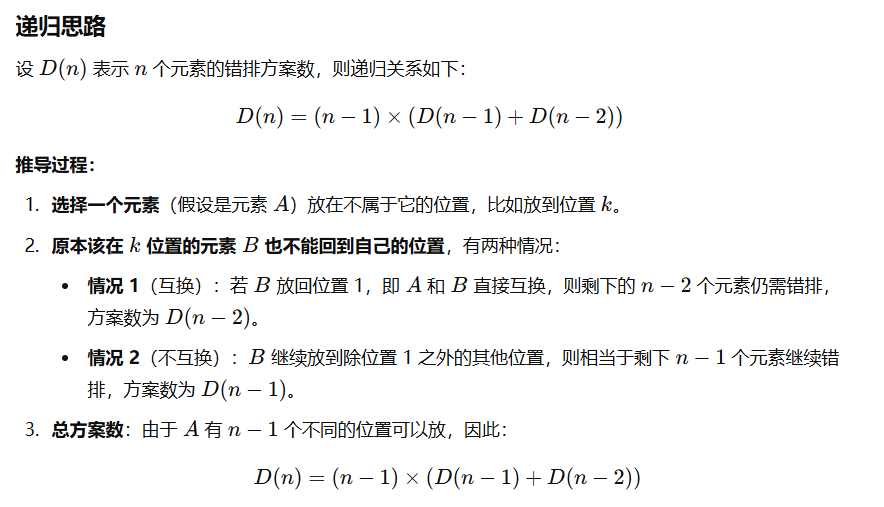

> 如果你这个都不看，就等着后悔吧！！！

题目：给出n和k计算满足至少有(n-k)个位置的值a[i]==i的1~n的全排列的个数。 

解释：就是打乱（1到k）个数的排列方案数

```java
    private static void solve() throws IOException {
        int n = sc.nextInt(), k = sc.nextInt();
        long[][] comb = new long[n + 1][n + 1]; // 这个题没让取模，所以直接用递推求组合数，如果有Mod还是要用费马小定理求逆元！！！
        for (int i = 0; i < n + 1; i++) {
            comb[i][0] = comb[i][i] = 1;
            for (int j = 1; j < i; j++) {
                comb[i][j] = comb[i - 1][j - 1] + comb[i - 1][j];
            }
        }
        long[] f = new long[n + 1]; // f[i]表示有i个元素错排的方案数；
        f[1] = 0; // 一个数不可能错排
        f[2] = 1; // 两个元素的错排方案数，交换其中两个数，一种方案
        for (int i = 3; i <= n; i++) {
            f[i] = (i - 1) * (f[i - 1] + f[i - 2]);
        }
        long ans = 1;
        for (int i = 2; i <= k; i++) {
            ans += comb[n][i] * f[i];
        }
        sc.println(ans);
    }
```

> 进阶：来上一个codeforces 2000分的题目

题意：有`tot1`个数需要错排，有`tot2`个数可以任意排

题解：定义$dp(i)$表示有$i$个位置只能放除本身以外的数字。那么$dp(0)$就是所有位置都可以随便放，有 $dp[0] = tot2!$，讨论 $dp[i]$ 就是有 $ i $ 个位置要放除自身以外的数字，

- 若第$i$个位置放的是不受限制的`tot2`中的数字，那么有$tot_2 * dp[i - 1]$
- 若第$i$个位置放的是`tot1`中的数字，那么有$(i - 1)(dp[i - 1] + dp[i - 2])$种选择

综上所述：$dp[i] = tot_2 * dp[i - 1] + (i - 1)(dp[i - 1] + dp[i - 2])$

最后答案就是 $dp[tot1]$

