# [Servlet的使用](https://blog.csdn.net/qq_52830421/article/details/143034178)

## 一.Servelt简介

1.为什么需要servlet:因为前端三件套无法操控数据库,即与用户进行交互操作
2.servlet由服务器端调用和执行的(由tomcat解析和调用的),由java语言编写,本质就是java类
3.功能强大,可以完成几乎所有的网站功能,按照Servlet规范开发

## 二.手动开发Servlet

### 1.Servlet起到的作用:tomcat无法去操控数据库,前端请求的数据给到tomcat,tomcat再给到Servlet,Servlet再去操控数据库. 

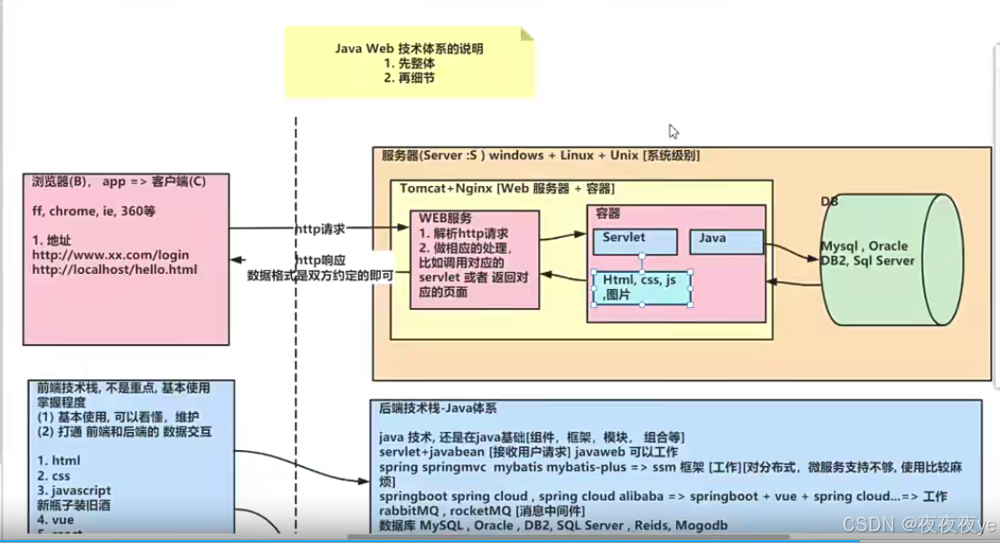

### 2.实现Servelet的接口 

```java
import javax.servlet.*;
import java.io.IOException;

//开发一个Servlet需要实现Servelet接口
public class HelloServlet implements Servlet {

/**
 * 1.初始化servlet
 *2.当创建helloServt实例时,会调用init方法
 * 3.该方法只会被调用一次
* */
    @Override
    public void init(ServletConfig servletConfig) throws ServletException {
        System.out.println("init方法被调用");
    }
/*
* 此方法返回Servlet的配置*/
    @Override
    public ServletConfig getServletConfig() {
        return null;
    }
/*
* 1.该方法处理浏览器的请求（包括get/post）
* 。当浏览器每次请求Servlet时,就会调用一次service
* 3.当tomcat调用该方法时,会把http请求的数据封装成ServletRequest接口的request对象
* 4.通过servletRequest对象,可以得到用户的数据
* 5.servletRespons对象可以用于返回数据给tomcat,tomcat再把数据封装成http响应格式再打回给浏览器
* 6.接口（Interface）在Java中是用来定义一组方法签名，而不能直接实例化对象。它们是一种抽象的概念，主要是为了提供一种规范或契约，让其他类去实现这些方法。然而，在Java中，像ServletRequest这样的接口并不是简单地定义了一个功能列表，而是由JDK提供的一个内置接口，专门用于处理HTTP Servlet请求。
当你在Servlet容器启动时，如Tomcat或Jetty，它会在后台自动创建并初始化一个实现了ServletRequest接口的对象，这个对象实际上是由底层网络协议栈创建的，然后映射到Java的应用程序层面上。当我们编写Servlet代码时，通过HttpServletRequest（ServletRequest的一个子接口）类型来引用这个对象，实际上是通过容器间接创建的。
因此，尽管我们不能直接创建一个实现了接口的对象，但在Servlet的世界里，由于框架的特殊处理，我们可以方便地使用这些接口来访问和操作请求信息。这允许我们在Servlet中对HTTP请求进行处理，就像它们是可以直接操作的对象一样。
* */

    @Override
    public void service(ServletRequest servletRequest, ServletResponse servletResponse) throws ServletException, IOException {

    }

    /*
     * 返回servlet的信息,使用较少*/
    @Override
    public String getServletInfo() {
        return null;
    }
/*该方法是在servlet销毁时被调用,只会代用一次*/
    @Override
    public void destroy() {

    }
}


```

###  3.配置xml文件,然后浏览器发起请求即可(http://locahost:8080/servlet/helloservlet) 

```xml
<?xml version="1.0" encoding="UTF-8"?>
<web-app xmlns="http://xmlns.jcp.org/xml/ns/javaee"
         xmlns:xsi="http://www.w3.org/2001/XMLSchema-instance"
         xsi:schemaLocation="http://xmlns.jcp.org/xml/ns/javaee http://xmlns.jcp.org/xml/ns/javaee/web-app_4_0.xsd"
         version="4.0">
    <!--web.xml主要用来配置该应用使用到的Servlet,在servlet中配置全类名,在servlet-mapping中配置访问路径
    1.servlet-name:给Servlet取名(程序员自己决定) 其实就是创建单例对象的对象名
    2.servlet-class:Servlet的类的全路径:tomcat在反射生成该Servlet需要使用
    3.url-pattern:这个就是该servlet访问的url的配置
    4.这时我们应该这样访问servlet http://locahost:8080/servlet/helloservlet
    5.url-pattern取名是程序员自己决定的
    -->
<servlet>
    <servlet-name>HelloServlet</servlet-name>
    <servlet-class>com.hspedu.servlet.HelloServlet</servlet-class>
</servlet>
    <servlet-mapping>
        <servlet-name>HelloServlet</servlet-name>
        <url-pattern>/helloServlet</url-pattern>
    </servlet-mapping>
</web-app>

```

### 4.tomcat处理浏览器http请求的原理

第一次请求:
①查询web.xml
②看请求的资源/helloServlet,在web.xml配置url-pattern
③如果找到url-pattern,就会得到servlet-name: HelloServlet (将xml解析成一个dom对象,然后得到上述的这些)
④Tomcat维护了一个大的HashMap<id,Servlet>,查询该HashMap看有没有这个Servlet的实例
⑤如果没有查询到该servletname对应的id,即没有这个Servlet实例
⑥根据servlet-name去得到servlet-calss:类的全路径
⑦使用反射技术将servlet实例化再调用init,并将实例放入到TomCat维护的HashMap表中

第二次请求:
到第④步与第一次请求一样
⑤如果查询到,就直接调用Servlet的service
⑥结果显示

## 三.Servelt的生命周期

1.Servlet容器(比如:tomcat)加载Servlet,加载完成后,Servlet容器会创建一个Servlet实例并调用init()方法<Servlet容器在下面的情况下会装载Servlet :
①Servlet容器(Tomcat)启动时自动装载某些servlet,实现这个需要在web.xml文件中添加1 1表示装载的顺序
②在Servlet容器启动后,浏览器首次向Servlet发送请求
③.Servlet重新装载时(比如tomcat进行redeploy[redploy会销毁所有的Servlet实例]),浏览器再向Servlet发送请求的第一次

2.处理浏览器请求阶段
①每收到一个http请求,服务器就会产生一个新的线程去处理
②创建一个用于封装HTTP请求消息的ServletRequest对象和一个代表HTTP响应消息的ServletResponse对象
③调用Servlet的service()方法并将请求和响应对象作为参数传递进去

3.终止阶段destory方法
当web应用被终止,或者Servlet容器终止运行,或者Servlet类重新装载时,会调用destory()方法.比如重启tomcat

## 四.get和set请求的分发处理

当浏览器发出一个请求时,tomcat处理请求,然后调用Servlet的service方法进行处理请求,下面是处理请求来得到请求的方式 

```java
@Override
    public void service(ServletRequest servletRequest, ServletResponse servletResponse) throws ServletException, IOException {
        System.out.println("service被访问");
        count++;
        System.out.println("count的值为:"+count);
        System.out.println("当前线程的id是:"+Thread.currentThread().getId());
        //1.从servletRequest对象来获取请求方式,而这个接口没有请求获取方式的方法
        //2.想到查到ServletRequest的子接口和子类有无实现获取请求方式的方法
        //向下转型
        HttpServletRequest httpServletRequest = (HttpServletRequest) servletRequest;
        String method = httpServletRequest.getMethod();
        System.out.println("method="+method);
    }

```

## 五.Servlet使用的注意事项

1.Servlet是一个供其他Java程序调用的Java类,不能自己独立运行
2.对于浏览器多次的Servlet请求,通常情况下,服务器只会创建一个Servlet实例对象,也就是说Servlet实例对象一旦创建,它就会驻留在内存中,为后续的其他请求服务,直至web容器退出/redeploy该web应用 servlet实例的对象才会销毁
3.整个生命周期之内,init方法只被调用一次,而对每次的请求都会导致Servlet引擎去调用一次servlet的service方法
4.对于每次访问请求,Servlet引擎都会创建新的HttpServletRequest请求对象用于封装请求的信息和一个新的HttpServletResponse响应对象然后将两个对象作为参数传递给service方法
5.如果元素在配置文件中配置了元素,那么web应用程序启动时就会装载并且创建Servlet的实例对象,以及调用实例对象的init()方法.

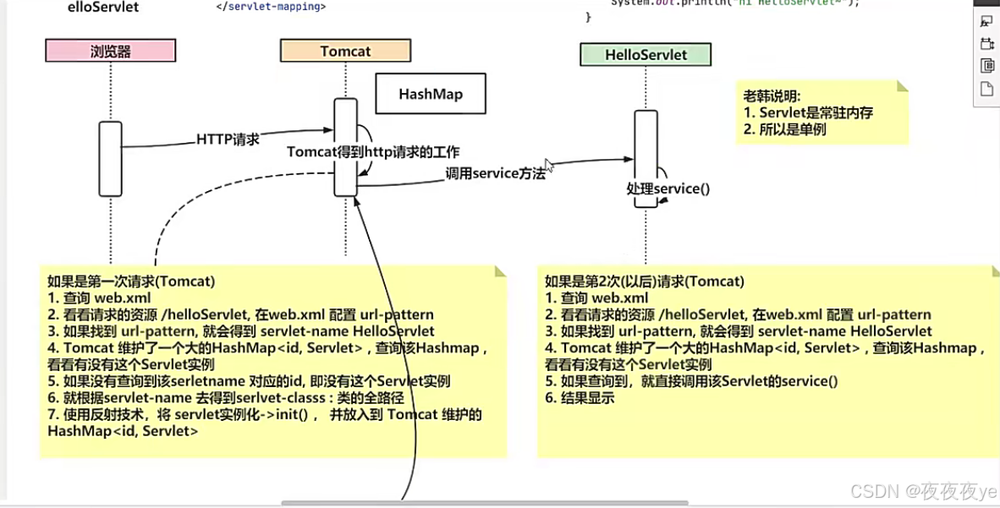

## 六.Servlet注解方式配置

```java
import javax.servlet.ServletException;
import javax.servlet.annotation.WebServlet;
import javax.servlet.http.HttpServlet;
import javax.servlet.http.HttpServletRequest;
import javax.servlet.http.HttpServletResponse;
import java.io.IOException;

//*使用注解方式来破解
//  以下注释是WebServlet的源码部分
// Target({ElementType.TYPE})  表示注解可以用在类型上比如类,接口
//@Retention(RetentionPolicy.RUNTIME) 表示作用域,在运行时可用
//@Documented 在javadoc工具生成文档会有记录
//public @interface WebServlet {
//    String name() default "";
//
//    String[] value() default {};
//
//    String[] urlPatterns() default {}; 对应的是web.xml里面的<url-pattern></url-pattern>
//
//    int loadOnStartup() default -1;
//
//    WebInitParam[] initParams() default {};
//
//    boolean asyncSupported() default false;
//
//    String smallIcon() default "";
//
//    String largeIcon() default "";*/
//{"/ok1","/ok2"} 可以给OkServlet配置多个url-pattern,整个注解代替了web.xml的配置,浏览器访问OkServlet时,最后的域名就是/ok1或者/ok2
@WebServlet(urlPatterns = {"/ok1","/ok2"})
public class OkServlet extends HttpServlet {

    @Override
    protected void doPost(HttpServletRequest req, HttpServletResponse resp) throws ServletException, IOException {
        System.out.println("注解方式的doPost()");
    }

    @Override
    protected void doGet(HttpServletRequest req, HttpServletResponse resp) throws ServletException, IOException {
        System.out.println("注解方式的doGet()");
    }
}


```

 1.整个流程(TomCat)
①对src下的包进行扫描,如果发现某个类是@WebServlet,就说明该类是Servlet,读取后面的urlPatterns
②看请求的资源最后部分地址是否与urlPattern是否匹配,如果匹配,就得到被@webSevlet注解的类
③接下来与配置web.xml文件的方式的第四步开始一模一样

2.url-pattern的路径配置
①精准匹配@WebServlet(urlPatterns = {“/ok1”,“/ok2”}) 即精准的匹配到访问的每一个路径
②目录匹配@WebServlet(urlPatterns {/ok1/} 代表ok1目录的子级可以是任意的 如ok1/ok1
③扩展名匹配@WebServlet(urlPatterns = {".start"} 可以是任意的,前面不能够再加"/" 否则会报错
④任意匹配@WebServlet(urlPatterns {“/”,"/“} 代表所有的请求都可以进行匹配
3.配置的注意事项和使用细节
①当Servlet配置了”/“,会覆盖掉tomcat的DefaultServlet,当其他的url-pattern都匹配不上时,都会走这个Servlet,这样其他的静态资源(如html,css,js,图片)都会被这个DefalutServlet拦截到,如果配置了”/" 静态资源就拦截不到了
②建议不要使用/*或者/ 尽量使用精确匹配,预防第①种情况

## 七.Http协议详解

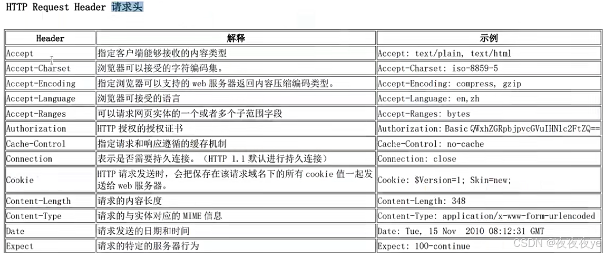

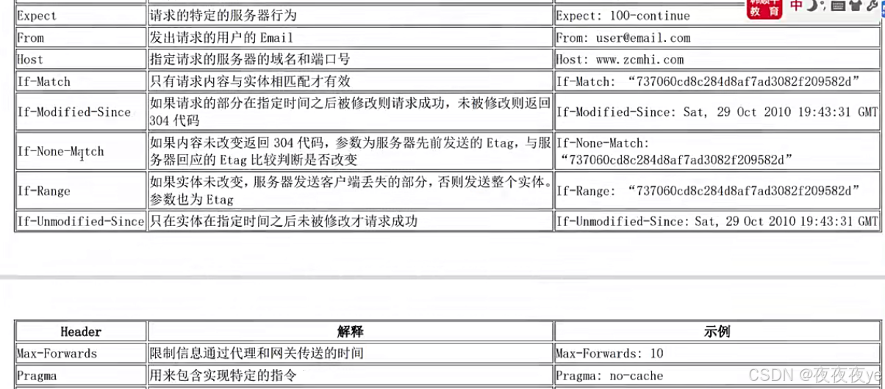

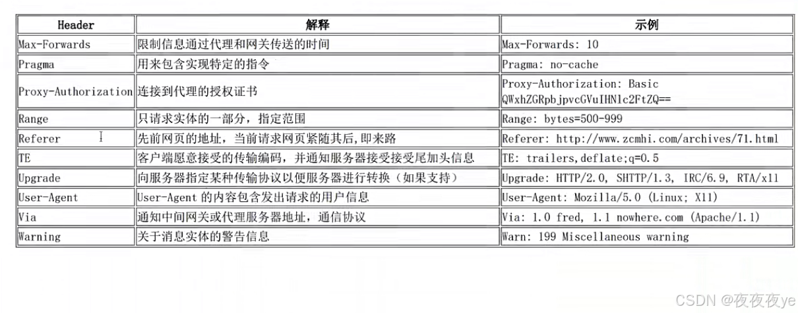

2.响应头字段介绍 

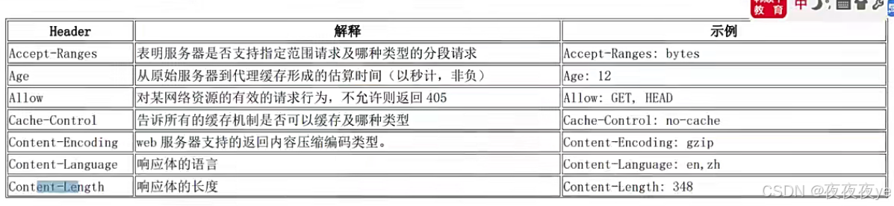

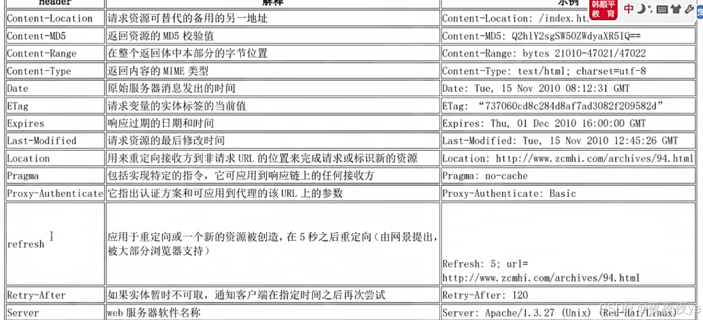

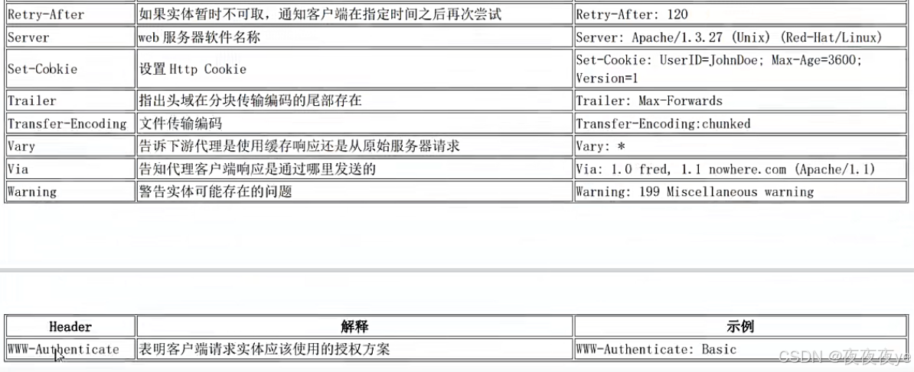

3.Http响应的状态码说明
列举常用的:
①200 代表请求成功
②302 临时移动,请求的资源被刷新到新的url,客户端应继续持有原先的url
③304 请求的资源并没有修改过,服务端返回此状态码时不会返回任何的资源,客户端通常会缓存访问过的资源,即访问本地的资源
④404 服务器无法根据客户端的请求找到资源
⑤500 服务器内部错误无法完成请求

4.get请求有哪些(get请求传输的数据量较小,不能大于2kb)
①form 标签 method 指定为get
②a标签 点击跳转
③link 标签引入css(以get方式来获取资源)
④script标签引入js文件
⑤img标签引入图片
⑥iframe 引入html页面
⑦在浏览器地址栏输入地址后敲回车

5.post请求有哪些(传输的数据量较大,一般没有限制)
① from标签 method 指定为post

6.post和get请求的区别
①post请求会在浏览器上隐藏参数部分,而get不会.在安全的要求情况下使用post,如用户登录
②用来分享和传播时可使用get请求.
7.MIME介绍
MIME是http协议中的数据类型,全称是多功能Internet邮件扩展服务.格式为大类型/小类型,并与某一种文件的扩展名相对应 ,通过MIME,浏览器就知道如何解析服务器响应的内容
常见的MIME类型:

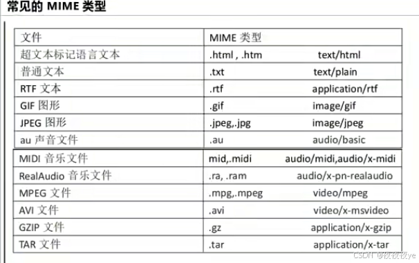

## 八.ServletConfig和ServletContext

1.ServletConfig基本介绍
①ServletConfig类是为Servlet程序的配置的信息的类
②Servlet程序和ServletConfig对象都是由Tomcat创建的
③Servlet程序默认是第一次访问的时候创建,ServletCongfig在Servlet程序创建时,就创建一个对应的ServletConfig对象
2.作用
①获取Servlet程序的servlet-name的值
②获取初始化参数init-param
③获取ServletContext对象

```java
package com.hspedu.servlet;

import javax.servlet.*;
import javax.servlet.http.*;
import java.io.IOException;

public class DBServlet extends HttpServlet {
        //如果重写了init方法,并且想要在其他方法通过getServletConfig()方法获取ServletConfig,则一定要调用super.init(config)
    @Override
    public void init(ServletConfig config) throws ServletException {
        //调用父类的GenericServlet,会把Tomcat创建的ServletConfig对象赋给GenericServlet的属性config
        System.out.println(config);
        super.init(config);
    }

    @Override
    protected void doGet(HttpServletRequest request, HttpServletResponse response) throws ServletException, IOException {
    doPost(request,response);
    }

    @Override
    protected void doPost(HttpServletRequest request, HttpServletResponse response) throws ServletException, IOException {
        //得到一个配置类对象
        ServletConfig servletConfig = this.getServletConfig();
        String username = servletConfig.getInitParameter("username");
        String psd = servletConfig.getInitParameter("pwd");
        System.out.println("名字是:"+username+"\t\t\t"+"密码是:"+psd);

    }
}


```

3.ServletContext介绍
①可以被多个Servlet共享
②存储数据形式为k-v 类似于Map
③可以实现多个Servlet的通信,数据在内存
④一个web工程,只会有一个ServletContext对象实例,在web工程启动的时候创建,在停止的时候销毁
⑤通过ServletConfig.getServletContext方法获得对ServletContext对象的引用,或者通过this.getServletContext来获得对象的引用

4.ServletContext的作用
①获取配置文件的上下文参数context-param
②获取当前的工程路径
③获取工程部署后再服务器硬盘上的绝对路径
④像Map一样存取数据,多个Servlet共享数据

5.ServletContext案例

```java
package com.hspedu.servlet.servletContext;

import javax.servlet.*;
import javax.servlet.http.*;
import java.io.IOException;

public class ServletContext extends HttpServlet {
    @Override
    protected void doGet(HttpServletRequest request, HttpServletResponse response) throws ServletException, IOException {
        doPost(request,response);
    }

    @Override
    protected void doPost(HttpServletRequest request, HttpServletResponse response)  {
        //获取配置文件的conText-param
        javax.servlet.ServletContext servletContext = this.getServletContext();
        //获取website
        String website = servletContext.getInitParameter("website");
        String company = servletContext.getInitParameter("company");
        System.out.println("网址是:"+website);
        System.out.println("公司名称是:"+company);
        //获取项目的工程路径
        String contextPath = servletContext.getContextPath();
        System.out.println("工程路径为:"+contextPath);
        //获取项目发布后正在工作的路径
        // /表示项目发布后的根路径
        String realPath = servletContext.getRealPath("/");
        System.out.println("根路径为:"+realPath);


    }
}

<!--    配置整个网站的信息-->
    <context-param>
        <param-name>website</param-name>
        <param-value>http://www.baidu.com</param-value>
    </context-param>
    <context-param>
        <param-name>company</param-name>
        <param-value>百度公司</param-value>
    </context-param>

```

```java
package com.hspedu.servlet.servletContext;

import javax.servlet.*;
import javax.servlet.ServletContext;
import javax.servlet.http.*;
import java.io.IOException;
import java.io.PrintWriter;

// 统计网站访问次数案例:
public class PayServlet extends HttpServlet {
    @Override
    protected void doGet(HttpServletRequest request, HttpServletResponse response) throws ServletException, IOException {
    doPost(request,response);
    }

    @Override
    protected void doPost(HttpServletRequest request, HttpServletResponse response) throws ServletException, IOException {

        //获取ServletContext对象
        ServletContext servletContext = this.getServletContext();
        //从servletContext获取visit_count属性
        Object visit_count = servletContext.getAttribute("visit_count");
        if(visit_count == null){
            servletContext.setAttribute("visit_count",1);
            visit_count = 1;
            System.out.println("输出visit_count的类型"+visit_count.getClass());
        }else {
            visit_count = Integer.parseInt(visit_count+"")+1;
            System.out.println("第二次输出类型"+visit_count.getClass());
            //放回servletContext
            servletContext.setAttribute("visit_count",visit_count);
        }

        //输出显示
        response.setContentType("text/html;charset = utf-8");
        PrintWriter writer = response.getWriter();
        writer.println("<h1>该网站被访问的的次数为"+visit_count+"</h1>");
        writer.flush();
        writer.close();
    }
}


```

## 九.HttpServletRequest

1.HttpServletRequest介绍
①HttpServletRequest对象代表客户端的请求
②当客户端通过HTTP协议访问服务器时,HTTP请求头中的信息都封装在这个对象中
③通过这个对象的方法,可以获得客户的信息

2.HttpservletRequest的一些常用方法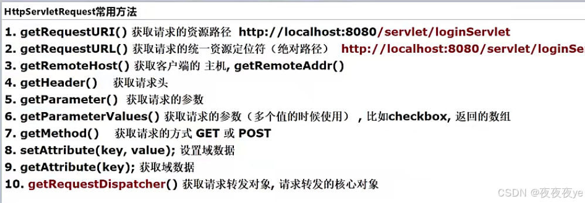

代码演示:在一个表单提交数据给Servlet,然后在Servlet通过HttpServletRequest对象获取相关数据 

```java
package com.hspedu.servlet.request;

import javax.servlet.*;
import javax.servlet.http.*;
import javax.swing.*;
import java.io.IOException;
import java.io.PrintWriter;

public class HttpServletRequestMethod extends HttpServlet {
    @Override
    protected void doGet(HttpServletRequest request, HttpServletResponse response) throws ServletException, IOException {
    doPost(request,response);
    }

    @Override
    protected void doPost(HttpServletRequest request, HttpServletResponse response) throws ServletException, IOException {
//使用request对象,使用各种方法
        System.out.println("请求的资源路径URI:"+request.getRequestURI());
        System.out.println("请求的资源的URL:"+request.getRequestURL());
        System.out.println("获取客户端的IP地址:"+request.getRemoteAddr());
        System.out.println("获取客户端的主机:"+request.getHeader("Host"));
        //如果想要得到请求头相关的信息,可以使用request.getHeader("请求头字段")方法
        //获取请求的浏览器名称
        String userAgent = request.getHeader("User-Agent");
        String[] s = userAgent.split(" ");
        System.out.println("浏览器是:"+s[s.length-2].split("\\/")[0]);
        System.out.println("获取http的请求方式:"+request.getMethod());


        //获取和请求参数的信息
        //1.获取表单中的数据[单个数据]
        String username = request.getParameter("username");
        System.out.println(username);
        //2.获取表单中的多个数据
        //解决中文乱码问题
        request.setCharacterEncoding("utf-8");
        String[] teachers = request.getParameterValues("teacher");
        for (String teacher : teachers) {
            System.out.println("多个数据之一是:"+teacher);
        }
        //3.获取请求头中的setion
        String cookie = request.getHeader("Cookie");
        String JSession = cookie.split(" ")[0].split("=")[1];
        System.out.println("JSession是:"+JSession);
        //返回接收到的信息,给浏览器回显回去
        response.setContentType("text/html;charset=utf-8");
        PrintWriter writer = response.getWriter();
        writer.println("提交的用户名:"+username);
        writer.flush();
        writer.close();

    }
}
```

3.请求转发
请求转发是指一个web资源收到客户端的请求后,通知服务器去调用另外一个web资源进行处理.
HttpServletrequest对象提供了一个getRequestDispatcher方法,返回一个RequestDispatcher对象,调用这个对象的forword方法可以实现请求转发
request对象同时也是一个域对象,数据通过request对象可以带给其他的web资源进行处理
①请求转发示意图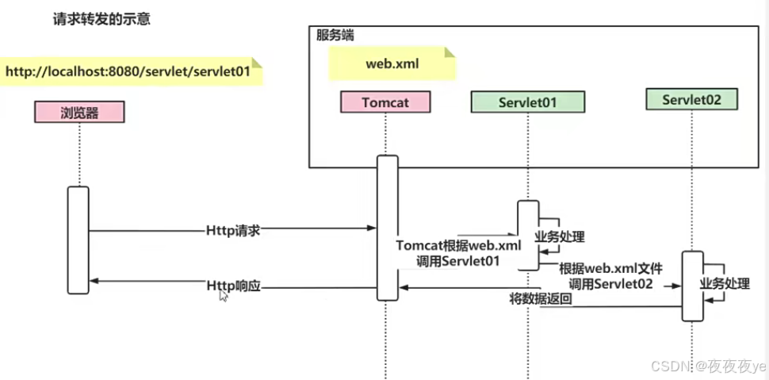

4.请求转发注意事项
①浏览器的地址不会发生变化,仍然会保留第一次的url
②在同一次的HTTP请求当中进行多次转发,仍然是一次HTTP请求
③在同一次的HTTP请求转发中,进行多次转发,多个Servlet可以共享一个request和response
④可以转发到WEB-INF	目录下
⑤不能访问当前web工程外的资源
⑥浏览器地址栏会停止在第一个servlet,如果刷新页面,则会再次发出请求并且会带数据,所以在支付时不要使用请求转发.

## 十.HttpServletResponse

介绍:每次的http请求,Tomcat会创建一个HttpServletResponse对象给Servlet程序使用,作用是给客户端返回信息

1.请求重定向示意图

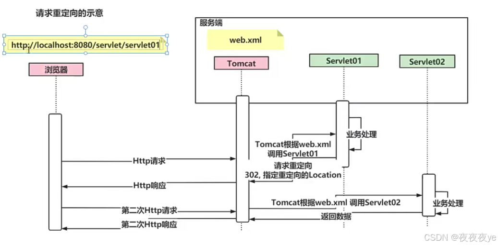

2.重定向语法,就是调用HttpServletResponse对象的一个方法指定一个新的Servlet 

```java
//sendDirect本质就会返回302状态码和location:/servlet/downServletNew
        //浏览器在解析/servlet/downServletNew的时候会拼接主机
        response.sendRedirect("/servlet/downServletNew");
```

 3.请求重定向注意事项和细节
①**最佳应用场景**:网站迁移,比如原域名是www.baidu.com 迁移到www.baidu.cn 但是抓取的网址还是原网址
②浏览器地址会发生变化,本质是两次http请求
③不能共享Request域中的数据,本质是两次http请求会生成两个HttpServletRequest对象
④不能重定向到/Web-INF下的资源
⑤可以重定向到Web工程以外的资源,比如重定向到淘宝网站
⑥重定向有两种方式,第二种是

```java
//第二种重定向方式
        response.setStatus(302);
        response.setHeader("Location","/servlet/downServletNew");
```


[进阶文章](https://www.zhihu.com/question/585070524/answer/2939949226)