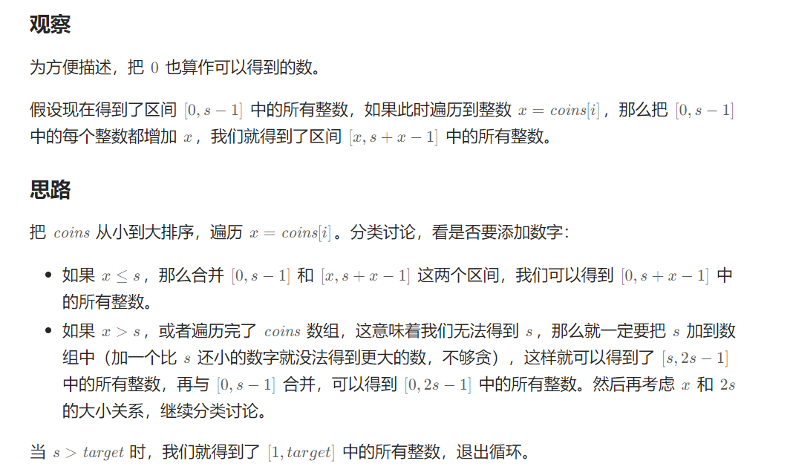
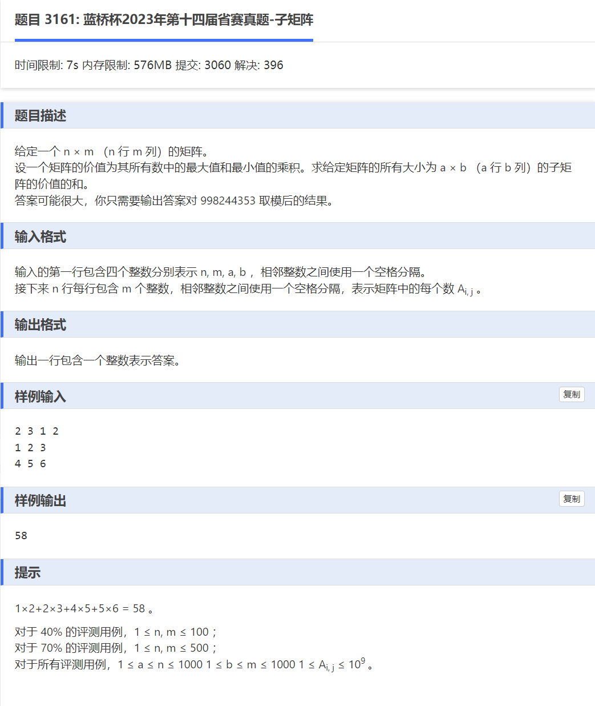

2799\. 统计完全子数组的数目
-----------------

给你一个由 **正** 整数组成的数组 `nums` 。

如果数组中的某个子数组满足下述条件，则称之为 **完全子数组** ：

*   子数组中 **不同** 元素的数目等于整个数组不同元素的数目。

返回数组中 **完全子数组** 的数目。

**子数组** 是数组中的一个连续非空序列。

**示例 1：**

**输入：**nums = \[1,3,1,2,2\]
**输出：**4
**解释：**完全子数组有：\[1,3,1,2\]、\[1,3,1,2,2\]、\[3,1,2\] 和 \[3,1,2,2\] 。

**示例 2：**

**输入：**nums = \[5,5,5,5\]
**输出：**10
**解释：**数组仅由整数 5 组成，所以任意子数组都满足完全子数组的条件。子数组的总数为 10 。

**提示：**

*   `1 <= nums.length <= 1000`
*   `1 <= nums[i] <= 2000`

[https://leetcode.cn/problems/count-complete-subarrays-in-an-array/](https://leetcode.cn/problems/count-complete-subarrays-in-an-array/)
```java
import java.util.HashMap;
import java.util.HashSet;

class Solution {
    public int countCompleteSubarrays(int[] nums) {
        HashSet<Integer> set = new HashSet<>();
        for(int num:nums) set.add(num);
        int m = set.size();
        int ans = 0, left = 0;
        HashMap<Integer, Integer> cnt = new HashMap<>();
        for (int num : nums) {
            cnt.merge(num, 1, Integer::sum);
            while (cnt.size() == m) {
                int x = nums[left++];
                if (cnt.merge(x, -1, Integer::sum) == 0) {
                    cnt.remove(x);
                }
            }
            ans += left; // 子数组左端点 < left 的都是合法的
        }
        return ans;
    }
}
```
2808\. 使循环数组所有元素相等的最少秒数
-----------------------

给你一个下标从 **0** 开始长度为 `n` 的数组 `nums` 。

每一秒，你可以对数组执行以下操作：

*   对于范围在 `[0, n - 1]` 内的每一个下标 `i` ，将 `nums[i]` 替换成 `nums[i]` ，`nums[(i - 1 + n) % n]` 或者 `nums[(i + 1) % n]` 三者之一。

**注意**，所有元素会被同时替换。

请你返回将数组 `nums` 中所有元素变成相等元素所需要的 **最少** 秒数。

**示例 1：**

**输入：**nums = \[1,2,1,2\]
**输出：**1
**解释：**我们可以在 1 秒内将数组变成相等元素：
- 第 1 秒，将每个位置的元素分别变为 \[nums\[3\],nums\[1\],nums\[3\],nums\[3\]\] 。变化后，nums = \[2,2,2,2\] 。
  1 秒是将数组变成相等元素所需要的最少秒数。

**示例 2：**

**输入：**nums = \[2,1,3,3,2\]
**输出：**2
**解释：**我们可以在 2 秒内将数组变成相等元素：
- 第 1 秒，将每个位置的元素分别变为 \[nums\[0\],nums\[2\],nums\[2\],nums\[2\],nums\[3\]\] 。变化后，nums = \[2,3,3,3,3\] 。
- 第 2 秒，将每个位置的元素分别变为 \[nums\[1\],nums\[1\],nums\[2\],nums\[3\],nums\[4\]\] 。变化后，nums = \[3,3,3,3,3\] 。
  2 秒是将数组变成相等元素所需要的最少秒数。

**示例 3：**

**输入：**nums = \[5,5,5,5\]
**输出：**0
**解释：**不需要执行任何操作，因为一开始数组中的元素已经全部相等。

**提示：**

*   `1 <= n == nums.length <= 105`
*   `1 <= nums[i] <= 109`

[https://leetcode.cn/problems/minimum-seconds-to-equalize-a-circular-array/description/](https://leetcode.cn/problems/minimum-seconds-to-equalize-a-circular-array/description/)

```java
import java.util.*;

class Solution {
	// 扩散元素
    public int minimumSeconds(List<Integer> nums) { // 最终所有元素一定变成了一个在 nums 中的数。枚举这个数。
        int n = nums.size(), ans = n;
        HashMap<Integer, List<Integer>> map = new HashMap<>(); // < num, {相同num对应的下标集合} >
        for (int i = 0; i < n; i++) {
            map.computeIfAbsent(nums.get(i), k -> new ArrayList<>()).add(i);
        }
        for (List<Integer> list : map.values()) {
            int mx = n - list.get(list.size() - 1) + list.get(0); // 计算两边的长度： _________(包含当前遍历的key)__________
            for (int i = 1; i < list.size(); i++) {
                mx = Math.max(mx, list.get(i) - list.get(i - 1)); // 计算中间位置，其实就是求最大“间隔”
            }
            ans = Math.min(ans, mx);
        }
        return ans / 2;  // 时间复杂度：O(n)，其中 n 为 nums 的长度。 空间复杂度：O(n)
    }
}
```

2952\. 需要添加的硬币的最小数量
-------------------

给你一个下标从 **0** 开始的整数数组 `coins`，表示可用的硬币的面值，以及一个整数 `target` 。

如果存在某个 `coins` 的子序列总和为 `x`，那么整数 `x` 就是一个 **可取得的金额** 。

返回需要添加到数组中的 **任意面值** 硬币的 **最小数量** ，使范围 `[1, target]` 内的每个整数都属于 **可取得的金额** 。

数组的 **子序列** 是通过删除原始数组的一些（**可能不删除**）元素而形成的新的 **非空** 数组，删除过程不会改变剩余元素的相对位置。

**示例 1：**

**输入：**coins = \[1,4,10\], target = 19
**输出：**2
**解释：**需要添加面值为 2 和 8 的硬币各一枚，得到硬币数组 \[1,2,4,8,10\] 。
可以证明从 1 到 19 的所有整数都可由数组中的硬币组合得到，且需要添加到数组中的硬币数目最小为 2 。

**示例 2：**

**输入：**coins = \[1,4,10,5,7,19\], target = 19
**输出：**1
**解释：**只需要添加一枚面值为 2 的硬币，得到硬币数组 \[1,2,4,5,7,10,19\] 。
可以证明从 1 到 19 的所有整数都可由数组中的硬币组合得到，且需要添加到数组中的硬币数目最小为 1 。

**示例 3：**

**输入：**coins = \[1,1,1\], target = 20
**输出：**3
**解释：**
需要添加面值为 4 、8 和 16 的硬币各一枚，得到硬币数组 \[1,1,1,4,8,16\] 。 
可以证明从 1 到 20 的所有整数都可由数组中的硬币组合得到，且需要添加到数组中的硬币数目最小为 3 。

**提示：**

*   `1 <= target <= 105`
*   `1 <= coins.length <= 105`
*   `1 <= coins[i] <= target`

[https://leetcode.cn/problems/minimum-number-of-coins-to-be-added/solutions/2551707/yong-gui-na-fa-si-kao-pythonjavacgo-by-e-8etj/](https://leetcode.cn/problems/minimum-number-of-coins-to-be-added/solutions/2551707/yong-gui-na-fa-si-kao-pythonjavacgo-by-e-8etj/)



```java
import java.util.Arrays;

class Solution {
	public int minimumAddedCoins(int[] coins, int target) {
		Arrays.sort(coins);
		int n = coins.length;
         long s = 1;
		int ans = 0, i = 0;
		while (s <= target) {
			if (i < n && s >= coins[i]) {
				s += coins[i++];
			} else {
				ans++;
				s += s;
			}
		}
		return ans;
	}
}
```

330\. 按要求补齐数组
-------------

给定一个已排序的正整数数组 `nums` _，_和一个正整数 `n` _。_从 `[1, n]` 区间内选取任意个数字补充到 nums 中，使得 `[1, n]` 区间内的任何数字都可以用 nums 中某几个数字的和来表示。

请返回 _满足上述要求的最少需要补充的数字个数_ 。

**示例 1:**

**输入:** nums = `[1,3]`, n = `6`
**输出:** 1 
**解释:**
根据 nums 里现有的组合 `[1], [3], [1,3]`，可以得出 `1, 3, 4`。
现在如果我们将 `2` 添加到 nums 中， 组合变为: `[1], [2], [3], [1,3], [2,3], [1,2,3]`。
其和可以表示数字 `1, 2, 3, 4, 5, 6`，能够覆盖 `[1, 6]` 区间里所有的数。
所以我们最少需要添加一个数字。

**示例 2:**

**输入:** nums = `[1,5,10]`, n = `20`
**输出:** 2
**解释:** 我们需要添加 `[2,4]`。

**示例 3:**

**输入:** nums = `[1,2,2]`, n = `5`
**输出:** 0

**提示：**

*   `1 <= nums.length <= 1000`
*   `1 <= nums[i] <= 104`
*   `nums` 按 **升序排列**
*   `1 <= n <= 231 - 1`

[https://leetcode.cn/problems/patching-array/description/](https://leetcode.cn/problems/patching-array/description/)

```java
import java.util.Arrays;

class Solution {
	public int minPatches(int[] nums, int n) {
		Arrays.sort(nums);
		long s = 1; // 服了，这里开int直接超时？懂了，s直接变负数了
		int ans = 0, i = 0;
		while (s <= n) {
			if (i < nums.length && s >= nums[i]) {
				s += nums[i++];
			} else {
				ans++;
				s += s;
			}
		}
		return ans;
	}
}
```

1798\. 你能构造出连续值的最大数目
--------------------

给你一个长度为 `n` 的整数数组 `coins` ，它代表你拥有的 `n` 个硬币。第 `i` 个硬币的值为 `coins[i]` 。如果你从这些硬币中选出一部分硬币，它们的和为 `x` ，那么称，你可以 **构造** 出 `x` 。

请返回从 `0` 开始（**包括** `0` ），你最多能 **构造** 出多少个连续整数。

你可能有多个相同值的硬币。

**示例 1：**

**输入：**coins = \[1,3\]
**输出：**2
**解释：**你可以得到以下这些值：
- 0：什么都不取 \[\]
- 1：取 \[1\]
  从 0 开始，你可以构造出 2 个连续整数。

**示例 2：**

**输入：**coins = \[1,1,1,4\]
**输出：**8
**解释：**你可以得到以下这些值：
- 0：什么都不取 \[\]
- 1：取 \[1\]
- 2：取 \[1,1\]
- 3：取 \[1,1,1\]
- 4：取 \[4\]
- 5：取 \[4,1\]
- 6：取 \[4,1,1\]
- 7：取 \[4,1,1,1\]
  从 0 开始，你可以构造出 8 个连续整数。

**示例 3：**

**输入：**nums = \[1,4,10,3,1\]
**输出：**20

**提示：**

*   `coins.length == n`
*   `1 <= n <= 4 * 104`
*   `1 <= coins[i] <= 4 * 104`

[https://leetcode.cn/problems/maximum-number-of-consecutive-values-you-can-make/description/](https://leetcode.cn/problems/maximum-number-of-consecutive-values-you-can-make/description/)

```java
import java.util.Arrays;

class Solution {
	public int getMaximumConsecutive(int[] coins) {
		Arrays.sort(coins);
		int s = 1, i = 0;
		while (true) {
			if (i < coins.length && s >= coins[i]) {
				s += coins[i++];
			} else {
				break;
			}
		}
		return s;
	}
}
```



```java
// 其实主要就一个压缩矩阵
package com.Java_Template.array.basic;

import java.io.*;
import java.math.BigInteger;
 
/*
原题连接：https://www.dotcpp.com/oj/problem3161.html
题目描述:
给定一个 n × m （n 行 m 列）的矩阵。
设一个矩阵的价值为其所有数中的最大值和最小值的乘积。
求给定矩阵的所有大小为 a × b （a 行 b 列）的子矩阵的价值的和。
答案可能很大，你只需要输出答案对 998244353 取模后的结果。
 
输入格式:
输入的第一行包含四个整数分别表示 n, m, a, b ，相邻整数之间使用一个空格分隔。
接下来 n 行每行包含 m 个整数，相邻整数之间使用一个空格分隔，表示矩阵中的每个数 Ai, j 。
输出格式
输出一行包含一个整数表示答案。
 
样例输入:
2 3 1 2
1 2 3
4 5 6
 
样例输出:
58
 
提示
1×2+2×3+4×5+5×6 = 58 。
*/
public class ChildrenMatrix {
    static BigInteger N = new BigInteger("998244353");
    static int n, m, a, b;
    static int matrix[][];
    static int colMaxMatrix[][];
    static int colMinMatrix[][]; // 每个值为 一行b列 矩阵中的最小值
     
    static int rowNum;
    static int colNum;
 
    static int childMaxMatrix[][]; // 每个值为 一个 a行b列矩阵中的最大值
    static int childMinMatrix[][]; // 每个值为 一个 a行b列矩阵中的最小值
 
    static BigInteger sum = new BigInteger("0");
    static int max;
    static int min;
 
    // 输入流
    static BufferedReader br = new BufferedReader(new InputStreamReader(System.in));
    // 分割输入流
    static StreamTokenizer st = new StreamTokenizer(br);
    // 输出流
    static PrintWriter pw = new PrintWriter(new OutputStreamWriter(System.out));
 
    static int nextInt() throws Exception {
        st.nextToken(); // 开始遍历输入流中的数据, 默认标记中 数据为0与null, 以" "或者"\n"为分隔符查找到下一个标记, 然后返回之前的数值
        // nval:
        // 如果当前标记是一个数值，则nval属性将存储该数值的值。如果当前标记不是一个数值，或者如果没有下一个标记可用，则nval将被设置为Double.NaN。
        // sval:
        // 如果当前标记是一个字符串，则sval属性将存储该字符串的值。如果当前标记不是一个字符串，或者如果当前标记不是一个普通标记，则sval将为null。
        return (int) st.nval;
    }
 
    public static void main(String[] args) throws Exception {
        // 1. 接收尺寸输入
        n = nextInt();
        m = nextInt();
        a = nextInt();
        b = nextInt();
 
        // 2. 接收矩阵数据输入
        matrix = new int[n][m];
        InputMatrix();
 
        // 3. 核心: 
        GetColMatrix();
        GetChildMatrix();
        GetSum();
         
        pw.println(sum.mod(N));
        pw.flush(); // 刷新输出流，确保内容被输出到控制台
    }
 
    private static void InputMatrix() throws Exception {
        for (int i = 0; i < n; ++i) {
            for (int j = 0; j < m; ++j) {
                matrix[i][j] = nextInt();
            }
        }
 
    }
 
    // 先求每行b列, 得到对应的最大最小
    // 例如: n = m = 5, a = b = 3
    /*
        3 5 1 6 1
        1 2 4 7 6
        9 4 8 4 6
        1 3 7 1 3
        4 5 8 9 2
    */
     
    // 第一行为: 3 5 1 6 1. 滑块宽度为3
    // 3 5 1 中最大为5, 最小为1
    // colMaxMatrix[1][0]: 5
    // 滑块移动: 5 1 6, 最大为6
    // colMaxMatrix[1][1]: 6
    // 滑块移动: 1 6 1, 最大为6
    // colMaxMatrix[1][2]: 6
    // 滑块无法移动, colMaxMatrix 第一行结束
     
    // 换句话说, colMaxMatrix 每一行与 原 Matrix 一一对应, 列为 每b列的浓缩
    private static void GetColMatrix() {
        // 初始化最大与最小矩阵
        colMaxMatrix = new int[n][m];
        colMinMatrix = new int[n][m];
         
        // 由于是压缩列数, 因此行的数量没有发生改变
        for (int i = 0; i < n; ++i) {
            int col = 0; //  
            for (int j = 0; j + b - 1 < m; ++j) {
                // 每个滑块的最大值与最小值的默认都是第一个
                max = matrix[i][j];
                min = matrix[i][j];
                 
                // 在滑块内寻找最大与最小值
                for (int z = j; z < j + b; ++z) {
                    if (max < matrix[i][z]) {
                        max = matrix[i][z];
                    }
                    if (min > matrix[i][z]) {
                        min = matrix[i][z];
                    }
                }
 
                // 填入最大值与最小值
                colMaxMatrix[i][col] = max;
                colMinMatrix[i][col] = min;
                col++;     
            }
            colNum = col; // 确定新矩阵的有效列数
        }
    }
 
    // 再结合行数, 方法与之前相同, 只是压缩的方向变为了行, 而不是列, 以此得到的矩阵的对应值 就是 每个a*b矩阵的最大值
    // 例如: 得到的新矩阵: childMaxMatrix[0][0]对应值: 原矩阵中的 MaxMatrix[0-(a-1)][0-(b-1)]中的最大值
    private static void GetChildMatrix() {
        childMaxMatrix = new int[n][m];
        childMinMatrix = new int[n][m];
        // 这次是结合 行数, 因此是从列数开始遍历
        for (int j = 0; j < colNum; ++j) {
            int row = 0;
            for (int i = 0; i + a - 1 < n; ++i) {
                // 填入最大值与最小值记得回归默认值
                max = colMaxMatrix[i][j];
                min = colMinMatrix[i][j];
                for(int z = i; z < i+a; ++z) {
                    if (max < colMaxMatrix[z][j]) {
                        max = colMaxMatrix[z][j];
                    }
                    if (min > colMinMatrix[z][j]) {
                        min = colMinMatrix[z][j];
                    }
                }
                 
                // 填入最大值与最小值
                childMaxMatrix[row][j] = max;
                childMinMatrix[row][j] = min;
                row++;
            }
            rowNum = row;
        }
    }
 
    // 最大与最小一一对应相乘, 相乘最开始越阈了, 使用 BigInteger解决问题
    private static void GetSum() {
        for(int i = 0; i< rowNum; ++i)
        {
            for(int j = 0; j<colNum; ++j)
            {
                BigInteger num1 = new BigInteger(String.valueOf(childMaxMatrix[i][j]));
                BigInteger num2 = new BigInteger(String.valueOf(childMinMatrix[i][j]));
                sum = sum.add(num1.multiply(num2));  
            }
        }
    }
}
```

## [E. Permutation of Rows and Columns ](https://codeforces.com/contest/1980/problem/E)

您已获得一个大小为 $$$n$$$ 的矩阵 $$$a$$$ ，由 $$$m$$$ 组成，其中包含从 $$$1$$$ 到 $$$n \cdot m$$$ 的整数排列。

$$$n$$$ 整数的排列是一个数组，其中包含从 $$$1$$$ 到 $$$n$$$ 的所有数字，且只包含一次。例如，数组 $$$[1]$$$ 、 $$$[2, 1, 3]$$$ 、 $$$[5, 4, 3, 2, 1]$$$ 是排列，而数组 $$$[1, 1]$$$ 、 $$$[100]$$$ 、 $$$[1, 2, 4, 5]$$$ 不是。

如果矩阵的所有元素都写出后，结果数组是排列，则该矩阵包含排列。矩阵 $$$[[1, 2], [3, 4]]$$$ 、 $$$[[1]]$$$ 、 $$$[[1, 5, 3], [2, 6, 4]]$$$ 包含排列，而矩阵 $$$[[2]]$$$ 、 $$$[[1, 1], [2, 2]]$$$ 、 $$$[[1, 2], [100, 200]]$$$ 不包含。

您可以在一次操作中执行以下两个操作之一：

- 选择列 $$$c$$$ 和 $$$d$$$ ( $$$1 \le c, d \le m$$$ 、 $$$c \ne d$$$ ) 并交换这些列；
- 选择行 $$$c$$$ 和 $$$d$$$ ( $$$1 \le c, d \le n$$$ 、 $$$c \ne d$$$ ) 并交换这些行。

您可以执行任意数量的操作。

您将获得原始矩阵 $$$a$$$ 和矩阵 $$$b$$$ 。您的任务是确定是否可以使用给定的操作将矩阵 $$$a$$$ 转换为矩阵 $$$b$$$ 。

```java
import java.io.BufferedReader;
import java.io.InputStreamReader;
import java.util.Scanner;

public class Main {
    private static Scanner sc = new Scanner(new BufferedReader(new InputStreamReader(System.in)));
    public static void main(String[] args) {
        int T = sc.nextInt();
        while (T-- > 0) {
            solve();
        }
    }
    private static void solve() { // 只需要还原第一行和第一列，最后和b数组比较
        int n = sc.nextInt();
        int m = sc.nextInt();
        int[][] ar = new int[n][m];
        int[][] br = new int[n][m];
        int[] row = new int[n * m];
        int[] col = new int[n * m];
        for (int i = 0; i < n; i++) {
            for (int j = 0; j < m; j++) {
                ar[i][j] = sc.nextInt();
                ar[i][j]--;
                row[ar[i][j]] = i;
                col[ar[i][j]] = j;
            }
        }
        for (int i = 0; i < n; i++) {
            for (int j = 0; j < m; j++) {
                br[i][j] = sc.nextInt();
                br[i][j]--;
            }
        }
        // 还原第一列，取每一行的第一个数字
        for (int i = 0; i < n; i++) {
            int r = row[br[i][0]]; // r是br[i][0]在ar中的行号
            // 交换ar中的第i行与第r行
            int[] temp = ar[i];
            ar[i] = ar[r];
            ar[r] = temp;

            // row发生了变化
            for (int j = 0; j < m; j++) {
                row[ar[i][j]] = i;
                row[ar[r][j]] = r;
            }
        }

        // 还原列
        for (int j = 0; j < m; j++) {
            int c = col[br[0][j]];
            for (int i = 0; i < n; i++) {
                int temp = ar[i][j];
                ar[i][j] = ar[i][c];
                ar[i][c] = temp;
                col[ar[i][j]] = j;
                col[ar[i][c]] = c;
            }
        }

        if (Arrays.deepEquals(ar, br)) {
            System.out.println("YES");
        }else{
            System.out.println("NO");
        }
    }

}
```

2972\. 统计移除递增子数组的数目 II
----------------------

给你一个下标从 **0** 开始的 **正** 整数数组 `nums` 。

如果 `nums` 的一个子数组满足：移除这个子数组后剩余元素 **严格递增** ，那么我们称这个子数组为 **移除递增** 子数组。比方说，`[5, 3, 4, 6, 7]` 中的 `[3, 4]` 是一个移除递增子数组，因为移除该子数组后，`[5, 3, 4, 6, 7]` 变为 `[5, 6, 7]` ，是严格递增的。

请你返回 `nums` 中 **移除递增** 子数组的总数目。

**注意** ，剩余元素为空的数组也视为是递增的。

**子数组** 指的是一个数组中一段连续的元素序列。

**示例 1：**

**输入：**nums = \[1,2,3,4\]
**输出：**10
**解释：**10 个移除递增子数组分别为：\[1\], \[2\], \[3\], \[4\], \[1,2\], \[2,3\], \[3,4\], \[1,2,3\], \[2,3,4\] 和 \[1,2,3,4\]。移除任意一个子数组后，剩余元素都是递增的。注意，空数组不是移除递增子数组。

**示例 2：**

**输入：**nums = \[6,5,7,8\]
**输出：**7
**解释：**7 个移除递增子数组分别为：\[5\], \[6\], \[5,7\], \[6,5\], \[5,7,8\], \[6,5,7\] 和 \[6,5,7,8\] 。
nums 中只有这 7 个移除递增子数组。

**示例 3：**

**输入：**nums = \[8,7,6,6\]
**输出：**3
**解释：**3 个移除递增子数组分别为：\[8,7,6\], \[7,6,6\] 和 \[8,7,6,6\] 。注意 \[8,7\] 不是移除递增子数组因为移除 \[8,7\] 后 nums 变为 \[6,6\] ，它不是严格递增的。

**提示：**

*   `1 <= nums.length <= 105`
*   `1 <= nums[i] <= 109`

[https://leetcode.cn/problems/count-the-number-of-incremovable-subarrays-ii/description/](https://leetcode.cn/problems/count-the-number-of-incremovable-subarrays-ii/description/)

```java
class Solution {
    public long incremovableSubarrayCount(int[] nums) {
        int i = 0, n = nums.length;
        while (i + 1 < n && nums[i] < nums[i + 1]) {
            i++;
        }
        if (i == n - 1) {
            return (long) n * (n + 1) / 2;
        }
        long ans = i + 2;
        for (int j = n - 1; j > 0; j--) {
            while (i >= 0 && nums[i] >= nums[j]) {
                i--;
            }
            ans += i + 2;
            if (nums[j - 1] >= nums[j]) {
                break;
            }
        }
        return  ans;
    }
}
```

100401\. 放三个车的价值之和最大 II(超级考验coding能力)
-----------------------

给你一个 `m x n` 的二维整数数组 `board` ，它表示一个国际象棋棋盘，其中 `board[i][j]` 表示格子 `(i, j)` 的 **价值** 。

处于 **同一行** 或者 **同一列** 车会互相 **攻击** 。你需要在棋盘上放三个车，确保它们两两之间都 **无法互相攻击** 。

请你返回满足上述条件下，三个车所在格子 **值** 之和 **最大** 为多少。

**示例 1：**

**输入：**board = \[\[-3,1,1,1\],\[-3,1,-3,1\],\[-3,2,1,1\]\]

**输出：**4

**解释：**


我们可以将车分别放在格子 `(0, 2)` ，`(1, 3)` 和 `(2, 1)` 处，价值之和为 `1 + 1 + 2 = 4` 。

**示例 2：**

**输入：**board = \[\[1,2,3\],\[4,5,6\],\[7,8,9\]\]

**输出：**15

**解释：**

我们可以将车分别放在格子 `(0, 0)` ，`(1, 1)` 和 `(2, 2)` 处，价值之和为 `1 + 5 + 9 = 15` 。

**示例 3：**

**输入：**board = \[\[1,1,1\],\[1,1,1\],\[1,1,1\]\]

**输出：**3

**解释：**

我们可以将车分别放在格子 `(0, 2)` ，`(1, 1)` 和 `(2, 0)` 处，价值之和为 `1 + 1 + 1 = 3` 。

**提示：**

*   `3 <= m == board.length <= 500`
*   `3 <= n == board[i].length <= 500`
*   `-109 <= board[i][j] <= 109`

[https://leetcode.cn/problems/maximum-value-sum-by-placing-three-rooks-ii/](https://leetcode.cn/problems/maximum-value-sum-by-placing-three-rooks-ii/)

```java
class Solution {
    public long maximumValueSum(int[][] board) {
        int m = board.length, n = board[0].length;
        int[][][] suffix = new int[m][3][2];
        int[][] p = new int[3][2];
        for (int[] pi : p) {
            pi[0] = Integer.MIN_VALUE;
        }
        for (int i = m - 1; i >= 0; i--) {
            update(board[i], p);
            for (int j = 0; j < 3; j++) {
                suffix[i][j][0] = p[j][0];
                suffix[i][j][1] = p[j][1];
            }
        }
        long ans = Long.MIN_VALUE;
        for (int[] pi : p) {
            pi[0] = Integer.MIN_VALUE;
        }
        for (int i = 1; i < m - 1; i++) { // 枚举中间元素
            update(board[i - 1], p);
            for (int j = 0; j < n; j++) { // 第二个车
                for (int[] a : p) { // 第一个车
                    for (int[] c : suffix[i + 1]) { // 第三个车
                        if (a[1] != j && c[1] != j && a[1] != c[1]) {
                            ans = Math.max(ans, (long) a[0] + board[i][j] + c[0]);
                            break;
                        }
                    }
                }

            }
        }
        return ans;
    }

    private void update(int[] row, int[][] p) {
        for (int j = 0; j < row.length; j++) {
            int x = row[j];
            if (x > p[0][0]) {
                if (p[0][1] != j) {
                    if (p[1][1] != j) {
                        p[2] = p[1]; // 二维数组都是引用赋值
                    }
                    p[1] = p[0]; // 二维数组都是引用赋值
                }
                p[0] = new int[]{x, j}; // 这里一定要new，不能直接赋值
            } else if (x > p[1][0] && j != p[0][1]) {
                if (p[1][1] != j) {
                    p[2] = p[1];
                }
                p[1] = new int[]{x, j};
            } else if (x > p[2][0] && j != p[0][1] && j != p[1][1]) {
                p[2] = new int[]{x, j};
            }
        }
    }
}
```

