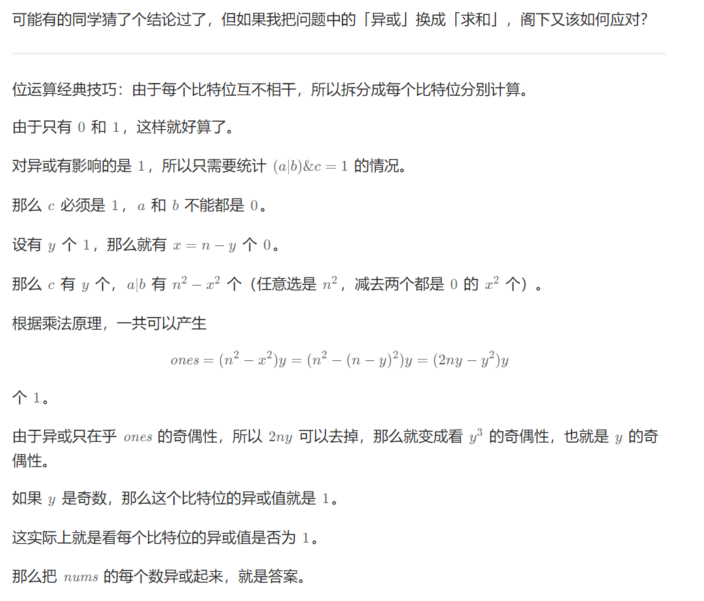
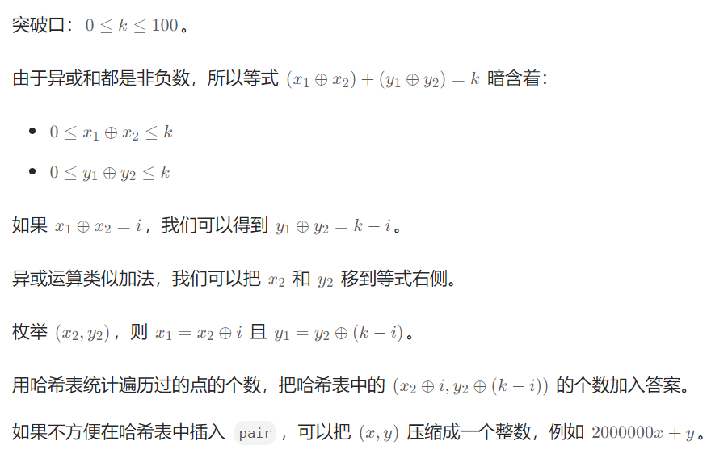

> # 位运算经典技巧：由于每个比特位互不相干，所以拆分成每个比特位分别计算。 

100282\. 数组最后一个元素的最小值
---------------------

给你两个整数 `n` 和 `x` 。你需要构造一个长度为 `n` 的 **正整数** 数组 `nums` ，对于所有 `0 <= i < n - 1` ，满足 `nums[i + 1]` **大于** `nums[i]` ，并且数组 `nums` 中所有元素的按位 `AND` 运算结果为 `x` 。

返回 `nums[n - 1]` 可能的 **最小** 值。

**示例 1：**

**输入：**n = 3, x = 4

**输出：**6

**解释：**

数组 `nums` 可以是 `[4,5,6]` ，最后一个元素为 `6` 。

**示例 2：**

**输入：**n = 2, x = 7

**输出：**15

**解释：**

数组 `nums` 可以是 `[7,15]` ，最后一个元素为 `15` 。

**提示：**

*   `1 <= n, x <= 108`

[https://leetcode.cn/problems/minimum-array-end/](https://leetcode.cn/problems/minimum-array-end/)

```java
import java.util.ArrayList;

class Solution {
    public long minEnd(int n, int x) {
        // 这里其实就是求x的二进制中，我们可以将其中的0变成1，但是不能将1变成0，求比x大的第n - 1个数
        n--;
        long ans = x;
        int i = 0, j = 0;
        while ((n >> j) > 0) {
            // x的第i个比特位是0
            if (((ans >> i) & 1) == 0) {
                // 空位填入n的第j个比特位
                ans |= (long) (n >> j & 1) << i;
                j++;
            }
            i++;
        }
        return ans;
    }
}
```
2588\. 统计美丽子数组数目
----------------

给你一个下标从 **0** 开始的整数数组`nums` 。每次操作中，你可以：

*   选择两个满足 `0 <= i, j < nums.length` 的不同下标 `i` 和 `j` 。
*   选择一个非负整数 `k` ，满足 `nums[i]` 和 `nums[j]` 在二进制下的第 `k` 位（下标编号从 **0** 开始）是 `1` 。
*   将 `nums[i]` 和 `nums[j]` 都减去 `2k` 。

如果一个子数组内执行上述操作若干次后，该子数组可以变成一个全为 `0` 的数组，那么我们称它是一个 **美丽** 的子数组。

请你返回数组 `nums` 中 **美丽子数组** 的数目。

子数组是一个数组中一段连续 **非空** 的元素序列。

**示例 1：**

**输入：**nums = \[4,3,1,2,4\]
**输出：**2
**解释：**nums 中有 2 个美丽子数组：\[4,_**3,1,2**_,4\] 和 \[_**4,3,1,2,4**_\] 。
- 按照下述步骤，我们可以将子数组 \[3,1,2\] 中所有元素变成 0 ：
  - 选择 \[_**3**_, 1, _**2**_\] 和 k = 1 。将 2 个数字都减去 21 ，子数组变成 \[1, 1, 0\] 。
  - 选择 \[_**1**_, _**1**_, 0\] 和 k = 0 。将 2 个数字都减去 20 ，子数组变成 \[0, 0, 0\] 。
- 按照下述步骤，我们可以将子数组 \[4,3,1,2,4\] 中所有元素变成 0 ：
  - 选择 \[_**4**_, 3, 1, 2, _**4**_\] 和 k = 2 。将 2 个数字都减去 22 ，子数组变成 \[0, 3, 1, 2, 0\] 。
  - 选择 \[0, _**3**_, _**1**_, 2, 0\] 和 k = 0 。将 2 个数字都减去 20 ，子数组变成 \[0, 2, 0, 2, 0\] 。
  - 选择 \[0, _**2**_, 0, _**2**_, 0\] 和 k = 1 。将 2 个数字都减去 21 ，子数组变成 \[0, 0, 0, 0, 0\] 。

**示例 2：**

**输入：**nums = \[1,10,4\]
**输出：**0
**解释：**nums 中没有任何美丽子数组。

**提示：**

*   `1 <= nums.length <= 105`
*   `0 <= nums[i] <= 106`

[https://leetcode.cn/problems/count-the-number-of-beautiful-subarrays/](https://leetcode.cn/problems/count-the-number-of-beautiful-subarrays/)

```java
import java.util.HashMap;

class Solution {
    public long beautifulSubarrays(int[] nums) {
        long ans = 0;
        int n = nums.length;
        int[] prefixSum = new int[n + 1]; // 异或前缀和
        for (int i = 0; i < n; i++) {
            prefixSum[i + 1] = prefixSum[i] ^ nums[i];
        }
        // 求异或前缀和相同的两个值，使用hash表优化
        HashMap<Integer, Integer> cnt = new HashMap<>();
        for (int x : prefixSum) {
            ans += cnt.getOrDefault(x, 0);
            cnt.merge(x, 1, Integer::sum);
        }
        return ans;
    }
}
```

1177\. 构建回文串检测
--------------

给你一个字符串 `s`，请你对 `s` 的子串进行检测。

每次检测，待检子串都可以表示为 `queries[i] = [left, right, k]`。我们可以 **重新排列** 子串 `s[left], ..., s[right]`，并从中选择 **最多** `k` 项替换成任何小写英文字母。 

如果在上述检测过程中，子串可以变成回文形式的字符串，那么检测结果为 `true`，否则结果为 `false`。

返回答案数组 `answer[]`，其中 `answer[i]` 是第 `i` 个待检子串 `queries[i]` 的检测结果。

注意：在替换时，子串中的每个字母都必须作为 **独立的** 项进行计数，也就是说，如果 `s[left..right] = "aaa"` 且 `k = 2`，我们只能替换其中的两个字母。（另外，任何检测都不会修改原始字符串 `s`，可以认为每次检测都是独立的）

**示例：**

**输入：**s = "abcda", queries = \[\[3,3,0\],\[1,2,0\],\[0,3,1\],\[0,3,2\],\[0,4,1\]\]
**输出：**\[true,false,false,true,true\]
**解释：**
queries\[0\] : 子串 = "d"，回文。
queries\[1\] : 子串 = "bc"，不是回文。
queries\[2\] : 子串 = "abcd"，只替换 1 个字符是变不成回文串的。
queries\[3\] : 子串 = "abcd"，可以变成回文的 "abba"。 也可以变成 "baab"，先重新排序变成 "bacd"，然后把 "cd" 替换为 "ab"。
queries\[4\] : 子串 = "abcda"，可以变成回文的 "abcba"。

**提示：**

*   `1 <= s.length, queries.length <= 10^5`
*   `0 <= queries[i][0] <= queries[i][1] < s.length`
*   `0 <= queries[i][2] <= s.length`
*   `s` 中只有小写英文字母

[https://leetcode.cn/problems/can-make-palindrome-from-substring/solutions/2309725/yi-bu-bu-you-hua-cong-qian-zhui-he-dao-q-yh5p/](https://leetcode.cn/problems/can-make-palindrome-from-substring/solutions/2309725/yi-bu-bu-you-hua-cong-qian-zhui-he-dao-q-yh5p/)

```java
import java.util.ArrayList;
import java.util.List;

class Solution {
    public List<Boolean> canMakePaliQueries(String s, int[][] queries) {
        int n = s.length();
        int[][] prefixSum = new int[n + 1][26];
        for (int i = 0; i < n; i++) {
            prefixSum[i + 1] = prefixSum[i].clone();
            prefixSum[i + 1][s.charAt(i) - 'a']++;
        }
        ArrayList<Boolean> ans = new ArrayList<>(queries.length); // 预分配空间
        for (int[] q : queries) {
            int left = q[0], right = q[1], k = q[2], m = 0; // m是区间奇数字母出现次数
            for (int i = 0; i < 26; i++) {
                m += (prefixSum[right + 1][i] - prefixSum[left][i]) % 2;
            }
            ans.add(m / 2 <= k);
        }
        return ans;
    }
}
```

```java
import java.util.ArrayList;
import java.util.List;

class Solution { // 封神了！！！
    public List<Boolean> canMakePaliQueries(String s, int[][] queries) {
        int n = s.length();
        int[] prefixSum = new int[n + 1];
        for (int i = 0; i < n; i++) {
            int bit = 1 << (s.charAt(i) - 'a');
            prefixSum[i + 1] = prefixSum[i] ^ bit; // 该比特对应字母的奇偶性：奇数变偶数，偶数变奇数
        }
        ArrayList<Boolean> ans = new ArrayList<>(queries.length);
        for (int[] q : queries) {
            int left = q[0], right = q[1], k = q[2];
            int m = Integer.bitCount(prefixSum[right + 1] ^ prefixSum[left]);
            ans.add(m / 2 <= k);
        }
        return ans;
    }
}
```

1542\. 找出最长的超赞子字符串
------------------

给你一个字符串 `s` 。请返回 `s` 中最长的 **超赞子字符串** 的长度。

「超赞子字符串」需满足满足下述两个条件：

*   该字符串是 `s` 的一个非空子字符串
*   进行任意次数的字符交换后，该字符串可以变成一个回文字符串

**示例 1：**

**输入：**s = "3242415"
**输出：**5
**解释：**"24241" 是最长的超赞子字符串，交换其中的字符后，可以得到回文 "24142"

**示例 2：**

**输入：**s = "12345678"
**输出：**1

**示例 3：**

**输入：**s = "213123"
**输出：**6
**解释：**"213123" 是最长的超赞子字符串，交换其中的字符后，可以得到回文 "231132"

**示例 4：**

**输入：**s = "00"
**输出：**2

**提示：**

*   `1 <= s.length <= 10^5`
*   `s` 仅由数字组成

[https://leetcode.cn/problems/find-longest-awesome-substring/description/?envType=daily-question&envId=2024-05-20](https://leetcode.cn/problems/find-longest-awesome-substring/description/?envType=daily-question&envId=2024-05-20)

```java
import java.util.HashMap;

class Solution {
    public int longestAwesome(String s) {
        int n = s.length();
        HashMap<Integer, Integer> map = new HashMap<>();
        map.put(0, -1);
        int ans = 1, cur = 0;
        for (int i = 0; i < n; i++) {
            int x = s.charAt(i) - '0';
            cur = (1 << x) ^ cur;
            if (map.containsKey(cur)) {
                ans = Math.max(ans, i - map.get(cur)); // 说明构成的回文串是偶数长度
            }else{
                map.put(cur, i);
            }
            // 这里讨论奇数回文串的情况
            for (int j = 0; j < 10; j++) {
                int find = (1 << j) ^ cur; // 当第j位为奇数时
                if (map.containsKey(find)) {
                    ans = Math.max(ans, i - map.get(find));
                }
            }
        }
        return ans;
    }
}
```

# 与或（AND/OR）的性质

> AND 的数越多，结果越小。OR 的数越多，结果越大。 移除元素可以num ^= x;

3209\. 子数组按位与值为 K 的数目（ AND 经典logtrick题目）
---------------------

给你一个整数数组 `nums` 和一个整数 `k` ，请你返回 `nums` 中有多少个

子数组

满足：子数组中所有元素按位 `AND` 的结果为 `k` 。

**示例 1：**

**输入：**nums = \[1,1,1\], k = 1

**输出：**6

**解释：**

所有子数组都只含有元素 1 。

**示例 2：**

**输入：**nums = \[1,1,2\], k = 1

**输出：**3

**解释：**

按位 `AND` 值为 1 的子数组包括：`[**1**,1,2]`, `[1,**1**,2]`, `[**1,1**,2]` 。

**示例 3：**

**输入：**nums = \[1,2,3\], k = 2

**输出：**2

**解释：**

按位 `AND` 值为 2 的子数组包括：`[1,**2**,3]`, `[1,**2,3**]` 。

**提示：**

*   `1 <= nums.length <= 105`
*   `0 <= nums[i], k <= 109`

[https://leetcode.cn/problems/number-of-subarrays-with-and-value-of-k/description/](https://leetcode.cn/problems/number-of-subarrays-with-and-value-of-k/description/)

```java
import java.util.HashMap;

class Solution {
    public long countSubarrays(int[] nums, int k) { // 经典logtrick题目, 解法特别多，这是我觉得最简单的解法
        HashMap<Integer, Integer> prev = new HashMap<>();
        long ans = 0;
        for (int x : nums) {
            HashMap<Integer, Integer> curr = new HashMap<>();
            for (Integer y : prev.keySet()) {
                curr.merge(y & x, prev.get(y), Integer::sum);
            }
            curr.merge(x, 1, Integer::sum);
            prev = curr;
            ans += prev.getOrDefault(k, 0);
        }
        return ans;
    }
}
```


2871\. 将数组分割成最多数目的子数组
---------------------

给你一个只包含 **非负** 整数的数组 `nums` 。

我们定义满足 `l <= r` 的子数组 `nums[l..r]` 的分数为 `nums[l] AND nums[l + 1] AND ... AND nums[r]` ，其中 **AND** 是按位与运算。

请你将数组分割成一个或者更多子数组，满足：

*   **每个** 元素都 **只** 属于一个子数组。
*   子数组分数之和尽可能 **小** 。

请你在满足以上要求的条件下，返回 **最多** 可以得到多少个子数组。

一个 **子数组** 是一个数组中一段连续的元素。

**示例 1：**

**输入：**nums = \[1,0,2,0,1,2\]
**输出：**3
**解释：**我们可以将数组分割成以下子数组：
- \[1,0\] 。子数组分数为 1 AND 0 = 0 。
- \[2,0\] 。子数组分数为 2 AND 0 = 0 。
- \[1,2\] 。子数组分数为 1 AND 2 = 0 。
  分数之和为 0 + 0 + 0 = 0 ，是我们可以得到的最小分数之和。
  在分数之和为 0 的前提下，最多可以将数组分割成 3 个子数组。所以返回 3 。

**示例 2：**

**输入：**nums = \[5,7,1,3\]
**输出：**1
**解释：**我们可以将数组分割成一个子数组：\[5,7,1,3\] ，分数为 1 ，这是可以得到的最小总分数。
在总分数为 1 的前提下，最多可以将数组分割成 1 个子数组。所以返回 1 。

**提示：**

*   `1 <= nums.length <= 105`
*   `0 <= nums[i] <= 106`

[https://leetcode.cn/problems/split-array-into-maximum-number-of-subarrays/description/](https://leetcode.cn/problems/split-array-into-maximum-number-of-subarrays/description/)

```java
class Solution {
    public int maxSubarrays(int[] nums) {
        int ans = 0;
        int a = -1; // -1 就是 111...1，和任何数 AND 都等于那个数
        for (int x : nums) {
            a &= x;
            if (a == 0) {
                ans++; // 分割
                a = -1;
            }
        }
        return Math.max(ans, 1); // 如果 ans=0 说明所有数的 and>0，答案为 1
    }
}
```

2401\. 最长优雅子数组
--------------

给你一个由 **正** 整数组成的数组 `nums` 。

如果 `nums` 的子数组中位于 **不同** 位置的每对元素按位 **与（AND）**运算的结果等于 `0` ，则称该子数组为 **优雅** 子数组。

返回 **最长** 的优雅子数组的长度。

**子数组** 是数组中的一个 **连续** 部分。

**注意：**长度为 `1` 的子数组始终视作优雅子数组。

**示例 1：**

**输入：**nums = \[1,3,8,48,10\]
**输出：**3
**解释：**最长的优雅子数组是 \[3,8,48\] 。子数组满足题目条件：
- 3 AND 8 = 0
- 3 AND 48 = 0
- 8 AND 48 = 0
  可以证明不存在更长的优雅子数组，所以返回 3 。

**示例 2：**

**输入：**nums = \[3,1,5,11,13\]
**输出：**1
**解释：**最长的优雅子数组长度为 1 ，任何长度为 1 的子数组都满足题目条件。

**提示：**

*   `1 <= nums.length <= 105`
*   `1 <= nums[i] <= 109`

[https://leetcode.cn/problems/longest-nice-subarray/description/](https://leetcode.cn/problems/longest-nice-subarray/description/)

```java
class Solution {
        // 2401. 最长优雅子数组
    public int longestNiceSubarray(int[] nums) {
        // 方法二 滑动窗口
        int ans = 0;
        for (int left = 0, right = 0, or = 0; right < nums.length; right++) {
            while ((or & nums[right]) > 0) { // 有交集
                or ^= nums[left++]; // 从 or 中去掉集合 nums[left]
            }
            or |= nums[right];
            ans = Math.max(ans, right - left + 1);
        }
        return ans;
    }
}
```

3097\. 或值至少为 K 的最短子数组 II(or模板)
------------------------

给你一个 **非负** 整数数组 `nums` 和一个整数 `k` 。

如果一个数组中所有元素的按位或运算 `OR` 的值 **至少** 为 `k` ，那么我们称这个数组是 **特别的** 。

请你返回 `nums` 中 **最短特别非空** 

子数组

的长度，如果特别子数组不存在，那么返回 `-1` 。

**示例 1：**

**输入：**nums = \[1,2,3\], k = 2

**输出：**1

**解释：**

子数组 `[3]` 的按位 `OR` 值为 `3` ，所以我们返回 `1` 。

**示例 2：**

**输入：**nums = \[2,1,8\], k = 10

**输出：**3

**解释：**

子数组 `[2,1,8]` 的按位 `OR` 值为 `11` ，所以我们返回 `3` 。

**示例 3：**

**输入：**nums = \[1,2\], k = 0

**输出：**1

**解释：**

子数组 `[1]` 的按位 `OR` 值为 `1` ，所以我们返回 `1` 。

**提示：**

*   `1 <= nums.length <= 2 * 105`
*   `0 <= nums[i] <= 109`
*   `0 <= k <= 109`

[https://leetcode.cn/problems/shortest-subarray-with-or-at-least-k-ii/description/](https://leetcode.cn/problems/shortest-subarray-with-or-at-least-k-ii/description/)

```java
class Solution {
    public int minimumSubarrayLength(int[] nums, int k) {
        int ans = Integer.MAX_VALUE;
        List<int[]> ors = new ArrayList<>(); // 保存 (右端点为 i 的子数组 OR, 该子数组左端点的最大值)
        for (int i = 0; i < nums.length; i++) {
            ors.add(new int[]{0, i});
            int j = 0;
            for (int[] or : ors) {
                or[0] |= nums[i];
                if (or[0] >= k) {
                    ans = Math.min(ans, i - or[1] + 1);
                }
                if (ors.get(j)[0] == or[0]) {
                    ors.get(j)[1] = or[1]; // 原地去重：合并相同值，左端点取靠右的
                } else {
                    ors.set(++j, or);
                }
            }
            ors.subList(j + 1, ors.size()).clear(); // 去重：移除多余元素
        }
        return ans == Integer.MAX_VALUE ? -1 : ans;
    }
} // 发现一个问题没有，就是我们在便利ors的时候，同时也在修改ors。如果是add()、remove()这种操作，就会报错，但是set()是不会报错的。
```

2680\. 最大或值
-----------

给你一个下标从 **0** 开始长度为 `n` 的整数数组 `nums` 和一个整数 `k` 。每一次操作中，你可以选择一个数并将它乘 `2` 。

你最多可以进行 `k` 次操作，请你返回 `nums[0] | nums[1] | ... | nums[n - 1]` 的最大值。

`a | b` 表示两个整数 `a` 和 `b` 的 **按位或** 运算。

**示例 1：**

**输入：**nums = \[12,9\], k = 1
**输出：**30
**解释：**如果我们对下标为 1 的元素进行操作，新的数组为 \[12,18\] 。此时得到最优答案为 12 和 18 的按位或运算的结果，也就是 30 。

**示例 2：**

**输入：**nums = \[8,1,2\], k = 2
**输出：**35
**解释：**如果我们对下标 0 处的元素进行操作，得到新数组 \[32,1,2\] 。此时得到最优答案为 32|1|2 = 35 。

**提示：**

*   `1 <= nums.length <= 105`
*   `1 <= nums[i] <= 109`
*   `1 <= k <= 15`

[https://leetcode.cn/problems/maximum-or/description/](https://leetcode.cn/problems/maximum-or/description/)

```java
class Solution {
       // 2680. 最大或值
    public long maximumOr(int[] nums, int k) {
        int n = nums.length;
        long[] suffix = new long[n + 1];
        for (int i = n - 1; i >= 0; i--) {
            suffix[i] = suffix[i + 1] | nums[i];
        }
        long ans = 0, pre = 0;
        for (int i = 0; i < n; i++) {
            ans = Math.max(ans, pre | ((long) nums[i] << k) | suffix[i + 1]);
            pre |= nums[i];
        }
        return ans;
    }
}
```

2411\. 按位或最大的最小子数组长度（模板）
--------------------

给你一个长度为 `n` 下标从 **0** 开始的数组 `nums` ，数组中所有数字均为非负整数。对于 `0` 到 `n - 1` 之间的每一个下标 `i` ，你需要找出 `nums` 中一个 **最小** 非空子数组，它的起始位置为 `i` （包含这个位置），同时有 **最大** 的 **按位或****运算值** 。

*   换言之，令 `Bij` 表示子数组 `nums[i...j]` 的按位或运算的结果，你需要找到一个起始位置为 `i` 的最小子数组，这个子数组的按位或运算的结果等于 `max(Bik)` ，其中 `i <= k <= n - 1` 。

一个数组的按位或运算值是这个数组里所有数字按位或运算的结果。

请你返回一个大小为 `n` 的整数数组 `answer`，其中 `answer[i]`是开始位置为 `i` ，按位或运算结果最大，且 **最短** 子数组的长度。

**子数组** 是数组里一段连续非空元素组成的序列。

**示例 1：**

**输入：**nums = \[1,0,2,1,3\]
**输出：**\[3,3,2,2,1\]
**解释：**
任何位置开始，最大按位或运算的结果都是 3 。
- 下标 0 处，能得到结果 3 的最短子数组是 \[1,0,2\] 。
- 下标 1 处，能得到结果 3 的最短子数组是 \[0,2,1\] 。
- 下标 2 处，能得到结果 3 的最短子数组是 \[2,1\] 。
- 下标 3 处，能得到结果 3 的最短子数组是 \[1,3\] 。
- 下标 4 处，能得到结果 3 的最短子数组是 \[3\] 。
  所以我们返回 \[3,3,2,2,1\] 。

**示例 2：**

**输入：**nums = \[1,2\]
**输出：**\[2,1\]
**解释：**
下标 0 处，能得到最大按位或运算值的最短子数组长度为 2 。
下标 1 处，能得到最大按位或运算值的最短子数组长度为 1 。
所以我们返回 \[2,1\] 。

**提示：**

*   `n == nums.length`
*   `1 <= n <= 105`
*   `0 <= nums[i] <= 109`

[https://leetcode.cn/problems/smallest-subarrays-with-maximum-bitwise-or/description/](https://leetcode.cn/problems/smallest-subarrays-with-maximum-bitwise-or/description/)

```java
import java.util.*;

class Solution {
    public int[] smallestSubarrays(int[] nums) {
        int n = nums.length;
        int[] ans = new int[n];
        List<int[]> ors = new ArrayList<int[]>(); // 按位或的值 + 对应子数组的右端点的最小值
        for (int i = n - 1; i >= 0; --i) { // 倒叙太牛了
            ors.add(new int[]{0, i});
            int k = 0;
            for (int[] or : ors) {
                or[0] |= nums[i];
                if (ors.get(k)[0] == or[0])
                    ors.get(k)[1] = or[1]; // 合并相同值，下标取最小的
                else ors.set(++k, or);
            }
            ors.subList(k + 1, ors.size()).clear();
            // 本题只用到了 ors[0]，如果题目改成任意给定数值，可以在 ors 中查找
            ans[i] = ors.get(0)[1] - i + 1;
        }
        return ans;
    }
}

```

3108\. 带权图里旅途的最小代价(两种做法：dfs+并查集)
------------------

给你一个 `n` 个节点的带权无向图，节点编号为 `0` 到 `n - 1` 。

给你一个整数 `n` 和一个数组 `edges` ，其中 `edges[i] = [ui, vi, wi]` 表示节点 `ui` 和 `vi` 之间有一条权值为 `wi` 的无向边。

在图中，一趟旅途包含一系列节点和边。旅途开始和结束点都是图中的节点，且图中存在连接旅途中相邻节点的边。注意，一趟旅途可能访问同一条边或者同一个节点多次。

如果旅途开始于节点 `u` ，结束于节点 `v` ，我们定义这一趟旅途的 **代价** 是经过的边权按位与 `AND` 的结果。换句话说，如果经过的边对应的边权为 `w0, w1, w2, ..., wk` ，那么代价为`w0 & w1 & w2 & ... & wk` ，其中 `&` 表示按位与 `AND` 操作。

给你一个二维数组 `query` ，其中 `query[i] = [si, ti]` 。对于每一个查询，你需要找出从节点开始 `si` ，在节点 `ti` 处结束的旅途的最小代价。如果不存在这样的旅途，答案为 `-1` 。

返回数组 `answer` ，其中 `answer[i]` 表示对于查询 `i` 的 **最小** 旅途代价。

**示例 1：**

**输入：**n = 5, edges = \[\[0,1,7\],\[1,3,7\],\[1,2,1\]\], query = \[\[0,3\],\[3,4\]\]

**输出：**\[1,-1\]

**解释：**


第一个查询想要得到代价为 1 的旅途，我们依次访问：`0->1`（边权为 7 ）`1->2` （边权为 1 ）`2->1`（边权为 1 ）`1->3` （边权为 7 ）。

第二个查询中，无法从节点 3 到节点 4 ，所以答案为 -1 。

**示例 2：**

**输入：**n = 3, edges = \[\[0,2,7\],\[0,1,15\],\[1,2,6\],\[1,2,1\]\], query = \[\[1,2\]\]

**输出：**\[0\]

**解释：**


第一个查询想要得到代价为 0 的旅途，我们依次访问：`1->2`（边权为 1 ），`2->1`（边权 为 6 ），`1->2`（边权为 1 ）。

**提示：**

*   `1 <= n <= 105`
*   `0 <= edges.length <= 105`
*   `edges[i].length == 3`
*   `0 <= ui, vi <= n - 1`
*   `ui != vi`
*   `0 <= wi <= 105`
*   `1 <= query.length <= 105`
*   `query[i].length == 2`
*   `0 <= si, ti <= n - 1`

[https://leetcode.cn/problems/minimum-cost-walk-in-weighted-graph/description/](https://leetcode.cn/problems/minimum-cost-walk-in-weighted-graph/description/)

```java
import java.util.ArrayList;
import java.util.Arrays;
import java.util.List;

class Solution {
    public int[] minimumCost(int n, int[][] edges, int[][] query) {
        List[] g = new List[n];
        Arrays.setAll(g, e -> new ArrayList<int[]>());
        for (int[] edge : edges) {
            int x = edge[0], y = edge[1], z = edge[2];
            g[x].add(new int[]{y, z});
            g[y].add(new int[]{x, z});
        }
        int[] ids = new int[n]; // 记录每个点所在连通块的编号
        Arrays.fill(ids, -1);
        ArrayList<Integer> ccAnd = new ArrayList<>();
        for (int i = 0; i < n; i++) {
            if (ids[i] < 0) {
                ccAnd.add(dfs(ids, ccAnd.size(), g, i));
            }
        }
        int[] ans = new int[query.length];
        for (int i = 0; i < query.length; i++) {
            int from = query[i][0], to = query[i][1];
            ans[i] = from == to ? 0 : ids[from] == ids[to] ? ccAnd.get(ids[from]) : -1;
        }
        return ans;

    }

    private int dfs(int[] ids, int curId, List<int[]>[] g, int x) {
        ids[x] = curId;
        int and = -1;
        for (int[] y : g[x]) {
            and &= y[1];
            if (ids[y[0]] < 0) { // 没有被访问
                and &= dfs(ids, curId, g, y[0]);
            }
        }
        return and;
    }
}
```

```java
import java.util.ArrayList;
import java.util.Arrays;
import java.util.HashMap;
import java.util.List;

class Solution {
	public int[] minimumCost(int n, int[][] edges, int[][] query) {

		int[] parent = new int[n];
		Arrays.setAll(parent, i -> i);
		for (int[] e : edges) {
			int x = e[0], y = e[1], z = e[2];
			union(parent, x, y);
		}
		HashMap<Integer, Integer> map = new HashMap<Integer, Integer>();
		for (int[] e : edges) {
			int u = e[0], w = e[2];
			int root = find(parent, u);
			map.put(root, map.getOrDefault(root, w) & w);
		}
		int m = query.length;
		int[] ans = new int[m];
		for (int i = 0; i < m; i++) {

			int from = query[i][0],to = query[i][1];
			if(from ==to) {
				ans[i] = 0;
			}else {
				if(find(parent,from)==find(parent,to)) {
					ans[i] = map.get(find(parent,from));
				}else {
					ans[i] = -1;
				}
			}
			
		}
		return ans;
	}

	private void union(int[] parent, int index1, int index2) {
		parent[find(parent, index1)] = find(parent, index2);
	}

	private int find(int[] parent, int index) {
		if (parent[index] != index) {
			parent[index] = find(parent, parent[index]);
		}
		return parent[index];
	}
}
```


898\. 子数组按位或操作（模板）
--------------

我们有一个非负整数数组 `arr` 。

对于每个（连续的）子数组 `sub = [arr[i], arr[i + 1], ..., arr[j]]` （ `i <= j`），我们对 `sub` 中的每个元素进行按位或操作，获得结果 `arr[i] | arr[i + 1] | ... | arr[j]` 。

返回可能结果的数量。 多次出现的结果在最终答案中仅计算一次。

**示例 1：**

**输入：**arr = \[0\]
**输出：**1
**解释：**
只有一个可能的结果 0 。

**示例 2：**

**输入：**arr = \[1,1,2\]
**输出：**3
**解释：**
可能的子数组为 \[1\]，\[1\]，\[2\]，\[1, 1\]，\[1, 2\]，\[1, 1, 2\]。
产生的结果为 1，1，2，1，3，3 。
有三个唯一值，所以答案是 3 。

**示例 3：**

**输入：**arr = \[1,2,4\]
**输出：**6
**解释：**
可能的结果是 1，2，3，4，6，以及 7 。

**提示：**

*   `1 <= nums.length <= 5 * 104`
*   `0 <= nums[i] <= 109`​​​​​​​

[https://leetcode.cn/problems/bitwise-ors-of-subarrays/description/](https://leetcode.cn/problems/bitwise-ors-of-subarrays/description/)

```java
import java.util.ArrayList;
import java.util.HashSet;

class Solution {
    public int subarrayBitwiseORs(int[] nums) {
        int n = nums.length;
        ArrayList<int[]> ors = new ArrayList<int[]>();
        HashSet<Integer> set = new HashSet<>();
        for (int i = n - 1; i >= 0; i--) {
            ors.add(new int[]{0, i});
            int k = 0;
            for (int[] or : ors) {
                or[0] |= nums[i];
                if (ors.get(k)[0] == or[0]) {
                    ors.get(k)[1] = or[1];
                }else{
                    ors.set(++k, or);
                }
                set.add(or[0]);
            }
            ors.subList(k + 1, ors.size()).clear();
        }
        return set.size();
    }
}
```

1521\. 找到最接近目标值的函数值（AND logtrick）
-------------------


Winston 构造了一个如上所示的函数 `func` 。他有一个整数数组 `arr` 和一个整数 `target` ，他想找到让 `|func(arr, l, r) - target|` 最小的 `l` 和 `r` 。

请你返回 `|func(arr, l, r) - target|` 的最小值。

请注意， `func` 的输入参数 `l` 和 `r` 需要满足 `0 <= l, r < arr.length` 。

**示例 1：**

**输入：**arr = \[9,12,3,7,15\], target = 5
**输出：**2
**解释：**所有可能的 \[l,r\] 数对包括 \[\[0,0\],\[1,1\],\[2,2\],\[3,3\],\[4,4\],\[0,1\],\[1,2\],\[2,3\],\[3,4\],\[0,2\],\[1,3\],\[2,4\],\[0,3\],\[1,4\],\[0,4\]\]， Winston 得到的相应结果为 \[9,12,3,7,15,8,0,3,7,0,0,3,0,0,0\] 。最接近 5 的值是 7 和 3，所以最小差值为 2 。

**示例 2：**

**输入：**arr = \[1000000,1000000,1000000\], target = 1
**输出：**999999
**解释：**Winston 输入函数的所有可能 \[l,r\] 数对得到的函数值都为 1000000 ，所以最小差值为 999999 。

**示例 3：**

**输入：**arr = \[1,2,4,8,16\], target = 0
**输出：**0

**提示：**

*   `1 <= arr.length <= 10^5`
*   `1 <= arr[i] <= 10^6`
*   `0 <= target <= 10^7`

[https://leetcode.cn/problems/find-a-value-of-a-mysterious-function-closest-to-target/description/](https://leetcode.cn/problems/find-a-value-of-a-mysterious-function-closest-to-target/description/)

```java
import java.util.ArrayList;

class Solution {
    public int closestToTarget(int[] nums, int target) {
        int n = nums.length;
        ArrayList<int[]> ands = new ArrayList<>();
        int ans = Integer.MAX_VALUE;
        for (int i = n - 1; i >= 0; i--) {
            ands.add(new int[]{nums[i], i}); // 如果是Or运算这里初始化为{0，i}
            int k = 0;
            for (int[] and : ands) {
                and[0] &= nums[i];
                if (and[0] == ands.get(k)[0]) {
                    ands.get(k)[1] = and[1];
                }else{
                    ands.set(++k, and);
                }
                ans = Math.min(ans, Math.abs(and[0] - target));
            }
            ands.subList(k + 1, ands.size()).clear();
        }
        return ans;
    }
}
```

3117\. 划分数组得到最小的值之和
-------------------

给你两个数组 `nums` 和 `andValues`，长度分别为 `n` 和 `m`。

数组的 **值** 等于该数组的 **最后一个** 元素。

你需要将 `nums` 划分为 `m` 个 **不相交的连续** 子数组，对于第 `ith` 个子数组 `[li, ri]`，子数组元素的按位`AND`运算结果等于 `andValues[i]`，换句话说，对所有的 `1 <= i <= m`，`nums[li] & nums[li + 1] & ... & nums[ri] == andValues[i]` ，其中 `&` 表示按位`AND`运算符。

返回将 `nums` 划分为 `m` 个子数组所能得到的可能的 **最小** 子数组 **值** 之和。如果无法完成这样的划分，则返回 `-1` 。

**示例 1：**

**输入：** nums = \[1,4,3,3,2\], andValues = \[0,3,3,2\]

**输出：** 12

**解释：**

唯一可能的划分方法为：

1.  `[1,4]` 因为 `1 & 4 == 0`
2.  `[3]` 因为单元素子数组的按位 `AND` 结果就是该元素本身
3.  `[3]` 因为单元素子数组的按位 `AND` 结果就是该元素本身
4.  `[2]` 因为单元素子数组的按位 `AND` 结果就是该元素本身

这些子数组的值之和为 `4 + 3 + 3 + 2 = 12`

**示例 2：**

**输入：** nums = \[2,3,5,7,7,7,5\], andValues = \[0,7,5\]

**输出：** 17

**解释：**

划分 `nums` 的三种方式为：

1.  `[[2,3,5],[7,7,7],[5]]` 其中子数组的值之和为 `5 + 7 + 5 = 17`
2.  `[[2,3,5,7],[7,7],[5]]` 其中子数组的值之和为 `7 + 7 + 5 = 19`
3.  `[[2,3,5,7,7],[7],[5]]` 其中子数组的值之和为 `7 + 7 + 5 = 19`

子数组值之和的最小可能值为 `17`

**示例 3：**

**输入：** nums = \[1,2,3,4\], andValues = \[2\]

**输出：** \-1

**解释：**

整个数组 `nums` 的按位 `AND` 结果为 `0`。由于无法将 `nums` 划分为单个子数组使得元素的按位 `AND` 结果为 `2`，因此返回 `-1`。

**提示：**

*   `1 <= n == nums.length <= 104`
*   `1 <= m == andValues.length <= min(n, 10)`
*   `1 <= nums[i] < 105`
*   `0 <= andValues[j] < 105`

[https://leetcode.cn/problems/minimum-sum-of-values-by-dividing-array/description/](https://leetcode.cn/problems/minimum-sum-of-values-by-dividing-array/description/)

```java
import java.util.HashMap;
import java.util.Map;

class Solution {
    public int minimumValueSum(int[] nums, int[] andValues) {
        HashMap<Long, Integer> memo = new HashMap<>();
        int ans = dfs(0, 0, -1, nums, andValues, memo);
        return ans < Integer.MAX_VALUE / 2 ? ans : -1;
    }

    private int dfs(int i, int j, int and, int[] nums, int[] andValues, Map<Long,Integer> memo) {
        int n = nums.length;
        int m = andValues.length;
        if (m - j > n - i) { // 剩余元素不足
            return Integer.MAX_VALUE / 2;
        }
        if (j == m) { // 分了m段
            return i == n ? 0 : Integer.MAX_VALUE / 2;
        }
        and &= nums[i];
        if (and < andValues[j]) { // 剪枝：无法等于 andValues[j]
            return Integer.MAX_VALUE / 2;
        }
        long mask = (long) i << 36 | (long) j << 32 | and; // 三个状态压缩成一个 long
        if (memo.containsKey(mask)) {
            return memo.get(mask);
        }
        int res = dfs(i + 1, j, and, nums, andValues, memo); // 不划分
        if (and == andValues[j]) { // 划分，nums[i]是这一段的最后一个数
            res = Math.min(res, dfs(i + 1, j + 1, -1, nums, andValues, memo) + nums[i]);
        }
        memo.put(mask, res);
        return res;
    }
}
```

# 异或（XOR）的性质

# 异或板子：

```java
    private static int xorN(int n) {
        switch (n % 4) {
            case 0 :
                return n;
            case 1 :
                return 1;
            case 2 :
                return n + 1;
            default :
                return 0;
        }
    }
```


2429\. 最小异或
-----------

给你两个正整数 `num1` 和 `num2` ，找出满足下述条件的正整数 `x` ：

*   `x` 的置位数和 `num2` 相同，且
*   `x XOR num1` 的值 **最小**

注意 `XOR` 是按位异或运算。

返回整数 `x` 。题目保证，对于生成的测试用例， `x` 是 **唯一确定** 的。

整数的 **置位数** 是其二进制表示中 `1` 的数目。

**示例 1：**

**输入：**num1 = 3, num2 = 5
**输出：**3
**解释：**
num1 和 num2 的二进制表示分别是 0011 和 0101 。
整数 **3** 的置位数与 num2 相同，且 `3 XOR 3 = 0` 是最小的。

**示例 2：**

**输入：**num1 = 1, num2 = 12
**输出：**3
**解释：**
num1 和 num2 的二进制表示分别是 0001 和 1100 。
整数 **3** 的置位数与 num2 相同，且 `3 XOR 1 = 2` 是最小的。

**提示：**

*   `1 <= num1, num2 <= 109`

[https://leetcode.cn/problems/minimize-xor/description/](https://leetcode.cn/problems/minimize-xor/description/)

```java
class Solution {
    public int minimizeXor(int num1, int num2) {
        int c1 = Integer.bitCount(num1);
        int c2 = Integer.bitCount(num2);
        for (; c2 < c1; ++c2) num1 &= num1 - 1; // 最低的 1 变成 0
        for (; c2 > c1; --c2) num1 |= num1 + 1; // 最低的 0 变成 1
        return num1;
    }
}
```

2527\. 查询数组异或美丽值
----------------

给你一个下标从 **0** 开始的整数数组 `nums` 。

三个下标 `i` ，`j` 和 `k` 的 **有效值** 定义为 `((nums[i] | nums[j]) & nums[k])` 。

一个数组的 **异或美丽值** 是数组中所有满足 `0 <= i, j, k < n`  **的三元组** `(i, j, k)` 的 **有效值** 的异或结果。

请你返回 `nums` 的异或美丽值。

**注意：**

*   `val1 | val2` 是 `val1` 和 `val2` 的按位或。
*   `val1 & val2` 是 `val1` 和 `val2` 的按位与。

**示例 1：**

**输入：**nums = \[1,4\]
**输出：**5
**解释：**
三元组和它们对应的有效值如下：
- (0,0,0) 有效值为 ((1 | 1) & 1) = 1
- (0,0,1) 有效值为 ((1 | 1) & 4) = 0
- (0,1,0) 有效值为 ((1 | 4) & 1) = 1
- (0,1,1) 有效值为 ((1 | 4) & 4) = 4
- (1,0,0) 有效值为 ((4 | 1) & 1) = 1
- (1,0,1) 有效值为 ((4 | 1) & 4) = 4
- (1,1,0) 有效值为 ((4 | 4) & 1) = 0
- (1,1,1) 有效值为 ((4 | 4) & 4) = 4 
  数组的异或美丽值为所有有效值的按位异或 1 ^ 0 ^ 1 ^ 4 ^ 1 ^ 4 ^ 0 ^ 4 = 5 。

**示例 2：**

**输入：**nums = \[15,45,20,2,34,35,5,44,32,30\]
**输出：**34
`**解释：**数组的异或美丽值为 34 。`

**提示：**

*   `1 <= nums.length <= 105`
*   `1 <= nums[i] <= 109`

[https://leetcode.cn/problems/find-xor-beauty-of-array/solutions/2050235/chai-wei-hua-jian-cheng-yi-ge-piao-liang-pun6/](https://leetcode.cn/problems/find-xor-beauty-of-array/solutions/2050235/chai-wei-hua-jian-cheng-yi-ge-piao-liang-pun6/)



> 如果是求和：题解中已经把 1 的个数算出来了，各个比特位上的 1 的个数乘上对应的 2^i 再相加即可。 

```java
class Solution {
	public int xorBeauty(int[] nums) {
		int ans = 0;
		for (int x : nums) {
			ans ^= x;
		}
		return ans;
	}
}
```

2317\. 操作后的最大异或和
----------------

给你一个下标从 **0** 开始的整数数组 `nums` 。一次操作中，选择 **任意** 非负整数 `x` 和一个下标 `i` ，**更新** `nums[i]` 为 `nums[i] AND (nums[i] XOR x)` 。

注意，`AND` 是逐位与运算，`XOR` 是逐位异或运算。

请你执行 **任意次** 更新操作，并返回 `nums` 中所有元素 **最大** 逐位异或和。

**示例 1：**

**输入：**nums = \[3,2,4,6\]
**输出：**7
**解释：**选择 x = 4 和 i = 3 进行操作，num\[3\] = 6 AND (6 XOR 4) = 6 AND 2 = 2 。
现在，nums = \[3, 2, 4, 2\] 且所有元素逐位异或得到 3 XOR 2 XOR 4 XOR 2 = 7 。
可知 7 是能得到的最大逐位异或和。
注意，其他操作可能也能得到逐位异或和 7 。

**示例 2：**

**输入：**nums = \[1,2,3,9,2\]
**输出：**11
**解释：**执行 0 次操作。
所有元素的逐位异或和为 1 XOR 2 XOR 3 XOR 9 XOR 2 = 11 。
可知 11 是能得到的最大逐位异或和。

**提示：**

*   `1 <= nums.length <= 105`
*   `0 <= nums[i] <= 108`

[https://leetcode.cn/problems/maximum-xor-after-operations/description/](https://leetcode.cn/problems/maximum-xor-after-operations/description/)

```java
class Solution {
	public int maximumXOR(int[] nums) {
		int ans = 0;
		for (int x : nums) {
			ans |= x;
		}
		return ans;
	}
}
```

1738\. 找出第 K 大的异或坐标值
--------------------

给你一个二维矩阵 `matrix` 和一个整数 `k` ，矩阵大小为 `m x n` 由非负整数组成。

矩阵中坐标 `(a, b)` 的 **值** 可由对所有满足 `0 <= i <= a < m` 且 `0 <= j <= b < n` 的元素 `matrix[i][j]`（**下标从 0 开始计数**）执行异或运算得到。

请你找出 `matrix` 的所有坐标中第 `k` 大的值（**`k` 的值从 1 开始计数**）。

**示例 1：**

**输入：**matrix = \[\[5,2\],\[1,6\]\], k = 1
**输出：**7
**解释：**坐标 (0,1) 的值是 5 XOR 2 = 7 ，为最大的值。

**示例 2：**

**输入：**matrix = \[\[5,2\],\[1,6\]\], k = 2
**输出：**5
**解释：**坐标 (0,0) 的值是 5 = 5 ，为第 2 大的值。

**示例 3：**

**输入：**matrix = \[\[5,2\],\[1,6\]\], k = 3
**输出：**4
**解释：**坐标 (1,0) 的值是 5 XOR 1 = 4 ，为第 3 大的值。

**示例 4：**

**输入：**matrix = \[\[5,2\],\[1,6\]\], k = 4
**输出：**0
**解释：**坐标 (1,1) 的值是 5 XOR 2 XOR 1 XOR 6 = 0 ，为第 4 大的值。

**提示：**

*   `m == matrix.length`
*   `n == matrix[i].length`
*   `1 <= m, n <= 1000`
*   `0 <= matrix[i][j] <= 106`
*   `1 <= k <= m * n`

[https://leetcode.cn/problems/find-kth-largest-xor-coordinate-value/description/](https://leetcode.cn/problems/find-kth-largest-xor-coordinate-value/description/)

```java
import java.util.*;

class Solution {
	public int kthLargestValue(int[][] matrix, int k) {
		int m = matrix.length, n = matrix[0].length;
		int[][] prefixSum = new int[m + 1][n + 1];
		PriorityQueue<Integer> pq = new PriorityQueue<>(k, (a, b) -> a - b);
		for (int i = 0; i < m; i++) {
			for (int j = 0; j < n; j++) {
				prefixSum[i + 1][j + 1] = prefixSum[i + 1][j] ^ prefixSum[i][j + 1] ^ prefixSum[i][j] ^ matrix[i][j];
				if (pq.size() < k) {
					pq.offer(prefixSum[i + 1][j + 1]);
				} else {
					if (prefixSum[i + 1][j + 1] > pq.peek()) {
						pq.poll();
						pq.offer(prefixSum[i + 1][j + 1]);
					}
				}

			}
		}
		return pq.peek();
	}
}
```

2564\. 子字符串异或查询
---------------

给你一个 **二进制字符串** `s` 和一个整数数组 `queries` ，其中 `queries[i] = [firsti, secondi]` 。

对于第 `i` 个查询，找到 `s` 的 **最短子字符串** ，它对应的 **十进制**值 `val` 与 `firsti` **按位异或** 得到 `secondi` ，换言之，`val ^ firsti == secondi` 。

第 `i` 个查询的答案是子字符串 `[lefti, righti]` 的两个端点（下标从 **0** 开始），如果不存在这样的子字符串，则答案为 `[-1, -1]` 。如果有多个答案，请你选择 `lefti` 最小的一个。

请你返回一个数组 `ans` ，其中 `ans[i] = [lefti, righti]` 是第 `i` 个查询的答案。

**子字符串** 是一个字符串中一段连续非空的字符序列。

**示例 1：**

**输入：**s = "101101", queries = \[\[0,5\],\[1,2\]\]
**输出：**\[\[0,2\],\[2,3\]\]
**解释：**第一个查询，端点为 `[0,2]` 的子字符串为 **"101"** ，对应十进制数字 **`5 ，且`** **`5 ^ 0 = 5`** ，所以第一个查询的答案为 `[0,2]。第二个查询中，`端点为 `[2,3] 的子字符串为` **"11" ，对应十进制数字** **3** ，且 **3 `^ 1 = 2`** `。所以第二个查询的答案为` `[2,3]` 。

**示例 2：**

**输入：**s = "0101", queries = \[\[12,8\]\]
**输出：**\[\[-1,-1\]\]
**解释：**这个例子中，没有符合查询的答案，所以返回 `[-1,-1] 。`

**示例 3：**

**输入：**s = "1", queries = \[\[4,5\]\]
**输出：**\[\[0,0\]\]
**解释：**这个例子中，端点为 `[0,0]` 的子字符串对应的十进制值为 **`1`** `，且` **`1 ^ 4 = 5`** `。所以答案为` `[0,0] 。`

**提示：**

*   `1 <= s.length <= 104`
*   `s[i]` 要么是 `'0'` ，要么是 `'1'` 。
*   `1 <= queries.length <= 105`
*   `0 <= firsti, secondi <= 109`

[https://leetcode.cn/problems/substring-xor-queries/description/](https://leetcode.cn/problems/substring-xor-queries/description/)

```java
import java.util.HashMap;

class Solution {
	public int[][] substringXorQueries(String S, int[][] queries) {
		HashMap<Integer, int[]> map = new HashMap();
		int i = S.indexOf("0"); // 这行代码的意思是在字符串 S 中查找字符 "0" 第一次出现的位置。如果字符串 S 中不存在字符 "0"，则 i 的值将为 -1。
		if (i >= 0) {
			map.put(0, new int[] { i, i }); // 这样下面就可以直接跳过 '0' 了，效率更高
		}
		char[] s = S.toCharArray();
		for (int l = 0, n = s.length; l < n; l++) {
			if (s[l] == '0')
				continue;
			for (int r = l, x = 0; r < Math.min(l + 30, n); r++) {

				x = x << 1 | (s[r] & 1);
				map.putIfAbsent(x, new int[] { l, r });
			}
		}
		int[][] ans = new int[queries.length][2];
		for (int j = 0; j < queries.length; j++) {
			ans[j] = map.getOrDefault(queries[j][0] ^ queries[j][1], new int[] { -1, -1 });
		}
		return ans;
	}
}
```

1734\. 解码异或后的排列
---------------

给你一个整数数组 `perm` ，它是前 `n` 个正整数的排列，且 `n` 是个 **奇数** 。

它被加密成另一个长度为 `n - 1` 的整数数组 `encoded` ，满足 `encoded[i] = perm[i] XOR perm[i + 1]` 。比方说，如果 `perm = [1,3,2]` ，那么 `encoded = [2,1]` 。

给你 `encoded` 数组，请你返回原始数组 `perm` 。题目保证答案存在且唯一。

**示例 1：**

**输入：**encoded = \[3,1\]
**输出：**\[1,2,3\]
**解释：**如果 perm = \[1,2,3\] ，那么 encoded = \[1 XOR 2,2 XOR 3\] = \[3,1\]

**示例 2：**

**输入：**encoded = \[6,5,4,6\]
**输出：**\[2,4,1,5,3\]

**提示：**

*   `3 <= n < 105`
*   `n` 是奇数。
*   `encoded.length == n - 1`

[https://leetcode.cn/problems/decode-xored-permutation/](https://leetcode.cn/problems/decode-xored-permutation/)

```java
class Solution {
	public int[] decode(int[] encoded) {
		int n = encoded.length + 1;
		int[] ans = new int[n];
		int a = 0;
		// 求得除了 ans[n - 1] 的所有异或结果
		for (int i = 0; i < n - 1; i += 2) {
			a ^= encoded[i];
		}
		// 求得 ans 的所有异或结果
		int b = 0;
		for (int i = 1; i <= n; i++) {
			b ^= i;
		}
		ans[n - 1] = a ^ b;
		for (int i = n - 2; i >= 0; i--) {
			ans[i] = encoded[i] ^ ans[i + 1];
		}
		return ans;
	}
}
```

2857\. 统计距离为 k 的点对(异或板子题)
------------------

给你一个 **二维** 整数数组 `coordinates` 和一个整数 `k` ，其中 `coordinates[i] = [xi, yi]` 是第 `i` 个点在二维平面里的坐标。

我们定义两个点 `(x1, y1)` 和 `(x2, y2)` 的 **距离** 为 `(x1 XOR x2) + (y1 XOR y2)` ，`XOR` 指的是按位异或运算。

请你返回满足 `i < j` 且点 `i` 和点 `j`之间距离为 `k` 的点对数目。

**示例 1：**

**输入：**coordinates = \[\[1,2\],\[4,2\],\[1,3\],\[5,2\]\], k = 5
**输出：**2
**解释：**以下点对距离为 k ：
- (0, 1)：(1 XOR 4) + (2 XOR 2) = 5 。
- (2, 3)：(1 XOR 5) + (3 XOR 2) = 5 。

**示例 2：**

**输入：**coordinates = \[\[1,3\],\[1,3\],\[1,3\],\[1,3\],\[1,3\]\], k = 0
**输出：**10
**解释：**任何两个点之间的距离都为 0 ，所以总共有 10 组点对。

**提示：**

*   `2 <= coordinates.length <= 50000`
*   `0 <= xi, yi <= 106`
*   `0 <= k <= 100`

[https://leetcode.cn/problems/count-pairs-of-points-with-distance-k/description/](https://leetcode.cn/problems/count-pairs-of-points-with-distance-k/description/)



```java
import java.util.*;

class Solution {
	public int countPairs(List<List<Integer>> coordinates, int k) {
		int ans = 0;
		HashMap<Long, Integer> cnt = new HashMap<Long, Integer>();
		for (List<Integer> list : coordinates) {
			int x = list.get(0), y = list.get(1);
			for (int i = 0; i <= k; i++) {
				ans += cnt.getOrDefault((x ^ i) * 2000000L + (y ^ (k - i)), 0);
			}
			cnt.merge(x * 2000000L + y, 1, Integer::sum);
		}
		return ans;
	}
}
```

# §6.4 0-1 字典树（异或字典树）

421\. 数组中两个数的最大异或值（板子）
------------------

给你一个整数数组 `nums` ，返回 `nums[i] XOR nums[j]` 的最大运算结果，其中 `0 ≤ i ≤ j < n` 。

**示例 1：**

**输入：**nums = \[3,10,5,25,2,8\]
**输出：**28
**解释：**最大运算结果是 5 XOR 25 = 28.

**示例 2：**

**输入：**nums = \[14,70,53,83,49,91,36,80,92,51,66,70\]
**输出：**127

**提示：**

*   `1 <= nums.length <= 2 * 105`
*   `0 <= nums[i] <= 231 - 1`

[https://leetcode.cn/problems/maximum-xor-of-two-numbers-in-an-array/description/](https://leetcode.cn/problems/maximum-xor-of-two-numbers-in-an-array/description/)

```java
import java.util.*;

class Solution {
	public int findMaximumXOR(int[] nums) {
		int mx = Arrays.stream(nums).max().getAsInt();
		int highBit = 31 - Integer.numberOfLeadingZeros(mx); // 返回无符号整型i的最高非零位前面的n个0的个数，包括符号位。如果i小于0则返回0，等于0则返回32。例：10的二进制为：0000
																// 0000 0000 0000 0000 0000 0000 1010
																// java的int长度为32位，那么这个方法返回的就是28。
		int ans = 0, mask = 0;
		Set<Integer> seen = new HashSet<Integer>();
		for (int i = highBit; i >= 0; i--) {
			seen.clear();
			mask |= 1 << i;
			int newAns = ans | (1 << i); // 比特位可以是1 吗?
			for (int x : nums) {
				x &= mask; // 低于 i 的比特位置为 0
				if (seen.contains(newAns ^ x)) {
					ans = newAns;// 这个比特位可以是1
					break;
				}
				seen.add(x);
			}
		}
		return ans;
	}
}
```

```java
class TrieNode {
    public TrieNode[] children;
    
    public TrieNode() {
        children = new TrieNode[2];
    }
}

class Solution {
    public int findMaximumXOR(int[] nums) {
        if (nums.length == 1) return 0;
        
        TrieNode root = new TrieNode();
        TrieNode cur;
        
        for (int num : nums) {
            cur = root;
            for (int i=30; i>=0; i--) {
                int bit = (num >> i) & 1;
                if (cur.children[bit] == null) {
                    cur.children[bit] = new TrieNode();
                }
                
                cur = cur.children[bit];
            }
        }
        
        int res = -1, tmp;
        for (int num : nums) {
            cur = root;
            tmp = 0;
            
            for (int i=30; i>=0; i--) {
                int bit = (num >> i) & 1;
                if (cur.children[bit ^ 1] == null) {
                    cur = cur.children[bit];
                } else {
                    cur = cur.children[bit ^ 1];
                    tmp += (1 << i);
                }
                
                res = Math.max(res, tmp);
            }
        }
        
        return res;
    }
}
```

2935\. 找出强数对的最大异或值 II(板子)
---------------------

给你一个下标从 **0** 开始的整数数组 `nums` 。如果一对整数 `x` 和 `y` 满足以下条件，则称其为 **强数对** ：

*   `|x - y| <= min(x, y)`

你需要从 `nums` 中选出两个整数，且满足：这两个整数可以形成一个强数对，并且它们的按位异或（`XOR`）值是在该数组所有强数对中的 **最大值** 。

返回数组 `nums` 所有可能的强数对中的 **最大** 异或值。

**注意**，你可以选择同一个整数两次来形成一个强数对。

**示例 1：**

**输入：**nums = \[1,2,3,4,5\]
**输出：**7
**解释：**数组 `nums` 中有 11 个强数对：(1, 1), (1, 2), (2, 2), (2, 3), (2, 4), (3, 3), (3, 4), (3, 5), (4, 4), (4, 5) 和 (5, 5) 。
这些强数对中的最大异或值是 3 XOR 4 = 7 。

**示例 2：**

**输入：**nums = \[10,100\]
**输出：**0
**解释：**数组 `nums` 中有 2 个强数对：(10, 10) 和 (100, 100) 。
这些强数对中的最大异或值是 10 XOR 10 = 0 ，数对 (100, 100) 的异或值也是 100 XOR 100 = 0 。

**示例 3：**

**输入：**nums = \[500,520,2500,3000\]
**输出：**1020
**解释：**数组 `nums` 中有 6 个强数对：(500, 500), (500, 520), (520, 520), (2500, 2500), (2500, 3000) 和 (3000, 3000) 。
这些强数对中的最大异或值是 500 XOR 520 = 1020 ；另一个异或值非零的数对是 (5, 6) ，其异或值是 2500 XOR 3000 = 636 。

**提示：**

*   `1 <= nums.length <= 5 * 104`
*   `1 <= nums[i] <= 220 - 1`

[https://leetcode.cn/problems/maximum-strong-pair-xor-ii/description/](https://leetcode.cn/problems/maximum-strong-pair-xor-ii/description/)

```java
import java.util.*;

class Solution {
	public int maximumStrongPairXor(int[] nums) {
		Arrays.sort(nums);
		int highBit = 31 - Integer.numberOfLeadingZeros(nums[nums.length - 1]);
		HashMap<Integer, Integer> map = new HashMap(); // 这里需要使用map记录上一次选的哪个数。<maskY，Y>
		int ans = 0, mask = 0;
		for (int i = highBit; i >= 0; i--) {
			map.clear();
			mask |= (1 << i);
			int newAns = ans | (1 << i);
			for (int y : nums) {
				// x &= mask;
				int maskY = mask & y;
				if (map.containsKey(newAns ^ maskY) && map.get(newAns ^ maskY) * 2 >= y) {
					ans = newAns;
					break;
				}
				map.put(maskY, y);
			}
		}
		return ans;
	}
}
```

1707\. 与数组中元素的最大异或值
-------------------

给你一个由非负整数组成的数组 `nums` 。另有一个查询数组 `queries` ，其中 `queries[i] = [xi, mi]` 。

第 `i` 个查询的答案是 `xi` 和任何 `nums` 数组中不超过 `mi` 的元素按位异或（`XOR`）得到的最大值。换句话说，答案是 `max(nums[j] XOR xi)` ，其中所有 `j` 均满足 `nums[j] <= mi` 。如果 `nums` 中的所有元素都大于 `mi`，最终答案就是 `-1` 。

返回一个整数数组 `answer` 作为查询的答案，其中 `answer.length == queries.length` 且 `answer[i]` 是第 `i` 个查询的答案。

**示例 1：**

**输入：**nums = \[0,1,2,3,4\], queries = \[\[3,1\],\[1,3\],\[5,6\]\]
**输出：**\[3,3,7\]
**解释：**
1) 0 和 1 是仅有的两个不超过 1 的整数。0 XOR 3 = 3 而 1 XOR 3 = 2 。二者中的更大值是 3 。
2) 1 XOR 2 = 3.
3) 5 XOR 2 = 7.

**示例 2：**

**输入：**nums = \[5,2,4,6,6,3\], queries = \[\[12,4\],\[8,1\],\[6,3\]\]
**输出：**\[15,-1,5\]

**提示：**

*   `1 <= nums.length, queries.length <= 105`
*   `queries[i].length == 2`
*   `0 <= nums[j], xi, mi <= 109`

[https://leetcode.cn/problems/maximum-xor-with-an-element-from-array/description/](https://leetcode.cn/problems/maximum-xor-with-an-element-from-array/description/)

```java
import java.util.Arrays;

class Solution {
	public int[] maximizeXor(int[] nums, int[][] queries) { // 离线查询
		Arrays.sort(nums);
		int n = queries.length;
		int[][] newQueries = new int[n][3];
		for (int i = 0; i < n; i++) {
			newQueries[i][0] = queries[i][0];
			newQueries[i][1] = queries[i][1];
			newQueries[i][2] = i;
		}
		Arrays.sort(newQueries, (a, b) -> a[1] - b[1]);
		int[] ans = new int[n];
		Trie root = new Trie();
		int idx = 0;
		for (int[] q : newQueries) {
			int x = q[0], m = q[1], qId = q[2];
			while (idx < nums.length && nums[idx] <= m) {
				root.insert(nums[idx]);
				idx++;
			}
			if(idx==0) {
				ans[qId] = -1;
			}else {
				ans[qId] = root.getMaxXor(x);
			}
		}
		return ans;
	}

	class Trie {
		static final int L = 30;
		private Trie[] children;

		public Trie() {
			children = new Trie[2];
		}

		public void insert(int val) {
			Trie node = this;
			for (int i = L - 1; i >= 0; i--) {
				int bit = (val >> i) & 1;
				if (node.children[bit] == null) {
					node.children[bit] = new Trie();
				}
				node = node.children[bit];
			}
		}

		public int getMaxXor(int val) {
			int ans = 0;
			Trie node = this;
			for (int i = L - 1; i >= 0; i--) {
				int bit = (val >> i) & 1;
				if (node.children[bit ^ 1] != null) {
					ans |= 1 << i;
					bit ^= 1;
				}
				node = node.children[bit];
			}
			return ans;
		}
	}
}
```

```java
// 在线查询
class Solution {
    public int[] maximizeXor(int[] nums, int[][] queries) {
        Trie trie = new Trie();
        for (int val : nums) {
            trie.insert(val);
        }
        int numQ = queries.length;
        int[] ans = new int[numQ];
        for (int i = 0; i < numQ; ++i) {
            ans[i] = trie.getMaxXorWithLimit(queries[i][0], queries[i][1]);
        }
        return ans;
    }
}

class Trie {
    static final int L = 30;
    Trie[] children = new Trie[2];
    int min = Integer.MAX_VALUE;

    public void insert(int val) {
        Trie node = this;
        node.min = Math.min(node.min, val);
        for (int i = L - 1; i >= 0; --i) {
            int bit = (val >> i) & 1;
            if (node.children[bit] == null) {
                node.children[bit] = new Trie();
            }
            node = node.children[bit];
            node.min = Math.min(node.min, val);
        }
    }

    public int getMaxXorWithLimit(int val, int limit) {
        Trie node = this;
        if (node.min > limit) {
            return -1;
        }
        int ans = 0;
        for (int i = L - 1; i >= 0; --i) {
            int bit = (val >> i) & 1;
            if (node.children[bit ^ 1] != null && node.children[bit ^ 1].min <= limit) {
                ans |= 1 << i;
                bit ^= 1;
            }
            node = node.children[bit];
        }
        return ans;
    }
}

```

1803\. 统计异或值在范围内的数对有多少
----------------------

给你一个整数数组 `nums` （下标 **从 0 开始** 计数）以及两个整数：`low` 和 `high` ，请返回 **漂亮数对** 的数目。

**漂亮数对** 是一个形如 `(i, j)` 的数对，其中 `0 <= i < j < nums.length` 且 `low <= (nums[i] XOR nums[j]) <= high` 。

**示例 1：**

**输入：**nums = \[1,4,2,7\], low = 2, high = 6
**输出：**6
**解释：**所有漂亮数对 (i, j) 列出如下：
    - (0, 1): nums\[0\] XOR nums\[1\] = 5 
    - (0, 2): nums\[0\] XOR nums\[2\] = 3
    - (0, 3): nums\[0\] XOR nums\[3\] = 6
    - (1, 2): nums\[1\] XOR nums\[2\] = 6
    - (1, 3): nums\[1\] XOR nums\[3\] = 3
    - (2, 3): nums\[2\] XOR nums\[3\] = 5

**示例 2：**

**输入：**nums = \[9,8,4,2,1\], low = 5, high = 14
**输出：**8
**解释：**所有漂亮数对 (i, j) 列出如下：
​​​​​    - (0, 2): nums\[0\] XOR nums\[2\] = 13
    - (0, 3): nums\[0\] XOR nums\[3\] = 11
    - (0, 4): nums\[0\] XOR nums\[4\] = 8
    - (1, 2): nums\[1\] XOR nums\[2\] = 12
    - (1, 3): nums\[1\] XOR nums\[3\] = 10
    - (1, 4): nums\[1\] XOR nums\[4\] = 9
    - (2, 3): nums\[2\] XOR nums\[3\] = 6
    - (2, 4): nums\[2\] XOR nums\[4\] = 5

**提示：**

*   `1 <= nums.length <= 2 * 104`
*   `1 <= nums[i] <= 2 * 104`
*   `1 <= low <= high <= 2 * 104`

[https://leetcode.cn/problems/count-pairs-with-xor-in-a-range/description/](https://leetcode.cn/problems/count-pairs-with-xor-in-a-range/description/)

```java
class Solution {
    public int countPairs(int[] nums, int low, int high) {
        int ans = 0;
        HashMap<Integer, Integer> cnt = new HashMap<Integer, Integer>();
        for (int x : nums) cnt.put(x, cnt.getOrDefault(x, 0) + 1);
        for (++high; high > 0; high >>= 1, low >>= 1) {
            var nxt = new HashMap<Integer, Integer>();
            for (var e : cnt.entrySet()) {
                int x = e.getKey(), c = e.getValue();
                if ((high & 1) == 1) ans += c * cnt.getOrDefault(x ^ (high - 1), 0);
                if ((low & 1) == 1)  ans -= c * cnt.getOrDefault(x ^ (low - 1), 0);
                nxt.put(x >> 1, nxt.getOrDefault(x >> 1, 0) + c);
            }
            cnt = nxt;
        }
        return ans / 2;
    }
}
```

```java
class Solution {

    public int countPairs(int[] nums, int low, int high) {
        Trie root = new Trie();
        int ans = 0;
        for (int x : nums) {
            ans += root.search(x, high + 1) - root.search(x, low);
            root.insert(x);
        }
        return ans;
    }
}

class Trie {
    private Trie[] children = new Trie[2];
    private int count, HIGH_BIT = 14;

    public void insert(int x) {
        Trie cur = this;
        for (int i = HIGH_BIT; i >= 0; --i) {
            int index = x >> i & 1;
            if (cur.children[index] == null) 
                 cur.children[index] = new Trie();            
            cur= cur.children[index];
            ++cur.count;
        }
    }

    public int search(int x, int limit) {
        Trie cur = this;
        int result = 0;
        for (int i = HIGH_BIT; i >= 0 && cur != null; --i) {
            int index = x >> i & 1;
            if ((limit >> i & 1) == 1) {
                if (cur.children[index] != null) 
                    result += cur.children[index].count;
                
                cur = cur.children[index ^ 1];
            } else 
                cur = cur.children[index];      
        }
        return result;
    }
}
```

1938\. 查询最大基因差
--------------

给你一棵 `n` 个节点的有根树，节点编号从 `0` 到 `n - 1` 。每个节点的编号表示这个节点的 **独一无二的基因值** （也就是说节点 `x` 的基因值为 `x`）。两个基因值的 **基因差** 是两者的 **异或和** 。给你整数数组 `parents` ，其中 `parents[i]` 是节点 `i` 的父节点。如果节点 `x` 是树的 **根** ，那么 `parents[x] == -1` 。

给你查询数组 `queries` ，其中 `queries[i] = [nodei, vali]` 。对于查询 `i` ，请你找到 `vali` 和 `pi` 的 **最大基因差** ，其中 `pi` 是节点 `nodei` 到根之间的任意节点（包含 `nodei` 和根节点）。更正式的，你想要最大化 `vali XOR pi` 。

请你返回数组 `ans` ，其中 `ans[i]` 是第 `i` 个查询的答案。

**示例 1：**


**输入：**parents = \[-1,0,1,1\], queries = \[\[0,2\],\[3,2\],\[2,5\]\]
**输出：**\[2,3,7\]
**解释：**查询数组处理如下：
- \[0,2\]：最大基因差的对应节点为 0 ，基因差为 2 XOR 0 = 2 。
- \[3,2\]：最大基因差的对应节点为 1 ，基因差为 2 XOR 1 = 3 。
- \[2,5\]：最大基因差的对应节点为 2 ，基因差为 5 XOR 2 = 7 。

**示例 2：**


**输入：**parents = \[3,7,-1,2,0,7,0,2\], queries = \[\[4,6\],\[1,15\],\[0,5\]\]
**输出：**\[6,14,7\]
**解释：**查询数组处理如下：
- \[4,6\]：最大基因差的对应节点为 0 ，基因差为 6 XOR 0 = 6 。
- \[1,15\]：最大基因差的对应节点为 1 ，基因差为 15 XOR 1 = 14 。
- \[0,5\]：最大基因差的对应节点为 2 ，基因差为 5 XOR 2 = 7 。

**提示：**

*   `2 <= parents.length <= 105`
*   对于每个 **不是** 根节点的 `i` ，有 `0 <= parents[i] <= parents.length - 1` 。
*   `parents[root] == -1`
*   `1 <= queries.length <= 3 * 104`
*   `0 <= nodei <= parents.length - 1`
*   `0 <= vali <= 2 * 105`

[https://leetcode.cn/problems/maximum-genetic-difference-query/description/](https://leetcode.cn/problems/maximum-genetic-difference-query/description/)

```java
class Solution {
    static class Trie {
        Trie[] next;
        int cnt;

        Trie() {
            next = new Trie[2];
            cnt = 0;
        }

        void insert(int x) {
            Trie temp = this;
            for (int i = 17; i >= 0; i--) {
                int bit = (x >> i) & 1;
                if (temp.next[bit] == null) {
                    temp.next[bit] = new Trie();
                }
                temp = temp.next[bit];
                temp.cnt++;
            }
        }

        void remove(int x) {
            Trie temp = this;
            for (int i = 17; i >= 0; i--) {
                int bit = (x >> i) & 1;
                temp = temp.next[bit];
                temp.cnt--;
            }
        }

        int get(int x) {
            Trie temp = this;
            int res = 0;
            for (int i = 17; i >= 0; i--) {
                int bit = (x >> i) & 1, rev = bit ^ 1;
                if (temp.next[rev] != null) {
                    if (temp.next[rev].cnt > 0) {
                        res |= (rev << i);
                        temp = temp.next[rev];
                    } else {
                        res |= (bit << i);
                        temp = temp.next[bit];
                    }
                } else {
                    if (temp.next[bit].cnt > 0) {
                        res |= (bit << i);
                        temp = temp.next[bit];
                    } else {
                        res |= (rev << i);
                        temp = temp.next[rev];
                    }
                }
            }
            return res ^ x;
        }
    }

    public int[] maxGeneticDifference(int[] parents, int[][] queries) {
        int n = parents.length;
        tree = new ArrayList[n];

        for (int i = 0; i < n; i++) {
            tree[i] = new ArrayList<>();
        }

        int root = -1;
        for (int i = 0; i < n; i++) {
            if (parents[i] == -1) {
                root = i;
            } else {
                tree[parents[i]].add(i);
            }
        }

        int m = queries.length;
        q = new ArrayList[n];
        for (int i = 0; i < n; i++) {
            q[i] = new ArrayList<>();
        }
        for (int i = 0; i < m; i++) {
            q[queries[i][0]].add(new int[]{ i, queries[i][1] });
        }

        ans = new int[m];
        trie = new Trie();
        dfs(root);

        return ans;
    }

    List<Integer>[] tree;
    List<int[]>[] q;
    int[] ans;
    Trie trie;

    private void dfs(int fa) {
        trie.insert(fa);
        for (var p : q[fa]) {
            int idx = p[0], x = p[1];
            ans[idx] = trie.get(x);
        }
        for (int kid : tree[fa]) {
            dfs(kid);
        }
        trie.remove(fa);
    }
}
```

2939\. 最大异或乘积
-------------

给你三个整数 `a` ，`b` 和 `n` ，请你返回 `(a XOR x) * (b XOR x)` 的 **最大值** 且 `x` 需要满足 `0 <= x < 2n`。

由于答案可能会很大，返回它对 `109 + 7` **取余** 后的结果。

**注意**，`XOR` 是按位异或操作。

**示例 1：**

**输入：**a = 12, b = 5, n = 4
**输出：**98
**解释：**当 x = 2 时，(a XOR x) = 14 且 (b XOR x) = 7 。所以，(a XOR x) \* (b XOR x) = 98 。
98 是所有满足 0 <= x < 2n 中 (a XOR x) \* (b XOR x) 的最大值。

**示例 2：**

**输入：**a = 6, b = 7 , n = 5
**输出：**930
**解释：**当 x = 25 时，(a XOR x) = 31 且 (b XOR x) = 30 。所以，(a XOR x) \* (b XOR x) = 930 。
930 是所有满足 0 <= x < 2n 中 (a XOR x) \* (b XOR x) 的最大值。

**示例 3：**

**输入：**a = 1, b = 6, n = 3
**输出：**12
**解释：** 当 x = 5 时，(a XOR x) = 4 且 (b XOR x) = 3 。所以，(a XOR x) \* (b XOR x) = 12 。
12 是所有满足 0 <= x < 2n 中 (a XOR x) \* (b XOR x) 的最大值。

**提示：**

*   `0 <= a, b < 250`
*   `0 <= n <= 50`

[https://leetcode.cn/problems/maximum-xor-product/description/](https://leetcode.cn/problems/maximum-xor-product/description/)

```java
class Solution {
	private static long Mod = (long) 1e9 + 7;

	public int maximumXorProduct(long a, long b, int n) {
		long p = (a >> n) << n, q = (b >> n) << n; // 把输入数据大于等于第 n 位的部分先截出来，它们不受异或操作的影响
		for (int i = n - 1; i >= 0; i--) {
			// 看 a 和 b 第 i 位是否相同
			long x = (a >> i) & 1;
			long y = (b >> i) & 1;
			if (x == y) { // 相同则两者都可以获得一个 1
				p |= 1L << i;
				q |= 1L << i;
			} else if (p < q) { // 不同则谁小谁获得 1
				p |= 1L << i;
			} else {
				q |= 1L << i;
			}
		}
		p %= Mod;
		q %= Mod;
		return (int) (p * q % Mod);
	}
}
```

2354\. 优质数对的数目(恒等式)
--------------

给你一个下标从 **0** 开始的正整数数组 `nums` 和一个正整数 `k` 。

如果满足下述条件，则数对 `(num1, num2)` 是 **优质数对** ：

*   `num1` 和 `num2` **都** 在数组 `nums` 中存在。
*   `num1 OR num2` 和 `num1 AND num2` 的二进制表示中值为 **1** 的位数之和大于等于 `k` ，其中 `OR` 是按位 **或** 操作，而 `AND` 是按位 **与** 操作。

返回 **不同** 优质数对的数目。

如果 `a != c` 或者 `b != d` ，则认为 `(a, b)` 和 `(c, d)` 是不同的两个数对。例如，`(1, 2)` 和 `(2, 1)` 不同。

**注意：**如果 `num1` 在数组中至少出现 **一次** ，则满足 `num1 == num2` 的数对 `(num1, num2)` 也可以是优质数对。

**示例 1：**

**输入：**nums = \[1,2,3,1\], k = 3
**输出：**5
**解释：**有如下几个优质数对：
- (3, 3)：(3 AND 3) 和 (3 OR 3) 的二进制表示都等于 (11) 。值为 1 的位数和等于 2 + 2 = 4 ，大于等于 k = 3 。
- (2, 3) 和 (3, 2)： (2 AND 3) 的二进制表示等于 (10) ，(2 OR 3) 的二进制表示等于 (11) 。值为 1 的位数和等于 1 + 2 = 3 。
- (1, 3) 和 (3, 1)： (1 AND 3) 的二进制表示等于 (01) ，(1 OR 3) 的二进制表示等于 (11) 。值为 1 的位数和等于 1 + 2 = 3 。
  所以优质数对的数目是 5 。

**示例 2：**

**输入：**nums = \[5,1,1\], k = 10
**输出：**0
**解释：**该数组中不存在优质数对。

**提示：**

*   `1 <= nums.length <= 105`
*   `1 <= nums[i] <= 109`
*   `1 <= k <= 60`

[https://leetcode.cn/problems/number-of-excellent-pairs/description/](https://leetcode.cn/problems/number-of-excellent-pairs/description/)

```java
import java.util.HashMap;
import java.util.HashSet;

class Solution {
    public long countExcellentPairs(int[] nums, int k) {
        int[] cnt = new int[33];
        long ans = 0;
        HashSet<Integer> set = new HashSet<>();
        for (int num : nums) {
            if (set.add(num)) {
                cnt[Integer.bitCount(num)]++;
            }
        }

        for (int i = 0; i < 33; i++) {
            for (int j = 0; j < 33; j++) {
                if (i + j >= k) {
                    ans += (long) cnt[i] * cnt[j];
                }
            }
        }
        return ans;
    }
}
```

1835\. 所有数对按位与结果的异或和(恒等式)
--------------------

列表的 **异或和**（**XOR sum**）指对所有元素进行按位 `XOR` 运算的结果。如果列表中仅有一个元素，那么其 **异或和** 就等于该元素。

*   例如，`[1,2,3,4]` 的 **异或和** 等于 `1 XOR 2 XOR 3 XOR 4 = 4` ，而 `[3]` 的 **异或和** 等于 `3` 。

给你两个下标 **从 0 开始** 计数的数组 `arr1` 和 `arr2` ，两数组均由非负整数组成。

根据每个 `(i, j)` 数对，构造一个由 `arr1[i] AND arr2[j]`（按位 `AND` 运算）结果组成的列表。其中 `0 <= i < arr1.length` 且 `0 <= j < arr2.length` 。

返回上述列表的 **异或和** 。

**示例 1：**

**输入：**arr1 = \[1,2,3\], arr2 = \[6,5\]
**输出：**0
**解释：**列表 = \[1 AND 6, 1 AND 5, 2 AND 6, 2 AND 5, 3 AND 6, 3 AND 5\] = \[0,1,2,0,2,1\] ，
异或和 = 0 XOR 1 XOR 2 XOR 0 XOR 2 XOR 1 = 0 。

**示例 2：**

**输入：**arr1 = \[12\], arr2 = \[4\]
**输出：**4
**解释：**列表 = \[12 AND 4\] = \[4\] ，异或和 = 4 。

**提示：**

*   `1 <= arr1.length, arr2.length <= 105`
*   `0 <= arr1[i], arr2[j] <= 109`

[https://leetcode.cn/problems/find-xor-sum-of-all-pairs-bitwise-and/solutions/2241670/javashi-yong-yi-huo-he-yu-cao-zuo-de-hun-yz7d/](https://leetcode.cn/problems/find-xor-sum-of-all-pairs-bitwise-and/solutions/2241670/javashi-yong-yi-huo-he-yu-cao-zuo-de-hun-yz7d/)

> (a&b)^(a&c) == a&(b^c) 

```java
class Solution {
	public int getXORSum(int[] arr1, int[] arr2) {
		int a = 0, b = 0;
		for (int x : arr1) {
			a ^= x;
		}
		for (int x : arr2) {
			b ^= x;
		}
		return a & b;
	}
}
```

2425\. 所有数对的异或和
---------------

给你两个下标从 **0** 开始的数组 `nums1` 和 `nums2` ，两个数组都只包含非负整数。请你求出另外一个数组 `nums3` ，包含 `nums1` 和 `nums2` 中 **所有数对** 的异或和（`nums1` 中每个整数都跟 `nums2` 中每个整数 **恰好** 匹配一次）。

请你返回 `nums3` 中所有整数的 **异或和** 。

**示例 1：**

**输入：**nums1 = \[2,1,3\], nums2 = \[10,2,5,0\]
**输出：**13
**解释：**
一个可能的 nums3 数组是 \[8,0,7,2,11,3,4,1,9,1,6,3\] 。
所有这些数字的异或和是 13 ，所以我们返回 13 。

**示例 2：**

**输入：**nums1 = \[1,2\], nums2 = \[3,4\]
**输出：**0
**解释：**
所有数对异或和的结果分别为 nums1\[0\] ^ nums2\[0\] ，nums1\[0\] ^ nums2\[1\] ，nums1\[1\] ^ nums2\[0\] 和 nums1\[1\] ^ nums2\[1\] 。
所以，一个可能的 nums3 数组是 \[2,5,1,6\] 。
2 ^ 5 ^ 1 ^ 6 = 0 ，所以我们返回 0 。

**提示：**

*   `1 <= nums1.length, nums2.length <= 105`
*   `0 <= nums1[i], nums2[j] <= 109`

[https://leetcode.cn/problems/bitwise-xor-of-all-pairings/submissions/496795390/](https://leetcode.cn/problems/bitwise-xor-of-all-pairings/submissions/496795390/)

```java
class Solution {
    // 公式一：a^a=0，也就是说任何一个数和它本身异或的结果是0
    // 公式二：a^0=a，也即使是任何一个数和0异或的结果是它本身
    public int xorAllNums(int[] nums1, int[] nums2) {
        int a = 0, b = 0, m = nums1.length, n = nums2.length;
        for(int x:nums1) a ^= x;
        for(int x:nums2) b ^= x;
        if (m % 2 == 0) {
            b = 0;
        }
        if (n % 2 == 0) {
            a = 0;
        }
        return a ^ b;
    }
}
```

## 【15届蓝桥杯省赛-最大异或节点】

> 题意：小蓝有一棵树，树中包含 `N` 个结点，编号为 `0, 1, 2, · · · , N − 1` ，其中每个结点上都有一个整数` Xi` 。他可以从树中任意选择两个不直接相连的结点 a 、b并获得分数 `Xa ⊕ Xb` ，其中 ⊕ 表示按位异或操作。
>
> 请问小蓝可以获得的最大分数是多少？

```java
public class Main {
    static Read sc = new Read();
    private static final int Mod = (int) 1e9 + 7;
    private static int T = 1;

    public static void main(String[] args) throws IOException {
        // int T = sc.nextInt();
        while (T-- > 0) {
            solve();
            // sc.bw.flush();
        }
        sc.bw.flush();
        sc.bw.close();
    }

    private static String[] ss;
    private static String s;
    private static char[] cs;
    private static List<Integer>[] g;
    private static int m, n;


    // 异或题目，经典的一眼01字典树
    private static void solve() throws IOException {
        n = sc.nextInt();
        int[] nums = new int[n];
        ss = sc.nextLine().split(" ");
        for (int i = 0; i < n; i++) {
            nums[i] = Integer.parseInt(ss[i]);
        }
        ss = sc.nextLine().split(" ");
        int[] parent = new int[n];
        for (int i = 0; i < n; i++) {
            parent[i] = Integer.parseInt(ss[i]);
        }
        g = new List[n];
        Arrays.setAll(g, e -> new ArrayList<>());
        for (int i = 0; i < n; i++) {
            if (parent[i] != -1) {
                g[parent[i]].add(i);
                g[i].add(parent[i]);
            }
        }
        Trie root = new Trie();
        for (int x : nums) {
            root.insert(x);
        }
        int res = 0;
        for (int i = 0; i < n; i++) {
            for (int x : g[i]) {
                root.remove(nums[x]);
            }
            res = Math.max(res, root.query(nums[i]));
            for (int x : g[i]) { // 恢复
                root.insert(nums[x]);
            }
        }
        sc.println(res);
    }
    
    static class Trie{
        Trie[] node;
        int cnt;
        public Trie(){
            node = new Trie[2];
            cnt = 0;
        }
        private void insert(int x) {
            Trie root = this;
            for (int i = 31; i >= 0; i--) {
                int bit = (x >>> i) & 1;
                if (root.node[bit] == null) {
                    root.node[bit] = new Trie();
                }
                root = root.node[bit];
                root.cnt++;
            }
        }

        public void remove(int x) {
            Trie root = this;
            for (int i = 31; i >= 0; i--) {
                int bit = (x >>> i) & 1;
                if (root.node[bit] == null) {
                    return;
                }
                root.node[bit].cnt--;
                if (root.node[bit].cnt == 0) {
                    root.node[bit] = null;
                    return;
                }
                root = root.node[bit];
            }
        }

        public int query(int x) {
            Trie root = this;
            int res = 0;
            for (int i = 31; i >= 0; i--) {
                int bit = (x >>> i) & 1;
                int need = 1 - bit;
                if (root.node[need] != null && root.node[need].cnt > 0) {
                    res |= (1 << i);
                    root = root.node[need];
                }else{
                    if (root.node[bit] != null && root.node[bit].cnt > 0) {
                        root = root.node[bit];
                    }else{
                        return -1;
                    }
                }
            }
            return res;
        }
    }
}
```

