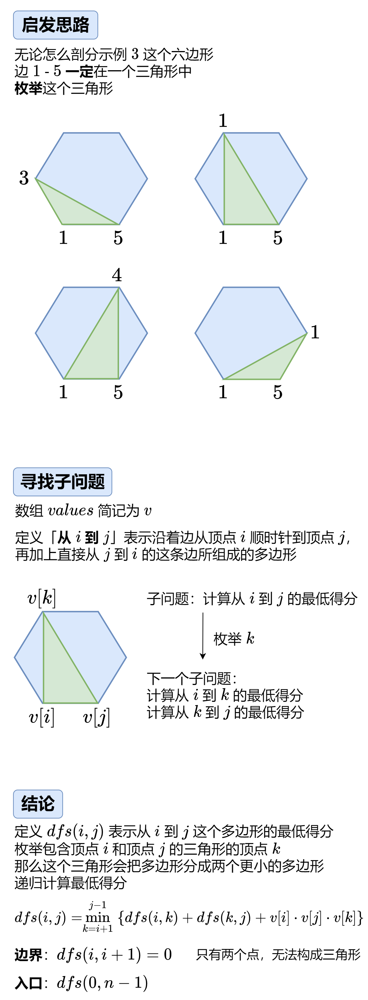
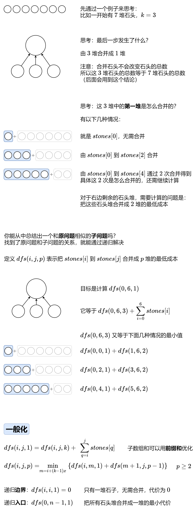
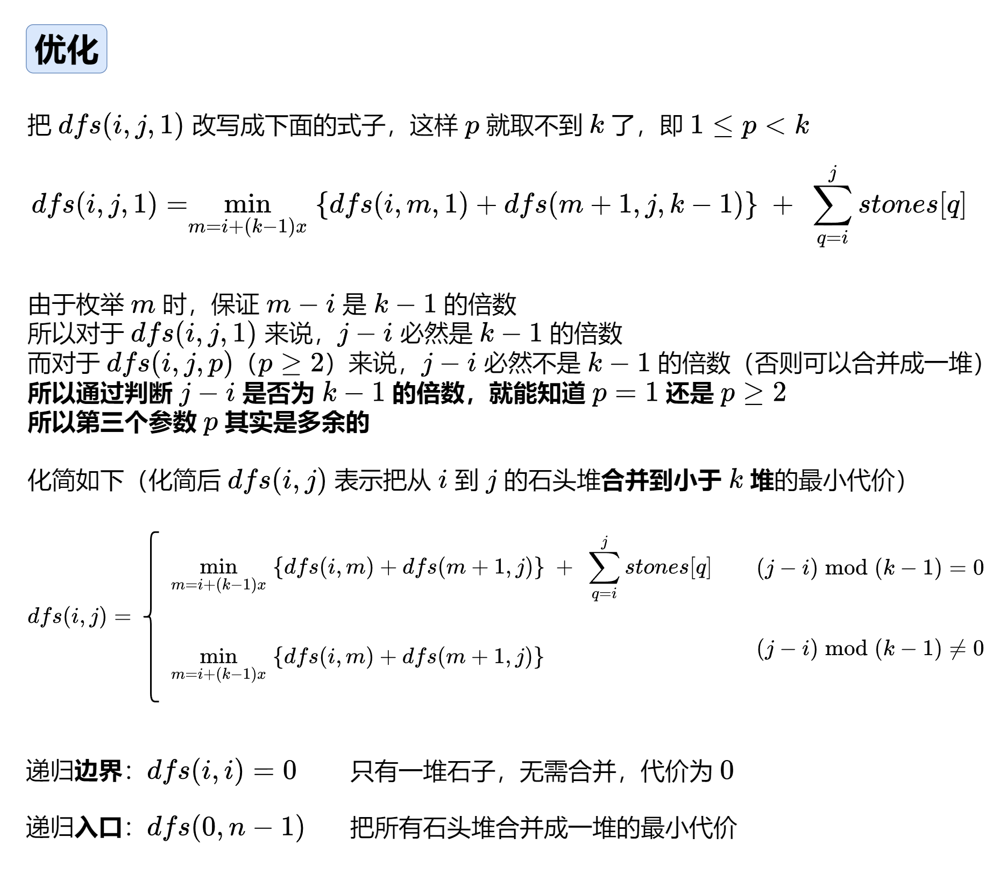

# 八、区间 DP

> 从数组的左右两端不断缩短，求解关于某段下标区间的最优值。
>
> 一般定义f(i, j)表示下标区间 [i, j] 的最优值。
>

139\. 单词拆分
----------

给你一个字符串 `s` 和一个字符串列表 `wordDict` 作为字典。如果可以利用字典中出现的一个或多个单词拼接出 `s` 则返回 `true`。

**注意：**不要求字典中出现的单词全部都使用，并且字典中的单词可以重复使用。

**示例 1：**

**输入:** s = "leetcode", wordDict = \["leet", "code"\]
**输出:** true
**解释:** 返回 true 因为 "leetcode" 可以由 "leet" 和 "code" 拼接成。

**示例 2：**

**输入:** s = "applepenapple", wordDict = \["apple", "pen"\]
**输出:** true
**解释:** 返回 true 因为 "applepenapple" 可以由 "apple" "pen" "apple" 拼接成。
     注意，你可以重复使用字典中的单词。

**示例 3：**

**输入:** s = "catsandog", wordDict = \["cats", "dog", "sand", "and", "cat"\]
**输出:** false

**提示：**

*   `1 <= s.length <= 300`
*   `1 <= wordDict.length <= 1000`
*   `1 <= wordDict[i].length <= 20`
*   `s` 和 `wordDict[i]` 仅由小写英文字母组成
*   `wordDict` 中的所有字符串 **互不相同**

[https://leetcode.cn/problems/word-break/description/](https://leetcode.cn/problems/word-break/description/)

```java
import java.util.List;

class Solution {
    public boolean wordBreak(String s, List<String> wordDict) {
        int n = s.length();
        boolean[] dp = new boolean[n + 1];
        dp[0] = true;
        for (int i = 0; i < n; i++) {
            for (String str : wordDict) {
                if (i + 1 >= str.length()) {
                    if (str.equals(s.substring(i - str.length() + 1, i + 1))) {
                        dp[i + 1] = dp[i + 1] | dp[i + 1 - str.length()];
                    }
                }
            }
        }
        return dp[n];
    }
}
```

# §8.1 最长回文子序列

​	

516. 最长回文子序列（板子：左右延展法 ）
-------------

给你一个字符串 `s` ，找出其中最长的回文子序列，并返回该序列的长度。

子序列定义为：不改变剩余字符顺序的情况下，删除某些字符或者不删除任何字符形成的一个序列。

**示例 1：**

**输入：**s = "bbbab"
**输出：**4
**解释：**一个可能的最长回文子序列为 "bbbb" 。

**示例 2：**

**输入：**s = "cbbd"
**输出：**2
**解释：**一个可能的最长回文子序列为 "bb" 。

**提示：**

*   `1 <= s.length <= 1000`
*   `s` 仅由小写英文字母组成

[https://leetcode.cn/problems/longest-palindromic-subsequence/description/](https://leetcode.cn/problems/longest-palindromic-subsequence/description/)

```java
import java.util.Arrays;

class Solution {
    int n;
    char[] chars;
    int[][] memo;
    public int longestPalindromeSubseq(String s) {
        chars = s.toCharArray();
        n = s.length();
        memo = new int[n][n];
        for (int i = 0; i < n; i++) {
            Arrays.fill(memo[i], -1);
        }
        return dfs(0, n - 1);
    }

    private int dfs(int i, int j) {
        if (i > j) {
            return 0; // 空串
        }
        if (i == j) {
            return 1; // 只有一个字母
        }
        if (memo[i][j] != -1) {
            return memo[i][j];
        }
        if (chars[i] == chars[j]) {
            return memo[i][j] = dfs(i + 1, j - 1) + 2;
        }
        // 不相等
        return memo[i][j] = Math.max(dfs(i + 1, j), dfs(i, j - 1));
    }
}
```

```java
// 修改成递推
class Solution {
    public int longestPalindromeSubseq(String s) {
        int n = s.length();
        int[][] dp = new int[n][n];
        for (int i = n - 1; i >= 0; i--) {
            dp[i][i] = 1;
            for (int j = i + 1; j < n; j++) {
                if (s.charAt(i) == s.charAt(j)) {
                    dp[i][j] = dp[i + 1][j - 1] + 2;
                }else{
                    dp[i][j] = Math.max(dp[i + 1][j], dp[i][j - 1]);
                }
            }
        }
        return dp[0][n - 1];
    }
}
```

730\. 统计不同回文子序列（板子：左右延展法 ）
---------------

给你一个字符串 `s` ，返回 `s` 中不同的非空回文子序列个数 。由于答案可能很大，请返回对 `109 + 7` **取余** 的结果。

字符串的子序列可以经由字符串删除 0 个或多个字符获得。

如果一个序列与它反转后的序列一致，那么它是回文序列。

如果存在某个 `i` , 满足 `ai != bi` ，则两个序列 `a1, a2, ...` 和 `b1, b2, ...` 不同。

**示例 1：**

**输入：**s = 'bccb'
**输出：**6
**解释：**6 个不同的非空回文子字符序列分别为：'b', 'c', 'bb', 'cc', 'bcb', 'bccb'。
注意：'bcb' 虽然出现两次但仅计数一次。

**示例 2：**

**输入：**s = 'abcdabcdabcdabcdabcdabcdabcdabcddcbadcbadcbadcbadcbadcbadcbadcba'
**输出：**104860361
**解释：**共有 3104860382 个不同的非空回文子序列，104860361 是对 109 + 7 取余后的值。

**提示：**

*   `1 <= s.length <= 1000`
*   `s[i]` 仅包含 `'a'`, `'b'`, `'c'` 或 `'d'` 

[https://leetcode.cn/problems/count-different-palindromic-subsequences/description/](https://leetcode.cn/problems/count-different-palindromic-subsequences/description/)

```java
import java.util.Arrays;

class Solution { // 左右延展法
    private static long Mod = (long) 1e9 + 7;
    public int countPalindromicSubsequences(String s) {
        // 定义 f[i][j] 为考虑字符串 s 中的 [i,j] 范围内回文子序列的个数
        char[] cs = s.toCharArray();
        int n = s.length();
        long[][] dp = new long[n][n];
        int[] L = new int[4], R = new int[4];
        Arrays.fill(L, -1);
        for (int i = n - 1; i >= 0; i--) {
            L[cs[i] - 'a'] = i; // 左边
            Arrays.fill(R, -1); // 细节
            for (int j = i; j < n; j++) {
                R[cs[j] - 'a'] = j;
                for (int k = 0; k < 4; k++) {
                    if (L[k] == -1 || R[k] == -1) {
                        continue;
                    }
                    int l = L[k], r = R[k];
                    if (l == r) {
                        dp[i][j] = (dp[i][j] + 1) % Mod;
                    } else if (l + 1 == r) {
                        dp[i][j] = (dp[i][j] + 2) % Mod;
                    }else{
                        dp[i][j] = (dp[i][j] + dp[l + 1][r - 1] + 2) % Mod;
                    }
                }
            }
        }
        return (int) dp[0][n - 1];
    }
}
```

1312\. 让字符串成为回文串的最少插入次数
-----------------------

给你一个字符串 `s` ，每一次操作你都可以在字符串的任意位置插入任意字符。

请你返回让 `s` 成为回文串的 **最少操作次数** 。

「回文串」是正读和反读都相同的字符串。

**示例 1：**

**输入：**s = "zzazz"
**输出：**0
**解释：**字符串 "zzazz" 已经是回文串了，所以不需要做任何插入操作。

**示例 2：**

**输入：**s = "mbadm"
**输出：**2
**解释：**字符串可变为 "mbdadbm" 或者 "mdbabdm" 。

**示例 3：**

**输入：**s = "leetcode"
**输出：**5
**解释：**插入 5 个字符后字符串变为 "leetcodocteel" 。

**提示：**

*   `1 <= s.length <= 500`
*   `s` 中所有字符都是小写字母。

[https://leetcode.cn/problems/minimum-insertion-steps-to-make-a-string-palindrome/description/](https://leetcode.cn/problems/minimum-insertion-steps-to-make-a-string-palindrome/description/)

```java
class Solution {
    public int minInsertions(String s) {
        int n = s.length();
        int[][] dp = new int[n][n];
        for (int i = n - 1; i >= 0; i--) {
            dp[i][i] = 1;
            for (int j = i + 1; j < n; j++) {
                if (s.charAt(i) == s.charAt(j)) {
                    dp[i][j] = dp[i + 1][j - 1] + 2;
                }else{
                    dp[i][j] = Math.max(dp[i + 1][j], dp[i][j - 1]);
                }
            }
        }
        return n - dp[0][n - 1]; // 字符串长度 - 最长回文串的长度
    }
}
```

1771\. 由子序列构造的最长回文串的长度
----------------------

给你两个字符串 `word1` 和 `word2` ，请你按下述方法构造一个字符串：

*   从 `word1` 中选出某个 **非空** 子序列 `subsequence1` 。
*   从 `word2` 中选出某个 **非空** 子序列 `subsequence2` 。
*   连接两个子序列 `subsequence1 + subsequence2` ，得到字符串。

返回可按上述方法构造的最长 **回文串** 的 **长度** 。如果无法构造回文串，返回 `0` 。

字符串 `s` 的一个 **子序列** 是通过从 `s` 中删除一些（也可能不删除）字符而不更改其余字符的顺序生成的字符串。

**回文串** 是正着读和反着读结果一致的字符串。

**示例 1：**

**输入：**word1 = "cacb", word2 = "cbba"
**输出：**5
**解释：**从 word1 中选出 "ab" ，从 word2 中选出 "cba" ，得到回文串 "abcba" 。

**示例 2：**

**输入：**word1 = "ab", word2 = "ab"
**输出：**3
**解释：**从 word1 中选出 "ab" ，从 word2 中选出 "a" ，得到回文串 "aba" 。

**示例 3：**

**输入：**word1 = "aa", word2 = "bb"
**输出：**0
**解释：**无法按题面所述方法构造回文串，所以返回 0 。

**提示：**

*   `1 <= word1.length, word2.length <= 1000`
*   `word1` 和 `word2` 由小写英文字母组成

[https://leetcode.cn/problems/maximize-palindrome-length-from-subsequences/description/](https://leetcode.cn/problems/maximize-palindrome-length-from-subsequences/description/)

```java
class Solution {
    public int longestPalindrome(String word1, String word2) {
        String s = word1 + word2;
        int n = s.length();
        int[][] dp = new int[n][n];
        int ans = 0;
        for (int i = n - 1; i >= 0; i--) {
            dp[i][i] = 1;
            for (int j = i + 1; j < n; j++) {
                if (s.charAt(i) == s.charAt(j)) {
                    dp[i][j] = dp[i + 1][j - 1] + 2;
                    if (i < word1.length() && j >= word1.length()) {
                        ans = Math.max(ans, dp[i][j]);
                    }
                }else{
                    dp[i][j] = Math.max(dp[i + 1][j], dp[i][j - 1]);
                }
            }
        }
        return ans;
    }

}
```

# §8.2 其他区间 DP

5\. 最长回文子串
----------

给你一个字符串 `s`，找到 `s` 中最长的回文子串。

**示例 1：**

**输入：**s = "babad"
**输出：**"bab"
**解释：**"aba" 同样是符合题意的答案。

**示例 2：**

**输入：**s = "cbbd"
**输出：**"bb"

**提示：**

*   `1 <= s.length <= 1000`
*   `s` 仅由数字和英文字母组成

[https://leetcode.cn/problems/longest-palindromic-substring/description/](https://leetcode.cn/problems/longest-palindromic-substring/description/)

```java
class Solution {
    public String longestPalindrome(String s) { // 中心扩展法
        int n = s.length();
        boolean[][] dp = new boolean[n][n];
        String ans = String.valueOf(s.charAt(0));
        for (int i = n - 1; i >= 0; i--) {
            for (int j = i; j < n; j++) {
                if (s.charAt(i) == s.charAt(j) && (j - i <= 1 || dp[i + 1][j - 1])) {
                    dp[i][j] = true;
                    String t = s.substring(i, j + 1);
                    if (t.length() > ans.length()) {
                        ans = t;
                    }
                }
            }
        }
        return ans;
    }
}
```


## 3040\. 相同分数的最大操作数目 II

给你一个整数数组 `nums` ，如果 `nums` **至少** 包含 `2` 个元素，你可以执行以下操作中的 **任意** 一个：

- 选择 `nums` 中最前面两个元素并且删除它们。
- 选择 `nums` 中最后两个元素并且删除它们。
- 选择 `nums` 中第一个和最后一个元素并且删除它们。

一次操作的 **分数** 是被删除元素的和。

在确保 **所有操作分数相同** 的前提下，请你求出 **最多** 能进行多少次操作。

请你返回按照上述要求 **最多** 可以进行的操作次数。

**示例 1：**

**输入：**nums = \[3,2,1,2,3,4\]
**输出：**3
**解释：**我们执行以下操作：

- 删除前两个元素，分数为 3 + 2 = 5 ，nums = \[1,2,3,4\] 。
- 删除第一个元素和最后一个元素，分数为 1 + 4 = 5 ，nums = \[2,3\] 。
- 删除第一个元素和最后一个元素，分数为 2 + 3 = 5 ，nums = \[\] 。
  由于 nums 为空，我们无法继续进行任何操作。

**示例 2：**

**输入：**nums = \[3,2,6,1,4\]
**输出：**2
**解释：**我们执行以下操作：

- 删除前两个元素，分数为 3 + 2 = 5 ，nums = \[6,1,4\] 。
- 删除最后两个元素，分数为 1 + 4 = 5 ，nums = \[6\] 。
  至多进行 2 次操作。

**提示：**

- `2 <= nums.length <= 2000`
- `1 <= nums[i] <= 1000`

[https://leetcode.cn/problems/maximum-number-of-operations-with-the-same-score-ii/description/](https://leetcode.cn/problems/maximum-number-of-operations-with-the-same-score-ii/description/)

```java
private int[] nums;
    private int[][] memo;
    @Override
    public int maxOperations(int[] nums) {
        int n = nums.length;
        this.nums = nums;
        memo = new int[n][n];
        int res1 = helper(2, n - 1, nums[0] + nums[1]); // 最前面两个
        int res2 = helper(0, n - 3, nums[n - 2] + nums[n - 1]); // 最后两个
        int res3 = helper(1, n - 2, nums[0] + nums[n - 1]); // 第一个和最后一个
        return Math.max(Math.max(res1, res2), res3) + 1; // 加上第一次操作
    }
    private int helper(int i, int j, int target) {
        for (int[] row : memo) {
            Arrays.fill(row, -1);
        }
        return dfs(i, j, target);
    }
    private int dfs(int i, int j, int target) {
        if (i >= j) {
            return 0;
        }
        if (memo[i][j] != -1) {
            return memo[i][j];
        }
        int res = 0;
        if (nums[i] + nums[i + 1] == target) {
            res = Math.max(res, dfs(i + 2, j, target) + 1);
        }
        if (nums[j - 1] + nums[j] == target) {
            res = Math.max(res, dfs(i, j - 2, target) + 1);
        }
        if (nums[i] + nums[j] == target) {
            res = Math.max(res, dfs(i + 1, j - 1, target) + 1);
        }
        return memo[i][j] = res;
    }

```

## 375\. 猜数字大小 II

我们正在玩一个猜数游戏，游戏规则如下：

1.  我从 `1` 到 `n` 之间选择一个数字。
2.  你来猜我选了哪个数字。
3.  如果你猜到正确的数字，就会 **赢得游戏** 。
4.  如果你猜错了，那么我会告诉你，我选的数字比你的 **更大或者更小** ，并且你需要继续猜数。
5.  每当你猜了数字 `x` 并且猜错了的时候，你需要支付金额为 `x` 的现金。如果你花光了钱，就会 **输掉游戏** 。

给你一个特定的数字 `n` ，返回能够 **确保你获胜** 的最小现金数，**不管我选择那个数字** 。

**示例 1：**


**输入：**n = 10
**输出：**16
**解释：**制胜策略如下：
- 数字范围是 \[1,10\] 。你先猜测数字为 7 。
    - 如果这是我选中的数字，你的总费用为 $0 。否则，你需要支付 $7 。
    - 如果我的数字更大，则下一步需要猜测的数字范围是 \[8,10\] 。你可以猜测数字为 9 。
        - 如果这是我选中的数字，你的总费用为 $7 。否则，你需要支付 $9 。
        - 如果我的数字更大，那么这个数字一定是 10 。你猜测数字为 10 并赢得游戏，总费用为 $7 + $9 = $16 。
        - 如果我的数字更小，那么这个数字一定是 8 。你猜测数字为 8 并赢得游戏，总费用为 $7 + $9 = $16 。
    - 如果我的数字更小，则下一步需要猜测的数字范围是 \[1,6\] 。你可以猜测数字为 3 。
        - 如果这是我选中的数字，你的总费用为 $7 。否则，你需要支付 $3 。
        - 如果我的数字更大，则下一步需要猜测的数字范围是 \[4,6\] 。你可以猜测数字为 5 。
            - 如果这是我选中的数字，你的总费用为 $7 + $3 = $10 。否则，你需要支付 $5 。
            - 如果我的数字更大，那么这个数字一定是 6 。你猜测数字为 6 并赢得游戏，总费用为 $7 + $3 + $5 = $15 。
            - 如果我的数字更小，那么这个数字一定是 4 。你猜测数字为 4 并赢得游戏，总费用为 $7 + $3 + $5 = $15 。
        - 如果我的数字更小，则下一步需要猜测的数字范围是 \[1,2\] 。你可以猜测数字为 1 。
            - 如果这是我选中的数字，你的总费用为 $7 + $3 = $10 。否则，你需要支付 $1 。
            - 如果我的数字更大，那么这个数字一定是 2 。你猜测数字为 2 并赢得游戏，总费用为 $7 + $3 + $1 = $11 。
        在最糟糕的情况下，你需要支付 $16 。因此，你只需要 $16 就可以确保自己赢得游戏。

**示例 2：**

**输入：**n = 1
**输出：**0
**解释：**只有一个可能的数字，所以你可以直接猜 1 并赢得游戏，无需支付任何费用。

**示例 3：**

**输入：**n = 2
**输出：**1
**解释：**有两个可能的数字 1 和 2 。
- 你可以先猜 1 。
    - 如果这是我选中的数字，你的总费用为 $0 。否则，你需要支付 $1 。
    - 如果我的数字更大，那么这个数字一定是 2 。你猜测数字为 2 并赢得游戏，总费用为 $1 。
    最糟糕的情况下，你需要支付 $1 。

**提示：**

*   `1 <= n <= 200`

[https://leetcode.cn/problems/guess-number-higher-or-lower-ii/description/](https://leetcode.cn/problems/guess-number-higher-or-lower-ii/description/)

```java
import java.util.Arrays;

class Solution { // 我们可决策的部分为「选择猜哪个数 x」，而不可决策的是「选择某个数 x 之后（假设没有猜中），真实值会落在哪边」。
    long[][] memo;
    public int getMoneyAmount(int n) {
        memo = new long[n + 1][n + 1];
        for (int i = 0; i < n; i++) {
            Arrays.fill(memo[i], -1);
        }
        return (int) dfs(1, n);
    }

    private long dfs(int i, int j) { // 表示(i, j)的最大cost
        if (i >= j) {
            return 0;
        }
        if (memo[i][j] != -1) {
            return memo[i][j];
        }
        long res = Long.MAX_VALUE;
        for (int x = i; x <= j; x++) {
            res = Math.min(res, Math.max(dfs(i, x - 1), dfs(x + 1, j)) + x);
        }
        return memo[i][j] = res;
    }
}
```

```java
class Solution {
    public int getMoneyAmount(int n) {
        int[][] f = new int[n + 1][n + 1];
        for (int i = n - 1; i >= 1; i--) {
            for (int j = i + 1; j <= n; j++) {
                f[i][j] = j + f[i][j - 1];
                for (int k = i; k < j; k++) {
                    f[i][j] = Math.min(f[i][j], k + Math.max(f[i][k - 1], f[k + 1][j]));
                }
            }
        }
        return f[1][n];
    }
}

```

1130\. 叶值的最小代价生成树（考察对二叉树中序的理解）
-----------------

给你一个正整数数组 `arr`，考虑所有满足以下条件的二叉树：

*   每个节点都有 `0` 个或是 `2` 个子节点。
*   数组 `arr` 中的值与树的中序遍历中每个叶节点的值一一对应。
*   每个非叶节点的值等于其左子树和右子树中叶节点的最大值的乘积。

在所有这样的二叉树中，返回每个非叶节点的值的最小可能总和。这个和的值是一个 32 位整数。

如果一个节点有 0 个子节点，那么该节点为叶节点。

**示例 1：**


**输入：**arr = \[6,2,4\]
**输出：**32
**解释：**有两种可能的树，第一种的非叶节点的总和为 36 ，第二种非叶节点的总和为 32 。 

**示例 2：**


**输入：**arr = \[4,11\]
**输出：**44

**提示：**

*   `2 <= arr.length <= 40`
*   `1 <= arr[i] <= 15`
*   答案保证是一个 32 位带符号整数，即小于 `231` 。

[https://leetcode.cn/problems/minimum-cost-tree-from-leaf-values/description/](https://leetcode.cn/problems/minimum-cost-tree-from-leaf-values/description/)

```java
import java.util.Arrays;

class Solution {
    public int mctFromLeafValues(int[] nums) { // 利用中序的特点
        int n = nums.length;
        int[][] g = new int[n][n]; // 表示下标[i,j]的最大值
        int[][] dp = new int[n][n]; // 表示[i,j]的最小代价树
        for (int i = n - 1; i >= 0; i--) {
            g[i][i] = nums[i];
            for (int j = i + 1; j < n; j++) {
                g[i][j] = Math.max(g[i][j - 1], nums[j]);
            }
        }
        for (int i = 0; i < n; i++) {
            Arrays.fill(dp[i], Integer.MAX_VALUE / 2);
        }
        for (int i = n - 1; i >= 0; i--) {
            dp[i][i] = 0;
            for (int j = i + 1; j < n; j++) {
                // 枚举中点k的位置
                for (int k = i; k < j; k++) {
                    dp[i][j] = Math.min(dp[i][j], dp[i][k] + dp[k + 1][j] + g[i][k] * g[k + 1][j]);
                }
            }
        }
        return dp[0][n - 1];
    }
}
```

1770\. 执行乘法运算的最大分数
------------------

给你两个长度分别 `n` 和 `m` 的整数数组 `nums` 和 `multipliers` ，其中 `n >= m` ，数组下标 **从 1 开始** 计数。

初始时，你的分数为 `0` 。你需要执行恰好 `m` 步操作。在第 `i` 步操作（**从 1 开始** 计数）中，需要：

*   选择数组 `nums` **开头处或者末尾处** 的整数 `x` 。
*   你获得 `multipliers[i] * x` 分，并累加到你的分数中。
*   将 `x` 从数组 `nums` 中移除。

在执行 `m` 步操作后，返回 **最大** 分数_。_

**示例 1：**

**输入：**nums = \[1,2,3\], multipliers = \[3,2,1\]
**输出：**14
**解释：**一种最优解决方案如下：
- 选择末尾处的整数 3 ，\[1,2,**3**\] ，得 3 \* 3 = 9 分，累加到分数中。
- 选择末尾处的整数 2 ，\[1,**2**\] ，得 2 \* 2 = 4 分，累加到分数中。
- 选择末尾处的整数 1 ，\[**1**\] ，得 1 \* 1 = 1 分，累加到分数中。
  总分数为 9 + 4 + 1 = 14 。

**示例 2：**

**输入：**nums = \[-5,-3,-3,-2,7,1\], multipliers = \[-10,-5,3,4,6\]
**输出：**102
**解释：**一种最优解决方案如下：
- 选择开头处的整数 -5 ，\[**\-5**,-3,-3,-2,7,1\] ，得 -5 \* -10 = 50 分，累加到分数中。
- 选择开头处的整数 -3 ，\[**\-3**,-3,-2,7,1\] ，得 -3 \* -5 = 15 分，累加到分数中。
- 选择开头处的整数 -3 ，\[**\-3**,-2,7,1\] ，得 -3 \* 3 = -9 分，累加到分数中。
- 选择末尾处的整数 1 ，\[-2,7,**1**\] ，得 1 \* 4 = 4 分，累加到分数中。
- 选择末尾处的整数 7 ，\[-2,**7**\] ，得 7 \* 6 = 42 分，累加到分数中。
  总分数为 50 + 15 - 9 + 4 + 42 = 102 。

**提示：**

*   `n == nums.length`
*   `m == multipliers.length`
*   `1 <= m <= 103`
*   `m <= n <= 105`
*   `-1000 <= nums[i], multipliers[i] <= 1000`

[https://leetcode.cn/problems/maximum-score-from-performing-multiplication-operations/description/](https://leetcode.cn/problems/maximum-score-from-performing-multiplication-operations/description/)

```java
import java.util.Arrays;

class Solution { // 暴力超时，
    int n,m;
    int[] nums, multipliers;
    int[][][] memo;
    public int maximumScore(int[] nums, int[] multipliers) {
        n = nums.length;
        m = multipliers.length;
        this.nums = nums;
        this.multipliers = multipliers;
        memo = new int[n][n][m];
        for (int i = 0; i < n; i++) {
            for (int j = 0; j < n; j++) {
                Arrays.fill(memo[i][j], -1);
            }
        }
        return dfs(0, n - 1, 0);
    }

    private int dfs(int left, int right, int i) {
        if (i == m || left > right) {
            return 0;
        }
        if (memo[left][right][i] != -1) {
            return memo[left][right][i];
        }
        int res = Math.max(dfs(left + 1, right, i + 1) + multipliers[i] * nums[left], dfs(left, right - 1, i + 1) + multipliers[i] * nums[right]);
        return memo[left][right][i] = res;
    }
}
```

```java
import java.util.Arrays;

class Solution { // 发现可以少一个参数，优化，不过还是超内存
    int n,m;
    int[] nums, multipliers;
    int[][] memo;
    public int maximumScore(int[] nums, int[] multipliers) {
        n = nums.length;
        m = multipliers.length;
        this.nums = nums;
        this.multipliers = multipliers;
        memo = new int[n][n];
        for (int i = 0; i < n; i++) {
            Arrays.fill(memo[i], -1);
        }
        return dfs(0, n - 1, 0);
    }

    private int dfs(int left, int right, int i) {
        if (i == m || left > right) {
            return 0;
        }
        if (memo[left][right] != -1) {
            return memo[left][right];
        }
        int res = Math.max(dfs(left + 1, right, i + 1) + multipliers[i] * nums[left], dfs(left, right - 1, i + 1) + multipliers[i] * nums[right]);
        return memo[left][right] = res;
    }
}
```

```java
// 究极优化，由于m << n
import java.util.Arrays;

class Solution {
    int n,m;
    int[] nums, multipliers;
    int[][] memo;
    public int maximumScore(int[] nums, int[] multipliers) {
        n = nums.length;
        m = multipliers.length;
        this.nums = nums;
        this.multipliers = multipliers;
        memo = new int[m][m];
        for (int i = 0; i < m; i++) {
            Arrays.fill(memo[i], Integer.MAX_VALUE);
        }
        return dfs(0, n - 1, 0);
    }

    private int dfs(int left, int right, int i) {
        if (i == m) {
            return 0;
        }
        if (memo[i][left] != Integer.MAX_VALUE) {
            return memo[i][left];
        }
        int res = Math.max(dfs(left + 1, right, i + 1) + multipliers[i] * nums[left], dfs(left, right - 1, i + 1) + multipliers[i] * nums[right]);
        return memo[i][left] = res;
    }
}
```

1547\. 切棍子的最小成本
---------------

有一根长度为 `n` 个单位的木棍，棍上从 `0` 到 `n` 标记了若干位置。例如，长度为 **6** 的棍子可以标记如下：


给你一个整数数组 `cuts` ，其中 `cuts[i]` 表示你需要将棍子切开的位置。

你可以按顺序完成切割，也可以根据需要更改切割的顺序。

每次切割的成本都是当前要切割的棍子的长度，切棍子的总成本是历次切割成本的总和。对棍子进行切割将会把一根木棍分成两根较小的木棍（这两根木棍的长度和就是切割前木棍的长度）。请参阅第一个示例以获得更直观的解释。

返回切棍子的 **最小总成本** 。

**示例 1：**


**输入：**n = 7, cuts = \[1,3,4,5\]
**输出：**16
**解释：**按 \[1, 3, 4, 5\] 的顺序切割的情况如下所示：

第一次切割长度为 7 的棍子，成本为 7 。第二次切割长度为 6 的棍子（即第一次切割得到的第二根棍子），第三次切割为长度 4 的棍子，最后切割长度为 3 的棍子。总成本为 7 + 6 + 4 + 3 = 20 。
而将切割顺序重新排列为 \[3, 5, 1, 4\] 后，总成本 = 16（如示例图中 7 + 4 + 3 + 2 = 16）。

**示例 2：**

**输入：**n = 9, cuts = \[5,6,1,4,2\]
**输出：**22
**解释：**如果按给定的顺序切割，则总成本为 25 。总成本 <= 25 的切割顺序很多，例如，\[4, 6, 5, 2, 1\] 的总成本 = 22，是所有可能方案中成本最小的。

**提示：**

*   `2 <= n <= 10^6`
*   `1 <= cuts.length <= min(n - 1, 100)`
*   `1 <= cuts[i] <= n - 1`
*   `cuts` 数组中的所有整数都 **互不相同**

[https://leetcode.cn/problems/minimum-cost-to-cut-a-stick/description/](https://leetcode.cn/problems/minimum-cost-to-cut-a-stick/description/)

```java
// 超时的答案
import java.util.Arrays;

class Solution {
    public int minCost(int n, int[] cuts) {
        // dp[i][j] = dp[i][k] + dp[k][j] + (j - i);
        int[][] dp = new int[n + 1][n + 1];
        for (int i = n; i >= 0; i--) { // dp[i][i] = 0
            for (int j = i + 1; j <= n; j++) {
                int mn = Integer.MAX_VALUE / 2;
                for (int k : cuts) {
                    if (i < k && k < j) {
                        mn = Math.min(mn, dp[i][k] + dp[k][j] + j - i);
                    }
                }
                dp[i][j] = (mn == Integer.MAX_VALUE / 2 ? 0 : mn); // 如果没有切分则没有成本, 所以不能取mn
            }
        }
        return dp[0][n];
    }
}
```

> 我们发现上面超时的答案有大量的没有在切割段的片段

```java
import java.util.Arrays;

class Solution {
    public int minCost(int n, int[] cuts) {
        int m = cuts.length;
        Arrays.sort(cuts);
        int[] list = new int[m + 2];
        list[0] = 0;
        list[m + 1] = n;
        // 生成新的木棍只包含切点和两个端点
        for (int i = 0; i < m; i++) {
            list[i + 1] = cuts[i];
        }
        int[][] dp = new int[m + 2][m + 2];
        for (int i = m; i >= 0; i--) {
            for (int j = i + 1; j <= m + 1; j++) { // 第m+1个点就是点n
                int mn = Integer.MAX_VALUE / 2;
                for (int k = i + 1; k < j; k++) {
                    mn = Math.min(mn, dp[i][k] + dp[k][j] + list[j] - list[i]);
                }
                dp[i][j] = (mn == Integer.MAX_VALUE / 2 ? 0 : mn);
            }
        }
        return dp[0][m + 1];
    }
}
```

1039\. 多边形三角剖分的最低得分
-------------------

你有一个凸的 `n` 边形，其每个顶点都有一个整数值。给定一个整数数组 `values` ，其中 `values[i]` 是第 `i` 个顶点的值（即 **顺时针顺序** ）。

假设将多边形 **剖分** 为 `n - 2` 个三角形。对于每个三角形，该三角形的值是顶点标记的**乘积**，三角剖分的分数是进行三角剖分后所有 `n - 2` 个三角形的值之和。

返回 _多边形进行三角剖分后可以得到的最低分_ 。  


**示例 1：**


**输入：**values = \[1,2,3\]
**输出：**6
**解释：**多边形已经三角化，唯一三角形的分数为 6。

**示例 2：**


**输入：**values = \[3,7,4,5\]
**输出：**144
**解释：**有两种三角剖分，可能得分分别为：3\*7\*5 + 4\*5\*7 = 245，或 3\*4\*5 + 3\*4\*7 = 144。最低分数为 144。

**示例 3：**


**输入：**values = \[1,3,1,4,1,5\]
**输出：**13
**解释：**最低分数三角剖分的得分情况为 1\*1\*3 + 1\*1\*4 + 1\*1\*5 + 1\*1\*1 = 13。

**提示：**

*   `n == values.length`
*   `3 <= n <= 50`
*   `1 <= values[i] <= 100`

[https://leetcode.cn/problems/minimum-score-triangulation-of-polygon/description/](https://leetcode.cn/problems/minimum-score-triangulation-of-polygon/description/)

 

```java
class Solution {
    public int minScoreTriangulation(int[] values) { // 太漂亮了！
        int n = values.length;
        int[][] dp = new int[n][n];
        for (int i = n - 3; i >= 0; i--) {
            for (int j = i + 2; j < n; j++) {
                dp[i][j] = Integer.MAX_VALUE;
                for (int k = i + 1; k < j; k++) {
                    dp[i][j] = Math.min(dp[i][j], dp[i][k] + dp[k][j] + values[i] * values[k] * values[j]);
                }
            }
        }
        return dp[0][n - 1];
    }
}
```

```java
import java.util.Arrays;

class Solution {
    private int[][] memo;
    private int[] v;
    int n;
    public int minScoreTriangulation(int[] values) {
        v = values;
        n = v.length;
        memo = new int[n][n];
        for (int i = 0; i < n; i++) {
            Arrays.fill(memo[i], -1);
        }
        return dfs(0, n - 1);
    }

    private int dfs(int i, int j) {
        if (i + 1 == j) { // 只有两个点，无法构成三角形
            return 0;
        }
        if (memo[i][j] != -1) {
            return memo[i][j];
        }
        int res = Integer.MAX_VALUE;
        for (int k = i + 1; k < j; k++) { // 枚举顶点 k
            res = Math.min(res, dfs(i, k) + dfs(k, j) + v[i] * v[j] * v[k]);
        }
        return memo[i][j] = res;
    }
}
```

546\. 移除盒子（史诗级难题3000+）（感觉遇到过很多类似的题目，模板题）
----------

给出一些不同颜色的盒子 `boxes` ，盒子的颜色由不同的正数表示。

你将经过若干轮操作去去掉盒子，直到所有的盒子都去掉为止。每一轮你可以移除具有相同颜色的连续 `k` 个盒子（`k >= 1`），这样一轮之后你将得到 `k * k` 个积分。

返回 _你能获得的最大积分和_ 。

**示例 1：**

**输入：**boxes = \[1,3,2,2,2,3,4,3,1\]
**输出：**23
**解释：**
\[1, 3, 2, 2, 2, 3, 4, 3, 1\] 
----> \[1, 3, 3, 4, 3, 1\] (3\*3=9 分) 
----> \[1, 3, 3, 3, 1\] (1\*1=1 分) 
----> \[1, 1\] (3\*3=9 分) 
----> \[\] (2\*2=4 分)

**示例 2：**

**输入：**boxes = \[1,1,1\]
**输出：**9

**示例 3：**

**输入：**boxes = \[1\]
**输出：**1

**提示：**

*   `1 <= boxes.length <= 100`
*   `1 <= boxes[i] <= 100`

[https://leetcode.cn/problems/remove-boxes/description/](https://leetcode.cn/problems/remove-boxes/description/)

```java
class Solution {
    // 时间复杂度O(n^4)
	public static int removeBoxes(int[] boxes) {
		int n = boxes.length;
		int[][][] dp = new int[n][n][n];
		return f(boxes, 0, n - 1, 0, dp);
	}

	// boxes[l....r]范围上要去消除，前面跟着k个连续的和boxes[l]颜色一样的盒子
	// 这种情况下，返回最大得分
	public static int f(int[] boxes, int l, int r, int k, int[][][] dp) {
		if (l > r) {
			return 0;
		}
		// l <= r
		if (dp[l][r][k] > 0) {
			return dp[l][r][k];
		}
		int s = l;
		while (s + 1 <= r && boxes[l] == boxes[s + 1]) {
			s++;
		}
		// boxes[l...s]都是一种颜色，boxes[s+1]就不是同一种颜色了
		// cnt是总前缀数量 : 之前的相同前缀(k个) + l...s这个颜色相同的部分(s-l+1个)
		int cnt = k + s - l + 1;
		// 可能性1 : 前缀先消
		int ans = cnt * cnt + f(boxes, s + 1, r, 0, dp);
		// 可能性2 : 讨论前缀跟着哪个后，一起消掉
		for (int m = s + 2; m <= r; m++) {
			if (boxes[l] == boxes[m] && boxes[m - 1] != boxes[m]) {
				// boxes[l] == boxes[m]是必须条件
				// boxes[m - 1] != boxes[m]是剪枝条件，避免不必要的调用
				ans = Math.max(ans, f(boxes, s + 1, m - 1, 0, dp) + f(boxes, m, r, cnt, dp));
			}
		}
		dp[l][r][k] = ans;
		return ans;
	}
}
```

1000\. 合并石头的最低成本
----------------

有 `n` 堆石头排成一排，第 `i` 堆中有 `stones[i]` 块石头。

每次 **移动** 需要将 **连续的** `k` 堆石头合并为一堆，而这次移动的成本为这 `k` 堆中石头的总数。

返回把所有石头合并成一堆的最低成本。如果无法合并成一堆，返回 `-1` 。

**示例 1：**

**输入：**stones = \[3,2,4,1\], K = 2
**输出：**20
**解释：**
从 \[3, 2, 4, 1\] 开始。
合并 \[3, 2\]，成本为 5，剩下 \[5, 4, 1\]。
合并 \[4, 1\]，成本为 5，剩下 \[5, 5\]。
合并 \[5, 5\]，成本为 10，剩下 \[10\]。
总成本 20，这是可能的最小值。

**示例 2：**

**输入：**stones = \[3,2,4,1\], K = 3
**输出：**\-1
**解释：**任何合并操作后，都会剩下 2 堆，我们无法再进行合并。所以这项任务是不可能完成的。.

**示例 3：**

**输入：**stones = \[3,5,1,2,6\], K = 3
**输出：**25
**解释：**
从 \[3, 5, 1, 2, 6\] 开始。
合并 \[5, 1, 2\]，成本为 8，剩下 \[3, 8, 6\]。
合并 \[3, 8, 6\]，成本为 17，剩下 \[17\]。
总成本 25，这是可能的最小值。

**提示：**

*   `n == stones.length`
*   `1 <= n <= 30`
*   `1 <= stones[i] <= 100`
*   `2 <= k <= 30`

[https://leetcode.cn/problems/minimum-cost-to-merge-stones/description/](https://leetcode.cn/problems/minimum-cost-to-merge-stones/description/)

 

```java
class Solution {
    int[][][] memo;
    int[] prefixSum;
    int k;
    public int mergeStones(int[] stones, int k) {
        int n = stones.length;
        this.k = k;
        memo = new int[n][n][k + 1];
        if ((n - 1) % (k - 1) > 0) { // 无法合成一堆
            return -1;
        }
        prefixSum = new int[n + 1];
        for (int i = 0; i < n; i++) {
            prefixSum[i + 1] = prefixSum[i] + stones[i];
        }
        return dfs(0, n - 1, 1);
    }

    private int dfs(int i, int j, int p) {
        if (memo[i][j][p] > 0) {
            return memo[i][j][p];
        }
        if (p == 1) { // 合成一个
            return memo[i][j][p] = i == j ? 0 : dfs(i, j, k) + prefixSum[j + 1] - prefixSum[i];
        }
        int res = Integer.MAX_VALUE;
        for (int m = i; m < j; m += k - 1) { // 枚举哪些石头堆合并成第一堆
            res = Math.min(res, dfs(i, m, 1) + dfs(m + 1, j, p - 1));
        }
        return memo[i][j][p] = res;
    }
}
```

 

```java
class Solution {
    private int[][] memo;
    private int[] s;
    private int k;

    public int mergeStones(int[] stones, int k) {
        int n = stones.length;
        if ((n - 1) % (k - 1) > 0) // 无法合并成一堆
            return -1;

        s = new int[n + 1];
        for (int i = 0; i < n; i++)
            s[i + 1] = s[i] + stones[i]; // 前缀和
        this.k = k;
        memo = new int[n][n];
        for (int i = 0; i < n; ++i)
            Arrays.fill(memo[i], -1); // -1 表示还没有计算过
        return dfs(0, n - 1);
    }

    private int dfs(int i, int j) {
        if (i == j) return 0; // 只有一堆石头，无需合并
        if (memo[i][j] != -1) return memo[i][j];
        int res = Integer.MAX_VALUE;
        for (int m = i; m < j; m += k - 1)
            res = Math.min(res, dfs(i, m) + dfs(m + 1, j));
        if ((j - i) % (k - 1) == 0) // 可以合并成一堆
            res += s[j + 1] - s[i];
        return memo[i][j] = res;
    }
}

```


