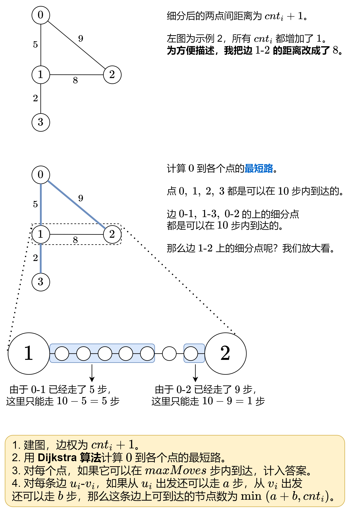

## [【模板】dijkstra找左上角到达右下角经过最少1，可以上下左右](https://kamacoder.com/problempage.php?pid=1245)

> 允许上下左右移动

```java
public class Main {
    private final static int[][] dirs = new int[][]{{0, 1}, {1, 0}, {0, -1}, {-1, 0}};
    public static void main(String[] args) throws IOException {
        // int T = sc.nextInt();
        while (T-- > 0) {
            solve();
            // sc.bw.flush();
        }
        sc.bw.flush();
        sc.bw.close();
    }

    private static String[] ss;
    private static String s;
    private static char[] cs;
    private static List<Integer>[] g;
    private static int n, m;
    static int[][] grid;
    private static void solve() throws IOException {
        n = sc.nextInt();
        m = sc.nextInt();
        grid = new int[n][m];
        for (int i = 0; i < n; i++) {
            ss = sc.nextLine().split(" ");
            for (int j = 0; j < m; j++) {
                grid[i][j] = Integer.parseInt(ss[j]);
            }
        }
        int[][] dist = new int[n][m];
        for (int i = 0; i < n; i++) {
            Arrays.fill(dist[i], n + m - 1);
        }
        boolean[][] visited = new boolean[n][m];
        PriorityQueue<int[]> pq = new PriorityQueue<>((a, b) -> a[2] - b[2]);
        dist[0][0] = grid[0][0];
        visited[0][0] = true;
        pq.offer(new int[]{0, 0, dist[0][0]});
        while (!pq.isEmpty()) {
            int[] poll = pq.poll();
            int x = poll[0], y = poll[1];
            for (int[] dir : dirs) {
                int nx = x + dir[0], ny = y + dir[1];
                if (nx >= 0 && nx < n && ny >= 0 && ny < m) {
                    if (dist[nx][ny] > dist[x][y] + grid[nx][ny]) {
                        dist[nx][ny] = dist[x][y] + grid[nx][ny];
                        if (!visited[nx][ny]) {
                            pq.offer(new int[]{nx, ny, dist[nx][ny]});
                            visited[nx][ny] = true;
                        }
                    }
                }
            }
        }
        sc.println(dist[n - 1][m - 1]);
    }
}
```

> 只能往右或则往下

```java
private static void solve() throws IOException {
        n = sc.nextInt();
        m = sc.nextInt();
        grid = new int[n][m];
        for (int i = 0; i < n; i++) {
            ss = sc.nextLine().split(" ");
            for (int j = 0; j < m; j++) {
                grid[i][j] = Integer.parseInt(ss[j]);
            }
        }
        int[][] dp = new int[n][m];
        for (int i = 0; i < n; i++) {
            Arrays.fill(dp[i], n + m - 1);
        }
        dp[0][0] = 0;
        for (int i = 0; i < n; i++) {
            for (int j = 0; j < m; j++) {
                if (i > 0) {
                    dp[i][j] = Math.min(dp[i][j], dp[i - 1][j]);
                }
                if (j > 0) {
                    dp[i][j] = Math.min(dp[i][j], dp[i][j - 1]);
                }
                dp[i][j] += grid[i][j];
            }
        }
        sc.println(dp[n - 1][m - 1]);
 }
```


## 【模板】dijkstraPlus找到距离节点k最远的点，并且打印路径

```java
import java.util.ArrayList;
import java.util.Arrays;
import java.util.List;
import java.util.PriorityQueue;

class Solution {
    // 堆优化版本
    public void dijkstraPlus(int[][] times, int n, int k) { // 找到距离节点k最远的点，打印路径
        final int INF = Integer.MAX_VALUE / 2;
        List<int[]>[] g = new List[n];
        Arrays.setAll(g, e -> new ArrayList<int[]>());
        for (int[] time : times) {
            int x = time[0] - 1, y = time[1] - 1, z = time[2];
            g[x].add(new int[] { y, z });
        }
        int[] dist = new int[n];
        int[] p = new int[n];
        Arrays.fill(p, -1);
        Arrays.fill(dist, INF);
        dist[k - 1] = 0;
        PriorityQueue<int[]> pq = new PriorityQueue<>((a, b) -> a[1] - b[1]);
        pq.offer(new int[] { k - 1, 0 });
        while (!pq.isEmpty()) {
            int[] poll = pq.poll();
            int x = poll[0], time = poll[1];
            if (dist[x] < time) {
                continue;
            }
            for (int[] e : g[x]) {
                int y = e[0], d = e[1];
                if (dist[y] > dist[x] + d) {
                    dist[y] = dist[x] + d;
                    p[y] = x;
                    pq.offer(new int[] { y, dist[y] });
                }
            }
        }
        int mx = 0, idx = k;
        for (int i = 0; i < dist.length; i++) {
            if (dist[i] > mx) {
                mx = dist[i];
                idx = i;
            }
        }
        String ans = "";
        for (int x = idx; x != -1; x = p[x]) {
            ans = (x + 1) + ans;
        }
        System.out.println(ans);
    }
}
```

743\. 网络延迟时间
------------

有 `n` 个网络节点，标记为 `1` 到 `n`。

给你一个列表 `times`，表示信号经过 **有向** 边的传递时间。 `times[i] = (ui, vi, wi)`，其中 `ui` 是源节点，`vi` 是目标节点， `wi` 是一个信号从源节点传递到目标节点的时间。

现在，从某个节点 `K` 发出一个信号。需要多久才能使所有节点都收到信号？如果不能使所有节点收到信号，返回 `-1` 。

**示例 1：**


**输入：**times = \[\[2,1,1\],\[2,3,1\],\[3,4,1\]\], n = 4, k = 2
**输出：**2

**示例 2：**

**输入：**times = \[\[1,2,1\]\], n = 2, k = 1
**输出：**1

**示例 3：**

**输入：**times = \[\[1,2,1\]\], n = 2, k = 2
**输出：**\-1

**提示：**

*   `1 <= k <= n <= 100`
*   `1 <= times.length <= 6000`
*   `times[i].length == 3`
*   `1 <= ui, vi <= n`
*   `ui != vi`
*   `0 <= wi <= 100`
*   所有 `(ui, vi)` 对都 **互不相同**（即，不含重复边）

[https://leetcode.cn/problems/network-delay-time/description/](https://leetcode.cn/problems/network-delay-time/description/)

```java
class Solution {
    // 堆优化版本
    public int networkDelayTime(int[][] times, int n, int k) { // 使用一个小根堆来寻找「未确定节点」中与起点距离最近的点
        // 定义一个常量 INF 表示无穷大，为防止溢出，取 Integer.MAX_VALUE 的一半
        final int INF = Integer.MAX_VALUE / 2;
        // 创建一个邻接表，用于表示图的结构
        List<int[]>[] g = new List[n];
        Arrays.setAll(g, e -> new ArrayList<int[]>());
        // 遍历输入的 times 数组，构建邻接表
        for (int[] time : times) {
            int x = time[0] - 1, y = time[1] - 1, z = time[2];
            g[x].add(new int[] { y, z });
        }
        // 初始化距离数组，用于记录起点到各点的最短距离，默认为无穷大
        int[] dist = new int[n];
        Arrays.fill(dist, INF);
        dist[k - 1] = 0;
        // 使用优先队列（最小堆）存储节点和到达该节点的时间
        PriorityQueue<int[]> pq = new PriorityQueue<>((a, b) -> a[1] - b[1]);
        pq.offer(new int[] { k - 1, 0 }); // 将起点加入优先队列

        // 进行 Dijkstra 算法的主循环
        while (!pq.isEmpty()) {
            int[] poll = pq.poll();
            int x = poll[0], time = poll[1];
            if (dist[x] < time) {
                continue; // 如果当前节点的最短距离已经更新，则跳过
            }
            for (int[] e : g[x]) {
                int y = e[0], d = e[1];
                if (dist[y] > dist[x] + d) {
                    dist[y] = dist[x] + d; // 更新到达节点 y 的最短距离
                    pq.offer(new int[] { y, dist[y] }); // 将节点 y 加入优先队列
                }
            }
        }
        // 找到最终的最大距离，即为答案
        int ans = Arrays.stream(dist).max().getAsInt();
        return ans == INF ? -1 : ans; // 如果存在无法到达的节点，则返回 -1
    }
}
```

2642\. 设计可以求最短路径的图类
-------------------

给你一个有 `n` 个节点的 **有向带权** 图，节点编号为 `0` 到 `n - 1` 。图中的初始边用数组 `edges` 表示，其中 `edges[i] = [fromi, toi, edgeCosti]` 表示从 `fromi` 到 `toi` 有一条代价为 `edgeCosti` 的边。

请你实现一个 `Graph` 类：

*   `Graph(int n, int[][] edges)` 初始化图有 `n` 个节点，并输入初始边。
*   `addEdge(int[] edge)` 向边集中添加一条边，其中 `edge = [from, to, edgeCost]` 。数据保证添加这条边之前对应的两个节点之间没有有向边。
*   `int shortestPath(int node1, int node2)` 返回从节点 `node1` 到 `node2` 的路径 **最小** 代价。如果路径不存在，返回 `-1` 。一条路径的代价是路径中所有边代价之和。

**示例 1：**


**输入：**
\["Graph", "shortestPath", "shortestPath", "addEdge", "shortestPath"\]
\[\[4, \[\[0, 2, 5\], \[0, 1, 2\], \[1, 2, 1\], \[3, 0, 3\]\]\], \[3, 2\], \[0, 3\], \[\[1, 3, 4\]\], \[0, 3\]\]
**输出：**
\[null, 6, -1, null, 6\]

**解释：**
Graph g = new Graph(4, \[\[0, 2, 5\], \[0, 1, 2\], \[1, 2, 1\], \[3, 0, 3\]\]);
g.shortestPath(3, 2); // 返回 6 。从 3 到 2 的最短路径如第一幅图所示：3 -> 0 -> 1 -> 2 ，总代价为 3 + 2 + 1 = 6 。
g.shortestPath(0, 3); // 返回 -1 。没有从 0 到 3 的路径。
g.addEdge(\[1, 3, 4\]); // 添加一条节点 1 到节点 3 的边，得到第二幅图。
g.shortestPath(0, 3); // 返回 6 。从 0 到 3 的最短路径为 0 -> 1 -> 3 ，总代价为 2 + 4 = 6 。

**提示：**

*   `1 <= n <= 100`
*   `0 <= edges.length <= n * (n - 1)`
*   `edges[i].length == edge.length == 3`
*   `0 <= fromi, toi, from, to, node1, node2 <= n - 1`
*   `1 <= edgeCosti, edgeCost <= 106`
*   图中任何时候都不会有重边和自环。
*   调用 `addEdge` 至多 `100` 次。
*   调用 `shortestPath` 至多 `100` 次。

[https://leetcode.cn/problems/design-graph-with-shortest-path-calculator/description/](https://leetcode.cn/problems/design-graph-with-shortest-path-calculator/description/)

```java
import java.util.Arrays;
import java.util.List;
import java.util.PriorityQueue;

class Graph {
    List<int[]>[] g;
    int n;
    public Graph(int n, int[][] edges) {
        this.n = n;
        g = new List[n];
        Arrays.setAll(g,e->new ArrayList<int[]>());
        for (int[] edge : edges) {
            int x = edge[0], y = edge[1], z = edge[2];
            g[x].add(new int[]{y, z});
        }
    }

    public void addEdge(int[] edge) {
        int x = edge[0], y = edge[1], z = edge[2];
        g[x].add(new int[]{y, z});
    }

    public int shortestPath(int node1, int node2) {
        int[] dist = new int[n];
        Arrays.fill(dist, Integer.MAX_VALUE / 2);
        dist[node1] = 0;
        PriorityQueue<int[]> pq = new PriorityQueue<>((a, b) -> a[1] - b[1]);
        pq.offer(new int[]{node1, 0});
        while (!pq.isEmpty()) {
            int[] poll = pq.poll();
            int x = poll[0], v = poll[1];
            if (v > dist[x]) {
                continue;
            }
            for (int[] e : g[x]) {
                int y = e[0], w = e[1];
                if(dist[y]>dist[x]+w){
					dist[y] = dist[x]+w;
                    pq.offer(new int[]{y,dist[y]});
                }
            }
        }
        return dist[node2]==Integer.MAX_VALUE/2?-1:dist[node2];
    }
}

/**
 * Your Graph object will be instantiated and called as such:
 * Graph obj = new Graph(n, edges);
 * obj.addEdge(edge);
 * int param_2 = obj.shortestPath(node1,node2);
 */
```

1976\. 到达目的地的方案数（最短路方案数）
----------------

你在一个城市里，城市由 `n` 个路口组成，路口编号为 `0` 到 `n - 1` ，某些路口之间有 **双向** 道路。输入保证你可以从任意路口出发到达其他任意路口，且任意两个路口之间最多有一条路。

给你一个整数 `n` 和二维整数数组 `roads` ，其中 `roads[i] = [ui, vi, timei]` 表示在路口 `ui` 和 `vi` 之间有一条需要花费 `timei` 时间才能通过的道路。你想知道花费 **最少时间** 从路口 `0` 出发到达路口 `n - 1` 的方案数。

请返回花费 **最少时间** 到达目的地的 **路径数目** 。由于答案可能很大，将结果对 `109 + 7` **取余** 后返回。

**示例 1：**


**输入：**n = 7, roads = \[\[0,6,7\],\[0,1,2\],\[1,2,3\],\[1,3,3\],\[6,3,3\],\[3,5,1\],\[6,5,1\],\[2,5,1\],\[0,4,5\],\[4,6,2\]\]
**输出：**4
**解释：**从路口 0 出发到路口 6 花费的最少时间是 7 分钟。
四条花费 7 分钟的路径分别为：
- 0 ➝ 6
- 0 ➝ 4 ➝ 6
- 0 ➝ 1 ➝ 2 ➝ 5 ➝ 6
- 0 ➝ 1 ➝ 3 ➝ 5 ➝ 6

**示例 2：**

**输入：**n = 2, roads = \[\[1,0,10\]\]
**输出：**1
**解释：**只有一条从路口 0 到路口 1 的路，花费 10 分钟。

**提示：**

*   `1 <= n <= 200`
*   `n - 1 <= roads.length <= n * (n - 1) / 2`
*   `roads[i].length == 3`
*   `0 <= ui, vi <= n - 1`
*   `1 <= timei <= 109`
*   `ui != vi`
*   任意两个路口之间至多有一条路。
*   从任意路口出发，你能够到达其他任意路口。

[https://leetcode.cn/problems/number-of-ways-to-arrive-at-destination/description/?envType=daily-question&envId=Invalid%20Date](https://leetcode.cn/problems/number-of-ways-to-arrive-at-destination/description/?envType=daily-question&envId=Invalid%20Date)

```java
import java.util.ArrayList;
import java.util.Arrays;
import java.util.List;
import java.util.PriorityQueue;

class Solution {
    public int countPaths(int n, int[][] roads) {
        int Mod = (int) 1e9 + 7;
        long INF = Long.MAX_VALUE / 2;
        List<int[]>[] g = new List[n];
        Arrays.setAll(g, e -> new ArrayList<int[]>());
        for (int[] road : roads) {
            int x = road[0], y = road[1], z = road[2];
            g[x].add(new int[]{y, z});
            g[y].add(new int[]{x, z});
        }
        long[] dist = new long[n];
        Arrays.fill(dist, INF);
        int[] dp = new int[n];
        dp[0] = 1;
        dist[0] = 0;
        PriorityQueue<long[]> pq = new PriorityQueue<>((a, b) -> Long.compare(a[1], b[1]));
        pq.offer(new long[]{0, 0});
        while (!pq.isEmpty()) {
            long[] poll = pq.poll();
            int x = (int) poll[0];
            long road = poll[1];
            if (dist[x] < road) {
                continue;
            }
            for (int[] e : g[x]) {
                int y = e[0];
                long z = e[1];
                if (dist[y] > dist[x] + z) {
                    dist[y] = dist[x] + z;
                    dp[y] = dp[x];
                    pq.offer(new long[]{y, dist[y]});
                } else if (dist[y] == dist[x] + z) {
                    dp[y] = (dp[y] + dp[x]) % Mod;
                }
            }
        }
        return dp[n - 1];
    }
}
```

1514\. 概率最大的路径
--------------

给你一个由 `n` 个节点（下标从 0 开始）组成的无向加权图，该图由一个描述边的列表组成，其中 `edges[i] = [a, b]` 表示连接节点 a 和 b 的一条无向边，且该边遍历成功的概率为 `succProb[i]` 。

指定两个节点分别作为起点 `start` 和终点 `end` ，请你找出从起点到终点成功概率最大的路径，并返回其成功概率。

如果不存在从 `start` 到 `end` 的路径，请 **返回 0** 。只要答案与标准答案的误差不超过 **1e-5** ，就会被视作正确答案。

**示例 1：**

****

**输入：**n = 3, edges = \[\[0,1\],\[1,2\],\[0,2\]\], succProb = \[0.5,0.5,0.2\], start = 0, end = 2
**输出：**0.25000
**解释：**从起点到终点有两条路径，其中一条的成功概率为 0.2 ，而另一条为 0.5 \* 0.5 = 0.25

**示例 2：**

****

**输入：**n = 3, edges = \[\[0,1\],\[1,2\],\[0,2\]\], succProb = \[0.5,0.5,0.3\], start = 0, end = 2
**输出：**0.30000

**示例 3：**

****

**输入：**n = 3, edges = \[\[0,1\]\], succProb = \[0.5\], start = 0, end = 2
**输出：**0.00000
**解释：**节点 0 和 节点 2 之间不存在路径

**提示：**

*   `2 <= n <= 10^4`
*   `0 <= start, end < n`
*   `start != end`
*   `0 <= a, b < n`
*   `a != b`
*   `0 <= succProb.length == edges.length <= 2*10^4`
*   `0 <= succProb[i] <= 1`
*   每两个节点之间最多有一条边

[https://leetcode.cn/problems/path-with-maximum-probability/description/](https://leetcode.cn/problems/path-with-maximum-probability/description/)

```java
class Solution {
    public double maxProbability(int n, int[][] edges, double[] succProb, int start, int end) {

        // 构造图
        List<double[]>[] graph = new ArrayList[n];
        for(int i = 0; i < n; i++){
            graph[i] = new ArrayList<double[]>();
        }
        for(int i = 0; i < edges.length; i++){
            int idstart = edges[i][0];
            int idend = edges[i][1];
            double weight = succProb[i];

            graph[idstart].add(new double[]{idend, weight});
            graph[idend].add(new double[]{idstart, weight});
        }

        // 自定义排序，优先更新概率大的节点
        Queue<State> pq = new PriorityQueue<State>((a, b) -> {
            if(a.prop > b.prop){
                return -1;
            }else if(a.prop < b.prop){
                return 1;
            }else{
                return 0;
            }
        });
        pq.offer(new State(start, 1));

        double[] res = new double[n];
        res[start] = 1;
        while(!pq.isEmpty()){
            State curNode = pq.poll();
            // 找到了，因为这个节点已经是队列里概率最大的节点了，再通过其他节点去更新这个节点，只会越更新概率越小，所以不用找了，这个就是我们要的答案。
            if(curNode.id == end){
                return curNode.prop;
            }

            // 更新邻居的概率
            for(double[] neighbor : graph[curNode.id]){
                int nextID = (int)neighbor[0];
                double nextProp = curNode.prop * neighbor[1];
                if(nextProp > res[nextID]){
                    res[nextID] = nextProp;
                    pq.offer(new State(nextID, nextProp));
                }

            }
        }

        return res[end];
    }
}

class State{
    int id;
    double prop;

    State(int id, double prop){
        this.id = id;
        this.prop = prop;
    }
}
```

1631\. 最小体力消耗路径
---------------

你准备参加一场远足活动。给你一个二维 `rows x columns` 的地图 `heights` ，其中 `heights[row][col]` 表示格子 `(row, col)` 的高度。一开始你在最左上角的格子 `(0, 0)` ，且你希望去最右下角的格子 `(rows-1, columns-1)` （注意下标从 **0** 开始编号）。你每次可以往 **上**，**下**，**左**，**右** 四个方向之一移动，你想要找到耗费 **体力** 最小的一条路径。

一条路径耗费的 **体力值** 是路径上相邻格子之间 **高度差绝对值** 的 **最大值** 决定的。

请你返回从左上角走到右下角的最小 **体力消耗值** 。

**示例 1：**


**输入：**heights = \[\[1,2,2\],\[3,8,2\],\[5,3,5\]\]
**输出：**2
**解释：**路径 \[1,3,5,3,5\] 连续格子的差值绝对值最大为 2 。
这条路径比路径 \[1,2,2,2,5\] 更优，因为另一条路径差值最大值为 3 。

**示例 2：**


**输入：**heights = \[\[1,2,3\],\[3,8,4\],\[5,3,5\]\]
**输出：**1
**解释：**路径 \[1,2,3,4,5\] 的相邻格子差值绝对值最大为 1 ，比路径 \[1,3,5,3,5\] 更优。

**示例 3：**


**输入：**heights = \[\[1,2,1,1,1\],\[1,2,1,2,1\],\[1,2,1,2,1\],\[1,2,1,2,1\],\[1,1,1,2,1\]\]
**输出：**0
**解释：**上图所示路径不需要消耗任何体力。

**提示：**

*   `rows == heights.length`
*   `columns == heights[i].length`
*   `1 <= rows, columns <= 100`
*   `1 <= heights[i][j] <= 106`

[https://leetcode.cn/problems/path-with-minimum-effort/description/](https://leetcode.cn/problems/path-with-minimum-effort/description/)

```java
import java.util.ArrayList;
import java.util.Arrays;
import java.util.List;
import java.util.PriorityQueue;

class Solution {
    public static void main(String[] args) {
        Solution solution = new Solution();
        solution.minimumEffortPath(new int[][]{{4, 3, 4, 10, 5, 5, 9, 2}, {10, 8, 2, 10, 9, 7, 5, 6}, {5, 8, 10, 10, 10, 7, 4, 2}, {5, 1, 3, 1, 1, 3, 1, 9}, {6, 4, 10, 6, 10, 9, 4, 6}});
    }
    
    public int minimumEffortPath(int[][] heights) {
        int m = heights.length, n = heights[0].length;
        List<int[]>[] g = new List[m * n];
        Arrays.setAll(g, e -> new ArrayList<>());
        for (int i = 0; i < m; i++) { // 建图
            for (int j = 0; j < n; j++) {
                if (j + 1 < n) {
                    g[n * i + j].add(new int[]{n * i + j + 1, Math.abs(heights[i][j] - heights[i][j + 1])});
                }
                if (j > 0) {
                    g[n * i + j].add(new int[]{n * i + j - 1, Math.abs(heights[i][j] - heights[i][j - 1])});
                }
                if (i + 1 < m) {
                    g[n * i + j].add(new int[]{n * (i + 1) + j, Math.abs(heights[i][j] - heights[i + 1][j])});
                }
                if (i > 0) {
                    g[n * i + j].add(new int[]{n * (i - 1) + j, Math.abs(heights[i][j] - heights[i - 1][j])});
                }
            }
        }
        PriorityQueue<int[]> pq = new PriorityQueue<>((a, b) -> a[1] - b[1]);
        int[] dist = new int[m * n];
        Arrays.fill(dist, Integer.MAX_VALUE / 2);
        dist[0] = 0;
        pq.offer(new int[]{0, 0});
        while (!pq.isEmpty()) {
            int[] poll = pq.poll();
            int x = poll[0], d = poll[1];
            if (dist[x] < d) {
                continue;
            }
            for (int[] e : g[x]) {
                int y = e[0], d1 = Math.max(dist[x], e[1]);
                if (dist[y] >  d1) {
                    dist[y] = d1;
                    pq.offer(new int[]{y, d1});
                }
            }
        }
        // for (int i = 0; i < m * n; i++) {
        //     System.out.println(i + ":" + dist[i]);
        // }
        return dist[m * n - 1];
    }
    // [[4,3,4,10,5,5,9,2],
    // [10,8,2,10,9,7,5,6],
    // [5,8,10,10,10,7,4,2],
    // [5,1,3,1,1,3,1,9],
    // [6,4,10,6,10,9,4,6]]
}
```

1368\. 使网格图至少有一条有效路径的最小代价
-------------------------

给你一个 m x n 的网格图 `grid` 。 `grid` 中每个格子都有一个数字，对应着从该格子出发下一步走的方向。 `grid[i][j]` 中的数字可能为以下几种情况：

*   **1** ，下一步往右走，也就是你会从 `grid[i][j]` 走到 `grid[i][j + 1]`
*   **2** ，下一步往左走，也就是你会从 `grid[i][j]` 走到 `grid[i][j - 1]`
*   **3** ，下一步往下走，也就是你会从 `grid[i][j]` 走到 `grid[i + 1][j]`
*   **4** ，下一步往上走，也就是你会从 `grid[i][j]` 走到 `grid[i - 1][j]`

注意网格图中可能会有 **无效数字** ，因为它们可能指向 `grid` 以外的区域。

一开始，你会从最左上角的格子 `(0,0)` 出发。我们定义一条 **有效路径** 为从格子 `(0,0)` 出发，每一步都顺着数字对应方向走，最终在最右下角的格子 `(m - 1, n - 1)` 结束的路径。有效路径 **不需要是最短路径** 。

你可以花费 `cost = 1` 的代价修改一个格子中的数字，但每个格子中的数字 **只能修改一次** 。

请你返回让网格图至少有一条有效路径的最小代价。

**示例 1：**


**输入：**grid = \[\[1,1,1,1\],\[2,2,2,2\],\[1,1,1,1\],\[2,2,2,2\]\]
**输出：**3
**解释：**你将从点 (0, 0) 出发。
到达 (3, 3) 的路径为： (0, 0) --> (0, 1) --> (0, 2) --> (0, 3) 花费代价 cost = 1 使方向向下 --> (1, 3) --> (1, 2) --> (1, 1) --> (1, 0) 花费代价 cost = 1 使方向向下 --> (2, 0) --> (2, 1) --> (2, 2) --> (2, 3) 花费代价 cost = 1 使方向向下 --> (3, 3)
总花费为 cost = 3.

**示例 2：**


**输入：**grid = \[\[1,1,3\],\[3,2,2\],\[1,1,4\]\]
**输出：**0
**解释：**不修改任何数字你就可以从 (0, 0) 到达 (2, 2) 。

**示例 3：**


**输入：**grid = \[\[1,2\],\[4,3\]\]
**输出：**1

**示例 4：**

**输入：**grid = \[\[2,2,2\],\[2,2,2\]\]
**输出：**3

**示例 5：**

**输入：**grid = \[\[4\]\]
**输出：**0

**提示：**

*   `m == grid.length`
*   `n == grid[i].length`
*   `1 <= m, n <= 100`

[https://leetcode.cn/problems/minimum-cost-to-make-at-least-one-valid-path-in-a-grid/description/](https://leetcode.cn/problems/minimum-cost-to-make-at-least-one-valid-path-in-a-grid/description/)

```java
import java.util.Arrays;
import java.util.PriorityQueue;

class Solution {
    private static int[][] dirs = new int[][]{{0, 1}, {0, -1}, {1, 0}, {-1, 0}};
    public int minCost(int[][] grid) {
        int m = grid.length, n = grid[0].length;
        int[][] cost = new int[m][n];
        for (int i = 0; i < m; i++) {
            Arrays.fill(cost[i], Integer.MAX_VALUE);
        }
        cost[0][0] = 0;
        PriorityQueue<int[]> pq = new PriorityQueue<>((a, b) -> a[2] - b[2]);
        pq.offer(new int[]{0, 0, 0});
        while (!pq.isEmpty()) {
            int[] poll = pq.poll();
            int row = poll[0], col = poll[1], c = poll[2];
            if (cost[row][col] < c) {
                continue;
            }
            for (int i = 0; i < 4; i++) {
                int[] dir = dirs[i];
                int newRow = row + dir[0], newCol = col + dir[1];
                int newC = c + (grid[row][col] == i + 1 ? 0 : 1);
                if (newRow >= 0 && newCol >= 0 && newRow < m && newCol < n && newC < cost[newRow][newCol]) {
                    cost[newRow][newCol] = newC;
                    pq.offer(new int[]{newRow, newCol, newC});
                }
            }
        }
        return cost[m - 1][n - 1];
    }
}
```

2662\. 前往目标的最小代价
----------------

给你一个数组 `start` ，其中 `start = [startX, startY]` 表示你的初始位置位于二维空间上的 `(startX, startY)` 。另给你一个数组 `target` ，其中 `target = [targetX, targetY]` 表示你的目标位置 `(targetX, targetY)` 。

从位置 `(x1, y1)` 到空间中任一其他位置 `(x2, y2)` 的 **代价** 是 `|x2 - x1| + |y2 - y1|` 。

给你一个二维数组 `specialRoads` ，表示空间中存在的一些 **特殊路径**。其中 `specialRoads[i] = [x1i, y1i, x2i, y2i, costi]` 表示第 `i` 条特殊路径可以从 `(x1i, y1i)` 到 `(x2i, y2i)` ，但成本等于 `costi` 。你可以使用每条特殊路径任意次数。

返回从 `(startX, startY)` 到 `(targetX, targetY)` 所需的 **最小** 代价。

**示例 1：**

**输入：**start = \[1,1\], target = \[4,5\], specialRoads = \[\[1,2,3,3,2\],\[3,4,4,5,1\]\]

**输出：**5

**解释：**

1.  (1,1) 到 (1,2) 花费为 |1 - 1| + |2 - 1| = 1。
2.  (1,2) 到 (3,3)。使用 `specialRoads[0]` 花费为 2。
3.  (3,3) 到 (3,4) 花费为 |3 - 3| + |4 - 3| = 1。
4.  (3,4) 到 (4,5)。使用 `specialRoads[1]` 花费为 1。

所以总花费是 1 + 2 + 1 + 1 = 5。

**示例 2：**

**输入：**start = \[3,2\], target = \[5,7\], specialRoads = \[\[5,7,3,2,1\],\[3,2,3,4,4\],\[3,3,5,5,5\],\[3,4,5,6,6\]\]

**输出：**7

**解释：**

不使用任何特殊路径，直接从开始到结束位置是最优的，花费为 |5 - 3| + |7 - 2| = 7。

注意 `specialRoads[0]` 直接从 (5,7) 到 (3,2)。

**示例 3：**

**输入：**start = \[1,1\], target = \[10,4\], specialRoads = \[\[4,2,1,1,3\],\[1,2,7,4,4\],\[10,3,6,1,2\],\[6,1,1,2,3\]\]

**输出：**8

**解释：**

1.  (1,1) 到 (1,2) 花费为 |1 - 1| + |2 - 1| = 1。
2.  (1,2) 到 (7,4)。使用 `specialRoads[1]` 花费为 4。
3.  (7,4) 到 (10,4) 花费为 |10 - 7| + |4 - 4| = 3。

**提示：**

*   `start.length == target.length == 2`
*   `1 <= startX <= targetX <= 105`
*   `1 <= startY <= targetY <= 105`
*   `1 <= specialRoads.length <= 200`
*   `specialRoads[i].length == 5`
*   `startX <= x1i, x2i <= targetX`
*   `startY <= y1i, y2i <= targetY`
*   `1 <= costi <= 105`

[https://leetcode.cn/problems/minimum-cost-of-a-path-with-special-roads/](https://leetcode.cn/problems/minimum-cost-of-a-path-with-special-roads/)

```java
import java.util.HashMap;
import java.util.PriorityQueue;

class Solution {
    public int minimumCost(int[] start, int[] target, int[][] specialRoads) {
        PriorityQueue<int[]> pq = new PriorityQueue<>((a, b) -> a[2] - b[2]);
        int res = calDist(start, target);
        pq.offer(new int[]{start[0], start[1], 0});
        HashMap<String, Integer> map = new HashMap<>();
        map.put(getKey(start), 0);
        while (!pq.isEmpty()) {
            int[] p = pq.poll();
            for (int[] sp : specialRoads) {
                int[] p1 = new int[]{sp[0], sp[1]};
                int[] p2 = new int[]{sp[2], sp[3]};
                int d = p[2] + calDist(p, p1) + sp[4]; 
                String key = getKey(p2);
                int x = map.getOrDefault(key, calDist(start, p2));
                if (d < x) {
                    map.put(key, d);
                    pq.offer(new int[]{p2[0], p2[1], d});
                    res = Math.min(res, d + calDist(p2, target));
                }
            }
        }
        return res;
    }

    private int calDist(int[] p1, int[] p2) {
        return Math.abs(p1[0] - p2[0]) + Math.abs(p1[1] - p2[1]);
    }

    private String getKey(int[] p) {
        return p[0] + "_" + p[1];
    }
}
```

2045\. 到达目的地的第二短时间(第二短路径+红绿灯等待模型)
------------------

城市用一个 **双向连通** 图表示，图中有 `n` 个节点，从 `1` 到 `n` 编号（包含 `1` 和 `n`）。图中的边用一个二维整数数组 `edges` 表示，其中每个 `edges[i] = [ui, vi]` 表示一条节点 `ui` 和节点 `vi` 之间的双向连通边。每组节点对由 **最多一条** 边连通，顶点不存在连接到自身的边。穿过任意一条边的时间是 `time` 分钟。

每个节点都有一个交通信号灯，每 `change` 分钟改变一次，从绿色变成红色，再由红色变成绿色，循环往复。所有信号灯都 **同时** 改变。你可以在 **任何时候** 进入某个节点，但是 **只能** 在节点 **信号灯是绿色时** 才能离开。如果信号灯是  **绿色** ，你 **不能** 在节点等待，必须离开。

**第二小的值** 是 **严格大于** 最小值的所有值中最小的值。

*   例如，`[2, 3, 4]` 中第二小的值是 `3` ，而 `[2, 2, 4]` 中第二小的值是 `4` 。

给你 `n`、`edges`、`time` 和 `change` ，返回从节点 `1` 到节点 `n` 需要的 **第二短时间** 。

**注意：**

*   你可以 **任意次** 穿过任意顶点，**包括** `1` 和 `n` 。
*   你可以假设在 **启程时** ，所有信号灯刚刚变成 **绿色** 。

**示例 1：**

        

**输入：**n = 5, edges = \[\[1,2\],\[1,3\],\[1,4\],\[3,4\],\[4,5\]\], time = 3, change = 5
**输出：**13
**解释：**
上面的左图展现了给出的城市交通图。
右图中的蓝色路径是最短时间路径。
花费的时间是：
- 从节点 1 开始，总花费时间=0
- 1 -> 4：3 分钟，总花费时间=3
- 4 -> 5：3 分钟，总花费时间=6
  因此需要的最小时间是 6 分钟。

右图中的红色路径是第二短时间路径。
- 从节点 1 开始，总花费时间=0
- 1 -> 3：3 分钟，总花费时间=3
- 3 -> 4：3 分钟，总花费时间=6
- 在节点 4 等待 4 分钟，总花费时间=10
- 4 -> 5：3 分钟，总花费时间=13
  因此第二短时间是 13 分钟。      

**示例 2：**


**输入：**n = 2, edges = \[\[1,2\]\], time = 3, change = 2
**输出：**11
**解释：**
最短时间路径是 1 -> 2 ，总花费时间 = 3 分钟
第二短时间路径是 1 -> 2 -> 1 -> 2 ，总花费时间 = 11 分钟

**提示：**

*   `2 <= n <= 104`
*   `n - 1 <= edges.length <= min(2 * 104, n * (n - 1) / 2)`
*   `edges[i].length == 2`
*   `1 <= ui, vi <= n`
*   `ui != vi`
*   不含重复边
*   每个节点都可以从其他节点直接或者间接到达
*   `1 <= time, change <= 103`

[https://leetcode.cn/problems/second-minimum-time-to-reach-destination/](https://leetcode.cn/problems/second-minimum-time-to-reach-destination/)

```java
import java.util.*;

class Solution { // bfs
    public int secondMinimum(int n, int[][] edges, int time, int change) {
        List<Integer>[] g = new List[n + 1];
        Arrays.setAll(g, e -> new ArrayList<>());
        for (int[] edge : edges) {
            int x = edge[0], y = edge[1];
            g[x].add(y);
            g[y].add(x);
        }
        // path[i][0] 表示从 1 到 i 的最短路长度，path[i][1] 表示从 1 到 i 的严格次短路长度
        int[][] path = new int[n + 1][2];
        for (int i = 0; i < path.length; i++) {
            Arrays.fill(path[i], Integer.MAX_VALUE / 2);
        }
        path[1][0] = 0;
        Queue<int[]> queue = new LinkedList<>();
        queue.offer(new int[]{1, 0});
        while (path[n][1] == Integer.MAX_VALUE / 2) {
            int[] poll = queue.poll();
            int cur = poll[0], len = poll[1];
            for (int next : g[cur]) {
                if (len + 1 < path[next][0]) { // 这里其实就是dijkstra的模型
                    path[next][0] = len + 1;
                    queue.offer(new int[]{next, len + 1});
                } else if (len + 1 < path[next][1] && len + 1 > path[next][0]) {
                    path[next][1] = len + 1;
                    queue.offer(new int[]{next, len + 1});
                }
            }
        }
        int res = 0;
        for (int i = 0; i < path[n][1]; i++) { // 等红绿灯逻辑，周期建模
            if (res % (2 * change) >= change) {
                res += 2 * change - res % (2 * change);
            }
            res += time;
        }
        return res;
    }
}
```

## 882\. 细分图中的可到达节点

给你一个无向图（**原始图**），图中有 `n` 个节点，编号从 `0` 到 `n - 1` 。你决定将图中的每条边 **细分** 为一条节点链，每条边之间的新节点数各不相同。

图用由边组成的二维数组 `edges` 表示，其中 `edges[i] = [ui, vi, cnti]` 表示原始图中节点 `ui` 和 `vi` 之间存在一条边，`cnti` 是将边 **细分** 后的新节点总数。注意，`cnti == 0` 表示边不可细分。

要 **细分** 边 `[ui, vi]` ，需要将其替换为 `(cnti + 1)` 条新边，和 `cnti` 个新节点。新节点为 `x1`, `x2`, ..., `xcnti` ，新边为 `[ui, x1]`, `[x1, x2]`, `[x2, x3]`, ..., `[xcnti-1, xcnti]`, `[xcnti, vi]` 。

现在得到一个 **新的细分图** ，请你计算从节点 `0` 出发，可以到达多少个节点？如果节点间距离是 `maxMoves` 或更少，则视为 **可以到达** 。

给你原始图和 `maxMoves` ，返回 _新的细分图中从节点 `0` 出发_ **_可到达的节点数_** 。

**示例 1：**


**输入：**edges = \[\[0,1,10\],\[0,2,1\],\[1,2,2\]\], maxMoves = 6, n = 3
**输出：**13
**解释：**边的细分情况如上图所示。
可以到达的节点已经用黄色标注出来。

**示例 2：**

**输入：**edges = \[\[0,1,4\],\[1,2,6\],\[0,2,8\],\[1,3,1\]\], maxMoves = 10, n = 4
**输出：**23

**示例 3：**

**输入：**edges = \[\[1,2,4\],\[1,4,5\],\[1,3,1\],\[2,3,4\],\[3,4,5\]\], maxMoves = 17, n = 5
**输出：**1
**解释：**节点 0 与图的其余部分没有连通，所以只有节点 0 可以到达。

**提示：**

- `0 <= edges.length <= min(n * (n - 1) / 2, 104)`
- `edges[i].length == 3`
- `0 <= ui < vi < n`
- 图中 **不存在平行边**
- `0 <= cnti <= 104`
- `0 <= maxMoves <= 109`
- `1 <= n <= 3000`

[https://leetcode.cn/problems/reachable-nodes-in-subdivided-graph/description/](https://leetcode.cn/problems/reachable-nodes-in-subdivided-graph/description/)

 

```java
import java.util.ArrayList;
import java.util.Arrays;
import java.util.List;
import java.util.PriorityQueue;

class Solution {
    public int reachableNodes(int[][] edges, int maxMoves, int n) {
        List<int[]>[] g = new List[n];
        Arrays.setAll(g, e -> new ArrayList<int[]>());
        for (int[] edge : edges) {
            int x = edge[0], y = edge[1], cnt = edge[2];
            g[x].add(new int[]{y, cnt + 1});
            g[y].add(new int[]{x, cnt + 1});
        }
        int[] dist = new int[n];
        Arrays.fill(dist, Integer.MAX_VALUE / 2);
        // dijkstra
        PriorityQueue<int[]> pq = new PriorityQueue<>((a, b) -> a[1] - b[1]);
        pq.offer(new int[]{0, 0});
        dist[0] = 0;
        while (!pq.isEmpty()) {
            int[] p = pq.poll();
            int x = p[0], d = p[1];
            if (dist[x] < d) {
                continue;
            }
            for (int[] y : g[x]) {
                int yi = y[0];
                int newDist = d + y[1];
                if (newDist < dist[yi]) {
                    dist[yi] = newDist;
                    pq.offer(new int[]{yi, dist[yi]});
                }
            }
        }
        int ans = 0;
        for (int d : dist) {
            if (d <= maxMoves) {
                ans++;
            }
        }
        for (int[] edge : edges) {
            int x = edge[0], y = edge[1], cnt = edge[2];
            int a = Math.max(maxMoves - dist[x], 0);
            int b = Math.max(maxMoves - dist[y], 0);
            ans += Math.min(cnt, a + b);
        }
        return ans;
    }
}
```

## 2203\. 得到要求路径的最小带权子图

给你一个整数 `n` ，它表示一个 **带权有向** 图的节点数，节点编号为 `0` 到 `n - 1` 。

同时给你一个二维整数数组 `edges` ，其中 `edges[i] = [fromi, toi, weighti]` ，表示从 `fromi` 到 `toi` 有一条边权为 `weighti` 的 **有向** 边。

最后，给你三个 **互不相同** 的整数 `src1` ，`src2` 和 `dest` ，表示图中三个不同的点。

请你从图中选出一个 **边权和最小** 的子图，使得从 `src1` 和 `src2` 出发，在这个子图中，都 **可以** 到达 `dest` 。如果这样的子图不存在，请返回 `-1` 。

**子图** 中的点和边都应该属于原图的一部分。子图的边权和定义为它所包含的所有边的权值之和。

**示例 1：**


**输入：**n = 6, edges = \[\[0,2,2\],\[0,5,6\],\[1,0,3\],\[1,4,5\],\[2,1,1\],\[2,3,3\],\[2,3,4\],\[3,4,2\],\[4,5,1\]\], src1 = 0, src2 = 1, dest = 5
**输出：**9
**解释：**
上图为输入的图。
蓝色边为最优子图之一。
注意，子图 \[\[1,0,3\],\[0,5,6\]\] 也能得到最优解，但无法在满足所有限制的前提下，得到更优解。

**示例 2：**


**输入：**n = 3, edges = \[\[0,1,1\],\[2,1,1\]\], src1 = 0, src2 = 1, dest = 2
**输出：**\-1
**解释：**
上图为输入的图。
可以看到，不存在从节点 1 到节点 2 的路径，所以不存在任何子图满足所有限制。

**提示：**

- `3 <= n <= 105`
- `0 <= edges.length <= 105`
- `edges[i].length == 3`
- `0 <= fromi, toi, src1, src2, dest <= n - 1`
- `fromi != toi`
- `src1` ，`src2` 和 `dest` 两两不同。
- `1 <= weight[i] <= 105`

[https://leetcode.cn/problems/minimum-weighted-subgraph-with-the-required-paths/description/](https://leetcode.cn/problems/minimum-weighted-subgraph-with-the-required-paths/description/)

```java
import java.util.*;

class Solution {
    public long minimumWeight(int n, int[][] edges, int src1, int src2, int dest) {
        List<int[]>[] posPath = new List[n];// 正向建图
        List<int[]>[] negPath = new List[n];// 反向建图
        for (int i = 0; i < n; i++) {
            posPath[i] = new ArrayList<>();
            negPath[i] = new ArrayList<>();
        }
        for (int i = 0; i < edges.length; i++) {
            posPath[edges[i][0]].add(new int[] { edges[i][1], edges[i][2] });
            negPath[edges[i][1]].add(new int[] { edges[i][0], edges[i][2] });
        }
        long d1[] = new long[n];// s1到各个点的最短距离
        long d2[] = new long[n];// s2到各个点的最短距离
        long d3[] = new long[n];// dest到各个点的最短距离
        Arrays.fill(d1, (long) 1e10 + 5);
        Arrays.fill(d2, (long) 1e10 + 5);
        Arrays.fill(d3, (long) 1e10 + 5);
        d1[src1] = 0;
        d2[src2] = 0;
        d3[dest] = 0;
        findShortestPath(posPath, d1, src1);
        findShortestPath(posPath, d2, src2);
        if (d1[dest] > 1e10 || d2[dest] > 1e10) {
            return -1;
        }
        findShortestPath(negPath, d3, dest);
        long ans = (long) 1e10;
        for (int i = 0; i < n; i++) {
            if (d3[i] > 1e10 || d2[i] > 1e10 || d1[i] > 1e10) {
                continue;
            }
            ans = Math.min(ans, d1[i] + d2[i] + d3[i]);
        }
        return ans;
    }

    public void findShortestPath(List<int[]>[] path, long d[], int start) {
        Queue<Pair> q = new PriorityQueue<>((a, b) -> a.d < b.d ? -1 : 1);
        q.add(new Pair(start, 0));
        while (q.size() > 0) {
            Pair a = q.poll();
            if (a.d > d[a.p]) {
                continue;
            } // 关键，不超时就靠这个了
            List<int[]> list = path[a.p];
            for (int i = 0; i < list.size(); i++) {
                int b[] = list.get(i);
                long distance = d[a.p] + b[1];
                if (distance < d[b[0]]) {
                    d[b[0]] = distance;
                    q.add(new Pair(b[0], distance));
                }
            }
        }
    }
}

class Pair {
    int p;
    long d;

    public Pair(int p, long d) {
        this.p = p;
        this.d = d;
    }
}
```

## 2577\. 在网格图中访问一个格子的最少时间

给你一个 `m x n` 的矩阵 `grid` ，每个元素都为 **非负** 整数，其中 `grid[row][col]` 表示可以访问格子 `(row, col)` 的 **最早** 时间。也就是说当你访问格子 `(row, col)` 时，最少已经经过的时间为 `grid[row][col]` 。

你从 **最左上角** 出发，出发时刻为 `0` ，你必须一直移动到上下左右相邻四个格子中的 **任意** 一个格子（即不能停留在格子上）。每次移动都需要花费 1 单位时间。

请你返回 **最早** 到达右下角格子的时间，如果你无法到达右下角的格子，请你返回 `-1` 。

**示例 1：**


**输入：**grid = \[\[0,1,3,2\],\[5,1,2,5\],\[4,3,8,6\]\]
**输出：**7
**解释：**一条可行的路径为：

- 时刻 t = 0 ，我们在格子 (0,0) 。
- 时刻 t = 1 ，我们移动到格子 (0,1) ，可以移动的原因是 grid\[0\]\[1\] <= 1 。
- 时刻 t = 2 ，我们移动到格子 (1,1) ，可以移动的原因是 grid\[1\]\[1\] <= 2 。
- 时刻 t = 3 ，我们移动到格子 (1,2) ，可以移动的原因是 grid\[1\]\[2\] <= 3 。
- 时刻 t = 4 ，我们移动到格子 (1,1) ，可以移动的原因是 grid\[1\]\[1\] <= 4 。
- 时刻 t = 5 ，我们移动到格子 (1,2) ，可以移动的原因是 grid\[1\]\[2\] <= 5 。
- 时刻 t = 6 ，我们移动到格子 (1,3) ，可以移动的原因是 grid\[1\]\[3\] <= 6 。
- 时刻 t = 7 ，我们移动到格子 (2,3) ，可以移动的原因是 grid\[2\]\[3\] <= 7 。
  最终到达时刻为 7 。这是最早可以到达的时间。

**示例 2：**


**输入：**grid = \[\[0,2,4\],\[3,2,1\],\[1,0,4\]\]
**输出：**\-1
**解释：**没法从左上角按题目规定走到右下角。

**提示：**

- `m == grid.length`
- `n == grid[i].length`
- `2 <= m, n <= 1000`
- `4 <= m * n <= 105`
- `0 <= grid[i][j] <= 105`
- `grid[0][0] == 0`

[https://leetcode.cn/problems/minimum-time-to-visit-a-cell-in-a-grid/description/](https://leetcode.cn/problems/minimum-time-to-visit-a-cell-in-a-grid/description/)

```java
import java.util.Arrays;
import java.util.PriorityQueue;

class Solution {
    private static int[][] dirs = new int[][]{{1, 0}, {-1, 0}, {0, 1}, {0, -1}};
    public int minimumTime(int[][] grid) {
        int m = grid.length, n = grid[0].length;
        if (grid[0][1] > 1 && grid[1][0] > 1) { // 无法「等待」
            return -1;
        }
        PriorityQueue<int[]> pq = new PriorityQueue<>((a, b) -> a[0] - b[0]); // {d,i,j}
        int[][] dist = new int[m][n];
        for (int i = 0; i < m; i++) {
            Arrays.fill(dist[i], Integer.MAX_VALUE / 2);
        }
        dist[0][0] = 0;
        pq.offer(new int[]{0, 0, 0});
        while (true) { // 可以等待，就一定可以到达终点
            int[] poll = pq.poll();
            int d = poll[0], i = poll[1], j = poll[2];
            if (dist[i][j] < d) {
                continue;
            }
            if (i == m - 1 && j == n - 1) { // 找到终点，此时 d 一定是最短路
                return dist[i][j];
            }
            for (int[] dir : dirs) { // 枚举周围四个格子
                int newI = i + dir[0], newJ = j + dir[1];
                if (newI >= 0 && newI < m && newJ >= 0 && newJ < n) {
                    int newD = Math.max(d + 1, grid[newI][newJ]);
                    newD += (newD - newI - newJ) % 2; // nd 必须和 x+y 同奇偶, 注意：(nd - x - y) % 2就是1或者0
                    if (newD < dist[newI][newJ]) {
                        dist[newI][newJ] = newD; // 更新最短路
                        pq.offer(new int[]{newD, newI, newJ});
                    }
                }

            }
        }
    }
}
```

## 2699\. 修改图中的边权

给你一个 `n` 个节点的 **无向带权连通** 图，节点编号为 `0` 到 `n - 1` ，再给你一个整数数组 `edges` ，其中 `edges[i] = [ai, bi, wi]` 表示节点 `ai` 和 `bi` 之间有一条边权为 `wi` 的边。

部分边的边权为 `-1`（`wi = -1`），其他边的边权都为 **正** 数（`wi > 0`）。

你需要将所有边权为 `-1` 的边都修改为范围 `[1, 2 * 109]` 中的 **正整数** ，使得从节点 `source` 到节点 `destination` 的 **最短距离** 为整数 `target` 。如果有 **多种** 修改方案可以使 `source` 和 `destination` 之间的最短距离等于 `target` ，你可以返回任意一种方案。

如果存在使 `source` 到 `destination` 最短距离为 `target` 的方案，请你按任意顺序返回包含所有边的数组（包括未修改边权的边）。如果不存在这样的方案，请你返回一个 **空数组** 。

**注意：**你不能修改一开始边权为正数的边。

**示例 1：**

****

**输入：**n = 5, edges = \[\[4,1,-1\],\[2,0,-1\],\[0,3,-1\],\[4,3,-1\]\], source = 0, destination = 1, target = 5
**输出：**\[\[4,1,1\],\[2,0,1\],\[0,3,3\],\[4,3,1\]\]
**解释：**上图展示了一个满足题意的修改方案，从 0 到 1 的最短距离为 5 。

**示例 2：**

****

**输入：**n = 3, edges = \[\[0,1,-1\],\[0,2,5\]\], source = 0, destination = 2, target = 6
**输出：**\[\]
**解释：**上图是一开始的图。没有办法通过修改边权为 -1 的边，使得 0 到 2 的最短距离等于 6 ，所以返回一个空数组。

**示例 3：**

****

**输入：**n = 4, edges = \[\[1,0,4\],\[1,2,3\],\[2,3,5\],\[0,3,-1\]\], source = 0, destination = 2, target = 6
**输出：**\[\[1,0,4\],\[1,2,3\],\[2,3,5\],\[0,3,1\]\]
**解释：**上图展示了一个满足题意的修改方案，从 0 到 2 的最短距离为 6 。

**提示：**

- `1 <= n <= 100`
- `1 <= edges.length <= n * (n - 1) / 2`
- `edges[i].length == 3`
- `0 <= ai, bi < n`
- `wi = -1` 或者 `1 <= wi <= 107`
- `ai != bi`
- `0 <= source, destination < n`
- `source != destination`
- `1 <= target <= 109`
- 输入的图是连通图，且没有自环和重边。

[https://leetcode.cn/problems/modify-graph-edge-weights/description/](https://leetcode.cn/problems/modify-graph-edge-weights/description/)

```java

```

