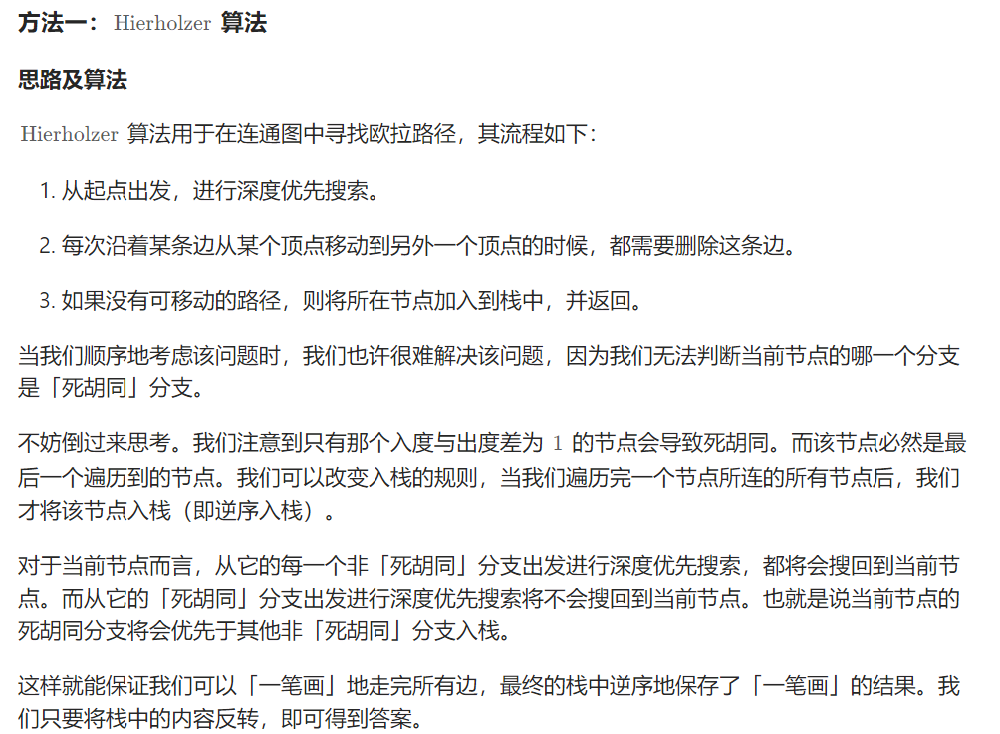

> 一笔画的问题与欧拉图或则半欧拉图有着紧密的联系
>
> - 通过图中所有边恰好一次且行遍所有顶点的**通路**称为欧拉通路；
> - 通过图中所有边恰好一次且行遍所有顶点的**回路**称为欧拉回路；
> - 具有欧拉回路的无向图称为欧拉图；
> - 具有欧拉通路但不具有欧拉回路的无向图称为半欧拉图。

> 如果没有保证至少存在一种合理的路径，我们需要判别这张图是否是欧拉图或者半欧拉图，具体地： 
>
> - 对于无向图 G，G 是欧拉图：当且仅当 G 是连通的且没有奇度顶点。
> - 对于无向图 G，G 是半欧拉图：当且仅当 G 是连通的且 G 中恰有 0 个或 2 个奇度顶点。
> - 对于有向图 G，G 是欧拉图：当且仅当 G 的所有顶点属于同一个强连通分量，且每个顶点的入度和出度相同。
> - 对于有向图 G，G 是半欧拉图当且仅当
>   - 如果将 G 中的所有有向边退化为无向边时，那么 G 的所有顶点属于同一个强连通分量；
>   - 最多只有一个顶点的出度与入度差为 1；
>   - 最多只有一个顶点的入度与出度差为 1；
>   - 所有其他顶点的入度和出度相同。

332\. 重新安排行程
------------

给你一份航线列表 `tickets` ，其中 `tickets[i] = [fromi, toi]` 表示飞机出发和降落的机场地点。请你对该行程进行重新规划排序。

所有这些机票都属于一个从 `JFK`（肯尼迪国际机场）出发的先生，所以该行程必须从 `JFK` 开始。如果存在多种有效的行程，请你按字典排序返回最小的行程组合。

*   例如，行程 `["JFK", "LGA"]` 与 `["JFK", "LGB"]` 相比就更小，排序更靠前。

假定所有机票至少存在一种合理的行程。且所有的机票 必须都用一次 且 只能用一次。

**示例 1：**


**输入：**tickets = \[\["MUC","LHR"\],\["JFK","MUC"\],\["SFO","SJC"\],\["LHR","SFO"\]\]
**输出：**\["JFK","MUC","LHR","SFO","SJC"\]

**示例 2：**


**输入：**tickets = \[\["JFK","SFO"\],\["JFK","ATL"\],\["SFO","ATL"\],\["ATL","JFK"\],\["ATL","SFO"\]\]
**输出：**\["JFK","ATL","JFK","SFO","ATL","SFO"\]
**解释：**另一种有效的行程是 \["JFK","SFO","ATL","JFK","ATL","SFO"\] ，但是它字典排序更大更靠后。

**提示：**

*   `1 <= tickets.length <= 300`
*   `tickets[i].length == 2`
*   `fromi.length == 3`
*   `toi.length == 3`
*   `fromi` 和 `toi` 由大写英文字母组成
*   `fromi != toi`

[https://leetcode.cn/problems/reconstruct-itinerary/description/](https://leetcode.cn/problems/reconstruct-itinerary/description/)

#### Hierholzer 算法（说明了为什么要逆序入栈）



```java
import java.util.*;

class Solution { // 感觉就是一个简单的dfs
    HashMap<String, PriorityQueue<String>> map = new HashMap<>();
    List<String> path = new LinkedList<>();
    public List<String> findItinerary(List<List<String>> tickets) {
        for (List<String> ticket : tickets) {
            String src = ticket.get(0), dest = ticket.get(1);
            map.computeIfAbsent(src, k -> new PriorityQueue<>()).offer(dest);
        }
        dfs("JFK");
        Collections.reverse(path); // 核心
        return path;
    }

    private void dfs(String s) {
        while (map.containsKey(s) && map.get(s).size() > 0) {
            String poll = map.get(s).poll();
            dfs(poll);
        }
        path.add(s); // 核心，这个只能放在循环体后面，不能防在前面
    }
}
```

753\. 破解保险箱
-----------

有一个需要密码才能打开的保险箱。密码是 `n` 位数, 密码的每一位都是范围 `[0, k - 1]` 中的一个数字。

保险箱有一种特殊的密码校验方法，你可以随意输入密码序列，保险箱会自动记住 **最后 `n` 位输入** ，如果匹配，则能够打开保险箱。

*   例如，正确的密码是 `"345"` ，并且你输入的是 `"012345"` ：
    *   输入 `0` 之后，最后 `3` 位输入是 `"0"` ，不正确。
    *   输入 `1` 之后，最后 `3` 位输入是 `"01"` ，不正确。
    *   输入 `2` 之后，最后 `3` 位输入是 `"012"` ，不正确。
    *   输入 `3` 之后，最后 `3` 位输入是 `"123"` ，不正确。
    *   输入 `4` 之后，最后 `3` 位输入是 `"234"` ，不正确。
    *   输入 `5` 之后，最后 `3` 位输入是 `"345"` ，正确，打开保险箱。

在只知道密码位数 `n` 和范围边界 `k` 的前提下，请你找出并返回确保在输入的 **某个时刻** 能够打开保险箱的任一 **最短** 密码序列 。

**示例 1：**

**输入：**n = 1, k = 2
**输出：**"10"
**解释：**密码只有 1 位，所以输入每一位就可以。"01" 也能够确保打开保险箱。

**示例 2：**

**输入：**n = 2, k = 2
**输出：**"01100"
**解释：**对于每种可能的密码：
- "00" 从第 4 位开始输入。
- "01" 从第 1 位开始输入。
- "10" 从第 3 位开始输入。
- "11" 从第 2 位开始输入。
  因此 "01100" 可以确保打开保险箱。"01100"、"10011" 和 "11001" 也可以确保打开保险箱。

**提示：**

*   `1 <= n <= 4`
*   `1 <= k <= 10`
*   `1 <= kn <= 4096`

[https://leetcode.cn/problems/cracking-the-safe/description/](https://leetcode.cn/problems/cracking-the-safe/description/)

> 欧拉回路的dfs会让“走投无路”的节点先入栈(ans)，也就是说最先进入ans的是最后走的边。
>
> 所以从n-1个0出发，返回的路径顺序其实应该是n-1个0 + 翻转的ans。又因为这题答案应该是对称的（把字符串一整个反转了也可以是答案，但我不知道咋证），所以官解直接返回了ans + n-1个0。

```java
import java.util.HashMap;
import java.util.HashSet;
import java.util.LinkedList;
import java.util.List;

class Solution {
    HashSet<Integer> seen = new HashSet<>();
    StringBuilder ans = new StringBuilder();
    int highest;
    int k;
    public String crackSafe(int n, int k) {
        highest = (int) Math.pow(10, n - 1);
        this.k = k;
        dfs(0);
        for (int i = 1; i < n; i++) {
            ans.append('0');
        }
        return ans.toString();
    }

    private void dfs(int node) {
        for (int x = 0; x < k; x++) {
            int y = node * 10 + x;
            if (!seen.contains(y)) {
                seen.add(y);
                dfs(y % highest);
                ans.append(x);
            }
        }
    }
}
```

2097\. 合法重新排列数对(太难了)
---------------

给你一个下标从 **0** 开始的二维整数数组 `pairs` ，其中 `pairs[i] = [starti, endi]` 。如果 `pairs` 的一个重新排列，满足对每一个下标 `i` （ `1 <= i < pairs.length` ）都有 `endi-1 == starti` ，那么我们就认为这个重新排列是 `pairs` 的一个 **合法重新排列** 。

请你返回 **任意一个** `pairs` 的合法重新排列。

**注意：**数据保证至少存在一个 `pairs` 的合法重新排列。

**示例 1：**

**输入：**pairs = \[\[5,1\],\[4,5\],\[11,9\],\[9,4\]\]
**输出：**\[\[11,9\],\[9,4\],\[4,5\],\[5,1\]\]
**解释：**
输出的是一个合法重新排列，因为每一个 endi-1 都等于 starti 。
end0 = 9 == 9 = start1 
end1 = 4 == 4 = start2
end2 = 5 == 5 = start3

**示例 2：**

**输入：**pairs = \[\[1,3\],\[3,2\],\[2,1\]\]
**输出：**\[\[1,3\],\[3,2\],\[2,1\]\]
**解释：**
输出的是一个合法重新排列，因为每一个 endi-1 都等于 starti 。
end0 = 3 == 3 = start1
end1 = 2 == 2 = start2
重新排列后的数组 \[\[2,1\],\[1,3\],\[3,2\]\] 和 \[\[3,2\],\[2,1\],\[1,3\]\] 都是合法的。

**示例 3：**

**输入：**pairs = \[\[1,2\],\[1,3\],\[2,1\]\]
**输出：**\[\[1,2\],\[2,1\],\[1,3\]\]
**解释：**
输出的是一个合法重新排列，因为每一个 endi-1 都等于 starti 。
end0 = 2 == 2 = start1
end1 = 1 == 1 = start2

**提示：**

*   `1 <= pairs.length <= 105`
*   `pairs[i].length == 2`
*   `0 <= starti, endi <= 109`
*   `starti != endi`
*   `pairs` 中不存在一模一样的数对。
*   至少 **存在** 一个合法的 `pairs` 重新排列。

[https://leetcode.cn/problems/valid-arrangement-of-pairs/description/](https://leetcode.cn/problems/valid-arrangement-of-pairs/description/)

> 这是一道有向图欧拉路径模板题。把给定的 pairs 看成图中的边，由于保证有解，题目给定的图一定满足以下二者之一：
>
> 1.所有点入度等于出度；
> 2.恰有一个点出度 = 入度 + 1（欧拉路径的起点），且恰有一个点入度 = 出度 + 1（欧拉路径的终点），其他点入度等于出度。
>
> 因此首先判断图是哪一种。对于第一种，任意选择一点开始 dfs 即可；对于第二种则选择起点开始 dfs。复杂度 O(m)。

```java
class Solution {
    Map<Integer, Integer> degree = new HashMap<>();
    Map<Integer, LinkedList<Integer>> map = new HashMap<>();
    int[][] ans;
    int n;
    List<int[]> ret = new ArrayList<>();
    public int[][] validArrangement(int[][] pairs) {
        for (int[] pair : pairs) {
            int out = pair[0], in = pair[1];
            degree.put(in, degree.getOrDefault(in, 0) + 1);
            degree.put(out, degree.getOrDefault(out, 0) - 1);
            LinkedList<Integer> list = map.getOrDefault(in, new LinkedList<>());
            list.offer(out);
            map.put(in, list);
        }
        int end = pairs[0][1];
        for (Map.Entry<Integer, Integer> entry : degree.entrySet()) {
            Integer value = entry.getValue();
            if(value == 1){
                end = entry.getKey();
                break;
            }
        }
        n = pairs.length;
        ans = new int[n][2];
        
        dfs(end);
        for(int i = 0; i < n; i++){
            ans[i] = ret.get(i);
        }
        return ans;
    }
    void dfs(int end){
        LinkedList<Integer> list = map.get(end);
        while (list != null && !list.isEmpty()){
            Integer pre = list.peekLast();
            list.pollLast();
            dfs(pre);
            ret.add(new int[]{pre, end});
        }
    }
}
```

