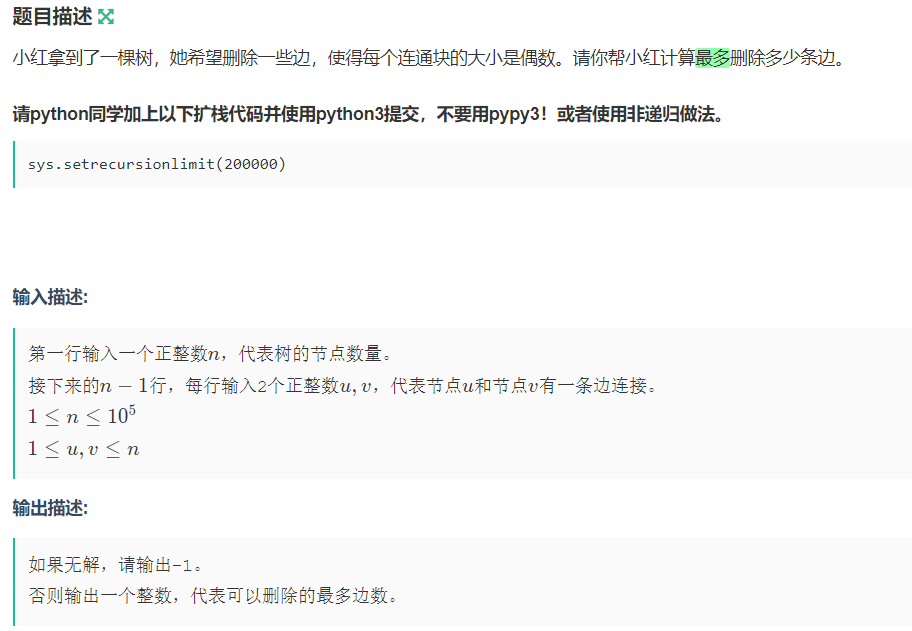
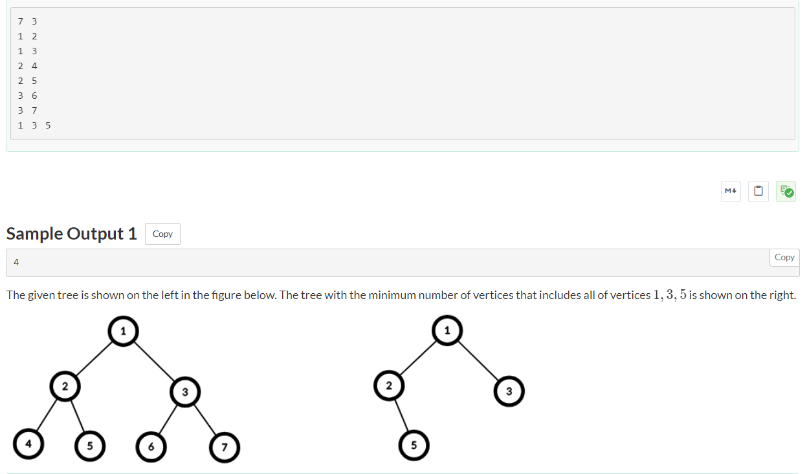
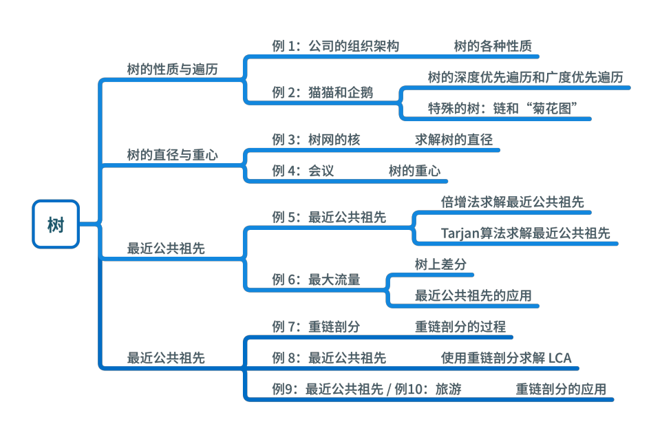

#### [【树上有多少个点到节点 u 的路径异或值恰好为 k  】](https://mp.weixin.qq.com/s?__biz=MzkyNTQ3NDAzNw==&mid=2247490257&idx=2&sn=8b686c9b474499a227c3590f333332fe&chksm=c0a7222b168354a7c9f057d565998a9bb377012ea8df89115443cf1c6d71fd7a3d14e38666cc&xtrack=1&scene=0&subscene=7&sessionid=1726323210&clicktime=1726323228&enterid=1726323228&ascene=7&fasttmpl_type=0&fasttmpl_fullversion=7382228-zh_CN-zip&fasttmpl_flag=0&realreporttime=1726323228091&devicetype=android-33&version=28002f51&nettype=ctnet&lang=zh_CN&session_us=gh_50e7adb43fb4&exportkey=n_ChQIAhIQHjYDjF3tppw%2BIK2gkYxAuhLxAQIE97dBBAEAAAAAAJEDDHaGxagAAAAOpnltbLcz9gKNyK89dVj0jGN34AU3VM6feKVbYAKd5mF2rfawUDKJoiLY9R8JRuPqheRZPULBBUJqaQMbbvNuIOv6gYZQQQ3V74Ofsdd%2FRAe3HJC%2Bwh%2FPVKyz0j4LTOISqlbzzH%2BrWGtaiOXQZKp8DceLzQ5QXbOm3bfaKnRi1ec0zQ9bmMiXnHc9TuF2W6dZDeD24ny0SFc3oA9IU%2BJN%2BmaMxj3LiUBkutqSFtoii8G43c3ypGenD332Lf08jevGvEmA6qxSrphLmfP5BF3qtooTB5zd42deyco%3D&pass_ticket=j0cA4l9Q2SjPbDLVd0jkteEb%2BvRppCOCcnApbxDnw2UmvlzCDMivRF1p%2F17hHlTT&wx_header=3)

**题目描述：**

小红有一棵由 n 个节点、 n - 1 条无向边构成的树，每条边的权值为 wi。

定义树上两个点 (u,v) 的权值为，从 u 到 v 的简单路径上，全部边权的异或和，特别的，当 u 和 v 为同一个点时，权值为 0 。

小红会提出 q 次询问，每次询问要求计算有多少个点到节点 u 的权值恰好为 k 。

树是指这样的一张图，其上的任意两个点都连通，且不存在环。

简单路径是指两个节点之间的一条路径，其不包含任何重复的节点。也就是说，在简单路径上，每个节点只能出现一次。

**输入描述**

第一行输入两个整数 n,q( 1≤n , q≤)，分别表示节点总数和询问次数。

此后 n-1 行，第 i 行输入三个整数 ui , vi 和 wi（ 1≤ui , vi≤n ; ui≠vi ; 0≤w≤ ）表示树上第 i 条边连接节点 ui 和 vi 且边权为 wi 。保证树联通，没有重边。

此后 q 行，每行输入两个整数 u,k(1≤u≤n,0≤k≤)代表被询问的节点和限定。

**输出描述**

对于每一个询问，在一行上输出一个整数，代表到节点 u 的权值恰好为 k 的节点数量。

**思路与代码：**

u到v路径的异或和=u到root路径的异或和 xor v到root路径的异或和

然后就和第一题一样了，计算每个点到root的异或和并统计数量

```
#include<cstdio>
#include<iostream>
#include<map>
#include<vector>
using namespace std;
map<long long,int>count;
long long d[200005];
long long ans=0;
vector<pair<int,long long> >g[100005];
void dfs(int u)
{
    for (auto x:g[u])
    {
        if (d[x.first]!=-1) continue;
        d[x.first]=d[u]^x.second;
        count[d[x.first]]++;
        dfs(x.first);
    }
}
int main()
{
    int n,q;
    cin>>n>>q;
    for (int i=2; i<=n; i++) d[i]=-1;
    for (int i=1; i<n; i++)
    {
        int u,v;
        long long w;
        cin>>u>>v>>w;
        g[u].push_back(make_pair(v,w));
        g[v].push_back(make_pair(u,w));
    }
    dfs(1);
    count[0]=1;
    while (q--)
    {
        int u;
        long long k;
        cin>>u>>k;
        cout<<count[d[u]^k]<<endl;
    }
    return 0;
}
```


#### [【模板】树上删边（使每个连通块大小为偶数）](https://ac.nowcoder.com/acm/contest/80743/D)



> 技巧：建树使用无向图，然后建邻接表。
>
> ​	由于树的连通分量为1，并且没有回路，所以不需要visited数组

```java
import java.io.BufferedReader;
import java.io.InputStreamReader;
import java.util.ArrayList;
import java.util.Arrays;
import java.util.List;
import java.util.Scanner;

public class Main {
    private static Scanner sc = new Scanner(new BufferedReader(new InputStreamReader(System.in)));
    static int n;
    static List<Integer>[] g;
    static int[] size;
    static long ans = 0;

    public static void main(String[] args) {
        n = sc.nextInt();
        size = new int[n + 1];
        g = new ArrayList[n + 1];
        Arrays.setAll(g, e -> new ArrayList<>());
        while (sc.hasNext()) {
            int x = sc.nextInt(), y = sc.nextInt();
            g[x].add(y);
            g[y].add(x);
        }
        if ((n & 1) == 1) {
            System.out.println(-1);
        }else{
            dfs(1, 0);
            for (int i = 1; i <= n; i++) {
                if (size[i] == 0) {
                    continue;
                }
                if ((size[i] & 1) == 0) {
                    ans++;
                }
            }
            System.out.println(ans - 1);
        }
        sc.close();
    }

    private static void dfs(int x, int fa) {
        size[x] = 1;
        for (int y : g[x]) {
            if (y != fa) {
                dfs(y, x);
                size[x] += size[y];
            }
        }
    }
}
```
#### 【模板】树上倍增和LCA(树上祖先)

> LCA问题
>
> 给定树上的任意两点a和b，如何快速查询出a和b的最低公共祖先，常见的有三个方法
>
> 1）树上倍增
>
> 2）tarjan算法+并查集
>
> 3）树链剖分

**1483\. 树节点的第 K 个祖先（树上倍增）**

给你一棵树，树上有 `n` 个节点，按从 `0` 到 `n-1` 编号。树以父节点数组的形式给出，其中 `parent[i]` 是节点 `i` 的父节点。树的根节点是编号为 `0` 的节点。

树节点的第 _`k`_ 个祖先节点是从该节点到根节点路径上的第 `k` 个节点。

实现 `TreeAncestor` 类：

*   `TreeAncestor（int n， int[] parent）` 对树和父数组中的节点数初始化对象。
*   `getKthAncestor``(int node, int k)` 返回节点 `node` 的第 `k` 个祖先节点。如果不存在这样的祖先节点，返回 `-1` 。

**示例 1：**

****

**输入：**
\["TreeAncestor","getKthAncestor","getKthAncestor","getKthAncestor"\]
\[\[7,\[-1,0,0,1,1,2,2\]\],\[3,1\],\[5,2\],\[6,3\]\]

**输出：**
\[null,1,0,-1\]

**解释：**
TreeAncestor treeAncestor = new TreeAncestor(7, \[-1, 0, 0, 1, 1, 2, 2\]);

treeAncestor.getKthAncestor(3, 1);  // 返回 1 ，它是 3 的父节点
treeAncestor.getKthAncestor(5, 2);  // 返回 0 ，它是 5 的祖父节点
treeAncestor.getKthAncestor(6, 3);  // 返回 -1 因为不存在满足要求的祖先节点

**提示：**

*   `1 <= k <= n <= 5 * 104`
*   `parent[0] == -1` 表示编号为 `0` 的节点是根节点。
*   对于所有的 `0 < i < n` ，`0 <= parent[i] < n` 总成立
*   `0 <= node < n`
*   至多查询 `5 * 104` 次

[https://leetcode.cn/problems/kth-ancestor-of-a-tree-node/description/](https://leetcode.cn/problems/kth-ancestor-of-a-tree-node/description/)

> 链式前向星建图，方法一比较万能

```java
class TreeAncestor { // 推荐模板，理解
    private int[][] dp;

    public TreeAncestor(int n, int[] parent) {
        int m = 32 - Integer.numberOfLeadingZeros(n);
        dp = new int[n][m]; // dp[x][j]表示节点x的2^j个祖先节点，如果x没有祖先，则dp[x][j] = -1
        for (int i = 0; i < n; i++) {
            dp[i][0] = parent[i];
        }
        for (int i = 0; i < m - 1; i++) {
            for (int x = 0; x < n; x++) {
                int p = dp[x][i];
                dp[x][i + 1] = p < 0 ? -1 : dp[p][i];
            }
        }
    }

    public int getKthAncestor(int node, int k) {
        int m = 32 - Integer.numberOfLeadingZeros(k); // k的二进制长度
        for (int i = 0; i < m; i++) {
            // k的二进制从低到高位是1
            if (((k >> i) & 1) == 1) {
                node = dp[node][i];
                if (node < 0) {
                    break; // 没有祖先节点
                }
            }
        }
        return node;
    }
}

/**
 * Your TreeAncestor object will be instantiated and called as such:
 * TreeAncestor obj = new TreeAncestor(n, parent);
 * int param_1 = obj.getKthAncestor(node,k);
 */
```

```java
import java.util.Arrays;

class TreeAncestor { // 不需要理解，别看
    private static int MAXN = 50001;
    private static int power;
    private static int cnt;

    // 链式前向星建图
    public static int[] head = new int[MAXN]; // 头结点数组，用于存储每个顶点的第一条边的索引。 [索引，值] = [头边号，点号]

    public static int[] next = new int[MAXN]; // 邻接边表数组，用于存储每条边的下一条边的索引。 [索引，值] = [下一条边号，边号]

    public static int[] to = new int[MAXN]; // 目标节点数组，用于存储每条边的目标节点。 [索引，值] = [边号，去往的点]

    // deep[i] : 节点i在第几层
    private static int[] deep = new int[MAXN];

    // stjump[i][p] : 节点i往上跳2的p次方步，到达的节点编号
    private static int[][] stjump = new int[MAXN][32]; // 针对这个题：这里的32修改为17可以快30ms

    public TreeAncestor(int n, int[] parent) {
        power = 32 - Integer.numberOfLeadingZeros(n);
        cnt = 1; // 初始化为1
        Arrays.fill(head, 0); // 如果head[i] = 0，表示没有边与这个点相连
        for (int i = 1; i < parent.length; i++) { // 这里下标从1开始，因为parent[0] = -1, 直接跳过
            addEdge(parent[i], i);
        }
        dfs(0, 0);
    }

    private static void addEdge(int u, int v) { // u -> v
        next[cnt] = head[u]; // 类似链表的next，这是下一条边的索引
        to[cnt] = v; // 第cnt条边指向节点v
        head[u] = cnt++;// 节点u有第cnt条边
    }

    private static void dfs(int x, int fa) {
        if (x == 0) {
            deep[x] = 1;
        }else{
            deep[x] = deep[fa] + 1;
        }
        stjump[x][0] = fa;
        for (int i = 1; i <= power; i++) {
            stjump[x][i] = stjump[stjump[x][i - 1]][i - 1]; // 递推式，举例：比如i = 3我们往上走2^2 = 4步,到达节点a,a再往上走2^2 = 4步，就到b，也就是第8步的位置
        }
        for (int e = head[x]; e != 0; e = next[e]) {
            dfs(to[e], x);
        }
    }

    public int getKthAncestor(int node, int k) { // 节点node的第k个祖先节点
        if (deep[node] <= k) {
            return -1;
        }
        // s是想要去往的层数
        int s = deep[node] - k;
        for (int p = 32 - Integer.numberOfLeadingZeros(k); p >= 0; p--) { // 这里使用位运算也行
            if (deep[stjump[node][p]] >= s) {
                node = stjump[node][p];
            }
        }
        return node;
    }
}

/**
 * Your TreeAncestor object will be instantiated and called as such:
 * TreeAncestor obj = new TreeAncestor(n, parent);
 * int param_1 = obj.getKthAncestor(node,k);
 */
```

#### 【模板】最近公共祖先（LCA）

> ## 题目描述
>
> 如题，给定一棵有根多叉树，请求出指定两个点直接最近的公共祖先。
>
> ## 输入格式
>
> 第一行包含三个正整数 $N,M,S$，分别表示树的结点个数、询问的个数和树根结点的序号。
>
> 接下来 $N-1$ 行每行包含两个正整数 $x, y$，表示 $x$ 结点和 $y$ 结点之间有一条直接连接的边（数据保证可以构成树）。
>
> 接下来 $M$ 行每行包含两个正整数 $a, b$，表示询问 $a$ 结点和 $b$ 结点的最近公共祖先。
>
> ## 输出格式
>
> 输出包含 $M$ 行，每行包含一个正整数，依次为每一个询问的结果。
>
> ## 样例 #1
>
> ### 样例输入 #1
>
> ```
> 5 5 4
> 3 1
> 2 4
> 5 1
> 1 4
> 2 4
> 3 2
> 3 5
> 1 2
> 4 5
> ```
>
> ### 样例输出 #1
>
> ```
> 4
> 4
> 1
> 4
> 4
> ```
>
> ## 提示
>
> 对于 $30\%$ 的数据，$N\leq 10$，$M\leq 10$。
>
> 对于 $70\%$ 的数据，$N\leq 10000$，$M\leq 10000$。
>
> 对于 $100\%$ 的数据，$1 \leq N,M\leq 500000$，$1 \leq x, y,a ,b \leq N$，**不保证** $a \neq b$。
>
>
> 样例说明：
>
> 该树结构如下：
>
>   
>
> 第一次询问：$2, 4$ 的最近公共祖先，故为 $4$。
>
> 第二次询问：$3, 2$ 的最近公共祖先，故为 $4$。
>
> 第三次询问：$3, 5$ 的最近公共祖先，故为 $1$。
>
> 第四次询问：$1, 2$ 的最近公共祖先，故为 $4$。
>
> 第五次询问：$4, 5$ 的最近公共祖先，故为 $4$。
>
> 故输出依次为 $4, 4, 1, 4, 4$。
>
> 2021/10/4 数据更新 @fstqwq：应要求加了两组数据卡掉了暴力跳。

```java
import java.util.ArrayList;
import java.util.Arrays;
import java.util.List;

class TreeAncestor{
    private int[] depth;
    private int[][] dp;
    private List<Integer>[] g;

    public TreeAncestor(int[][] edges) {
        int n = edges.length + 1; // 树的节点个数 == 边 + 1
        int m = 32 - Integer.numberOfLeadingZeros(n); // 最多m层
        g = new List[n];
        Arrays.setAll(g, e -> new ArrayList<Integer>());
        for (int[] edge : edges) {
            int x = edge[0], y = edge[1];
            g[x].add(y);
            g[y].add(x);
        }
        depth = new int[n];
        dp = new int[n][m];
        dfs(0, -1);

        for (int i = 0; i < m - 1; i++) {
            for (int x = 0; x < n; x++) {
                int p = dp[x][i];
                dp[x][i + 1] = p < 0 ? -1 : dp[p][i];
            }
        }
    }

    private void dfs(int x, int fa) { // 初始化父亲节点，获取每个节点的深度
        dp[x][0] = fa;
        for (int y : g[x]) {
            if (y != fa) {
                depth[y] = depth[x] + 1;
                dfs(y, x);
            }
        }
    }

    public int getKthAncestor(int node, int k) { // 获取node的第k个祖先
        int m = 32 - Integer.numberOfLeadingZeros(k);
        for (int i = 0; i < m; i++) {
            if (((k >> i) & 1) == 1) {
                node = dp[node][i];
                if (node < 0) {
                    break;
                }
            }
        }
        return node;
    }

    public int getLCA(int x, int y) {
        if (depth[x] > depth[y]) {
            int tmp = y;
            y = x;
            x = tmp;
        }
        // 使y和x在同一深度
        y = getKthAncestor(y, depth[y] - depth[x]);
        if (y == x) {
            return x;
        }
        for (int i = dp[x].length - 1; i >= 0; i--) {
            int px = dp[x][i], py = dp[y][i];
            if (px != py) {
                x = px;
                y = py;
            }
        }
        return dp[x][0];
    }
}
```

```java
import java.io.*;
import java.math.BigInteger;
import java.util.ArrayList;
import java.util.Arrays;
import java.util.List;
import java.util.StringTokenizer;

public class Main { // 完整代码
    private static void solve() throws IOException {
        int n = sc.nextInt(), m = sc.nextInt(), s = sc.nextInt();
        int[][] edges = new int[n - 1][2];
        for (int i = 0; i < n - 1; i++) {
            edges[i][0] = sc.nextInt() - 1;
            edges[i][1] = sc.nextInt() - 1;
        }
        TreeAncestor treeAncestor = new TreeAncestor(edges, s - 1);
        while (m-- > 0) {
            int x = sc.nextInt() - 1, y = sc.nextInt() - 1;
            sc.println(treeAncestor.getLCA(x, y) + 1);
        }
    }


     static class TreeAncestor{
        private int[] depth;
        private int[][] dp;
        private List<Integer>[] g;

        public TreeAncestor(int[][] edges, int root) {
            int n = edges.length + 1; // 树的节点个数 == 边 + 1
            int m = 32 - Integer.numberOfLeadingZeros(n); // 最多m层
            g = new List[n];
            Arrays.setAll(g, e -> new ArrayList<Integer>());
            for (int[] edge : edges) {
                int x = edge[0], y = edge[1];
                g[x].add(y);
                g[y].add(x);
            }
            depth = new int[n];
            dp = new int[n][m];
            dfs(root, -1);

            for (int i = 0; i < m - 1; i++) {
                for (int x = 0; x < n; x++) {
                    int p = dp[x][i];
                    dp[x][i + 1] = p < 0 ? -1 : dp[p][i];
                }
            }
        }

        private void dfs(int x, int fa) { // 初始化父亲节点，获取每个节点的深度
            dp[x][0] = fa;
            for (int y : g[x]) {
                if (y != fa) {
                    depth[y] = depth[x] + 1;
                    dfs(y, x);
                }
            }
        }

        public int getKthAncestor(int node, int k) { // 获取node的第k个祖先
            int m = 32 - Integer.numberOfLeadingZeros(k);
            for (int i = 0; i < m; i++) {
                if (((k >> i) & 1) == 1) {
                    node = dp[node][i];
                    if (node < 0) {
                        break;
                    }
                }
            }
            return node;
        }

        public int getLCA(int x, int y) {
            if (depth[x] > depth[y]) {
                int tmp = y;
                y = x;
                x = tmp;
            }
            // 使y和x在同一深度
            y = getKthAncestor(y, depth[y] - depth[x]);
            if (y == x) {
                return x;
            }
            for (int i = dp[x].length - 1; i >= 0; i--) {
                int px = dp[x][i], py = dp[y][i];
                if (px != py) {
                    x = px;
                    y = py;
                }
            }
            return dp[x][0];
        }
    }
}
```


```java
import java.io.*;
import java.util.Arrays;

public class Main { // 不要看，跳过
    public static int MAXN = 500001;

    public static int LIMIT = 20;

    // 根据节点个数n，计算出2的几次方就够用了
    public static int power;

    // 链式前向星建图
    public static int[] head = new int[MAXN];

    public static int[] next = new int[MAXN << 1];

    public static int[] to = new int[MAXN << 1];

    public static int cnt;

    // deep[i] : 节点i在第几层
    public static int[] deep = new int[MAXN];

    // stjump[i][p] : 节点i往上跳2的p次方步，到达的节点编号
    public static int[][] stjump = new int[MAXN][LIMIT];
    public static void build(int n) {
        power = 32 - Integer.numberOfLeadingZeros(n);
        cnt = 1;
        Arrays.fill(head, 1, n + 1, 0);
    }

    public static void addEdge(int u, int v) {
        next[cnt] = head[u];
        to[cnt] = v;
        head[u] = cnt++;
    }

    // dfs递归版
    // 一般来说都这么写，但是本题附加的测试数据很毒
    // java这么写就会因为递归太深而爆栈，c++这么写就能通过
    public static void dfs(int x, int fa) {
        deep[x] = deep[fa] + 1;
        stjump[x][0] = fa;
        for (int p = 1; p <= power; p++) {
            stjump[x][p] = stjump[stjump[x][p - 1]][p - 1];
        }
        for (int e = head[x]; e != 0; e = next[e]) {
            if (to[e] != fa) {
                dfs(to[e], x);
            }
        }
    }

    private static int lca(int a, int b) {
        if (deep[a] < deep[b]) {
            int tmp = a;
            a = b;
            b = tmp;
        }
        for (int p = power; p >= 0; p--) {
            if (deep[stjump[a][p]] >= deep[b]) {
                a = stjump[a][p];
            }
        }
        if (a == b) {
            return a;
        }
        // a和b在同一层
        for (int p = power; p >= 0; p--) {
            if (stjump[a][p] != stjump[b][p]) {
                a = stjump[a][p];
                b = stjump[b][p];
            }
        }
        return stjump[a][0];
    }
    public static void main(String[] args) throws IOException {
        BufferedReader br = new BufferedReader(new InputStreamReader(System.in));
        StreamTokenizer in = new StreamTokenizer(br);
        PrintWriter out = new PrintWriter(new OutputStreamWriter(System.out));
        in.nextToken();
        int n = (int) in.nval;
        in.nextToken();
        int m = (int) in.nval;
        in.nextToken();
        int root = (int) in.nval;
        build(n);
        for (int i = 1, u, v; i < n; i++) {
            in.nextToken();
            u = (int) in.nval;
            in.nextToken();
            v = (int) in.nval;
            addEdge(u, v);
            addEdge(v, u);
        }
        dfs(root, 0);
        for (int i = 1, a, b; i <= m; i++) {
            in.nextToken();
            a = (int) in.nval;
            in.nextToken();
            b = (int) in.nval;
            out.println(lca(a, b));
        }
        out.flush();
        out.close();
        br.close();
    }
}
```

#### [【模板】求一棵树到达关键节点的最少节点数目](https://atcoder.jp/contests/abc368/tasks/abc368_d)



```java
class Main{
        private static String[] ss;
    private static String s;

    private static List<Integer>[] g;
    static int maxN = 200010;
    private static int[] vs = new int[maxN];

    // https://atcoder.jp/contests/abc368/tasks/abc368_d  树：求一棵树到达关键节点的最少节点数目
    private static void solveD() throws IOException {
        int n = sc.nextInt();
        int k = sc.nextInt(), x = 0, y = 0;
        g = new List[n];
        Arrays.setAll(g, e -> new ArrayList<>());
        for (int i = 0; i < n - 1; i++) {
            ss = sc.nextLine().split(" ");
            x = Integer.parseInt(ss[0]) - 1;
            y = Integer.parseInt(ss[1]) - 1;
            g[x].add(y);
            g[y].add(x);
        }
        ss = sc.nextLine().split(" ");
        for (int i = 0; i < k; i++) {
            x = Integer.parseInt(ss[i]) - 1;
            vs[x]++;
        }
        dfs(x, -1);
        int ans = 0;
        for (int i = 0; i <= n; i++) {
            if (vs[i] > 0) {
                ans++;
            }
        }
        sc.println(ans);
    }
    private static void dfs(int x, int fa) { // 核心
        for (int y : g[x]) {
            if (y != fa) {
                dfs(y, x);
                vs[x] += vs[y];
            }
        }
    }
}
```


 

#### [【模板】树的遍历dfs + 统计到root距离不超过d的节点数目](https://www.luogu.com.cn/problem/P5908)

```java
public class Main {
    public static void main(String[] args) throws IOException {
        // int T = sc.nextInt();
        while (T-- > 0) {
            solve();
            // sc.bw.flush();
        }
        sc.bw.flush();
        sc.bw.close();
    }

    private static String[] ss;
    private static String s;
    private static List<Integer>[] g;

    private static void solve() throws IOException {
        int n = sc.nextInt(), d = sc.nextInt();
        g = new List[n];
        Arrays.setAll(g, e -> new ArrayList<>());
        for (int i = 0; i < n - 1; i++) {
            ss = sc.nextLine().split(" ");
            int x = Integer.parseInt(ss[0]) - 1, y = Integer.parseInt(ss[1]) - 1;
            g[x].add(y);
            g[y].add(x);
        }
        sc.println(dfs(0, -1, d) - 1); //减去初始点
    }

    private static int dfs(int x, int fa, int d) {
        if (d < 0) {
            return 0;
        }
        int res = 1;
        for (int y : g[x]) {
            if (y != fa) {
                res += dfs(y, x, d - 1);
            }
        }
        return res;
    }
}
```

#### [【模板】树的直径(上的核心路径，求任意点到核心路径的最长距离最小)](https://www.luogu.com.cn/problem/P1099)

> 两次dfs求图的直径，从点1出发最远点为x, 然后从点x出发最远点为y。那么路径x-y就图的直径
>
> 然后用长度为s的滑动窗口在直径上面滑动，枚举端点到x-y的最远距离

```java
public class Main{
    private static List<int[]>[] g;
    private static int[] fas;
    private static int[] dist;
    private static int k;
    static boolean[] visited;
    private static void dfs(int x, int fa) {
        fas[x] = fa;
        for (int[] y : g[x]) {
            if (y[0] != fa && !visited[y[0]]) {
                dist[y[0]] = dist[x] + y[1];
                if (dist[y[0]] > dist[k]) {
                    k = y[0];
                    dist[k] = dist[y[0]];
                }
                dfs(y[0], x);
            }
        }
    }
    
	private static void solve() throws IOException {
        int n = sc.nextInt(), s = sc.nextInt();
        g = new List[n + 1];
        fas = new int[n + 1];
        dist = new int[n + 1];
        visited = new boolean[n + 1];
        Arrays.setAll(g, e -> new ArrayList<int[]>());
        for (int i = 0; i < n - 1; i++) {
            ss = sc.nextLine().split(" ");
            int x = Integer.parseInt(ss[0]), y = Integer.parseInt(ss[1]), z = Integer.parseInt(ss[2]);
            g[x].add(new int[]{y, z});
            g[y].add(new int[]{x, z});
        }
        k = 0;
        dfs(1, 0); // acm里面下标一般从1开始
        dist[k] = 0;
        dfs(k, 0);
        int root = k;
        int ans = Integer.MAX_VALUE;
        for (int i = root, j = root; i != 0; i = fas[i]) {
            while (dist[j] - dist[i] > s) {
                j = fas[j];
            }
            ans = Math.min(ans, Math.max(dist[root] - dist[j], dist[i]));
        }
        for (int i = root; i != 0; i = fas[i]) {
            visited[i] = true;
        }
        for (int i = root; i != 0; i = fas[i]) {
            k = i;
            dist[k] = 0;
            dfs(i, fas[i]);
        }
        for (int i = 1; i <= n; i++) {
            ans = Math.max(ans, dist[i]);
        }
        sc.println(ans);
    }
}
```

#### [【模板】任意节点到其他点的距离](https://www.luogu.com.cn/problem/P1099)

```java
import java.io.*;
import java.math.BigInteger;
import java.util.ArrayList;
import java.util.Arrays;
import java.util.List;
import java.util.StringTokenizer;

public class Main {
    static Read sc = new Read();
    private static final int Mod = (int) 1e9 + 7;
    private static int T = 1;

    public static void main(String[] args) throws IOException {
        // int T = sc.nextInt();
        while (T-- > 0) {
            solve();
            // sc.bw.flush();
        }
        sc.bw.flush();
        sc.bw.close();
    }

    private static String[] ss;
    private static String s;
    private static char[] cs;
    private static List<Integer>[] g;
    private static int n;

    private static int[] size, ans;


    private static void solve() throws IOException {
        int n = sc.nextInt();
        g = new List[n];
        Arrays.setAll(g, e -> new ArrayList<>());
        for (int i = 0; i < n - 1; i++) {
            int x = sc.nextInt() - 1, y = sc.nextInt() - 1;
            g[x].add(y);
            g[y].add(x);
        }
        size = new int[n];
        ans = new int[n];
        dfs(0, -1, 0);
        reRoot(0, -1);
        int mnId = -1, mnV = Integer.MAX_VALUE;
        for (int i = 0; i < n; i++) {
            if (mnV > ans[i]) {
                mnV = ans[i];
                mnId = i;
            }
        }
        sc.println((mnId + 1) + " " + mnV);
    }

    private static void dfs(int x, int fa, int depth) {
        ans[0] += depth;
        size[x] = 1;
        for (int y : g[x]) {
            if (y != fa) {
                dfs(y, x, depth + 1);
                size[x] += size[y];
            }
        }
    }

    private static void reRoot(int x, int fa) {
        for (int y : g[x]) {
            if (y != fa) {
                ans[y] = ans[x] + g.length - 2 * size[y];
                reRoot(y, x);
            }
        }
    }
}
```

#### [【模板】树上差分](https://www.luogu.com.cn/problem/P3128)

```java
 private static void solve() throws IOException { // LCA + 树上差分
        int n = sc.nextInt(), k = sc.nextInt();
        int[][] edges = new int[n - 1][2];
        for (int i = 0; i < n - 1; i++) {
            edges[i][0] = sc.nextInt() - 1;
            edges[i][1] = sc.nextInt() - 1;
        }
        TreeAncestor treeAncestor = new TreeAncestor(edges,0);
        diff = new int[n];
        while (k-- > 0) {
            int x = sc.nextInt() - 1, y = sc.nextInt() - 1;
            diff[x]++;
            diff[y]++;
            int lca = treeAncestor.getLCA(x, y);
            diff[lca]--;
            if (treeAncestor.dp[lca][0] != -1) {
                diff[treeAncestor.dp[lca][0]]--; // 祖先节点的父亲节点--，防止向父节点扩展
            }
        }
        dfs(0, -1, treeAncestor.g, diff);
        sc.println(ans);
    }

    static int ans = 0;
    static int[] diff;
    private static void dfs(int x, int fa,List<Integer>[] g, int[] diff) { // 树上差分
        for (int y : g[x]) {
            if (y != fa) {
                dfs(y, x, g, diff);
                diff[x] += diff[y];
            }
        }
        ans = Math.max(ans, diff[x]);
    }


     static class TreeAncestor{ // LCA
        private int[] depth;
        private int[][] dp;
        private List<Integer>[] g;

        public TreeAncestor(int[][] edges, int root) {
            int n = edges.length + 1; // 树的节点个数 == 边 + 1
            int m = 32 - Integer.numberOfLeadingZeros(n); // 最多m层
            g = new List[n];
            Arrays.setAll(g, e -> new ArrayList<Integer>());
            for (int[] edge : edges) {
                int x = edge[0], y = edge[1];
                g[x].add(y);
                g[y].add(x);
            }
            depth = new int[n];
            dp = new int[n][m];
            dfs(root, -1);

            for (int i = 0; i < m - 1; i++) {
                for (int x = 0; x < n; x++) {
                    int p = dp[x][i];
                    dp[x][i + 1] = p < 0 ? -1 : dp[p][i];
                }
            }
        }

        private void dfs(int x, int fa) { // 初始化父亲节点，获取每个节点的深度
            dp[x][0] = fa;
            for (int y : g[x]) {
                if (y != fa) {
                    depth[y] = depth[x] + 1;
                    dfs(y, x);
                }
            }
        }

        public int getKthAncestor(int node, int k) { // 获取node的第k个祖先
            int m = 32 - Integer.numberOfLeadingZeros(k);
            for (int i = 0; i < m; i++) {
                if (((k >> i) & 1) == 1) {
                    node = dp[node][i];
                    if (node < 0) {
                        break;
                    }
                }
            }
            return node;
        }

        public int getLCA(int x, int y) {
            if (depth[x] > depth[y]) {
                int tmp = y;
                y = x;
                x = tmp;
            }
            // 使y和x在同一深度
            y = getKthAncestor(y, depth[y] - depth[x]);
            if (y == x) {
                return x;
            }
            for (int i = dp[x].length - 1; i >= 0; i--) {
                int px = dp[x][i], py = dp[y][i];
                if (px != py) {
                    x = px;
                    y = py;
                }
            }
            return dp[x][0];
        }
    }
```

#### [【模板】树上时间戳](https://leetcode.cn/problems/minimum-score-after-removals-on-a-tree/description/)

```java
import java.util.ArrayList;
import java.util.Arrays;
import java.util.List;

class Solution {
    List<Integer>[] g;
    int[] nums, xor, in, out;
    int clock = 0;
    public int minimumScore(int[] nums, int[][] edges) {
        int n = nums.length;
        g = new List[n];
        Arrays.setAll(g, e -> new ArrayList<>());
        for (int[] edge : edges) {
            int x = edge[0], y = edge[1];
            g[x].add(y);
            g[y].add(x);
        }
        this.nums = nums;
        xor = new int[n];
        in = new int[n];
        out = new int[n];
        dfs(0, -1);
        int ans = Integer.MAX_VALUE;
        // 枚举删除哪两条边
        // 代码实现时，由于不知道 edges[i] 两个点的父子关系，枚举边的写法需要额外的判断。我们可以改为枚举不是根的两个点，删除这两个点及其父节点形成的边，这样代码更简洁，效率也略优于枚举边的写法。
        for (int i = 2, x, y, z; i < n; i++) {
            for (int j = 1; j < i; j++) {
                // i是j的祖先
                if (in[i] < in[j] && in[j] <= out[i]) {
                    x = xor[j];
                    y = xor[i] ^ x;
                    z = xor[0] ^ xor[i];
                } else if (in[j] < in[i] && in[i] <= out[j]) { // j是i的祖先
                    x = xor[i];
                    y = xor[j] ^ x;
                    z = xor[0] ^ xor[j];
                }else{ // 删除的两条边分别属于两颗不相交的子树
                    x = xor[i];
                    y = xor[j];
                    z = xor[0] ^ x ^ y;
                }
                ans = Math.min(ans, Math.max(Math.max(x, y), z) - Math.min(Math.min(x, y), z));
                if (ans == 0) return 0; // 提前退出
            }
        }
        return ans;
    }

    private void dfs(int x, int fa) { // 求出每个以x为根节点的子树（包括x）的异或值
        in[x] = ++clock;
        xor[x] = nums[x];
        for (int y : g[x]) {
            if (y != fa) {
                dfs(y, x);
                xor[x] ^= xor[y];
            }
        }
        out[x] = clock;
    }
}
```

#### [【模板】树上时间戳 + 马拉车](https://leetcode.cn/problems/check-if-dfs-strings-are-palindromes/) 

```java
import java.util.ArrayList;
import java.util.Arrays;
import java.util.List;

class Solution {
    private int time = 0;

    public boolean[] findAnswer(int[] parent, String s) {
        int n = parent.length;
        List<Integer>[] g = new ArrayList[n];
        Arrays.setAll(g, i -> new ArrayList<>());
        for (int i = 1; i < n; i++) {
            int p = parent[i];
            // 由于 i 是递增的，所以 g[p] 必然是有序的，下面无需排序
            g[p].add(i);
        }

        // dfsStr 是后序遍历整棵树得到的字符串
        char[] dfsStr = new char[n];
        // nodes[i] 表示子树 i 的后序遍历的开始时间戳和结束时间戳+1（左闭右开区间）
        int[][] nodes = new int[n][2];
        dfs(0, g, s.toCharArray(), dfsStr, nodes);

        // Manacher 模板
        // 将 dfsStr 改造为 t，这样就不需要讨论 n 的奇偶性，因为新串 t 的每个回文子串都是奇回文串（都有回文中心）
        // dfsStr 和 t 的下标转换关系：
        // (dfsStr_i+1)*2 = ti
        // ti/2-1 = dfsStr_i
        // ti 为偶数，对应奇回文串（从 2 开始）
        // ti 为奇数，对应偶回文串（从 3 开始）
        char[] t = new char[n * 2 + 3];
        Arrays.fill(t, '#');
        t[0] = '^';
        for (int i = 0; i < n; i++) {
            t[i * 2 + 2] = dfsStr[i];
        }
        t[n * 2 + 2] = '$';

        // 定义一个奇回文串的回文半径=(长度+1)/2，即保留回文中心，去掉一侧后的剩余字符串的长度
        // halfLen[i] 表示在 t 上的以 t[i] 为回文中心的最长回文子串的回文半径
        // 即 [i-halfLen[i]+1,i+halfLen[i]-1] 是 t 上的一个回文子串
        int[] halfLen = new int[t.length - 2];
        halfLen[1] = 1;
        // boxR 表示当前右边界下标最大的回文子串的右边界下标+1
        // boxM 为该回文子串的中心位置，二者的关系为 r=mid+halfLen[mid]
        int boxM = 0;
        int boxR = 0;
        for (int i = 2; i < halfLen.length; i++) { // 循环的起止位置对应着原串的首尾字符
            int hl = 1;
            if (i < boxR) {
                // 记 i 关于 boxM 的对称位置 i'=boxM*2-i
                // 若以 i' 为中心的最长回文子串范围超出了以 boxM 为中心的回文串的范围（即 i+halfLen[i'] >= boxR）
                // 则 halfLen[i] 应先初始化为已知的回文半径 boxR-i，然后再继续暴力匹配
                // 否则 halfLen[i] 与 halfLen[i'] 相等
                hl = Math.min(halfLen[boxM * 2 - i], boxR - i);
            }
            // 暴力扩展
            // 算法的复杂度取决于这部分执行的次数
            // 由于扩展之后 boxR 必然会更新（右移），且扩展的的次数就是 boxR 右移的次数
            // 因此算法的复杂度 = O(len(t)) = O(n)
            while (t[i - hl] == t[i + hl]) {
                hl++;
                boxM = i;
                boxR = i + hl;
            }
            halfLen[i] = hl;
        }

        // t 中回文子串的长度为 hl*2-1
        // 由于其中 # 的数量总是比字母的数量多 1
        // 因此其在 dfsStr 中对应的回文子串的长度为 hl-1
        // 这一结论可用在下面的判断回文串中

        boolean[] ans = new boolean[n];
        for (int i = 0; i < n; i++) {
            // 判断左闭右开区间 [l,r) 是否为回文串  0<=l<r<=n
            // 根据下标转换关系得到 dfsStr 的 [l,r) 子串在 t 中对应的回文中心下标为 l+r+1
            // 需要满足 halfLen[l + r + 1] - 1 >= r - l，即 halfLen[l + r + 1] > r - l
            int l = nodes[i][0];
            int r = nodes[i][1];
            ans[i] = halfLen[l + r + 1] > r - l;
        }
        return ans;
    }

    private void dfs(int x, List<Integer>[] g, char[] s, char[] dfsStr, int[][] nodes) {
        nodes[x][0] = time;
        for (int y : g[x]) {
            dfs(y, g, s, dfsStr, nodes);
        }
        dfsStr[time++] = s[x]; // 后序遍历
        nodes[x][1] = time;
    }
}
```

#### 【模板】树上滑窗

https://leetcode.cn/problems/longest-special-path/description/

```java
import java.util.*;

class Solution {
    List<int[]>[] g;
    int n;
    public int[] longestSpecialPath(int[][] edges, int[] nums) {
        n = edges.length + 1;
        g = new List[n];
        Arrays.setAll(g, e -> new ArrayList<>());
        for (int[] e : edges) {
            int x = e[0], y = e[1], z = e[2];
            g[x].add(new int[]{y, z});
            g[y].add(new int[]{x, z});
        }
        ArrayList<Integer> dist = new ArrayList<>();
        dist.add(0);
        HashMap<Integer, Integer> map = new HashMap<>();
        dfs(0, -1, 0, nums, dist, map);
        return new int[]{mxLen, mnNum};
    }
    
    int mxLen = -1, mnNum = 0;

    private void dfs(int x, int fa,int topDepth, int[] nums, List<Integer> dist, Map<Integer, Integer> map) {
        int color = nums[x];
        int oldDepth = map.getOrDefault(color, 0);
        topDepth = Math.max(topDepth, oldDepth);
        int disX = dist.get(dist.size() - 1);
        int len = disX - dist.get(topDepth);
        int nodes = dist.size() - topDepth;
        if (len > mxLen || len == mxLen && nodes < mnNum) {
            mxLen = len;
            mnNum = nodes;
        }

        map.put(color, dist.size());
        for (int[] e : g[x]) {
            int y = e[0];
            if (y != fa) {
                dist.add(disX + e[1]);
                dfs(y, x, topDepth, nums, dist, map);
                dist.remove(dist.size() - 1);
            }
        }
        map.put(color, oldDepth);
    }
}
```


