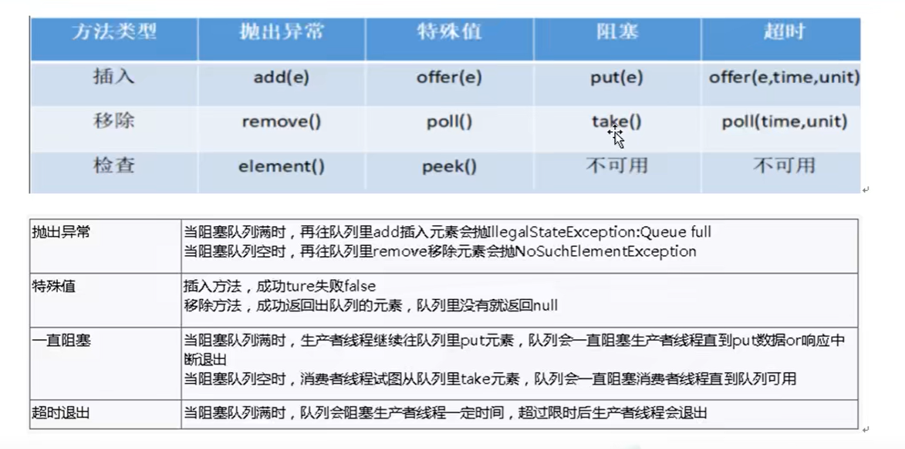
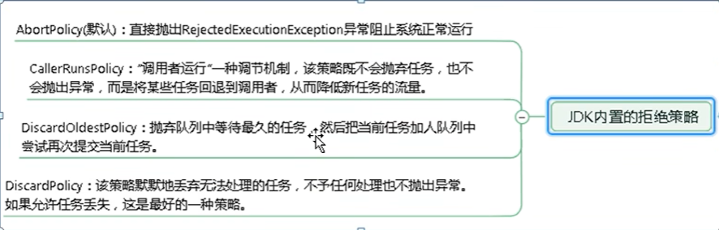
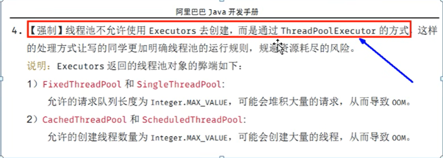

[TOC]


------

计划：

1. 解释 `synchronized` 关键字的特点和用法。
2. 解释 `Lock` 接口的特点和用法。
3. 比较 `synchronized` 和 `Lock` 的主要区别。

### `synchronized` 关键字
- **内置锁**：`synchronized` 是 Java 提供的内置锁机制。
- **作用范围**：可以用于方法或代码块。
- **自动释放**：线程在执行完同步代码块后会自动释放锁。
- **不可中断**：线程在等待 `synchronized` 锁时不可中断。

### `Lock` 接口
- **显式锁**：`Lock` 是 Java 提供的显式锁机制，位于 `java.util.concurrent.locks` 包中。
- **灵活性**：提供了更灵活的锁机制，如可中断锁、超时锁等。
- **手动释放**：需要显式地调用 `unlock()` 方法来释放锁。
- **可中断**：线程在等待 `Lock` 锁时可以被中断。

### 主要区别
1. **锁的获取和释放**：
   - `synchronized`：隐式获取和释放锁。
   - `Lock`：显式获取和释放锁。

2. **灵活性**：
   - `synchronized`：功能较为简单，适用于基本的同步需求。
   - `Lock`：提供了更多高级功能，如可中断锁、超时锁、读写锁等。

3. **性能**：
   - `synchronized`：在高并发情况下，性能可能不如 `Lock`。
   - `Lock`：在高并发情况下，性能通常优于 `synchronized`。

4. **中断性**：
   - `synchronized`：不可中断。
   - `Lock`：可以中断等待锁的线程。

### 示例代码

#### 使用 `synchronized`
```java
public class SynchronizedExample {
    private int count = 0;

    public synchronized void increment() {
        count++;
    }

    public synchronized int getCount() {
        return count;
    }
}
```

```java
package com.develop.juc;

/**
 * Synchronized（同步锁）实现案例
 * 实现runable接口创建线程
 */

class Ticket {
    int num = 30;
    public synchronized void saleTick(){
        if (num > 0) {
            System.out.println(Thread.currentThread().getName() + ":剩余票数量" + (--num));
        }
    }
}
public class Synchronized {
    public static void main(String[] args) {
        Ticket ticket = new Ticket();
        Thread thread1 = new Thread(new Runnable() {
            @Override
            public void run() {
                for (int i = 0; i < 40; i++) {
                    ticket.saleTick();
                }
            }
        }, "线程1");
        thread1.start();
        Thread thread2 = new Thread(new Runnable() {
            @Override
            public void run() {
                for (int i = 0; i < 40; i++) {
                    ticket.saleTick();
                }
            }
        }, "线程2");
        thread2.start();
        Thread thread3 = new Thread(new Runnable() {
            @Override
            public void run() {
                for (int i = 0; i < 40; i++) {
                    ticket.saleTick();
                }
            }
        }, "线程3");
        thread3.start();
    }
}
```

#### 使用 `Lock`

```java
import java.util.concurrent.locks.Lock;
import java.util.concurrent.locks.ReentrantLock;

public class LockExample {
    private int count = 0;
    private final Lock lock = new ReentrantLock(); // 可重入锁re entrant lock

    public void increment() {
        lock.lock();
        try {
            count++;
        } finally {
            lock.unlock();
        }
    }

    public int getCount() {
        lock.lock();
        try {
            return count;
        } finally {
            lock.unlock();
        }
    }
}
```
​	

------

计划：

1. 解释集合在多线程环境下的线程不安全问题。
2. 提供解决集合线程不安全问题的几种方法。

### 集合线程不安全问题
在多线程环境下，多个线程同时访问和修改集合对象时，可能会导致数据不一致或抛出异常。这是因为大多数集合类（如 `ArrayList`、`HashMap` 等）不是线程安全的。

### 解决方法

#### 1. 使用 `Collections.synchronizedList` 或 `Collections.synchronizedMap`（过时）
Java 提供了 `Collections.synchronizedList` 和 `Collections.synchronizedMap` 方法来创建线程安全的集合。

```java
import java.util.Collections;
import java.util.List;
import java.util.ArrayList;
import java.util.Map;
import java.util.HashMap;

public class SynchronizedCollectionsExample {
    public static void main(String[] args) {
        List<Integer> synchronizedList = Collections.synchronizedList(new ArrayList<>());
        Map<String, String> synchronizedMap = Collections.synchronizedMap(new HashMap<>());

        // 使用 synchronizedList 和 synchronizedMap
    }
}
```

#### 2. 使用 `CopyOnWriteArrayList` 或 `ConcurrentHashMap`（最常用）
Java 提供了线程安全的集合类，如 `CopyOnWriteArrayList` 和 `ConcurrentHashMap`，它们在多线程环境下表现更好。

内部使用

```java
import java.util.concurrent.CopyOnWriteArrayList;
import java.util.concurrent.ConcurrentHashMap;

public class ConcurrentCollectionsExample {
    public static void main(String[] args) {
        CopyOnWriteArrayList<Integer> cowList = new CopyOnWriteArrayList<>();
        ConcurrentHashMap<String, String> concurrentMap = new ConcurrentHashMap<>();

        // 使用 cowList 和 concurrentMap
    }
}
```

#### 3. 使用 `synchronized` 关键字

可以在访问集合时使用 `synchronized` 关键字来确保线程安全。

```java
import java.util.ArrayList;
import java.util.List;

public class SynchronizedBlockExample {
    private final List<Integer> list = new ArrayList<>();

    public void addElement(Integer element) {
        synchronized (list) {
            list.add(element);
        }
    }

    public Integer getElement(int index) {
        synchronized (list) {
            return list.get(index);
        }
    }
}
```

#### 4.使用vector类（synchronized修饰-----过时）

以上方法可以有效解决集合在多线程环境下的线程不安全问题。


------

计划：

1. 解释 `CopyOnWriteArrayList` 的基本概念。
2. 描述 `CopyOnWriteArrayList` 的内部机制，包括其读写操作的实现。

### `CopyOnWriteArrayList` 基本概念
`CopyOnWriteArrayList` 是 Java 提供的线程安全的 List 实现。它的基本思想是在每次修改操作（如添加、删除元素）时，创建一个新的数组副本，以确保读操作不会受到写操作的影响。

### 内部机制

#### 1. 读操作
读操作直接访问底层数组，不需要加锁，因为写操作会创建新的数组副本，不会影响当前的读操作。

#### 2. 写操作
写操作会先复制当前数组，然后在新数组上进行修改，最后将新数组设置为底层数组。

### 示例代码

#### 读操作
```java
public E get(int index) {
    return getArray()[index];
}
```

#### 写操作
```java
public boolean add(E e) {
    final ReentrantLock lock = this.lock;
    lock.lock();
    try {
        Object[] elements = getArray();
        int len = elements.length;
        Object[] newElements = Arrays.copyOf(elements, len + 1);
        newElements[len] = e;
        setArray(newElements);
        return true;
    } finally {
        lock.unlock();
    }
}
```

通过这种机制，`CopyOnWriteArrayList` 在读操作频繁、写操作较少的场景下表现良好。

------

### synchronized锁的作用范围


------

### 非公平锁与公平锁

#### 公平锁
- **定义**：公平锁是指多个线程按照请求锁的顺序来获取锁，类似于排队。
- **优点**：
  - 避免线程饥饿，每个线程都有机会获取锁。
- **缺点**：
  - 性能较低，因为需要维护一个有序队列，增加了开销。
- **应用场景**：
  - 适用于对响应时间要求较高的场景，确保每个线程都能公平地获取锁。

#### 非公平锁
- **定义**：非公平锁是指多个线程获取锁的顺序不一定按照请求的顺序，有可能后请求的线程先获取锁。
- **优点**：
  - 性能较高，因为减少了维护有序队列的开销。
- **缺点**：
  - 可能导致线程饥饿，某些线程长时间无法获取锁。
- **应用场景**：
  - 适用于对性能要求较高的场景，允许某些线程优先获取锁。

#### 对比
1. **获取锁的顺序**：
   - 公平锁：按照请求顺序获取锁。
   - 非公平锁：不保证顺序，可能后请求的线程先获取锁。

2. **性能**：
   - 公平锁：性能较低。
   - 非公平锁：性能较高。

3. **线程饥饿**：
   - 公平锁：不会导致线程饥饿。
   - 非公平锁：可能导致线程饥饿。

### 示例代码

#### 公平锁
```java
import java.util.concurrent.locks.ReentrantLock;

public class FairLockExample {
    private final ReentrantLock lock = new ReentrantLock(true); // 公平锁

    public void accessResource() {
        lock.lock();
        try {
            // 访问资源的代码
        } finally {
            lock.unlock();
        }
    }
}
```

#### 非公平锁
```java
import java.util.concurrent.locks.ReentrantLock;

public class NonFairLockExample {
    private final ReentrantLock lock = new ReentrantLock(false); // 非公平锁

    public void accessResource() {
        lock.lock();
        try {
            // 访问资源的代码
        } finally {
            lock.unlock();
        }
    }
}
```
### 可重入锁

#### 定义
可重入锁（Reentrant Lock）是指同一个线程可以多次获取同一把锁而不会发生死锁的锁机制。Java 中的 `ReentrantLock` 就是一个典型的可重入锁。

#### 特点
1. **递归调用**：同一个线程在持有锁的情况下，可以再次获取该锁而不会被阻塞。
2. **计数器**：每次同一线程获取锁时，计数器加一；每次释放锁时，计数器减一；当计数器为零时，锁才真正被释放。
3. **灵活性**：提供了比 `synchronized` 关键字更灵活的锁机制，如公平锁和非公平锁的选择。

#### 优点
- **避免死锁**：同一线程可以多次获取锁，避免了递归调用时的死锁问题。
- **灵活性**：可以选择公平锁或非公平锁，适应不同的应用场景。

#### 示例代码
```java
import java.util.concurrent.locks.ReentrantLock;

public class ReentrantLockExample {
    private final ReentrantLock lock = new ReentrantLock();

    public void recursiveMethod(int count) {
        lock.lock();
        try {
            if (count > 0) {
                System.out.println(Thread.currentThread().getName() + " - Count: " + count);
                recursiveMethod(count - 1);
            }
        } finally {
            lock.unlock();
        }
    }

    public static void main(String[] args) {
        ReentrantLockExample example = new ReentrantLockExample();
        new Thread(() -> example.recursiveMethod(5), "Thread-1").start();
        new Thread(() -> example.recursiveMethod(5), "Thread-2").start();
    }
}
```

在这个示例中，`recursiveMethod` 方法可以递归调用自身，并且每次调用都会获取同一把锁而不会发生死锁。

### 死锁

#### 定义
死锁是指两个或多个线程在执行过程中因争夺资源而造成的一种互相等待的现象。如果没有外力干涉，它们将永远无法推进。

#### 必要条件
死锁的发生需要满足以下四个条件：
1. **互斥条件**：至少有一个资源是非共享的，即一个资源只能被一个线程占用。
2. **持有并等待条件**：一个线程持有至少一个资源，并且在等待获取其他线程持有的资源。
3. **不剥夺条件**：资源不能被强制剥夺，只能由持有它的线程主动释放。
4. **循环等待条件**：存在一个线程循环等待链，链中的每个线程都在等待下一个线程持有的资源。

#### 解决方法
1. **预防死锁**：通过破坏死锁的四个必要条件之一来预防死锁。
2. **避免死锁**：使用资源分配算法（如银行家算法）来避免进入死锁状态。
3. **检测和恢复**：检测系统是否进入死锁状态，并采取措施恢复。

#### 示例代码
以下是一个可能导致死锁的示例代码：

```java
import java.util.concurrent.locks.Lock;
import java.util.concurrent.locks.ReentrantLock;

public class DeadlockExample {
    private final Lock lock1 = new ReentrantLock();
    private final Lock lock2 = new ReentrantLock();

    public void method1() {
        lock1.lock();
        try {
            Thread.sleep(100); // 模拟一些工作
            lock2.lock();
            try {
                // 执行任务
            } finally {
                lock2.unlock();
            }
        } catch (InterruptedException e) {
            e.printStackTrace();
        } finally {
            lock1.unlock();
        }
    }

    public void method2() {
        lock2.lock();
        try {
            Thread.sleep(100); // 模拟一些工作
            lock1.lock();
            try {
                // 执行任务
            } finally {
                lock1.unlock();
            }
        } catch (InterruptedException e) {
            e.printStackTrace();
        } finally {
            lock2.unlock();
        }
    }

    public static void main(String[] args) {
        DeadlockExample example = new DeadlockExample();
        new Thread(example::method1, "Thread-1").start();
        new Thread(example::method2, "Thread-2").start();
    }
}
```

在这个示例中，`Thread-1` 和 `Thread-2` 可能会因为相互等待对方持有的锁而进入死锁状态。

### 使用callable创建线程（重点：Futuretask）

```java
    public static void main(String[] args) throws ExecutionException, InterruptedException {
        FutureTask<Integer> futureTask = new FutureTask<Integer>(() -> {
            System.out.println(Thread.currentThread().getName() + " come int callable");
            return 1024;
        });
        // 创建一个线程
        new Thread(futureTask, "lucy").start();
        while (!futureTask.isDone()) {
            System.out.println("wait...");
        }
        System.out.println(futureTask.get());
        System.out.println(futureTask.get()); // 第二次计算直接返回结果，因为没有开线程
        System.out.println(Thread.currentThread().getName()+" come over"); // 主线程
    }
```

### CountDownLatch模拟6个同学离开教室，最后锁门的案例（减少计数）

```java
    // CountDownLatch
    public static void main(String[] args) throws ExecutionException, InterruptedException {
        CountDownLatch countDownLatch = new CountDownLatch(6);
        for (int i = 0; i < 6; i++) {
            new Thread(()->{
                System.out.println(Thread.currentThread().getName()+"号同学离开了教室");
                countDownLatch.countDown(); // countdownlatch计数器减一
            }, String.valueOf(i)).start();
        }
        // 等待
        countDownLatch.await();
        System.out.println(Thread.currentThread().getName() + "班长锁门");

    }
```

### CyclicBarrier模拟收集七颗龙珠的案例（循环栅栏）

```java
    // CyclicBarrier
    public static void main(String[] args) throws ExecutionException, InterruptedException {
        CyclicBarrier cyclicBarrier = new CyclicBarrier(7, ()->{
            System.out.println("召唤神龙");
        });
        for (int i = 0; i < 7; i++) {
            new Thread(() -> {
                try {
                    System.out.println(Thread.currentThread().getName() + " 星龙珠被收集");
                    cyclicBarrier.await();
                } catch (InterruptedException | BrokenBarrierException e) {
                    throw new RuntimeException(e);
                }
            }, String.valueOf(i)).start();
        }
    }
```

### Semaphore 模拟6辆汽车3个停车位的案例（信号灯）

```java
    // Semaphore 模拟6辆汽车3个停车位的案例
    public static void main(String[] args) throws ExecutionException, InterruptedException {
        Semaphore semaphore = new Semaphore(3);
        for (int i = 0; i < 6; i++) {
            new Thread(() -> {
                try {
                    // 抢占车位
                    semaphore.acquire();
                    System.out.println(Thread.currentThread().getName() + "抢到了车位");
                    // 设置随机停车时间
                    TimeUnit.SECONDS.sleep(new Random().nextInt(5));
                    System.out.println(Thread.currentThread().getName() + "-----------离开了车位");
                } catch (InterruptedException e) {
                    throw new RuntimeException(e);
                } finally {
                    semaphore.release();
                }
            }, String.valueOf(i)).start();
        }
    }
```

------

悲观锁和乐观锁是两种常见的并发控制机制，用于解决多线程环境下的数据一致性问题。

### 悲观锁
- **定义**: 悲观锁假设每次操作都会发生冲突，因此在操作数据之前会先锁定资源，以防止其他线程访问。
- **实现**: 通常通过数据库锁机制（如行锁、表锁）或Java中的`ReentrantLock`等实现。
- **优点**: 能有效防止并发冲突，保证数据一致性。
- **缺点**: 可能导致较高的锁开销和线程阻塞，降低系统吞吐量。

### 乐观锁
- **定义**: 乐观锁假设大多数操作不会发生冲突，因此在操作数据时不加锁，而是在提交更新时检查冲突。
- **实现**: 通常通过**版本号**或**时间戳机制**实现。例如，Java中的`AtomicInteger`、`AtomicReference`等类。
- **优点**: 减少锁开销，提高系统吞吐量。
- **缺点**: 在高并发冲突的情况下，可能导致较多的重试操作，影响性能。

### 示例代码
#### 悲观锁示例
```java
import java.util.concurrent.locks.ReentrantLock;

public class PessimisticLockExample {
    private final ReentrantLock lock = new ReentrantLock();

    public void performTask() {
        lock.lock();
        try {
            // Critical section
        } finally {
            lock.unlock();
        }
    }
}
```

#### 乐观锁示例
```java
import java.util.concurrent.atomic.AtomicInteger;

public class OptimisticLockExample {
    private final AtomicInteger version = new AtomicInteger(0);

    public void performTask() {
        int currentVersion;
        do {
            currentVersion = version.get();
            // Perform task
        } while (!version.compareAndSet(currentVersion, currentVersion + 1));
    }
}
```

这两种锁机制各有优缺点，选择时需根据具体应用场景权衡。

------

表锁和行锁是数据库中常见的两种锁机制，用于控制并发访问和保证数据一致性。

### 表锁
- **定义**: 表锁是对整个表进行锁定，防止其他事务对该表进行并发操作。
- **实现**: 表锁可以是共享锁（允许读，不允许写）或排他锁（不允许读写）。
- **优点**: 实现简单，适用于需要对整个表进行批量操作的场景。
- **缺点**: 并发性能较差，可能导致较多的锁等待和阻塞。

### 行锁
- **定义**: 行锁是对表中的单行记录进行锁定，允许其他事务对同一表的不同行进行并发操作。
- **实现**: 行锁通常是通过数据库的索引来实现的。
- **优点**: 并发性能较好，减少锁冲突，适用于高并发的场景。
- **缺点**: 实现复杂，可能会增加锁管理的开销。

### 示例代码
#### 表锁示例
```sql
-- 对整个表加排他锁
LOCK TABLES my_table WRITE;

-- 执行批量操作
UPDATE my_table SET column1 = value1 WHERE condition;

-- 释放表锁
UNLOCK TABLES;
```

#### 行锁示例
```sql
-- 对单行记录加排他锁
SELECT * FROM my_table WHERE id = 1 FOR UPDATE;

-- 执行操作
UPDATE my_table SET column1 = value1 WHERE id = 1;

-- 行锁会在事务提交或回滚时自动释放
COMMIT;
```

表锁和行锁各有优缺点，选择时需根据具体应用场景权衡。

------

读锁（Read Lock）和写锁（Write Lock）是读写锁（ReadWriteLock）机制中的两种锁类型，用于解决多线程环境下的读写并发问题。(都有发生死锁的可能)

### 读锁(共享锁)
- **定义**: 读锁允许多个线程同时读取共享资源，但不允许任何线程进行写操作。
- **实现**: Java中通过`ReentrantReadWriteLock`类的`readLock`方法实现。
- **优点**: 提高读操作的并发性，适用于读多写少的场景。
- **缺点**: 如果写操作频繁，可能导致写线程饥饿。

### 写锁（独占锁）
- **定义**: 写锁只允许一个线程进行写操作，同时阻止其他线程的读和写操作。
- **实现**: Java中通过`ReentrantReadWriteLock`类的`writeLock`方法实现。
- **优点**: 保证写操作的独占性，防止数据不一致。
- **缺点**: 可能降低系统的并发性能，特别是在读多写少的场景中。

### 示例代码
#### 读写锁示例
```java
import java.util.concurrent.locks.ReentrantReadWriteLock;

public class ReadWriteLockExample {
    private final ReentrantReadWriteLock rwLock = new ReentrantReadWriteLock();
    private int sharedData = 0;

    public void readData() {
        rwLock.readLock().lock();
        try {
            System.out.println(Thread.currentThread().getName() + "读取数据: " + sharedData);
        } finally {
            rwLock.readLock().unlock();
        }
    }

    public void writeData(int data) {
        rwLock.writeLock().lock();
        try {
            sharedData = data;
            System.out.println(Thread.currentThread().getName() + "写入数据: " + sharedData);
        } finally {
            rwLock.writeLock().unlock();
        }
    }

    public static void main(String[] args) {
        ReadWriteLockExample example = new ReadWriteLockExample();

        // 启动多个读线程
        for (int i = 0; i < 3; i++) {
            new Thread(example::readData, "读线程" + i).start();
        }

        // 启动写线程
        new Thread(() -> example.writeData(42), "写线程").start();
    }
}
```

读锁和写锁各有优缺点，选择时需根据具体应用场景权衡。

### `volatile`关键字

`volatile`关键字是Java中的一个修饰符，用于修饰变量。它的主要作用是保证变量的可见性和防止指令重排序。以下是对`volatile`关键字的详细解释：

### 可见性
当一个变量被声明为`volatile`时，所有线程对该变量的读写操作都会直接操作主内存，而不是线程的本地缓存。这意味着一个线程对`volatile`变量的修改对其他线程立即可见。

### 防止指令重排序
`volatile`关键字还可以防止指令重排序优化。编译器和处理器在执行程序时，为了提高性能，可能会对指令进行重排序。使用`volatile`可以禁止这种优化，保证代码执行的顺序。

### 示例代码
以下是一个使用`volatile`关键字的示例：

```java
public class VolatileExample {
    private volatile boolean flag = true;

    public void stop() {
        flag = false;
    }

    public void run() {
        while (flag) {
            // 执行任务
        }
        System.out.println("任务停止");
    }

    public static void main(String[] args) throws InterruptedException {
        VolatileExample example = new VolatileExample();

        Thread thread = new Thread(example::run);
        thread.start();

        Thread.sleep(1000);
        example.stop();
    }
}
```

在这个示例中，`flag`变量被声明为`volatile`，保证了`stop`方法对`flag`的修改对`run`方法立即可见，从而使得`run`方法能够及时停止。

### 读写锁案例

```java
import java.util.HashMap;
import java.util.Map;
import java.util.concurrent.TimeUnit;
import java.util.concurrent.locks.ReadWriteLock;
import java.util.concurrent.locks.ReentrantReadWriteLock;

public class Main{
    private volatile Map<String, Object> memo = new HashMap<>();
    private ReadWriteLock rwLock = new ReentrantReadWriteLock();

    public void put(String key, Object value) {
        rwLock.writeLock().lock();
        try {
            System.out.println(Thread.currentThread().getName() + " 正在写操作" + key);
            TimeUnit.SECONDS.sleep(1);
            // 放数据
            memo.put(key, value);
            System.out.println(Thread.currentThread().getName() + " 写完了");
        } catch (InterruptedException e) {
            e.printStackTrace();
        }finally {
            rwLock.writeLock().unlock();
        }

    }

    public void get(String key) {
        rwLock.readLock().lock();
        try {
            System.out.println(Thread.currentThread().getName() + " 正在读操作" + key);
            TimeUnit.SECONDS.sleep(1);
            System.out.println(Thread.currentThread().getName() + " 读完了");
        } catch (InterruptedException e) {
            e.printStackTrace();
        }finally {
            rwLock.readLock().unlock();
        }
    }

    public static void main(String[] args) {
        Main main = new Main();
        for (int i = 0; i < 5; i++) {
            final int num = i;
            new Thread(() -> {
                main.put(num + "", num + "");
            }, String.valueOf(i)).start();
        }

        for (int i = 0; i < 5; i++) {
            final int num = i;
            new Thread(()->{
                main.get(num + "");
            },String.valueOf(i)).start();
        }
    }
}

```


### 锁降级

> 写锁可以降级为读锁，但是读锁不变为写锁

```java
    public static void main(String[] args) {
        ReentrantReadWriteLock rwLock = new ReentrantReadWriteLock();
        // 锁降级操作
        // 1.获取写锁
        rwLock.writeLock().lock();
        System.out.println("开始写……");
        // 2.获取读锁
        rwLock.readLock().lock();
        System.out.println("开始读……");
        // 3.释放读锁
        rwLock.readLock().unlock();
        // 4.释放写锁
        rwLock.writeLock().unlock();
    }
```

> 下面这段代码只会进入读，不会进入写   **(读锁不能升级为写锁)**

```java
    public static void main(String[] args) {
        ReentrantReadWriteLock rwLock = new ReentrantReadWriteLock();
        // 锁降级操作
        // 2.获取读锁
        rwLock.readLock().lock();
        System.out.println("开始读……");
        // 1.获取写锁
        rwLock.writeLock().lock();
        System.out.println("开始写……");
        // 4.释放写锁
        rwLock.writeLock().unlock();
        // 3.释放读锁
        rwLock.readLock().unlock();
    }
```

### 阻塞队列



### 线程池

```java
public class Main{
    public static void main(String[] args) {
        ExecutorService threadPool1 = Executors.newFixedThreadPool(5);
        ExecutorService threadPool2 = Executors.newSingleThreadExecutor();
        ExecutorService threadPool3 = Executors.newCachedThreadPool(); // 自动扩容
        try {
            for (int i = 0; i < 10; i++) {
                threadPool1.execute(() -> {
                    System.out.println(Thread.currentThread().getName() + " 办理业务");
                });
            }
        } catch (Exception e) {
            e.printStackTrace();
        }finally {
            threadPool1.shutdown();
        }
    }
}
```

在Java中，`ThreadPoolExecutor`类提供了一个构造函数，可以通过7个参数来创建一个线程池。以下是这7个参数的详细解释：

1. **corePoolSize**: 核心线程数，线程池中始终保持的线程数量，即使这些线程处于空闲状态。
2. **maximumPoolSize**: 最大线程数，线程池中允许的最大线程数量。
3. **keepAliveTime**: 线程空闲时间，当线程数超过核心线程数时，多余的空闲线程在终止前等待新任务的最长时间。
4. **unit**: 时间单位，用于指定`keepAliveTime`的时间单位。
5. **workQueue**: 任务队列，用于保存等待执行的任务。常用的队列有`LinkedBlockingQueue`、`SynchronousQueue`等。
6. **threadFactory**: 线程工厂，用于创建新线程。可以通过自定义线程工厂来设置线程的名称、优先级等。
7. **handler**: 拒绝策略，当任务无法提交到线程池时，如何处理这些任务。常见的拒绝策略有`AbortPolicy`、`CallerRunsPolicy`、`DiscardPolicy`和`DiscardOldestPolicy`。

### 示例代码
以下是一个使用7个参数创建`ThreadPoolExecutor`的示例：

```java
import java.util.concurrent.*;

public class CustomThreadPool {
    public static void main(String[] args) {
        int corePoolSize = 5;
        int maximumPoolSize = 10;
        long keepAliveTime = 60;
        TimeUnit unit = TimeUnit.SECONDS;
        BlockingQueue<Runnable> workQueue = new LinkedBlockingQueue<>(100);
        ThreadFactory threadFactory = Executors.defaultThreadFactory();
        RejectedExecutionHandler handler = new ThreadPoolExecutor.AbortPolicy();

        ThreadPoolExecutor threadPool = new ThreadPoolExecutor(
            corePoolSize,
            maximumPoolSize,
            keepAliveTime,
            unit,
            workQueue,
            threadFactory,
            handler
        );

        try {
            for (int i = 0; i < 20; i++) {
                threadPool.execute(() -> {
                    System.out.println(Thread.currentThread().getName() + " 执行任务");
                });
            }
        } catch (Exception e) {
            e.printStackTrace();
        } finally {
            threadPool.shutdown();
        }
    }
}
```

这个示例展示了如何使用7个参数创建一个自定义的线程池，并提交任务进行执行。

**拒绝策略**





### JUC分支合并fork/join

```java
import java.util.concurrent.ExecutionException;
import java.util.concurrent.ForkJoinPool;
import java.util.concurrent.ForkJoinTask;
import java.util.concurrent.RecursiveTask;

public class Main{
    // 计算累加[0,100],要求，累加的end与begin不超过10，做分支合并
    public static void main(String[] args) throws ExecutionException, InterruptedException {
        Mytask mytask = new Mytask(0, 100);
        // 创建分支合并对象
        ForkJoinPool forkJoinPool = new ForkJoinPool();
        ForkJoinTask<Integer> submit = forkJoinPool.submit(mytask);
        System.out.println(submit.get());
        // 关闭
        forkJoinPool.shutdown();
    }
}

class Mytask extends RecursiveTask<Integer> {
    // 拆分差值不超过10
    private static final Integer VALUE = 10;
    private int begin, end, result;

    public Mytask(int begin, int end) {
        this.begin = begin;
        this.end = end;
    }

    @Override
    protected Integer compute() {
        if (end - begin <= VALUE) {
            for (int i = begin; i <= end; i++) {
                result += i;
            }
        } else { // 进一步拆分
            int mid = begin + (end - begin) / 2;
            Mytask mytask1 = new Mytask(begin, mid);
            Mytask mytask2 = new Mytask(mid + 1, end);
            mytask1.fork();
            mytask2.fork();
            result = mytask1.join() + mytask2.join();
        }
        return result;
    }
}
```

### JUC异步回调

异步回调是一种编程模式，用于在异步操作完成后执行特定的代码。它允许程序在等待耗时操作（如I/O操作、网络请求）完成时继续执行其他任务，从而提高程序的并发性和响应性。

### 异步回调的关键点
1. **异步操作**: 异步操作是指不阻塞当前线程的操作，通常通过多线程或事件驱动机制实现。
2. **回调函数**: 回调函数是一个在异步操作完成后被调用的函数，用于处理操作结果或执行后续任务。
3. **非阻塞**: 异步回调允许程序在等待异步操作完成时继续执行其他任务，从而避免阻塞主线程。

### 示例代码
以下是一个使用Java `CompletableFuture`实现异步回调的示例：

```java
import java.util.concurrent.CompletableFuture;
import java.util.concurrent.ExecutionException;

public class AsyncCallbackExample {
    public static void main(String[] args) throws ExecutionException, InterruptedException {
        // 异步调用  无返回值
        CompletableFuture<Void> completableFuture1 = CompletableFuture.runAsync(() -> {
            System.out.println(Thread.currentThread().getName() + " completableFuture1");
        });
        completableFuture1.get();

        // 异步调用  有返回值
        CompletableFuture<Integer> completableFuture2 = CompletableFuture.supplyAsync(() -> {
            System.out.println(Thread.currentThread().getName() + " completableFuture2");
            return 1024;
        });
        completableFuture2.whenComplete((result, exception) -> {
            if (exception == null) {
                System.out.println("Result: " + result);
            } else {
                System.out.println("Exception: " + exception);
            }
        }).get();
    }
}
```

在这个示例中，`CompletableFuture.runAsync`和`CompletableFuture.supplyAsync`用于执行异步操作，`whenComplete`方法用于在异步操作完成后执行回调函数。

